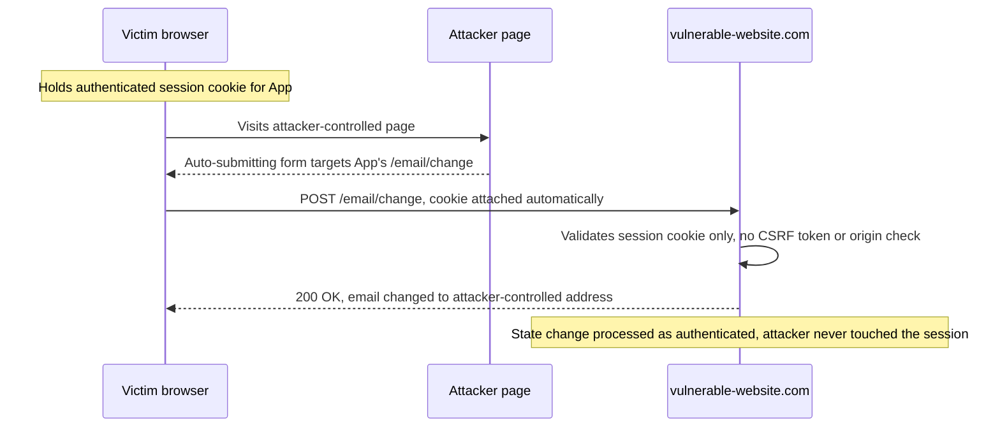

# Cross-Site Request Forgery (CSRF)

> CSRF exploits ambient authority: the browser automatically attaches the victim's credentials (session cookies, HTTP Basic auth, TLS client certificates) to every request bound for a site, no matter which page triggered the request. If the server authorizes a state change on the strength of that ambient credential alone, an attacker-controlled page can compose a request the victim's browser will send fully authenticated, and the server cannot tell the difference. The fix is never "check the cookie harder," it is "require a proof of intent that a cross-site attacker cannot supply," which is a value tied to the session that the attacker cannot read or predict, or a browser signal (SameSite, custom header, Fetch Metadata) that only same-origin code can produce.

**Interview frequency:** Core

## How it works

Three conditions must all hold for classic CSRF, and each one is simultaneously a mitigation lever:

1. **A relevant state-changing action** the attacker wants to induce: change email or password, transfer funds, grant a role, weaken a security setting.
2. **Cookie-based (ambient) session handling**: performing the action relies solely on a cookie (or other browser-attached credential) to identify the user, with no additional per-request proof. Token-in-header schemes (`Authorization: Bearer ...`) are not auto-attached cross-site, so they are largely immune to classic CSRF.
3. **No unpredictable request parameter**: the attacker can determine or guess every value needed. If changing the password requires knowing the current password, that endpoint is not CSRF-able.

The canonical vulnerable request and its forgery. Given:

```
POST /email/change HTTP/1.1
Host: vulnerable-website.com
Content-Type: application/x-www-form-urlencoded
Cookie: session=yvthwsztyeQkAPzeQ5gHgTvlyxHfsAfE

email=wiener@normal-user.com
```

The attacker hosts an auto-submitting form. The victim's browser attaches the `session` cookie automatically:

```html
<form action="https://vulnerable-website.com/email/change" method="POST">
  <input type="hidden" name="email" value="pwned@evil-user.net">
</form>
<script>document.forms[0].submit();</script>
```

Once the email is changed, the attacker triggers a password reset to that address and takes over the account. This is why "change email" and "change password" are the endpoints that matter most: they are the pivot to full account takeover.

Why the browser cooperates: cookies were designed as ambient, origin-bound (not initiator-bound) credentials. The request to `vulnerable-website.com` carries its cookies regardless of whether the initiating page was `vulnerable-website.com` or `evil.com`. CSRF is the abuse of that design decision. Note that CSRF also applies to any auto-attached credential, so HTTP Basic auth and certificate auth are equally exposed, not just cookies.<sup>[[1]](#ref1)</sup>



## Quick reference

```
# GET-based CSRF: a single tag fires a state change, no form and no JS needed

# The browser issues a credentialed GET for the image source, cookie attached automatically;
# if the endpoint accepts GET for a state change, this alone is enough to take over the account.
```

| Invariant | Where enforced | How violated | Source |
|---|---|---|---|
| A state-changing request requires proof of intent (a token) a cross-site attacker cannot supply, not just the ambient session cookie | Server-side synchronizer-token validation | Classic CSRF: cookie-based session handling with no per-request token, so any three preconditions (state change, ambient auth, no unpredictable parameter) suffice | <sup>[[4]](#ref4)</sup> |
| The token is validated on every mutating request and rejected when absent, not only checked when present | Server-side token validation middleware | Validation tied to token presence: check runs only if the parameter exists, so deleting it entirely bypasses validation | <sup>[[2]](#ref2)</sup> |
| The token is bound to the authenticated session, never drawn from a global pool or a separately-issued cookie | Token generation and storage keyed to session id | Token not tied to the session (global pool, any issued token accepted) or naive double-submit (unsigned cookie/parameter comparison) | <sup>[[2]](#ref2)</sup> |
| State-changing endpoints are never reachable by GET | Routing / HTTP method design | GET-based delivery, and method override where a POST form drives a PUT/DELETE handler while riding SameSite=Lax's top-level-GET allowance | <sup>[[3]](#ref3)</sup> |
| The browser-declared `Origin`/`Sec-Fetch-Site` is checked, and requests failing or missing it on sensitive endpoints are rejected, not allowed through | Server-side `Origin`/Fetch Metadata validation | Fail-open checks that allow the request when the header is absent, or substring-match instead of exact-match against the parsed origin | <sup>[[4]](#ref4)</sup> |
| Session cookies are scoped `SameSite=Lax`/`Strict` with the `__Host-` prefix, never a parent `Domain` shared with subdomains | `Set-Cookie` attributes | Sibling-domain compromise (XSS or open redirect on a subdomain) rides past a site-scoped SameSite check, or a parent-`Domain` cookie leaks to an uncontrolled CNAME | <sup>[[6]](#ref6)</sup> |

## Attack techniques

### 1. GET-based delivery (self-contained, no attacker site needed)

If the state change is reachable by GET, a single tag fires it with no form and no JavaScript:

```html

```

Mechanism: the browser issues a credentialed GET for the image source. Detection: check whether a normally-POST endpoint also accepts GET (many frameworks route both). Why it works: no origin proof is required, and SameSite=Lax still sends the cookie on top-level GET navigations.

### 2. POST-based delivery (auto-submitting form)

The form in "How it works" above. HTML forms can only send three content types: `application/x-www-form-urlencoded`, `multipart/form-data`, and `text/plain`. That constraint is the seam most other techniques probe.

### 3. JSON endpoints and the simple-request boundary

If the endpoint strictly requires `Content-Type: application/json` and rejects the three form-legal types, a plain HTML form cannot forge it, because a form cannot emit `application/json`. This is a real (if accidental) defense. Bypass attempts:

- Send `text/plain` shaped to resemble JSON where the server is lenient about content type:

```html
<form action="https://vulnerable-website.com/api/transfer" method="POST" enctype="text/plain">
  <input name='{"amount":1000,"to":"attacker","ignore":"' value='"}'>
</form>
```

This produces a body of `{"amount":1000,"to":"attacker","ignore":"="}` sent as `text/plain`. It works only if the server parses the body as JSON despite the content type.

- Use `fetch` from the attacker origin to set a real `application/json` header. But a custom or non-simple content type triggers a CORS preflight, and the browser will not expose the credentialed response (and will not even send the unsafe request) unless the server's CORS policy allows the attacker origin. This is precisely why a permissive CORS policy undermines CSRF defenses: it re-enables cross-origin credentialed requests that the simple-request rules were blocking.

### 4. HTTP method override

If the app honors an override parameter or header, a POST form can reach a PUT/DELETE/PATCH handler. Symfony's `_method` field is the textbook case:

```html
<form action="https://vulnerable-website.com/account/transfer-payment" method="GET">
  <input type="hidden" name="_method" value="POST">
  <input type="hidden" name="recipient" value="hacker">
  <input type="hidden" name="amount" value="1000000">
</form>
```

Other frameworks honor `X-HTTP-Method-Override`. This also doubles as a SameSite=Lax bypass: the outer request is a top-level GET navigation (cookie sent), while the server routes it as a POST.

### 5. Bypassing broken CSRF token validation

Real targets usually have some token, so the technique is finding the validation flaw (all documented by PortSwigger<sup>[[2]](#ref2)</sup>):

- **Validation tied to method**: token checked on POST but skipped on GET. Switch to GET.
- **Validation tied to token presence**: token checked when present, skipped when absent. Delete the whole parameter, not just its value:

```
POST /email/change HTTP/1.1
Host: vulnerable-website.com
Cookie: session=2yQIDcpia41WrATfjPqvm9tOkDvkMvLm

email=pwned@evil-user.net
```

- **Token not tied to the session**: the server keeps a global pool and accepts any issued token. Log in as yourself, harvest a valid token, feed it to the victim.
- **Token tied to a non-session cookie**: two frameworks (one for sessions, one for CSRF) that are not integrated. If the attacker can set the `csrfKey` cookie in the victim's browser (via a sibling-domain injection point), they pair their own token with their own key.
- **Token simply duplicated in a cookie (naive double-submit)**: the server only checks that the request parameter equals the cookie. If the attacker can set cookies on the domain, they invent a token, set it as the cookie, and submit the matching value. No server-side token store means no way to detect the forgery.

### 6. Bypassing SameSite restrictions

- **Lax bypass via GET**: servers often accept GET for POST endpoints; a top-level GET navigation still carries a Lax cookie (see technique 1 and 4).<sup>[[3]](#ref3)</sup>
- **Strict bypass via on-site gadget**: a client-side (DOM-based) open redirect on the target site issues a *same-site* secondary request that carries even Strict cookies, because the browser sees a standalone same-site request, not a cross-site one. Server-side redirects do not work for this, because the browser remembers the original cross-site initiator.
- **Sibling-domain compromise**: SameSite is site-scoped (eTLD+1), so an XSS or open redirect on `sub.example.com` counts as same-site to `app.example.com` and defeats site-based defenses. Cross-site WebSocket hijacking (CSWSH) is the WebSocket-handshake variant.
- **The Lax-plus-POST two-minute window (historical)**: when Chrome applies Lax *by default* (cookie set without an explicit `SameSite`), it does not enforce the restriction on top-level POST navigations for the first 120 seconds, to avoid breaking SSO. If the attacker can force a fresh cookie (for example by driving the victim through an OAuth login in a popup opened from an `onclick`), they refresh the cookie and then fire a cross-site top-level POST inside the window. This grace does **not** apply to cookies set with an explicit `SameSite=Lax`.

### 7. Login and logout CSRF

- **Login CSRF**: the attacker forges a login using their *own* credentials, so the victim is silently authenticated into the *attacker's* account. Anything the victim then saves (payment card, address, search history, uploaded documents) lands in the attacker's account for later retrieval. Login CSRF is also the delivery mechanism that turns self-XSS into real XSS: force-log the victim into an attacker account that already carries a stored payload. Defense: the login form needs a pre-session (anonymous) CSRF token too.
- **Logout CSRF**: on its own a nuisance, but it chains (force logout, then force login into the attacker's account).

### 8. The XSS times CSRF chain (both directions)

- **XSS defeats CSRF tokens**: script running in the origin simply reads the token out of the DOM or a same-origin response and includes it in the forged request. "We have CSRF tokens" is not a valid response to an XSS finding.
- **CSRF delivers XSS**: CSRF plants a stored-XSS payload into the victim's own account data, or force-logs them into a poisoned account, converting an unexploitable self-XSS into stored/reflected XSS in the victim's session.
- **Full chain**: CSRF a payload into a stored field, victim renders it, stored XSS runs, the script reads the CSRF token and performs privileged actions, resulting in account takeover. Being able to name each link and why it is needed is the senior-level answer.

### 9. BREACH: extracting CSRF tokens from compressed HTTPS responses

When a CSRF token is rendered into an HTTPS response that also uses HTTP-level compression (gzip or deflate) and the same page reflects any attacker-influenced input, compressed response length becomes a byte-level oracle on the token. The attacker triggers many cross-origin credentialed requests to the token-bearing page (an ``, a `fetch` with `credentials: 'include'`, or any tag that induces a subresource load), varies a reflected guess prefix, and observes the response's compressed size over the network. When the guessed prefix matches the real token, the compressor deduplicates the two occurrences and the response shrinks by a byte; iterating one character at a time recovers the whole token.

TLS does not save this because compression runs on the plaintext before encryption, so ciphertext length still leaks plaintext length. The attack does not need to read the response, only measure it, which any cross-origin credentialed request qualifies for. The prerequisites are that the target page (a) reflects attacker-controlled input somewhere on the same response body as the secret and (b) is reachable cross-origin with credentials.

Mitigations: turn off HTTP compression on responses that carry secrets, mask the token per response by XOR-ing the underlying secret with a fresh random pad (so the wire bytes change every render even though the secret is stable), split the token-bearing endpoint from any page that reflects attacker input, or add length randomization. Rotating the token per request also defeats BREACH but is expensive. Emitting a per-response-masked CSRF token is why frameworks like Rails and Django do not serialize the raw secret on the wire; the masked value is decodable server-side but distinct on every response, so the length oracle collapses.

## Defense

### Real fix

1. **Use the framework's built-in CSRF protection, validated per request and bound to the session.** Do not hand-roll. The **synchronizer token pattern** is OWASP's primary recommendation<sup>[[4]](#ref4)</sup>: the server generates a cryptographically strong, per-session (optionally per-request) token, embeds it in the form or exposes it for the client to attach, and validates it server-side on every state-changing request. Validate on *every* mutating request, reject when the token is missing (not only when present), and bind it to the authenticated session so a token minted for one user is useless for another.

2. **If you need to be stateless, use the signed double-submit cookie, not the naive one.** OWASP explicitly recommends the *signed* variant<sup>[[4]](#ref4)</sup>: the token is an HMAC computed over the server-side session ID (which never leaves the server in plaintext) plus a random value, delivered both as a cookie and echoed back in a header/field, and verified by recomputing the HMAC. Binding to the session defeats the cookie-injection attack that breaks the naive pattern. The naive double-submit (compare cookie to parameter with no signature) is discouraged because anyone who can write a cookie on the domain (vulnerable sibling subdomain, DNS takeover, plaintext-HTTP injection on a non-`__Host-` cookie) forges both halves. Do not put timestamps in the token for expiry: a CSRF token is not an access token, a new session should mint a new token.

   OWASP names three token strategies<sup>[[4]](#ref4)</sup>, and the choice depends on where you already keep state. (a) Synchronizer token is stateful and strongest; use it when you already have server-side session storage keyed to the user. (b) Signed double-submit is stateless on the CSRF path but requires a server-side session id or user id to HMAC against; use it when you want stateless verification and the app is still session-bearing. (c) Encrypted token: the server encrypts (user id, timestamp, nonce) with a server-held key and hands the ciphertext to the client, which returns it; the server decrypts and validates. This is fully stateless and does not require a session cookie at all, so it suits token-authenticated APIs that still want CSRF-style intent proof. Naive double-submit (unsigned comparison of cookie to parameter) is discouraged in every case; the interview trap is defaulting to "double-submit is stateless so it's fine" without noting that only the signed and encrypted variants resist a cookie-writing attacker.

3. **Require a custom request header for APIs and AJAX endpoints.** A header such as `X-CSRF-Token` (Rails, Laravel, Django), `X-XSRF-Token` (Angular), or even `X-Requested-With` cannot be set by a cross-site HTML form, and setting it from `fetch`/XHR forces a CORS preflight the server can reject. If the server *requires* the header, a browser could only have sent it after a successful preflight, which proves same-origin (or explicitly allowed) initiation. Pair this with a CORS policy that does not reflect arbitrary origins with credentials, otherwise the preflight guarantee is void.

4. **Validate the `Origin` header, with `Referer` as a fallback.** Invariant: on every state-changing request, the initiating origin declared by the browser must exact-match an explicit allow-list of your own origins. Why it works: browsers send `Origin` on all CORS requests and on all same-origin POST/PUT/DELETE, its value is scheme, host, and port only (no path, so it is not shortened or stripped by `Referrer-Policy` the way `Referer` is), and JavaScript on a cross-site page cannot forge it because `Origin` is a forbidden header at the fetch layer. Compared to `Referer`, `Origin` is not silenced by `<meta name="referrer" content="no-referrer">` or aggressive privacy policies; compared to Fetch Metadata, it is universally supported by every current browser. Common wrong implementations: accepting the request when both `Origin` and `Referer` are absent (fails open, the classic Referer-defense bug, which applies equally here; correct behavior is to reject on absence for sensitive endpoints), substring matching the header rather than exact-matching against a parsed origin (so `https://evil.com/?x=vulnerable-website.com` slips through), and forgetting to include the port when the app runs on a non-standard one. OWASP recommends checking `Origin` first and falling back to `Referer` only when `Origin` is genuinely missing.<sup>[[4]](#ref4)</sup>

5. **Adopt Fetch Metadata as a modern origin check where available.** Browsers send `Sec-Fetch-Site`, `Sec-Fetch-Mode`, and `Sec-Fetch-Dest`; rejecting state-changing requests whose `Sec-Fetch-Site` is `cross-site` (fail-safe on absence for sensitive endpoints) is a robust, low-friction defense. Go's standard library ships this as `net/http.CrossOriginProtection` since Go 1.25.<sup>[[5]](#ref5)</sup>

6. **Never perform state changes over GET.** Closes the SameSite=Lax gap and the ``/link delivery vector at the design level.

### Defense in depth

1. **Set SameSite on the session cookie.**<sup>[[6]](#ref6)</sup> `SameSite=Lax` (now Chrome's default when unset) kills most cross-site form-POST CSRF for free; `SameSite=Strict` for high-value apps that can tolerate the UX cost of cross-site navigations arriving unauthenticated. SameSite is not a complete fix on its own: it does not cover GET-based state changes, is undermined by same-site subdomains, has the historical Lax-plus-POST grace window, and varies by browser version. Also avoid scoping a session cookie to a parent `Domain`, which shares it with every subdomain (including CNAMEs you do not control); prefer the `__Host-` prefix.

2. **Re-authenticate or step up on the most sensitive actions.** A password or MFA re-prompt (or transaction signing) on change-password, change-email, and money movement defeats CSRF regardless of token handling, because the attacker cannot supply the fresh secret.

3. **Fix XSS.** Every control above assumes the origin is not executing attacker script. XSS reads the token and nullifies the entire list, so an XSS bug is also a CSRF bug.

## Interviewer probes

Mid: "The session cookie is SameSite=Lax by default now, so are we covered on CSRF?"

Principal: No, it's a mitigation, not a substitute for tokens. SameSite=Lax does nothing for state changes reachable by GET, doesn't apply if the cookie was explicitly set `SameSite=None`, and is defeated by same-site subdomain compromise (an XSS or open redirect on a sibling subdomain counts as same-site and rides straight past the check). It kills the cheap, generic CSRF attacks for free; it doesn't replace an actual proof-of-intent token for anything sensitive.

Mid: "Can we just check the Referer header instead of implementing CSRF tokens?"

Principal: Referer-based validation is structurally weaker than tokens because it fails open: most implementations skip the check entirely when the header is absent, and an attacker can strip it with `<meta name="referrer" content="no-referrer">` on their own page. The matching logic that's left is also commonly bypassable with substring checks. Tokens don't have an "absent" failure mode that defaults to allow.

Mid: "If a request is same-site, does that mean SameSite cookie protections and CSRF defenses see it as safe?"

Principal: Same-site (eTLD+1, scheme-aware) is not the same thing as same-origin (scheme, host, and port all matching), and conflating them is the tell. A cross-origin request can still be same-site, which is exactly why a subdomain compromise defeats SameSite cookie protection even though the browser treats it as "safe." It also cuts the other way: `http://example.com` to `https://example.com` is cross-site, because the scheme differs, even though a naive reading would call that "the same site."

Mid: "We have a permissive CORS policy for our API. Does that create any CSRF risk?"

Principal: CORS doesn't protect against CSRF at all, and a permissive policy makes CSRF strictly worse. CORS governs whether a cross-origin script can read the response; state-changing requests fire regardless of the CORS policy. If the policy reflects arbitrary origins with credentials enabled, you've additionally handed the attacker the ability to read back the authenticated response, which turns a blind forgery into one where the attacker can chain off the result.

Mid: "The session cookie is HttpOnly. Does that give us any protection against CSRF?"

Principal: No, HttpOnly and CSRF address unrelated attacker capabilities. CSRF doesn't require the attacker to read the cookie; the browser attaches it automatically regardless of who triggered the request. HttpOnly's value is against XSS-driven cookie theft, a completely different attack. A candidate who cites HttpOnly as a CSRF control is confusing the two threat models.

Mid: "We just shipped CSRF tokens on every state-changing endpoint. Are we done?"

Principal: Not if there's an XSS bug anywhere on the origin. Script running in the page can read the CSRF token straight out of the DOM or a same-origin response and attach it to a forged request itself, which nullifies every defense on this list simultaneously. "We have CSRF tokens" is not a valid answer to an XSS finding, and conversely, an unpatched XSS bug is also a live CSRF bug regardless of how strong the token implementation is.

## Sources

<a id="ref1"></a>[1] PortSwigger Web Security Academy, "CSRF". Retrieved 2026. https://portswigger.net/web-security/csrf

<a id="ref2"></a>[2] PortSwigger, "Bypassing CSRF token validation". Retrieved 2026. https://portswigger.net/web-security/csrf/bypassing-token-validation

<a id="ref3"></a>[3] PortSwigger, "Bypassing SameSite cookie restrictions". Retrieved 2026. https://portswigger.net/web-security/csrf/bypassing-samesite-restrictions

<a id="ref4"></a>[4] OWASP, "Cross-Site Request Forgery Prevention Cheat Sheet". Retrieved 2026. https://cheatsheetseries.owasp.org/cheatsheets/Cross-Site_Request_Forgery_Prevention_Cheat_Sheet.html

<a id="ref5"></a>[5] Go, `net/http.CrossOriginProtection` (Go 1.25). Retrieved 2026. https://pkg.go.dev/net/http@go1.25#CrossOriginProtection

<a id="ref6"></a>[6] MDN, "Set-Cookie: SameSite". Retrieved 2026. https://developer.mozilla.org/en-US/docs/Web/HTTP/Headers/Set-Cookie/SameSite
