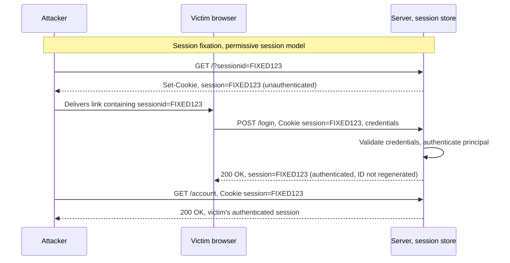

# Authentication and Session Management

> Authentication proves who you are using one or more factors (something you know, something you have, something you are/do); session management maintains that proof across otherwise stateless HTTP so the server can tie subsequent requests to the same principal. PortSwigger reduces almost every real bug to two shapes: the mechanism is too weak to resist brute force (credential stuffing, spraying, unthrottled OTP), or a logic flaw lets the flow be bypassed entirely ("broken authentication"). The blast radius is severe by construction: break authentication and you inherit everything the compromised account can see and do, and a high-privilege takeover can reach internal infrastructure. Two surfaces host most of the defects. The identity flows (login, registration, password reset, MFA) are where you guess, enumerate, or skip your way in; the token lifecycle (generation, fixation, invalidation, transport, cookie flags) is where you steal, plant, or fail to kill a session. Account takeover is the usual endgame.

**Interview frequency:** Core

*See also: [Authentication](96-authentication.md) for how this fits into the broader authentication architecture decision across web, mobile, desktop, and service-to-service contexts.*

*See also: [Session Management](101-session-management.md) for where the session continuity proof lives per surface (web, mobile, service) and how it's revoked.*

## How it works

A session is a server-side record of an authenticated principal, referenced by an opaque session ID that the browser presents on each request, normally in a cookie. The security of the whole scheme rests on three properties of that ID and its lifecycle:

- **Unpredictability**: the ID must carry at least 64 bits of entropy from a CSPRNG. OWASP's worked example<sup>[[1]](#ref1)</sup>: with 64 bits, 100,000 concurrent valid sessions, and 10,000 guesses/second, expected time to guess a live ID is roughly 585 years. Anything derived from username, timestamp, or a counter collapses that entropy and is guessable.
- **Opacity**: the ID must be meaningless (no PII, role, or state encoded in it). All business meaning lives server-side in the session store. Use the framework's session facility rather than rolling your own.
- **Correct lifecycle**: the ID must be regenerated on every privilege change, transported only over TLS, protected by cookie attributes, and destroyed server-side on logout and after credential changes.

Two session-management models matter for fixation. A **strict** implementation only accepts session IDs it generated; a **permissive** one accepts any ID the client supplies and creates a session around it. Permissive mode is the substrate for session fixation, and PHP historically defaults to permissive (`session.use_strict_mode` off), which is why explicit configuration matters.



The identity flows are where authentication decisions get made, and each is independently attackable. A senior mental model treats login, registration, password reset, password change, and MFA as five separate state machines that must all fail closed, all rate-limit, all return identical responses for valid and invalid principals, and all regenerate or invalidate sessions at the right transitions. A flaw in any one (a reset that skips MFA, a registration that leaks account existence, an OTP step reachable without the password step) undermines the others.

## Quick reference

```
# Session fixation: attacker plants a known ID before the victim logs in
GET /?sessionid=ATTACKER_KNOWN_VALUE
# If the app is in permissive mode and never regenerates the ID on login,
# the victim's authenticated session now carries the exact ID the attacker chose.
```

| Invariant | Where enforced | How violated | Source |
|---|---|---|---|
| The session is not marked authenticated until every required factor (password, then MFA) has passed | Server-side auth-state transition logic | Session cookie issued fully-authenticated at step 1, with the OTP page only displayed, never enforced (broken 2-step verification) | <sup>[[3]](#ref3)</sup> |
| Login, registration, reset, and recovery return identical messages, status codes, and timing regardless of account validity | Identity-flow response handling, including a dummy hash on the invalid-username path | Message/status differences or conditional-hashing timing let an attacker build a valid-account list (username enumeration, CWE-204) | <sup>[[2]](#ref2)</sup> |
| The session ID is regenerated on every privilege change (login, MFA completion, password change) | Session store / framework session API, strict (non-permissive) mode | A permissive model accepts an attacker-planted ID and never regenerates it at login, so the attacker shares the resulting authenticated session | <sup>[[1]](#ref1)</sup> |
| Auth cookies are host-only (`__Host-` prefix, no `Domain`) so a same-named cookie from a sibling subdomain cannot be planted into the target's cookie jar | `Set-Cookie` attributes at issuance | `Domain=example.com` cookie tossing from a compromised or attacker-controlled sibling subdomain wins the server's ambiguous same-name resolution | <sup>[[5]](#ref5)</sup> |
| Reset tokens are CSPRNG-generated, single-use, expiring, bound to one account; the reset link's host comes from server config, never the request's `Host` header | Password-reset token issuance and link construction | Host-header / `X-Forwarded-Host` poisoning delivers a genuine token to an attacker-controlled domain | <sup>[[4]](#ref4)</sup> |
| Idle and absolute session timeouts are enforced server-side, never tracked client-side | Session store TTL check on every request | A stolen token stays valid indefinitely when only a client-side timeout exists | <sup>[[1]](#ref1)</sup> |
| Password hashes use a strong adaptive KDF and are verified in constant time | Credential-storage and verification layer | Fast reject on an invalid username versus a slow adaptive-hash compare on a valid one creates a measurable timing side channel | <sup>[[6]](#ref6)</sup> |

## Attack techniques

### 1. Credential attacks: stuffing vs spraying vs brute force

Three distinct techniques with different detection signatures, and interviewers expect the distinction.

- **Credential stuffing**: replay username/password pairs leaked from other breaches. It needs no cleverness, just volume, and it works because of password reuse. It is the dominant real-world account-takeover vector.
- **Password spraying**: try a few common passwords (`Winter2026!`, `Company@123`) across many accounts to stay under per-account lockout thresholds.
- **Brute force**: exhaust the password space for a single account (or enumerate usernames, or brute the reset token/OTP).

```http
POST /login HTTP/1.1
Content-Type: application/x-www-form-urlencoded

username=alice@corp.com&password=Winter2026!
```

**Why lockout alone fails**: per-account lockout keyed on username stops single-account brute force but not spraying (one attempt per account) and not stuffing (one correct guess per account). Lockout keyed on username also becomes a denial-of-service primitive against known users. Detection must be velocity/source based, not just per-account counters.

### 2. Username enumeration (message, status, and timing side channels)

Any difference in the server's response for a valid vs invalid username lets an attacker build a valid-account list, which makes stuffing and spraying efficient. This is CWE-204 (Observable Response Discrepancy)<sup>[[2]](#ref2)</sup>. Three channels:

- **Message**: "user not found" vs "incorrect password"; registration's "email already taken"; reset's "email sent" vs "no such user".
- **Status/shape**: different HTTP status, redirect target, response length, or field-level error even when the message text matches.
- **Timing**: the classic conditional-hashing leak. A valid username triggers an expensive password hash (bcrypt/argon2) before comparison; an invalid username returns early, so the valid case is measurably slower.

```http
# Invalid user: fast reject, no hashing performed
POST /login  -> 200, ~15 ms, "Invalid username or password"

# Valid user, wrong password: server runs bcrypt, then rejects
POST /login  -> 200, ~310 ms, "Invalid username or password"
```

**Confirmation**: send matched pairs (known-valid vs random) and diff status, length, and latency distribution. Fix requires identical message, identical shape, and constant-time behavior across login, registration, reset, and recovery.

### 3. MFA / 2FA bypass

MFA is only as strong as the flow that enforces it, and the enforcement is where the bugs live.

- **Session authenticated before the second factor** (broken 2-step verification logic): the app issues a fully authenticated session at step 1 and only *displays* the OTP page. Drop the OTP request and browse straight to a post-login endpoint; you are already in.

```http
POST /login              -> 200, Set-Cookie: session=<already-authenticated>
GET  /account            -> 200   (never submitted the OTP; access granted)
```

- **No rate limit on the OTP**: a 6-digit code is only 1,000,000 possibilities. Without throttling and single-use enforcement it is brute-forceable, especially if codes are long-lived or do not rotate. Watch for lockout reset when a new code is requested, which resets the guess budget.
- **Response manipulation**: the client trusts a `{"mfaValid":false}` body; flip it to `true`. Or a step-up flow returns the authenticated cookie in the OTP-request response before verification.
- **Backup/recovery codes and "remember this device"**: single-use recovery codes with weak entropy, or a remember-device cookie with no server-side binding, become a permanent MFA bypass. OWASP notes explicitly that MFA reset/bypass processes are frequently the exploitable path<sup>[[3]](#ref3)</sup>.
- **Reset skips MFA**: complete a password reset and the app logs you in with no second factor, so account recovery becomes MFA bypass.
- **Weak factor: SMS**: susceptible to interception, SIM-swap, and number-porting (and SS7 abuse). OWASP advises not using SMS for high-value or PII-handling applications<sup>[[3]](#ref3)</sup>; where it is the only option, document the risk, rate-limit per account, monitor for SIM-swap signals, and plan migration to TOTP, push, or WebAuthn/FIDO. Push prompts are also vulnerable to MFA-fatigue (prompt bombing) unless number-matching is enforced.

### 4. Password reset flaws (a rich takeover surface)

Reset is a second, often weaker, authentication path.

- **Weak or guessable tokens**: sequential, timestamp-derived, or short tokens are brute-forceable. Tokens must be CSPRNG-generated, long, single-use, expiring, and linked to one user in the database.
- **Token leakage via Referer**: if the reset page loads third-party resources and the token is in the URL, it leaks in the `Referer` header (and in browser history and logs). OWASP's fix is a `Referrer-Policy: noreferrer` on the reset page<sup>[[4]](#ref4)</sup>.
- **Host-header / reset-link poisoning**: the reset email builds the link from a user-controllable `Host` or `X-Forwarded-Host` header, so the attacker points the link at their own domain; when the victim clicks, the token is delivered to the attacker.

```http
POST /forgot-password HTTP/1.1
Host: attacker.evil.com
X-Forwarded-Host: attacker.evil.com

email=victim@corp.com
# Victim receives: https://attacker.evil.com/reset?token=<victim-token>
```

- **IDOR / account association on reset**: the "set new password" request accepts an arbitrary `userId` or `email`, or the token is not bound to the requesting account, letting you reset someone else's password.

```http
POST /reset-password HTTP/1.1

token=<my-own-valid-token>&userId=1&new_password=Pwned123!
```

- **Account state changed before a valid token is presented**: locking or mutating the account on the *request* (not on token submission) is abusable to deny access to known users.
- **No session invalidation and auto-login**: old sessions survive the reset, or the app auto-logs-in after reset (adding session-handling complexity and skipping the normal login/MFA path).

### 5. Session token lifecycle attacks

- **Weak generation**: low-entropy or partially fixed IDs are guessable (if half of a 16-hex-char ID is fixed, only 32 bits remain, which is insufficient). Use the framework CSPRNG session store.
- **Session fixation**: in a permissive implementation, the attacker plants a known session ID in the victim's browser (via a URL parameter the app accepts, a subdomain cookie, or response-splitting/XSS), the victim logs in, and because the ID is not regenerated the attacker now shares the authenticated session. The fix is to regenerate the ID on every privilege change.

```http
# Attacker fixes a known ID; app accepts client-supplied IDs (permissive)
GET /?sessionid=ATTACKER_KNOWN_VALUE
# Victim authenticates on that same ID; if not regenerated, attacker is now logged in as victim
```

- **Insufficient invalidation**: logout clears the cookie client-side but does not destroy the server-side session, or a password change/reset does not revoke *other* active sessions. After a credential change you must revoke all sessions.
- **No idle or absolute timeout**: a stolen token stays valid indefinitely. OWASP idle-timeout guidance<sup>[[1]](#ref1)</sup> is roughly 2 to 5 minutes for high-value apps and 15 to 30 minutes for low-risk apps; absolute timeouts around 4 to 8 hours for a full workday. Timeouts must be enforced server-side; a client-tracked timeout is trivially extended.
- **Token in URL**: a session ID in the query string leaks via logs, `Referer`, browser history, and shared links, and enables fixation. Accept session IDs only from cookies, and reject IDs presented by other mechanisms.
- **Pre-auth cookie confusion**: if the app sets an unauthenticated cookie over HTTP and a separate authenticated cookie over HTTPS but does not bind and verify both, an attacker can ride the pre-auth cookie into the authenticated session.

### 6. Cookie and token-storage weaknesses

Missing cookie attributes are the difference between a stolen session and a safe one.

```http
Set-Cookie: __Host-SessionID=<64-bit-entropy-value>; Secure; HttpOnly; SameSite=Strict; Path=/
```

- **Missing `HttpOnly`**: JavaScript reads the cookie via `document.cookie`, so any XSS steals the session.
- **Missing `Secure`**: the ID can be forced over cleartext HTTP (an injected `http://` reference) and intercepted, even if the site is HTTPS-only.
- **Missing/loose `SameSite`**: enables cross-site cookie sending (CSRF). Set `Strict` (preferred) or `Lax`; never `None` without `Secure`; do not rely on the browser default, which varies.
- **No `__Host-` prefix**: without it, a subdomain or a network attacker can override the cookie. `__Host-` requires `Secure`, forbids `Domain`, and forces `Path=/`, binding the cookie to the exact host over HTTPS; it is OWASP's recommendation for session IDs<sup>[[1]](#ref1)</sup>. `__Secure-` is the weaker variant when subdomain sharing is required.
- **Over-broad `Domain`**: `Domain=example.com` shares the cookie across all subdomains, so a bug in `www` can compromise `secure.example.com` and enable cross-subdomain fixation. Omit `Domain` (host-only) and scope `Path` tightly.
- **Tokens in `localStorage`/`sessionStorage`**: any JavaScript in the origin can read them, so one XSS discloses every token; they also lack cookie protections. Use `HttpOnly; Secure; SameSite` cookies (or a Backend-for-Frontend pattern; a Web Worker can hold a secret in memory when JS access is truly required).

### 7. Login CSRF (forced authentication as the attacker)

Login CSRF is the mirror of classic CSRF. Instead of riding the victim's authenticated session to perform an action, the attacker submits their own credentials via a cross-site request so the victim's browser ends up authenticated to the attacker's account. Every action the victim then performs (saving a payment method, uploading a document, chatting with an assistant, granting an OAuth consent) lands in the attacker's account, which the attacker can later sign back into and exfiltrate.

```html
<!-- attacker.example serves this to a logged-out victim -->
<form action="https://target.example/login" method="POST" id="f">
  <input name="username" value="attacker@evil.com">
  <input name="password" value="AttackerPassword1!">
</form>
<script>document.getElementById('f').submit();</script>
```

The pattern gets worse in SSO and account-linking flows. If the victim's browser holds an attacker-planted session when they click a legitimate "link Google account" or "connect wallet" button, the victim's real identity gets stitched onto the attacker's account. Some OAuth authorization-code flows are similarly abusable when the login step is CSRF-eligible, which is one of the reasons the `state` parameter is mandatory.

The fix is to treat the login POST as a state-changing action rather than an idempotent read. Emit an anti-CSRF token on the pre-auth page and require it on submit, set `SameSite=Strict` (or at minimum `Lax`) on any pre-auth cookie the flow relies on, and verify `Origin`/`Referer` on the login endpoint. Interviewers use this to check that the candidate does not believe "CSRF only matters after authentication".

### 8. Cookie tossing (subdomain cookie override)

Cookie tossing is the concrete attack the `__Host-` prefix defends against. An attacker who controls or XSSes a sibling subdomain (`blog.example.com`, `staging.example.com`, an abandoned marketing property) issues a `Set-Cookie` for `Domain=example.com` with a chosen `Path`, and the browser will attach that planted cookie to requests to `secure.example.com` alongside (or instead of) the legitimate one.

```
# Attacker controls blog.example.com and responds with:
Set-Cookie: SessionID=ATTACKER_KNOWN_VALUE; Domain=example.com; Path=/

# Browser now sends BOTH cookies to secure.example.com:
Cookie: SessionID=ATTACKER_KNOWN_VALUE; SessionID=<victim-legit>
```

RFC 6265<sup>[[5]](#ref5)</sup> does not mandate an ordering the server can reliably disambiguate between a host-only cookie and a domain cookie of the same name, so the target server frequently reads the attacker's planted value first. If the app also has a permissive session model, that is session fixation across the subdomain boundary; even where fixation is blocked, the attacker has poisoned other cookies (CSRF tokens, feature flags, cart state) that the auth surface trusts. A related shape is a network attacker on cleartext HTTP for any sibling subdomain planting the same cookie, which `Secure` alone does not prevent because the browser writes it into the shared jar.

The defenses stack: use the `__Host-` prefix so the cookie is host-only, forbids `Domain`, and forces `Path=/` over HTTPS; never share the auth cookie via `Domain=example.com`; treat every subdomain as inside the auth trust boundary and audit them for XSS and takeover; and on the server reject requests that present duplicate cookies of the same name rather than picking one. The senior answer names the attack, not just the prefix.

### 9. Magic-link login (passwordless email flows)

Magic-link login (email-a-link, click-to-sign-in patterns popularized by Slack, Notion, and Substack) shares the password-reset flow's weaknesses and adds new ones specific to being a login primitive. The link itself is a bearer token in a URL, so it leaks via `Referer` when the confirmation page loads third-party assets, via browser history, via corporate email-security link-rewriters that pre-fetch the URL to inspect it (which can burn a single-use token before the user clicks), and via shared mailboxes and forwarded messages.

Attackers exploit two shapes. The pre-fetch race: an enterprise mail scanner or preview generator hits the link first, consuming the token, so the user's click fails; the user then requests a new link, and the flood of expiring tokens plus repeated emails is a phishing amplifier. The MFA-skip shape: many magic-link implementations treat "email delivery" as the second factor and drop TOTP/WebAuthn on the click, so an attacker who compromises the inbox (credential stuffing on the mail provider, session cookie theft, or a rogue Gmail add-on) inherits the target account without ever facing MFA.

The defense is to bind the token to the browser that requested it: set a pre-auth cookie at request time and require the same cookie be present when the link is clicked, so a link opened in a different browser or by an inline mail scanner fails closed. Keep tokens short-lived and single-use, still require MFA (or step-up) on the click even for magic-link flows, land on a POST-confirmation page instead of GET-on-click so link scanners cannot silently consume the token, and set `Referrer-Policy: noreferrer` on the confirmation page. The interview trap is claiming passwordless removes the shared secret without acknowledging that a magic link *is* a shared secret with a delivery channel weaker than TLS.

## Defense

### Real fix

1. **Prefer phishing-resistant, passwordless authentication where feasible.** WebAuthn/FIDO2 passkeys bind the credential to the origin and use a device-held private key, so they resist phishing and credential replay while being frictionless; SAML and OIDC are the federated equivalents. This removes the shared-secret that stuffing and spraying depend on.
2. **Enforce MFA so the session is not authenticated until all factors pass.** Never issue an authenticated session before the second factor; make the OTP step require a completed first step; rate-limit and expire OTPs and enforce single use; prefer TOTP/push-with-number-matching/WebAuthn over SMS. Provide single-use recovery codes issued at enrollment, and treat MFA reset/bypass as a high-risk flow that itself demands strong identity proofing. Consider requiring more than one MFA type so users do not lose all factors at once.
3. **Kill username enumeration everywhere.** Return one generic response ("Invalid username or password") for login, registration, reset, and recovery regardless of whether the account exists, keep the response shape identical, and equalize timing (run a dummy hash for non-existent users so the valid and invalid paths take the same time). Note the UX tradeoff and accept it for these flows.
4. **Strong session management.** Use CSPRNG session IDs with at least 64 bits of entropy from the framework store; keep the ID opaque (no PII/state). Regenerate the ID on every privilege change (`session_regenerate_id(true)` in PHP, `HttpSession.invalidate()` then a fresh session in J2EE, `Session.Abandon()` plus a new cookie in ASP.NET) to kill fixation; use a strict model that rejects client-supplied IDs; use different token names pre- and post-authentication. Enforce idle and absolute timeouts server-side, destroy the server-side session on logout (`session_destroy()`/`unset()`, `HttpSession.invalidate()`, `Session.Abandon()`), and revoke all sessions on password change/reset.
5. **Secure cookies and transport.** Set `HttpOnly; Secure; SameSite=Strict` (or `Lax`) with the `__Host-` prefix and tight `Path`, omit `Domain`, and never put tokens in URLs or web storage. Serve the entire session over HTTPS with HSTS (do not switch between HTTP and HTTPS mid-session), and set `Cache-Control: no-store` on responses carrying session IDs; emit `Clear-Site-Data` on logout.
6. **Robust password reset.** Issue long, single-use, expiring, CSPRNG tokens bound to one account, delivered out-of-band. Build reset links from a server-side allowlisted host, never from the `Host`/`X-Forwarded-Host` header, and set `Referrer-Policy: noreferrer` on the reset page. Do not mutate or lock the account until a valid token is presented, do not auto-login after reset, notify the user by email, and invalidate existing sessions.
7. **Secure password storage and comparison.** Store password hashes with a strong adaptive KDF (Argon2id, scrypt, bcrypt, or PBKDF2 with per-user salt; see the Password Storage Cheat Sheet<sup>[[6]](#ref6)</sup>), allow a maximum length of at least 64 characters, and compare hashes and tokens with constant-time functions to avoid timing leaks.

### Defense in depth

1. **Rate limiting, breached-password screening, and adaptive friction on every identity flow.** Throttle login, reset, and OTP by source and velocity, not only per account. Block common and previously breached passwords (check against Have I Been Pwned / Pwned Passwords or the NCSC top-100k list). Layer CAPTCHA and risk-based (adaptive) authentication that escalates on anomalies (new country, Tor exit node, impossible travel) with step-up verification or a lock.
2. **Least privilege for credentials and keys; monitor and alert.** Short-lived, scoped, rotated API keys that are never logged; log the session lifecycle (creation, use, destruction) and alert on velocity, spray patterns, impossible travel, and repeated resets.

## Interviewer probes

Mid: "The login endpoint locks the account after 5 failed attempts. That covers brute-force risk, right?"

Principal: It covers single-account brute force and nothing else. Credential stuffing needs only one correct guess per account, so a 5-attempt lockout never triggers. Password spraying stays under the threshold by design, a handful of common passwords across many accounts. Worse, a lockout keyed on username becomes a denial-of-service primitive: an attacker who knows a valid username can lock a legitimate user out on demand. Detection for stuffing and spraying has to be velocity- and source-based, not per-account counters, and username enumeration still leaks the account list this lockout is supposedly protecting regardless.

Mid: "Login and password reset return identical error messages and status codes for valid and invalid usernames. Is enumeration solved?"

Principal: Not necessarily. Even with identical messages and status codes, conditional password hashing leaks account validity through response timing: a valid username triggers an expensive bcrypt/argon2 comparison before rejection, an invalid one returns fast. That latency difference is measurable and distinguishes real accounts from fake ones just as reliably as a different error string would. The fix that actually closes it is running a dummy hash on the invalid-username path so both cases take comparable time, which is the detail that separates "we return the same error string" from an actually-closed side channel.

Mid: "MFA is enabled on this application. Are we good on the authentication side?"

Principal: "MFA is enabled" isn't the question; where in the flow it's enforced is. Is the session authenticated before or after the second factor, meaning can you drop the OTP request and browse straight to an authenticated endpoint? Is the OTP endpoint reachable directly and brute-forceable, given a 6-digit code is only a million possibilities? Can the client-side response that says whether the OTP was valid be flipped? Does password reset or a remember-device cookie skip the second factor entirely? Most real MFA bypasses are broken flow logic, not broken cryptography, so "MFA is enabled" without answering those is an incomplete answer.

Mid: "You found a session-related bug, is it fixation, hijacking, or CSRF?"

Principal: Those are three different bugs with three different fixes, and conflating them is a real red flag in an interview. Fixation is the attacker planting a known session ID before the victim logs in, on a permissive session model that doesn't regenerate the ID on privilege change, fixed by always regenerating on login. Hijacking is the attacker stealing a live session ID after the fact, fixed by HttpOnly/Secure and short lifetimes so there's less to steal and less time to use it. CSRF is the attacker riding the victim's already-authenticated cookie to perform an action they didn't intend, fixed by SameSite and anti-CSRF tokens. Each fix addresses a different point in the session's lifecycle; applying the wrong one leaves the actual bug open.

Mid: "The team says logout is implemented. What would you check before taking that at face value?"

Principal: Whether logout destroys the server-side session record or only clears the client-side cookie; if it's the latter, the session ID is still valid server-side and usable by anyone who captured it beforehand. Also whether a password change or reset revokes other live sessions, not just the one that changed the password, since otherwise a stolen session survives the exact event meant to kill it. Stateless JWTs make this worse: you can't invalidate one server-side unless you keep expiry very short or maintain a revocation list, which is a real architectural tradeoff worth naming rather than glossing over.

Mid: "A password reset got attacked and the victim never saw a phishing link or any XSS. How would that even be possible?"

Principal: The most likely mechanism is Host-header reset-link poisoning. If the app builds the reset email's URL from the request's `Host` or `X-Forwarded-Host` header instead of a server-side allowlisted value, an attacker submits the forgot-password request with a spoofed Host pointing at their own domain, and the legitimate app generates and emails a real reset token embedded in a link that resolves to the attacker's server. The victim clicks what looks like a normal reset email and hands the token straight to the attacker. The fix is building the link from an allowlisted host on the server side, never trusting the request's Host header for anything security-relevant.

Mid: "Would you bind the session cookie to the client's IP address to prevent stolen-cookie replay?"

Principal: Mostly wrong for a consumer application, and it's a good test of whether someone has actually operated auth in production. Strict IP or /24 binding does raise the bar on replaying a stolen cookie, but it breaks legitimate users constantly: mobile carriers rotate IPs, corporate NAT churns, IPv6 privacy addresses change, and you'll page support every time someone walks from Wi-Fi to LTE. User-Agent binding is nearly free and catches naive theft, but a competent attacker just replays the header, so it's a weak sanity check at best. The better answer is binding loosely, logging the drift, and feeding coarser signals, ASN change, country change, impossible travel, into risk-based step-up or re-authentication rather than hard-invalidating the session. Strict binding is only defensible for narrow, high-assurance internal tools with a known user population and network egress.

## Sources

<a id="ref1"></a>[1] OWASP, "Session Management Cheat Sheet". OWASP Cheat Sheet Series. Retrieved 2026. https://cheatsheetseries.owasp.org/cheatsheets/Session_Management_Cheat_Sheet.html

<a id="ref2"></a>[2] MITRE, "CWE-204: Observable Response Discrepancy". MITRE CWE. Retrieved 2026. https://cwe.mitre.org/data/definitions/204.html

<a id="ref3"></a>[3] OWASP, "Multifactor Authentication Cheat Sheet". OWASP Cheat Sheet Series. Retrieved 2026. https://cheatsheetseries.owasp.org/cheatsheets/Multifactor_Authentication_Cheat_Sheet.html

<a id="ref4"></a>[4] OWASP, "Forgot Password Cheat Sheet". OWASP Cheat Sheet Series. Retrieved 2026. https://cheatsheetseries.owasp.org/cheatsheets/Forgot_Password_Cheat_Sheet.html

<a id="ref5"></a>[5] RFC 6265, "HTTP State Management Mechanism". IETF. April 2011. https://datatracker.ietf.org/doc/html/rfc6265

<a id="ref6"></a>[6] OWASP, "Password Storage Cheat Sheet". OWASP Cheat Sheet Series. Retrieved 2026. https://cheatsheetseries.owasp.org/cheatsheets/Password_Storage_Cheat_Sheet.html
