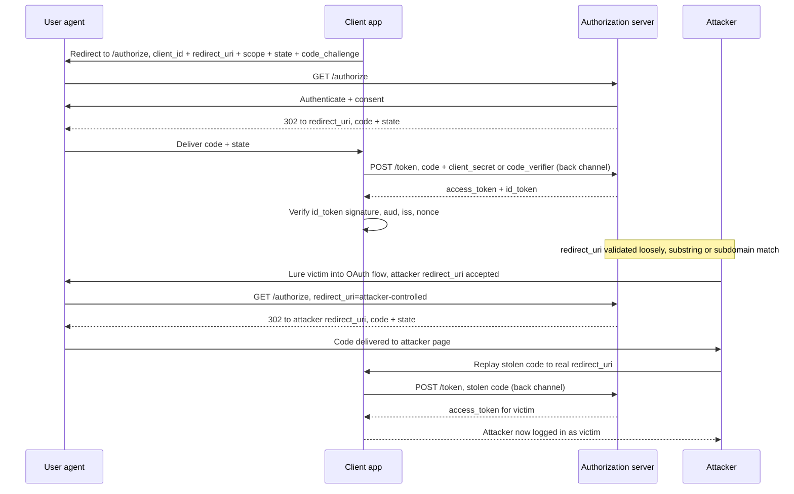

# OAuth 2.0 and OpenID Connect (OIDC)

> **Mental model:** OAuth 2.0 is a delegated *authorization* framework (issue a scoped token so app A can call resource server R on behalf of user U). OIDC bolts *authentication* on top (an `id_token`, a signed JWT that asserts who logged in). The framework is deliberately under-specified with almost no mandatory security features, so nearly every real bug is an implementation gap: attacker-controllable routing (`redirect_uri`), a missing CSRF binding (`state`), replay across audiences, or the client treating "I received a valid-looking token/profile" as proof of identity. Endgame is almost always full account takeover.

**Interview frequency:** Core

*See also: [Authentication](96-authentication.md) for how this fits into the broader authentication architecture decision across web, mobile, desktop, and service-to-service contexts.*

## How it works (protocol breakdown)

Three (or four) parties:

- **Resource owner**: the user U who owns the data.
- **Client**: the app that wants access. *Confidential* clients (server-side) can hold a `client_secret`; *public* clients (SPAs, mobile, desktop) cannot.
- **Authorization server (AS)**: issues tokens after the user authenticates and consents. Exposes `/authorize` (front channel, via browser) and `/token` (back channel, server-to-server).
- **Resource server (RS)**: the API that accepts the access token. In OIDC-as-SSO, the "RS" is often the AS's `/userinfo` endpoint.

Two channels matter for every attack:

- **Front channel** = through the victim's browser (redirects, URL params/fragments). Anything here is attacker-observable and attacker-influenceable.
- **Back channel** = direct server-to-server HTTPS. An external attacker cannot read or tamper with it, which is exactly why moving secrets to the back channel is the fix for so many bugs.

### Authorization Code grant (the correct default)

```
1. Client -> browser -> AS  /authorize:
   GET /authorize?response_type=code
       &client_id=CLIENT
       &redirect_uri=https://client.com/callback
       &scope=openid%20profile%20email
       &state=RANDOM_CSRF
       &code_challenge=BASE64URL(SHA256(verifier))   # PKCE
       &code_challenge_method=S256
2. User authenticates + consents at the AS.
3. AS -> browser -> client callback:
   302 https://client.com/callback?code=AUTH_CODE&state=RANDOM_CSRF
4. Client -> AS  /token   (BACK CHANNEL):
   POST /token
   grant_type=authorization_code&code=AUTH_CODE
   &redirect_uri=https://client.com/callback
   &client_id=CLIENT&client_secret=SECRET       # or code_verifier for PKCE
5. AS -> client: { access_token, refresh_token, id_token, expires_in, scope }
6. Client -> RS: Authorization: Bearer <access_token>
```

The `code` is a short-lived, single-use, back-channel-redeemable artifact. Even if it leaks in the front channel, redemption requires the `client_secret` (confidential clients) or the PKCE `code_verifier` (public clients), so a bare stolen code is useless against a correctly configured AS. That is the whole security argument for preferring code over implicit.



### Implicit grant (legacy, deprecated)

`response_type=token` returns the access token directly in the URL fragment (`#access_token=...`). No back-channel exchange, so the token is exposed in browser history, `Referer`, and any JavaScript on the callback page. The OAuth 2.0 Security BCP (RFC 9700)<sup>[[1]](#ref1)</sup> deprecates it; OAuth 2.1 removes it. If you see `response_type=token` in the wild, that is a finding by itself.

### PKCE (Proof Key for Code Exchange, RFC 7636)

Client generates a random `code_verifier`, sends `code_challenge = SHA256(verifier)` on `/authorize`, then presents the raw `verifier` on `/token`. The AS binds the issued code to the challenge and rejects redemption without the matching verifier. Originally for public clients (no secret to protect the code), now recommended for *all* clients by RFC 9700<sup>[[1]](#ref1)</sup> and mandatory in OAuth 2.1. Two downgrade risks: an AS that silently ignores PKCE, and acceptance of `code_challenge_method=plain` (verifier == challenge, no hashing, defeats the point).

### OIDC on top

OIDC adds:

- **`id_token`**: a signed JWT with identity claims (`iss`, `sub`, `aud`, `exp`, `iat`, `nonce`, and profile claims). This is the authentication assertion, meant to be *consumed by the client*, not presented to APIs.
- **`nonce`**: client-generated value echoed inside the `id_token` to bind it to this specific auth request (anti-replay), complementing `state` (which binds the redirect/CSRF).
- **`/userinfo`** endpoint and the **discovery document** at `/.well-known/openid-configuration` (and `/.well-known/oauth-authorization-server`), which leaks supported endpoints, grant types, and features. Always pull these during recon; they often reveal a wider attack surface (dynamic registration, `request_uri`, `web_message` response mode) than the docs mention.

## Quick reference

```
redirect_uri=https://client.com.evil.com/cb
# Loose substring/suffix matching treats "client.com" as a valid prefix,
# so the AS happily redirects the code (or token) to evil.com instead.
```

| Invariant | Where enforced | How violated | Source |
|---|---|---|---|
| `redirect_uri` is validated by exact string match, both at `/authorize` and again at `/token` | AS redirect validator (front channel) plus a repeated check at the token endpoint (back channel) | Substring/subdomain matching, `@`-in-URL tricks, path traversal, or parameter pollution deliver the code/token to an attacker host; an AS that skips the `/token` re-check lets a leaked code be redeemed anyway | <sup>[[1]](#ref1)</sup> |
| The authorization code is redeemable only via the back channel, and only with the `client_secret` or the matching PKCE `code_verifier` | `/token` endpoint, code-to-challenge binding | An AS that silently ignores PKCE, or accepts `code_challenge_method=plain`, lets a bare stolen code be redeemed with no proof of possession | <sup>[[9]](#ref9)</sup> |
| `state` is generated per flow, bound to the initiating session, and verified on callback | Client's pre-auth session state | A missing or unvalidated `state` has no CSRF binding, enabling login-CSRF and forced account-linking | <sup>[[1]](#ref1)</sup> |
| `id_token` signature, `iss`, `aud`, and `nonce` are all validated before trust, and an `id_token` is never accepted as an API credential | Client-side `id_token` validation / resource-server token-type check | Skipping `typ`/`aud` checks lets an `id_token` obtained via login be replayed as a bearer access token | <sup>[[2]](#ref2)</sup> |
| The AS includes `iss` in the authorization response, and a multi-IdP client verifies it before touching `/token` | AS authorization response + client callback verification | A single shared callback across multiple IdPs with no `iss` check lets a legitimate code minted by one IdP be sent to a different IdP's token endpoint (IdP mix-up) | <sup>[[3]](#ref3)</sup> |
| Any refresh token is redeemable at most once; re-presentation of an already-consumed token revokes its entire family | AS refresh-token rotation and lineage tracking | Rotating tokens without keeping the family graph makes reuse look like a fresh redemption, silently missing the theft signal | <sup>[[1]](#ref1)</sup> |
| Sensitive authorization-request parameters (`scope`, `redirect_uri`, `code_challenge`) travel only over the back channel, never modifiable in transit | Pushed Authorization Requests (`/par` endpoint, opaque `request_uri`) or a signed JAR request object | Without PAR/JAR, `redirect_uri` swapping, scope upgrade, and PKCE downgrade are all reachable directly on the front-channel `/authorize` call | <sup>[[5]](#ref5)</sup> |

## Attack techniques

### 1. redirect_uri manipulation (the number-one class)

The AS delivers the code/token to `redirect_uri`. If validation is loose, the secret is delivered to the attacker. Probe how it is validated:

```
# Loose prefix/substring matching:
redirect_uri=https://client.com.evil.com/cb
redirect_uri=https://client.com@evil.com/cb
redirect_uri=https://client.com/cb/../../evil        # path traversal on the domain
# Parser differential across components (PortSwigger "Hidden OAuth Attack Vectors"):
redirect_uri=https://default-host.com &@foo.evil.net#@bar.evil.net/
# Parameter pollution:
?redirect_uri=https://client.com/cb&redirect_uri=https://evil.net
# localhost allowances leaking to prod:
redirect_uri=https://localhost.evil.net/cb
```

Changing *other* parameters can loosen `redirect_uri` parsing: flipping `response_mode` from `query` to `fragment`, or noticing that `web_message` response mode is supported, often widens which subdomains/paths are accepted. Why it works: two components of the AS (the validator and the redirector) disagree about which part of the URL is the host, the same class of parser confusion as SSRF and CORS origin bugs.

### 2. Stealing codes/tokens via a whitelisted-domain proxy page

Against strict exact-match validation you often cannot submit an external host, but you may be able to point `redirect_uri` at *another page on the whitelisted domain* that leaks the code/token onward:

- An **open redirect** on the client domain forwards the victim (with `?code=` or `#access_token=`) to the attacker.
- **Dangerous JS / insecure web messaging** (`postMessage` gadgets) that reflects query/fragment to another origin.
- **XSS** on a reachable path: normally XSS is time-limited and blocked from `HttpOnly` cookies, but stealing an OAuth code/token yields the victim's account in the *attacker's* browser, hugely amplifying impact.
- **HTML injection** with no JS: `` leaks the full callback URL (including `?code=`) via the `Referer` header on some browsers.

Directory-traversal in the callback path is the usual pivot: `redirect_uri=https://client.com/oauth/callback/../../some/injectable/page`.

### 3. CSRF via missing state (account hijack through linking)

If the client omits or fails to validate `state`, the OAuth flow has no CSRF token. On a site that supports both password login and "link a social account," the attacker:

```
1. Attacker starts the OAuth flow with their OWN social account, captures the callback
   URL containing THEIR code, but does not follow it.
2. Attacker delivers that callback URL to a logged-in victim (image, iframe, link).
3. Victim's browser hits /callback?code=ATTACKER_CODE, linking the attacker's social
   identity to the victim's account. Attacker now logs in as the victim via social login.
```

`state` and `nonce` alone do not stop code/token *leakage* attacks (the attacker generates fresh values from their own browser), but a session-bound `state` does stop this CSRF-linking and login-CSRF class. Distinguish the two in an interview.

### 4. Leaking codes/tokens through a lax AS (the classic ATO)

Applies to the **code grant** specifically. Implicit has no redeemable artifact to intercept and replay; the access token itself is the thing that leaks, and leaking it grants access immediately with no further step, so implicit is strictly worse here, not exempt.

If the AS mis-validates `redirect_uri`, the attacker CSRFs the victim into an OAuth flow whose code lands at an attacker page. The attacker then replays that stolen code to the client's *real* `/callback`; the client, not the attacker, performs the `/token` exchange, and the resulting session lands in the attacker's browser under the victim's identity.

Whether that replay succeeds depends on what the client presents at `/token`. A **confidential client** already holds its `client_secret` server-side, so the exchange completes with nothing extra from the attacker, PKCE or not. A **PKCE-protected public client** only completes it if the attacker's browser also holds the matching `code_verifier`<sup>[[9]](#ref9)</sup> — normally it does not, since the verifier is generated and stored locally by whichever browser called `/authorize` for that code, not the one that later replays it. PKCE bound correctly (per-attempt, `S256`) closes this specific replay; an AS that doesn't require it, or accepts `code_challenge_method=plain`, or a client that stores the verifier somewhere replayable (a predictable value, shared across tabs) reopens it. That's why RFC 9700 recommends PKCE for confidential clients too<sup>[[1]](#ref1)</sup>, not just public ones: it is the independent fix for the *replay*, where exact `redirect_uri` re-validation at `/token` is the fix for the *leak*. An AS needs both; either alone still leaves the other half of this attack open.

### 5. Flawed scope validation (scope upgrade)

The token should carry only the consented scope. If the AS does not re-validate:

- **Code flow**: the attacker's registered client adds an extra `scope` at `/token` (`scope=openid email profile`) beyond what the user approved; a lax AS mints the upgraded token.
- **Implicit flow**: the attacker replays a stolen token to `/userinfo` with an added `scope` param, gaining data without re-consent as long as it stays within the client's previously granted ceiling.

### 6. Implicit-grant identity spoofing

In implicit SSO, the client often POSTs `{ userid, access_token }` to its own server to establish a session. The server has no secret to check against, so it *implicitly trusts* the POST. If it does not verify that the token actually belongs to that user (by calling the AS), the attacker swaps `userid` to any value and logs in as anyone.

### 7. Unverified user registration (email confusion)

If the AS lets users register/assert an email without verifying it, and the client links accounts by email claim, an attacker registers at the IdP with the victim's email and logs into the victim's account at the client. Fix side: require verified emails and key on the stable, provider-unique `sub`, not raw email.

### 8. OIDC-specific: id_token validation and dangerous features

- **`id_token` signature/claim validation**: same JWT pitfalls, see [13-jwt-token-security.md](13-jwt-token-security.md): `alg=none`, RS256->HS256 confusion, unchecked `iss`/`aud`/`exp`/`nonce`. An `id_token` accepted without verifying the signature against the IdP's JWKS and without checking `aud`==your client_id is a full auth bypass.
- **`id_token` used as an access token** (or vice versa): different audiences and purposes; a confused-deputy replay. Full mechanism, the RFC 9068<sup>[[2]](#ref2)</sup> fix, and the exact interviewer probe on this distinction are in [13-jwt-token-security.md](13-jwt-token-security.md#attack-techniques), attack technique 11.
- **Unprotected dynamic client registration** (`/register`): if open, an attacker registers a client with attacker-controlled `jwks_uri`/`logo_uri`/`redirect_uris`, enabling SSRF (server fetches `logo_uri`) or key control.
- **Request by reference (`request_uri`)**: if the AS fetches an attacker-supplied `request_uri`, that is SSRF, and it can also smuggle parameters the AS trusts.

### 9. IdP mix-up

IdP mix-up targets clients that federate to multiple identity providers and let the user pick which one at login time. The victim clicks "log in with HonestIdP", but an attacker sitting on the discovery or selection page (or via a manipulated login button on a page under partial attacker control) swaps the client's internal state so the flow the client believes it is running is against EvilIdP, while the browser still redirects to HonestIdP (or vice versa). The user authenticates at HonestIdP normally and their browser returns to the client's callback with a legitimate code minted by HonestIdP.

The client now takes that code and, because its internal state says "we are talking to EvilIdP", POSTs it (along with its EvilIdP-registered `client_id`/`client_secret`, or worse, its HonestIdP secret sent to EvilIdP's `/token`) to the attacker-controlled endpoint. EvilIdP obtains an honest-IdP-minted code and, depending on how the client stored per-IdP secrets, credential material as well. The attacker can then redeem the code at HonestIdP or replay captured secrets, all against a user who did nothing unusual.

The fix is RFC 9207<sup>[[3]](#ref3)</sup>: the AS includes an `iss` parameter in the authorization response, and the client verifies before touching `/token` that `iss` matches the IdP it thought this flow belonged to. Per-IdP callback URLs (each IdP lands on a distinct endpoint) achieve the same integrity check by construction. A multi-IdP client with a single callback URL and no `iss` check is vulnerable, and it is a common gap even in mature deployments.

### 10. Device code phishing and illicit consent grant

The device authorization grant (RFC 8628)<sup>[[4]](#ref4)</sup> is designed for input-constrained devices such as TVs and CLIs. The client polls the AS, receives a `user_code` and a `verification_uri`, and instructs the user to visit the URL on a phone or laptop and enter the code. Attack: the phisher initiates a device flow themselves against the real IdP, then sends the victim a message containing the legitimate `verification_uri` and the attacker's `user_code`. The victim visits a real IdP URL, authenticates normally (MFA and all), and approves what looks like their own sign-in. The AS mints tokens to the attacker's polling client. There is no `redirect_uri` involved, the domain in the URL bar is genuinely the IdP, and phishing-resistant MFA (WebAuthn) does not help because the user really is authenticating.

The closely related class is illicit consent-grant phishing. The attacker registers a lookalike OAuth client at the target IdP with an innocuous name (something like `Microsoft Reader` or `Slack Backup`) and requests high-value scopes such as `Mail.Read` plus `offline_access`. The victim receives a normal `/authorize` link, clicks it, sees the real consent screen at the real IdP, and approves. The attacker now holds a long-lived refresh token to the victim's mailbox or drive without a password ever crossing the wire, and rotating the user's password does not revoke the grant.

Defenses live at the tenant/IdP layer, not at the client: require admin consent for high-privilege scopes, block unverified publishers, restrict or disable the device code flow to specific tenants and network locations, use short `verification_uri` TTLs, and audit the granted-consents surface as a first-class security control alongside password and MFA state. This class is the reason "phishing-resistant MFA" is not a complete answer to phishing: the user is legitimately authenticating; only the party receiving the resulting tokens is wrong.

## Defense

### Real fix

**Client applications:**

1. **Use Authorization Code + PKCE for everything.** Retire implicit and any front-channel token delivery. Confidential clients keep `client_secret` server-side; public clients rely on PKCE with `S256` (never `plain`).
2. **Generate, session-bind, and verify `state`** on every flow (CSRF), and **`nonce`** for OIDC (id_token replay). Reject callbacks whose `state` does not match the initiating session.
3. **Exact-match your own `redirect_uri`** and register the fewest, most specific callback URLs. Eliminate open redirects and `postMessage`/reflection gadgets on any registrable callback host, since those become token-exfil primitives.
4. **Validate the `id_token` rigorously**: signature against the IdP JWKS with the algorithm pinned, plus `iss`, `aud` (== your client_id), `exp`, `iat`, and `nonce`. Never accept an `id_token` as an API credential.
5. **Link accounts on verified `sub` + verified email**, never raw email; require re-auth for sensitive linking.

**OAuth service providers:**

1. **Require exact `redirect_uri` whitelisting** (full string, no substring/subdomain/wildcard) and re-check `redirect_uri` at `/token`.
2. **Enforce PKCE and reject `plain`.** Bind codes to the client and challenge; make codes single-use and short-lived.
3. **Re-validate `scope`** at every step; never let `/token` or `/userinfo` grant scope beyond the original consent.
4. **Lock down dynamic registration and `request_uri`** (auth required, allowlist fetch targets) to prevent SSRF/key-injection.
5. **Rotate refresh tokens and detect reuse.** Invariant enforced: any refresh token is redeemable at most once, and re-presentation of a consumed token is treated as evidence of theft. Why it works: every `/token` call using a refresh token must return a new refresh token and invalidate its predecessor, with the AS tracking token lineage as a family; if a rotated (already-consumed) refresh token is ever presented again, the AS revokes the entire family and forces re-authentication. RFC 9700<sup>[[1]](#ref1)</sup> makes rotation mandatory for public clients (SPAs, mobile) and recommended for confidential clients. Common wrong implementation: issuing rotating refresh tokens without keeping the family graph (so reuse is silently accepted as a fresh redemption), or rotating but leaving the old token valid until natural expiry. A long-lived, non-rotating bearer refresh token in SPA localStorage is the modern equivalent of the implicit-grant footgun.
6. **Support Pushed Authorization Requests (PAR, RFC 9126) and consider requiring it for high-assurance clients.**<sup>[[5]](#ref5)</sup> Invariant enforced: the authorization request parameters (`scope`, `redirect_uri`, `response_type`, `code_challenge`, `resource`) cannot be modified by anything sitting between the client and the AS. Why it works: in PAR the client POSTs the full request to a `/par` endpoint over the back channel with client authentication, receives an opaque short-lived `request_uri`, and only then redirects the browser to `/authorize?client_id=...&request_uri=urn:...`. Nothing sensitive traverses the front channel, so `redirect_uri` swapping, `scope` upgrade at `/authorize`, and PKCE downgrade all become impossible. JAR (RFC 9101)<sup>[[6]](#ref6)</sup> achieves comparable integrity by signing the request as a JWT in the `request` parameter, though the alternative `request_uri` fetch variant is itself an SSRF sink if fetch targets are not allowlisted. PAR is the FAPI 2.0 baseline and the RFC 9700<sup>[[1]](#ref1)</sup> recommendation for anything above trivial risk. Common wrong implementation: offering PAR as an option but still accepting the same parameters when passed directly to `/authorize`, which leaves the pre-PAR attack surface intact.

### Defense in depth

**Client applications:**

1. **Adopt sender-constrained access tokens where the platform allows it.** Invariant enforced: possession of the token bytes alone is not sufficient to use them; the client must additionally prove possession of a private key on every request. Why it works: mTLS-bound tokens (RFC 8705)<sup>[[7]](#ref7)</sup> embed a hash of the client's TLS certificate in the token's `cnf.x5t#S256` claim and the RS rejects the token unless mTLS completes with the matching cert; DPoP (RFC 9449)<sup>[[8]](#ref8)</sup> is the JS-friendly variant where the client generates an ephemeral keypair, signs a per-request JWT covering method, URL, timestamp, and access-token hash in a `DPoP` header, and the token carries the public-key thumbprint in `cnf.jkt`. Either mechanism turns a token leaked via a log, a proxy, or an XSS exfiltration into a useless artifact, but neither one prevents the OAuth-flow bugs above, it only limits what a leaked token is worth. Common wrong implementation: issuing DPoP-bound tokens but having the RS silently accept them as bearer when the `DPoP` header is missing, which erases the guarantee.

**OAuth service providers:**

1. **Offer sender-constrained access tokens (mTLS via RFC 8705<sup>[[7]](#ref7)</sup> or DPoP via RFC 9449<sup>[[8]](#ref8)</sup>).** Invariant enforced: token issuance embeds a proof-of-possession key thumbprint (`cnf.x5t#S256` or `cnf.jkt`) that the RS validates on every request. Same tradeoff as the client-side version: it narrows blast radius after a leak, it does not close the redirect_uri/state/scope classes above. Common wrong implementation: issuing bound tokens but allowing bearer fallback at the RS.

Adopt the hardening RFCs explicitly: **RFC 9700**<sup>[[1]](#ref1)</sup> (OAuth 2.0 Security BCP), **RFC 7636**<sup>[[9]](#ref9)</sup> (PKCE), **RFC 9207**<sup>[[3]](#ref3)</sup> (`iss` in the authorization response, to defeat IdP mix-up), **RFC 8707**<sup>[[10]](#ref10)</sup> (resource indicators, to bind tokens to a specific RS audience), **RFC 9126**<sup>[[5]](#ref5)</sup> (PAR), **RFC 9101**<sup>[[6]](#ref6)</sup> (JAR), **RFC 8705**<sup>[[7]](#ref7)</sup> (mTLS client auth and certificate-bound tokens), **RFC 9449**<sup>[[8]](#ref8)</sup> (DPoP), **RFC 7523**<sup>[[11]](#ref11)</sup> (JWT profile for client authentication), **RFC 8628**<sup>[[4]](#ref4)</sup> (device authorization grant, and its threat model), and OpenID Connect Core<sup>[[12]](#ref12)</sup> for `id_token` handling.

## Interviewer probes

Mid: "Does the `state` parameter protect against a stolen authorization code?"

Principal: No. `state` binds the callback to the session that started the flow, which stops CSRF-linking (tricking a victim into linking the attacker's social account, or forced login) because the attacker cannot forge a `state` tied to the victim's session. It does nothing against a stolen code leaking via a bad `redirect_uri`, because the attacker mints their own valid `state` from their own browser before the code ever leaks. Conflating the two is the tell; the fix for leakage is exact-match `redirect_uri` validation, not `state`.

Mid: "Why is the authorization code flow considered safer than implicit, if both hand a credential through the browser?"

Principal: The code itself is worthless without redemption. Even if it leaks via a bad `redirect_uri`, an open redirect, or `Referer`, redeeming it at `/token` requires the `client_secret` (confidential clients) or the PKCE `code_verifier` (public clients), both of which stay off the front channel entirely. An implicit-grant access token has no such gate: whoever has the token bytes can call `/userinfo` immediately. That asymmetry, not "the code is short-lived," is the actual argument, and it's why RFC 9700 deprecates implicit outright.

Mid: "How do you validate a `redirect_uri` so it can't be hijacked?"

Principal: Exact string match, nothing looser. Prefix and substring matching are defeated by a domain like `client.com.evil.com`; `@`-in-URL and path-traversal tricks exploit parser disagreement between the component that validates the URL and the component that redirects to it; parameter pollution (`redirect_uri` supplied twice) exploits which one the server reads first. Exact match on the front channel isn't the whole story either: the server should re-check `redirect_uri` again at `/token`, so a code that somehow reached the wrong place still can't be redeemed against a different callback.

Mid: "A request arrives with a valid, correctly signed OAuth access token from your trusted issuer. Is that enough to grant access?"

Principal: No. A valid signature only proves who issued the token, not that it was issued for this API or this scope. The resource server still has to check `aud` (was this minted for me specifically) and `scope` (does it cover this operation). Skip either and you get confused-deputy replay: a token minted for service A gets replayed against service B that trusts the same issuer, or an OIDC `id_token`, never meant to authorize API calls, gets accepted as an access token because both are JWTs from the same issuer and only the claims differ.

Mid: "What's the actual difference between OAuth and OIDC?"

Principal: OAuth is delegated authorization: it lets an app call an API on a user's behalf with a scoped token. OIDC bolts authentication on top via the `id_token`, a signed assertion of who logged in. Every identity-spoofing bug in this doc traces back to blurring that line: using an `access_token` as a proxy for identity, trusting an unverified email claim to link accounts, or treating "the user completed an OAuth flow" as proof of who they are without validating the `id_token`'s signature and claims.

Mid: "Your app supports login via multiple identity providers. What's the risk in that specifically?"

Principal: IdP mix-up. The user clicks "log in with HonestIdP," but something upstream (a manipulated selection page, attacker-controlled client state) leaves the client believing it's mid-flow with EvilIdP while the browser is genuinely talking to HonestIdP. The user authenticates normally and the browser delivers a legitimate code to the client's callback. The client, believing it's talking to EvilIdP, sends that code (and possibly a secret) to EvilIdP's token endpoint, handing the attacker a code minted by a real IdP for a real user. The fix is RFC 9207: the AS includes an `iss` parameter in the callback, and the client verifies it matches the IdP it thinks this flow belongs to before touching `/token`. A single callback URL shared across multiple IdPs with no `iss` check is the vulnerable shape, and it's a common gap even in mature deployments.

## Sources

<a id="ref1"></a>[1] RFC 9700, "Best Current Practice for OAuth 2.0 Security". IETF. January 2025. https://datatracker.ietf.org/doc/html/rfc9700

<a id="ref2"></a>[2] RFC 9068, "JSON Web Token (JWT) Profile for OAuth 2.0 Access Tokens". IETF. October 2021. https://datatracker.ietf.org/doc/html/rfc9068

<a id="ref3"></a>[3] RFC 9207, "OAuth 2.0 Authorization Server Issuer Identification". IETF. March 2022. https://datatracker.ietf.org/doc/html/rfc9207

<a id="ref4"></a>[4] RFC 8628, "OAuth 2.0 Device Authorization Grant". IETF. August 2019. https://datatracker.ietf.org/doc/html/rfc8628

<a id="ref5"></a>[5] RFC 9126, "OAuth 2.0 Pushed Authorization Requests". IETF. September 2021. https://datatracker.ietf.org/doc/html/rfc9126

<a id="ref6"></a>[6] RFC 9101, "The OAuth 2.0 Authorization Framework: JWT-Secured Authorization Request (JAR)". IETF. August 2021. https://datatracker.ietf.org/doc/html/rfc9101

<a id="ref7"></a>[7] RFC 8705, "OAuth 2.0 Mutual-TLS Client Authentication and Certificate-Bound Access Tokens". IETF. February 2020. https://datatracker.ietf.org/doc/html/rfc8705

<a id="ref8"></a>[8] RFC 9449, "OAuth 2.0 Demonstrating Proof of Possession (DPoP)". IETF. September 2023. https://datatracker.ietf.org/doc/html/rfc9449

<a id="ref9"></a>[9] RFC 7636, "Proof Key for Code Exchange by OAuth Public Clients (PKCE)". IETF. September 2015. https://datatracker.ietf.org/doc/html/rfc7636

<a id="ref10"></a>[10] RFC 8707, "Resource Indicators for OAuth 2.0". IETF. February 2020. https://datatracker.ietf.org/doc/html/rfc8707

<a id="ref11"></a>[11] RFC 7523, "JSON Web Token (JWT) Profile for OAuth 2.0 Client Authentication and Authorization Grants". IETF. May 2015. https://datatracker.ietf.org/doc/html/rfc7523

<a id="ref12"></a>[12] OpenID Foundation, "OpenID Connect Core 1.0". Retrieved 2026. https://openid.net/specs/openid-connect-core-1_0.html
