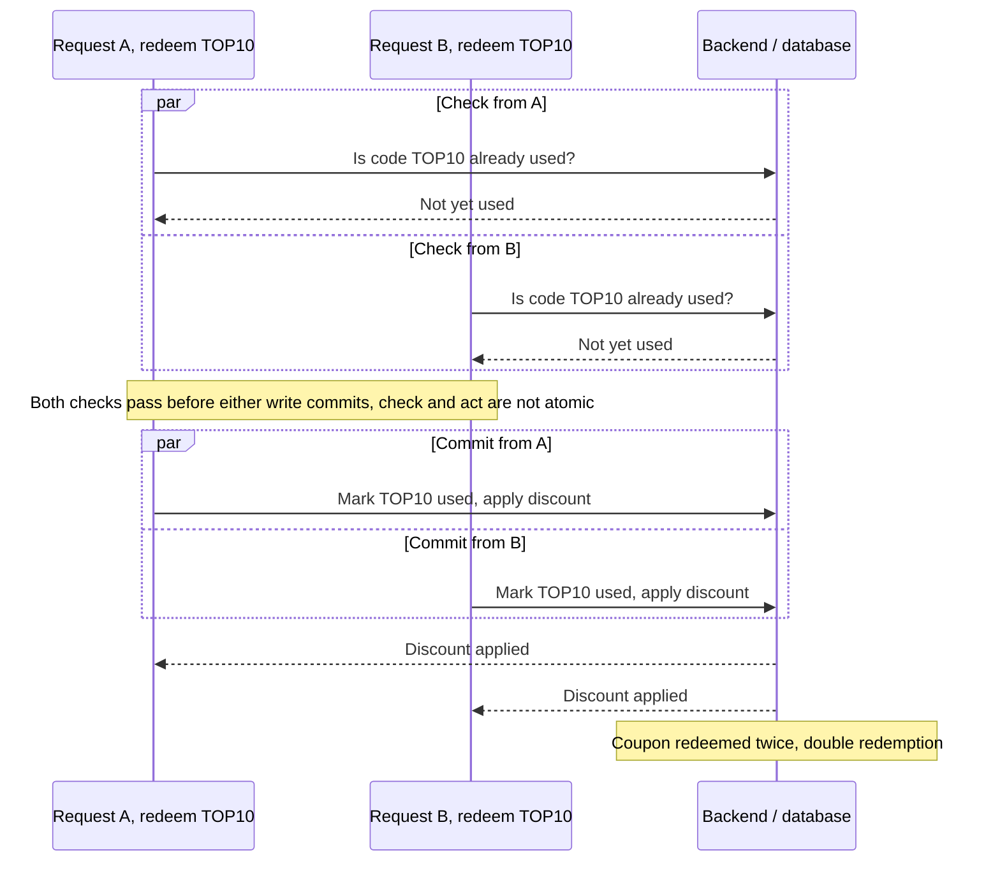

# Business Logic Flaws and Race Conditions

> Business logic flaws are not injection bugs: the input is well-formed, the parser is happy, and the code does exactly what it was written to do. The defect is that the rules being enforced are wrong, incomplete, or enforced at the wrong moment against the wrong data. The mental model is a state machine: an application is a set of objects (user, session, order, cart, balance) moving through states under rules the developer assumed would always hold. A logic flaw is any path that reaches a state the developer never drew on their diagram, reached by deviating from the intended sequence, tampering with a value the code trusts, or supplying an input outside the range the code silently assumes. Race conditions are the temporal special case of this: James Kettle's framing is that HTTP request processing is not atomic, so every request passes through fleeting hidden sub-states, and "with race conditions, everything is multi-step." Scanners miss this whole class because there is nothing malformed to flag; you find it by understanding the domain, enumerating the invariants, and asking what breaks if you go out of order, twice, in parallel, or with an edge value.

**Interview frequency:** Common

## How it works / Where it arises

Business logic is just the set of rules that define how the application is supposed to operate: preventing an order from completing without payment, a coupon from being used twice, a balance from going negative. Developers encode these rules by anticipating scenarios and writing handlers for them. A logic flaw is the gap where a scenario was never anticipated, so no handler exists and the application transitions into an unsafe state without complaint.

Three root causes recur (PortSwigger's taxonomy)<sup>[[1]](#ref1)</sup>:

- Flawed assumptions about user behavior: the design assumes users interact only through the provided browser UI, follow the workflow in order, always supply mandatory fields, and stay trustworthy after passing an initial check. An attacker with an intercepting proxy violates every one of these.
- Excessive trust in client-side controls: validation that lives only in JavaScript or in hidden form fields is not validation, because the attacker edits the request after the browser has sent it and before the server reads it.
- Failure to handle unconventional input: numeric fields that silently accept negatives, zero, huge values, or the wrong type; the developer only tested the "normal" range.

Race conditions are the concurrency form. Most sites handle concurrent requests with multiple threads sharing one datastore, and application code is rarely written with concurrency in mind. A race window is the interval between a check and the dependent action (time-of-check to time-of-use, TOCTOU). If two threads both pass the check before either commits the action, the invariant the check was protecting is broken. Kettle's key extension<sup>[[2]](#ref2)</sup> is that the window is not only between two of your requests: a single request internally reads, writes, hands data between classes and threads, and passes through sub-states (a logged-in-but-MFA-not-yet-enforced state, a user-created-but-API-key-null state) that a second concurrent request can catch mid-flight.



These vulnerabilities are highly domain-specific, which is exactly why they resist automation and why they are prime territory for manual testers and bug bounty hunters. The interview skill is hypothesis generation: for each rule the application enforces, name the state where the rule is assumed but not re-verified.

## Quick reference

```
POST /promo/redeem HTTP/2
Host: shop.example

code=TOP10
# Fired N times concurrently: each request reads "code unused?" before any
# commits "code used", so all of them pass the check and the coupon is
# redeemed more than once - the check and the write were never atomic.
```

| Invariant | Where enforced | How violated | Source |
|---|---|---|---|
| Prices, totals, discounts, roles, and entitlements are recomputed server-side from authoritative data, never trusted from the request | Server-side recomputation at the point of commit | A checkout request carries `price=1&discountPercent=100` and the server treats the client-sent value as authoritative (excessive trust in client-side controls) | <sup>[[1]](#ref1)</sup> |
| The check and the state-changing write are one indivisible datastore operation, not a separate read-then-write | Conditional `UPDATE` with a rowcount assertion, a unique constraint, or `SELECT ... FOR UPDATE` inside a transaction | Two concurrent requests both read "coupon not yet used" before either commits the mark-used write (limit-overrun / double-spend race) | <sup>[[2]](#ref2)</sup> |
| A sensitive operation reads every input (recipient, token, role) from one consistent source, never a mix of an in-memory value and a separately re-queried database value | Single-source data read inside the sensitive handler | Devise read the confirmation recipient from memory and the token from the database, so two concurrent email-change requests produced a mismatched recipient/token pair (object-masking, CVE-2022-4037) | <sup>[[2]](#ref2)</sup> |
| Multi-step workflows track state server-side and reject a step whose predecessors were never completed | Server-side state machine plus a per-step flow token | A session is valid before MFA is enforced, so a request straight to the authenticated endpoint skips the code-entry step entirely (step-skipping / 2FA bypass) | <sup>[[1]](#ref1)</sup> |
| Comparisons on secrets and tokens use strict equality, never a loosely-typed operator | Application code (`===`, constant-time compare) | PHP `==` coerces `"0e123"`-style strings to 0, so a magic-hash value satisfies a token/signature comparison it should fail (type-juggling) | <sup>[[1]](#ref1)</sup> |
| An email address has exactly one canonical parsed domain, agreed on by every component that reads it | A single shared parser used consistently for validation and downstream domain-membership decisions | Encoded-word/quoting tricks (`"attacker@evil.com"@company.com`) make the validator and the consumer disagree about which substring is the domain | <sup>[[3]](#ref3)</sup> |
| Object lookups are scoped to the acting user's own records, so an unauthorized ID returns 404 by construction rather than someone else's data | Policy layer keyed on `(actor, action, resource)`, queries scoped via `current_user.orders.find(id)` | `GET /api/orders/1042` returns any user's order because the handler looks up by primary key with no `order.user_id == session.user_id` check (IDOR/BOLA) | <sup>[[4]](#ref4)</sup> |

## Attack techniques

### 1. Trusting client-side validation and hidden fields

The archetypal logic flaw: price, discount, quantity, user ID, role, or a limit is submitted from the client and trusted server-side because the UI "already validated" it. Intercept the request and change the trusted value:

   ```
   POST /cart/checkout HTTP/2
   Host: shop.example

   productId=42&quantity=1&price=1&discountPercent=100
   ```

   Why it works: the client-side control was cosmetic. The server recomputed nothing and treated a value under attacker control as authoritative. Detection: proxy every request through Burp, compare the fields the UI shows read-only against what the server accepts when you change them, and look for parameters whose value should be derived server-side (totals, prices, roles, entitlements) but are echoed back from the request.

### 2. Unconventional numeric input: negative values, zero, overflow, and range assumptions

A funds-transfer check written as a naive comparison assumes the amount is positive:

   ```php
   $transferAmount = $_POST['amount'];
   $currentBalance = $user->getBalance();
   if ($transferAmount <= $currentBalance) {
       // complete the transfer
   } else {
       // block: insufficient funds
   }
   ```

   Sending `amount=-1000` passes the balance check trivially (-1000 is always <= any balance) and, depending on the ledger code, transfers funds in the wrong direction so the attacker receives 1000 from the victim. The same class covers integer overflow (a value that wraps a signed counter past its maximum into a negative), zero (a free order, a division that misbehaves), and abnormally large values (breaking downstream limits). Blind variant: even when the response looks unchanged, a second-order effect (the ledger balance, a later statement, an inventory count) may have shifted, so confirm by reading state elsewhere. Detection: with Burp Repeater and Intruder, submit values legitimate users never would (exceptionally high, exceptionally low, negative, zero, non-numeric, over-long strings) and answer three questions: are limits imposed, what happens at the limit, and is the input normalized or transformed. If one form mishandles this, others usually do too.

### 3. Type-juggling and loose-comparison abuse

Languages with loose equality coerce types before comparing, so security checks written with `==` can be tricked. In PHP, strings that look like scientific-notation zero (`"0e123"`) all coerce to the number 0, so `"0e123" == "0e456"` is true; a password-hash or token comparison using `==` against an attacker-supplied "magic hash" can pass. Array-versus-string confusion is related: passing an array where a scalar is expected can make `strcmp()` return null (loosely equal to 0) and satisfy an equality gate.

   ```
   # loose comparison treated as "equal"
   "0e830400451993494058024219903391" == "0e462097431906509019562988736854"   // true, both coerce to 0

   # array smuggling to defeat strcmp()-based checks
   secret[]=1        -> strcmp(array, string) returns null == 0 -> "match"
   ```

   Why it works: the comparison operator silently changed types before comparing. Defense here is strict typed comparison, but as an attack it is a fast win against any home-grown token or signature check. Detection: look for `==`/`!=` (not `===`) around secrets, and try inputs that coerce to 0 or that arrive as arrays.

### 4. Step-skipping and workflow-sequence bypass (forced browsing)

Multi-step flows (registration, checkout, password reset, 2FA) assume each step runs after its predecessors. If step N does not verify steps 1..N-1 completed, replay or force-browse straight to it. Classic 2FA bypass: complete the username/password step, then navigate directly to the post-login authenticated endpoint instead of the code-entry page, because the app set a valid session before enforcing MFA. Classic checkout bypass: reach the order-confirmation URL without the payment step.

   ```
   POST /login             HTTP/2   # establishes a session
   GET  /admin/dashboard   HTTP/2   # skip /2fa entirely via forced browsing
   ```

   Detection methodology: submit requests in an unintended sequence, skip steps, access a step twice, return to earlier steps, and remove parameters. Because each step is often just a GET/POST to a URL, replay them out of order in Repeater. Expect exceptions from uninitialized variables, and read every error and debug page they produce, they leak back-end behavior.

### 5. Removing mandatory parameters

Browsers enforce "required" fields; attackers delete them. When one server-side script multiplexes behavior on the presence or absence of a parameter, dropping it reaches code paths that were meant to be unreachable. Rules: remove one parameter at a time so all code paths are exercised, delete the name as well as the value (the server handles the two cases differently), and check cookies, not just URL/POST parameters. Detection: for each parameter, send the request with it present, with an empty value, with the name-and-value gone, and diff the responses.

### 6. Domain-specific discount and value-adjustment abuse

Any place a price or sensitive value is recomputed based on user actions is a candidate. The canonical case: a shop gives 10 percent off orders over 1000, but never re-checks the total after the discount is applied. Add items to cross 1000, let the discount apply, then remove the unwanted items and place the order, keeping the discount on a sub-threshold cart. Related patterns: referral or signup-bonus loops between two accounts you control, unlimited free-trial resets, and "gift a credit" flows that mint value by moving it between your own accounts. Why it works: the criterion (cart >= 1000) was checked at one instant and assumed to hold at commit time; the state was mutated in between. Detection needs domain knowledge, understand what an attacker gains in this specific business, then find a functional path to it.

### 7. Trusted-users-stay-trusted and trust-boundary confusion

Applications that apply strict controls at entry sometimes relax them afterward, assuming a user who passed once stays benign, or assuming a value set earlier in a flow cannot have changed (a business-logic TOCTOU), or that a downstream service already validated something. Example: a "change email" flow that re-verifies your password on step one but not on the final commit, letting a hijacked-but-not-reauthenticated session finish the change. Detection: map where a security check is performed once and where its result is later assumed rather than re-checked.

### 8. Encryption oracle

When user-controllable input is encrypted with the application's key and the ciphertext is returned to the user, the app is an encryption oracle: the attacker can produce valid ciphertext for chosen plaintext using the correct algorithm and key. This is dangerous when another input elsewhere consumes data encrypted with the same key, the attacker forges valid input for that sensitive function. If a reverse (decrypt) function also exists, they can learn the expected plaintext structure. Severity depends entirely on what other feature shares the algorithm and key.

### 9. Email-address parser discrepancies

Sites that parse an email to extract the domain (to decide organizational membership, for example "anyone at @company.com is staff") are undermined when different components parse the same address differently. Using RFC-permitted encodings and comment/quoting features, an attacker crafts an address that passes registration validation but is routed or interpreted to a different domain by the parsing logic, gaining access to restricted areas such as admin panels. This is Gareth Heyes's "Splitting the Email Atom" research<sup>[[3]](#ref3)</sup>. Payload shapes exploit encoded-word and quoting quirks:

   ```
   "attacker@evil.com"@company.com
   attacker@evil.com(@company.com)
   =?utf-8?q?attacker=40evil.com?=@company.com
   ```

   Why it works: no single canonical email parse exists, so validator and consumer disagree about which substring is the domain.

### 10. Limit-overrun race conditions (double-spend)

The best-known race: an endpoint enforces a one-time or capped action with a check-then-update sequence, and concurrent requests all pass the check before any commits the update. Variants: redeem a gift card or discount code multiple times, rate a product repeatedly, withdraw or transfer beyond the balance, reuse one CAPTCHA solution, or overrun an anti-brute-force rate limit.

    ```
    # fire N concurrent identical redemptions so several pass "code unused?" before any marks it used
    POST /promo/redeem HTTP/2
    Host: shop.example

    code=TOP10
    ```

    Why it works: two threads both read "TOP10 not yet applied," both apply it. Detection with Burp Repeater: group the requests and choose Send group in parallel (Burp uses the single-packet attack on HTTP/2, last-byte sync on HTTP/1). Confirmation: the limit is exceeded (two emails from six invites, a balance decremented more times than allowed, a code accepted twice).

### 11. The single-packet attack (the enabling technique)

Network jitter historically hid small race windows by scattering when requests arrive. Kettle's single-packet attack (Black Hat USA 2023)<sup>[[2]](#ref2)</sup> neutralizes jitter by completing 20 to 30 HTTP/2 requests with a single TCP packet: pre-send the bulk of each request but withhold the final frame (an empty END_STREAM data frame for bodyless requests, or the last body byte), wait about 100ms, disable TCP_NODELAY so Nagle's algorithm batches the finishing frames, warm the connection with a PING, then release all withheld frames together. Because the server only begins processing once a request is complete, all requests start within roughly 1ms. Benchmarked Melbourne to Dublin (17,000km), last-byte sync gave a 4ms median spread (3ms stddev) versus 1ms (0.3ms stddev) for the single-packet attack, and one real exploit that took over two hours with last-byte sync landed in about 30 seconds. HTTP/1 falls back to last-byte synchronization (send all but the final byte of each request, then release the final bytes together). In Turbo Intruder, use the single-packet engine and one connection, queue into a gate, then open it:

    ```python
    def queueRequests(target, wordlists):
        engine = RequestEngine(endpoint=target.endpoint,
                               concurrentConnections=1,
                               engine=Engine.BURP2)   # single-packet attack, HTTP/2 only
        for i in range(20):
            engine.queue(target.req, gate='1')        # withhold final frames
        engine.openGate('1')                          # release all at once
    ```

### 12. Hidden multi-step / single-request sub-state races

A single request can transition through sub-states that exist for about 1ms and then vanish. The pseudo-code below is briefly logged-in with MFA not yet enforced:

    ```
    session['userid'] = user.userid
    if user.mfa_enabled:
        session['enforce_mfa'] = True
        # generate and send MFA code, redirect to code-entry form
    ```

    Race exploit: send the login request and, in the same packet, a request to a sensitive authenticated endpoint. If the second request is serviced during the sub-state where the session is valid but `enforce_mfa` is not yet set, MFA is bypassed. The same shape bypasses code-based password reset (`session['reset_user']`/`session['reset_code']` set non-atomically) and enables session-swap (auth cookies issued from a session whose user field is being overwritten).

### 13. Single-endpoint collisions with different values (object masking / token misrouting)

Send parallel requests to one endpoint with different values so their internal operations interleave on shared state. Kettle's GitLab / Devise case<sup>[[2]](#ref2)</sup>: changing your account email to two different addresses at once made Devise send a confirmation email whose recipient (passed as an in-memory argument) disagreed with the confirmation link inside it (re-read from the database by the template engine after another thread had updated `unconfirmed_email`).

    ```
    POST /-/profile HTTP/2      POST /-/profile HTTP/2
    Host: gitlab.com            Host: gitlab.com

    user[email]=test1@x.net     user[email]=test2@x.net
    ```

    The confirmation code for one address was delivered to the other, letting the attacker validate an email they did not own, which unlocked pending-invitation hijacking and OpenID account takeover on relying parties. GitLab assigned CVE-2022-4037<sup>[[2]](#ref2)</sup> and patched it in 15.7.2 (4 Jan 2023). The exploit only works when the "resend existing token" code path is triggered (request the same email change twice). Password-reset session collisions are the same shape: two parallel resets from one session for two usernames can leave the session holding the victim's user ID while the valid token went to the attacker.

### 14. Multi-endpoint races and window alignment

Race two different endpoints that touch the same record, for example apply-discount interleaved with confirm-order, or add-to-basket during the window between payment validation and order confirmation (a race variant of the classic force-browse basket flaw). Endpoints rarely reach their vulnerable sub-state at the same time, so align the windows: use connection warming (send a throwaway GET first so front-end-to-back-end connection setup does not delay only the first real request), and, when one endpoint needs to start later, introduce a delay. A client-side delay forfeits the single-packet attack (the requests now span multiple packets, unreliable on high-jitter targets), so instead abuse a leaky-bucket rate limit: flood dummy requests to trigger the server's own throttling delay, producing a controllable server-side stagger while keeping the single-packet timing.

### 15. Partial-construction races

Objects built in multiple statements have a middle state. If registration creates the user row, then sets the API key (or password) in a second statement, there is a window where the key column is uninitialized (empty string or null). Frameworks let you inject values that match that uninitialized value using non-standard parameter syntax:

    ```
    # PHP array syntax:  param[]=foo -> ['foo'],  param[] -> []
    # Rails:  param[key] -> {"param"=>{"key"=>nil}}
    GET /api/user/info?user=victim&api-key[]= HTTP/2
    Host: vulnerable-website.com
    ```

    During the race window `api-key[]=` (an empty array, or JSON `null`) compares equal to the uninitialized column and authenticates you as the victim. With a password rather than an API key you instead need an input that makes the hash function return the uninitialized value (harder). Detection: hammer registration in parallel with an authenticated request keyed on the not-yet-set field.

### 16. Deferred and time-sensitive collisions

Not every collision is immediate. If a site processes data in periodic background batches, two conflicting requests sent 20 minutes apart can still collide when the batch runs, so there is no synchronized-request timing at all and no immediate response clue; detection relies on second-order anomalies (an inconsistent email later, changed behavior). Separately, when a security token is derived from a high-resolution timestamp instead of a CSPRNG, firing two password resets for two users so they land on the same timestamp yields the same token for both. Session-based locking is the confounder to recognize: PHP's native session handler processes only one request per session at a time, so a database-layer race probed with one session appears absent; re-test with a distinct session token per request or you will miss trivially exploitable bugs.

### 17. Precision, rounding, and currency-conversion abuse

When money is stored or computed in floating-point, or when totals are rounded per-line-item instead of once at the end, attackers extract or mint value at the least-significant digit. The canonical shape is per-line rounding: split a purchase into thousands of tiny line items so each line's rounding drifts in the attacker's favor and the accumulated drift buys a real unit for free. Asymmetric FX round-trips are the sibling shape: converting `USD -> BTC -> USD` gains fractional units because the two conversion rates are computed independently and each is rounded down for the house, so a large enough churn returns more than it started with.

    Refund and multi-currency flows amplify this. Requesting a refund in a different currency than the original charge lets the reverse-rate rounding leave a residual balance the ledger never zeroes. Integer truncation on sub-unit quantities (fractional shares, in-game currency, partial-token airdrops) is the same defect at the type level: `floor(0.9999)` credits 0 to the user but debits 1 from the counterparty, and a loop over that operation drains the counterparty's account while the user's balance never moves. Detection is a ledger-side exercise, not an HTTP-response one, so read totals after N operations, not the immediate response.

    The invariant to enforce: money as integer minor units end-to-end, one conversion at commit time, one rounding at the final aggregate, and a double-entry reconciliation job so any asymmetric rounding produces a visible cross-account imbalance rather than silent leakage. Floats in currency code are the wrong answer even before an attacker shows up.

### 18. Mass assignment and HTTP parameter pollution

When a controller binds request parameters directly onto a model (`User.update(params[:user])` in Rails, `@ModelAttribute` in Spring, `Object.assign(user, req.body)` in Express), the attacker adds fields the UI never exposes and the ORM writes them. The dangerous fields are the ones the endpoint's designer forgot to think about: `isAdmin=true`, `role=admin`, `balance=1000000`, `emailVerified=true`, `userId=<victim>`, `stripeCustomerId=<victim>`. Detection is an enumeration exercise: guess the model's columns from error messages, JSON schema leaks, GraphQL introspection, or public source, then `PATCH` with the guessed name and diff the response for a state change.

    HTTP parameter pollution is the sibling defect. Sending `role=user&role=admin` causes different frameworks to pick different values (first, last, concatenated, coerced to an array), and a front-end validator that reads one occurrence and a back-end that reads the other diverge on what the "real" value is. The same idea applies across proxies with different normalization rules, one canonicalizes to the first parameter and one to the last.

    The invariant to enforce: allow-list bindable fields per endpoint (Rails strong parameters, request DTOs, `@JsonIgnoreProperties`, Zod schemas with `.strict()`), never bind directly onto persistence models, and normalize duplicate parameters at the edge so validator and handler see the same value. "Deny by default on unknown fields" is the correct posture; `strict: true` on the parser is a one-line fix.

### 19. Object-level and function-level authorization bypass (IDOR / BOLA / BFLA)

The endpoint enforces authentication but not ownership: `GET /api/orders/1042` returns any user's order because the handler looks up by primary key and never checks `order.user_id == session.user_id`. This is OWASP API Security's #1 category<sup>[[4]](#ref4)</sup> and the single most common business-logic authorization flaw. Variants: predictable sequential IDs (increment and probe), leaked IDs (referrer headers, receipt emails, support tickets, exported reports), UUIDs disclosed elsewhere and reused, and horizontal escalation via array-parameter tricks (`ids[]=mine&ids[]=victim`) that quietly widen the query.

    Function-level authorization (BFLA) is the mirror defect: the code path checks the caller is logged in but not that the caller is allowed to perform the action. `POST /admin/users/:id/delete` reachable by any authenticated user, `PATCH /users/:id/role` reachable by the user being modified, `POST /api/v2/orders/:id/refund` reachable without merchant scope. Guessing an admin-only URL from a leaked JavaScript bundle and hitting it with a normal-user token is a five-minute finding on many APIs.

    The invariant to enforce: centralize authorization in a policy layer keyed on `(actor, action, resource)`, resolve resources through queries scoped to the actor (`current_user.orders.find(id)`) so an unauthorized ID returns 404 by construction, and add deny-by-default tests that assert every endpoint returns 403 for an unrelated user. Framework helpers exist (Pundit, CanCanCan, Casbin, `@PreAuthorize`); the discipline is applying them on every route, not sprinkling them.

## Defense

### Real fix

1. Enforce every business rule server-side from server-trusted data. Recompute prices, totals, discounts, entitlements, and roles on the server from authoritative records; never trust a client-sent price, quantity, role, or limit. This is the real fix for the entire "excessive trust in client controls" family; client-side validation is UX, not security.

2. Make check-and-act atomic with the datastore's own concurrency features. This is the real fix for limit-overrun races and beats every mitigation below. Collapse the check and the state change into one indivisible operation: a conditional UPDATE that both guards and mutates (`UPDATE accounts SET balance = balance - :n WHERE id = :id AND balance >= :n` and require it to affect one row), a unique constraint so a duplicate INSERT fails (one redemption per code per user), or `SELECT ... FOR UPDATE` row locks inside a transaction. The guard and the decrement must be inseparable; a separate SELECT then UPDATE is exactly the race.

3. Use transactions with appropriate isolation, or optimistic concurrency. Wrap multi-statement invariants (verify payment matches cart, then confirm order) in a single transaction; raise isolation to serializable where an invariant spans rows, or use a version column with compare-and-swap so two concurrent writers cannot both commit. Do not let an ORM hide transaction boundaries: if it batches or defers writes, it has taken responsibility for atomicity, so verify it.

   Decision guide for picking the concurrency primitive. Conditional UPDATE (`UPDATE ... WHERE balance >= :n` and assert `rowcount == 1`) is right when the guard is a simple predicate on the row you are mutating; it is cheap, contention-free, and there is no lock to leak. `SELECT ... FOR UPDATE` inside a transaction is right when the decision requires reading several rows or several columns before writing, or when the write cannot be expressed as a single conditional UPDATE; the cost is lock contention and deadlock risk, so keep the transaction short and always acquire locks in a fixed order. Optimistic concurrency (a `version` column, compare-and-swap, or `WHERE updated_at = :seen`) is right for user-facing edits where conflicts are rare and you want writers to fail loudly rather than block; the client handles the retry. Serializable isolation is the fallback when the invariant spans rows the app cannot easily enumerate, at the cost of serialization failures the app must retry. Idempotency keys are orthogonal and belong on any state-changing external call regardless of which of the above you pick.

4. Eliminate sub-states from sensitive endpoints (Kettle's core guidance)<sup>[[2]](#ref2)</sup>. Do not mix data from different storage places in a single sensitive operation: Devise was vulnerable because it read the recipient from an in-memory variable and the token from the database; reading both from one source removes the window. Keep the session handler internally consistent by writing session variables as one atomic batch, not individually.

5. Do not use one storage layer to secure another. Sessions cannot prevent a database-level limit overrun; a lock in Redis does not make a SQL check-then-write atomic. Enforce each datastore's invariants with that datastore's primitives.

6. Idempotency keys for state-changing and financial operations. Require a client-supplied idempotency key on payments, transfers, and redemptions, and enforce uniqueness on it so retries, replays, and parallel duplicates collapse to a single effect regardless of timing.

7. Model the workflow as an explicit server-side state machine. Track each object's state server-side and reject transitions that skip, reorder, or replay steps; bind each step to a server-side flow token so forced browsing cannot jump ahead. This closes step-skipping, 2FA/checkout bypasses, and mandatory-parameter-removal paths.

8. Handle unconventional input and use strict typing. Reject negative, zero, overflow, and wrong-type values wherever they are nonsensical; represent currency in integer minor units with defined rounding; use strict comparisons (`===`, constant-time compares for secrets) to kill type-juggling and magic-hash tricks; coerce each field to its expected primitive at the boundary.

### Defense in depth

1. Threat-model the design and document assumptions. These are design defects, not typos, so involve security at design review, write down every assumption about user behavior and cross-component trust, and add an explicit check for each. Maintain clear data-flow docs so testers can see where an assumption is made but not verified.

2. Rate-limit sensitive actions (shrinks the race window but never makes check-then-act atomic, so it is a mitigation, not a fix); consider pushing state client-side with signed/encrypted tokens (JWT) to avoid shared server-side state entirely, accepting JWT's own risks; scrutinize race-condition patches specifically, several real-world first fixes in Kettle's research<sup>[[2]](#ref2)</sup> were incomplete.

## Interviewer probes

Mid: "Walk me through a real-world race-condition bug you'd look for in this API."

Principal: The 2016 mental model, a coupon or gift-card endpoint gets hit twice concurrently and redeems twice, is necessary but no longer sufficient. HTTP request processing is not atomic: every endpoint can pass through invisible sub-states that exist for about a millisecond, a session that is briefly logged-in-but-MFA-not-yet-enforced, a user row created before its API key is set, a password-reset session holding one user's ID while the token went to another. The modern framing, per James Kettle's Black Hat USA 2023 research, is "with race conditions, everything is multi-step": you are not just racing two identical requests against a check-then-update, you are racing a single request against itself while it transitions through states nobody drew on the state diagram.

Mid: "If a race window is only a few milliseconds wide, how do you reliably exploit it over the network?"

Principal: Network jitter used to hide sub-second race windows by scattering when requests physically arrive, which is why races were historically dismissed as unreliable. Kettle's single-packet attack neutralizes that: pre-send the bulk of 20 to 30 HTTP/2 requests but withhold the final frame, wait roughly 100ms, disable TCP_NODELAY so Nagle's algorithm batches the finishing frames, then release them all together in one TCP packet. Because the server only starts processing once a request is complete, all requests begin within about a millisecond of each other, turning what used to take hours of last-byte-sync tuning into a technique that lands reliably in seconds. HTTP/1 falls back to the weaker last-byte synchronization.

Mid: "You tested a suspected database race by firing concurrent requests from one authenticated session and saw no collision. Is the endpoint safe?"

Principal: Not necessarily; you may have a false negative. PHP's native session handler processes only one request per session at a time by default, so it serializes your "concurrent" requests before they ever reach the database, hiding a race that is trivially exploitable with two different sessions. The fix for the test, not the app, is to re-probe with a distinct session token per request. More generally, any session handler or ORM that batches a whole record in memory is internally consistent with itself but does nothing to protect a different storage layer underneath it, so a clean result at one layer does not clear the layer below it.

Mid: "If two conflicting requests aren't sent at the same time, is a race condition still possible?"

Principal: Yes, and this is where a lot of testers stop looking too early. Not every collision is immediate: if a site processes data in periodic background batches, two conflicting requests sent twenty minutes apart can still collide when the batch runs, with no synchronized-request timing and no immediate response clue to notice. Spotting anomalies, an inconsistent email later, a changed state that does not match what any single request should have produced, matters more here than the HTTP response, because the response to each individual request looks completely normal.

Mid: "Wouldn't rate-limiting the endpoint stop this race condition?"

Principal: It narrows the window but does not close it, so it is a mitigation, not a fix. Rate limiting still allows a small number of concurrent requests through in the same interval, which is exactly what a race needs. Worse, an attacker can abuse a leaky-bucket rate limiter's own throttling delay as a timing primitive, flooding dummy requests to trigger a predictable server-side stagger that helps align windows across two different endpoints. The actual fix is making the check and the act one atomic operation, a conditional UPDATE, a unique constraint, or a row lock inside a transaction, not slowing the attacker down.

Mid: "We wrapped the balance check and the deduction in a database transaction. Doesn't that make it safe from a race?"

Principal: Not by itself. Transactions give you atomicity and rollback, not mutual exclusion. At the default isolation level most databases ship with, READ COMMITTED on Postgres, MySQL/InnoDB, and SQL Server, two concurrent transactions can both SELECT the same balance, both see it as sufficient, both issue the UPDATE, and both commit; the check-then-write race is completely unchanged by the transaction boundary. What actually closes it is a single conditional UPDATE with a rowcount assertion, a SELECT ... FOR UPDATE row lock inside the transaction, SERIALIZABLE isolation with a retry loop, or an application-enforced unique constraint. A candidate who says "just wrap it in a transaction" without naming the isolation level or the locking primitive has not actually answered the question.

Mid: "You found a low-impact race, changing your email to two addresses at once causes a harmless-looking mix-up. Is that worth reporting as-is?"

Principal: Treat it as a starting point, not the finding. James Kettle's GitLab research began exactly there, an object-masking race in Devise where a confirmation email's recipient and its embedded link disagreed, and chasing it further revealed email-verification bypass, pending-invitation hijacking, and OpenID-based account takeover on relying parties (CVE-2022-4037). Races escalate because the sub-state you caught once is often reachable from multiple entry points with different consequences. Kettle has said he personally left real bounty value on the table by not chasing an escalation before a patch shipped, which is the practical argument for treating a race as a structural weakness worth mapping, not an isolated curiosity.

## Sources

<a id="ref1"></a>[1] PortSwigger Web Security Academy, "Business logic vulnerabilities". Retrieved 2026. https://portswigger.net/web-security/logic-flaws

<a id="ref2"></a>[2] James Kettle, "Smashing the state machine: the true potential of web race conditions" (single-packet attack, GitLab/Devise CVE-2022-4037). Black Hat USA. 2023. https://portswigger.net/research/smashing-the-state-machine

<a id="ref3"></a>[3] Gareth Heyes, "Splitting the Email Atom: exploiting parsers to bypass access controls". PortSwigger Research. Retrieved 2026. https://portswigger.net/research/splitting-the-email-atom

<a id="ref4"></a>[4] OWASP, "API Security Top 10" (API1:2023 Broken Object Level Authorization, API5:2023 Broken Function Level Authorization). Retrieved 2026. https://owasp.org/API-Security/editions/2023/en/0x11-t10/
