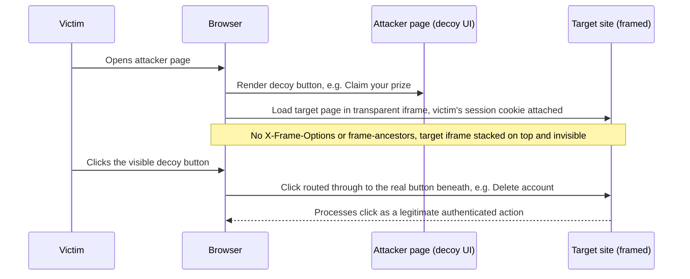

# Clickjacking (UI Redressing)

> **Mental model:** clickjacking attacks the human, not the code. The browser will happily frame another origin's authenticated page, render it with the victim's ambient cookies, and let the attacker's parent document position, resize, and make that frame transparent. The Same-Origin Policy stops the parent from *reading* or *scripting* the cross-origin frame, but it never stops the parent from *stacking* decoy UI over it. So a genuine, single-origin, CSRF-token-carrying click lands on a real button the victim cannot see. The exploit is a perception bug: the pixels the user sees and the pixels their click reaches are different layers. This is why a CSRF token does nothing (the session is authentic and the request is on-domain) and why the fix is not a token but a framing policy that refuses to be embedded at all.

**Interview frequency:** Common

## How it works

Clickjacking is built entirely from standard CSS layering plus ambient authority (cookies auto-attached to the framed request). Three ingredients matter: an iframe of the target, transparency, and precise positioning.

The canonical overlay from the PortSwigger material<sup>[[1]](#ref1)</sup> puts the target frame *on top* (higher `z-index`) but effectively invisible (`opacity` near zero), with a visible decoy underneath:

```html
<head>
<style>
  #target_website {
    position: relative;
    width: 128px;
    height: 128px;
    opacity: 0.00001;   /* transparent, but still receives clicks */
    z-index: 2;         /* on top, so the click lands here */
  }
  #decoy_website {
    position: absolute;
    width: 300px;
    height: 400px;
    z-index: 1;         /* underneath, this is what the victim sees */
  }
</style>
</head>
<body>
  <div id="decoy_website">...Click here to win a prize...</div>
  <iframe id="target_website" src="https://vulnerable-website.com/account/delete"></iframe>
</body>
```

The victim sees the decoy ("Win a prize") and clicks the button. Because the transparent target frame is the topmost layer at those coordinates, the browser routes the click into the framed cross-origin button (for example "Delete account", "Transfer funds", "Authorize app"). The framed request carries the victim's session cookie automatically, so the server processes it as a fully authenticated action.



Two stacking strategies exist, and knowing both matters:

- **Target on top, transparent (above).** The invisible target intercepts the click. Simple, single click.
- **Decoy on top with `pointer-events: none`.** The decoy is fully opaque and visible, but `pointer-events: none` makes it click-transparent so the event falls through to the real target beneath it. Useful when you want rich, visible decoy UI while the click passes through.

Ambient authority is the reason framing is dangerous: the framed navigation is a top-level GET/POST to the target origin, so the browser attaches that origin's cookies unless they are marked `SameSite=Lax/Strict` (which suppresses them in a cross-site framed context). The SOP only governs *scripting* across the frame boundary, not the *rendering* or *event routing*.

Refinements attackers use:

- **Cursorjacking:** hide the real cursor with CSS and draw a fake cursor offset by some pixels, so the user aims at the decoy while the real pointer is over the hidden target.
- **Opacity thresholds:** some browsers (Chrome added heuristic detection around v76) will suppress clicks on frames below a transparency threshold, so attackers pick an opacity that is visually invisible yet above the trigger. This is a heuristic, not a security control.

## Quick reference

```html
<!-- Prefilled-field clickjacking: the sensitive field is set via the framed URL's query string -->
<iframe src="https://vulnerable-website.com/change-email?email=attacker@evil.net"></iframe>
<!-- A decoy "Enter your name to win" input/button is overlaid on top; the victim's click/keystrokes
     are routed into the hidden framed form, submitting attacker@evil.net as the new account email -->
```

| Invariant | Where enforced | How violated | Source |
|---|---|---|---|
| `frame-ancestors`/XFO is sent as a real HTTP response header on every HTML response, never a `<meta>` substitute | CSP/XFO header emission at the app or reverse-proxy layer | A `<meta http-equiv="X-Frame-Options">` tag is used instead of a header, so the browser ignores it and the page still renders framed | <sup>[[5]](#ref5)</sup> |
| `frame-ancestors` is the sole source of truth for which origins may embed the page; XFO can express at most one value | CSP header, evaluated against the full ancestor chain | Site needs to allowlist several partner origins but ships only legacy XFO, which cannot express more than one | <sup>[[4]](#ref4)</sup> |
| Client-side frame-busting JavaScript is never the sole framing defense | Legacy `top.location` busting script (fallback only) | `sandbox="allow-forms"` without `allow-top-navigation`, double framing, `onbeforeunload` cancel, or 204-flush all defeat the busting script | <sup>[[2]](#ref2)</sup> |
| Session cookies are scoped `SameSite=Lax`/`Strict` so ambient authority does not ride along on a cross-site framed request | `Set-Cookie` attributes | Cookie left `SameSite=None` (or an old pre-Chrome-80 default), so the framed click still carries a valid session | <sup>[[1]](#ref1)</sup> |
| A single click is never sufficient to commit an irreversible or sensitive state change | App-level confirmation / step-up re-authentication | A one-click action (email forwarding rule, "Authorize" button, account deletion) is framed and redressed with a decoy overlay | <sup>[[1]](#ref1)</sup> |
| Cross-site framing is rejected at the application layer even when the CSP header never reaches the client | Server-side Fetch Metadata middleware checking `Sec-Fetch-Dest`/`Sec-Fetch-Site` | A CDN, WAF, or proxy strips the `Content-Security-Policy` header in transit and no Sec-Fetch-based Resource Isolation Policy exists as a fallback | <sup>[[8]](#ref8)</sup> |
| A touch event is dropped, not delivered, when the receiving view is obscured by another window | Android `filterTouchesWhenObscured` / `onFilterTouchEventForSecurity` | A `SYSTEM_ALERT_WINDOW` overlay, malicious Toast, or accessibility service intercepts the tap before the target app's UI does | <sup>[[3]](#ref3)</sup> |

## Attack techniques

### 1. Classic single-click UI redress

Frame a one-click sensitive action (email forwarding rule, OAuth "Authorize", account deletion, "make profile public"), overlay a decoy button so the coordinates line up. Confirm by loading the target in your own iframe and checking it renders (no framing headers). PortSwigger's Burp **Clickbandit**<sup>[[1]](#ref1)</sup> automates PoC generation: record the click on the frameable page and it emits the HTML/CSS overlay.

### 2. Prefilled form input plus text injection

Many forms accept GET parameters that prepopulate fields. The attacker crafts the framed URL so the sensitive field is already filled, then overlays a decoy submit button:

```html
<iframe src="https://vulnerable-website.com/change-email?email=attacker@evil.net"></iframe>
```

When the target additionally requires the victim to type something (a "type CONFIRM to proceed" box), the attacker overlays a decoy input that says "Enter your name to win"; the victim's keystrokes are routed into the framed field instead, satisfying the confirmation while the visible decoy hides what is really being typed into.

### 3. Multistep clickjacking

Some actions need a sequence (add item to basket, then place order; or "enable feature", then "confirm"). The attacker chains multiple iframes/divs, revealing and repositioning decoys in order so a series of decoy clicks drives the multistep flow. Requires precise per-step alignment and stealthy transitions.

### 4. Drag-and-drop data extraction

Paul Stone's "Next Generation Clickjacking" (Black Hat Europe 2010) showed the HTML5 drag-and-drop API can move content *across* the frame boundary even though the SOP blocks reads. The victim is tricked into a drag gesture (a fake game) that drags selected text or a value out of the framed target and drops it into an attacker-controlled field, exfiltrating data the parent cannot script-read.

### 5. Combining clickjacking with DOM XSS

Clickjacking's real potency is as a carrier. If the target has a DOM XSS reachable via URL, embed that payload in the framed URL so the redressed click executes script *in the target's origin*, upgrading a single hijacked click into full XSS (session-scoped, on-domain). This also side-steps some framing defenses when the XSS itself can rewrite framing checks.

### 6. Defeating frame-busting JavaScript

Legacy client-side "frame busters" (`if (top != self) top.location = self.location`) are weak and bypassable<sup>[[2]](#ref2)</sup>:

- **Sandbox neutralization.** The HTML5 `sandbox` attribute with `allow-forms` or `allow-scripts` but *without* `allow-top-navigation` lets the framed page run forms/scripts yet forbids it from navigating the top window, so the buster's `top.location = ...` silently fails:

  ```html
  <iframe src="https://victim.com" sandbox="allow-forms"></iframe>
  ```

- **Double framing.** Nest the victim inside two attacker frames; assigning `parent.location` becomes a cross-origin descendant-navigation violation and is blocked, disabling busters that navigate `parent.location`.
- **`onbeforeunload` cancel.** The parent registers `window.onbeforeunload` returning a string; when the buster tries to navigate away the browser prompts the user, who often cancels, defeating the bust.
- **204 No-Content flushing.** Repeatedly navigate the top window to a URL returning `204 No Content`; the navigation is a no-op that flushes the pending navigation request, silently canceling the buster's redirect (no prompt needed).
- **Restricted zones / designMode.** `<iframe sandbox>` (Chrome) or `document.designMode = "on"` (Firefox parent) disables JavaScript in the subframe so the buster never runs.

Detection/confirmation across all of these: try to frame the page; if it renders and no `X-Frame-Options` / `Content-Security-Policy: frame-ancestors` response header is present, it is frameable. Then verify a transparent overlay routes clicks into the frame.

### 7. Mobile tapjacking (Android overlay attacks)

The mobile analogue of clickjacking is tapjacking, where a malicious app draws an overlay on top of a legitimate app so the user's tap passes through to the target app's UI, granting a permission, confirming a payment, or triggering an irreversible action the user believes they are declining. The classic vector is the `SYSTEM_ALERT_WINDOW` permission, which lets an app draw over other apps at arbitrary coordinates. Historically attackers also abused Toast views (which did not require the permission on older Android versions) and accessibility services (which can both observe and inject touches across app boundaries).

Mitigations for tapjacking live in the target app, not the browser or the OS-level headers. Set `android:filterTouchesWhenObscured="true"` on sensitive views, or override `onFilterTouchEventForSecurity`<sup>[[3]](#ref3)</sup>, so Android drops any touch that arrives while another window is obscuring the receiving view. For irreversible actions (payments, permission grants, key export) require a biometric or PIN step-up rendered in a secure surface the overlay cannot cover. WebViews embedded inside a mobile app still inherit the web framing story (`frame-ancestors` and `X-Frame-Options` still apply to their loads), but the OS-level overlay attack sits below the web layer and needs the app-side touch-filtering flag; framing headers do nothing about it.

## Defense

Ordered by effectiveness. Framing headers are the only real fix; everything else is depth or scope-narrowing.

### Real fix

1. **`Content-Security-Policy: frame-ancestors` (primary, modern).** Sent as an HTTP response header on every HTML response. This is the authoritative, spec-current control:

   ```http
   Content-Security-Policy: frame-ancestors 'none';
   Content-Security-Policy: frame-ancestors 'self';
   Content-Security-Policy: frame-ancestors 'self' https://trusted-partner.example;
   ```

   `'none'` behaves like XFO `DENY`, `'self'` like `SAMEORIGIN`, and unlike XFO it can list multiple explicit origins<sup>[[4]](#ref4)</sup>. The single quotes are required around `'self'`/`'none'` and forbidden around host expressions. Must be a real header: a `<meta>` tag with `frame-ancestors` is ignored<sup>[[5]](#ref5)</sup>.

2. **`X-Frame-Options` (legacy fallback for old browsers).**

   ```http
   X-Frame-Options: DENY
   X-Frame-Options: SAMEORIGIN
   ```

   Send it alongside CSP for browsers predating `frame-ancestors`. Limitations to state plainly: `ALLOW-FROM uri` is obsolete and no longer works in modern browsers (Chrome/Safari never or no longer support it) and it *fails open* if unsupported, so never depend on it. Only one XFO value is honored, so you cannot allowlist several third-party framers (use `frame-ancestors` for that). A `<meta http-equiv="X-Frame-Options">` does nothing. Web proxies are known to strip the header, dropping protection.

### Defense in depth

1. **`SameSite` cookies (scope reduction).** Session cookies set `SameSite=Lax` (or `Strict`) are not sent on cross-site framed requests, so any clickjacking that depends on the victim being authenticated silently fails: the hijacked click reaches the target unauthenticated. Caveats: gives no protection if the sensitive action does not require authentication, and `SameSite=None` re-opens the hole. Treat as defense-in-depth, not the primary control.

2. **Confirmation / re-authentication on sensitive actions.** For actions that genuinely must be frameable, force an interstitial that cannot be transparently framed. A native `window.confirm()` dialog renders outside the framed document and, when it originates from a cross-origin frame, shows the originating domain, so the victim sees an unexpected prompt. Stronger: require re-entry of password, a fresh MFA/step-up, or transaction signing before the state change commits. This breaks the "one blind click" model.

3. **Frame-busting script (last-resort, legacy only).** OWASP's "best-for-now" pattern<sup>[[6]](#ref6)</sup> hides the body by default and only reveals it if the page is the top window, so a JS-disabled or busted frame stays blank rather than clickable:

   ```html
   <style id="antiClickjack">body{display:none !important;}</style>
   <script>
     if (self === top) {
       var s = document.getElementById("antiClickjack");
       s.parentNode.removeChild(s);
     } else {
       top.location = self.location;
     }
   </script>
   ```

   Use only to cover legacy browsers without header support; it is bypassable (sandbox, double framing, 204 flushing) and never a substitute for `frame-ancestors`.

4. **Fetch Metadata Resource Isolation Policy (application-layer defense in depth).** Modern browsers stamp every outgoing subresource request with `Sec-Fetch-Dest` (for framed loads this is `iframe` or `frame`, or `document` for the top-level), `Sec-Fetch-Site` (`same-origin` / `same-site` / `cross-site` / `none`), and `Sec-Fetch-Mode` (`navigate` for document loads)<sup>[[7]](#ref7)</sup>. A server-side middleware can enforce a Resource Isolation Policy<sup>[[8]](#ref8)</sup>: if `Sec-Fetch-Dest` is `iframe`/`frame` and `Sec-Fetch-Site` is `cross-site` (and the request is not on an explicit framing-allowlist), reject with 403 before the response body ships. The invariant enforced is "no cross-site party may embed this endpoint as a frame unless it is explicitly listed."

   Why this works alongside `frame-ancestors`: it catches cases where a CDN, WAF, or reverse proxy strips the CSP header in transit; it protects non-HTML endpoints (JSON, script) that browsers do not normally treat as documents but that a determined framer might still target; and it enforces at the application layer where per-tenant framing rules already live. Attackers cannot forge these headers from a web origin because the `Sec-` prefix is on the browser's forbidden-header list, so page-controlled script (fetch/XHR) cannot set or override them. Common wrong implementation: treating missing `Sec-Fetch-*` headers as "cross-site, reject" without a fallback for legitimately old clients that never send them, and inverting the check so `same-origin` accidentally blocks internal iframe use. Treat as depth behind `frame-ancestors`, not a replacement.

## Interviewer probes

Mid: "Does `frame-ancestors` protect against something X-Frame-Options doesn't?"

Principal: Two things. First, `frame-ancestors` can list multiple explicit origins (`frame-ancestors host-a host-b`), where XFO only honors a single value, so multi-partner embedding is impossible with XFO alone. Second, `frame-ancestors` checks the entire ancestor chain up to the top level, not just the immediate parent: if A embeds B embeds C, and C sends `frame-ancestors B`, the load still blocks because A is also an ancestor and isn't in the list. That's the exact opposite of the dead `ALLOW-FROM`, which only checked the top-level context and broke on legitimate nested embeds. Per the CSP spec, if a response carries an enforced `frame-ancestors` directive the browser must ignore XFO entirely, though older engines like Chrome 40 and Firefox 35 got that wrong and preferred XFO, which is why you still send both.

Mid: "The endpoint has a valid CSRF token on every request. Does that stop clickjacking?"

Principal: No, and conflating the two is the tell. The framed request is genuine, on-domain, and fully authenticated in the victim's real session, so it carries a valid CSRF token automatically, the attacker never had to forge one. The actual differentiator is how the request gets sent: CSRF forges an entire request with no user interaction required; clickjacking needs a real user gesture, just one aimed at UI the user can't see. `SameSite` cookies happen to help both, because they stop the session from riding along on the cross-site request either way, but a CSRF token only ever helps CSRF.

Mid: "You've got `frame-ancestors 'self'` on every response. Is the app safe from clickjacking?"

Principal: Only if the header actually reaches the client on every response, and only against browser-driven attacks. Two failure modes to check for: a CDN, WAF, or reverse proxy silently stripping the header in transit, which is a known real-world occurrence, and a `<meta>` tag substitute, which does nothing since both XFO and `frame-ancestors` must be real response headers. Beyond that, `frame-ancestors` is the authoritative fix for the framing vector specifically, but it says nothing about mobile tapjacking, which lives entirely in app-side touch filtering (`filterTouchesWhenObscured`) because there's no HTTP response header involved at all.

Mid: "Chrome suppresses clicks on frames below a certain opacity. Doesn't that make clickjacking a solved problem in modern browsers?"

Principal: No, treat it as a hint, not a control. It's a heuristic threshold, so an attacker just tunes the opacity to stay visually invisible while remaining above the trigger point, and it's browser-specific rather than a spec guarantee. It doesn't touch the `pointer-events: none` variant either, where the decoy is fully opaque and the click falls through by construction rather than by transparency. `frame-ancestors` is the only defense that removes the framing capability outright instead of trying to detect the overlay.

Mid: "Won't `SameSite=Lax` cookies just solve clickjacking for you?"

Principal: They narrow it, not solve it. A `Lax`/`Strict` session cookie isn't sent on the cross-site framed request, so any clickjacking that depends on the victim being authenticated silently fails, the hijacked click reaches the target unauthenticated. But that's scope reduction, not elimination: it gives no protection at all if the sensitive action doesn't require authentication in the first place, and `SameSite=None` re-opens the hole entirely. Treat it as defense-in-depth alongside `frame-ancestors`, never as the primary control.

Mid: "Does clickjacking only matter for security-critical actions like fund transfers or account deletion?"

Principal: No. Likejacking, tricking users into clicking a hidden social-media "Like" or engagement button, was historically the highest-volume real-world use of clickjacking, and it doesn't touch money or data at all. The attack works on any single authenticated click a site can be tricked into routing to a hidden target, so scope the defense (`frame-ancestors`) at the response-header level for the whole site, not just the pages you've decided are "sensitive."

## Sources

<a id="ref1"></a>[1] PortSwigger Web Security Academy, "Clickjacking (UI redressing)". Retrieved 2026. https://portswigger.net/web-security/clickjacking

<a id="ref2"></a>[2] OWASP Cheat Sheet Series, "HTML5 Security Cheat Sheet" (sandboxed frames, framebusting note). Retrieved 2026. https://cheatsheetseries.owasp.org/cheatsheets/HTML5_Security_Cheat_Sheet.html

<a id="ref3"></a>[3] Android Developers, "View security" (`filterTouchesWhenObscured`). Retrieved 2026. https://developer.android.com/reference/android/view/View#attr_android:filterTouchesWhenObscured

<a id="ref4"></a>[4] W3C, "Content Security Policy Level 3" — `frame-ancestors` directive and relation to X-Frame-Options. Retrieved 2026. https://w3c.github.io/webappsec-csp/#directive-frame-ancestors

<a id="ref5"></a>[5] MDN, "Content-Security-Policy: frame-ancestors". Retrieved 2026. https://developer.mozilla.org/en-US/docs/Web/HTTP/Headers/Content-Security-Policy/frame-ancestors

<a id="ref6"></a>[6] OWASP Cheat Sheet Series, "Clickjacking Defense Cheat Sheet". Retrieved 2026. https://cheatsheetseries.owasp.org/cheatsheets/Clickjacking_Defense_Cheat_Sheet.html

<a id="ref7"></a>[7] W3C, "Fetch Metadata Request Headers". Retrieved 2026. https://www.w3.org/TR/fetch-metadata/

<a id="ref8"></a>[8] web.dev, "Protect your resources from web attacks with Fetch Metadata". Retrieved 2026. https://web.dev/articles/fetch-metadata
