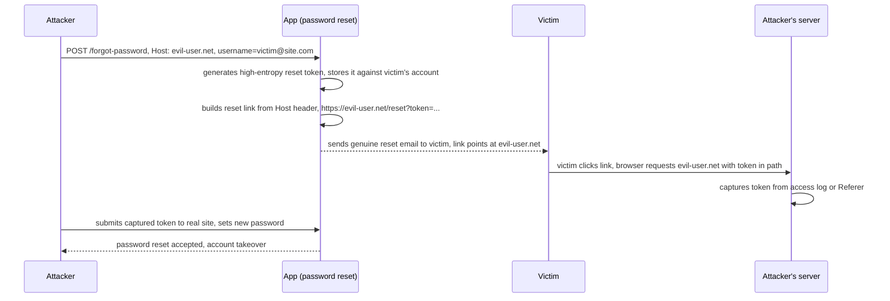

# HTTP Host Header Attacks

> The `Host` header is user-controlled input that servers routinely treat as trusted infrastructure metadata. It exists because virtual hosting and CDN/reverse-proxy routing put many domains behind one IP, so the header tells the receiving server which back-end the client wants. Applications then reuse that same attacker-controllable value to build absolute URLs (password-reset links, email links, script imports), to key caches, and to make routing decisions. The root cause of every Host header attack is a single flawed assumption: that the `Host` header (or its override cousins like `X-Forwarded-Host`) reflects the real deployment domain rather than whatever the attacker typed.

**Interview frequency:** Common

## How it works

The `Host` header became mandatory in HTTP/1.1 so a single IP could disambiguate multiple sites. A browser visiting `https://portswigger.net/web-security` emits:

```http
GET /web-security HTTP/1.1
Host: portswigger.net
```

Two deployment patterns make the header load-bearing. In virtual hosting, one web server holds many sites on one IP and selects the document root from `Host`. In intermediary routing, a load balancer, reverse proxy, or CDN receives every domain on one front-end IP and forwards each request to the correct origin based on `Host`. In both cases the header is the routing key, so it must survive to the server that acts on it.

The security problem is that off-the-shelf apps often do not know their own canonical domain. When they need an absolute URL (an email cannot use a relative link) they read it back from the request:

```php
<a href="https://<?= $_SERVER['HTTP_HOST'] ?>/support">Contact support</a>
```

Because `$_SERVER['HTTP_HOST']` is just the attacker's `Host` header, any generated link, redirect, or cache entry can be steered off-site. The header is also frequently reflected into responses unescaped, passed into SQL or template contexts, or used to decide whether a request counts as "internal."



An added layer of trust exists because intermediaries rewrite the header. A front-end may overwrite the client `Host` with an internal name and preserve the original in `X-Forwarded-Host`, so frameworks are built to prefer `X-Forwarded-Host` when present. That override header is equally attacker-controlled and is frequently enabled by default without the operator realizing it. Common variants that many stacks honor:

```
X-Forwarded-Host
X-Host
X-Forwarded-Server
X-HTTP-Host-Override
Forwarded
```

The validating code and the vulnerable-sink code usually live in different components (proxy versus app, or two servers), so the practical attack is to make one component see a benign host for routing while another sees your payload. That discrepancy is what the testing methodology below hunts for.

## Quick reference

```http
# Host header poisoning: the reset link is built from Host, so the victim's genuine,
# single-use token gets delivered to evil-user.net instead of the real site
POST /forgot-password HTTP/1.1
Host: evil-user.net
Content-Type: application/x-www-form-urlencoded
Content-Length: 25

username=victim@site.com
```

| Invariant | Where enforced | How violated | Source |
|---|---|---|---|
| Absolute URLs (reset links, email links, script imports) are built from a hardcoded canonical domain, never from the `Host` header | App URL-generation logic | A password-reset link is built from `$_SERVER['HTTP_HOST']`, so `Host: evil-user.net` sends the victim's genuine token to an attacker domain | <sup>[[7]](#ref7)</sup> |
| Intermediary routing forwards only to an allowlisted set of back-ends, independent of what the app does with `Host` | Load balancer / reverse proxy routing config | An edge component routes on unvalidated `Host`, letting an attacker steer requests to `169.254.169.254` or internal admin panels | <sup>[[6]](#ref6)</sup> |
| Host-override headers (`X-Forwarded-Host`, `X-Host`, `Forwarded`, etc.) are disabled unless the app genuinely sits behind a trusted proxy that sets them | App/framework config | An override header enabled by default bypasses hardened `Host` validation entirely, reaching the same vulnerable sink | <sup>[[5]](#ref5)</sup> |
| The validator and every downstream sink compare the exact same canonicalized host string | Host-normalization step ahead of allowlist comparison | A trailing dot, punycode A-label, Unicode dot equivalent, or userinfo prefix passes a naive `endswith()` allowlist while still resolving usefully downstream | <sup>[[4]](#ref4)</sup> |
| The H1 request reaching the back-end carries exactly one `Host`, generated by the proxy from `:authority`, never copied verbatim from the client's H2 request | H2-to-H1 downgrade boundary | Proxy trusts `:authority` for routing but copies the client-supplied `Host` field verbatim, so `:authority: victim.com` / `Host: attacker.com` reaches the back-end as `attacker.com` | <sup>[[3]](#ref3)</sup> |

## Attack techniques

### 1. Baseline probe: arbitrary Host and override headers

Change the `Host` to an unrelated domain and see whether you still reach the app. If a server is configured with a default/fallback vhost, an arbitrary host still lands on the target and you can study what it does with the value. Use an intercepting proxy (Burp) that keeps the target IP separate from the `Host` value, otherwise editing `Host` just retargets the TCP connection. If the front-end rejects an unknown host with an "Invalid Host header" error, pivot to the override header, which frequently bypasses `Host` validation while still reaching the sink:

```http
GET /example HTTP/1.1
Host: vulnerable-website.com
X-Forwarded-Host: attacker.com
```

Param Miner's "Guess headers" wordlist automates discovery of which override headers a stack silently supports.

### 2. Flawed-validation bypasses

When validation exists, attack the parser. If validation strips the port before checking, inject the payload in the port with a non-numeric value while leaving the domain intact:

```http
GET /example HTTP/1.1
Host: vulnerable-website.com:bad-stuff-here
```

If validation uses a loose suffix or subdomain match, register or abuse a name that satisfies it:

```http
Host: notvulnerable-website.com
Host: hacked-subdomain.vulnerable-website.com
```

The first defeats a naive "ends with vulnerable-website.com" check; the second uses an already-compromised subdomain. These are the same domain-parsing weaknesses seen in SSRF allowlist bypasses and CORS `Origin` parsing errors.

### 3. Ambiguous requests (component disagreement)

Duplicate `Host` headers exploit differing precedence: many stacks pick either the first or the last of two headers. Route with one, attack with the other:

```http
GET /example HTTP/1.1
Host: vulnerable-website.com
Host: bad-stuff-here
```

An absolute request-URI plus a `Host` header pits the request line against the header. The spec says the request line wins, but in practice many servers route on one and build URLs from the other:

```http
GET https://vulnerable-website.com/ HTTP/1.1
Host: bad-stuff-here
```

Line-wrapping via a leading space exploits inconsistent handling of header continuation. Some servers treat the indented line as folded onto the previous header, others ignore it, so an indented duplicate can slip past a "multiple Host headers" block:

```http
GET /example HTTP/1.1
 Host: bad-stuff-here
Host: vulnerable-website.com
```

Many HTTP request smuggling techniques also adapt directly into Host header attacks, since smuggling lets you plant a request with an arbitrary `Host` that the front-end never inspects.

### 4. Password-reset poisoning (token theft)

The highest-value classic attack, first documented by James Kettle in 2013 ("Practical HTTP Host header attacks")<sup>[[1]](#ref1)</sup>. Reset flows generate a high-entropy token, store it against the account, and email a link. If that link is built from the `Host` header, the attacker requests a reset for the victim, tampering only with the host:

```http
POST /forgot-password HTTP/1.1
Host: evil-user.net
Content-Type: application/x-www-form-urlencoded
Content-Length: 25

username=victim@site.com
```

The victim receives a genuine email from the real site containing their valid token, but pointing at the attacker's domain:

```
https://evil-user.net/reset?token=0a1b2c3d4e5f6g7h8i9j
```

When the victim (or an automated link-scanner or antivirus prefetch) follows the link, the token lands on the attacker's server as a `Referer` or in the request path. The attacker submits that token to the real site and sets a new password. WHY it works: the token is correct and single-use, but its delivery destination was attacker-controlled. Even when the link host is fixed, `Host`-driven HTML injection into the email body enables dangling-markup token exfiltration (email clients run no JavaScript, but they render markup).

### 5. Web cache poisoning via Host

A `Host` reflected into markup or a script import is not directly exploitable client-side (you cannot force a victim's browser to send a bad `Host`). A cache converts that dud into a stored attack: get the server to reflect your injected `Host` in a response while preserving a cache key that other users' requests still map to, then have the poisoned response served to everyone hitting that URL. This works best against integrated, application-level caches; standalone caches usually include `Host` in the cache key, though ambiguous-request tricks can sometimes poison those too. Reflected `Host` used in an absolute script `src` is the canonical vehicle: the poisoned page imports attacker JavaScript for every subsequent visitor.

### 6. Routing-based SSRF (Host header SSRF)

Explored in depth by James Kettle in "Cracking the lens: targeting HTTP's hidden attack surface" (2017)<sup>[[2]](#ref2)</sup>. Intermediaries that forward based on an unvalidated `Host` can be told to route to an arbitrary destination. Point `Host` at a Burp Collaborator domain; a resulting DNS or HTTP callback from the target or an in-path proxy confirms you can steer routing:

```http
GET /example HTTP/1.1
Host: collaborator-id.oastify.com
```

Then aim at internal addresses. These edge components are ideal SSRF pivots because they sit on the public edge yet reach the whole internal network, turning a load balancer into a gateway to `169.254.169.254` cloud metadata, internal admin panels, or brute-forced private ranges like `192.168.0.0/16` and `10.0.0.0/8`.

A related primitive is SSRF via a malformed request line, where a custom proxy prefixes the path onto `http://backend-server` without validation:

```http
GET @private-intranet/example HTTP/1.1
Host: vulnerable-website.com
```

The upstream URL becomes `http://backend-server@private-intranet/example`, which most HTTP libraries parse as a request to `private-intranet` with `backend-server` as a username, reaching an internal host.

### 7. Authentication bypass and internal-vhost access

Apps that gate functionality on "is this an internal request" sometimes decide it from the `Host` (for example allowing `Host: localhost` or an internal name to reach admin routes). Supplying that host bypasses the check. Separately, when internal-only sites share a server with public ones, virtual-host brute-forcing reaches them even with no public DNS record: enumerate candidate names in the `Host` header (Burp Intruder with a subdomain wordlist), because the server selects the vhost purely from the header:

```http
GET / HTTP/1.1
Host: intranet.example.com
```

### 8. Connection-state attacks

Many servers reuse an HTTP/1.1 connection for multiple requests and dangerously assume the `Host` (and validation result) is constant for every request on that connection. A browser would keep it constant; a raw client need not. Send a benign first request that passes validation, then a malicious second request down the same connection whose `Host` is never re-validated or is used by a reverse proxy that pinned routing from the first request. This resurrects routing-based SSRF, reset poisoning, and cache poisoning against servers that only check the first request.

### 9. Classic server-side sinks

Treat `Host` like any other injectable header: if it reaches a SQL statement, template engine, log deserializer, or shell, standard SQLi/SSTI/injection probing applies. It is an oft-overlooked source because developers do not model it as user input.

### 10. HTTP/2 downgrade and `:authority` versus `Host` disagreement

HTTP/2 replaced the HTTP/1.1 `Host` header with the mandatory `:authority` pseudo-header, and most public front-ends terminate H2 at the edge and downgrade to HTTP/1.1 before forwarding to legacy origins. That rewrite step is a fresh source of component disagreement. If a client sends an H2 request with `:authority: victim.com` and an inconsistent `Host: attacker.com` header field, some proxies route on `:authority` (so validation passes) and then copy the `Host` field verbatim into the downgraded H1 request, so the back-end sees `Host: attacker.com`. The result is the full Host-attack toolkit (reset poisoning, cache poisoning, routing-based SSRF) landing on a back-end the front-end believed it had validated.

The same rewrite boundary is the seed of H2.CL/H2.TE request smuggling. An H2 header value that contains CRLF sequences, a duplicate `Host` field, or an oversized token gets spliced into the H1 request that the front-end emits upstream, and a naive downgrader will produce a syntactically valid smuggled request whose `Host` (and body) is fully attacker-controlled.

Test this class by sending H2 with intentionally mismatched `:authority` and `Host`, by omitting `Host` entirely on H2 (some downgraders synthesize it from `:authority` and some do not), and by placing CRLFs, whitespace, or duplicate host tokens inside H2 header values. The defense at the boundary is to reject H2 requests where a `Host` field is present and disagrees with `:authority`, to re-derive the outgoing H1 `Host` from `:authority` only, and to strictly validate H2 header field values against RFC 9113's<sup>[[3]](#ref3)</sup> forbidden-characters rules before forwarding.

### 11. Host-name normalization bypasses

Allowlists fail when the validator and the sink normalize the host differently. A trailing dot (`Host: vulnerable-website.com.`) is the same DNS name to a resolver but a different string to a naive allowlist, and browsers, frameworks, and cookie code strip it inconsistently, so a URL built from that `Host` may still fall inside the cookie scope while dodging the allowlist. IDN/punycode is the highest-impact variant: register a lookalike whose A-label (`xn--...`) passes an ASCII allowlist yet whose U-label renders in the recipient's email as the real domain, and reset-poisoning becomes indistinguishable from a legitimate mail.

Unicode dot equivalents such as U+3002 (IDEOGRAPHIC FULL STOP) and U+FF0E (FULLWIDTH FULL STOP) survive some parsers as label separators and defeat a `endswith('.example.com')` check while still resolving usefully downstream. Case mismatches between case-insensitive DNS and case-sensitive string comparison, mixed IPv6 forms (`[::1]` versus `::1` versus `[0:0::1]`), leading/trailing whitespace tolerated by permissive parsers, and userinfo prefixes (`Host: attacker.com@victim.com` in stacks that accept it) round out the family.

The defense pattern is to normalize before comparing: lowercase, IDNA-encode to punycode, strip a single trailing dot, canonicalize IPv6 to its compressed form, and reject anything that still contains whitespace, userinfo, or non-hostname characters. Use the framework's built-in host parser (Python's `idna` plus `ipaddress`, Go's `net/url` and `net.SplitHostPort`, Java's `InetAddresses`) rather than string operations, and match the normalized full host exactly.

## Defense

### Real fix

1. Do not use the `Host` header to build absolute URLs or links. Prefer relative URLs wherever possible; this alone eliminates most reset-poisoning and Host-driven cache poisoning. This is the real fix, not a filter.
2. Set the canonical domain from configuration, not the request. When an absolute URL is unavoidable (emails, redirects), read the domain from a hardcoded config value and ignore `Host` entirely for that purpose.
3. Do not honor Host-override headers unless you genuinely terminate behind a trusted proxy that sets them. Explicitly disable `X-Forwarded-Host`, `X-Host`, `Forwarded`, and friends, remembering they are frequently on by default in third-party components.
4. Restrict intermediary routing to an allowlist of back-ends. Configure load balancers and reverse proxies to forward only to known-good hosts, closing off routing-based SSRF regardless of what the app does with the header.
5. Segregate internal vhosts. Never co-host internal-only or admin applications on a server that also serves public content, so `Host` manipulation cannot reach them.
6. Reject ambiguous requests at the edge: block duplicate `Host` headers, absolute-URI plus `Host` mismatches, and indented/folded header lines, and prefer HTTP/2 where `:authority` is unambiguous.
7. At every H2-to-H1 downgrade boundary, re-derive the outgoing `Host` from `:authority` alone and reject inbound H2 requests whose `Host` field disagrees with `:authority` or whose header values contain characters (CR, LF, NUL, whitespace) forbidden by RFC 9113<sup>[[3]](#ref3)</sup>. The invariant is that the H1 request the back-end sees has exactly one `Host`, generated by the proxy rather than copied from the client. The common wrong implementation is to accept whatever the H2 client sends and copy header fields verbatim into the H1 request, which is how H2.CL and H2.TE smuggling primitives get born.
8. Normalize the host string before allowlist comparison: lowercase, IDNA/punycode-encode, strip a single trailing dot, canonicalize IPv6 to bracketed compressed form, and reject any residual whitespace, userinfo, or non-LDH characters. The invariant is that the validator and every downstream sink see the same canonical byte string. The common wrong implementation is `host.endswith(".example.com")` (or equivalent) applied to the raw header, which every normalization trick in technique 11 defeats.

### Defense in depth

1. Validate `Host` against a strict allowlist of permitted domains, rejecting or redirecting anything else, and use your framework's built-in mechanism rather than hand-rolled string matching (Django `ALLOWED_HOSTS`<sup>[[4]](#ref4)</sup>, Rails host authorization, ASP.NET Core allowed hosts). Match the full host exactly, not a suffix. This is a filter on top of the header, not a removal of the header as an identity signal, and technique 11's normalization tricks show it can be bypassed unless paired with the normalization fix below.
2. Validate `Host` against the TLS SNI as defense in depth, and treat the header as untrusted input everywhere it reaches a sink (escape/parameterize for SQL, templates, and HTML contexts).

## Interviewer probes

- Mid: Why is calling HTTP/2 a mitigation for Host attacks incomplete in practice?
- Principal: Because most H2 deployments terminate at the edge and downgrade to HTTP/1.1 for the origin, and that rewrite is a new attacker surface, not a removal of one. If the proxy trusts `:authority` for routing but copies the client-supplied `Host` field verbatim into the H1 request it emits, the back-end sees `Host: attacker.com` even though the front-end validated `victim.com`. The same downgrade is the substrate for H2.CL and H2.TE smuggling, where CRLF, oversized, or duplicate values in H2 header fields get spliced into the upstream H1 request. The correct posture at the boundary is to re-derive `Host` from `:authority`, reject H2 requests where `Host` is present and disagrees with `:authority`, and enforce RFC 9113 forbidden-characters checks on all header values before serializing to H1.
- Mid: How does an attacker slip a lookalike host past an ASCII allowlist?
- Principal: Any parser gap between validator and sink is exploitable. The concrete primitives are: a trailing dot that a DNS resolver strips but a string allowlist does not, punycode A-labels (`xn--...`) that pass ASCII checks but render as the target's U-label in the email a victim receives, Unicode dot equivalents (U+3002, U+FF0E) that some parsers treat as label separators, mixed-case comparisons against case-insensitive DNS, and userinfo/whitespace tolerated by permissive parsers. The defense is to normalize before comparing: lowercase, IDNA-encode, strip a single trailing dot, canonicalize IPv6, and reject anything with whitespace, userinfo, or non-LDH characters, then match the normalized full host exactly. String `endswith` on the raw header is the anti-pattern that every one of these bypasses.

Mid: "You've locked down `Host` validation. Is the app safe from Host-driven attacks now?"

Principal: Not necessarily, check the override headers next. `X-Forwarded-Host` is the sleeper: even hardened `Host` validation is moot if the framework silently prefers an override header the operator never realized was enabled, and variants like `X-Host`, `X-Forwarded-Server`, and `X-HTTP-Host-Override` are frequently honored by default in third-party components. Always test the overrides explicitly, not just `Host` itself, and disable any override header you don't genuinely need behind a trusted proxy.

Mid: "You found `Host` reflected unescaped into a script `src` on the page. Is that exploitable XSS?"

Principal: Not by itself, and that's a common overclaim. You cannot force a victim's browser to send a poisoned `Host` header, so a reflected client-side bug from `Host` has no delivery mechanism on its own. It becomes exploitable only through a second channel: a cache that stores and replays your poisoned response to other users (web cache poisoning), or an email/reset flow that carries the value to a victim outside the browser's control over its own request. Stating that caveat is what shows you understand deliverability, not just spotting the reflection.

Mid: "The password-reset token is high-entropy and single-use. Why does poisoning it via `Host` still work?"

Principal: Because the flaw is in link construction, not token strength. The token itself is correct, unguessable, and burns after one use, but the app built the reset link from the attacker-controlled `Host` header, so the genuine token gets delivered to an attacker-controlled domain instead of the real one. A longer or more random token does nothing to fix that; the fix is a canonical domain read from server-side configuration, never from the request, so there's nothing for the attacker to redirect.

## Sources

<a id="ref1"></a>[1] James Kettle, "Practical HTTP Host header attacks". 2013. https://www.skeletonscribe.net/2013/05/practical-http-host-header-attacks.html

<a id="ref2"></a>[2] James Kettle, "Cracking the lens: targeting HTTP's hidden attack-surface" (routing-based SSRF). PortSwigger Research. 2017. https://portswigger.net/research/cracking-the-lens-targeting-https-hidden-attack-surface

<a id="ref3"></a>[3] RFC 9113, "HTTP/2". IETF. June 2022. https://datatracker.ietf.org/doc/html/rfc9113

<a id="ref4"></a>[4] Django, "ALLOWED_HOSTS" documentation. Retrieved 2026. https://docs.djangoproject.com/en/stable/ref/settings/#allowed-hosts

<a id="ref5"></a>[5] PortSwigger Web Security Academy, "HTTP Host header attacks". Retrieved 2026. https://portswigger.net/web-security/host-header

<a id="ref6"></a>[6] PortSwigger, "Identifying and exploiting HTTP Host header vulnerabilities". Retrieved 2026. https://portswigger.net/web-security/host-header/exploiting

<a id="ref7"></a>[7] PortSwigger, "Password reset poisoning". Retrieved 2026. https://portswigger.net/web-security/host-header/exploiting/password-reset-poisoning
