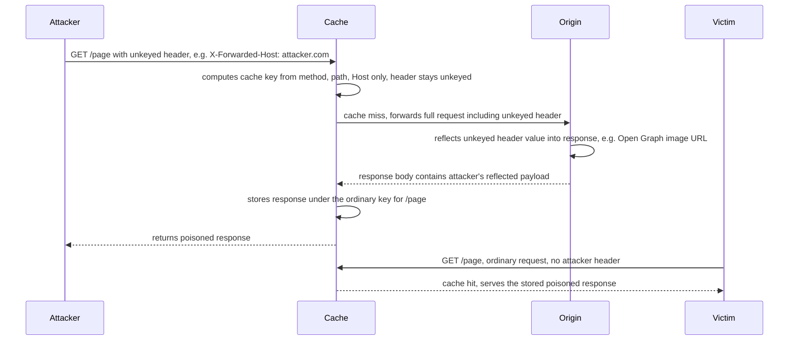

# Web Cache Poisoning

> Web cache poisoning turns a shared cache into an exploit delivery system. A cache decides that two requests are "the same" by comparing only a subset of the request, the cache key (typically method plus path plus query string plus Host). Everything else (most headers, cookies, sometimes the port, sometimes whole query parameters) is unkeyed: it can influence the generated response but is invisible to the cache's equivalence check. If any unkeyed input reaches a response-affecting sink (a reflected value, an imported script URL, a redirect target, a routing decision) and that response is then stored, the attacker sends one request with a poisoned unkeyed input and the cache serves the harmful response to every subsequent user whose keyed components match. The root cause is a discrepancy between what the cache keys on and what the application actually uses to build the response. This class was popularized by James Kettle's 2018 "Practical Web Cache Poisoning" and extended in his 2020 "Web Cache Entanglement".

**Interview frequency:** Common

## How it works

A web cache (Varnish or Nginx on-prem, a CDN like Cloudflare / Akamai / Fastly / CloudFront, or an application-integrated cache like Drupal's) sits between users and the origin. On a request it computes the cache key, looks for a stored response under that key, and either serves the hit or forwards the miss to origin and stores the fresh response for the key's lifetime.

The cache key is the whole game. A typical key covers the request line and Host:

```http
GET /blog/post.php?mobile=1 HTTP/1.1     <- keyed (method, path, query)
Host: example.com                        <- keyed
User-Agent: Mozilla/5.0 ... Firefox/57.0 <- usually unkeyed
Accept-Language: en-US,en;q=0.5          <- unkeyed
Cookie: language=en;                     <- usually unkeyed
X-Forwarded-Host: example.com            <- unkeyed
```

Two requests that differ only in unkeyed components are treated as equivalent, so a response generated for the first is served to the second. That is already an accidental-breakage engine (serve the Polish page to English users because `Cookie: language` is unkeyed). It becomes an attack when the unkeyed input is attacker-chosen and reaches a dangerous sink.



Response-header mechanics that govern all of this:

- `Cache-Control` (`public`, `private`, `no-store`, `no-cache`, `max-age`) is the origin's caching directive. Crucially it is advisory to the CDN: Kettle poisoned Red Hat despite `Cache-Control: public, no-cache`, because the fronting cache (Akamai) cached anyway<sup>[[1]](#ref1)</sup>. Always test rather than assume a header prevents caching.
- `Vary` lists request headers that should be promoted into the key (commonly `Vary: User-Agent` so mobile pages are not served to desktop). In practice `Vary` is used crudely, and some CDNs (Cloudflare) ignore it outright, so it is an unreliable defense but a useful attacker signal: `Vary: User-Agent` tells you the payload will only hit users with your exact User-Agent, enabling selective targeting.
- `Age` (seconds the response has sat in cache) and `max-age` together tell an attacker the exact second a cache entry expires, so a single well-timed request can re-poison it instead of a noisy request flood.

CDN-specific behavior matters. Akamai supports `Pragma: akamai-x-get-cache-key` which echoes the computed key in `X-Cache-Key`, letting you see the key directly. Cloudflare exposes `CF-Cache-Status` (MISS / HIT / DYNAMIC) and `/cdn-cgi/trace` (shows which regional colo served you, e.g. `colo=AMS`); because CDNs are geographically sharded, you often must poison the specific regional cache your victim uses.

Testing methodology hinges on a cache buster. To probe unkeyed inputs without poisoning real users, give every test request a unique cache key (add a unique query parameter, or in Param Miner<sup>[[2]](#ref2)</sup> add a `$randomplz` value). To then confirm a payload was actually cached, resend the request without the malicious header and fetch the URL from a clean browser: if the payload persists, it is cached.

## Quick reference

```http
# Unkeyed X-Forwarded-Host reflected into an Open Graph image URL, then stored under
# the ordinary /en cache key and served to every subsequent visitor as stored XSS
GET /en?cb=1 HTTP/1.1
Host: www.redhat.com
X-Forwarded-Host: a."><script>alert(1)</script>

HTTP/1.1 200 OK
Cache-Control: public, no-cache
...
<meta property="og:image" content="https://a."><script>alert(1)</script>"/>
```

| Invariant | Where enforced | How violated | Source |
|---|---|---|---|
| The cache key includes every input that affects the generated response | Cache key construction | `X-Forwarded-Host`, `X-Host`, `X-Forwarded-Scheme`, port, or query string affect the response but are excluded from the key, so one poisoned request is served to every subsequent user with matching keyed components | <sup>[[10]](#ref10)</sup> |
| Unkeyed input is never reflected into HTML, resource URLs, redirects, or routing decisions | Response-generation code | An unkeyed `X-Forwarded-Host` header is reflected into an Open Graph image URL or a `<script src>`, turning an otherwise-unreachable header reflection into stored, mass-delivery XSS | <sup>[[1]](#ref1)</sup> |
| `Cache-Control: private`/`no-store` on a response is verified empirically against the actual fronting cache tier, never assumed from the header alone | Cache configuration testing (cross-machine fetch) | Akamai cached a Red Hat response marked `public, no-cache` anyway, because `Cache-Control` is advisory to the CDN, not enforced | <sup>[[11]](#ref11)</sup> |
| Cache and origin parse query delimiters, ports, and encoding identically before either keys or serves the request | Cache-key normalization | A `?` vs `;` delimiter mismatch (cache parameter cloaking) or an unkeyed port lets an excluded parameter or port carry a payload the cache never treats as part of the key | <sup>[[12]](#ref12)</sup> |
| A cache never stores an error response (4xx/5xx) against a legitimate URL unless a specific path opts in | CDN error-caching configuration | An oversized header block, a method-override, or an injected control character makes the origin return a cacheable error that the CDN stores against the real URL, breaking the page for every subsequent visitor (CPDoS) | <sup>[[7]](#ref7)</sup> |
| Front-end and back-end agree on where one request ends and the next begins before either reuses the connection | `Transfer-Encoding`/`Content-Length` normalization at the edge | A CL.TE/TE.CL/TE.TE or H2 downgrade desync lets a smuggled request's response land on another user's connection, and the front-end cache stores it against that user's URL | <sup>[[8]](#ref8)</sup> |

## Attack techniques

### 1. Reflected unkeyed header into cacheable XSS

The simplest case: an unkeyed header is reflected into HTML without sanitization. `X-Forwarded-Host` is a classic because frameworks and CDNs frequently honor it to build absolute URLs. James Kettle's canonical Red Hat example<sup>[[1]](#ref1)</sup> built an Open Graph image URL from it:

```http
GET /en?cb=1 HTTP/1.1
Host: www.redhat.com
X-Forwarded-Host: a."><script>alert(1)</script>

HTTP/1.1 200 OK
Cache-Control: public, no-cache
...
<meta property="og:image" content="https://a."><script>alert(1)</script>"/>
```

WHY it works: `X-Forwarded-Host` is unkeyed, so the poisoned response is stored under the ordinary key for `/en`, then served to everyone who requests the legitimate URL with no interaction. This converts a header-only reflected XSS (normally useless, because you cannot force another user's cross-domain request to carry a custom header) into a stored, mass-delivery XSS. Header names worth spraying: `X-Forwarded-Host`, `X-Host`, `X-Forwarded-Server`, `X-Forwarded-Scheme`, `X-Forwarded-Proto`, `X-Original-URL`, `X-Rewrite-URL`, `X-Forwarded-For`, plus obscure ones (`translate`, `bucket`, `path_info`).

### 2. Unsafe resource import (script src hijack)

If an unkeyed header generates a URL for an imported resource (script, stylesheet, JSON), pointing it at attacker infrastructure yields code execution. Kettle's unity3d.com case<sup>[[1]](#ref1)</sup> used `X-Host`:

```http
GET / HTTP/1.1
Host: unity3d.com
X-Host: attacker-labs.net

HTTP/1.1 200 OK
Via: 1.1 varnish-v4
Age: 174
Cache-Control: public, max-age=1800
...
<script src="https://attacker-labs.net/sites/files/foo.js"></script>
```

The `Age: 174` and `max-age=1800` pair reveals the entry expires 1626 seconds from now, so a single timed request re-poisons cleanly. DOM-based variants apply to imported JSON: poison the response so JavaScript fetches an attacker-controlled i18n / config file (`{"Show more":"<svg onload=alert(1)>"}`), which a client-side sink then executes. If the poisoned load is cross-origin JSON, serve it with `Access-Control-Allow-Origin: *` so the page can read it. (Real case: `catalog.data.gov` `data-site-root` attribute driving an i18n fetch.)

### 3. Chaining multiple unkeyed inputs into an open redirect

One header often confuses only part of the stack; chain several. A site that redirects HTTP to HTTPS using `X-Forwarded-Scheme`, and generates URLs from `X-Forwarded-Host`, can be combined:

```http
GET /en HTTP/1.1
Host: redacted.net
X-Forwarded-Host: attacker.com
X-Forwarded-Scheme: nothttps

HTTP/1.1 301 Moved Permanently
Location: https://attacker.com/en
```

`X-Forwarded-Scheme: nothttps` triggers the redirect; `X-Forwarded-Host` sets its destination. Cached, this persistently redirects every visitor of a normal URL to the attacker, enabling credential/CSRF-token theft (redirect a POST) or malware delivery.

### 4. Route poisoning and Open Graph / social hijack

Some stacks use headers for internal routing, not just URL generation. HubSpot honored `X-Forwarded-Server` over `Host`, letting Kettle serve his own HubSpot-hosted page's payload on `goodhire.com`<sup>[[1]](#ref1)</sup>. Open Graph hijack overrides `og:url` via `X-Forwarded-Host` so anyone sharing the page shares attacker content. The Mozilla SHIELD case poisoned Normandy (`normandy.cdn.mozilla.net`) via `X-Forwarded-Host` behind an Nginx cache, redirecting tens of millions of Firefox clients' recipe fetches to attacker infrastructure.

### 5. Exploiting cache-key flaws: unkeyed port and unkeyed query string

Even keyed components get transformed before keying, opening a gap between the keyed value and the value the app sees. Kettle's "Web Cache Entanglement" (Black Hat USA 2020)<sup>[[3]](#ref3)</sup> formalized this. Probe with a cache oracle (a cacheable endpoint that reflects the URL and signals hit/miss). Unkeyed port: some caches strip the port from Host before keying but the app still uses the full header:

```http
GET / HTTP/1.1
Host: vulnerable-website.com:1337

HTTP/1.1 302 Moved Permanently
Location: https://vulnerable-website.com:1337/en
Cache-Status: miss
```

A follow-up without the port returns the `:1337` response as a `hit`, proving the port is unkeyed. A dud port becomes a DoS (home page redirects everyone to a dead port until expiry); a non-numeric port can carry XSS. Unkeyed query string: a very common transform is excluding the entire query string from the key. This masks reflected XSS (scanners see only cached responses and think the parameter is inert) and then makes it worse: poison via `?xss=payload` and the payload is served on the clean URL. Because query cache busters are now useless, bust the cache via a keyed header instead:

```http
Accept-Encoding: gzip, deflate, cachebuster
Accept: */*, text/cachebuster
Cookie: cachebuster=1
Origin: https://cachebuster.vulnerable-website.com
```

### 6. Cache parameter cloaking (delimiter discrepancies)

When only specific parameters are excluded from the key (analytics params like `utm_content`), a parsing discrepancy between cache and app lets you smuggle a payload into an excluded parameter. If the cache treats any `?` as a parameter delimiter but the origin treats only the first `?` as one:

```http
GET /?example=123?excluded_param=payload
```

The cache sees two params and excludes the second (clean key); the origin sees one param `example` whose value is the entire tail including the payload. The Ruby on Rails variant abuses `;` as an extra delimiter plus last-value-wins:

```http
GET /?keyed_param=abc&excluded_param=123;keyed_param=payload
```

The cache splits on `&` only, keys `keyed_param=abc`, and drops the excluded param; Rails splits on `;` too, sees a duplicate `keyed_param`, and uses the last one (the payload). Powerful against JSONP: override the `callback` function name to execute arbitrary JS while keeping an innocent key.

### 7. Fat GET

If the HTTP method or a method-override is unkeyed, put the payload in a request body on a GET so the key derives from the request line but the app reads the body value:

```http
GET /?param=innocent HTTP/1.1
Host: innocent-website.com
X-HTTP-Method-Override: POST

param=payload
```

The key is `?param=innocent`; the origin uses `param=payload` from the body. Requires the origin to accept bodies on GET (some frameworks do by default).

### 8. Normalized cache keys (resurrecting "unexploitable" XSS)

Reflected XSS is often unexploitable because the victim's browser URL-encodes the payload and the server never decodes it. If the cache normalizes (decodes) the key, then `?param="><test>` and `?param=%22%3e%3ctest%3e` share one key. Poison via Repeater with the raw, unencoded payload; the victim's browser sends the encoded form, which normalizes to the same key, so the cache serves the poisoned unencoded response and the payload executes.

### 9. Cache key injection

If keyed components are concatenated into the key string without escaping the delimiter, you can craft two different requests with the same key. With a `__` delimiter and an `Origin` header folded into the key:

```http
GET /path?param=123 HTTP/1.1
Origin: '-alert(1)-'__

HTTP/1.1 200 OK
X-Cache-Key: /path?param=123__Origin='-alert(1)-'__
<script>...'-alert(1)-'...</script>
```

The victim visiting `/path?param=123__Origin='-alert(1)-'__` produces the same key and receives the poisoned response. This weaponizes an otherwise-unexploitable client-side bug in a keyed header.

### 10. Internal (fragment) cache poisoning

Application-level caches (Drupal's built-in cache) sometimes cache reusable response fragments with no meaningful key. Poison a fragment used on every page (via a basic `Host`-header trick) and you poison every page for every user with one request. Kettle's Drupal chain<sup>[[1]](#ref1)</sup> combined the internal cache's handling of `X-Original-URL` (which includes the query string in its key) with a Drupal open redirect (`?destination=` bypassed via `//?destination=https://evil.net\@site/`, browsers converting `\` to `/`) to persistently hijack JavaScript imports on business.pinterest.com and to do nested cache poisoning (poison the internal cache, then use it to poison the external cache). Fixed via coordinated disable of `X-Original-URL` / `X-Rewrite-URL` support: Drupal SA-CORE-2018-005<sup>[[4]](#ref4)</sup>, Symfony CVE-2018-14773<sup>[[5]](#ref5)</sup>, Zend ZF2018-01.

### 11. Web cache deception

Web cache deception (Omer Gil, 2017)<sup>[[6]](#ref6)</sup> is the sibling class to poisoning and the one interviewers pair with it. The attacker lures an authenticated victim to a URL like `https://bank.com/account.php/nonexistent.css` (or `.jpg`, `.js`). The origin router treats the path as `/account.php`, ignores the trailing `/nonexistent.css`, and returns the victim's private authenticated HTML. The fronting cache sees a `.css` suffix, matches a static-file rule that caches by extension and disregards `Cache-Control: private`, and stores the private response under the CSS URL. The attacker then fetches the same URL unauthenticated and reads the cached victim data: session tokens, PII, CSRF tokens, whatever the page renders.

Two preconditions must both hold. First, permissive path handling on origin: path parameters in Nginx/Apache, ignored trailing segments, or framework routes that match on prefix. Second, a cache tier that decides cacheability by URL suffix or Content-Type rather than honoring the origin's `Cache-Control`. Variants extend the same idea with delimiter and traversal tricks so both parsers accept the request: `/account.php;x.css`, `/account.php%00.css`, `/account.php%3Bfoo.css`, and `/account.php/..%2fstatic/foo.css` all satisfy an origin that stops at the first delimiter while presenting a static suffix to the cache.

The contrast with poisoning is worth stating cleanly because it is a common interviewer probe. Deception has one victim per URL (the authenticated user the attacker lures), no unkeyed input, and steals private data. Poisoning has many victims per URL, requires an unkeyed sink, and injects attacker content. Defenses converge though: origin should route strictly and reject unknown trailing segments (disable `AcceptPathInfo` in Apache, avoid `try_files $uri` chains that fall through to a script for arbitrary suffixes in Nginx), the cache should honor `Cache-Control: private` and `no-store` and must never cache by extension alone on paths that can be authenticated, and authenticated responses should always carry `Cache-Control: private, no-store` explicitly.

### 12. Cache-Poisoned Denial of Service (CPDoS)

CPDoS (Nguyen et al., 2019)<sup>[[7]](#ref7)</sup> is the DoS-via-poisoning taxonomy interviewers pair with the poisoning-for-XSS chain. All three variants share the same shape: the attacker sends one request that the CDN forwards but the origin rejects with a cacheable error response, the CDN stores that error against a legitimate URL key, and every subsequent user of that URL receives the cached error until eviction.

HTTP Header Oversize (HHO): the attacker sends a request with a header block larger than the origin's limit but under the CDN's limit. The origin returns a 400 Bad Request, the CDN caches it against the legitimate URL, and the page is broken for everyone until it expires. HTTP Method Override (HMO): the attacker sends `GET /path` with `X-HTTP-Method-Override: DELETE` (or `POST`, `PUT`, `TRACE`). The CDN keys the GET; the origin honors the override and returns a 405 or 501 which is then stored under the GET key. HTTP Meta Character (HMC): the attacker injects a control character (`\n`, `\r`, `\a`) into a header the CDN forwards verbatim but the origin rejects, poisoning the URL with the resulting cached error.

Defenses require symmetry across the tiers. Normalize header size limits so the CDN's maximum is less than or equal to the origin's, so any oversized request is rejected at the edge and never reaches origin. Strip method-override headers (`X-HTTP-Method-Override`, `X-Method-Override`, `X-HTTP-Method`) at the edge. Reject control characters in header values at the edge before forwarding. Configure the cache to never store 4xx or 5xx responses unless a specific path opts in, and confirm empirically because many CDNs cache selected error codes by default (404 in particular).

### 13. Request smuggling to cache poisoning

The highest-severity real-world chain fuses HTTP request smuggling with cache poisoning, and every candidate should be ready for the follow-up. When the front-end (typically the CDN) and back-end disagree on where one request ends and the next begins (CL.TE, TE.CL, TE.TE, or the H2.CL/H2.TE downgrade desyncs), an attacker prepends a smuggled request that the back-end processes but the front-end does not see as separate. The back-end's response to the smuggled request lands on the socket that the front-end is reusing for the next real user, so that user (and the front-end cache indexing by their URL) receives the smuggled response.

If the front-end then stores that response against the victim's URL key, the smuggled response is served to every subsequent user, poisoning the cache without any unkeyed reflected header at all. This is the payoff step in Kettle's 2019 "HTTP Desync Attacks"<sup>[[8]](#ref8)</sup> and 2021 "HTTP/2: The Sequel is Always Worse"<sup>[[9]](#ref9)</sup>: the desync is the primitive, cache poisoning is the amplifier that turns a per-socket attack into a per-URL one. Impact is stored XSS, arbitrary redirect, or arbitrary content at CDN scale against arbitrary victims of the site.

Defenses target both the desync primitive and the amplification. Normalize `Transfer-Encoding` and `Content-Length` at the edge and reject any request that carries both or an ambiguous form of either. Prefer HTTP/2 all the way to origin and reject HTTP/1.1 upstream where the edge speaks HTTP/2, so downgrade desyncs disappear. Disable connection reuse from the front-end to the back-end (fresh TCP or HTTP/2 stream per request) so a smuggled request cannot land against a different user's socket. Where those are not feasible, aggressive header-value validation (reject `Transfer-Encoding` with anything other than `chunked`, reject obfuscated values like `Transfer-Encoding: xchunked`) closes the common variants.

### Detection and confirmation

- Param Miner<sup>[[2]](#ref2)</sup> ("Guess headers" / "Guess parameters") sprays large header/param wordlists and flags inputs that change the response; enable its cache-buster options to avoid poisoning real users.
- Establish a cache oracle and read hit/miss signals (`X-Cache`, `CF-Cache-Status`, `Age`, `Via`, distinct response times). On Akamai, `Pragma: akamai-x-get-cache-key` echoes the key.
- Confirm by resending without the payload header and fetching from a clean browser/machine: persistence proves caching, not just reflection.

Impact spans mass stored XSS, persistent open redirect, script/JSON hijack to full page control, social-media (Open Graph) hijack, mass client misdirection (SHIELD), and denial of service (dud port, cached error, oversized-header 400 cached against a hot URL).

## Defense

### Real fix

1. Do not cache dynamic or authenticated responses. The definitive fix is to disable caching where it is not needed: many sites are only vulnerable because a CDN adopted for DDoS/TLS turned caching on by default. Where caching is required, restrict it to genuinely static responses and be strict about what "static" means (an attacker must not be able to make the origin serve a malicious variant of a static path).
2. Eliminate response-affecting unkeyed inputs. Audit every page with Param Miner<sup>[[2]](#ref2)</sup> to enumerate which headers/cookies/params the app actually reads. If a header (`X-Forwarded-Host`, `X-Host`, `X-Original-URL`, etc.) is not needed, disable it at the edge; frameworks silently supporting it are the recurring root cause.
3. Include every response-affecting input in the cache key, or strip it before it reaches origin. If you exclude something from the key for performance, rewrite (remove) the request component rather than merely ignoring it, so the value the app sees always matches the value the cache keyed.
4. Do not reflect unkeyed input into HTML, resource URLs, redirects, or routing. Client-side vulnerabilities in HTTP headers must be patched even when they look unreachable: a cache quirk can make them reachable.
5. Normalize cache keys consistently and escape delimiters. Ensure the cache and origin parse the URL, query delimiters (`?`, `&`, `;`), port, and encoding identically, so no cloaking, key-injection, or normalization gap exists.
6. Reject fat GET requests and unkeyed method overrides. Do not accept bodies on GET; strip `X-HTTP-Method-Override` at the edge.

### Defense in depth

1. Know your CDN's key configuration. Understand default key composition, `Vary` handling (Cloudflare ignores it), and whether directives like `no-store`/`private` are actually honored by the cache tier; confirm empirically, do not trust the origin header alone. This does not close any gap by itself, it is what tells you whether the fixes above are actually in effect.

## Interviewer probes

Mid: "What's the fundamental bug that makes web cache poisoning possible?"

Principal: The cache keys on a subset of the request, typically method, path, query string, and Host, while the origin builds the response from a larger set of inputs that includes headers, cookies, and sometimes the port. Everything in that gap is unkeyed: attacker-controlled but invisible to the cache's equivalence check. If any unkeyed input reaches a response-affecting sink, one poisoned request gets stored under the ordinary key and served to everyone whose keyed components match. Every technique in this doc, unkeyed header, unkeyed port, cloaked param, normalized key, key injection, is a specific instance of that same X != Y gap.

Mid: "If a response is served with `Cache-Control: private, no-cache`, is it safe from poisoning?"

Principal: No, and assuming so is the tell of a junior answer. `Cache-Control` is advisory to the fronting cache, not enforced. Kettle poisoned Red Hat despite the response carrying `public, no-cache`, because Akamai cached it anyway. The only way to know whether a given cache tier honors a directive is to test empirically with a cross-machine fetch, not to read the header and conclude the response is uncacheable.

Mid: "If a header-reflected value is only exploitable via a custom header, isn't that basically unexploitable since you can't make a victim's browser send arbitrary headers cross-origin?"

Principal: That reasoning is correct for a single request, and it's exactly why teams dismiss header-reflected XSS or encoded-only reflected XSS as low severity. A cache breaks that assumption: the attacker sends one request with the header, the response gets stored under the normal URL, and every subsequent visitor who never sent that header receives the poisoned response. Caching converts reflected into stored and removes the need to lure the victim to a crafted URL at all, which is why these "unexploitable" bugs are worth re-triaging once you know caching sits in front of the app.

Mid: "Does setting `Vary: User-Agent` fix a poisoning bug that's triggered by a spoofable header?"

Principal: It can help, but treat it as fragile, not a fix. Some CDNs, Cloudflare among them, ignore client `Vary` outright, so the header does nothing there. Where it is honored, it's also a double-edged signal: promoting `User-Agent` into the key tells the attacker exactly which requests share a cache entry, enabling surgical targeting of one victim's exact UA string or maximizing blast radius by picking the most common one. `Vary` is worth checking, but the real fix is closing the unkeyed-input gap directly, not relying on the cache to key around it.

Mid: "What's the actual difference between web cache poisoning and web cache deception?"

Principal: They're mirror images that share the same mechanics but invert the data flow and the victim model. Poisoning abuses an unkeyed input reaching a response-affecting sink to push attacker-chosen content into the cache, and it has many victims per poisoned URL, everyone whose keyed request matches. Deception abuses the cache's own rules (an extension or path match) to store one specific victim's private, authenticated response under a URL the attacker can then fetch unauthenticated, and it has exactly one victim per exploited URL. Poisoning requires an unkeyed sink; deception requires no unkeyed input at all, just a routing and caching-rule mismatch.

Mid: "CDNs are geographically sharded. Does that matter for exploiting a poisoning bug?"

Principal: Yes, and it's an operational detail that separates candidates who've actually tested this from those who've only read about it. A poisoned entry lives in the regional cache (colo) that served the request, not globally, so to hit a specific victim, or a specific automated consumer like Facebook's Open Graph scraper, you have to poison the colo they'll actually hit. That's discoverable via `/cdn-cgi/trace` on Cloudflare or by DNS-resolving the target from multiple regions, then poisoning from a cheap VPS or via a Host-header override in that region.

Mid: "If a cache entry only lives for 30 minutes, doesn't that cap the blast radius of a poisoning attack?"

Principal: No, and this is where interviewers probe whether a candidate understands the attack as sustained rather than one-shot. `Age` and `max-age` together tell an attacker the exact second an entry expires, so instead of a noisy flood of re-poisoning requests, a single well-timed request right after expiry keeps the entry poisoned indefinitely with minimal signal. Duration of any one cache entry is not a meaningful mitigation on its own; the fix has to close the underlying unkeyed-input gap, not rely on TTL to limit exposure.

## Sources

<a id="ref1"></a>[1] James Kettle, "Practical Web Cache Poisoning". PortSwigger Research. 2018. https://portswigger.net/research/practical-web-cache-poisoning

<a id="ref2"></a>[2] PortSwigger, "Param Miner" extension. GitHub. Retrieved 2026. https://github.com/PortSwigger/param-miner

<a id="ref3"></a>[3] James Kettle, "Web Cache Entanglement: Novel Pathways to Poisoning". Black Hat USA. 2020. https://portswigger.net/research/web-cache-entanglement

<a id="ref4"></a>[4] Drupal, "SA-CORE-2018-005". Retrieved 2026. https://www.drupal.org/SA-CORE-2018-005

<a id="ref5"></a>[5] Symfony, "CVE-2018-14773" (remove support for legacy X-Original-URL / X-Rewrite-URL). Retrieved 2026. https://symfony.com/blog/cve-2018-14773-remove-support-for-legacy-and-risky-http-headers

<a id="ref6"></a>[6] Omer Gil, "Web Cache Deception Attack". 2017. https://omergil.blogspot.com/2017/02/web-cache-deception-attack.html

<a id="ref7"></a>[7] Hoai Viet Nguyen et al., "Your Cache Has Fallen: Cache-Poisoned Denial-of-Service Attack". CCS. 2019. https://cpdos.org/

<a id="ref8"></a>[8] James Kettle, "HTTP Desync Attacks: Request Smuggling Reborn". PortSwigger Research. 2019. https://portswigger.net/research/http-desync-attacks-request-smuggling-reborn

<a id="ref9"></a>[9] James Kettle, "HTTP/2: The Sequel is Always Worse". PortSwigger Research. 2021. https://portswigger.net/research/http2

<a id="ref10"></a>[10] PortSwigger Web Security Academy, "Web cache poisoning". Retrieved 2026. https://portswigger.net/web-security/web-cache-poisoning

<a id="ref11"></a>[11] PortSwigger, "Exploiting cache design flaws". Retrieved 2026. https://portswigger.net/web-security/web-cache-poisoning/exploiting-design-flaws

<a id="ref12"></a>[12] PortSwigger, "Exploiting cache implementation flaws". Retrieved 2026. https://portswigger.net/web-security/web-cache-poisoning/exploiting-implementation-flaws
