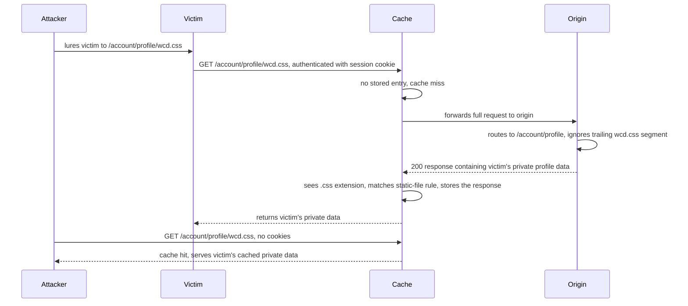

# Web Cache Deception

> Web cache deception (WCD) tricks a shared cache into storing a victim's sensitive, dynamic, authenticated response under a URL that looks static, so the attacker can then request that same URL and read the cached private data. The engine is a discrepancy between how the cache and the origin interpret the URL path. The cache decides "this is a cacheable static asset" by matching a surface feature of the path (a `.css` extension, a `/static/` prefix, a `robots.txt` file name), while the origin ignores that surface feature and still serves the dynamic, per-user page (account details, API keys, CSRF tokens). The attacker lures the victim to `https://site/account/profile/wcd.css`; the origin returns the victim's authenticated profile; the cache, seeing `.css`, stores it under that key; the attacker fetches `wcd.css` and gets the victim's data. It is the mirror image of cache poisoning: poisoning uses unkeyed inputs to push attacker content to many victims, deception uses the cache key itself to pull one victim's private response into a location the attacker controls. The class was discovered and demonstrated by Omer Gil in 2017 (famously against PayPal) and vastly extended by PortSwigger's 2024 "Gotta cache 'em all" research.

**Interview frequency:** Common

## How it works

A cache stores a response only when a cache rule says the request is for a cacheable resource, and it identifies stored responses by a cache key (typically the URL path plus query string, sometimes plus selected headers). WCD needs two things to line up: a cache rule that fires on the attacker's crafted URL, and an origin that ignores the part of the URL that made the rule fire.

Cache key composition matters and is the deeper reason the attack exists. The canonical shared-cache key is method plus host plus path plus query string; session cookies and `Authorization` headers are deliberately excluded, because keying on them would give every user a private copy and destroy shared-cache efficiency. That exclusion is exactly the precondition for WCD: the victim's authenticated response is stored under a key with no per-user component, so any anonymous requester with the same path hits it. `Vary: Cookie` or `Vary: Authorization` on the response instructs the shared cache to include those header values in the key and is sometimes offered as a mitigation, but it is fragile in practice. CDNs frequently ignore or strip client `Vary` on responses that match a static rule, `Vary: Cookie` explodes cache cardinality to effectively one entry per user (so operators silently downgrade or drop it), and it does nothing if a broad CDN rule pre-empts the origin's cache directives. Treat Vary as at best defense-in-depth; the authoritative controls are `no-store` and Content-Type verification.

Cache rules that matter for WCD are almost always path-string rules:

- Static file extension rules: cache anything whose path ends in `.css`, `.js`, `.png`, `.ico`, `.woff`, etc. This is the default in most CDNs and the most common WCD trigger.
- Static directory rules: cache anything under a prefix like `/static`, `/assets`, `/scripts`, `/images`.
- File name rules: cache specific universally-present files by exact name, such as `robots.txt`, `index.html`, `favicon.ico`.

The core requirement is a parsing discrepancy: the cache and origin must disagree on where the "real" resource ends and the decorative static-looking suffix begins. There are three families of discrepancy: path mapping, delimiters (including delimiter decoding), and path normalization.



Detecting cached responses during testing:

- `X-Cache: hit` (served from cache), `miss` (fetched from origin, usually then stored, resend to confirm it flips to `hit`), `dynamic` (origin generated it, not cacheable), `refresh` (revalidated).
- `Cache-Control: public` with `max-age` greater than 0 suggests cacheability, but the CDN can override it either way, so it is a hint not proof.
- A large drop in response time on the second identical request also indicates a cache hit.

Always use a cache buster while testing so each probe has a unique key and you do not read your own poisoned entry or poison a real user. Because the URL path and query are keyed, add and vary a query string per request (Param Miner's "Add dynamic cachebuster" automates this). When fetching a victim's cached response, do it in Burp, not a browser: some apps redirect session-less users or invalidate local data, hiding the vulnerability.

Target selection: pick an endpoint that returns dynamic sensitive data (review the raw response in Burp, not just the rendered page, since tokens and PII may be hidden) and that supports `GET`, `HEAD`, or `OPTIONS`, since state-changing methods are generally not cached.

## Quick reference

```
# Web cache deception: path-mapping discrepancy (Omer Gil's original PayPal attack)
GET /myaccount/home/x.css HTTP/1.1
Host: example.com
# Origin (REST-style) ignores the trailing "x.css" segment and returns the authenticated /myaccount/home page.
# Cache sees the .css extension, matches its static-file rule, and stores the victim's private response under that key.
# The attacker then requests the same URL unauthenticated and receives the victim's cached private data.
```

| Invariant | Where enforced | How violated | Source |
|---|---|---|---|
| A response containing another user's authenticated or dynamic data is never written into the shared cache | Origin `Cache-Control: no-store, private` on every dynamic response | A static-extension, static-directory, or file-name cache rule stores the response anyway because no explicit directive overrides it | <sup>[[5]](#ref5)</sup> |
| The cache key's static-looking URL actually maps to a static resource at the origin, not a dynamic or authenticated route | Origin URL-to-resource routing | REST-style routing treats a trailing segment like `x.css` as an insignificant parameter and still serves the dynamic profile | <sup>[[1]](#ref1)</sup> |
| Cache and origin agree on which characters delimit the end of the resource path | Framework path-parsing / routing layer | Spring's `;`, Rails' `.`, and OpenLiteSpeed's `%00` truncate the path at the origin but not at the cache, or vice versa | <sup>[[3]](#ref3)</sup> |
| Cache and origin apply identical percent-decoding before parsing delimiters and normalizing the path | Cache/CDN URL parser vs. origin URL parser | One tier decodes `%23`, `%2f`, or `%3f` before routing and the other does not, so a delimiter or dot-segment resolves differently on each side | <sup>[[4]](#ref4)</sup> |
| A cached response's actual `Content-Type` matches the extension or rule the cache keyed on | CDN Content-Type verification (for example Cloudflare Cache Deception Armor) | Origin returns `text/html` profile data for a request ending in `.css`, and the cache stores it because it only inspected the URL, not the response type | <sup>[[7]](#ref7)</sup> |
| CDN caching rules never take precedence over explicit origin `Cache-Control` on dynamic routes | CDN rule-precedence configuration | A broad "cache all `*.css`" extension rule is evaluated before, and overrides, the origin's `no-store` | <sup>[[7]](#ref7)</sup> |

## Attack techniques

### 1. Path mapping discrepancies (the classic /account/profile.css)

Frameworks map URLs to resources in different styles. Traditional mapping treats the path as a filesystem path (`/path/in/filesystem/resource.html`). REST-style mapping abstracts it (`/path/resource/param1/param2`), where trailing segments are just parameters.<sup>[[1]](#ref1)</sup> The discrepancy:

```http
GET /user/123/profile/wcd.css HTTP/1.1
Host: example.com
```

- Origin (REST-style): routes to the `/user/123/profile` endpoint, treats `wcd.css` as an insignificant extra path parameter, and returns user 123's profile.
- Cache (traditional / extension rule): sees a path ending in `.css`, decides it is a stylesheet, and stores the profile response.

This is exactly Omer Gil's original 2017 attack: requesting `https://www.paypal.com/myaccount/home/x.css` caused the origin to serve the authenticated account home while the cache stored it as a CSS file that the attacker could then retrieve.<sup>[[2]](#ref2)</sup> Test the origin side by appending an arbitrary segment (`/api/orders/123` becomes `/api/orders/123/foo`): if you still get order data, the origin ignores the extra segment. Test the cache side by making that segment a static extension (`/api/orders/123/foo.js`) and checking for a cache hit. Try several extensions: `.css`, `.js`, `.ico`, `.exe`, `.png`. This attack is endpoint-specific because abstraction rules differ per route.

### 2. Delimiter discrepancies

Even with identical mapping, cache and origin may disagree on which characters delimit the end of the resource. The URI RFC is permissive, so frameworks diverge:<sup>[[3]](#ref3)</sup>

- Java Spring uses `;` for matrix variables. Origin on Spring reads `/profile;foo.css` as `/profile` (truncating at `;`); a non-Spring cache treats `;foo.css` as part of the path and caches on `.css`.
- Ruby on Rails uses `.` as a format delimiter. `/profile.css` errors (no CSS formatter), but `/profile.ico` is unrecognized, falls back to the HTML formatter, and returns the profile, which a cache with an `.ico` rule stores.
- OpenLiteSpeed uses encoded null `%00` as a delimiter. Origin reads `/profile%00foo.js` as `/profile`; Akamai or Fastly caches treat `%00` and everything after as path.

```http
GET /settings/users/list;aaa.js HTTP/1.1
Host: example.com
```

Origin (Spring) interprets `/settings/users/list`; cache interprets the full `/settings/users/list;aaa.js` and stores it under the `.js` rule. WHY it works: the origin's delimiter truncates the static suffix away before routing, so the response is dynamic, while the cache never truncates and sees a static extension. Methodology: append an arbitrary string (`/list` becomes `/listaaa`) as a reference response, then insert a candidate delimiter (`/list;aaa`). If the response matches the base (`/list`), the origin treats the character as a delimiter. Then append a static extension and check for a cache hit to confirm the cache does not treat it as a delimiter. Brute force all ASCII characters with Burp Intruder (disable Intruder's automatic payload encoding). Because a framework uses delimiters consistently, one working delimiter usually works across many endpoints (unlike path mapping).

### 3. Delimiter decoding discrepancies

Sometimes both use the same delimiter but disagree on decoding. If a parser percent-decodes before parsing, an encoded delimiter suddenly truncates:

```http
GET /profile%23wcd.css HTTP/1.1
Host: example.com
```

- Origin decodes `%23` to `#`, uses `#` as a delimiter, interprets `/profile`, returns dynamic data.
- Cache does not decode `%23`, so it sees the literal path `/profile%23wcd.css` ending in `.css` and caches it.

The decode-then-forward ordering also matters. Some caches apply rules on the encoded URL, then decode and forward:<sup>[[4]](#ref4)</sup>

```http
GET /myaccount%3fwcd.css HTTP/1.1
Host: example.com
```

The cache applies the `.css` rule on the encoded path and stores the response, then decodes `%3f` to `?` and forwards `/myaccount?wcd.css` to the origin, which treats `?` as the query delimiter and serves `/myaccount`. Test with a range of encoded characters, especially non-printable ones: `%00`, `%0A` (newline), `%09` (tab), which can truncate when decoded. Encoded delimiters are also the way to reach characters the browser would otherwise mangle (browsers encode `{`, `}`, `<`, `>` and truncate at `#`), so an encoded form the cache or origin decodes can still be used in a real victim-facing exploit.

### 4. Static directory rules and normalization discrepancies

When the rule matches a prefix (`/static`, `/assets`) rather than an extension, exploit path-normalization differences (decoding slashes, resolving `..` dot-segments) with an encoded traversal.<sup>[[3]](#ref3)</sup>

Origin normalizes, cache does not:

```http
GET /static/..%2fprofile HTTP/1.1
Host: example.com
```

- Origin decodes `%2f` to `/` and resolves `/static/../profile` to `/profile`, returning dynamic data.
- Cache does not resolve dot-segments, sees the literal `/static/..%2fprofile` matching the `/static` prefix, and caches it.

The dot-segments must be encoded so the victim's browser does not resolve them before the request reaches the cache. Cache normalizes, origin does not (needs a delimiter too, because path traversal alone leaves the origin with an invalid path):

```http
GET /profile;%2f%2e%2e%2fstatic HTTP/1.1
Host: example.com
```

- Cache resolves `/profile/../static` to `/static` and caches on the prefix.
- Origin uses `;` as a delimiter, truncates to `/profile`, and returns dynamic data.

Encode all traversal characters when the cache does the normalization. Detect origin normalization by sending a non-cacheable request (a `POST`) with `/aaa/..%2fprofile`: if you get profile data, the origin decoded and resolved it. Detect cache normalization by taking a known-cached static request and inserting a traversal (`/assets/..%2fjs/stockCheck.js`): if it stops being cached, the cache resolved it to `/js/...`; confirm the rule is really prefix-based by replacing the tail with an arbitrary string (`/assets/aaa`) and checking it is still cached. Start by encoding only the second slash of the dot-segment, since some CDNs match the slash right after the static prefix.

### 5. File name rules (robots.txt, index.html, favicon.ico)

If the rule matches an exact file name, only the cache-normalizes-origin-does-not direction works (the crafted path must resolve, at the cache, to the exact cached file name):

```http
GET /profile%2f%2e%2e%2findex.html HTTP/1.1
Host: example.com
```

If the cache resolves this to `/index.html` (a cached file-name rule) while the origin does not, the origin returns the dynamic profile and the cache stores it under `/index.html`'s entry. Probe by requesting the candidate file name and checking for a cached response.<sup>[[3]](#ref3)</sup>

### 6. Delivery, SameSite cookies, and cache TTL

Web cache deception is only exploitable if the victim's browser actually issues the crafted request while authenticated, so delivery is part of the attack surface.<sup>[[5]](#ref5)</sup> The victim's request is a same-origin GET carrying the session cookie, and the attacker has several delivery primitives: a phishing link that lands the victim on the crafted URL, an `` or `<link rel="stylesheet" href>` embedded on an attacker-controlled page, an open redirect on the target that lands on the crafted path, or any HTML injection sink that only needs to emit a single tag. None of the CDN Set-Cookie heuristics interfere because the browser is only sending the cookie, not receiving one.

`SameSite` on the session cookie determines which of these vectors work and is a common corner-case probe. `SameSite=Lax`, the modern default, still rides top-level navigations (a clicked link) but blocks cross-site subresource requests, so the phishing-link vector remains viable while the `` and `<link>` embed vectors do not. `SameSite=Strict` blocks all cross-site delivery including top-level navigations, breaking the common cross-site exploit path and leaving only same-site vectors such as an open redirect on the target itself. `SameSite=None; Secure` is the most permissive and allows every delivery vector, which is why many WCD writeups implicitly assume it.

Once the victim's browser populates the cache entry, the attacker has until the CDN's TTL expires to fetch it from any IP with no cookies at all. Default TTLs for static-extension rules on major CDNs are commonly a few minutes to a few hours, and aggressive static caching pushes them to days, so the exploitation window is generous. The attacker can also re-lure the same or a different victim to keep the entry warm, which turns a short TTL into effectively unlimited exposure as long as at least one authenticated user visits the crafted URL per TTL cycle.

### Detection tooling and confirmation

- Burp Scanner automatically flags path-mapping WCD during audits; the Web Cache Deception Scanner BApp detects misconfigured caches.<sup>[[6]](#ref6)</sup>
- Confirm end to end: authenticate as a victim in one session, visit the crafted URL, then in a separate unauthenticated session (or Burp with no cookies) request the same URL and verify you receive the victim's private data with a cache-hit indicator.

## Defense

### Real fix

1. Never cache responses to authenticated or dynamic requests. Mark every dynamic response with `Cache-Control: no-store, private`. `no-store` forbids storage outright; `private` forbids shared-cache storage. This removes the stored-secret precondition regardless of any path trickery.
2. Configure the CDN so caching rules do not override origin `Cache-Control`. Many WCD incidents happen because a broad extension rule ("cache all `*.css`") is evaluated before, and wins over, the origin's `no-store`. Make origin directives authoritative for dynamic content.
3. Cache by response `Content-Type`, not by request URL extension. Enable the CDN's built-in WCD protection, which verifies the response `Content-Type` matches the requested extension (for example Cloudflare's Cache Deception Armor): a profile page returned as `text/html` for a `.css` request is refused caching.<sup>[[7]](#ref7)</sup>
4. Eliminate path-interpretation discrepancies. Ensure the cache and origin normalize, decode, and delimit URL paths identically (same dot-segment resolution, same encoded-slash handling, same delimiter set for `;`, `.`, `%00`, `%23`, `%3f`). Divergence is the vulnerability, so aligning the two parsers is the true fix; verify the URL the cache keyed actually maps to a real static file on origin.
5. Do not rely on extension-based caching for anything under authenticated routes. Restrict cacheable paths to directories that contain only genuinely static assets, and confirm those routes never return per-user data even with extra path segments, delimiters, or traversal appended.

### Defense in depth

1. Do not rely on CDN Set-Cookie or Authorization heuristics as a safety net. The invariant enforced is that a response containing a `Set-Cookie` header or a request bearing `Authorization` should not be cached, and Cloudflare, Fastly, and Akamai all implement this by default.<sup>[[7]](#ref7)</sup> It works when it fires because those signals reliably indicate a per-user response. The invariant is incomplete: many WCD-vulnerable endpoints authenticate from an existing session cookie and never emit `Set-Cookie` on the sensitive response (profile pages, API-key pages, dashboards), so the heuristic never fires and the response is treated as anonymous. Common wrong implementation: assume "we have a CDN and CDNs don't cache authenticated pages" and skip explicit `Cache-Control` on dynamic routes. The CDN only refuses to cache responses it can see are authenticated; a plain `GET /profile` with a session cookie that returns HTML or JSON with no `Set-Cookie` is indistinguishable from a static fetch. Enforce origin `Cache-Control: no-store, private` on every dynamic response and Content-Type-based cacheability on the CDN; treat the Set-Cookie heuristic as belt-and-suspenders only.

## Interviewer probes

**Q: Why doesn't the shared cache just key on the session cookie, which would make WCD impossible?**

- Mid: Because keying on the cookie would give every user their own cache entry, defeating the point of a shared cache.
- Principal: The canonical shared-cache key is method plus host plus path plus query string, and cookies and `Authorization` are deliberately excluded because keying on them collapses reuse to one entry per user, which destroys hit rate and cost economics. That exclusion is exactly the structural precondition for WCD: the victim's authenticated response gets stored under a key with no per-user component, so any anonymous requester on the same path hits it. `Vary: Cookie` or `Vary: Authorization` on the response is the standard-compliant way to force the cookie into the key, but it is fragile in practice: CDNs frequently ignore or strip client `Vary` on responses that match a static rule, `Vary: Cookie` explodes cardinality so operators silently downgrade or drop it, and a broad CDN rule can pre-empt origin cache directives entirely. Treat Vary as defense-in-depth, not the fix. The authoritative controls are origin `Cache-Control: no-store, private` on every dynamic response and Content-Type-based cacheability on the CDN.

**Q: The CDN refuses to cache responses with `Set-Cookie`, so why didn't that heuristic save the vulnerable site?**

- Mid: The vulnerable endpoint didn't emit `Set-Cookie`, so the heuristic never triggered.
- Principal: Cloudflare, Fastly, and Akamai all default to refusing to cache responses carrying `Set-Cookie` and requests bearing `Authorization`, and this incidentally protects endpoints that rotate a session or CSRF token on every response. The heuristic is a signal, not an invariant. WCD-vulnerable endpoints are precisely those that authenticate from an existing session cookie and do not emit `Set-Cookie` on the sensitive response: profile pages, API-key pages, dashboards, JSON APIs returning user data. From the CDN's perspective, the response is indistinguishable from an anonymous static fetch, so the heuristic never fires. The right posture is to make the origin explicitly declare `Cache-Control: no-store, private` on every dynamic response and to enable Content-Type-based cacheability (Cache Deception Armor) on the CDN so a response typed `text/html` for a `.css` request is refused regardless of what other signals are present.

**Q: How does the attacker actually deliver the crafted URL, and how long do they have to exfiltrate?**

- Mid: A phishing link or an embedded `` or `<link>` on an attacker page, then fetch it within the cache TTL.
- Principal: Delivery is any primitive that causes the victim's browser to make a same-origin GET while authenticated: a phishing link (top-level navigation), an `` or `<link rel=stylesheet href>` on an attacker page, an open redirect on the target, or any HTML injection sink that emits a single tag. `SameSite` on the session cookie decides which of these work: `Lax` (the modern default) still rides top-level navigations so the phishing-link vector remains viable, but blocks cross-site subresource loads so `` and `<link>` embeds fail; `Strict` breaks all cross-site delivery and leaves only same-site vectors such as an on-site open redirect or stored injection; `None; Secure` allows every vector. Once the entry is populated the attacker has until the CDN's TTL expires, which is typically minutes to hours for static-extension rules and often days for aggressively cached assets, and the attacker can re-lure to keep the entry warm indefinitely. In an interview, if the target is described as using `SameSite=Strict`, pivot to same-site delivery (open redirect, injection) rather than claim the attack is dead.

**How is web cache deception actually different from web cache poisoning? Both involve a cache going wrong.**

Mid: Poisoning tricks the cache into serving malicious content that many users then receive, while deception tricks the cache into storing one victim's own private response that the attacker then reads back.

Principal: They're mirror images of the same underlying mechanism, a mismatch between what the cache keys on and what the origin actually does, but the exploit direction and victim model invert. Poisoning uses an unkeyed input reaching a response-affecting sink to push attacker-chosen content into the cache, and it has many victims per poisoned URL, anyone whose keyed request later matches. Deception uses a cache-rule-versus-origin-routing mismatch to pull one specific victim's private, authenticated response into a cache entry the attacker can fetch unauthenticated, and it has exactly one victim per exploited URL. Deception needs no unkeyed input at all; poisoning is impossible without one. If a candidate conflates the two, that's the tell they haven't internalized the key-versus-response-generation model.

**A dynamic, authenticated endpoint is served with `Cache-Control: no-cache`. Is that sufficient to prevent WCD?**

Mid: No. Despite the name, `no-cache` still lets the response be stored, it just forces revalidation with the origin before reuse; `no-store` is the directive that actually blocks storage.

Principal: No, and this is a common trap because `no-cache` sounds like it means "don't cache." It doesn't: it still permits storage, it just requires revalidation with the origin before serving the stored copy, which does nothing to stop a cache tier that decides cacheability by URL extension rather than by honoring revalidation semantics correctly. `no-store` is the directive that forbids storage outright, and `private` additionally forbids shared-cache storage specifically. The correct header on every dynamic or authenticated response is `Cache-Control: no-store, private`, not `no-cache`.

**You've confirmed a WCD delimiter bug on one endpoint using `;` as a Spring matrix-variable delimiter. How far does that finding travel across the rest of the app?**

Mid: Since `;` truncation is a framework-level parsing behavior rather than something a single route configures, it likely applies to every endpoint on that Spring app, not just the one tested.

Principal: Depends which family of discrepancy it is, and that distinction is what separates someone who has actually run this attack from someone reciting the taxonomy. Path-mapping discrepancies are endpoint-specific: whether a trailing segment is treated as an insignificant parameter depends on that specific route's abstraction rule, so a confirmed finding on `/account/profile` says nothing about `/api/orders/:id`. Delimiter and normalization discrepancies are framework-wide instead, because the framework applies the same parsing rule everywhere it routes: if `;` truncates the path on one Spring endpoint, it truncates on essentially all of them. That makes a confirmed delimiter finding far more valuable to chase first, since one working payload becomes a mass scan rather than a one-off.

**Whose bug is this, really, the cache's or the origin's?**

Mid: Neither on its own. Each side is behaving as designed, the vulnerability is that the cache and the origin parse the same URL differently.

Principal: Neither one in isolation, which is why single-product patches are often incomplete fixes. Both the cache and the origin are behaving correctly according to their own parsing and routing rules; the vulnerability is the gap between two internally-consistent but mutually-divergent parsers. Patching only the origin's router, or only tightening the CDN's static-file rule, closes the specific instance you found without closing the class. The durable fix either aligns normalization, decoding, and delimiter handling across both tiers so no discrepancy can exist, or removes the precondition entirely with `no-store` on dynamic responses and Content-Type verification on the cache, which defeats the whole family regardless of how the two parsers disagree.

## Sources

<a id="ref1"></a>[1] PortSwigger, "Exploiting path mapping for web cache deception". PortSwigger Web Security Academy. Retrieved 2026. https://portswigger.net/web-security/web-cache-deception/exploiting-path-mapping

<a id="ref2"></a>[2] Omer Gil, "Web Cache Deception Attack". 2017. https://omergil.blogspot.com/2017/02/web-cache-deception-attack.html

<a id="ref3"></a>[3] PortSwigger, "Exploiting cache key flaws for web cache deception". PortSwigger Web Security Academy. Retrieved 2026. https://portswigger.net/web-security/web-cache-deception/exploiting-cache-key-flaws

<a id="ref4"></a>[4] PortSwigger Research, "Gotta cache 'em all: bending the rules of web cache exploitation". Black Hat USA. 2024. https://portswigger.net/research/gotta-cache-em-all

<a id="ref5"></a>[5] PortSwigger Web Security Academy, "Web cache deception". Retrieved 2026. https://portswigger.net/web-security/web-cache-deception

<a id="ref6"></a>[6] PortSwigger, Web Cache Deception Scanner BApp. BApp Store. Retrieved 2026. https://portswigger.net/bappstore/7c1ca94a61474d9e897d307c858d52f0

<a id="ref7"></a>[7] Cloudflare, "Understanding our cache and the web cache deception attack" (Cache Deception Armor). Cloudflare Blog. Retrieved 2026. https://blog.cloudflare.com/understanding-our-cache-and-the-web-cache-deception-attack/
