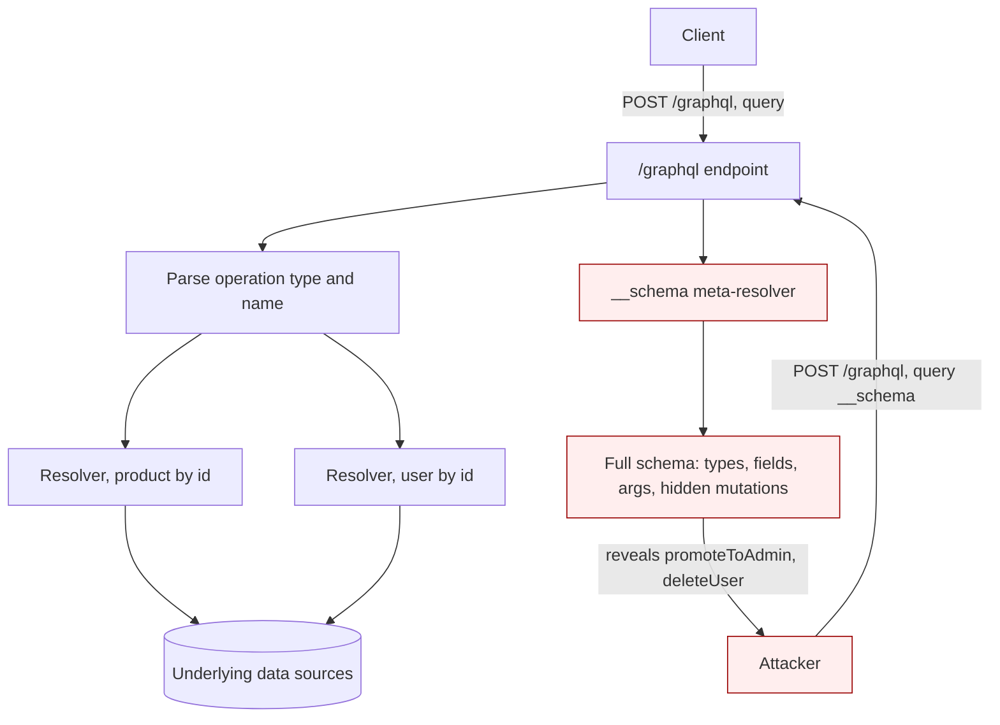

# GraphQL API Vulnerabilities

> GraphQL exposes one endpoint and a typed schema through which a client asks for exactly the fields it wants. That flexibility moves two things client-side that REST kept implicit: the client chooses the shape of the response (so a single endpoint fans out to arbitrarily many backend resolvers) and the client can pack many operations into one HTTP request (via aliases and batching). Almost every GraphQL bug follows from those two facts plus a third: developers put authorization at the HTTP/route layer where GraphQL has only one route, instead of at each field resolver where the real data access happens. The result is schema disclosure via introspection, object- and function-level access-control gaps at the resolver, rate-limit and 2FA brute-force bypass via aliasing/batching, denial of service via deeply nested queries, injection through argument values, and CSRF when the endpoint accepts non-JSON requests.

**Interview frequency:** Situational

## How it works

One endpoint, typically `POST /graphql`, accepts a JSON body with a `query` string and optional `variables` and `operationName`. The operation type and name in the query, not the URL or HTTP method, decide what runs.<sup>[[1]](#ref1)</sup> Three operation types exist:

- Query: reads data (roughly a REST GET).
- Mutation: writes data (roughly POST/PUT/DELETE).
- Subscription: a long-lived push channel, usually over WebSocket.

The schema is a typed contract in Schema Definition Language. Types are objects, scalars (`ID`, `String`, `Int`, `Boolean`, `Float`), enums, unions, interfaces, and inputs. `!` means non-nullable.

```graphql
type Product {
  id: ID!
  name: String!
  price: Int
}

type Query {
  products: [Product!]!
  product(id: ID!): Product
}
```

A query and its JSON response mirror each other in shape:

```graphql
query getProduct {
  product(id: 123) {
    name
    price
  }
}
```

```json
{ "data": { "product": { "name": "Juice Extractor", "price": 1999 } } }
```

Wire format of the request:

```http
POST /graphql HTTP/1.1
Host: example.com
Content-Type: application/json

{"query":"query($id: ID!){ product(id:$id){ name price } }","variables":{"id":123}}
```

Key syntax that becomes attack surface:

- Arguments: values passed to a field (`product(id: 123)`). If they select objects directly, they are an IDOR vector.
- Variables: typed placeholders (`$id: ID!`) filled from the `variables` dictionary; enables reusing one query shape.
- Aliases: rename fields so the same field can appear many times in one operation. `a: product(id:1){name} b: product(id:2){name}`. This bypasses the "no duplicate field name" rule and is the primitive behind alias-based batching.
- Fragments: reusable field sets (`...productInfo`); introspection queries rely on them heavily.

Introspection is a built-in meta-API: querying `__schema` and `__type` returns the entire schema, including every type, field, argument, and description. Every endpoint also answers `__typename`. Resolvers are the per-field functions that actually fetch data; authorization must live here because the endpoint and method are the same for everything.



## Quick reference

```graphql
# Alias-based batching: three OTP guesses smuggled into one HTTP request
mutation {
  a1: verifyOtp(user:"victim", code:"000000"){ token }
  a2: verifyOtp(user:"victim", code:"000001"){ token }
  a3: verifyOtp(user:"victim", code:"000002"){ token }
}
# A per-request rate limiter counts this as one attempt, not three, so aliasing brute-forces
# an OTP/2FA code (or any throttled mutation) at whatever rate the server accepts request bodies.
```

| Invariant | Where enforced | How violated | Source |
|---|---|---|---|
| Authorization is checked per object and per field inside each resolver, not once at the route | Resolver-level authz check | An object-fetch resolver has no ownership check even though the list view filtered results (BOLA); a hidden mutation like `promoteToAdmin` has no role check (BFLA) | <sup>[[7]](#ref7)</sup> |
| Rate limits and brute-force counters are keyed on business-operation count, not HTTP-request count | Application-level rate limiter / OTP attempt counter | Aliasing packs N `verifyOtp` (or other throttled) calls into one HTTP request, so a per-request throttle never trips | <sup>[[2]](#ref2)</sup> |
| Query depth, complexity, and document size are bounded before a resolver executes | Cost/complexity analyzer or depth limiter | Cyclic schema relationships let a shallow query multiply into exponential resolver calls | <sup>[[7]](#ref7)</sup> |
| A document is rejected on directive count, fragment-spread count, and AST size before parsing/validation completes | Pre-parse structural limits or a persisted-query allowlist | Directive overloading and fragment amplification blow up parse/validate cost before any post-parse cost analyzer runs | <sup>[[6]](#ref6)</sup> |
| State-changing resolvers resolve their check-and-write as one atomic step, never separate read-then-write calls | DB transaction (SERIALIZABLE), row lock, or unique constraint at the resolver | Aliased mutations execute in parallel in one HTTP request and race a non-atomic `if (usesLeft > 0) { decrement }` check | <sup>[[2]](#ref2)</sup> |
| The endpoint refuses cross-site, browser-forgeable content types for state-changing operations | `Content-Type: application/json` validation / CSRF token at the endpoint | The endpoint accepts a `text/plain` POST body and a forged auto-submitting form triggers a mutation under the victim's session | <sup>[[2]](#ref2)</sup> |
| Introspection and suggestion-based error messages are disabled in production for non-public schemas | Server config (`introspection: false`, `hideSchemaDetailsFromClientErrors`) | Whitespace-insensitive parsing bypasses a naive regex block on `__schema`; "Did you mean" suggestions leak schema tokens field by field | <sup>[[8]](#ref8)</sup> |

## Attack techniques

### 1. Finding the endpoint and fingerprinting the engine

GraphQL reuses one path, so locate it first.<sup>[[2]](#ref2)</sup> Send the universal query to candidate paths:

```json
{"query":"{__typename}"}
```

A GraphQL service returns `{"data":{"__typename":"Query"}}` (or `"query"`). Common paths: `/graphql`, `/api`, `/api/graphql`, `/graphql/api`, `/graphql/graphql`, often with a `/v1` suffix. Non-GraphQL errors like "query not present" also indicate a GraphQL handler. Try alternate methods (GET, or POST with `application/x-www-form-urlencoded`) if JSON POST does not respond. `graphw00f`<sup>[[3]](#ref3)</sup> fingerprints the server implementation (Apollo, graphql-java, Hasura, etc.), which tells you which defenses and quirks apply.

### 2. Introspection disclosure

If introspection is enabled in production (it should not be), one request dumps the schema. Probe cheaply first:

```json
{"query":"{__schema{queryType{name}}}"}
```

Then run the full introspection query (requesting `types`, `fields`, `args`, `inputFields`, `enumValues`, `directives`, using the `FullType`/`InputValue`/`TypeRef` fragments). If it errors, remove the `onOperation`, `onFragment`, `onField` directives, which many servers reject. Visualize the result with the GraphQL Visualizer or InQL<sup>[[4]](#ref4)</sup> to map hidden mutations and admin types. Why it matters: introspection reveals the exact mutations, arguments, and field names an attacker needs, and `description` fields often leak internal notes.

### 3. Bypassing introspection defenses

Developers frequently "disable" introspection with a naive regex blocking `__schema`. GraphQL ignores insignificant whitespace and commas, so inserting a newline, space, or comma the regex did not account for slips through:

```json
{"query":"query{__schema\n{queryType{name}}}"}
```

If introspection is blocked over POST, retry over GET with URL-encoding:

```http
GET /graphql?query=query%7B__schema%0A%7BqueryType%7Bname%7D%7D%7D
```

### 4. Schema recovery via suggestions (when introspection is truly off)

Apollo and others return "Did you mean" suggestions on near-miss field names (`There is no entry for 'productInfo'. Did you mean 'productInformation'?`). Each suggestion leaks a valid schema token. Clairvoyance (nikitastupin) automates this to reconstruct much of the schema without introspection.<sup>[[5]](#ref5)</sup> Fix in Apollo Server v4+: `hideSchemaDetailsFromClientErrors: true`.<sup>[[6]](#ref6)</sup>

### 5. Broken object-level authorization (BOLA / IDOR) at the resolver

If a field takes an object id and the resolver does not check ownership, supply another user's id. GraphQL makes enumeration obvious: a `products` list returns ids 1, 2, 4, so query the missing id directly.

```graphql
query { product(id: 3) { id name listed } }
```

This returns the delisted product 3 that the list omitted. The same pattern hits `user(id:)`, `order(id:)`, `message(id:)`. Why it works: authorization was assumed at the list level, but the object-fetch resolver is a separate, unguarded entry point.

### 6. Broken function-level authorization (BFLA) via hidden mutations

Introspection (or suggestions) reveals privileged mutations a normal user's UI never calls, for example `deleteUser`, `promoteToAdmin`, `updateUserRole`. Because every operation shares one endpoint, there is no per-route gate; if the resolver does not check the caller's role, invoking it succeeds.

```graphql
mutation { updateUser(id: 5, input: { role: "ADMIN" }) { id role } }
```

This is OWASP API5 (BFLA) expressed in GraphQL.<sup>[[7]](#ref7)</sup> Object-property-level gaps (OWASP API3/BOPLA) also appear: over-requesting fields (`recentLocation`, `email`) that the schema exposes but the caller should not read, and mass-assignment-style writes of internal properties (`blocked`, `total_stay_price`) via mutation input objects.

### 7. Batching to bypass rate limits and brute-force (aliases and array batching)

Many rate limiters count HTTP requests, not GraphQL operations. Aliases let one request execute the same field hundreds of times:

```graphql
query bruteforce($code: Int) {
  c1: isValidDiscount(code: 1111) { valid }
  c2: isValidDiscount(code: 2222) { valid }
  c3: isValidDiscount(code: 3333) { valid }
}
```

Applied to authentication, this is a 2FA/OTP brute force: alias `login`/`verifyOtp` N times in one HTTP request and the per-request throttle never trips.

```graphql
mutation {
  a1: verifyOtp(user:"victim", code:"000000"){ token }
  a2: verifyOtp(user:"victim", code:"000001"){ token }
  a3: verifyOtp(user:"victim", code:"000002"){ token }
}
```

Array-based batching is the sibling technique: send a JSON array of independent operations in one body (`[{"query":"..."},{"query":"..."}]`) where the server supports it. Both defeat naive request-count limiting.

### 8. Denial of service via deeply nested / circular queries

Cyclic relationships in the schema (Post has an author, author has posts) let a small query force exponential resolver work:

```graphql
query {
  posts { author { posts { author { posts { author { id } } } } } }
}
```

Each level multiplies resolver calls and DB hits; unbounded depth is a cheap DoS. Aliased field duplication and huge query bodies compound it. This is OWASP API4 (Unrestricted Resource Consumption) in GraphQL form.<sup>[[7]](#ref7)</sup>

### 9. Injection through argument values

Argument values flow into resolvers and then into backend queries. If a resolver concatenates an argument into SQL/NoSQL/OS commands, GraphQL is just the delivery vehicle for classic injection.

```graphql
query { users(filter: "1=1 OR ''='") { id email } }
```

The GraphQL layer validates types, not the safety of values reaching the backend, so parameterization at the resolver still matters.

### 10. CSRF over GraphQL

If the endpoint accepts requests a browser can send cross-site (GET, or POST with `Content-Type: application/x-www-form-urlencoded` or `text/plain`) and relies only on ambient cookies, an attacker page can forge state-changing mutations. A JSON-only endpoint that validates `Content-Type: application/json` is safe from classic form-based CSRF because browsers cannot send that content type cross-origin via a simple form.

```html
<form action="https://target/graphql" method="POST" enctype="text/plain">
  <input name='{"query":"mutation{updateEmail(email:\"attacker@evil.com\"){ok}}","variables":{}}//' value="">
</form>
<script>document.forms[0].submit()</script>
```

Why it works: the endpoint processed a browser-forgeable request under the victim's session with no CSRF token and no content-type enforcement.

### 11. Alias-based race conditions (single-packet attacks against non-atomic resolvers)

Aliases are also a race-condition primitive, not just a rate-limit bypass. Aliased fields inside one operation execute in parallel on many GraphQL servers, and one HTTP request means one TCP write, so the aliased mutations hit the server as close to simultaneously as any single-packet attack. A mutation guarded by a non-atomic check-then-write is trivially raced.

Classic targets: redeeming a single-use coupon N times, draining a balance by triggering N concurrent `transfer` mutations that each pass the `balance >= amount` check before any decrement lands, or reusing a one-time OTP/token in parallel `verifyOtp` calls that all consume the same not-yet-invalidated code.

```graphql
mutation {
  r1: redeemCoupon(code: "SAVE50") { credit }
  r2: redeemCoupon(code: "SAVE50") { credit }
  r3: redeemCoupon(code: "SAVE50") { credit }
  r4: redeemCoupon(code: "SAVE50") { credit }
}
```

GraphQL amplifies this over REST because you do not need N connections and do not need HTTP/2 last-byte-sync tricks; one JSON body with aliases collapses the timing window. The defense is at the resolver: wrap the check-and-write in a DB transaction with SERIALIZABLE isolation, or use `SELECT ... FOR UPDATE`, an optimistic-lock version column, or a unique constraint on the invariant (one redemption per code, monotonic balance). Alias caps help but do not fix a resolver that races itself with two aliases.

### 12. Pre-execution DoS via directive overloading and fragment amplification

Two DoS patterns operate before resolvers execute and slip past cost/complexity analyzers that run post-parse. The first is directive overloading, where a field is stacked with thousands of `@skip(if:false)` / `@include(if:true)` / custom directives (`field @a @a @a ... @a`), forcing the parser and validator to walk each occurrence and blowing CPU/memory during validation. The document is small on the wire but expensive to validate.

The second is fragment amplification. Many small fragments reference each other so the expanded document is exponential in size even though the wire payload stays tiny:

```graphql
query { ...A }
fragment A on Query { ...B ...B ...B ...B ...B ...B ...B ...B }
fragment B on Query { ...C ...C ...C ...C ...C ...C ...C ...C }
fragment C on Query { ...D ...D ...D ...D ...D ...D ...D ...D }
fragment D on Query { __typename }
```

The GraphQL spec forbids cyclic fragments, but non-cyclic fan-out is legal and lethal: each additional layer multiplies the expanded AST. Cost analysis that runs after parsing may still reject it, but only after the server has already paid the parse/validate cost, which is exactly what the attacker wanted. Defenses: reject documents exceeding a max directive-per-field count, a max fragment-spread count, and a max token/AST-node count before validation; enforce a request byte-size cap early; and prefer persisted-query allowlists, which nullify both attacks because unregistered documents never parse.

Tooling summary: InQL (Doyensec, Burp extension)<sup>[[4]](#ref4)</sup> for introspection parsing and query generation, Clairvoyance<sup>[[5]](#ref5)</sup> for suggestion-based schema recovery, graphw00f<sup>[[3]](#ref3)</sup> for engine fingerprinting, graphql-cop for a quick misconfiguration audit, GraphQL Visualizer for schema mapping, and Burp Scanner (raises "GraphQL endpoint found", "GraphQL introspection enabled", "GraphQL suggestions enabled").

## Defense

### Real fix

1. Enforce authorization in every resolver, at object and field granularity. This is the load-bearing control: because one endpoint serves all operations, route-level checks do nothing. Every resolver that reads or writes an object must verify the authenticated principal is allowed that specific object (ownership/tenant check) and that specific operation (role check). Field-level authz gates sensitive properties. Do not rely on the UI never calling a mutation; assume every schema element is directly reachable. This closes BOLA, BFLA, and BOPLA.

2. Limit query cost, depth, complexity, and size. Cap query depth (for example 7 to 10 levels) to stop nested/circular DoS. Apply operation limits (max unique fields, max aliases, max root fields) and a maximum request byte size. Add query cost/complexity analysis (`graphql-cost-analysis`, `graphql-depth-limit`, Apollo operation limits<sup>[[6]](#ref6)</sup>, or a persisted-query allowlist) so expensive queries are rejected before execution. Persisted (allowlisted) queries are the strongest form: the server only runs pre-registered operations, which eliminates arbitrary introspection, ad hoc nesting, and unexpected aliasing in one move.

3. Constrain batching and aliasing for security-sensitive operations. Disable array batching if unused, or cap batch size. Cap the number of aliases per operation so a single request cannot become a brute-force engine. Critically, rate-limit and lock by operation count and by business action (OTP attempts per user), not by HTTP request count, so aliasing/batching cannot bypass the limiter. Enforce OTP/2FA attempt counters server-side per account.

4. Prevent CSRF: accept mutations only over JSON POST and validate `Content-Type: application/json`; reject GET and form-encoded requests for state changes. Add a CSRF token (or rely on `SameSite` cookies plus content-type enforcement). Do not put mutations behind GET.

5. Treat all arguments as untrusted input at the resolver: parameterize backend queries, validate and allowlist argument values, and apply the same injection defenses (SQLi, NoSQLi, command, SSRF) you would in REST. Type validation by GraphQL is not value sanitization.

6. Make state-changing resolvers atomic against alias/batch races. Invariant: any mutation that enforces a uniqueness or capacity constraint (one redemption per coupon, non-negative balance, one-time-use token) must resolve its check-and-write as a single atomic step, not as separate `read then write` calls. Enforce with a DB transaction at SERIALIZABLE isolation, `SELECT ... FOR UPDATE` on the row, an optimistic-lock version column, or a `UNIQUE` constraint that turns the second write into a violation. Common wrong implementation: `if (coupon.usesLeft > 0) { coupon.usesLeft -= 1; grantCredit() }` at read-committed isolation with no row lock, which two aliased calls in one document happily double-spend. Alias caps are a partial mitigation; the resolver is the root fix.

7. Bound parse/validate cost before execution. Invariant: no document reaches the resolver phase without passing structural limits on request byte size, directive count per field, fragment-spread count, and total AST-node count. Why it works: directive overloading and fragment amplification blow up during parse/validate, so post-parse cost analysis is too late; capping the AST size shape upstream keeps the server from spending CPU on documents it will reject anyway. Common wrong implementation: relying only on `graphql-depth-limit` and a per-field cost estimator, both of which run after the document has been parsed and (for fragments) fully expanded. Persisted-query allowlists sidestep the entire problem because unregistered documents never parse.

### Defense in depth

1. Disable introspection in production for non-public APIs.<sup>[[8]](#ref8)</sup> In Apollo Server set `introspection: false`.<sup>[[6]](#ref6)</sup> Use an allowlist/regex only as defense in depth and account for whitespace/commas and GET so the block cannot be trivially bypassed. If the API must be public, review the schema so no private field (email, internal ids, admin mutations) is exposed, and disable suggestions (`hideSchemaDetailsFromClientErrors: true` in Apollo v4+). This raises recon cost; it does not protect a vulnerable resolver, since suggestions and error messages leak the schema anyway.

2. Return generic errors: strip stack traces and internal details from error messages so error content does not leak schema or backend structure.

## Interviewer probes

Q: How does GraphQL turn aliases into a race-condition primitive, and how would you fix a coupon-redemption resolver that is vulnerable to it?

Mid: Aliases send many copies of the same mutation in one request so they arrive together and race the resolver; fix it with a database transaction or a lock.

Principal: On most GraphQL servers, sibling fields inside one operation resolve in parallel, and one HTTP request is one TCP write, so aliased mutations reach the server with a timing spread narrower than anything you can achieve with N REST connections. It is effectively a single-packet attack without needing HTTP/2 last-byte sync. A coupon resolver written as `read usesLeft; if (usesLeft > 0) { decrement; grantCredit; }` at read-committed isolation is trivially raced: four aliased calls all read `usesLeft = 1`, all pass the check, all grant credit. The fix is at the resolver, not the alias cap. Make check-and-write atomic: SERIALIZABLE isolation plus retry on serialization failure, or `SELECT ... FOR UPDATE` on the coupon row inside the transaction, or an optimistic-lock version column, or (cleanest) model the invariant as a database constraint (a `UNIQUE (coupon_id, user_id)` row on redemption so the second insert fails). Alias caps and complexity limits are defense in depth; a resolver that races itself between two aliases will race itself between two REST requests with a bit more effort. The same pattern applies to balance transfers, single-use OTP consumption, and gift-card redemption.

Q: A team disabled introspection, added a query-depth limit of 10, and enabled `graphql-cost-analysis`. Is that enough to stop DoS, and what would you still worry about?

Mid: No, aliases can still fan out a shallow query into thousands of resolver calls; also disable batching and cap aliases.

Principal: Those three controls are the classic checklist and they miss the two DoS classes that run before resolvers do. Directive overloading (`field @skip(if:false) @skip(if:false) ... x1000`) makes the parser and validator walk every occurrence, burning CPU and memory during validation with a document that is small on the wire and shallow in depth. Fragment amplification exploits legal non-cyclic fan-out (`A -> B B B ... -> C C C ... -> ...`), producing an expanded AST that is exponential in the number of fragments even though the raw document is a few hundred bytes; cost analysis running post-expansion may reject the query, but the server already paid the parse-and-expand cost the attacker wanted it to pay. The right answer is to bound the document structurally before parse/validate finishes: cap request byte size, directives-per-field, fragment-spread count, and total AST-node count, and reject early. Separately, persisted-query allowlists remove the entire class because arbitrary documents never parse in production. I would also make sure the depth limit accounts for width, not just height, because a shallow query with thousands of aliased root fields can still DoS a naive resolver that fires a DB query per field.

Q: Where should GraphQL authorization actually live?

Mid: In the resolver, not on the route, because every operation shares one endpoint.

Principal: At the resolver, per object and per field, because the endpoint and HTTP method are identical for every operation, so there is nowhere else to enforce it. A candidate who answers "add auth middleware on the route" has missed the model: route-level middleware can authenticate the caller, but it cannot make an object- or field-scoped decision because it has no idea which object a given query or mutation is about to touch. Every BOLA, BFLA, and BOPLA finding in this doc traces back to a resolver that trusted the endpoint's authentication instead of independently checking the specific object, operation, and field it was about to serve. This is the one sentence that separates candidates who understand GraphQL's security model from those pattern-matching it to REST.

Q: The team disabled introspection. Are BOLA and BFLA bugs in the schema still findable?

Mid: Yes, suggestions and error messages leak the schema even without introspection.

Principal: Yes, and treating introspection-off as a security boundary is a common mistake worth flagging in an interview. "Did you mean" suggestions on near-miss field names leak one valid schema token per guess, and Clairvoyance automates that into a near-complete schema reconstruction without a single introspection query. Verbose error messages leak structure the same way. Disabling introspection raises the cost of recon; it does nothing to the resolvers themselves, so a determined attacker reaches the same admin mutations and object-fetch resolvers either way. It belongs in defense in depth, behind resolver-level authorization, never as a substitute for it.

Q: You've locked down authorization and rate limiting on every query and mutation. What else in the schema is worth checking?

Mid: Subscriptions over WebSocket, since they're a separate transport people forget to gate.

Principal: Subscriptions are the classic blind spot. Authorization and rate-limiting logic built for the request/response query and mutation path frequently isn't wired into the subscription transport at all, since it's a different connection lifecycle (a long-lived WebSocket rather than a per-request HTTP call). That connection is itself a resource-exhaustion vector independent of any single expensive query. Treat subscriptions as a third operation type that needs its own authorization and connection-limiting review, not something that inherits protection from the query and mutation defenses.

Q: The team added `Content-Type: application/json` validation to the GraphQL endpoint and calls CSRF fixed. Do you agree?

Mid: For classic form-based CSRF yes, but I'd still check GET-based mutations and content-type-smuggling tricks.

Principal: For classic form-based CSRF, yes, and being able to explain why matters more than citing it as a rule. A browser cannot set an arbitrary `Content-Type` on a cross-site simple request; HTML forms can only produce `application/x-www-form-urlencoded`, `multipart/form-data`, or `text/plain`. If the server strictly rejects anything but `application/json`, every browser-forgeable submission is rejected before it reaches a mutation. The actual bug this fixes is servers accepting those forgeable content types "for compatibility." I'd still verify mutations can't be triggered over GET, and that the server doesn't accept a JSON payload smuggled inside a `text/plain` form field (the technique this doc's CSRF attack shows), since either would defeat the content-type check entirely.

## Sources

<a id="ref1"></a>[1] PortSwigger, "What is GraphQL?". PortSwigger Web Security Academy. Retrieved 2026. https://portswigger.net/web-security/graphql/what-is-graphql

<a id="ref2"></a>[2] PortSwigger Web Security Academy, "GraphQL API vulnerabilities" (including "Finding GraphQL endpoints"). Retrieved 2026. https://portswigger.net/web-security/graphql

<a id="ref3"></a>[3] dolevf, `graphw00f` (GraphQL engine fingerprinting). GitHub. Retrieved 2026. https://github.com/dolevf/graphw00f

<a id="ref4"></a>[4] Doyensec, `InQL` (Burp extension for GraphQL introspection parsing and query generation). GitHub. Retrieved 2026. https://github.com/doyensec/inql

<a id="ref5"></a>[5] nikitastupin, `Clairvoyance` (schema recovery via field-suggestion errors). GitHub. Retrieved 2026. https://github.com/nikitastupin/clairvoyance

<a id="ref6"></a>[6] Apollo, "Security" (Apollo Server docs: introspection, operation limits, `hideSchemaDetailsFromClientErrors`). Retrieved 2026. https://www.apollographql.com/docs/apollo-server/security/authentication/

<a id="ref7"></a>[7] OWASP, "GraphQL Cheat Sheet". OWASP Cheat Sheet Series. Retrieved 2026. https://cheatsheetseries.owasp.org/cheatsheets/GraphQL_Cheat_Sheet.html

<a id="ref8"></a>[8] Apollo, "Why you should disable GraphQL introspection in production". Apollo Blog. Retrieved 2026. https://www.apollographql.com/blog/graphql/security/why-you-should-disable-graphql-introspection-in-production/
