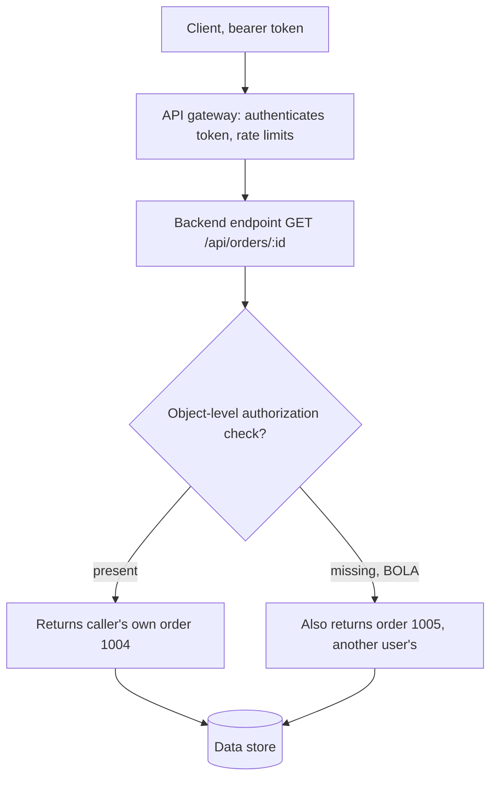

# API Security (REST)

> A REST API is a thin, uniform layer (resources addressed by URL, actions expressed as HTTP methods, data as JSON) sitting directly on top of the business objects and logic. That uniformity is the problem: the same authorization decision must be made explicitly on every endpoint, every method, and every object property, but frameworks make it easy to authenticate a caller once and then trust the object id, the HTTP verb, or the request body they send next. The OWASP API Security Top 10 2023 is dominated by exactly these authorization failures (BOLA, BFLA, BOPLA) rather than injection, because APIs expose a huge surface of id-handling endpoints and developers assume the object reference or the field they receive was already vetted. Add machine-to-machine trust (SSRF, unsafe consumption of third-party APIs), automation abuse of legitimate business flows, and the sprawl of undocumented and deprecated versions, and you have the modern API threat model.

**Interview frequency:** Common

## How it works

REST endpoints name a resource; the HTTP method names the action.

```http
GET    /api/books        -> list books
POST   /api/books        -> create a book
GET    /api/books/123    -> read book 123
PATCH  /api/books/123    -> partially update book 123
DELETE /api/books/123    -> delete book 123
```

Requests and responses are usually JSON with an explicit `Content-Type`:

```http
PATCH /api/users/123 HTTP/1.1
Host: example.com
Authorization: Bearer <token>
Content-Type: application/json

{"email":"new@example.com"}
```

Authentication is typically a bearer token (JWT or opaque), an API key, or a session cookie. Authorization is a separate decision the application must make on each request: does this authenticated principal have the right to this object (object-level), this function (function-level), and these specific properties (property-level). REST gives you no automatic enforcement of any of those; the endpoint code must do it.



Machine-readable contracts (OpenAPI/Swagger JSON or YAML) describe endpoints, methods, parameters, and schemas. They are recon gold when exposed and a security tool when used for request/response schema validation. Because APIs sprawl across versions (`/v1`, `/v2`), environments (staging, debug), and internal-only services, inventory and version hygiene are first-class security concerns.

## Quick reference

```http
GET /api/orders/1004    (my order, returned)
GET /api/orders/1005    (someone else's order, returned anyway)
```
```
# BOLA: the endpoint checks that the caller is authenticated, never that they own order 1005.
# Authentication answers "who are you"; it says nothing about "what may you touch" -- that
# second check has to be explicit, per object, on every id-handling endpoint.
```

| Invariant | Where enforced | How violated | Source |
|---|---|---|---|
| The authenticated caller is authorized for this specific object, not just authenticated | Object-level authorization check (deny-by-default component) | An endpoint returns or modifies an object by id with no ownership check (BOLA) | <sup>[[2]](#ref2)</sup> |
| A request body only sets the properties an endpoint explicitly allowlists for that caller | Request-body allowlist / DTO binding instead of raw auto-bind | Framework auto-binds every JSON key, so sending `"isAdmin":true` sets a field the endpoint never intended to expose (BOPLA, mass assignment) | <sup>[[3]](#ref3)</sup> |
| A privileged function is reachable only by a role explicitly granted to it, checked on the effective verb | Function-level authz gate evaluated after any method override is applied | An admin route is called directly by a regular-user token (BFLA), or `X-HTTP-Method-Override: DELETE` reaches a DELETE handler a POST-only edge rule permitted | <sup>[[2]](#ref2)</sup> |
| Every object inside a batch or bulk request is authorized individually, not the batch as a whole | Per-object authorization inside the batch handler, or a set-based `WHERE owner_id = :caller` | A bulk endpoint authorizes the request but not each id in the array, so other tenants' ids slip through alongside the caller's own | <sup>[[2]](#ref2)</sup> |
| Outbound requests triggered by a user-supplied URL are validated against an allowlist and cannot reach internal ranges or cloud metadata | Egress/SSRF validation at the fetcher | An avatar-fetch endpoint follows a URL to `169.254.169.254` and returns cloud metadata | <sup>[[2]](#ref2)</sup> |
| Third-party API responses are validated and sanitized before being stored, forwarded, or trusted for redirects | Response-validation layer for consumed APIs | An upstream's `308 Permanent Redirect` is followed blindly and the user's sensitive body is re-sent to the attacker's host | <sup>[[6]](#ref6)</sup> |
| Every deployed API version and environment carries the same protections as current production, or is decommissioned | Live inventory with protections applied to every host, environment, and version | A forgotten `/v1` endpoint lacks a fix that was only shipped to `/v2` | <sup>[[2]](#ref2)</sup> |

## Attack techniques

### 1. API recon and endpoint discovery

Enumerate before testing.<sup>[[1]](#ref1)</sup> Sources:

- Documentation, human-readable and machine-readable. Look for `/api`, `/swagger/index.html`, `/swagger.json`, `/openapi.json`, `/api-docs`, `/v2/api-docs`, `/graphql`. If you find `/api/v1/users/123`, walk the base paths (`/api/v1`, `/api`) for docs and index endpoints.
- JavaScript bundles: front-end code references endpoints never triggered by normal browsing. Extract with a JS link finder or manual review.
- Hidden endpoints and methods: given `PUT /api/user/update`, fuzz the last path segment with `delete`, `add`, `create`, `remove` from API wordlists tailored to the app's vocabulary.
- Supported methods: send `OPTIONS`, and cycle the HTTP verb (Burp Intruder verb list) against a low-value object. A `GET`-only-looking endpoint may also accept `POST`, `DELETE`, or `PATCH`, each new verb being new attack surface. Target low-priority objects so verb fuzzing does not destroy data.
- Content types: flip `Content-Type` between JSON and XML (Content Type Converter). An endpoint safe against JSON may be injectable via XML, or leak a verbose error.
- Read error messages: they frequently reveal required parameters and valid formats you use to build a working request.

### 2. API1:2023 Broken Object Level Authorization (BOLA / IDOR)

The most prevalent and highest-impact API bug.<sup>[[2]](#ref2)</sup> An endpoint takes an object id and returns/modifies it without checking that the caller owns it.

```http
GET /api/orders/1004    (my order)
GET /api/orders/1005    (someone else's order, returned anyway)
```

Confirmation: authenticate as user A, request user B's ids (sequential ints, or GUIDs harvested from other responses). Real-world scale: USPS Informed Visibility API (2018) exposed ~60M users' data via unauthenticated object access; T-Mobile's 2023 breach leaked ~37M records through a single API lacking authorization; Peloton (2021) served user data to any authenticated caller. Why it works: authentication proves who you are, not what you may touch, and the endpoint trusted the id.

### 3. API2:2023 Broken Authentication

Weak or misimplemented auth: credential stuffing with no lockout, guessable/long-lived tokens, JWT flaws (see the JWT doc: `alg` confusion, weak secrets, missing claim validation), token in URL, missing re-auth on sensitive changes, password-reset and OTP endpoints without throttling.<sup>[[2]](#ref2)</sup> Confirmation: attempt token forgery, brute force login/OTP, replay old or another user's token.

### 4. API3:2023 Broken Object Property Level Authorization (BOPLA)

Merges the 2019 categories Excessive Data Exposure and Mass Assignment: authorization is missing at the property level.<sup>[[3]](#ref3)</sup>

Read side (excessive data exposure): the endpoint serializes the whole object and the client filters it, so private properties leak. Inspect raw responses for fields the UI never shows (`ssn`, `passwordResetToken`, `isAdmin`, `internalNotes`).

Write side (mass assignment / auto-binding): the framework binds every JSON key in the body to object fields. Send a property you should not control.

```http
GET  /api/users/123 -> {"id":123,"name":"John","email":"j@x.com","isAdmin":false}

PATCH /api/users/123
{"username":"wiener","email":"w@x.com","isAdmin":true}
```

Method for confirming mass assignment: read an object to enumerate its properties, send the target property with an invalid value (`"isAdmin":"foo"`) and watch for a behavior change (validation path differs), then send the real value (`true`) and verify the effect out-of-band (can `wiener` now reach admin functions). OWASP's own scenarios include a marketplace host injecting `total_stay_price` into an approve-booking call, and a user flipping `blocked:false` to unlock censored content.<sup>[[3]](#ref3)</sup> The classic real incident is Egor Homakov's 2012 Rails mass-assignment exploit against GitHub, committing to a repo he should not have been able to write.<sup>[[4]](#ref4)</sup>

### 5. API4:2023 Unrestricted Resource Consumption

No limits on requests, payload size, page size, or expensive operations, leading to DoS or cost blowups (paid SMS/email/biometric APIs, cloud compute).<sup>[[2]](#ref2)</sup> Confirmation: send large `limit`/`page` values, oversized bodies, or many concurrent requests and watch latency, cost, or errors. Includes triggering per-request billed integrations en masse.

### 6. API5:2023 Broken Function Level Authorization (BFLA)

An admin/privileged function is reachable by a lower-privileged user because the function itself is not role-gated.<sup>[[2]](#ref2)</sup> Discover the admin route (docs, JS, guessing `/api/admin/...`, or swapping method) and call it as a normal user.

```http
DELETE /api/admin/users/42        Authorization: Bearer <regular-user-token>
```

Vertical privilege escalation. Distinction from BOLA: BOLA is "wrong object, same function"; BFLA is "wrong function/role entirely".

### 7. API6:2023 Unrestricted Access to Sensitive Business Flows

Not an implementation bug but a design gap: a legitimate flow (buy, book, comment, refer) can be automated at scale to harm the business. OWASP scenarios: a scalper scripts checkout to buy all console stock; a user books 90% of a flight's seats then cancels to force a fire sale; a referral program farmed by scripted signups for credit.<sup>[[5]](#ref5)</sup> Confirmation: can one actor drive the flow far faster or more often than a human, across IPs, with no friction.

### 8. API7:2023 Server-Side Request Forgery (SSRF)

An endpoint fetches a user-supplied URL (webhook, image-from-URL, PDF renderer, URL preview) without validating the target, so it can be coerced to hit internal services or cloud metadata.<sup>[[2]](#ref2)</sup>

```http
POST /api/fetch-avatar
{"url":"http://169.254.169.254/latest/meta-data/iam/security-credentials/"}
```

Bypasses firewalls/VPNs because the request originates from the trusted server. Confirmation: point the URL at attacker infrastructure (out-of-band callback) or internal/metadata addresses.

### 9. API8:2023 Security Misconfiguration

Missing security headers, permissive CORS, verbose stack traces, default credentials, unpatched components, unnecessary HTTP methods enabled, TLS not enforced, unauthenticated actuator/debug endpoints.<sup>[[2]](#ref2)</sup> Confirmation: send malformed input for verbose errors, probe `OPTIONS`/CORS, check for debug endpoints.

### 10. API9:2023 Improper Inventory Management

APIs expose far more endpoints than classic apps, so shadow, deprecated, and staging versions accumulate.<sup>[[2]](#ref2)</sup> An old `/v1` may lack a fix present in `/v2`; a debug or staging host may skip auth entirely. Confirmation: enumerate versions (`/v1`, `/v2`, `/beta`), hostnames (`api-staging`, `api-dev`), and compare protections across them. The weakest surviving version defines your real security posture.

### 11. API10:2023 Unsafe Consumption of APIs

Developers trust responses from third-party/integrated APIs more than user input and skip validation. Risks: consuming a third-party API over cleartext, not validating/sanitizing its response before storing or forwarding it (stored SQLi/XSS via a poisoned upstream), blindly following redirects, no timeouts or resource caps on the integration. OWASP scenario: an upstream returns `308 Permanent Redirect` to `attacker.com` and the API re-sends the user's sensitive body to the attacker because it follows redirects blindly.<sup>[[6]](#ref6)</sup>

### 12. Server-side parameter pollution (SSPP)

A front-end embeds user input into a server-side request to an internal API without encoding, letting the attacker inject or override parameters.<sup>[[7]](#ref7)</sup> If a user search hits an internal `GET /users/search?name=peter&publicProfile=true`:

Truncate with URL-encoded `#` to drop trailing constraints:

```
GET /userSearch?name=peter%23foo&back=/home
-> internal: GET /users/search?name=peter#foo&publicProfile=true   (publicProfile dropped)
```

Inject/override with URL-encoded `&`:

```
GET /userSearch?name=peter%26name=administrator&back=/home
-> internal: GET /users/search?name=peter&name=administrator&publicProfile=true
```

Which wins depends on the backend stack: PHP takes the last parameter (`administrator`), ASP.NET concatenates (`peter,administrator`), Node/Express takes the first (`peter`). REST-path variant: inject encoded path traversal (`peter%2f..%2fadmin`) so an internal `/api/private/users/peter/../admin` normalizes to `/admin`. Structured-format variant: break out of JSON in the embedded value (`peter","access_level":"administrator`) so the server-side body becomes `{"name":"peter","access_level":"administrator"}`. SSPP also occurs in responses when stored input is embedded into a backend JSON response without encoding. Detection: Burp Scanner's "suspicious input transformation" and the Backslash Powered Scanner flag candidate inputs.

### 13. HTTP method override to bypass function-level authorization

Many frameworks accept a tunneled verb through a header or a query/body parameter, dispatching internally on the override while the outer request stays a POST. Symfony, Laravel, older Spring, Rails, and Express with the `method-override` middleware all honor headers like `X-HTTP-Method-Override: DELETE`, `X-Method-Override`, or `X-HTTP-Method`, and query/body forms like `?_method=PUT` on a POST. The pattern originated for HTML-form clients that could only issue GET and POST, and it survives long after those clients do.

The exploit is that front proxies, WAFs, and gateway ACLs frequently authorize on the outer verb (POST) while the application dispatches on the overridden one. `POST /api/admin/users/42` with `X-HTTP-Method-Override: DELETE` reaches a DELETE handler that a POST-only rule at the edge cheerfully permitted, and the DELETE handler assumed method-level authz had already been enforced. The same shape works against role-gated method filters in the framework itself when the filter runs before the override is applied.

Confirmation: send the low-privilege verb with the override header set to a high-privilege verb and watch for the state change the outer verb should never produce (a deletion, a role update, a resource creation). Fuzz the header names and the `_method` parameter across a small set of state-changing routes to find handlers that honor the override.

Defense: disable method-override middleware in production, or strip the header at the edge before any authorization decision runs. If the app must keep it, enforce authorization on the effective (post-override) verb inside the application, never on the outer HTTP method alone, and log the override so anomalies are visible.

### 14. Race conditions and single-packet limit-overruns on sensitive flows

Many API bugs are TOCTOU races where a check-then-act flow can be executed multiple times concurrently before the state update commits. Classic targets: redeeming a single-use coupon or gift card, withdrawing funds past a balance, using an MFA/OTP code more than once, applying a referral bonus, upgrading to a plan while the payment webhook is still pending, claiming a limited-quantity offer. The application reads the state ("is this coupon used?"), decides "no", and writes the effect, but between the read and the write another instance of the same request finished the same three steps against the same state.

Technique: send the same authorized request in parallel and time the arrivals to fall inside one server-side scheduling window. HTTP/2's single-packet attack packs multiple requests into a single TCP packet so they hit the server microseconds apart, defeating naive per-request locks and slow round-trip synchronization. Turbo Intruder with `engine=Engine.BURP2` and `sendChunkedPost` is the standard tool. Where HTTP/2 is not available, connection warming plus last-byte synchronization approximates the effect on HTTP/1.1.

Confirmation: run the parallel batch and observe that a limit meant to allow one action succeeded more than once (multiple redemptions of the same coupon in the ledger, balance driven negative, two active plan upgrades). Watch that the affected rows share a single "used_at" or version value from the same check, proving the reads were concurrent.

Defense: enforce atomicity at the data layer, not at application code. `SELECT ... FOR UPDATE` inside the transaction, unique constraints on `(user_id, coupon_id)` or `(user_id, otp_code)`, idempotency keys required on mutating endpoints so a retry cannot be a second effect, and optimistic concurrency with version columns that fail the second writer. An application-level `if (used) return` is exactly the check that races lose.

### 15. CORS misconfigurations that turn cross-origin into cross-account

CORS is enforced by the browser based on response headers the API sets, so a misconfigured `Access-Control-Allow-Origin` policy is what lets an attacker origin read authenticated responses cross-site. The exploitable patterns are: reflecting the request `Origin` into `Access-Control-Allow-Origin` while also sending `Access-Control-Allow-Credentials: true`, so any attacker origin gets a green light to read the response with the victim's cookies attached; trusting `null` as an origin (sandboxed iframes, `data:` and `file://` documents send `Origin: null`, and an attacker can force `null` from a controlled sandbox); overly loose regex allowlists (`.*\.example\.com` matches `evil.example.com.attacker.tld`, missing anchors or unescaped dots turn "our subdomains" into "any hostname containing our domain"); and `Access-Control-Allow-Origin: *` combined with a bearer token the browser sends via a service worker or where credentials have been moved into a custom header (the "no wildcard with credentials" rule does not save you if the credential is not a cookie).

Confirmation: send `Origin: https://attacker.tld` on an authenticated request and check whether the response includes `Access-Control-Allow-Origin: https://attacker.tld` and `Access-Control-Allow-Credentials: true`. Repeat with `Origin: null`. If the origin is reflected or `null` is trusted, host a proof page on the attacker origin that reads the API response via `fetch(..., {credentials: "include"})` and demonstrates cross-site data exfiltration.

Defense: a static allowlist of exact origins compared with string equality, never a regex, never reflection without validation, and never `*` combined with credentials. Treat `Origin: null` as untrusted (do not include it in any allowlist), and remember that CORS does not block the request from being sent, only the response from being read, so state-changing endpoints still need CSRF protection independent of CORS.

### 16. Batch and bulk endpoints as BOLA multipliers

Bulk endpoints (`POST /api/orders/batch`, `PATCH /api/users` with an array of ids, JSON:API `include=`, or a `?ids=1,2,3` list) frequently authorize the request rather than each object in it, so an authenticated user can slip other tenants' ids into the array and receive or mutate them alongside their own. The same pattern shows up in GraphQL, where a single query returns many nodes and only the top-level resolver runs an auth check, and in "select-and-apply" admin-style operations where a UI-shaped ids array is trusted because it came from a page the user "should only see their own rows on".

Confirmation: take a legitimate bulk call, insert other users' ids alongside your own into the array or filter, and observe successful reads or writes. GUID-based ids do not save you here if the attacker can harvest ids from other endpoints (invitations, activity feeds, error messages leaking references).

Defense: authorize each object inside the batch, not the batch as a whole. Either loop and call the same per-object authorization used on singleton endpoints, or push it into the database with a set-based `WHERE owner_id = :caller AND id IN (:ids)` so unowned ids simply do not match. Reject the whole batch on any single failure so partial-success does not silently exfiltrate one tenant's row while returning the caller's, and cap batch size to reduce blast radius and cost.

## Defense

Ordered by impact and mapped to OWASP API Top 10 2023.<sup>[[8]](#ref8)</sup>

### Real fix

1. Authorization on every request, at three levels. Object level: on every function that reads/writes by id, check the authenticated principal is authorized for that specific object (ownership or tenant scoping), preferably with random unguessable ids and a central, deny-by-default authorization component rather than per-endpoint ad hoc checks (API1). Function level: deny by default and grant per role; keep admin functions on clearly separated, role-gated routes, and test that lower roles cannot invoke them (API5). Property level: never bind the whole request body; allowlist the exact properties a client may write and blocklist sensitive ones (`isAdmin`, `role`, `price`)<sup>[[9]](#ref9)</sup>, and on output, cherry-pick returned fields (avoid generic `to_json()`/`to_string()`) so sensitive properties never serialize (API3). This trio removes the top three OWASP API risks.

2. Schema validation on input and output. Enforce an OpenAPI schema at the edge: reject unexpected properties, wrong types, and out-of-range values; validate responses against the schema as a second layer so excessive properties cannot leak. This is the systematic fix for mass assignment and excessive data exposure.

3. Rate limiting and resource caps (API4). Enforce per-user and per-IP rate limits, maximum payload and page sizes, pagination caps, request timeouts, and quotas on billed downstream operations. Treat machine-facing B2B/developer APIs as first-class targets that still need these controls.

4. Strong authentication with short-lived tokens (API2). Use vetted auth flows, short-lived access tokens plus rotating refresh tokens with reuse detection, account lockout/throttling on login, password reset, and OTP endpoints, re-authentication for sensitive changes, and never accept tokens in URLs. Validate JWT algorithm and claims per RFC 8725 (see the JWT doc).

5. Egress controls and input validation for SSRF (API7). Validate and allowlist outbound target URLs/hosts, block requests to internal ranges and cloud metadata (169.254.169.254), resolve-then-pin to defeat DNS rebinding, disable unneeded URL schemes and redirects, and isolate/deny metadata access at the network layer. Never send raw user URLs to an unrestricted fetcher.

6. Safe consumption of third-party APIs (API10). Only integrate over TLS, validate and sanitize every response before storing or forwarding it, do not blindly follow redirects (maintain a redirect allowlist), and apply timeouts and resource limits to integrations. Assess a provider's security posture before trusting its data.

7. Configuration and inventory hygiene (API8, API9). Enforce an allowlist of permitted HTTP methods per endpoint, validate `Content-Type` on every request, return generic errors (no stack traces), harden CORS and security headers, enforce TLS, and remove debug endpoints. Maintain a live inventory of every host, environment, and API version; apply protections to all versions, not just current production; decommission deprecated versions; and secure or take down non-production and documentation endpoints. The weakest exposed version is your attack surface.

8. Prevent SSPP: allowlist characters that do not need encoding and encode all other user input before embedding it in a server-side request; validate input against the expected format and structure; prefer passing internal parameters as structured, escaped fields rather than string-concatenated query components.

### Defense in depth

1. Anti-automation controls for sensitive business flows (API6). Add device fingerprinting to reject headless clients, human-detection (CAPTCHA or behavioral/biometric), and non-human pattern analysis (add-to-cart-to-purchase in under a second); consider blocking Tor exit nodes and known proxies. These raise the cost of automating a legitimate flow, they do not close it: API6 is a design risk rather than a code-level flaw, so a resourced attacker can still work around fingerprinting and CAPTCHA given enough incentive. Treat this as business-plus-engineering mitigation layered on top of, not instead of, the resource caps above.

## Interviewer probes

Mid: "Why does the OWASP API Top 10 lead with authorization failures instead of injection?"

Principal: A REST API is a wide, uniform grid of id-handling endpoints, and each cell needs its own explicit authorization decision that the framework cannot make for you: it has to know the ownership graph. Injection is a value-handling bug with mature, largely automatic framework defenses (parameterized queries, ORMs), so it gets caught. Broken authorization is a business-logic decision, easy to skip because authentication succeeding "feels like" enough. Three of the top five API risks, API1 (BOLA), API3 (BOPLA), and API5 (BFLA), are all authorization, which is why "does this endpoint check ownership" is the first question worth asking about any API finding.

Mid: "Walk me through the difference between BOLA, BFLA, and BOPLA."

Principal: BOLA is accessing the wrong object through a function you're otherwise allowed to call, horizontal escalation: "give me order 1005" when you own order 1004. BFLA is invoking a function your role shouldn't have at all, vertical escalation: calling the admin-only delete endpoint as a regular user. BOPLA is a property-level gap inside an object or function you are allowed to touch: excessive data exposure on read (the endpoint serializes fields the UI never shows), and mass assignment on write (the endpoint binds a property, like `isAdmin`, that the caller should never be able to set). All three exist because REST gives you no automatic enforcement of any of them; the endpoint code has to do it explicitly every time.

Mid: "A team says mass assignment isn't a risk because their framework's auto-binding is 'just a productivity feature.' How do you respond?"

Principal: That productivity feature is exactly the vulnerability. Auto-binding takes every key in the request body and writes it straight to model fields, so if the model has an `isAdmin` or `role` column, sending that key in the JSON body sets it, whether or not the endpoint's UI ever exposes that field. The fix is an allowlist, DTOs or serializers that name the exact properties a given endpoint may write, not a blocklist that has to remember to list every sensitive field and will eventually miss one added later. This is the same class of bug behind the 2012 GitHub Rails incident: a public form bound more fields than the developer intended to expose.

Mid: "API6, unrestricted access to sensitive business flows, doesn't look like the others on this list. Why is it even in the Top 10?"

Principal: Because it's a design risk, not a code bug, and that distinction matters for how you defend it. There's often no single vulnerable line: the checkout endpoint, the booking endpoint, and the referral endpoint are all working exactly as designed. The question is whether a human-intended flow can be weaponized by automation at a scale or speed a human couldn't achieve, a scalper scripting checkout, a user booking 90% of a flight's seats to force a fire sale. Because there's no code fix, the defense is business-plus-engineering: identify which flows are harmful if automated, then add friction, fingerprinting, CAPTCHA, human-pattern analysis, none of which eliminate the ability to automate the flow, they just raise the cost enough that it stops being profitable.

Mid: "You find a forgotten `/v1` endpoint still running in production next to a hardened `/v2`. How serious is that, really?"

Principal: It's often the actual attack surface, not a footnote. Improper inventory management (API9) is the shadow-API problem: a fix shipped to `/v2`, an auth check added, a rate limit tightened, routinely never gets backported to the old version because nobody remembers it's still reachable. Breaches happen through exactly this gap, an old version, a staging host, a debug endpoint someone forgot to tear down. The defense is treating inventory and deprecation as security controls in their own right: a live inventory of every host, environment, and version, with protections applied to all of them, not just the one currently linked from the docs. The weakest version you're still serving defines your real security posture, not the one you patched.

Mid: "Where should authorization actually live: the gateway, the service layer, or the database?"

Principal: All three, doing different jobs, and conflating them is the tell of a shallow answer. The gateway can enforce coarse checks, is the caller authenticated, does the token carry the right scope, are they within rate limits, but it cannot make an object-level decision because it doesn't have the ownership graph, and duplicating that graph at the edge just creates a second copy that goes stale. Object- and function-level authorization belongs in the service layer, a central deny-by-default policy component invoked at every handler, because that's where the ownership model actually lives. Data-layer enforcement, Postgres row-level security, `WHERE owner_id = :principal` on every query, is the deepest defense in depth: it survives a handler bug, an ORM misuse, or a future endpoint someone writes without remembering the check. The staff-level answer uses all four layers together: coarse checks at the gateway, deny-by-default policy at the service, tenant scoping in the database, and property-level allowlists in the serializer, because each one covers a failure mode the others don't.

## Sources

<a id="ref1"></a>[1] PortSwigger Web Security Academy, "API testing". Retrieved 2026. https://portswigger.net/web-security/api-testing

<a id="ref2"></a>[2] OWASP API Security Top 10 2023. OWASP. 2023. https://owasp.org/API-Security/editions/2023/en/0x11-t10/

<a id="ref3"></a>[3] OWASP, "API3:2023 Broken Object Property Level Authorization". OWASP API Security Top 10. 2023. https://owasp.org/API-Security/editions/2023/en/0xa3-broken-object-property-level-authorization/

<a id="ref4"></a>[4] Egor Homakov, "How to: GitHub mass assignment vulnerability". 2012. https://homakov.blogspot.com/2012/03/how-to.html

<a id="ref5"></a>[5] OWASP, "API6:2023 Unrestricted Access to Sensitive Business Flows". OWASP API Security Top 10. 2023. https://owasp.org/API-Security/editions/2023/en/0xa6-unrestricted-access-to-sensitive-business-flows/

<a id="ref6"></a>[6] OWASP, "API10:2023 Unsafe Consumption of APIs". OWASP API Security Top 10. 2023. https://owasp.org/API-Security/editions/2023/en/0xaa-unsafe-consumption-of-apis/

<a id="ref7"></a>[7] PortSwigger, "Server-side parameter pollution". PortSwigger Web Security Academy. Retrieved 2026. https://portswigger.net/web-security/api-testing/server-side-parameter-pollution

<a id="ref8"></a>[8] PortSwigger, "Alignment with the OWASP API Security Top 10". PortSwigger Web Security Academy. Retrieved 2026. https://portswigger.net/web-security/api-testing/top-10-api-vulnerabilities

<a id="ref9"></a>[9] OWASP, "Mass Assignment Cheat Sheet". OWASP Cheat Sheet Series. Retrieved 2026. https://cheatsheetseries.owasp.org/cheatsheets/Mass_Assignment_Cheat_Sheet.html
