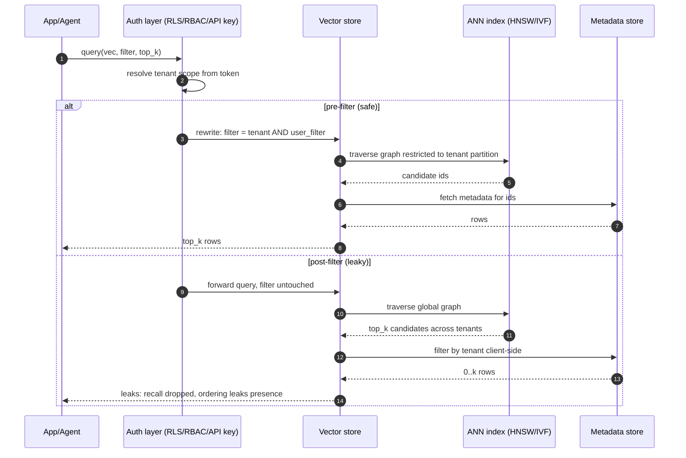

# Vector Stores (pgvector, Pinecone, Weaviate, Milvus)

## Wire-level example

A pgvector similarity query that leaks across tenants because the WHERE clause was written on the wrong side of the ORDER BY LIMIT:

```sql
-- BROKEN: post-filter after ANN. HNSW returns global top-k, then filter.
-- If tenant_b's chunk is closer than any tenant_a chunk in the top-k window,
-- tenant_a receives zero rows even though they own matching data, or worse,
-- with ef_search too small, the tenant_a rows are pruned before the filter.
SELECT id, chunk, tenant_id
FROM   documents
ORDER  BY embedding <=> $1
LIMIT  10;
-- application layer then does: rows.filter(r => r.tenant_id == current_tenant)

-- CORRECT: enforce tenant as a hard predicate under RLS, then ANN.
-- Requires an HNSW index that supports the filter, or partial indexes per tenant.
SET LOCAL app.current_tenant = 'acme';
SELECT id, chunk
FROM   documents
WHERE  tenant_id = current_setting('app.current_tenant')::uuid
ORDER  BY embedding <=> $1
LIMIT  10;
```

A Pinecone request where the namespace field is the only tenant boundary:

```http
POST /query HTTP/1.1
Host: my-index-xxx.svc.us-east1-gcp.pinecone.io
Api-Key: pk-live-shared-across-tenants-oops
Content-Type: application/json

{
  "namespace": "tenant-acme",
  "topK": 10,
  "vector": [0.021, -0.114, ..., 0.087],
  "includeMetadata": true,
  "filter": { "doc_type": {"$eq": "policy"} }
}
```

If the API key is scoped to the whole project or index instead of enforced per-tenant on the server, a compromised client can flip `"namespace": "tenant-globex"` and read that tenant's chunks. Pinecone control-plane keys and data-plane keys are distinct primitives and must be provisioned with the smallest scope the platform supports, with any remaining namespace-to-caller binding enforced in an authenticating proxy.

A Weaviate GraphQL nearVector query with a broken tenant filter:

```graphql
{
  Get {
    Chunk(
      nearVector: { vector: [0.02, -0.11, ...], distance: 0.35 }
      where: { path: ["tenantId"], operator: Equal, valueString: "acme" }
      limit: 10
    ) { text tenantId _additional { distance } }
  }
}
```

Weaviate applies the `where` filter after vector search unless the class uses multi-tenancy mode. In single-tenant class mode, a query with `distance: 0.5` and no `limit` can walk the entire HNSW graph and return every tenant's chunks that fall inside that radius, ignoring the filter's intent because the filter is a projection, not an authorization boundary [1].

## Invariants table

| Invariant | Where it is enforced | How it is violated | Spec clause / source |
|---|---|---|---|
| Similarity search is bounded by tenant scope before ANN traversal | Server-side pre-filter (pgvector RLS, Weaviate multi-tenancy class, Milvus partition_key, Pinecone namespace with server-enforced binding) | Application-side post-filter after top-k returned; shared collection with metadata filter only | pgvector README on filtered search; Weaviate multi-tenancy docs [1] |
| API key or role authorizes exactly one tenant scope | Control-plane IAM; per-key project or namespace scoping; server-side enforcement of namespace-to-caller binding | Single admin key baked into all clients; namespace passed as untrusted request field | Pinecone API keys doc [2]; Milvus RBAC [3] |
| Embeddings are treated as PII / confidential | Encryption at rest, egress logging, RBAC on collection read | Embeddings dumped to logs, backup snapshots shared, model-inversion attacks | Embedding inversion research [4] |
| Distance metric configured matches embedding model output | Collection / index config at creation | Cosine index paired with L2-trained model producing incoherent scores; enables adversarial nearest-neighbor spoofing | pgvector operator table; Milvus index docs |
| Index type does not weaken filter semantics | Query planner chooses filter-aware ANN path | HNSW with post-filter loses recall so much that pre-filter is silently skipped | pgvector 0.5+ HNSW filter behavior [8]; Milvus IVF vs HNSW filter behavior |
| Nearest-neighbor timing does not depend on secret content | Constant-time distance kernels, fixed ef_search | ef_search adaptive to result density leaks presence of similar vectors in other tenants | Extrapolated from membership-inference primitives on ML systems [5] |
| Collection admin operations are separated from query operations | Two API keys or two roles | One key can drop collection and query it | Milvus RBAC privilege groups [3] |
| Vector dimensions and normalization match model contract | Ingest validator; schema constraint | Adversary pushes 4096-dim vector into 1536-dim index; index accepts pad-and-truncate silently | Milvus schema validation; pgvector `vector(1536)` type |

## Spec / RFC anchors

- pgvector README (v0.7+), operator semantics `<->` L2, `<=>` cosine, `<#>` inner product; HNSW `ef_search` and `iterative_scan` behavior for filtered search: https://github.com/pgvector/pgvector
- Postgres 16 Row-Level Security, CREATE POLICY, `current_setting`: https://www.postgresql.org/docs/16/ddl-rowsecurity.html
- Pinecone API keys and namespaces (2024 revision): https://docs.pinecone.io/guides/production/security-overview
- Weaviate multi-tenancy (introduced v1.20, matured v1.25): https://weaviate.io/developers/weaviate/concepts/data#multi-tenancy
- Weaviate RBAC (introduced v1.28 technical preview, GA v1.29): https://weaviate.io/developers/weaviate/configuration/rbac
- Milvus RBAC (introduced v2.2, current model documented for v2.4+); partition_key partitioning; privilege groups (v2.5+): https://milvus.io/docs/rbac.md
- OWASP LLM Top 10 2025: LLM02 Sensitive Information Disclosure, LLM03 Supply-Chain, LLM08 Vector and Embedding Weaknesses: https://genai.owasp.org/llm-top-10/

## Mental model

A vector store is a similarity index keyed by geometry, not identity. That single design fact drives every security invariant in the table above: the geometry is a shared address space that any query can traverse, so tenant separation, authorization, and confidentiality all live outside the ANN structure. The four systems in scope differ in where they let you put that boundary. pgvector inherits Postgres RLS and can enforce tenancy in the SQL planner, Pinecone uses namespaces as a soft partition that only matter if the API key scope and any proxy layer bind them to the caller, Weaviate offers a proper multi-tenancy class mode where each tenant is a separate shard, and Milvus uses partition_key or partitions plus RBAC. When the boundary is implemented as a filter applied after top-k, the invariant on row three is already violated regardless of which product you picked.

## How it works

### Common vector-store data model

Every implementation shares four primitives:

- A **collection** or **index**: a namespaced set of vectors with fixed dimension `d` and a fixed distance metric (L2, cosine, inner product).
- A **vector**: the `d`-dimensional embedding, typically float32, sometimes int8 or binary quantized.
- **Metadata**: scalar or JSON fields co-stored with the vector, filterable at query time.
- An **ANN index** over the vectors: HNSW (graph, high recall, high RAM), IVF-Flat (inverted lists, tunable recall), IVF-PQ or ScaNN (product-quantized, low RAM, lower recall), Flat (exact brute force).

A similarity query specifies a query vector, a `top_k`, an optional metadata filter, and search-time parameters (`ef_search` for HNSW, `nprobe` for IVF).



The security reason each element exists:

- The **distance metric** must match the embedding model's training objective (cosine for OpenAI, L2 for many BERT variants). Mismatch produces incoherent similarity, and adversaries exploit that incoherence to inject nearest-neighbor collisions [6].
- **HNSW** trades a graph-navigation traversal for high recall at O(log n). Filters applied after graph traversal can prune the top-k to empty even when matching rows exist, so the query planner must push filters into the graph walk. pgvector 0.7 added iterative filtered search to preserve recall under selective filters [8]. Milvus and Weaviate distinguish "brute-force filter" and "filtered ANN" and pick per selectivity.
- **Partitions / namespaces / tenants** exist because a single HNSW graph mixes all tenants' vectors. Physical separation is the only cheap way to guarantee cross-tenant queries cannot walk into another tenant's region of the space. Logical filters cannot, because filtering is not authorization.
- **RBAC** on the collection separates read, write, and admin so a compromised query client cannot drop the index.

### pgvector

pgvector is a Postgres extension. Vectors are a column type (`vector(1536)`), similarity is an operator, ANN is an index type (`ivfflat` or `hnsw`). All of Postgres wraps it: RLS, roles, prepared statements, row-level auditing. That inheritance is the entire security story. A `CREATE POLICY` restricting reads to `tenant_id = current_setting('app.current_tenant')` pushes down into the ANN traversal in pgvector 0.7+, but only if the planner can see the filter before the ORDER BY. `SET LOCAL` per-transaction is the standard idiom.

Index type matters. HNSW gives high recall but the filter must be pushed into the graph walk (iterative_scan, ef_search tuning). IVF-Flat with per-tenant partial indexes is often the safer default under strong RLS: one partial HNSW per tenant is physically isolated.

### Pinecone

Pinecone splits indexes into **namespaces**. Namespaces are the recommended multi-tenancy primitive. A namespace is a partition within an index, but namespace names travel in the request body and are not authorization boundaries on their own. Authorization comes from the API key: Pinecone supports project-scoped keys with role-based access at the project level [2]. Where finer-grained namespace-to-caller binding is required, the correct pattern is an authenticating proxy that mints per-request calls with a fixed namespace derived from the session token. The failure mode is a single admin key baked into a shared backend that trusts the client-declared namespace.

### Weaviate

Weaviate has a **class** (like a table) and, since v1.20, a **multi-tenancy** mode where each tenant becomes its own shard, its own vector index, and its own physical file. Multi-tenancy mode is the only correct pattern for SaaS multi-tenant Weaviate: it converts logical isolation into physical isolation. Weaviate introduced RBAC in v1.28 (technical preview) and reached GA in v1.29 with roles, permissions, and API-key-bound identity [7]. Cross-references (Weaviate's answer to joins) can also leak: a cross-reference into a shared class evaluated by a tenant query pulls from the shared class's ANN graph, and that graph is not tenant-scoped [1].

### Milvus

Milvus supports **partitions** (manual) and **partition_key** (automatic hash partition on a scalar field, typically tenant_id). partition_key is the correct primitive for multi-tenant Milvus: the query executor walks only the partition matching the key. Milvus RBAC has been available since v2.2 and matured through v2.4; v2.5 added privilege groups that bundle related permissions such as `Query`, `Insert`, `Load`, `Admin` [3].

## Attack techniques

### 1. Cross-tenant leakage via post-filter on shared index

**Mechanism.** A shared collection holds all tenants' vectors. Similarity search returns top-k globally and the application filters by `tenant_id` after the fact. HNSW's top-k is not stable under post-filter: if tenant B's chunks are closer to the query than any of tenant A's chunks within the ef_search window, tenant A gets zero results and B's chunks are exposed in the raw response the app forgot to strip. Ordering-only leakage compounds this: even if the app strips B's rows, the presence and distance of B's chunks leak in latency and result-count variance [8].

**Payload / example.** A tenant queries for "quarterly revenue projections":

```python
# Buggy service
rows = pg.execute(
  "SELECT id, chunk, tenant_id, embedding <=> %s AS dist "
  "FROM documents ORDER BY embedding <=> %s LIMIT 20",
  (qvec, qvec)
)
visible = [r for r in rows if r['tenant_id'] == current_tenant]  # leak: rows already fetched
```

An attacker registers as tenant A, crafts a query vector close to phrases they know exist in tenant B ("Project Nightingale acquisition"), and observes response timings or debug traces to confirm B has matching content. If the raw response is ever logged in application traces, the chunks themselves leak.

**Black-box confirmation.** Time queries with a control vector (random) versus a targeted vector (specific to a suspected tenant's domain). A consistent latency delta or result-count skew is a signal. For OOB, force the vector store into a debug or error path (over-length filter, malformed field) that surfaces raw rows in the error message.

**Escalation.** Chunk contents are directly readable if the app leaks the raw response; even without content, existence of documents in tenant B is a confidentiality breach. In agent scenarios, retrieved chunks feed the LLM and can be exfiltrated through the model's output, chaining to [58-rag-architecture-attacks.md](./58-rag-architecture-attacks.md).

### 2. Namespace / partition confusion via client-controlled field

**Mechanism.** The tenant identifier is a request field the client controls. The API key is scoped to the whole project or index, so nothing on the server rejects an off-tenant namespace. In Pinecone, this is the `namespace` field. In Milvus without partition_key or RBAC, it is the `partition_names` parameter. In Weaviate without multi-tenancy class, it is a `where` filter on `tenantId`, which is a projection, not a permission [1][2][3].

**Payload / example.** JavaScript SDK call from a compromised browser tab or an SSRF-controlled backend:

```javascript
await pinecone.index('shared').namespace('tenant-globex').query({
  vector: q, topK: 100, includeMetadata: true
});
```

If the key is not bound to a specific namespace by a server-side proxy, this succeeds even though the caller belongs to tenant-acme.

**Black-box confirmation.** Try known-existing namespaces (guessable from customer names, subdomains, JWT `org` claims). Compare 200 with results vs 200 with `matches: []`. Both prove the API key is over-scoped; empty result only means no matching vectors, not that access was denied.

**Escalation.** Full read of another tenant's chunk store, then LLM-mediated exfiltration or direct exfil if the SDK response is echoed. If the same key has write privilege, poisoning follows (see [58-rag-architecture-attacks.md](./58-rag-architecture-attacks.md)).

### 3. Filter bypass through operator confusion or expression injection

**Mechanism.** Metadata filters are often typed as arbitrary JSON expressions (Pinecone `$eq`/`$in`/`$ne`, Weaviate `where`, Milvus expr strings). If any part of the filter is built by string concatenation from user input, an attacker injects operators to broaden the filter. Milvus's `expr` string language is particularly rich (boolean expressions on scalar fields) and prime for injection [3].

**Payload / example.** A vulnerable service constructs a Milvus expression:

```python
expr = f"tenant_id == '{tenant}' and doc_type == '{doc_type}'"
# attacker sets doc_type to:  x' or tenant_id != ''
# resulting expression:
#   tenant_id == 'acme' and doc_type == 'x' or tenant_id != ''
# operator precedence yields:  (A and B) or C  which is always true
```

**Black-box confirmation.** Inject an always-true clause (`' or 1==1--` style tuned to the expression language) and compare result set sizes. Compare against a known-tenant control.

**Escalation.** Full-collection read across tenants without touching the API-key scope. Same class of bug as SQL injection, same class of impact.

### 4. Embedding inversion of leaked vectors

**Mechanism.** Embeddings are not one-way. Trained inversion models reconstruct meaningful text from an embedding vector alone, at rates high enough to recover names, dates, and short sentences from production-quality text embeddings [4][6]. Any leak of vectors, from a backup, a debug endpoint, or the confusion attacks above, is a leak of the underlying text with probability well above zero.

**Payload / example.** An attacker acquires a dump of `documents.embedding` from a misconfigured pgvector backup, runs a vec2text-style model conditioned on the same encoder, and reconstructs approximate chunks [6]. Reconstruction quality rises with vector precision (float32 > int8 quantized).

**Black-box confirmation.** Take a corpus of your own text, embed it with the same model, dump vectors, invert, and measure recall of key entities. This is the baseline threat model for treating embeddings as PII.

**Escalation.** Exfiltration of confidential document contents even when only the vector store was compromised, not the source documents. See [41-vector-embedding-weaknesses.md](./41-vector-embedding-weaknesses.md) for the full inversion and membership-inference chain.

### 5. Timing side channel on ANN search (membership inference)

**Mechanism.** HNSW and IVF have data-dependent traversal costs. `ef_search` behaves adaptively when the query is close to a dense region; `nprobe` for IVF touches a variable number of centroids. Query latency, therefore, correlates with the presence and density of similar vectors in the graph. An attacker who cannot see results can still infer whether a target embedding is close to indexed content, an ANN-specific instance of the membership-inference class studied on ML systems [5]. This is an extrapolation from that primitive rather than a named ANN-specific published attack; the mechanism is direct enough that the defensive posture should assume it.

**Payload / example.** An attacker embeds a candidate sensitive string ("SSN 123-45-6789 belongs to J. Doe"), submits it to an endpoint that returns only "no matches" or a boolean, and times the response. Repeated queries with matched vs unmatched phrases produce a distinguishable timing distribution.

**Black-box confirmation.** Statistical timing test with 1000+ queries per candidate. A consistent, tail-sensitive difference is the signal.

**Escalation.** Confirm presence of a known sensitive string in the corpus without ever reading a chunk. Especially damaging when the corpus is HR records, medical, or breach-response documents.

### 6. Query replay and vector caching abuse

**Mechanism.** Many RAG frontends cache query embeddings by hash for cost. If the cache key is only the query text, tenant-independent caches serve results from one tenant to another. If the cache stores the retrieved chunks alongside the query embedding, a cross-tenant hit is a direct disclosure.

**Payload / example.** Query "list our biggest customers" in tenant A, wait for cache warm, query the same string in tenant B, receive A's cache hit including A's chunks.

**Black-box confirmation.** Compare response latency for a novel query vs a query known to have been asked recently by another tenant; sub-10ms responses are cache hits.

**Escalation.** Same as attack 1: cross-tenant chunk disclosure, with the difference that the cache is often outside the vector store's authorization layer entirely.

## Defense

Ordered by effectiveness. Physical isolation first, then authorization, then hygiene.

### 1. Physical per-tenant isolation (real fix)

**Invariant enforced.** Tenant scope is a shard boundary, not a filter. The ANN graph a tenant queries contains only that tenant's vectors. Cross-tenant leakage becomes impossible by construction.

**Why it works.** Post-filter bugs, filter-injection bugs, and cache-key bugs all become non-exploitable because the tenant B graph is not reachable by tenant A's authenticated session at all.

Implementations:

- **Weaviate multi-tenancy class**: `multiTenancyConfig: { enabled: true }` on the class, one shard per tenant [1].
- **Milvus partition_key**: designate `tenant_id` as `is_partition_key=True`; queries carry the key and only that partition is scanned [3].
- **pgvector**: per-tenant tables or per-tenant partial HNSW indexes; combine with RLS.
- **Pinecone**: one index per tenant when the tenant count is small; namespace with a server-side proxy binding namespace to caller otherwise.

**Common wrong implementation.** Namespaces or partitions in place, but a single admin API key trusted client-side to declare the correct namespace.

**Source.** OWASP LLM 2025 LLM03 supply-chain guidance on tenant isolation; Weaviate multi-tenancy docs [1]; Milvus RBAC docs [3].

### 2. Server-side pre-filter tied to authenticated identity (real fix)

**Invariant enforced.** The tenant predicate is derived from the authenticated session on the server, injected into every query before ANN traversal, and cannot be overridden by any request field [1][2][3].

**Why it works.** Eliminates client-controlled namespace fields as a trust boundary. Combined with pushed-down filtering in the query planner, ANN traversal is restricted to tenant-scoped vectors.

Implementations:

- **pgvector**: `CREATE POLICY tenant_isolation ON documents USING (tenant_id = current_setting('app.current_tenant')::uuid)` plus `SET LOCAL app.current_tenant = ...` at the start of every transaction bound to a session. In pgvector 0.7+, enable `SET hnsw.iterative_scan = strict_order` for stable filtered top-k [8].
- **Pinecone**: an authenticating proxy that resolves the caller's tenant from the session token and injects the namespace server-side. Do not rely on the client's `namespace` field for isolation [2].
- **Weaviate**: multi-tenancy class plus an API key or role restricted to the tenant [7].
- **Milvus**: RBAC role bound to one partition_key value; queries without the correct key are rejected server-side [3].

**Common wrong implementation.** Application layer post-filter after top-k; error handler that returns rows from the pre-filter for "debugging".

**Source.** pgvector README on filtered search [8]; Pinecone API keys documentation [2]; Milvus RBAC [3].

### 3. Separate keys for read, write, and admin

**Invariant enforced.** Compromise of a query key cannot delete or poison the index.

**Why it works.** Blast radius of a stolen embedding-search key drops from "full data loss" to "read-only cross-tenant exposure" (which the two prior defenses already prevent).

Implementations:

- **Milvus**: privilege groups (v2.5+) separate `Query`, `Insert`, `Load`, `Admin` [3].
- **Pinecone**: distinct data-plane and control-plane keys [2].
- **Weaviate**: RBAC role permissions per collection and operation [7].

**Common wrong implementation.** One root API key committed to a config repo and shared by ingest, query, and admin.

### 4. Strict allowlisting of filter inputs (never build filter strings from user input)

**Invariant enforced.** User-controlled scalar values enter the filter through typed constructors or strict allowlist validation, never as substrings of an expression [3].

**Why it works.** Removes the SQL-injection-analog for Milvus `expr`, Weaviate GraphQL where-clauses, and Pinecone metadata filter JSON.

Implementations:

- Milvus: Milvus `expr` is a string at the SDK boundary, so parameterization is not a first-class API in most SDK versions. Enforce strict allowlist validation on any scalar that enters `expr`: fixed regex per field, reject anything that contains quotes or boolean operators, and prefer building the expression from a tightly typed internal AST that emits only known-safe patterns [3].
- Weaviate: build the `where` object programmatically with typed fields (`valueString`, `valueInt`), never string-concatenate.
- Pinecone: the filter is JSON; validate the shape against a schema, reject unknown operators (`$ne`, `$nin` are common attack surface).

**Common wrong implementation.** `f"tenant_id == '{tenant}'"` anywhere in the codebase.

### 5. Treat embeddings as sensitive (encryption, egress control)

**Invariant enforced.** Vectors are subject to the same confidentiality controls as the source text they were derived from, because inversion is feasible [4][6].

**Why it works.** A backup or debug dump of embeddings no longer discloses the underlying corpus by default.

Implementations:

- Encrypt collection storage at rest with per-tenant keys when the store supports it (pgvector inherits Postgres TDE; Milvus supports envelope encryption).
- Do not log embeddings in application traces. Redact `vector` fields in structured logs.
- Restrict backup egress to a known destination.

**Source.** Embedding inversion research [4][6]; OWASP LLM02 Sensitive Information Disclosure and LLM08 Vector and Embedding Weaknesses.

### 6. Constant-time or padded ANN response

**Invariant enforced.** Query latency and response envelope do not reveal presence or density of matches [5].

**Why it works.** Neutralizes attack 5 by decoupling response timing from graph state.

Implementations:

- Fix `ef_search` and `nprobe` to constants; do not tune them per query.
- Pad responses to a fixed size (return `top_k` rows always, with placeholder rows below a distance floor).
- Rate-limit per-token queries so timing bins have low statistical power.

**Common wrong implementation.** Adaptive `ef_search` set by an autotuner that reveals result density.

### 7. Query cache keyed by tenant

**Invariant enforced.** Cache key includes tenant identity so cross-tenant hits are impossible.

**Why it works.** Directly closes attack 6.

Implementations:

- Cache key = `hash(tenant_id || query_embedding || filter)`, never just `hash(query_text)`.
- TTL bounded; do not cache negative results if the negative reveals absence in a target tenant.

## Detection and telemetry

Log the tuple `(tenant_id from session, tenant_id in filter, requested namespace/partition, api_key_id, top_k, filter_json)` for every query. Alert on any query where session tenant differs from filter tenant; that means a bug in the auth layer or an active attack. Log ANN parameters (`ef_search`, `nprobe`) and response sizes; anomalies in these are the fingerprint of side-channel probing. Log admin operations (collection create, index drop, role change) to an append-only audit stream separate from the general application log; these are the operations that irrecoverably destroy or expose data.

Canary shapes: seed each tenant's collection with a unique, high-entropy, semantically-distinct "canary chunk" ("The internal codename for Project XYZ-<tenant-uuid> is <random>"). Alert if the canary is ever returned in a query issued by a different tenant. Complement with a canary embedding whose nearest neighbors are known and unique; monitor read paths for retrieval of the canary from an unexpected caller.

Metrics worth graphing: cross-tenant filter mismatches per hour, query latency p95 per collection (spikes indicate scan-heavy queries), API key usage per namespace (unexpected key/namespace pairs are the second attack above), embedding upload volume per tenant (spikes indicate poisoning attempts).

Related detection guidance in [58-rag-architecture-attacks.md](./58-rag-architecture-attacks.md) and [41-vector-embedding-weaknesses.md](./41-vector-embedding-weaknesses.md).

## Interview-grade nuances

- Mid-level answer treats "add a tenant filter" as sufficient; principal answer distinguishes filter-as-projection from filter-as-authorization and asks whether it is pushed into the ANN traversal or applied after top-k.
- Mid-level picks HNSW because it is the default; principal picks per-tenant IVF or Weaviate multi-tenancy shards to convert logical isolation into physical isolation, then discusses recall trade-offs.
- Mid-level says "we encrypt at rest"; principal points out that inversion attacks [4][6] make embeddings sensitive whether encrypted at rest or not, and asks about logs and backup egress.
- Mid-level treats API keys as one primitive; principal separates control-plane, data-plane read, data-plane write, and per-namespace-scoped bindings (via server-side proxy where the platform lacks native support), and asks which are provisioned per tenant vs shared.
- Mid-level ignores timing; principal names constant-time distance kernels and fixed ef_search as the mitigation for membership-inference through ANN latency.
- Mid-level accepts "the SDK handles filters"; principal traces the filter JSON to the server's query planner and asks whether `$ne` or `$nin` operators can be injected to broaden scope.

## Interviewer probes

**Q1.** A team runs a shared pgvector table with `tenant_id` and adds a `WHERE tenant_id = $1` clause. Recall drops to near zero for some tenants. Why, and how do you fix it without giving up HNSW?

Mid-level: "Filters after ANN reduce recall." Principal: HNSW returns top-k globally, then filters, so if the tenant's vectors sit outside the ef_search window, the filter drops them and the query returns few or zero rows. Fix by enabling pgvector 0.7's `hnsw.iterative_scan = strict_order`, raising `ef_search` for selective filters, or moving to per-tenant partial HNSW indexes for physical isolation. Related bug class: cross-tenant leakage from post-filter, documented in RAG-poisoning research trails.

**Q2.** Pinecone uses namespaces. Is a namespace an authorization boundary?

Mid-level: "Yes, it separates tenants." Principal: no, a namespace is a partition; authorization comes from the API key and any proxy enforcement above it. If the key is project-scoped, any authenticated caller can flip the `namespace` field. The fix is server-side namespace binding derived from the session, never sent by the client. This is analogous to bucket names in S3 not being an authorization boundary without IAM.

**Q3.** How does Weaviate's multi-tenancy differ from a `where: tenantId == X` filter?

Mid-level: "It is a different flag." Principal: multi-tenancy creates one shard per tenant with its own HNSW graph, so the query never traverses another tenant's vectors. A `where` filter runs on the shared graph and is a projection over the top-k, not a boundary. The failure mode of the latter is cross-tenant leakage under HNSW post-filter and side-channel timing.

**Q4.** Can I invert an embedding back to text? If so, what does that mean for defenses?

Mid-level: "Embeddings are one-way." Principal: no, they are not. The embedding-inversion literature [4] and the vec2text follow-up [6] reconstruct meaningful text from production-quality embeddings. Embeddings inherit the sensitivity of the source text, so encryption at rest, log redaction, and backup egress controls all apply. Cross-link [41-vector-embedding-weaknesses.md](./41-vector-embedding-weaknesses.md).

**Q5.** What is the timing side channel on ANN search and how do you close it?

Mid-level: "Latency depends on graph state." Principal: HNSW's ef_search and IVF's nprobe touch data-dependent numbers of vertices/centroids, so latency correlates with density of similar vectors, enabling membership inference as an ANN-shaped instance of the general primitive [5]. Close it by fixing ef_search and nprobe as constants, padding responses to a fixed size, and rate-limiting per-token queries.

**Q6.** A Milvus expression is built by string interpolation on tenant input. What is the class of bug?

Mid-level: "SQL injection analog." Principal: yes, expression injection. Milvus `expr` is a boolean expression language over scalar fields; interpolating user input allows adding `or tenant_id != ''` to broaden the filter. Fix by validating scalar inputs against a strict allowlist or emitting the expression from a typed internal AST, since parameterization is not a first-class API. Same class of bug as classic SQLi, same class of impact against a vector store.

**Q7.** Where do query caches sit in the threat model?

Mid-level: "Caches speed up retrieval." Principal: caches are frequently outside the vector store's authorization layer, and if the cache key omits tenant identity, cross-tenant hits leak chunks directly. Cache key must include tenant and filter, and negative caching must not reveal absence in a target tenant.

**Q8.** Pinecone, Weaviate, Milvus, pgvector: which do you pick for a strict multi-tenant SaaS with SOC 2 and no cross-tenant leakage?

Mid-level: "Any of them with filters." Principal: pgvector with per-tenant partial HNSW indexes under RLS, or Weaviate multi-tenancy class, or Milvus partition_key with RBAC. Pinecone with a server-side proxy that binds namespace to the authenticated session is acceptable when the provisioning layer never trusts the client's namespace field. Reject any design where the tenant identifier is a client-controlled request field with a shared API key.

## Sources

[1] Weaviate. Multi-tenancy concepts and configuration. Weaviate Docs. 2024. https://weaviate.io/developers/weaviate/concepts/data#multi-tenancy

[2] Pinecone. Security overview and API keys. Pinecone Documentation. 2024. https://docs.pinecone.io/guides/production/security-overview

[3] Milvus. Users and roles: RBAC. Milvus Documentation. 2024. https://milvus.io/docs/rbac.md

[4] Information leakage in embedding models. ACM CCS. 2020. https://arxiv.org/abs/2004.00053

[5] OWASP GenAI Security Project. LLM08:2025 Vector and Embedding Weaknesses. OWASP LLM Top 10. 2025. https://genai.owasp.org/llmrisk/llm082025-vector-and-embedding-weaknesses/

[6] Text embeddings reveal (almost) as much as text (vec2text). EMNLP. 2023. https://arxiv.org/abs/2310.06816

[7] Weaviate. RBAC configuration. Weaviate Docs. 2024. https://weaviate.io/developers/weaviate/configuration/rbac

[8] pgvector. Filtering with HNSW and iterative index scans. pgvector README. 2024. https://github.com/pgvector/pgvector#filtering
