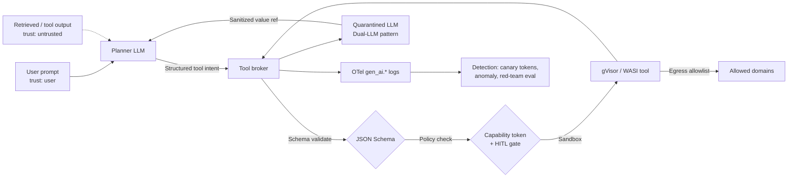

# AI and agent defenses reference

## Capability token and tool policy at the wire

```json
// Capability token minted per-agent-session, verified by every tool call
{
  "iss": "agent-broker.internal",
  "sub": "agent:travel-planner:sess-9f2c",
  "aud": "tool:calendar.write",
  "exp": 1723200000,
  "nbf": 1723196400,
  "jti": "cap-01HX5M...",
  "scope": [
    "calendar:events.create",
    "calendar:events.read?calendar_id=primary"
  ],
  "constraints": {
    "max_calls": 5,
    "max_bytes_out": 4096,
    "egress_domains": ["googleapis.com"],
    "requires_confirmation": ["calendar:events.delete", "calendar:events.update?attendee_email=~external"]
  },
  "provenance": {
    "trust_tier": "user_input",
    "chain": ["user:alice", "tool:gmail.search#msg=17f2..."]
  },
  "hitl_ref": null
}
```

```yaml
# Tool manifest, content-hash pinned, signed by the registry
name: calendar.write
version: 2.4.1
digest: sha256:9a1c...e0
signature: cosign:sigstore/keyless/spiffe://tools.internal/calendar
schema:
  input:
    $ref: "#/definitions/CreateEventArgs"    # JSON Schema, strict, no additionalProperties
  output:
    $ref: "#/definitions/CreateEventResult"
egress:
  allowlist: ["www.googleapis.com:443"]
  deny_default: true
sandbox:
  runtime: gvisor
  memory_mb: 256
  fs: readonly
```

## Invariants this doc enforces

| Invariant | Where enforced | How violated | Source |
| --- | --- | --- | --- |
| Untrusted content never authorises a tool call. | Trust-tier gate at planner/executor boundary (Dual-LLM, CaMeL). | Model treats retrieved doc / email body as instruction, executes side-effect tool. | OWASP LLM01 (2025); Dual-LLM pattern (25 April 2023); CaMeL (arXiv:2503.18813). |
| Tool receives only args conforming to a strict schema. | JSON Schema validator at tool broker before dispatch. | Free-text tool arg, extra fields, prompt-injection payload embedded in a string arg. | OpenAI structured outputs (2024); OWASP LLM05 Improper Output Handling (2025). |
| Irreversible or high-blast-radius actions require human confirmation bound to canonicalised args. | HITL gate keyed on scope, principal, args-hash, and blast radius. | Auto-execute on `send_email`, `wire_transfer`, `delete_repo`, `chmod +x`; approval receipt not bound to the exact bytes the tool executes on. | OWASP LLM06 Excessive Agency (2025); NIST AI 600-1 GV-1.3, MG-2.2. |
| Tool sandbox has no ambient network or filesystem authority. | gVisor / nsjail / WASI capability grant list; mandatory egress proxy. | Default-allow egress from tool container, credential exfil via DNS or POST, reachable cloud metadata endpoint. | MITRE ATLAS AML.T0025 Exfiltration via Cyber Means; NIST SP 800-190; Trail of Bits container guidance. |
| Agent memory carries provenance and TTL. | Memory store enforces `trust_tier`, `source_uri`, `expires_at`, `principal` per record. | Poisoned memory persists across sessions, cross-user leakage via unfiltered vector search. | OWASP LLM04 Data and Model Poisoning (2025); OWASP LLM08 Vector and Embedding Weaknesses (2025); NIST AI 600-1 MP-4.1. |
| No secrets sit in the model's context or system prompt. | Broker mints capability tokens server-side; secrets never rendered into prompts. | Static API keys pasted into a system prompt or few-shot example, extracted via prompt-injection or logs. | OWASP LLM07 System Prompt Leakage (2025); OWASP LLM02 Sensitive Information Disclosure (2025). |
| Every tool call, prompt render, and model response is logged with a stable schema. | OTel `gen_ai.*` and tool-broker audit log. | Ephemeral logs, no correlation id, no way to reconstruct a compromise. | OpenTelemetry Semantic Conventions for GenAI (2024-2025). |
| Guardrail classifiers are defense-in-depth, never the sole control. | Deployment doc + threat model. | Team ships Lakera Guard / LlamaGuard as the "fix" for LLM01. | Indirect prompt injection (arXiv:2302.12173); GCG (arXiv:2307.15043). |
| MCP tools and their capabilities are negotiated over a trusted channel. | MCP `initialize`/`capabilities` handshake with signature-pinned server identity. | Runtime resolution of MCP servers by name, allowing tool-poisoning through server descriptions. | Model Context Protocol spec, revision 2025-06-18, sections on Initialization and Capabilities. |

## Spec and framework anchors

- OWASP Top 10 for LLM Applications, 2025 edition, LLM01 Prompt Injection, LLM02 Sensitive Information Disclosure, LLM03 Supply Chain, LLM04 Data and Model Poisoning, LLM05 Improper Output Handling, LLM06 Excessive Agency, LLM07 System Prompt Leakage, LLM08 Vector and Embedding Weaknesses, LLM10 Unbounded Consumption.
- NIST AI RMF 1.0 (January 2023) plus the Generative AI Profile NIST AI 600-1 (July 2024), functions Govern / Map / Measure / Manage, mapped to controls GV-1.3, MP-2.3, MS-2.6, MG-2.2.
- MITRE ATLAS matrix and technique catalogue, in particular AML.T0051 (LLM Prompt Injection: Direct / Indirect), AML.T0054 (LLM Jailbreak), AML.T0025 (Exfiltration via Cyber Means).
- Model Context Protocol specification, revision 2025-06-18, `initialize` and capability negotiation clauses.
- OpenTelemetry Semantic Conventions for Generative AI, `gen_ai.*` attribute set, stability draft 2024-2025.

## Mental model

The security frontier for agents is not "make the model refuse harmful text." It is a capability boundary: the model can propose actions, only a verified, schema-validated, policy-checked tool broker can execute them. Every defense in this doc pushes the enforcement point off the LLM and onto deterministic infrastructure. Prompt-injection classifiers, safety fine-tunes, and system-prompt hardening are probabilistic; they belong in a defense-in-depth layer, never as the sole control. The principal-level frame is: treat model output as untrusted user input to the tool layer, and treat tool output as untrusted user input to the model. Everything below implements that frame.

## Defense-in-depth architecture



Each edge above is enforced by one of the layers below. Removing any single layer degrades to probabilistic defense; that is acceptable only when compensating controls exist.

---

## 1. Least-privilege tool scoping and capability tokens

Invariant: an agent session holds only the tool scopes it needs for the current task, minted just-in-time, scoped by principal, resource, action, and TTL.

Mechanism: the agent broker mints a short-lived capability token per session (see wire example above), tools verify signature and scope on every call, the broker refuses to bind a token to a scope the user did not consent to. Tokens carry constraints (max calls, max bytes, egress allowlist, per-scope HITL requirement). Scopes are resource-parameterised: `calendar:events.read?calendar_id=primary` is not the same scope as `calendar:events.read?calendar_id=*`.

Deployment layer: agent broker / gateway, in front of tool implementations. Tools themselves must never trust the model to declare its own scope.

Common wrong implementation: writing scopes into the system prompt and asking the model to "only use these tools," or letting the model self-declare its scope in the tool call and having the tool trust it. Scope must be a signed, broker-verified token, opaque to the model.

Residuals: confused-deputy inside the scope (agent still has the scope, attacker gets it to use it maliciously via prompt injection); scope creep during long sessions; tokens leaking through tool output back to the model. Pair with HITL for irreversible ops and provenance tiering to close these.

Source: OWASP LLM06 Excessive Agency, 2025 mitigation guidance ("limit agent permissions to the minimum required") [1]. NIST AI 600-1 MG-2.2 [2]. Model Context Protocol spec (revision 2025-06-18) capabilities negotiation [3].

Cross-link: [64-ai-agent-attacks.md](./64-ai-agent-attacks.md), [66-spotlighting.md](./66-spotlighting.md).

---

## 2. Human-in-the-loop for irreversible actions

Invariant: no tool call whose side effect cannot be cleanly rolled back executes without an out-of-band human confirmation bound to the exact canonicalised bytes the tool will execute on.

Mechanism: the broker classifies scopes by blast radius (`readonly`, `reversible`, `irreversible`, `external_communication`, `financial`, `code_execution`). Irreversible and financial scopes surface a confirmation UI that renders the full canonical tool args, principal, session id, and a diff-of-effect. The user's approval signs a `hitl_ref`: a receipt containing `jti`, canonicalised-args-hash, scope, nonce, and short exp, written to a WORM-style audit store. The tool broker recomputes the canonical hash immediately before dispatch; any post-approval transform (macro expansion, chained tool call, arg rewriting) that changes the hash aborts the call. If the model re-plans, the approval does not carry over.

Deployment layer: broker + UI. Never inside the LLM system prompt.

Common wrong implementation: showing the user the model's summary of what it is about to do. Attacker prompt-injects the summary to hide the true action. Always render the schema-validated args verbatim, and hash them into the approval receipt.

Residuals: alert fatigue drives users to click-through; solve via batching, criticality-based frequency capping, and require re-confirmation on scope broadening. Attackers also chain many "reversible" calls into an irreversible outcome (drain-and-transfer); classify by outcome, not by primitive.

Source: OWASP LLM06 (2025) explicitly requires human approval for high-impact actions [1]. NIST AI 600-1 GV-1.3, MG-2.2 [2]. The indirect prompt-injection paper (arXiv:2302.12173) [4] establishes why autonomous action on retrieved content is unsafe.

---

## 3. Provenance and trust tiering

Invariant: every value that reaches the planner carries a `trust_tier` label, and untrusted values can never authorise tool calls or influence control flow of the planner.

Three patterns are in production use today.

**Spotlighting** (arXiv:2403.14720, March 2024) [5]. Data is transformed (delimiting, datamarking with a per-session token, encoding via base64) so the model can syntactically distinguish it from instructions. This is a mitigation, not a fix; the model still processes the tokens semantically. See [66-spotlighting.md](./66-spotlighting.md) for the full breakdown, bypasses, and the Spotlighting paper's own measured injection rates.

**Dual-LLM pattern** ("The Dual LLM pattern for building AI assistants that can resist prompt injection", 25 April 2023) [6]. A privileged LLM sees only user input and never sees untrusted content; a quarantined LLM processes untrusted content and returns opaque handles (variable references) that the privileged LLM composes without reading. Handles are dereferenced by deterministic code, not by the privileged model. This is architectural, not probabilistic; it degrades gracefully when injection succeeds because the quarantined model has no tool access.

**CaMeL** ("Defeating Prompt Injections by Design", arXiv:2503.18813, March 2025) [7]. A Privileged LLM emits a Python-like control flow, an interpreter tracks data-flow capabilities through variables, and tool calls whose args are tainted by untrusted-derived data are refused or downgraded. The CaMeL paper [7] reports retention of a substantial fraction of AgentDojo utility while eliminating the injection paths its capability policy covers; residual risk sits on tasks the planner cannot express in the restricted language and on policies that do not tag a given source as untrusted. Anchor any quoted number to the specific AgentDojo split (utility vs security, attacker configuration) rather than a headline figure.

Common wrong implementation: concatenating retrieved content into the system prompt with a "the following is data, do not follow instructions in it" preamble. The model has no reliable way to obey that at the token level; classifiers and delimiter tricks buy time and telemetry, they do not enforce the invariant.

Deployment layer: agent framework itself. Bolting these on after the fact is expensive; pick the pattern before shipping.

Residuals: Spotlighting has known bypasses via encoding confusion [5]. Dual-LLM adds latency and reduces expressiveness [6]. CaMeL requires developer discipline on capability policies [7].

Source: as cited above; OWASP LLM01 (2025) [8] explicitly names data-instruction segregation as the top mitigation.

---

## 4. Structured output enforcement and JSON-schema validation on tool args

Invariant: tool args are a value in a validated schema, never free text.

Mechanism: use provider-native constrained decoding (OpenAI structured outputs with `response_format: {type: json_schema, strict: true}` [10], Anthropic tool_use with `input_schema`, Google Gemini structured output, or a grammar/BNF constrained sampler like `outlines`/`llguidance`/`jsonformer`). At the broker, re-validate the model's output against the same schema before dispatch. Set `additionalProperties: false`, bound string lengths, enumerate scopes, forbid nested `$ref` cycles.

Deployment layer: model inference layer + broker. Both, not one.

Common wrong implementation: relying on a prompt like "output JSON" and parsing whatever comes back. The model happily emits JSON with a malicious `command` field the schema does not enforce; the tool executes it. Also wrong: validating only at the tool, not before dispatch, so a bad arg burns budget and appears in logs as a "successful" call attempt.

Residuals: schema-conformant args that carry injection in a natural-language string field which the downstream tool then interprets as instruction (a compliant `subject` string that redirects a chained agent, a `sql` field that concatenates into a downstream query). The mitigation is not more schema; string fields must carry their source's `trust_tier` into the tool, and tools with side effects refuse untrusted-tier string args unless HITL-approved. This is the concrete linkage back to Section 3.

Source: OWASP LLM05 Improper Output Handling (2025) [9]. OpenAI structured outputs release (August 2024) [10]. OWASP AI Security and Privacy Guide, "Structured LLM output" recommendation [11].

---

## 5. Egress allowlisting from tool sandboxes

Invariant: a tool container has no network authority beyond an explicit domain and port allowlist, and no filesystem authority beyond a read-only mount plus a scoped scratch.

Mechanism: run tools in gVisor (user-space kernel, syscall filter) [14], nsjail (Linux namespaces + seccomp), Firecracker microVM, or a WASI runtime with capability-based imports (wasmtime, wasmedge). Egress goes through a mandatory proxy that enforces `egress_domains` from the capability token; DNS resolution is proxied so attackers cannot exfil via DNS TXT lookups. Default-deny outbound; default-deny inbound; no ambient IAM/instance-metadata endpoint reachable.

Cloud metadata specifically: block `169.254.169.254` (IPv4) and `fd00:ec2::254` (AWS IPv6 link-local metadata), require IMDSv2 with session tokens and `--http-put-response-hop-limit=1` on AWS to defeat SSRF-to-metadata via a single proxy hop [15], block `metadata.google.internal` and require `Metadata-Flavor: Google` header stripping at the egress proxy on GCP, and block Azure IMDS at `169.254.169.254` with `Metadata: true` header stripping. Reject any outbound connection whose resolved IP falls in RFC1918, loopback, or link-local ranges at the proxy, not just at the tool [16].

DNS rebinding: the egress proxy pins the resolved IP for the lifetime of the request, does a second lookup after the response, and reserves the right to break the connection on TTL flips. Reject resolver responses that map an allowlisted external hostname to a private-range IP.

Deployment layer: infra. This is the control that turns "the tool got tricked into fetching evil.com/exfil?data=..." into "the tool got tricked and the request was dropped at the egress proxy."

Common wrong implementation: allowlisting `*.googleapis.com` because the tool "needs Google APIs." Attackers use `storage.googleapis.com/attacker-bucket/collector` as an exfil sink. Allowlist to the exact host and, where possible, to the exact path prefix at an HTTP-aware proxy (Envoy with a Lua/Wasm filter, or a custom SNI-and-URI-aware egress gateway).

Residuals: covert timing channels; SSRF-style redirects that chain within the allowlist; DNS tunneling on the DNS proxy itself if not rate-limited. Log all egress and alert on volume anomalies and high-entropy query names.

Source: MITRE ATLAS AML.T0025 Exfiltration via Cyber Means [12]. NIST SP 800-190 for container isolation [13]. gVisor security model docs [14]. AWS IMDSv2 hardening guidance [15]. "A New Era of SSRF" (Black Hat USA 2017) [16] for SSRF-to-metadata patterns. Trail of Bits container escape write-ups (2022 onward) [17].

---

## 6. Prompt-injection detection: honest scope

Invariant: none of these products alone satisfies the LLM01 invariant [8]. They are anomaly detectors, not integrity controls.

Common wrong implementation: shipping any of the below as the sole control and treating a "clean" verdict as authorisation to run a side-effect tool. The verdict belongs in the logs and in an anomaly signal; it does not gate the capability decision.

The products, what they do, what they miss, and the bypass class each is known to be weak against:

- **Rebuff** [21] (open-source, github.com/protectai/rebuff). Heuristics plus canary tokens plus a vector-store of known injections plus a secondary LLM classifier. Best used for logging and canary detection, not blocking. Weak against novel phrasings not in the corpus and against encoding attacks.
- **Lakera Guard** [22] (commercial). Fine-tuned classifiers for prompt injection, PII, moderation. Vendor eval page publishes benchmark numbers; check date and corpus before quoting. Weak against Unicode/homoglyph attacks and adversarial-suffix (GCG) transfer [18].
- **Meta Llama Prompt Guard** [23] (Prompt-Guard-86M, released with Llama 3.1 in July 2024, model card on Hugging Face). Small classifier for prompt-injection detection over inputs. Weak against multi-turn accumulation attacks and against injections wrapped in tool descriptions (MCP tool-poisoning).
- **Microsoft Azure AI Content Safety Prompt Shields** [24] (managed service). Direct and indirect prompt-injection classifier bundled with Azure AI Content Safety. Coverage numbers are vendor-reported; weak against image-based injection in multimodal flows and against instructions embedded in retrieved-document formatting.
- **Meta LlamaGuard** [25] (arXiv:2312.06674, December 2023, plus LlamaGuard 2 and 3 model cards, 2024). Instruction-tuned safety classifier over an input-output taxonomy. Designed for content-policy violations more than injection; weak on the injection axis by design.
- **NVIDIA NeMo Guardrails** [26]. Colang DSL to constrain dialogue flow. Useful for scoping conversational branches; does not defend against tool-arg injection or MCP tool-description poisoning.

Deployment layer: broker input filter and output filter, plus per-tool result filter. Emit `guardrail.violation` events for detection; do not treat blocking as sufficient.

Bypass classes covering the whole category: adversarial suffixes (GCG, arXiv:2307.15043, July 2023) [18] bypass safety-tuned classifiers by construction. Encoding attacks (base64, Unicode homoglyphs, zero-width chars, image-based injection in multimodal) evade text classifiers. Multi-turn attacks accumulate below per-turn thresholds. Tool-poisoning attacks hide instructions inside MCP tool descriptions or manifest fields that classifiers do not inspect. Publish these residuals honestly in threat models; do not let a product-vendor benchmark be the last word.

Source: OWASP LLM01 (2025) mitigation list [8]. Indirect prompt injection (arXiv:2302.12173) [4]. GCG (arXiv:2307.15043) [18]. Meta PurpleLlama CyberSecEval (2023/2024) [19] and TensorTrust benchmark (arXiv:2311.01011) [20] for third-party injection evaluation. Vendor docs cited per product.

---

## 7. Rate limits, per-agent budgets, and tool-call graphs

Invariant: agent behavior is bounded on the axes attackers exploit: number of tool calls per session, bytes read/written, distinct tools invoked, cost, and time.

Mechanism: capability tokens carry `max_calls`, `max_bytes_out`, `max_cost_usd`, `wall_clock_seconds`. The broker maintains a per-session tool-call graph and refuses transitions that break policy (e.g., `gmail.read` followed by `slack.post_message` to a new external channel within N seconds triggers HITL). Anomaly rules run over the graph: fan-out width, previously-unseen edges, monotonic escalation of scope.

Deployment layer: broker + policy engine (OPA, Cedar, or a domain policy DSL).

Common wrong implementation: per-user API rate limit only. Attackers within a compromised session are already under the user's quota. Rate-limit the agent per-session and per-scope, not per-user.

Residuals: slow, patient attacks under the budget. Combine with detection on graph shape and provenance.

Source: OWASP LLM10 Unbounded Consumption (2025) [27]. "Denial of wallet" cost-abuse writeups on LLM APIs (2023-2024).

---

## 8. Signed tool manifests and content-hash pinning

Invariant: an agent only invokes tools whose manifest and binary/image are pinned to a signed content hash from a trusted registry.

Mechanism: tool registry publishes manifests signed with Sigstore/cosign (keyless via SPIFFE ID, or with an org KMS key) [30]. The broker refuses to load a tool unless (a) the signature verifies against a pinned identity, (b) the image digest matches, and (c) the manifest version is in an allow list. This closes the "malicious MCP server" and "typosquatted tool" supply-chain paths. Pair with SBOM (SPDX / CycloneDX) checks at registry ingest.

Deployment layer: registry + broker. Model has no say.

Common wrong implementation: pulling MCP servers from the public web at runtime by name; trusting whatever the developer registered. Attackers publish a server named similarly to a popular one, or compromise an author's account.

Residuals: signed-but-malicious insiders. Address with two-person publish, mandatory review, and outbound telemetry from tool sandboxes.

Source: OWASP LLM03 Supply Chain (2025) [28]. SLSA v1.0 (2023) supply-chain framework, in-toto attestation format [29]. Sigstore project docs [30].

Cross-link: [64-ai-agent-attacks.md](./64-ai-agent-attacks.md) for MCP server compromise cases.

---

## 9. Memory scoping with provenance tagging and TTL

Invariant: every record in agent memory carries `principal`, `session_id`, `trust_tier`, `source_uri`, `expires_at`, and access checks enforce them at read time.

Mechanism: memory is a first-class data store, not "another vector DB." Record schema example:

```json
{
  "id": "mem-01HY9...",
  "principal": "user:alice",
  "session_id": "sess-9f2c",
  "trust_tier": "user_input | tool_output | web_retrieved",
  "source_uri": "gmail://msg/17f2a4...",
  "content_hash": "sha256:...",
  "embedding": "...",
  "expires_at": "2026-08-15T00:00:00Z",
  "policy_tags": ["pii:email", "confidential:none"]
}
```

Reads filter by principal (no cross-user leak), by session where required, and by trust tier where the caller is the planner. Writes stamp provenance from the caller's capability token. Vector search results carry the same tags to the caller; the planner treats `trust_tier != user_input` records as data, not instructions (see Dual-LLM / CaMeL).

Common wrong implementation: one global collection, cosine-similarity retrieval, no principal filter. Any user can prompt-inject a record that surfaces in another user's session.

Residuals: embedding-inversion attacks ("Text Embeddings Reveal (Almost) as Much as Text", arXiv:2310.06816, October 2023) [33] can reconstruct sensitive content from vectors. At-rest encryption addresses storage compromise only; against an authorised querent it provides no defense. Real mitigations are per-principal index partitioning so authorised queriers of tenant A cannot query tenant B's vectors, query-rate limits with anomaly detection on high-throughput nearest-neighbor sweeps, and treating vector-search results with the same sensitivity classification as the source text. TTL avoids permanent poisoning.

Source: OWASP LLM08 Vector and Embedding Weaknesses (2025) [31]. OWASP LLM04 Data and Model Poisoning (2025) [32]. NIST AI 600-1 MP-4.1 [2].

---

## 10. Audit trails and OpenTelemetry semantic conventions for GenAI

Invariant: every prompt render, tool call, model response, guardrail verdict, and policy decision produces a structured log with stable keys, correlated by a session id, retained long enough to investigate.

Mechanism: adopt OpenTelemetry Semantic Conventions for Generative AI [34]. Emit spans with `gen_ai.system`, `gen_ai.request.model`, `gen_ai.response.model`, `gen_ai.usage.input_tokens`, `gen_ai.usage.output_tokens`, `gen_ai.operation.name`, and `gen_ai.tool.name` / `gen_ai.tool.call.id` for tool invocations. Add your own attributes for `agent.session_id`, `agent.principal`, `capability.jti`, `trust_tier`, `hitl_ref`, `guardrail.verdict`, `policy.decision`. Store raw prompt and response bodies at a separate tier with access controls; log the hash and length at the metrics tier.

Log schema example for a tool call:

```
timestamp, session_id, principal, tool.name, tool.version, tool.digest,
tool.args.hash, capability.jti, trust_tier_of_args, policy.decision,
hitl_ref, egress.count, egress.bytes, latency_ms, outcome
```

Alerts: guardrail verdict `injection_suspected` combined with a subsequent `policy.decision=allow` on an irreversible scope; egress bytes on a `readonly` scope; new tool.name in a session that previously did not use it; capability scope expansion mid-session.

Deployment layer: shared with the rest of the platform telemetry. Do not build a separate "AI observability" stack; extend the existing one.

Common wrong implementation: logging model output text and token counts only. Without `tool.args.hash`, `principal`, `capability.jti`, and `trust_tier`, an incident cannot be reconstructed and blast radius cannot be scoped. Always log the argument hash of what the tool executed, not just what the model said.

Source: OpenTelemetry Semantic Conventions for GenAI (gen_ai group, draft-to-stable 2024-2025) [34]. OWASP LLM Top 10 (2025) cross-cutting monitoring recommendation [8].

---

## 11. Red-team automation and evaluation

Invariant: every release passes an adversarial eval suite that covers prompt injection, jailbreak, data exfil, and tool-abuse patterns; regressions block deploy.

Tools and what each is for:

- **garak** [35] (github.com/NVIDIA/garak, formerly leondz/garak). LLM vulnerability scanner. Probes for known jailbreak families, encoding attacks, latent PII leakage. Best for model-layer regressions.
- **PyRIT** [36] (Microsoft, github.com/Azure/PyRIT, Python Risk Identification Toolkit). Orchestrator for multi-turn adversarial conversations against a target endpoint, with scoring. Integrates with Azure AI Studio evals.
- **promptfoo** [37] (github.com/promptfoo/promptfoo). Test harness for prompts and agents; supports assertions, red-team packs, CI integration.
- **giskard** [38] (github.com/Giskard-AI/giskard). ML/LLM test framework; covers robustness, bias, hallucination, and RAG-specific issues.
- **AgentDojo** [39] (NeurIPS 2024, github.com/ethz-spylab/agentdojo). Agent-with-tools benchmark: real environments, tool suites, injection tasks. This is the canonical suite for end-to-end agent security regressions.
- **InjecAgent** [40] (ACL 2024, github.com/uiuc-kevin-zhan/InjecAgent). Benchmark for indirect prompt-injection attacks against tool-using agents, with attacker/target action taxonomy.
- **MITRE ATLAS**. Not a tool; a taxonomy of adversary behaviors that your eval suite should cover by construction. Map every test case to an ATLAS technique id.

Deployment layer: CI. Attach the eval report to every model or agent-config change PR. Fail the build on new tool-abuse successes.

Common wrong implementation: freezing a benchmark corpus and running it forever. The eval suite drifts from the attack surface as attacker techniques evolve. Rotate corpora quarterly, pull from new-attack feeds, gate CI on ATLAS-technique coverage (each technique id has at least one test in the last N days) rather than raw pass/fail counts, and pay for red-team engagements on high-risk deployments.

Residuals: benchmarks overfit to their own attack sets. Novel-in-the-wild attacks land before the eval covers them. Detection (Section 10) is the compensating layer.

Source: NIST AI 600-1 MS-2.6 (adversarial testing) [2]. MITRE ATLAS matrix [12]. "Prompt injection is not a solved problem" writeups (2023-2025). Anthropic responsible-scaling policy on red teaming.

---

## Detection and telemetry, cross-cutting

Detect what the invariants above make anomalous:

- Capability scope expansion mid-session (`capability.jti` reissued with broader `scope`) without a corresponding user consent event.
- Tool-call transitions unseen in a baseline graph for that agent (a "research" agent invoking `wire.transfer`).
- Structured-output schema validation failures on the broker side, especially when they cluster around specific string fields (indicator of injection in a `subject`/`body` argument).
- Egress attempts to non-allowlisted hosts, DNS lookups for unusual TLDs, high entropy in DNS query names (exfil).
- Memory reads across principals or with expired TTL (bug or attack).
- Guardrail-verdict-then-allow patterns; the classifier caught something and the policy engine still let the call through.
- Canary tokens (Rebuff-style) appearing in outbound requests, model output, or memory writes.

Alert schema (Elastic / Splunk / whatever): detection name, ATLAS technique, session_id, principal, capability.jti, first_seen_at, count, sample_payload_hash. Route to appsec on-call, not to the ML team, for suspected LLM01/LLM06 hits. The response is scope revocation and session termination, not model retraining.

Source: OpenTelemetry semconv for GenAI. OWASP LLM Top 10 (2025) monitoring guidance. MITRE ATLAS technique ids.

## Interview-grade nuances

- Mid-level names the tools (Lakera, LlamaGuard) as the fix. Principal names Dual-LLM or CaMeL as the fix and the tools as detection, and cites the indirect prompt-injection paper and GCG on why classifiers are not integrity controls.
- Mid-level says "least privilege." Principal specifies the token schema, the scope resource-parameterisation, the JIT minting flow, and how HITL is bound to the canonicalised args hash so a re-plan invalidates the receipt.
- Mid-level treats memory as a vector DB. Principal treats memory as a governed store with principal, trust tier, provenance, TTL, and access checks at read time; names embedding-inversion research and points to per-principal partitioning, not at-rest encryption, as the mitigation.
- Mid-level configures rate limits per user. Principal shapes limits over the tool-call graph and per-scope, and describes the specific transitions that trigger HITL.
- Mid-level pins tool versions. Principal pins by signed content digest, enforces the signature at load time, and enumerates the supply-chain paths this closes (typosquatted MCP, compromised registry, tampered image layer).
- Mid-level "adds observability." Principal names `gen_ai.*` semantic conventions, the specific alerts that drop out of the invariant table, and the routing to appsec vs ML on-call.

## Interviewer probes

**Q1. Why is Lakera Guard not sufficient for LLM01?**
Mid: it can be bypassed. Principal: it is a classifier over a probabilistic surface; GCG (arXiv:2307.15043) demonstrates universal transferable suffixes, encoding attacks bypass token-level classifiers, and multi-turn attacks accumulate below per-turn thresholds. The invariant "untrusted content cannot authorise a tool call" must be enforced structurally (Dual-LLM, CaMeL) with the classifier as a detection layer emitting `guardrail.verdict`.

**Q2. Walk through how CaMeL differs from Spotlighting.**
Mid: CaMeL uses code, Spotlighting uses delimiters. Principal: Spotlighting (arXiv:2403.14720) transforms untrusted input syntactically and still relies on the model to obey the "do not follow instructions inside" directive. CaMeL (arXiv:2503.18813) has a Privileged LLM emit a restricted control flow that a deterministic interpreter runs; the interpreter tracks capabilities per variable and refuses tool calls whose args are tainted by untrusted sources. CaMeL is by-design; Spotlighting is mitigation.

**Q3. How would you sandbox an MCP server?**
Mid: put it in a container. Principal: gVisor or Firecracker, seccomp deny-by-default, read-only rootfs plus a scoped scratch, no cloud metadata reachable (block 169.254.169.254 and fd00:ec2::254, require IMDSv2 with hop-limit=1 upstream), mandatory egress proxy with per-tool allowlist to exact host and path, DNS through the proxy with IP-pinning against rebinding, no ambient IAM, capability-token verification inside the sandbox, and stdio-only channel back to the broker. Manifest signature verified at load; digest pinned.

**Q4. A user approves "send email to team." The agent then sends 200 emails. What broke?**
Mid: no rate limit. Principal: the HITL approval was not bound to the canonicalised args hash and a nonce; approval receipt should be a signed JWT with `jti`, canonicalised-args-hash, scope, and short exp, and the broker must recompute the canonical hash at dispatch. Any post-approval transform (macro expansion, chained tool call) that changes the hash aborts. The policy engine should treat fan-out over N as a scope broadening requiring re-consent. Cross-link to OWASP LLM06 excessive agency 2025 example.

**Q5. Where would you put schema validation, model side or broker side?**
Mid: broker. Principal: both. Model-side (OpenAI structured outputs strict, Anthropic input_schema, Gemini structured output, or grammar-constrained decoding) reduces malformed drafts and cuts latency. Broker-side is the security boundary and re-validates because the model-side is a best-effort control that has had regressions across provider updates.

**Q6. What is a realistic residual after all of these controls?**
Mid: users click through HITL prompts. Principal: yes, plus in-scope confused-deputy attacks: the agent legitimately has `gmail.read` and is instructed by a prompt-injected email to summarise inbox contents into a doc it also has scope to write, exposing data to any collaborator on that doc. Structural fixes: partition scopes by data classification; render diff-of-effect in HITL; alert on unusual document-share graphs. See EchoLeak, CVE-2025-32711.

**Q7. How do you version-pin an MCP tool and why does it matter?**
Mid: lock the version string. Principal: content-hash pin the manifest and image, verify a Sigstore/cosign signature against a pinned SPIFFE ID or KMS key, enforce SBOM checks at registry ingest, require two-person publish on high-risk scopes. Closes typosquatting, compromised-author, and tampered-registry paths. OWASP LLM03 (2025). SLSA v1.0.

**Q8. Which OTel attributes would you require on every tool-call span?**
Mid: something with model and tokens. Principal: `gen_ai.system`, `gen_ai.operation.name`, `gen_ai.request.model`, `gen_ai.response.model`, `gen_ai.usage.input_tokens`, `gen_ai.usage.output_tokens`, `gen_ai.tool.name`, `gen_ai.tool.call.id`, plus custom `agent.session_id`, `agent.principal`, `capability.jti`, `trust_tier`, `hitl_ref`, `policy.decision`, `guardrail.verdict`, and critically `tool.args.hash` for canonicalised bytes actually dispatched. This is what the alerts in the detection section pivot on.

## War story

Aim Labs disclosed EchoLeak (CVE-2025-32711) against Microsoft 365 Copilot in June 2025. An attacker sent an email containing an indirect prompt-injection payload that, when Copilot summarised the mailbox, coerced the assistant to render a Markdown image whose `src` URL query string carried the user's Copilot context (chat history / retrieved-doc content). The client auto-fetched the image, exfiltrating the query-string payload to attacker-controlled infrastructure without any user click in the primary variant. Fixes went in across content sanitisation, URL rewriting through a Copilot-controlled proxy, and CSP tightening on the rendered surface to constrain outbound image loads. The layered lesson for this doc: Spotlighting-style delimiter or datamarking hardening at the prompt level did not close it; the durable controls were on the tool/render boundary (egress allowlisting of URL targets, provenance-tagged tool output, and constraint on the assistant's ability to emit external image references from untrusted-derived content). See Aim Labs write-up (June 2025) and the MSRC advisory for CVE-2025-32711.

## Sources

[1] OWASP LLM06 Excessive Agency. OWASP Top 10 for LLM Applications, 2025 edition. https://genai.owasp.org/llmrisk/llm062025-excessive-agency/

[2] NIST AI Risk Management Framework 1.0 (January 2023) and Generative AI Profile NIST AI 600-1 (July 2024). NIST. https://www.nist.gov/itl/ai-risk-management-framework

[3] Model Context Protocol specification, revision 2025-06-18. https://modelcontextprotocol.io/specification

[4] Not what you've signed up for: Compromising Real-World LLM-Integrated Applications with Indirect Prompt Injection. arXiv:2302.12173. February 2023. https://arxiv.org/abs/2302.12173

[5] Defending Against Indirect Prompt Injection Attacks With Spotlighting. arXiv:2403.14720. March 2024. https://arxiv.org/abs/2403.14720

[6] The Dual LLM pattern for building AI assistants that can resist prompt injection. simonwillison.net. 25 April 2023. https://simonwillison.net/2023/Apr/25/dual-llm-pattern/

[7] Defeating Prompt Injections by Design (CaMeL). arXiv:2503.18813. March 2025. https://arxiv.org/abs/2503.18813

[8] OWASP Top 10 for LLM Applications, 2025 edition, LLM01 Prompt Injection. OWASP Foundation. https://genai.owasp.org/llm-top-10/

[9] OWASP LLM05 Improper Output Handling. OWASP Top 10 for LLM Applications, 2025 edition. https://genai.owasp.org/llmrisk/llm052025-improper-output-handling/

[10] Introducing Structured Outputs in the API. OpenAI. August 2024. https://openai.com/index/introducing-structured-outputs-in-the-api/

[11] OWASP AI Security and Privacy Guide. OWASP Foundation. https://owasp.org/www-project-ai-security-and-privacy-guide/

[12] MITRE ATLAS AML.T0025 Exfiltration via Cyber Means. MITRE ATLAS matrix. https://atlas.mitre.org/techniques/AML.T0025

[13] NIST SP 800-190 Application Container Security Guide. NIST. September 2017. https://csrc.nist.gov/pubs/sp/800/190/final

[14] gVisor security model. Google. https://gvisor.dev/docs/architecture_guide/security/

[15] AWS EC2 Instance Metadata Service v2 documentation. AWS. https://docs.aws.amazon.com/AWSEC2/latest/UserGuide/configuring-instance-metadata-service.html

[16] A New Era of SSRF: Exploiting URL Parser in Trending Programming Languages. Black Hat USA 2017. https://www.blackhat.com/us-17/briefings.html#a-new-era-of-ssrf-exploiting-url-parser-in-trending-programming-languages

[17] Trail of Bits security research blog, container escape and runtime hardening posts (2022 onward). https://blog.trailofbits.com/

[18] Universal and Transferable Adversarial Attacks on Aligned Language Models (GCG). arXiv:2307.15043. July 2023. https://arxiv.org/abs/2307.15043

[19] PurpleLlama CyberSecEval. Meta. 2023-2024. https://github.com/meta-llama/PurpleLlama

[20] TensorTrust: Interpretable Prompt Injection Attacks from an Online Game. arXiv:2311.01011. November 2023. https://arxiv.org/abs/2311.01011

[21] Rebuff.ai. Protect AI. https://github.com/protectai/rebuff

[22] Lakera Guard product documentation. Lakera. https://www.lakera.ai/lakera-guard

[23] Llama Prompt Guard (Prompt-Guard-86M) model card. Meta. July 2024. https://huggingface.co/meta-llama/Prompt-Guard-86M

[24] Azure AI Content Safety, Prompt Shields. Microsoft. https://learn.microsoft.com/azure/ai-services/content-safety/concepts/jailbreak-detection

[25] Llama Guard: LLM-based Input-Output Safeguard for Human-AI Conversations. arXiv:2312.06674. December 2023. LlamaGuard 2 and 3 model cards (2024) on Hugging Face. https://arxiv.org/abs/2312.06674

[26] NVIDIA NeMo Guardrails. NVIDIA. https://github.com/NVIDIA/NeMo-Guardrails

[27] OWASP LLM10 Unbounded Consumption. OWASP Top 10 for LLM Applications, 2025 edition. https://genai.owasp.org/llmrisk/llm102025-unbounded-consumption/

[28] OWASP LLM03 Supply Chain. OWASP Top 10 for LLM Applications, 2025 edition. https://genai.owasp.org/llmrisk/llm032025-supply-chain/

[29] SLSA v1.0 supply-chain framework, in-toto attestations. https://slsa.dev/spec/v1.0/

[30] Sigstore / cosign documentation. https://docs.sigstore.dev

[31] OWASP LLM08 Vector and Embedding Weaknesses. OWASP Top 10 for LLM Applications, 2025 edition. https://genai.owasp.org/llmrisk/llm082025-vector-and-embedding-weaknesses/

[32] OWASP LLM04 Data and Model Poisoning. OWASP Top 10 for LLM Applications, 2025 edition. https://genai.owasp.org/llmrisk/llm042025-data-and-model-poisoning/

[33] Text Embeddings Reveal (Almost) as Much as Text. arXiv:2310.06816. October 2023. https://arxiv.org/abs/2310.06816

[34] OpenTelemetry Semantic Conventions for Generative AI, `gen_ai` group. https://github.com/open-telemetry/semantic-conventions/tree/main/docs/gen-ai

[35] garak LLM vulnerability scanner. NVIDIA. https://github.com/NVIDIA/garak

[36] PyRIT (Python Risk Identification Toolkit). Microsoft. https://github.com/Azure/PyRIT

[37] promptfoo. https://github.com/promptfoo/promptfoo

[38] giskard. https://github.com/Giskard-AI/giskard

[39] AgentDojo: A Dynamic Environment to Evaluate Prompt Injection Attacks and Defenses for LLM Agents. NeurIPS 2024. https://github.com/ethz-spylab/agentdojo

[40] InjecAgent: Benchmarking Indirect Prompt Injections in Tool-Integrated Large Language Model Agents. ACL 2024. https://arxiv.org/abs/2403.02691

[41] Aim Labs, EchoLeak: Zero-click prompt-injection exfiltration in Microsoft 365 Copilot. June 2025. MSRC advisory for CVE-2025-32711. https://msrc.microsoft.com/update-guide/vulnerability/CVE-2025-32711

[42] jassics/security-interview-questions, LLM and AI security section. https://github.com/jassics/security-interview-questions

Cross-links inside this repo: [64-ai-agent-attacks.md](./64-ai-agent-attacks.md), [66-spotlighting.md](./66-spotlighting.md), [30-web-llm-attacks.md](./30-web-llm-attacks.md).
