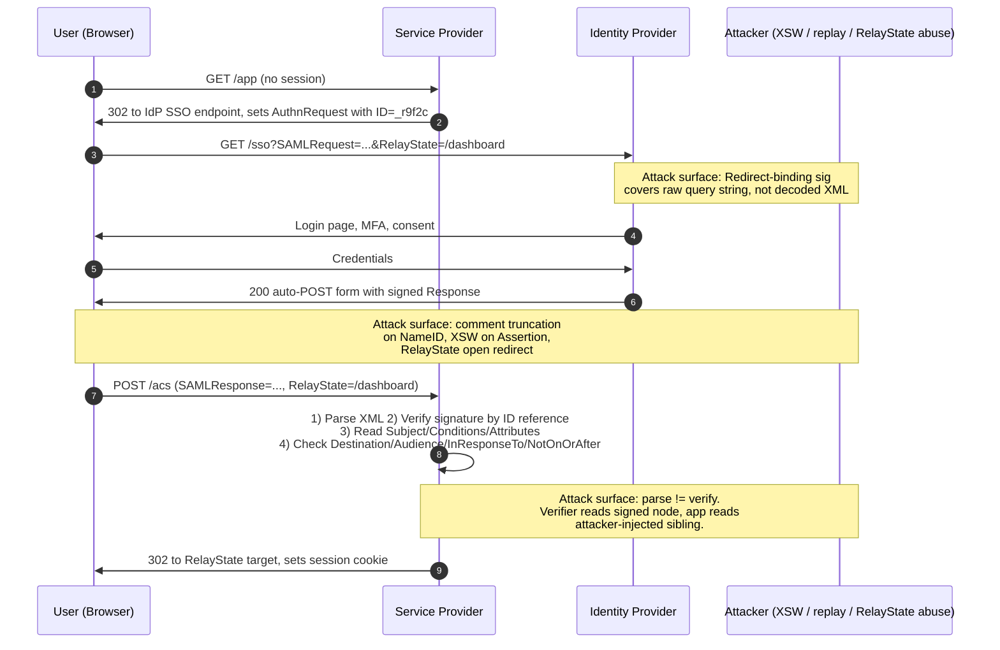

# SAML 2.0

> SAML 2.0 authentication rests on a single load-bearing claim: the Identity Provider signed *this specific Subject inside this specific Assertion, and the Service Provider validated that signature over the exact bytes it then trusted.* Every deep SAML bug is a break in that chain. The XML data model lets attackers wrap, comment, or re-parent signed elements so the signature verifier and the business-logic reader look at different bytes. Add optional signatures (Response vs Assertion), optional Audience and InResponseTo checks, and multiple bindings that deliver assertions through the browser or a back-channel, and the "authenticated" identity often turns out to be whichever `NameID` the attacker last pasted into a `<Subject>`. SAML is not broken by cryptanalysis, it is broken by parse/verify skew. Design and review as if the signature verifier and the identity extractor are two different people who must agree on which node they read.

## Quick reference

Signed SAML Response over HTTP-POST (elided, whitespace inserted for readability):

```xml
<samlp:Response
    xmlns:samlp="urn:oasis:names:tc:SAML:2.0:protocol"
    xmlns:saml="urn:oasis:names:tc:SAML:2.0:assertion"
    ID="_a75adf55-01d7-40cc-929f-dbd8372ebdfc"
    Version="2.0"
    IssueInstant="2026-08-08T14:03:00Z"
    Destination="https://sp.example.com/acs"
    InResponseTo="_reqid_9f2c">
  <saml:Issuer>https://idp.example.com/</saml:Issuer>
  <samlp:Status><samlp:StatusCode Value="urn:oasis:names:tc:SAML:2.0:status:Success"/></samlp:Status>
  <saml:Assertion ID="_assn_7c1b" Version="2.0" IssueInstant="2026-08-08T14:03:00Z">
    <saml:Issuer>https://idp.example.com/</saml:Issuer>
    <ds:Signature xmlns:ds="http://www.w3.org/2000/09/xmldsig#">
      <ds:SignedInfo>
        <ds:CanonicalizationMethod Algorithm="http://www.w3.org/2001/10/xml-exc-c14n#"/>
        <ds:SignatureMethod Algorithm="http://www.w3.org/2001/04/xmldsig-more#rsa-sha256"/>
        <ds:Reference URI="#_assn_7c1b">
          <ds:Transforms>
            <ds:Transform Algorithm="http://www.w3.org/2000/09/xmldsig#enveloped-signature"/>
            <ds:Transform Algorithm="http://www.w3.org/2001/10/xml-exc-c14n#"/>
          </ds:Transforms>
          <ds:DigestMethod Algorithm="http://www.w3.org/2001/04/xmlenc#sha256"/>
          <ds:DigestValue>7f4c...==</ds:DigestValue>
        </ds:Reference>
      </ds:SignedInfo>
      <ds:SignatureValue>b0e1...==</ds:SignatureValue>
      <ds:KeyInfo>...</ds:KeyInfo>
    </ds:Signature>
    <saml:Subject>
      <saml:NameID Format="urn:oasis:names:tc:SAML:1.1:nameid-format:emailAddress">
        alice@example.com
      </saml:NameID>
      <saml:SubjectConfirmation Method="urn:oasis:names:tc:SAML:2.0:cm:bearer">
        <saml:SubjectConfirmationData
            NotOnOrAfter="2026-08-08T14:08:00Z"
            Recipient="https://sp.example.com/acs"
            InResponseTo="_reqid_9f2c"/>
      </saml:SubjectConfirmation>
    </saml:Subject>
    <saml:Conditions NotBefore="2026-08-08T14:02:30Z" NotOnOrAfter="2026-08-08T14:08:00Z">
      <saml:AudienceRestriction>
        <saml:Audience>https://sp.example.com/</saml:Audience>
      </saml:AudienceRestriction>
    </saml:Conditions>
    <saml:AuthnStatement AuthnInstant="2026-08-08T14:03:00Z" SessionIndex="_sess_1a">
      <saml:AuthnContext>
        <saml:AuthnContextClassRef>
          urn:oasis:names:tc:SAML:2.0:ac:classes:PasswordProtectedTransport
        </saml:AuthnContextClassRef>
      </saml:AuthnContext>
    </saml:AuthnStatement>
    <saml:AttributeStatement>
      <saml:Attribute Name="groups">
        <saml:AttributeValue>engineering</saml:AttributeValue>
      </saml:Attribute>
    </saml:AttributeStatement>
  </saml:Assertion>
</samlp:Response>
```

| Invariant | Where enforced | How violated | Source |
|---|---|---|---|
| Signature verified over the *same* Assertion node whose Subject/Attributes the app reads | SP SAML library; ID-based `Reference URI` resolution using a filter that only accepts signed descendants | XML Signature Wrapping: attacker injects a second, unsigned Assertion the app reads while the verifier resolves the original signed ID elsewhere in the tree | SAML Core section 5, W3C XMLDSig, Somorovsky et al. USENIX 2012 |
| `NameID` text is a single Text node, canonicalized identity | SP: read the concatenated Text children after signature verification, reject if node has comment children or multiple Text nodes with intent to mislead | Comment truncation: `alice@example.com<!--x-->.evil.com` becomes `alice@example.com` after `getText()` on some parsers, while the signature covered the full string | CVE-2018-1000164, Duo Labs 2018 |
| `Destination`, `Recipient`, and `Audience` all equal this SP's ACS URL / EntityID | SP config; enforced before session creation | Skipped `AudienceRestriction` check accepts assertions minted for another SP; skipped `Recipient` check accepts assertions replayed to a different ACS URL | SAML Core 2.5.1.4, SAML Profiles 4.1.4.3 |
| `InResponseTo` matches a cached, unexpired AuthnRequest ID for this session | SP: request-cache keyed by RequestID with short TTL | Unsolicited IdP-initiated flow accepted for SP-initiated endpoints, enabling login-CSRF and cross-tenant assertion replay | SAML Profiles 4.1.4.3, OWASP SAML Cheat Sheet |
| `NotBefore` <= now <= `NotOnOrAfter` with tight clock skew (<=3 min) | SP: reject on skew violation | Missing or hour-wide skew allowlist enables assertion replay hours after theft | SAML Core 2.5.1.2 |
| Response *or* Assertion signed with a key bound to the IdP EntityID in trusted metadata | SP metadata store; XMLDSig `KeyInfo` cross-checked against pinned cert | Trusting `KeyInfo`-supplied cert without pinning ("`KeyInfo` as truth") accepts attacker-supplied certs; only signing Response but reading unsigned Assertion inside breaks the chain | SAML Metadata 2.4, XMLDSig 4.4 |
| HTTP-Redirect binding: signature computed over the URL-encoded `SAMLRequest`, `RelayState`, `SigAlg` parameters exactly as sent | SP/IdP: sign and verify the raw octets, not the parsed XML | Verifying the decoded XML instead of the signed query string allows swap of `RelayState` or parameter re-ordering | SAML Bindings 3.4.4.1 |
| `RelayState` treated as opaque, length-limited, non-authoritative | SP: enforce allowlist for post-login redirects | Using `RelayState` as an open redirect target or trusting it for identity is a common ACS-side vulnerability | SAML Bindings 3.1.2.5 |

## How it works

SAML 2.0 is an OASIS standard that expresses authentication and attribute claims as signed XML documents (Assertions) exchanged between an Identity Provider (IdP) and a Service Provider (SP). The SP delegates login to the IdP, receives an Assertion whose `<saml:Subject>` names the user, verifies the XML signature against a public key bound to the IdP in *trusted metadata*, and then creates a local session. See [67-sso.md](./67-sso.md) for the broader SSO context and [17-cryptographic-failures.md](./17-cryptographic-failures.md) for XMLDSig failure modes at the crypto layer.

### Entities and metadata

An `EntityDescriptor` XML document declares who the party is (its `entityID`, usually a URL), what role it plays (`SPSSODescriptor` or `IDPSSODescriptor`), the signing and encryption certs, and the endpoints (`AssertionConsumerService`, `SingleSignOnService`, `SingleLogoutService`) with their bindings. Federation metadata SHOULD be signed by a federation authority (`ds:Signature` at the `EntityDescriptor` or `EntitiesDescriptor` level) so SPs can pin IdP keys through a rotation. Manual metadata upload without signature verification is trust-on-first-use, and it is the point at which most enterprise SAML deployments fail to rotate keys safely.

### Bindings

A binding is how the XML gets from one endpoint to another. Four matter:

- **HTTP-POST**: base64-encoded XML in a hidden form field, submitted by an auto-posting HTML page. Signature is over the XML itself. Used for `AuthnRequest` (SP to IdP) and `Response` (IdP to SP).
- **HTTP-Redirect**: DEFLATE-compressed then base64-URL-encoded XML in a query string, with an optional detached signature over the concatenated `SAMLRequest=...&RelayState=...&SigAlg=...` octets. Signature is over the query string, not the reconstructed XML.
- **HTTP-Artifact**: the browser carries a short opaque handle; the SP retrieves the real Assertion over a back-channel SOAP call to the IdP `ArtifactResolutionService`. Confidentiality shifts from the browser to server-to-server TLS.
- **SOAP**: back-channel for artifact resolve, attribute queries, and Single Logout.

### The handshake (SP-initiated Web Browser SSO)



The whole security argument reduces to step 6, and inside step 6, to the identity of the XML node that both the signature verifier and the identity extractor agree to read.

### Signature scope: Response vs Assertion

`<samlp:Response>` can be signed, `<saml:Assertion>` can be signed, or both. SAML Core allows either. SPs that only require "Response is signed" and then re-parse the Assertion inside are vulnerable to wrapping. SPs that only require "Assertion is signed" but read `Status` or `Destination` from an unsigned Response are vulnerable to status/destination confusion. The safe rule is: *sign the Assertion, and after verification, discard the surrounding Response envelope for everything except `InResponseTo` and `Destination` which you re-check against the signed Assertion's `SubjectConfirmationData`.*

### Assertion encryption

`<saml:EncryptedAssertion>` uses XML Encryption (hybrid RSA-OAEP or ECDH-ES key transport wrapping AES-GCM or AES-CBC content). Historically vulnerable to adaptive chosen-ciphertext attacks against XML Encryption CBC modes (Jager and Somorovsky, CCS 2011)<sup>[[11]](#ref11)</sup>. Modern SAML stacks default to AES-GCM. Encryption does not replace signing: an encrypted-but-unsigned Assertion is a confidential message from anyone with the SP's public key.

## Attack techniques

### 1. XML Signature Wrapping (XSW1 through XSW8)

The XMLDSig `Reference URI="#_assn_7c1b"` says "the signature covers whichever element in this document has `ID="_assn_7c1b"`." Most XML parsers walk the tree and return the first match. The security library and the business-logic reader may resolve that ID differently, or the attacker may add a second element with the same ID in a location the verifier reaches first while the reader reaches the injected one. The eight XSW variants enumerated in the USENIX 2012 breakdown differ in where the wrapper element is placed (before Signature, inside Signature, inside Extensions, inside a wrapped Object, etc.) and in whether the attacker copies the original signed Assertion into an inert location while placing a forged Assertion where the app looks<sup>[[1]](#ref1)</sup>.

A minimal XSW: keep the original signed Assertion as a child of an `<Extensions>` element (still reachable by ID from the Reference) and add a second Assertion under `<Response>` with a different ID but with the attacker's `NameID`. The signature validates against the original. The SP's `getAssertion()` returns the second one. Payload sketch: two `<saml:Assertion>` elements in the tree, one signed (moved), one attacker-crafted with `<saml:NameID>admin@target.com</saml:NameID>`.

Black-box confirmation: feed the SP a doubled-Assertion response and watch for a session as the second NameID. Open-source tools like SAML Raider (Burp extension) automate all eight variants<sup>[[13]](#ref13)</sup>. Blind confirmation when responses are opaque: the login redirect target after ACS or the presence of session cookies for a NameID the attacker controls in the wrapper.

Escalation is direct: any user, including tenant-admin or cross-tenant identities, since the SP trusts the wrapper's Subject. In multi-tenant SPs keyed on a single IdP entityID (common in older deployments before per-tenant issuer pinning), XSW yields cross-tenant takeover. The fix is not "check the signature harder", it is to resolve identity by walking down from `SignedInfo/Reference` after verification and reading Subject/Conditions/Attributes from *that same node*.

### 2. Comment truncation on NameID (CVE-2018-1000164 class)

Many XML libraries parse `<saml:NameID>alice@example.com<!--x-->.evil.com</saml:NameID>` into a `NameID` element with three children: Text("alice@example.com"), Comment("x"), Text(".evil.com"). The XML C14N transform used by XMLDSig includes comments only if `#WithComments` is selected; the common `xml-exc-c14n#` (without `-with-comments`) drops them, so the signature covers the concatenated text without the comment. Then the SP calls a helper like `element.firstChild.nodeValue` or `element.text` and gets `alice@example.com`, dropping the second Text node<sup>[[2]](#ref2)</sup><sup>[[3]](#ref3)</sup>.

The result: an attacker who controls `admin@example.com<!--x-->.attacker.com` at their own IdP can log in as `admin@example.com` at the SP. This landed in python-saml, ruby-saml, OneLogin's SAML toolkit for Java and PHP, Duo Network Gateway, and derivative products (Uber, GitHub Enterprise, and others were reported)<sup>[[12]](#ref12)</sup>. Black-box confirmation: register a benign account whose identifier contains an HTML comment surrounding a boundary character, log in, and observe whether the SP resolves the identity to the truncated prefix. If the SP echoes the resolved username in the UI or in an OAuth handoff, the answer is visible; otherwise, blindly observe access to another user's resource.

Escalation depends on where the identity gets used. If the SP maps NameID to an internal user record on first login (JIT provisioning), the attacker fully impersonates the truncated user. If the SP requires the account to pre-exist, the attack only works against usernames the attacker can guess and where their own identifier can be extended.

### 3. Signature exclusion / "was it actually signed?"

Some SP libraries verified the signature only if a `<ds:Signature>` element was present, and treated its absence as "no signature to check." An attacker replaying an old assertion, or minting one against a stolen/weak IdP cert, can strip the signature entirely and the SP accepts it. The bug is a policy check, not a crypto check: the SP must require "there IS a signed element covering the data I will read", not "if there is a signature, verify it." Historical instances appear repeatedly in Shibboleth advisories about optional-signature handling<sup>[[14]](#ref14)</sup>.

Payload: strip the `<ds:Signature>` inside `<saml:Assertion>` (and, if the Response was signed, strip that too), send the naked XML. Black-box: send an unsigned assertion with a plausible Subject and observe login. Escalation: any user impersonation, since there is no bound key material at all.

### 4. Canonicalization ambiguity and namespace injection

XMLDSig canonicalizes the referenced subtree before hashing. Exclusive C14N (`xml-exc-c14n#`) drops "unused" namespace declarations. Attackers who inject a namespace declaration on an ancestor of the signed element can cause the verifier's canonical form to match the original digest while the parsed element the app reads has different qualified-name semantics<sup>[[9]](#ref9)</sup>. Related: `xmlns:saml` collision where two elements with the same local name resolve to different namespaces on the read path.

Payload style: wrap the signed Assertion in a parent element that redeclares `xmlns:saml` to a different URI, so that `getElementsByTagNameNS("urn:oasis:names:tc:SAML:2.0:assertion", "Assertion")` returns the attacker's node. Black-box confirmation: SAML Raider's C14N-manipulation modes flag whether the SP is sensitive. Escalation matches XSW: full identity takeover if a wrapped Assertion is read.

### 5. Replay via missing InResponseTo / NotOnOrAfter

If the SP does not cache a per-request `RequestID` and enforce `InResponseTo` on the Response, an attacker who captures a valid Assertion (via XSS on the SP, a shared corporate proxy, a browser extension, or a compromised endpoint) can replay it minutes or hours later. If `NotOnOrAfter` skew is generous or missing, the window is longer. If `SubjectConfirmationData/@Recipient` is not checked, the assertion may be replayed to a *different* SP that trusts the same IdP<sup>[[6]](#ref6)</sup>.

Payload: capture a real assertion, resubmit to `/acs`. Blind confirmation: watch for a session cookie tied to the victim's NameID. Escalation: full impersonation for the assertion window. Chain with token-theft primitives ([13-jwt.md](./13-jwt.md) covers the bearer-token replay class in general).

### 6. IdP-initiated unsolicited assertion and login-CSRF

The IdP-initiated profile ("go to https://idp/apps/X and get sent to the SP with an unsolicited signed Assertion") is by design missing `InResponseTo` since there was no request. An attacker who can trigger the victim's browser to POST an unsolicited assertion for the *attacker's* account at the SP logs the victim into the attacker's account. If the SP later stores anything the victim uploads (files, notes, payment methods), the attacker retrieves it by logging back into their own account.

Payload: attacker logs into their own IdP session, captures the auto-post form, then hosts a page that auto-submits the same form when the victim visits. Black-box confirmation: attempt the cross-user account confusion flow in a test tenant. Escalation is data theft and, on SPs that trust the SSO session for OAuth grants, downstream token issuance to attacker-controlled apps. Mitigation is to disallow unsolicited assertions on endpoints not explicitly configured for the IdP-initiated profile, or to require `RelayState` binding to a nonce set at session start<sup>[[10]](#ref10)</sup>.

### 7. ACS URL confusion and RelayState abuse

The `AssertionConsumerServiceURL` in the AuthnRequest tells the IdP where to POST the response. Many IdPs allow the SP to specify this per-request; if the IdP does not check the URL against the SP metadata's registered ACS list, an attacker who can send an AuthnRequest with a malicious `AssertionConsumerServiceURL` receives the victim's assertion at their own endpoint. This is the SAML analogue of `redirect_uri` abuse in [14-oauth-oidc.md](./14-oauth-oidc.md).

`RelayState` is defined as opaque and up to 80 bytes. SPs that use it as the post-login redirect target without an allowlist create an open redirect, and if they also expose CSRF tokens or reflect it into HTML, they add XSS<sup>[[5]](#ref5)</sup>. Payload: `RelayState=https://evil.example.com/harvest?...`; black-box confirmation is trivial. Escalation includes phishing (login flow that leaves the user on an attacker page) and combined with XSW, session hijacking through a page that quietly steals the fresh session cookie.

### 8. HTTP-Redirect binding: sign the query string, not the XML

The Redirect binding computes the signature over the exact octets `SAMLRequest=...&RelayState=...&SigAlg=...` after URL-encoding but before HTTP transmission. Libraries that decompress the XML, canonicalize it, and re-sign the DOM produce signatures that do not match what an interoperating peer computes. Libraries that *verify* by re-encoding the parsed XML rather than by canonicalizing the received octets can be fooled by parameter reordering, alternate encodings of the same characters, or by receiving `RelayState` outside the signature and then trusting it<sup>[[5]](#ref5)</sup>.

Payload: swap `RelayState` after the IdP signs the request but before the SP receives it (attacker controls a middlebox or crafts links). Black-box confirmation: send altered query strings with a valid signature and check for acceptance. Escalation is redirect-target substitution and, on IdPs that use the signed AuthnRequest to bind session state, request smuggling into the auth flow.

### 9. Metadata TOFU and stale key rotation

The signature key that matters is the one the SP has pinned as belonging to the IdP entityID. If metadata was uploaded once, manually, and never re-verified, IdP key rotation either breaks the integration or, worse, tempts the operator to accept a new cert from an email attachment. Federation metadata signed by a well-known federation authority (InCommon, UK Access Management Federation, eduGAIN) breaks that pattern by giving the SP a way to accept rotated keys automatically while still verifying signatures over metadata<sup>[[7]](#ref7)</sup>.

Payload: attacker with mail-in-the-middle sends the SP admin a "please update our SSO cert" ticket, admin uploads. Now the attacker's key is trusted for that entityID. Blind confirmation of exposure: check whether the SP's metadata store shows a `validUntil` in the past or a `KeyDescriptor` uploaded without a matching signed metadata blob. Escalation: full IdP impersonation for that SP.

## Defense

### Real fix

1. **Verify signatures by walking down from `SignedInfo/Reference` and reading identity from *that same node*.** After the crypto step returns "signature valid over element with ID=X", find element X, and read `Subject`, `Conditions`, `AttributeStatement` only from within X. Do not use `getElementsByTagNameNS("Assertion")` on the whole document. This defeats XSW1-8 by construction because injected siblings live outside the signed subtree. Common wrong implementation: verify signature, then re-parse the document top-down for "the first Assertion." Source: SAML Core 5; Somorovsky et al., USENIX 2012<sup>[[1]](#ref1)</sup><sup>[[4]](#ref4)</sup>.
2. **Read `NameID` as concatenated Text-only children, or reject any Assertion where security-relevant elements contain non-Text child nodes.** Comment truncation only works when the parser silently drops comments and the reader only takes `firstChild`. Concatenating all Text children (or rejecting when comments appear inside Subject/NameID/Attribute values) closes CVE-2018-1000164 across every affected toolkit<sup>[[2]](#ref2)</sup><sup>[[3]](#ref3)</sup>. Common wrong implementation: reading `nameid.text` where the framework returns only the first Text node.
3. **Require signatures explicitly on the Assertion, not "signature present anywhere."** The SP config must state "the Assertion MUST be signed by the IdP whose entityID equals the Issuer, and I will not accept a Response whose Assertion carries no `<ds:Signature>` under it or, if only the Response is signed, whose Reference does not enclose the Assertion." Fail closed if the signed element is not the identity-bearing one. Common wrong implementation: `if (has_signature) verify()` treats absence as pass<sup>[[8]](#ref8)</sup>.
4. **Enforce Destination, Recipient, Audience, InResponseTo, NotBefore/NotOnOrAfter as hard checks, with clock skew capped at 3 minutes.** Missing `AudienceRestriction` matching this SP's entityID is the single most common SAML deployment bug. Cache issued `RequestID`s in a short-TTL store keyed by session and require `InResponseTo` to match. Common wrong implementation: skipping `InResponseTo` because the code path supports IdP-initiated flows for *some* apps; the correct pattern is a per-endpoint switch. Source: SAML Core 2.5.1; SAML Profiles 4.1.4.3<sup>[[4]](#ref4)</sup><sup>[[6]](#ref6)</sup>.
5. **Pin IdP signing keys through signed federation metadata or explicit cert-pin per entityID, refreshed on a schedule that respects `validUntil`.** Do not trust `<ds:KeyInfo>` in the assertion to name a key. The KeyInfo tells you which pinned key to consult, not which key to trust. Common wrong implementation: extracting the cert from `KeyInfo`, checking that it chains to a public CA, and calling it trusted; the SP is not doing web PKI on IdP signing certs. Source: SAML Metadata 2.4; XMLDSig 4.4<sup>[[7]](#ref7)</sup><sup>[[8]](#ref8)</sup>.
6. **Enforce ACS URL allowlist at the IdP.** Every registered SP has a fixed set of `AssertionConsumerService` locations in its metadata; the IdP MUST reject AuthnRequests whose `AssertionConsumerServiceURL` is not in that set, even when the request is signed. This mirrors the OAuth `redirect_uri` rule; see [14-oauth-oidc.md](./14-oauth-oidc.md).
7. **Treat `RelayState` as opaque, length-limited (<=80 bytes per spec), and non-authoritative.** Store the actual post-login target server-side keyed by an opaque nonce that goes in `RelayState`, or match `RelayState` against an allowlist of relative paths. Never redirect to an absolute URL supplied via `RelayState`. Source: SAML Bindings 3.1.2.5<sup>[[5]](#ref5)</sup>.

### Defense in depth

1. **Disable the HTTP-Redirect binding for `<samlp:Response>` and prefer HTTP-POST for identity-bearing messages.** Redirect-signature-over-octets is subtly correct across libraries; POST-signature-over-XML has one canonical form and a much smaller attack surface. Redirect stays useful for AuthnRequest.
2. **Disable IdP-initiated / unsolicited assertions unless a specific SP endpoint needs it.** Require `InResponseTo` for every request-response pair. On the endpoints that must accept unsolicited assertions, bind them to a browser-set nonce cookie so the assertion cannot be injected cross-user.
3. **Reject XML with DOCTYPE, external entities, or processing instructions before signature verification.** XXE and entity expansion combine with SAML parsing; see [15-injection.md](./15-injection.md). Configure the XML parser with `disallow-doctype-decl` true, `external-general-entities` false, `external-parameter-entities` false, `load-external-dtd` false.
4. **Encrypt assertions when they cross untrusted networks, using AES-GCM, and pin the SP's encryption key separately from the signing key.** Encryption is not a substitute for signature checks; see [17-cryptographic-failures.md](./17-cryptographic-failures.md) for XML Encryption CBC oracle history<sup>[[11]](#ref11)</sup>.
5. **Log the DigestValue of each accepted Assertion and detect duplicates within the replay window.** Even with `InResponseTo` and `NotOnOrAfter`, a per-assertion single-use cache is cheap insurance against clock-skew replay.
6. **Rotate IdP signing keys on a schedule and drill the rotation.** A rotation the operators cannot execute becomes an outage that becomes a policy exception that becomes a permanently-installed attacker key<sup>[[15]](#ref15)</sup>.
7. **Prefer OIDC for new integrations.** SAML remains dominant in enterprise SSO but OIDC's compact JWT ([13-jwt.md](./13-jwt.md), [14-oauth-oidc.md](./14-oauth-oidc.md)) eliminates the XML-signature-scope class entirely.

## Detection and telemetry

Log, at each ACS accept: `Issuer`, `Assertion@ID`, `Assertion` signature DigestValue, `NameID` value, `SessionIndex`, `AuthnInstant`, `InResponseTo`, `Destination`, and the resolved SP entityID. Detect the following:

- Two Assertions with the same DigestValue accepted within the replay window: cache hit or coordinated replay.
- Assertion whose `Issuer` matches an IdP but whose signing cert fingerprint does not match the pinned metadata cert: alert immediately, this is either rotation drift or an attempted swap.
- `NameID` values containing `<!--`, U+FEFF, or non-Text child node markers surviving to the log line: comment-truncation probe.
- Multiple `<saml:Assertion>` elements observed in a single Response: XSW probe or non-standard IdP.
- `InResponseTo` referring to a `RequestID` that is missing, expired, or already consumed: replay.
- `AudienceRestriction/Audience` not matching this SP's entityID: misdirected assertion, possibly cross-SP replay.
- `AssertionConsumerServiceURL` on incoming AuthnRequest (at IdP side) not in the SP's registered set: ACS URL confusion probe.

For blue-team synthesis, run SAML Raider against a staging SP quarterly and confirm every XSW variant is rejected. A production SP that passes XSW3 today likely regresses within a year on a library upgrade.

## Interviewer probes

**Q: Walk me through XML Signature Wrapping and why "the signature validates" is not a security property.**

Mid: The verifier and the reader disagree about which element carries the Subject. The signature covers the original Assertion, the app reads a copy the attacker injected elsewhere.

Principal: XMLDSig binds a digest to an element referenced by ID, resolved by document traversal. The verifier locates the referenced ID, canonicalizes the subtree, checks the digest, and returns true. The application then re-scans the document for "the Assertion" using an XPath or DOM query that is orthogonal to the signature machinery. If those two queries return different nodes, the security property collapses. The correct posture is that the verify call returns not a boolean but a *reference* to the exact node that was signed, and every downstream identity read must be a descendant of that node. Somorovsky et al. enumerated eight placements (before, inside, after Signature; inside Extensions; inside a wrapped Object; and combinations); the family generalizes to any XML dialect with ID-based Reference resolution, which is why the same class hits SOAP-Sec.

**Q: How does comment truncation on NameID actually work?**

Mid: A comment inside NameID splits its Text content; the XMLDSig canonicalization drops comments so the signature covers the concatenated string, and the parser returns only the first Text child.

Principal: Exclusive canonical XML without-comments (`xml-exc-c14n#`) is the default XMLDSig C14N. It removes comment nodes before hashing, so `alice@example.com<!--x-->.evil.com` hashes as `alice@example.com.evil.com` if the reader took full text, or as `alice@example.com` if the reader took only `firstChild`. The bug is that Java's `Element.getTextContent()` returns the full concatenation while `Element.getFirstChild().getNodeValue()` returns only the first Text node, and library authors mixed the two. Python's `lxml.etree.Element.text` returns text up to the first child element or comment, likewise truncating. python-saml, ruby-saml, and OneLogin's Java toolkit all shipped this bug; Duo Labs reported it in early 2018 as CVE-2018-1000164 and adjacent CVEs. The fix is to require the identity-bearing element to have exactly one Text child and no Comment or Element children, or to always use full concatenation.

**Q: Response-signed vs Assertion-signed, which do you require and why?**

Mid: Assertion-signed. If only the Response is signed, an attacker can wrap or inject Assertions the signature never covered.

Principal: SAML Core allows either or both. The right rule is: require the Assertion to be signed, verify the signature, and identify the Subject from the descendants of the signed Assertion element. If the deployment must accept Response-only signing (some legacy IdPs), require that the `Reference` explicitly covers the Assertion subtree and reject any Response whose signed content does not include an Assertion. The subtle failure is a Response signature over the *Response* element while the reader reads an Assertion moved into an unsigned scope. Also cross-check `InResponseTo` and `Destination` against the signed content, not the outer envelope, when there is ambiguity.

**Q: What does the HTTP-Redirect binding sign, and how do implementations get it wrong?**

Mid: It signs the URL-encoded query string `SAMLRequest=...&RelayState=...&SigAlg=...`, not the decoded XML.

Principal: The spec (SAML Bindings 3.4.4.1) is precise: DEFLATE the XML, base64-URL-encode, place in the query string, and sign the octets of `SAMLRequest`, optional `RelayState`, and `SigAlg` concatenated with `&` in a specific order. The signature travels as a separate `Signature` parameter. Implementations get it wrong three ways: they sign the decoded and reserialized XML (interop-breaks and creates verify-side ambiguity), they receive `RelayState` outside the signature and then trust it for identity or authorization, and they verify by reserializing rather than by using the raw received octets. That last one lets attackers reorder parameters or use alternate percent-encodings to produce a query string that verifies against a signature computed over different octets.

**Q: Why does IdP-initiated SSO make CSRF worse?**

Mid: There is no AuthnRequest, so `InResponseTo` cannot bind the assertion to the browser session that initiated login. An attacker can auto-POST an unsolicited assertion for their own account and log the victim in as attacker.

Principal: Web Browser SSO's SP-initiated flow uses `InResponseTo` as the CSRF nonce. IdP-initiated flow removes it by design. The consequence is a login-CSRF primitive: the victim visits attacker.com, an auto-posted form delivers a valid assertion for attacker@attacker-tenant, and the victim's browser gains a session as attacker. Anything the victim uploads or transacts is now readable by attacker, who logs into their own account. Mitigation is either to disallow the unsolicited profile entirely, to require the SP-initiated flow for state-changing operations, or to bind the assertion to a browser-side nonce set by the SP before the flow began. Note this is distinct from OAuth's login-CSRF, which uses `state` for exactly the same purpose.

**Q: You are reviewing a SAML integration. Which five checks would you run first?**

Mid: (1) Is the Assertion signed? (2) Is the signing key pinned in metadata? (3) Are Audience, Destination, and InResponseTo checked? (4) Does the SP reject wrapped assertions? (5) Does the SP disallow XXE and DOCTYPE in incoming XML?

Principal: Same five, with added specificity: run SAML Raider or a homemade XSW battery to confirm the SP rejects all eight variants; probe NameID with an embedded HTML comment to check truncation; check whether `Recipient` in `SubjectConfirmationData` is validated against this exact ACS URL to catch cross-SP replay; check whether unsolicited assertions are accepted on the endpoint under review; and read the SP's XML parser configuration to confirm entity resolution and DTD loading are off. Bonus: verify that the SP treats `RelayState` as opaque by injecting an absolute URL and observing the redirect.

**Q: When would you prefer HTTP-Artifact over HTTP-POST?**

Mid: When you do not want the Assertion to touch the browser, so its contents cannot be inspected or replayed by browser-side code.

Principal: Artifact keeps the Assertion on the back-channel: the browser only carries a short opaque handle, and the SP resolves it via SOAP to the IdP's `ArtifactResolutionService`. Benefits: confidentiality of PII in the Assertion (attribute statements) without needing XML Encryption, resistance to browser-based Assertion theft (XSS on the SP, malicious extensions), and simpler audit because the SP-IdP call is server-to-server. Costs: latency, tight IdP availability coupling, and the SOAP endpoint becomes an attractive target for artifact-guessing (mitigated by short-TTL, single-use, cryptographically random artifact IDs). For high-assurance federations, Artifact plus mutual-TLS on the ArtifactResolutionService is a reasonable default.

**Q: Metadata was uploaded once, manually. What is the next thing you fix?**

Mid: Move to signed federation metadata or, at minimum, cert-pin with an out-of-band verification and a rotation runbook.

Principal: Manual, unsigned metadata is trust-on-first-use with no rotation story. Two remediations: subscribe to a federation whose metadata aggregator signs the `EntitiesDescriptor` (InCommon, eduGAIN, national federations), so key rotation happens through a signed metadata refresh; or, for private federations, publish signed per-entity metadata at a stable URL and have the SP refresh it, verifying the signature against a bootstrap key. Either way, the operator's inbox is not a trust anchor. Detect the failure mode by looking for `validUntil` in the past or `cacheDuration` unset, and by counting the number of distinct KeyDescriptor certs that have been present over the last twelve months.

## Sources

<a id="ref1"></a>[1] Somorovsky, Mayer, Schwenk, Kampmann, Jensen. On Breaking SAML: Be Whoever You Want to Be. USENIX Security Symposium 2012. https://www.usenix.org/system/files/conference/usenixsecurity12/sec12-final91.pdf

<a id="ref2"></a>[2] Duo Labs. Duo Finds SAML Vulnerabilities Affecting Multiple Implementations. February 2018. https://duo.com/blog/duo-finds-saml-vulnerabilities-affecting-multiple-implementations

<a id="ref3"></a>[3] MITRE. CVE-2018-1000164: python-saml before 2.4.0 uses XPath that is vulnerable to XML comment handling. https://cve.mitre.org/cgi-bin/cvename.cgi?name=CVE-2018-1000164

<a id="ref4"></a>[4] OASIS. Assertions and Protocols for the OASIS Security Assertion Markup Language (SAML) V2.0. saml-core-2.0-os. March 2005. https://docs.oasis-open.org/security/saml/v2.0/saml-core-2.0-os.pdf

<a id="ref5"></a>[5] OASIS. Bindings for the OASIS Security Assertion Markup Language (SAML) V2.0. saml-bindings-2.0-os. March 2005. https://docs.oasis-open.org/security/saml/v2.0/saml-bindings-2.0-os.pdf

<a id="ref6"></a>[6] OASIS. Profiles for the OASIS Security Assertion Markup Language (SAML) V2.0. saml-profiles-2.0-os. March 2005. https://docs.oasis-open.org/security/saml/v2.0/saml-profiles-2.0-os.pdf

<a id="ref7"></a>[7] OASIS. Metadata for the OASIS Security Assertion Markup Language (SAML) V2.0. saml-metadata-2.0-os. March 2005. https://docs.oasis-open.org/security/saml/v2.0/saml-metadata-2.0-os.pdf

<a id="ref8"></a>[8] W3C. XML Signature Syntax and Processing Version 1.1. Recommendation. April 2013. https://www.w3.org/TR/xmldsig-core1/

<a id="ref9"></a>[9] W3C. Exclusive XML Canonicalization Version 1.0. Recommendation. July 2002. https://www.w3.org/TR/xml-exc-c14n/

<a id="ref10"></a>[10] OWASP. SAML Security Cheat Sheet. https://cheatsheetseries.owasp.org/cheatsheets/SAML_Security_Cheat_Sheet.html

<a id="ref11"></a>[11] Jager, Somorovsky. How to Break XML Encryption. ACM CCS 2011. https://dl.acm.org/doi/10.1145/2046707.2046756

<a id="ref12"></a>[12] MITRE. CVE-2017-11427: OneLogin ruby-saml XML canonicalization / comment-handling authentication bypass. https://cve.mitre.org/cgi-bin/cvename.cgi?name=CVE-2017-11427

<a id="ref13"></a>[13] SAML Raider Burp Suite extension. https://github.com/CompassSecurity/SAMLRaider

<a id="ref14"></a>[14] Shibboleth Consortium. Security Advisories. https://shibboleth.net/community/advisories/

<a id="ref15"></a>[15] NIST SP 800-63C. Digital Identity Guidelines: Federation and Assertions. https://csrc.nist.gov/publications/detail/sp/800-63c/final
