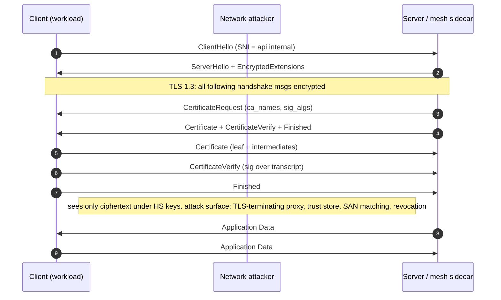

# mTLS and Client-Certificate Authentication

> Mutual TLS binds a request to a cryptographic identity by making the client prove possession of a private key during the handshake, then the server pins the peer certificate's SAN to an authorization decision. The security property is not "TLS was mutual", it is "the identity extracted from the verified peer chain matches the identity the application authorizes". Every real mTLS break lives in that gap: a chain that verifies but a subject that is not pinned, a proxy that terminates TLS and forwards an `X-SSL-Client-Cert` header without stripping it on the ingress path, a trust store that accepts any CA the OS ships, or a hostname/URI match that treats the CN as authoritative. TLS 1.3 moved the Certificate and CertificateVerify messages to after the server Finished, which changes what a network attacker can observe but not the application's obligation to check the identity. Treat the peer certificate as untrusted input until (a) the chain validates against a scoped trust store, (b) the leaf identity is matched against an allow-list, and (c) revocation freshness is bounded.

## Quick reference

```
# TLS 1.3 mutual-auth flow (RFC 8446 §4.4, §4.3.2)
Client                                            Server
------                                            ------
ClientHello                     ------->
                                                  ServerHello
                                                  {EncryptedExtensions}
                                                  {CertificateRequest}     <-- server asks for client auth
                                                  {Certificate}            <-- server cert
                                                  {CertificateVerify}
                                                  {Finished}
                                <-------          [Application Data*]
{Certificate}                                                              <-- client leaf + chain
{CertificateVerify}                                                        <-- signature over transcript with client key
{Finished}                      ------->
[Application Data]              <------->         [Application Data]

# Client Certificate message (parsed)
Certificate:
  Data:
    Version: 3 (0x2)
    Serial Number: 03:1a:...
    Signature Algorithm: ecdsa-with-SHA256
    Issuer: CN=Corp Intermediate CA, O=Corp, C=US
    Validity: Not Before Jan 1 2026, Not After Jan 2 2026     <-- 24h short-lived
    Subject: CN=payments-worker-7f, OU=svc
    Subject Public Key Info: id-ecPublicKey P-256
    X509v3 extensions:
      X509v3 Key Usage: critical, Digital Signature
      X509v3 Extended Key Usage: TLS Web Client Authentication
      X509v3 Subject Alternative Name: critical
          URI:spiffe://corp.example/ns/prod/sa/payments-worker
      X509v3 Basic Constraints: critical, CA:FALSE
      X509v3 Authority Key Identifier: keyid:...
```

| Invariant | Where enforced | How violated | Source |
|---|---|---|---|
| Client chain validates to a scoped trust anchor for this listener, not the OS bundle | TLS library `verify_peer` + `ca_file` scoped to workload CA | Reusing the public web PKI trust store for mTLS lets any WebPKI CA mint a valid client | RFC 8446 §4.4.2.4; RFC 5280 §6 |
| CertificateVerify signature covers the handshake transcript with the leaf's public key | TLS stack (openssl, rustls, boringssl) | Custom handshake code that skips the signature check accepts any leaf | RFC 8446 §4.4.3 |
| Identity is read from SAN, not CN; matching follows RFC 6125 rules | Application layer after handshake | Trusting `Subject.CN` grants access to a cert whose CN is spoofed but whose SAN is unrelated | RFC 6125 §6.4; CAB Forum BR |
| Revocation state is fresh (OCSP stapling with must-staple, CRL, or short TTL) | Server config + issuing CA policy | Long-lived certs with no OCSP check keep working after compromise | RFC 6960; RFC 7633 |
| Client-cert header from a terminating proxy is stripped at the edge on every request | Ingress proxy config (Envoy, nginx) | Attacker sends `X-SSL-Client-Cert: <forged>` from the Internet, upstream trusts it | Envoy HCM `xff_num_trusted_hops`; nginx `underscores_in_headers` |
| Only Secure Renegotiation (RFC 5746) is enabled; legacy renego is disabled | OpenSSL `SSL_OP_LEGACY_SERVER_CONNECT` off, `SSL_OP_NO_RENEGOTIATION` on for TLS 1.2 | Legacy renegotiation allows the plaintext-injection attack from CVE-2009-3555 | RFC 5746; CVE-2009-3555 |
| Name constraints on intermediate CAs bound the DNS/URI space they can sign | Issuing CA + relying-party path validation (RFC 5280 §4.2.1.10) | An intermediate meant for internal service certs signs a leaf for `login.example.com` | RFC 5280 §4.2.1.10 |
| CertificateRequest lists CAs the server accepts; client sends a chain rooted in one of them | Server TLS config | Missing `ca_names` hint causes clients to send irrelevant chains; server accepts by chain-verify alone | RFC 8446 §4.3.2 |

## How it works

Mutual TLS is one-way TLS plus a `CertificateRequest` message from the server, a `Certificate` message from the client carrying the client leaf plus any intermediates the server needs to build a chain, and a `CertificateVerify` signature from the client that proves possession of the corresponding private key. The signature is over the handshake transcript, so it binds the identity to this specific session (an attacker cannot replay a captured `CertificateVerify` into a new connection).

The application-visible outputs of a successful handshake are: a chain that validated against the server's configured trust store, a leaf certificate the application can inspect, and a session key. The mTLS security posture depends on what the application does with the leaf after the handshake. Chain validation only says "some CA in my trust store attests to this key holder". Authorization needs "this key holder is `spiffe://corp.example/ns/prod/sa/payments-worker` and that identity is allowed to call this endpoint".

### TLS 1.2 vs TLS 1.3 client-auth message flow

In TLS 1.2, client authentication happens inside the initial handshake and messages are visible on the wire in cleartext (the ChangeCipherSpec that switches to encrypted records comes later). An observer can therefore see the client Certificate and its SAN. In TLS 1.3, the handshake encrypts everything after ServerHello, and `CertificateRequest`, the client's `Certificate`, and `CertificateVerify` all travel under handshake-traffic keys. TLS 1.3 also allows post-handshake authentication where a server can request a client cert mid-connection after both parties agreed to it in the initial handshake (RFC 8446 §4.6.2).



### Chain validation and path building

Chain validation, per RFC 5280 §6, is not "does the leaf signature check against the issuer field's certificate". It is path building plus path validation. Path building takes the leaf and finds a chain to a configured trust anchor. Multiple chains may exist (a cross-signed intermediate can chain to two roots). Path validation then checks each edge: signature, validity window, basic constraints (`CA:TRUE` on intermediates, `CA:FALSE` on leaves), key usage, EKU (`clientAuth` for client certs), name constraints, and policy constraints.

Name constraints are the mTLS-specific control most often left off. An intermediate CA issued to a business unit can be constrained to `permittedSubtrees = { dNSName: .payments.corp.example, URI: spiffe://corp.example/ns/payments/ }`. Any leaf that presents a SAN outside that subtree fails path validation. Without the constraint, that intermediate can mint a leaf for any name the relying party trusts, including production admin endpoints.

### Identity extraction: SAN over CN, RFC 6125 matching

The `CN` field lives in the certificate subject and is legacy. RFC 6125 §6.4.4 requires clients to check `subjectAltName` first and only fall back to CN if SANs are absent. In modern PKI, especially service PKI and SPIFFE, CN carries no security meaning and SAN carries the identity. dNSName SANs match hostnames with RFC 6125 wildcard rules (leftmost-label only, no partial-label matching). URI SANs are used by SPIFFE to encode `spiffe://trust-domain/path` identities; matching is byte-exact after URI canonicalization (see [81-spiffe-spire.md](./81-spiffe-spire.md)). `otherName` with a custom OID is used for UPN-style identities (Kerberos, smart-card auth).

### Terminating proxy and the header trust boundary

The common production shape is: TLS from the client terminates at an edge proxy (Envoy, nginx, HAProxy, AWS ALB with mTLS, GCP TCP proxy). The proxy extracts the client cert or its identity, then forwards HTTP to the upstream over cleartext or a separate mesh mTLS session. The forwarded identity rides in a header: `X-SSL-Client-Cert`, `X-Forwarded-Client-Cert` (Envoy XFCC), `X-Client-Cert-DN`, or `X-SPIFFE-ID`. The upstream trusts this header. The security depends on the proxy stripping any client-supplied version of that header on ingress. If the ingress path accepts the header from the Internet, an unauthenticated attacker sets `X-SSL-Client-Cert` to a forged value and inherits the identity.

### Revocation

Revocation answers "has this cert been withdrawn before its notAfter". CRLs are point-in-time lists published by the CA; they scale poorly and lag. OCSP is a per-cert query; classical OCSP leaks the site the client is visiting to the CA and adds latency. OCSP stapling (RFC 6066 Certificate Status Request) has the server fetch the OCSP response and staple it into the TLS handshake, so the client trusts the freshness of the staple without contacting the CA. Must-staple (RFC 7633) marks a cert such that clients must reject a handshake that lacks a stapled OCSP response. In service PKI, the industry has largely abandoned OCSP in favor of short-lived certs (minutes to a day) where the TTL is the revocation window.

### Renegotiation

TLS 1.2 renegotiation lets either side start a new handshake inside an existing session, and one use was to switch to client-cert authentication for a specific resource. CVE-2009-3555 showed that pre-RFC-5746 renegotiation lets a MITM prefix attacker data to the victim's session because the two handshakes were not cryptographically linked. RFC 5746 adds the `renegotiation_info` extension binding the handshakes. TLS 1.3 removed renegotiation entirely and replaced it with post-handshake auth and KeyUpdate.

## Attack techniques

### 1. Trusting the OS trust store for the client-auth trust anchor

The failure is scoping. Server TLS config points `ca_file` at `/etc/ssl/certs/ca-certificates.crt`, the OS bundle used for outbound WebPKI verification. Any CA in that bundle (hundreds of them) can now mint a client certificate that passes chain validation. Combined with permissive identity checks, a certificate from a random public CA becomes a valid workload identity.

The payload is a certificate the attacker obtains through normal means: a Let's Encrypt cert for a domain they own, or a cert from any CA whose validation the attacker satisfies. The SAN says `example-attacker.com`; the application code that reads the SAN and matches it against an allow-list should reject this, but if the allow-list is only "chain is valid" or matches on a permissive regex, the request goes through.

Detection from black-box is verifying that a randomly obtained WebPKI client cert opens the mTLS listener at all, even if the request is later rejected on authorization; the handshake completing at all is the signal. Blind confirmation uses a monitoring endpoint that logs `SSL_CLIENT_S_DN` from the proxy; the attacker's own name appearing in logs after they present their own cert is definitive.

Escalation reaches whatever authorization surface trusts the identity extracted post-handshake. If any-mTLS-cert grants access to a diagnostic endpoint, that becomes an unauthenticated pivot to the internal network.<sup>[[1]](#ref1)</sup><sup>[[2]](#ref2)</sup>

### 2. CN-based identity extraction, spoofed via legacy cert

The server verifies the chain, then reads `Subject.CN` and uses it as the identity. An issuer that still populates CN for compatibility hands out a cert with `CN=payments-worker` for a service account that legitimately holds `spiffe://corp.example/ns/dev/sa/anyservice` in its URI SAN. The application ignores the SAN and authorizes as `payments-worker`.

The payload is any client cert from the trusted CA where CN is under the attacker's influence. In many enterprise CAs, CN is derived from the CSR without strict validation because CN is considered cosmetic. The attacker requests a cert for their own low-privilege service and puts the target identity in CN.

Black-box confirmation compares behavior under two certs from the same CA where CN differs but SAN is the same; if authorization outcome tracks CN and not SAN, extraction is CN-based. Blind confirmation uses an OOB canary: request a resource that logs which principal accessed it, then observe the CN in logs matches the crafted value.

Escalation gives the attacker any privilege bound to the impersonated CN. This is how internal admin routes get reached from a "dev" workload cert.<sup>[[3]](#ref3)</sup>

### 3. X-SSL-Client-Cert header injection at ingress

The application trusts a proxy-forwarded header for identity, and the ingress proxy does not strip that header from client-supplied input. An unauthenticated request from the Internet includes `X-Forwarded-Client-Cert: By=spiffe://corp.example/svc;Hash=abcd;Subject="CN=admin";URI=spiffe://corp.example/ns/prod/sa/admin`. The upstream service reads the URI, treats it as the peer identity, and authorizes as `admin`.

The payload is trivial once the vulnerability exists: craft the header in whatever format the upstream parses (Envoy XFCC, nginx `$ssl_client_cert` PEM in a header, custom `X-Client-Identity`). Some setups PEM-encode the whole client cert; the attacker generates their own cert with the desired SAN and inserts the PEM.

Black-box confirmation sends the header from the Internet against a resource whose access decision the response reveals (200 vs 403, or a Set-Cookie carrying a principal). Blind confirmation uses an OOB channel from a resource that only the impersonated identity can reach; a webhook fires only after authorization succeeds.

Escalation is full identity assumption for anything gated on the header. If the mesh admin API trusts XFCC without checking peer certificate at the TCP layer, this reaches control-plane operations.<sup>[[4]](#ref4)</sup><sup>[[5]](#ref5)</sup>

### 4. Missing name constraints on a delegated intermediate

A business unit CA is issued as an intermediate under the root and given free rein. It signs a leaf with SAN `URI:spiffe://corp.example/ns/prod/sa/vault` even though the intermediate is supposed to cover a different namespace. Path validation succeeds because there are no name constraints on the intermediate, and the relying party accepts the leaf identity.

The payload is a cert the attacker gets from a compromised or negligent intermediate, or by social engineering the internal CA operations team of a peer business unit. The internal PKI often has weak issuance controls because "we control the whole chain".

Black-box confirmation shows the vulnerable path by presenting a cert whose leaf identity is not naturally reachable through the presenting intermediate: same handshake succeeds, and the extracted identity is the crafted one. Blind confirmation, in a network where audit logs are centralized, watches for an identity assigned to one org unit being used from a workload not registered under that unit.

Escalation is cross-tenant impersonation inside an enterprise PKI. This is the CVE-2022-30115-style broad class where an intermediate abuses its unconstrained authority to sign in a name space it should not own.<sup>[[6]](#ref6)</sup>

### 5. Stale revocation, no OCSP stapling, long-lived cert

A leaf gets private-key compromise. The CA revokes it and updates the CRL. The server does not fetch the CRL (or the CRL Distribution Point is unreachable and the server soft-fails) and does not require OCSP stapling. Days later, the compromised key is still authenticating.

The payload is the stolen private key plus the still-valid cert. No new work at TLS layer; the attacker simply presents the pair and authenticates.

Black-box confirmation is hard from outside since the attacker holds the key. From an audit perspective, the confirmation is that the compromised cert continues to work past revocation time. Blind confirmation uses a canary: after intentional revocation, does the identity still open a listener? If yes, revocation is not enforced.

Escalation persists whatever access the identity had, gated only by the cert's `notAfter`. This is why service PKI has moved to short-lived certs where the TTL bounds compromise.<sup>[[7]](#ref7)</sup><sup>[[8]](#ref8)</sup>

### 6. TLS 1.2 renegotiation prefix injection (legacy)

Against a server that speaks TLS 1.2 with legacy (pre-RFC-5746) renegotiation enabled, a MITM opens a TLS session to the server, sends an attacker-chosen request prefix (for example `GET /admin\r\nX-Ignore: `), then triggers renegotiation and hands the renegotiated handshake to the victim. The server treats the concatenation of attacker-prefix and victim-request as a single request authenticated with the victim's client cert.

The payload is the crafted prefix plus a renegotiation trigger where the server asks for client auth on a protected resource; the victim's browser or client responds with a client cert.

Black-box confirmation checks `openssl s_client -connect host:443 -legacy_renegotiation` and observes whether the server allows unauthenticated renegotiation without RI extension; TLS 1.3 servers won't be affected.

Escalation is any state change the concatenated request accomplishes, run under the victim's identity. RFC 5746 secure renegotiation and TLS 1.3 (which drops renegotiation) close this.<sup>[[9]](#ref9)</sup><sup>[[10]](#ref10)</sup>

### 7. Accepting self-signed client cert

A misconfigured verify mode ("verify_client=optional" plus a permissive verify callback that returns success on any error) accepts a client cert that does not chain to any configured CA. The application still reads SAN and uses it as identity.

The payload is a locally generated self-signed cert with any SAN the attacker wants. `openssl req -x509 -subj "/CN=admin" -addext "subjectAltName=URI:spiffe://corp.example/ns/prod/sa/admin"` produces one in seconds.

Black-box confirmation is presenting a self-signed cert and observing the handshake completes and the identity is recognized upstream. Blind confirmation uses an OOB webhook that only the impersonated identity should be able to trigger.

Escalation is unauthenticated full impersonation of any workload identity the application recognizes. This is often a copy-paste mistake in TLS setup, and grep-able (`InsecureSkipVerify`, `verify_client optional_no_ca`).<sup>[[11]](#ref11)</sup>

## Defense

### Real fix

1. **Scoped trust anchors per listener.** Configure the mTLS listener with a dedicated CA bundle containing only the CA(s) authorized to issue workload identities for this trust domain. Do not point at the OS bundle. In Envoy, this is `validation_context.trusted_ca`. In nginx, `ssl_client_certificate`. In Go, `tls.Config.ClientCAs`. Wrong implementation is loading `/etc/ssl/certs/ca-certificates.crt`; a Let's Encrypt cert then becomes a valid workload cert.<sup>[[2]](#ref2)</sup>

2. **Identity from SAN, matched against an allow-list.** After the handshake, extract the leaf's SAN (URI for SPIFFE, dNSName for hostname-based mesh), canonicalize it, and check it against an explicit workload allow-list. Never derive authorization from CN or from the fact that chain verification succeeded. Wrong implementation reads `peer.Subject.CommonName`; a cert whose CN is `admin` but whose real identity in SAN is `attacker` passes.<sup>[[3]](#ref3)</sup>

3. **Strip client-supplied client-cert headers at every ingress hop.** On the ingress proxy, unconditionally remove `X-SSL-Client-Cert`, `X-Forwarded-Client-Cert`, `X-Client-Cert-DN`, `X-SPIFFE-ID`, and any custom variant, then re-inject values derived from the verified peer cert. In Envoy, set `forward_client_cert_details: SANITIZE_SET` (or `SANITIZE`) on the HTTP connection manager and configure `set_current_client_cert_details` explicitly. In nginx, use `proxy_set_header X-Forwarded-Client-Cert $ssl_client_escaped_cert;` and drop any incoming version. Wrong implementation trusts the incoming header when it "looks internal".<sup>[[4]](#ref4)</sup><sup>[[5]](#ref5)</sup>

4. **Name constraints on every intermediate CA.** When issuing an intermediate for a business unit, environment, or trust domain, set `permittedSubtrees` to the exact dNSName and URI subtrees it may sign. Path validation rejects out-of-scope leaves at the RFC 5280 §6 layer, before application code runs. Wrong implementation issues an unconstrained sub-CA and relies on procedural controls to prevent misuse.<sup>[[6]](#ref6)</sup>

5. **Short-lived certs bound to workload lifecycle.** Issue leaves with TTLs measured in minutes to a day. Have the workload identity provider (SPIRE agent, Vault PKI, cert-manager with an internal issuer) automatically rotate. The TTL becomes the revocation window; a compromised key expires before it becomes useful. Wrong implementation uses year-long certs and relies on CRL/OCSP infrastructure that is not actually consulted.<sup>[[7]](#ref7)</sup>

6. **Reject legacy renegotiation, prefer TLS 1.3.** Disable renegotiation entirely on servers that must speak TLS 1.2 (`SSL_OP_NO_RENEGOTIATION` in OpenSSL). Require RFC 5746 secure renegotiation if renegotiation is on. Prefer TLS 1.3, which removed the primitive. Wrong implementation leaves `SSL_OP_LEGACY_SERVER_CONNECT` set.<sup>[[9]](#ref9)</sup><sup>[[10]](#ref10)</sup>

### Defense in depth

1. **Verify EKU is `id-kp-clientAuth`.** Path validation checks this if configured, but many servers do not require it. Rejecting a leaf whose EKU is server-auth-only stops a class of misuse where a WebPKI server cert is presented as a client cert.<sup>[[12]](#ref12)</sup>

2. **Must-staple where OCSP is in play.** For issuers that support it, set the TLS Feature extension (RFC 7633) so clients reject handshakes without a stapled OCSP response, closing the soft-fail gap.<sup>[[8]](#ref8)</sup>

3. **Pin the peer identity, not just the chain, in service-to-service calls.** The calling workload should carry an explicit expected SPIFFE ID for the callee, and vice versa. Chain-only trust plus "same trust domain" is not enough; a compromised co-tenant workload otherwise reaches every other workload sharing the trust domain. See [81-spiffe-spire.md](./81-spiffe-spire.md).<sup>[[13]](#ref13)</sup>

4. **Cert-fingerprint or SPKI pin in high-value integrations.** For a small number of critical outbound integrations (payment providers, HSM, root CA management APIs), pin the SubjectPublicKeyInfo hash of the expected peer cert. Rotate on cert change. This does not scale but is appropriate for narrow, stable relationships. See [17-cryptographic-failures.md](./17-cryptographic-failures.md) for pinning tradeoffs.<sup>[[14]](#ref14)</sup>

5. **Post-handshake identity assertion at the app layer.** For requests crossing a terminating proxy where the header carries identity, sign the identity assertion with a proxy key the upstream verifies (Envoy JWT-based auth, SPIFFE JWT-SVID). The upstream then does not trust an unauthenticated header even in principle.<sup>[[13]](#ref13)</sup>

6. **Deny partial-wildcard SAN matching.** RFC 6125 §6.4.3 allows wildcards only in the leftmost label. Some libraries permit `*abc.example.com`; disable that (Go's `x509` already disallows it; check custom matchers).<sup>[[3]](#ref3)</sup>

7. **Auditable trust-store diffs.** Ship trust anchor changes through the same review path as code. A silent addition of a new CA to the mTLS trust store is a privilege change, not a config tweak.

## Detection and telemetry

Log the following on every accepted mTLS handshake: peer SAN(s), issuer DN, serial, notBefore, notAfter, chain length, path-validation result, EKU, key usage, matched trust anchor fingerprint. From this, cheap alerts include: leaf issued by an unexpected intermediate for the workload; SAN that matches no allow-list entry (403 at policy layer, but log the near-miss); notBefore within seconds of use (freshly issued cert that skipped normal enrollment lag); notAfter far in the future for a system that should issue short-lived certs.

On the ingress proxy, log whether the client-supplied `X-Forwarded-Client-Cert` (or equivalent) was present on the inbound request before sanitization. A non-empty inbound value from the Internet is a probing signal. Alert on any request where the inbound XFCC survived sanitization by mistake.

Revocation telemetry: track OCSP responder latency and error rate. Soft-fail (accepting the connection when OCSP is unreachable) should be observable and treated as a security-relevant event, not silent. For CRL-based flows, alert when the CRL is older than half its `nextUpdate` window.

Canary certs: mint a client cert with a SAN that no legitimate workload has, keep the key offline, and monitor for any handshake presenting it. Any hit means the CA is misbehaving or someone is testing the trust store.

For TLS 1.3, alert on unexpected post-handshake auth requests (`CertificateRequest` mid-connection). For TLS 1.2, alert on any successful renegotiation without the `renegotiation_info` extension present.

## Interviewer probes

**Q: In TLS 1.3, what moves compared to TLS 1.2 for client authentication, and does it change the attacker model?**

Mid: In 1.3, CertificateRequest, client Certificate, and CertificateVerify all travel after ServerHello encrypted under handshake keys, so a passive observer no longer sees the client identity.

Principal: The main functional change is confidentiality of the identity on the wire, plus post-handshake auth (RFC 8446 §4.6.2) replacing renegotiation. It does not change the application's obligations: the leaf still must be verified against a scoped trust anchor and the SAN still must be pinned. Network attackers lose the ability to enumerate client identities passively and lose renegotiation as a primitive entirely (CVE-2009-3555 class dies with 1.3). Endpoint attackers and misconfigured proxies are unaffected because the failure modes are above the transcript.

**Q: A team says "mTLS is on end to end". What do you audit first?**

Mid: I check what the trust store contains and how identity is extracted on the receiving side.

Principal: I ask three questions. First, what CA bundle does the receiving listener trust, and is it scoped to workload CAs or is it the OS bundle. Second, what field is used as identity post-handshake, and is it a SAN URI matched against an explicit allow-list or is it CN or "chain verified". Third, in a proxy-terminated architecture, what strips `X-Forwarded-Client-Cert` at ingress before the header reaches the upstream. Those three together cover the 90% of "mTLS is on but doesn't authenticate" failures. Chain verification without identity pinning is chain verification.

**Q: Explain the terminating-proxy header trust boundary.**

Mid: If the app trusts an `X-Client-Cert` header, the proxy must strip any client-supplied version and only insert its own from the verified handshake.

Principal: The trust boundary is the point where TLS terminates. On the outside of that boundary, the client-cert header is attacker-controlled. On the inside, it is proxy-attested. The proxy must (a) validate the TLS handshake against the scoped trust anchor, (b) unconditionally sanitize any inbound client-cert-shaped header on ingress, and (c) synthesize an outbound header from the verified peer. If any hop between the terminating proxy and the app can inject that header, the boundary leaks. Envoy's `SANITIZE_SET` mode is the correct default; nginx needs an explicit `proxy_set_header X-Forwarded-Client-Cert ...` and an `underscores_in_headers off` (or similar) to prevent aliasing. Failure to sanitize is one of the most common findings in real audits and is trivially exploitable from the Internet.

**Q: Why prefer short-lived certs over CRL/OCSP for service PKI?**

Mid: Revocation infrastructure lags and often soft-fails; short-lived certs make the TTL the revocation window.

Principal: CRL and OCSP both add availability dependencies to authentication. If the server soft-fails on unreachable OCSP (common default), a compromised key keeps working through the revocation lag. Must-staple closes soft-fail at the cost of a hard failure mode. Short-lived certs (minutes to a day) accept that a compromised key is valid for at most one TTL and eliminate CRL/OCSP entirely. SPIFFE/SPIRE issues certs with default 1-hour TTL and rotates automatically. The tradeoff is that the issuing path becomes a hot path, so availability of the CA / node agent matters more.

**Q: How would you check whether an intermediate CA has appropriate name constraints?**

Mid: Look at the intermediate's `X509v3 Name Constraints` extension for `permittedSubtrees` covering the intended dNSName/URI space.

Principal: `openssl x509 -in intermediate.pem -text -noout` and inspect the Name Constraints extension. Verify it is marked critical (non-critical is not enforceable per RFC 5280 §4.2.1.10). Verify the subtrees match the intended issuance scope, both dNSName and URI (SPIFFE trust domains). Cross-check by trying to path-validate a leaf whose SAN is outside the intended subtree; RFC 5280 §6.1.3 requires rejection. Common misconfig: dNSName constraints present, URI constraints absent, so the intermediate is bounded for hostname certs but can issue any SPIFFE ID. Real remediation is reissuing the intermediate with correct constraints; hot-patching by policy layer is temporary.

**Q: A colleague suggests using `X-SSL-Client-S-DN` from nginx directly as the identity in a Django middleware. Concerns?**

Mid: The DN is set by nginx from the verified cert, which is fine only if nginx is the boundary and Django can't be reached without going through nginx.

Principal: Three concerns. First, network topology: if Django is reachable directly on 8000, an attacker sets the header themselves; nginx has to be the only path in. Second, DN over SAN: DN is a legacy identity and matching it correctly across CAs is fragile because DN encoding varies (RDN order, escaping). SAN URI or dNSName is the modern identity. Third, header sanitization: nginx must set the header (`proxy_set_header X-SSL-Client-S-DN $ssl_client_s_dn`), not pass through. If nginx passes through an inbound copy alongside its own, header parsing order in Django decides which wins, and that's implementation-dependent (last wins vs first wins). The correct pattern is proxy sets an authenticated header carrying the SPIFFE URI SAN, Django's middleware validates that the connection came from the trusted proxy IP and reads only that header.

**Q: TLS 1.2 with legacy renegotiation enabled: what's the concrete attack?**

Mid: CVE-2009-3555. A MITM opens a TLS session to the server, sends attacker-chosen bytes, then hands over the renegotiated session to the victim; the server concatenates.

Principal: The MITM connects to server S, sends `GET /admin HTTP/1.1\r\nX-Ignore: `, and holds the connection. When the victim tries to reach S, the MITM proxies the TLS handshake; on renegotiation for client auth, the two handshakes are not cryptographically bound in legacy renego. The server sees one authenticated session containing attacker-prefix concatenated with the victim's authenticated request. The prefix ran under the victim's identity. RFC 5746 secure renegotiation binds the handshakes with `renegotiation_info` so the server rejects unbound renegotiation. TLS 1.3 dropped renegotiation entirely. Detection: any TLS 1.2 handshake succeeding without `renegotiation_info` on a renegotiation should alarm.

**Q: SPIFFE ID as a URI SAN: how does path matching differ from dNSName matching?**

Mid: URI SANs are compared as URIs after canonicalization, not with wildcard rules; dNSName follows RFC 6125.

Principal: SPIFFE IDs are URIs like `spiffe://corp.example/ns/prod/sa/payments`. Matching is byte-exact after RFC 3986 URI normalization (scheme lowercase, host lowercase, path preserved). No wildcards, no partial-label matching. RFC 6125 wildcard rules for dNSName do not apply. The trust-domain component is host-position and case-insensitive; the workload path is case-sensitive. Cross-doc: [81-spiffe-spire.md](./81-spiffe-spire.md) covers the SPIFFE Workload API for ID issuance. A common bug is a matcher that does substring or prefix matching on the URI, allowing `spiffe://corp.example/ns/prod/sa/payments-admin` to match a rule for `spiffe://corp.example/ns/prod/sa/payments`.

## Sources

<a id="ref1"></a>[1] The Transport Layer Security (TLS) Protocol Version 1.3. IETF RFC 8446. August 2018. https://www.rfc-editor.org/rfc/rfc8446

<a id="ref2"></a>[2] Internet X.509 Public Key Infrastructure Certificate and Certificate Revocation List (CRL) Profile. IETF RFC 5280. May 2008. https://www.rfc-editor.org/rfc/rfc5280

<a id="ref3"></a>[3] Representation and Verification of Domain-Based Application Service Identity within Internet Public Key Infrastructure Using X.509 (PKIX) Certificates in the Context of Transport Layer Security (TLS). IETF RFC 6125. March 2011. https://www.rfc-editor.org/rfc/rfc6125

<a id="ref4"></a>[4] Envoy HTTP Connection Manager: forward_client_cert_details. Envoy Proxy documentation. https://www.envoyproxy.io/docs/envoy/latest/api-v3/extensions/filters/network/http_connection_manager/v3/http_connection_manager.proto

<a id="ref5"></a>[5] nginx ngx_http_ssl_module: $ssl_client_escaped_cert, $ssl_client_s_dn. nginx documentation. https://nginx.org/en/docs/http/ngx_http_ssl_module.html

<a id="ref6"></a>[6] RFC 5280 §4.2.1.10 Name Constraints. IETF. https://www.rfc-editor.org/rfc/rfc5280#section-4.2.1.10

<a id="ref7"></a>[7] X.509v3 Online Certificate Status Protocol (OCSP) Extension. IETF RFC 6960. June 2013. https://www.rfc-editor.org/rfc/rfc6960

<a id="ref8"></a>[8] X.509v3 TLS Feature Extension (must-staple). IETF RFC 7633. October 2015. https://www.rfc-editor.org/rfc/rfc7633

<a id="ref9"></a>[9] Transport Layer Security (TLS) Renegotiation Indication Extension. IETF RFC 5746. February 2010. https://www.rfc-editor.org/rfc/rfc5746

<a id="ref10"></a>[10] CVE-2009-3555 TLS Renegotiation Vulnerability. NVD. https://nvd.nist.gov/vuln/detail/CVE-2009-3555

<a id="ref11"></a>[11] OWASP ASVS v4.0.3 §9 Communications Security Requirements. OWASP. https://owasp.org/www-project-application-security-verification-standard/

<a id="ref12"></a>[12] RFC 5280 §4.2.1.12 Extended Key Usage. IETF. https://www.rfc-editor.org/rfc/rfc5280#section-4.2.1.12

<a id="ref13"></a>[13] SPIFFE ID Specification. SPIFFE / CNCF. https://github.com/spiffe/spiffe/blob/main/standards/SPIFFE-ID.md

<a id="ref14"></a>[14] OWASP Certificate and Public Key Pinning Cheat Sheet. OWASP. https://cheatsheetseries.owasp.org/cheatsheets/Pinning_Cheat_Sheet.html
