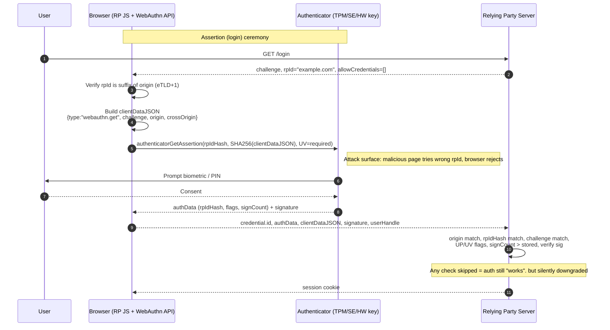

# WebAuthn, Passkeys, and FIDO2

> WebAuthn's phishing resistance is not magic, it is a signature over a `clientDataJSON` blob that pins the browser origin to a credential scoped by RP ID. The authenticator private key never leaves silicon (TPM, Secure Enclave, StrongBox, or hardware key), and the browser refuses to invoke a credential whose stored RP ID does not match `eTLD+1` of the current page. Passkeys are the same credentials with the private key exportable into a sync fabric (iCloud Keychain, Google Password Manager, 1Password), which shifts the trust anchor from a device to a cloud account. Every real-world break comes from a relying party that skipped one of four checks: origin string, RP ID, challenge freshness, or signature counter. If the RP verifies all four and rejects unknown attestation on registration when it cares, phishing (including AiTM proxies like Evilginx) fails because the attacker's origin will not match the signed origin. If the RP verifies three of four, the ceremony still authenticates, but a determined attacker with a stolen or cloned credential slips through unnoticed.

## Quick reference

```json
// PublicKeyCredentialCreationOptions (registration ceremony, RFC-shaped)
{
  "challenge": "base64url(32 bytes CSPRNG)",
  "rp": { "id": "example.com", "name": "Example" },
  "user": {
    "id": "base64url(64-byte opaque user handle, not email)",
    "name": "alice@example.com",
    "displayName": "Alice"
  },
  "pubKeyCredParams": [
    { "type": "public-key", "alg": -7 },   // ES256
    { "type": "public-key", "alg": -257 }  // RS256
  ],
  "timeout": 60000,
  "attestation": "direct",                  // "none" for consumer
  "authenticatorSelection": {
    "residentKey": "required",              // discoverable credential
    "userVerification": "required",
    "authenticatorAttachment": "platform"
  },
  "excludeCredentials": [
    { "type": "public-key", "id": "base64url(existing cred id)" }
  ]
}
```

```json
// clientDataJSON (verbatim bytes signed by the authenticator during assertion)
{
  "type": "webauthn.get",
  "challenge": "base64url(the exact server-issued challenge)",
  "origin": "https://login.example.com",
  "crossOrigin": false,
  "topOrigin": "https://example.com"
}
```

| Invariant | Where enforced | How violated | Source |
| --- | --- | --- | --- |
| `origin` in `clientDataJSON` equals the RP's expected origin exactly | RP server verification step 9 | Server accepts any origin, or normalizes case, or accepts `*.example.com` prefix match | W3C WebAuthn Level 3, section 7.2 |
| `rpIdHash` (first 32 bytes of `authData`) equals SHA-256 of the RP ID the credential was registered with | RP server verification step 13 | Server does not recompute hash, or uses different RP ID than registration | W3C WebAuthn Level 3, section 7.2 |
| `challenge` in `clientDataJSON` equals the exact server-issued challenge, one-time use, TTL bounded | RP server, before signature check | Reused challenges, missing state binding, replay from another session | W3C WebAuthn Level 3, section 7.2 |
| `signCount` strictly greater than stored value, or both zero | RP server, after signature verification | Server ignores counter, allowing cloned authenticator to succeed indefinitely | W3C WebAuthn Level 3, section 6.1.1 |
| `flags.UP` set (user presence) and `flags.UV` matches policy | RP server, on `authData` byte 32 | Server accepts `UV=0` while policy is `userVerification: required` | W3C WebAuthn Level 3, section 6.1 |
| RP ID is a registrable domain suffix of the caller's origin (eTLD+1 rule) | Browser, before invoking authenticator | Site sets `rp.id = "co.uk"` or `rp.id = "attacker.com"` and browser rejects | W3C WebAuthn Level 3, section 5.1.3 |
| Attestation statement, if requested, chains to a trusted root and matches `AAGUID` policy | RP server, registration only | Server sets `attestation: "direct"` and then does not verify the signature | W3C WebAuthn Level 3, section 8 |

## How it works

WebAuthn is a JavaScript API (`navigator.credentials.create` and `navigator.credentials.get`) that a relying party website calls to ask the browser to talk to an authenticator over CTAP2 (external roaming key) or an internal platform interface (Secure Enclave, StrongBox, TPM, Windows Hello). The browser is the trusted intermediary: it validates the RP ID against the page origin, constructs the `clientDataJSON`, hashes it, and hands the hash to the authenticator, which signs with the private key bound to that specific credential ID.

### Two ceremonies

The registration ceremony (`webauthn.create`) provisions a new public/private keypair on the authenticator. The RP sends `PublicKeyCredentialCreationOptions` with a fresh challenge, its RP ID, a user handle (opaque byte string, not the email), and algorithm preferences. The authenticator generates a keypair, stores it (either resident/discoverable, so the credential is enumerable by RP ID alone, or non-resident with the credential ID wrapping the key material), signs an attestation statement, and returns the public key plus `attestationObject` to the RP. The RP records the credential ID, public key, `signCount`, and `AAGUID`.

The authentication ceremony (`webauthn.get`) proves possession of that private key. The RP sends `PublicKeyCredentialRequestOptions` with a fresh challenge, `rpId`, an optional `allowCredentials` list (empty means "any discoverable credential for this RP"), and the required `userVerification` level. The authenticator prompts the user (biometric, PIN, or button touch depending on transport and policy), signs `authData || SHA-256(clientDataJSON)`, and returns the signature. The RP verifies the signature with the stored public key, then checks every invariant in the table above.



### RP ID and the eTLD+1 rule

The RP ID is a domain string (not a URL) that scopes a credential. The browser enforces that the RP ID is either equal to the current origin's effective domain or is a registrable suffix. `login.example.com` may set `rp.id = "example.com"` because `example.com` is a registrable suffix on the Public Suffix List. `login.example.com` may not set `rp.id = "com"` because `com` is a public suffix, not registrable. A credential registered under `rp.id = "example.com"` will be offered to any subdomain of `example.com`, which is exactly the SSO-friendly behavior you want. A credential registered under `rp.id = "login.example.com"` will not be offered to `www.example.com`, which is what you want for tenant isolation.

### Authenticator model

Authenticators come in two flavors. Platform authenticators are built into the OS or device (Face ID + Secure Enclave on iOS, Windows Hello + TPM, Android biometrics + StrongBox), and their private keys never leave the enclave. Cross-platform (roaming) authenticators are external hardware keys (YubiKey, Feitian, SoloKey) that speak CTAP2 over USB HID, NFC, or Bluetooth LE. Resident (discoverable) credentials store the credential ID plus user metadata on the authenticator itself, enabling usernameless flows (browser shows a passkey picker). Non-resident credentials wrap the key inside the credential ID via key wrapping, so the authenticator holds no state.

### Passkeys and the sync fabric threat model

A passkey is the marketing name for a WebAuthn credential whose private key is exportable into a synchronization service. Apple iCloud Keychain, Google Password Manager, 1Password, Bitwarden, and Dashlane all now sync passkeys end-to-end encrypted, keyed to the user's cloud account. This shifts the trust anchor. A traditional FIDO2 credential is trust-rooted in silicon: compromise the key, compromise the metal. A synced passkey is trust-rooted in the cloud account: compromise the Apple ID or Google account (via phishing the recovery flow, SIM swap on the recovery number, or insider access), compromise every passkey. Device-bound passkeys (available on hardware keys and some platform authenticators via `authenticatorSelection.residentKey` with attestation) preserve the silicon anchor at the cost of no cross-device sync. Workforce IdPs pin `AAGUID` to the enterprise's approved authenticators and require `attestation: "direct"` for exactly this reason.

### Attestation formats

The `attestationObject` carries the authenticator's proof-of-provenance in one of several formats: `packed` (generic, TPM or standalone with X.509 chain), `tpm` (TCG TPM 2.0 attestation), `android-key` (Keystore key attestation with hardware-backed AAGUID), `android-safetynet` (deprecated Google Play Integrity attestation), `apple` (Apple Anonymous Attestation, no per-device linkability), `fido-u2f` (legacy U2F), and `none` (self-attestation, no chain). Consumer RPs typically request `attestation: "none"` because verifying attestation risks linking users to specific device serial numbers and because the trust-anchor gain is not worth the UX friction. Workforce and high-assurance flows request `direct`, validate the chain against FIDO Metadata Service (MDS) roots, and refuse `AAGUID`s not on the enterprise allowlist.

### CTAP2 transports

CTAP2 is the wire protocol between the browser and an external authenticator. It runs over USB HID (default), NFC (tap-to-auth on Android), and Bluetooth LE (Caseless flow). Bluetooth adds a proximity requirement (BLE pairing) that has been used for cross-device sign-in (`hybrid` transport, formerly "caBLE"), where a phone acts as a roaming authenticator for a laptop by exchanging a QR-code-encoded ephemeral tunnel key.

## Attack techniques

### 1. Missing origin check leading to AiTM phishing bypass

An adversary-in-the-middle proxy like Evilginx renders the real RP's login page from an attacker-controlled origin such as `login.exampl3.com` and forwards every request to the real backend. If the RP's WebAuthn verifier does not check the `origin` field in `clientDataJSON`, or checks it against a substring or regex, the attacker can complete the ceremony from their origin, capture the session cookie, and hijack the account. The clue is a valid signature over a `clientDataJSON` whose `origin` is not the RP's canonical origin.

Payload is a proxied assertion where `clientDataJSON.origin = "https://login.exampl3.com"` and everything else matches. Confirmation is trivial: request an assertion from a controlled origin, submit it, watch it succeed. Black-box detection needs no OOB channel because the RP simply returns a session cookie.

Escalation goes straight to full account takeover, and because the WebAuthn signature verifies (the private key really did sign a well-formed `clientDataJSON`), naive telemetry sees this as a successful passkey login. Fix is a byte-for-byte origin compare against a compile-time constant.<sup>[[1]](#ref1)</sup><sup>[[2]](#ref2)</sup>

### 2. RP ID mismatch and eTLD+1 misuse

The RP ID scopes a credential across subdomains via the eTLD+1 rule. If an application registers a passkey under `rp.id = "example.com"` and then, on the sign-in host `login.example.com`, verifies with `rp.id = "login.example.com"`, the browser will refuse to surface the credential and the ceremony fails safely. The dangerous variant is the reverse: an app registers under the tenant subdomain and later "improves" the login flow to accept credentials scoped to the parent domain by widening the accepted `rpIdHash`. Now any subdomain of `example.com` (including compromised marketing pages, dev environments, or vendor-hosted subdomains) can invoke the credential and forward the assertion.

Payload is a WebAuthn assertion from `evil.example.com` where the attacker controls the subdomain via a stale DNS record, an S3 bucket takeover, or a shared vendor. The `rpIdHash` still matches `SHA-256("example.com")`, the signature verifies, the login succeeds. Confirmation is to register a passkey on the canonical origin, then invoke it from a controlled subdomain of the same eTLD+1 with `rp.id = "example.com"`; if the RP accepts the assertion, the bug is present.

Escalation is subdomain-to-parent account takeover, and it is invisible to the parent's WAF because the malicious page is on a legitimate subdomain. Fix is to scope high-value passkeys to the exact login subdomain and enforce `rpIdHash` equality on the server, not a suffix match.<sup>[[1]](#ref1)</sup>

### 3. Challenge replay from missing state binding

WebAuthn's challenge is a nonce that the RP must generate with a CSPRNG, bind to the specific ceremony (session or transaction), and consume atomically. RPs that cache challenges in a shared bucket, accept any challenge from a valid pool, or allow the same challenge to authenticate multiple sessions are replay-vulnerable. An attacker who observes one assertion (from a stolen mobile app log, a compromised MITM, or a leaked HAR file) can reuse the same `authenticatorData || SHA-256(clientDataJSON)` signature against the RP.

Payload is a captured assertion resubmitted verbatim. Confirmation: capture a legitimate assertion, submit it a second time, note the outcome. If the second attempt yields a session, the RP is broken.

Escalation is account takeover from any log-capture primitive; the attacker never needs to touch the authenticator. Fix is to store the issued challenge server-side keyed to the session ID, verify it once, and delete it. Do not accept challenges from the client, do not derive them deterministically, do not skip the TTL.<sup>[[1]](#ref1)</sup><sup>[[3]](#ref3)</sup>

### 4. Signature counter bypass leading to authenticator cloning

Every authenticator maintains a monotonically increasing `signCount` that is included in `authData`. The RP must record the value and reject any assertion whose counter is not strictly greater than the last accepted value (or both zero, which is allowed for authenticators that do not implement a counter, such as many Apple platform authenticators and some passkey providers). If the RP silently accepts a decreasing or stale counter, an attacker with a cloned authenticator (exfiltrated key material from a compromised keystore, a debug build, or a physical extraction) can authenticate indefinitely alongside the legitimate user.

Payload is a valid assertion from cloned key material where `signCount` is stuck at an old value while the legitimate authenticator has moved on. Confirmation is out of band: register a credential, sign several times to increment the counter, then replay an older assertion whose counter is lower than current. If the RP accepts it, the counter is unenforced.

Escalation is silent parallel access; the legitimate user never sees an anomaly because their sessions continue to work. Fix is to enforce `newSignCount > storedSignCount` strictly. If the authenticator reports zero counters (Apple), record that fact at registration and skip the check only for that credential.<sup>[[1]](#ref1)</sup>

### 5. Attestation trust-anchor confusion in workforce IdPs

Workforce IdPs use `attestation: "direct"` and pin credentials to specific `AAGUID` values that map to approved authenticators (say, YubiKey 5 series with FIPS firmware). The pitfall is that many implementations accept the attestation statement without validating the certificate chain against the FIDO Metadata Service (MDS), or accept `AAGUID = 00000000-0000-0000-0000-000000000000` (unattested), which lets any authenticator including software emulators register as an approved key.

Payload is a self-signed attestation with an `AAGUID` string that visually matches an approved key while the certificate does not chain to MDS. Confirmation: register from a WebAuthn software emulator (e.g., the Chrome DevTools virtual authenticator), submit the registration, check whether the RP admitted the credential. If yes, attestation is not enforced.

Escalation is that a compromised BYOD laptop can enroll a software-backed key that appears (in the admin console) as a compliant hardware token, defeating the entire policy. Fix is to require MDS chain validation, pin `AAGUID`, and reject unknown attestation formats.<sup>[[4]](#ref4)</sup>

### 6. Passkey sync provider compromise

A synced passkey inherits the security of the sync provider account. If an attacker takes over the user's Apple ID (phishing the account recovery flow, SIM-swap on the recovery number) or Google account, they gain every passkey attached to that account across every device the sync fabric restores to. The attack is entirely off-path from the RP: the RP sees a normal ceremony from a normal-looking device.

Payload is not a WebAuthn payload; it is a fresh device signed into the compromised cloud account, which then materializes the passkey and completes a legitimate ceremony against the RP. Confirmation from the defender side is device-attestation telemetry: was this credential just materialized on a brand-new device that has never been seen? Was there a recent password reset or new-device signal from the sync provider?

Escalation is the same as any account takeover: full session, full read/write. Fix at the RP level is impossible with pure synced passkeys; workforce IdPs mitigate by requiring `attestation: "direct"` and rejecting synced-credential AAGUIDs (Apple, Google, Microsoft all report distinct AAGUIDs for their sync-backed platform authenticators, and enterprise policy can require hardware-backed device-bound keys instead).<sup>[[5]](#ref5)</sup><sup>[[6]](#ref6)</sup>

### 7. Cross-origin iframe abuse (Level 3)

WebAuthn Level 3 permits invocation from cross-origin iframes when the parent grants the `publickey-credentials-get` Permissions-Policy. `clientDataJSON` gains a `topOrigin` field and `crossOrigin: true`. An RP that validates only `origin` and ignores `topOrigin` can be tricked when its iframe is embedded on a phishing page that abuses a `publickey-credentials-get` grant, though modern browsers gate this behind explicit `allow=` headers.

Payload is an assertion invoked from an iframe whose `origin` matches the RP but whose `topOrigin` is attacker-controlled and whose `crossOrigin` is true. Confirmation: embed the RP's login iframe in a controlled page, invoke the assertion, submit the result, and see if the RP accepts a session where `crossOrigin=true` and `topOrigin` is not on an allowlist.

Escalation is UI-redressing style phishing that survives WebAuthn's origin binding. Fix is to reject `crossOrigin: true` unless the RP explicitly supports embedded flows, and to allowlist `topOrigin` values.<sup>[[1]](#ref1)</sup>

## Defense

### Real fix

1. Server-side verification MUST implement every clause of W3C WebAuthn Level 3 section 7.2. The seven required checks: (a) parse `clientDataJSON` and confirm `type == "webauthn.get"` for assertions or `"webauthn.create"` for registration, (b) verify `challenge` equals the server-issued challenge byte-for-byte and is unused, (c) verify `origin` equals the RP's canonical origin string, (d) if `crossOrigin` is present and true, verify `topOrigin` against an allowlist, (e) parse `authData` and verify `rpIdHash == SHA-256(rpId)`, (f) verify `flags.UP == 1` and, if policy requires, `flags.UV == 1`, (g) verify the signature over `authData || SHA-256(clientDataJSON)` using the stored public key. Missing any single check invalidates the phishing-resistance property. Common wrong implementation: using a library that verifies the signature but leaves origin/challenge/counter enforcement to the caller, and the caller forgets one.<sup>[[1]](#ref1)</sup>

2. Enforce `signCount` strictly. Store the counter with the credential. On each assertion, if the new counter is not zero and not greater than the stored value, either reject the assertion or flag the account for manual review. Record at registration whether the authenticator uses zero counters and skip the check only for those credential IDs. Common wrong implementation: writing the code but never actually rejecting, so the log line is emitted and the session proceeds.<sup>[[1]](#ref1)</sup>

3. Bind the challenge to the session and expire it. Generate 32 bytes from a CSPRNG per ceremony, store keyed on the session or transaction ID, set a 5-minute TTL, and delete on first use. Never trust a client-supplied challenge. Common wrong implementation: reusing a single "current challenge" per user across ceremonies, letting the same challenge unlock any pending login.<sup>[[3]](#ref3)</sup>

4. Scope RP ID to the smallest necessary domain. If passkeys are used only on `accounts.example.com`, set `rp.id = "accounts.example.com"` and never accept assertions with a different `rpIdHash`. If SSO requires cross-subdomain, set `rp.id = "example.com"` deliberately and lock down subdomain provisioning (no dev environments on production eTLD+1). Common wrong implementation: setting `rp.id` to the eTLD+1 for convenience without auditing which subdomains are allowed to host arbitrary code.<sup>[[1]](#ref1)</sup><sup>[[7]](#ref7)</sup>

5. For workforce and high-assurance flows, require `attestation: "direct"`, validate the chain against FIDO Metadata Service, and pin `AAGUID` values to an approved authenticator allowlist. Reject `AAGUID = 0`, reject `attestation: "none"` at registration, reject software authenticator AAGUIDs (`00000000-...` variants published for virtual keys). Common wrong implementation: asking for direct attestation but not validating the chain, so any self-signed attestation passes.<sup>[[4]](#ref4)</sup>

### Defense in depth

1. Enable `authenticatorSelection.userVerification: "required"` for any credential that grants privileged access, and enforce the `UV` flag on the server. Discourage `userVerification: "discouraged"` for consumer login unless paired with a second factor; the `UV=0` bit means no biometric or PIN was checked and the credential is effectively a possession-only factor.<sup>[[1]](#ref1)</sup>

2. Use `excludeCredentials` on registration to prevent duplicate registration of the same authenticator against the same account, which stops phishing kits that try to register their own attacker-controlled credential mid-session.<sup>[[1]](#ref1)</sup>

3. Log the `AAGUID`, `credentialId`, and transport per credential. Alert on `AAGUID` changes for a given credential ID (should not happen), on synced-credential AAGUIDs in workforce contexts, and on registrations from unusual device fingerprints. See [12-authentication-session.md](./12-authentication-session.md) for correlated session-anomaly signals.

4. Step-up rather than replace. Passkeys are a strong first factor but not a substitute for transaction confirmation on high-value operations. Use WebAuthn again at the transaction moment (re-auth with a fresh challenge that includes the transaction hash), a pattern documented in [73-mfa-step-up.md](./73-mfa-step-up.md).

5. On the SSO path, prefer WebAuthn at the IdP and issue short-lived tokens downstream; do not push passkeys into every RP. See [67-sso.md](./67-sso.md) for the IdP-mediated model that keeps the WebAuthn ceremony in one place.

6. For consumer flows, offer both synced passkeys (convenience) and device-bound options (security). Educate high-value users (admins, developers, security team) to enroll a hardware key as a required second credential and to disable synced-passkey recovery paths on their cloud accounts.

## Detection and telemetry

Log the full `clientDataJSON.origin`, `clientDataJSON.type`, `authData.flags` byte, `signCount`, `AAGUID`, and `credentialId` for every ceremony (both success and failure). Alert on: origin values that do not exactly match the canonical origin string; `crossOrigin=true` where policy forbids it; `signCount` decreases or stalls; `UV=0` on a credential registered under `userVerification: required`; new `AAGUID` values that are not in the enterprise MDS allowlist; and any registration from an emulator AAGUID (Chrome DevTools virtual authenticator publishes a fixed AAGUID pattern that should never appear in production).

Add a synthetic canary: register a passkey against a honeypot subdomain that no legitimate user knows about, then alert on any successful ceremony against it, which will trip if an attacker scripts the WebAuthn API against every subdomain of your eTLD+1. Correlate with sign-in telemetry from the sync provider when available (Apple Business Manager, Google Workspace) so a new device materializing a passkey is visible before the assertion against your RP.

Store `AAGUID` at registration and alert on any change tied to the same `credentialId`, which should be impossible and indicates either a bug or attempted credential swap. Include the WebAuthn ceremony ID in your audit log so a session revocation can trace back to which credential authenticated it.

## Interviewer probes

**Q1. Why is WebAuthn phishing-resistant when TOTP and push-notification MFA are not?**

Mid: because the origin is signed into the assertion, so an attacker-controlled origin cannot produce a signature that verifies against the real RP's origin check.

Principal: the property depends on four things happening together: the browser refuses to invoke a credential whose stored RP ID is not a registrable suffix of the current origin, the browser constructs `clientDataJSON` with the true origin (not the phishing origin), the authenticator signs a hash that includes that `clientDataJSON`, and the RP server verifies both the origin string and the `rpIdHash` byte-for-byte. Break any of those four and phishing resistance collapses. TOTP and push have no origin binding at all, so an AiTM proxy captures and forwards the code trivially.

**Q2. A team ships WebAuthn but their RP verifier is a five-line library call that returns `verified: true`. What is your first question?**

Mid: which library, and what is it actually checking?

Principal: I ask whether the library expects the caller to pass in `expectedOrigin`, `expectedRPID`, and `expectedChallenge` as parameters, and if so, whether the calling code passes canonical byte-equal strings or normalized versions. Most WebAuthn library CVEs are not in the crypto; they are in wrappers that accept a list of allowed origins and let the RP misconfigure a wildcard, or default to skipping counter checks. I would also check whether they persist the challenge server-side or send it to the client wrapped in a JWT (a pattern that has led to challenge fixation).

**Q3. Passkeys are synced through iCloud Keychain. What is the trust anchor now, and does the RP see any difference?**

Mid: the trust anchor is the iCloud account. The RP sees a normal ceremony because the private key is materialized on a new device.

Principal: the RP does see one signal: the `AAGUID` for synced Apple passkeys is distinct from device-bound Apple platform credentials, and it is published. An RP can policy-reject synced passkeys by AAGUID for workforce use cases and require device-bound authenticators (`residentKey: "required"` with attestation validating an enterprise-approved AAGUID). For consumer flows, the tradeoff is UX (users lose access when they lose their device) versus the sync-provider compromise surface, which is real: Apple ID phishing via the recovery flow is a documented attack path, and once inside, passkey materialization on a new device is silent.

**Q4. What breaks if the RP does not enforce `signCount`?**

Mid: cloned authenticators can authenticate in parallel without detection.

Principal: the counter is the only detection primitive WebAuthn provides for key duplication. If someone extracts key material from a compromised Android StrongBox (rare but documented in root-compromise scenarios) or from a software-based passkey provider with a weak vault key, both the legitimate and cloned authenticators will produce valid signatures. Without counter enforcement, both work indefinitely. With enforcement, the moment the cloned authenticator signs after the legitimate one, its counter is lower, and the RP can flag or reject. Practical caveat: several passkey providers, notably Apple, do not implement counters at all and always report zero. The RP must record that at registration and only skip the check for those specific credentials, not disable the check globally.

**Q5. Explain the eTLD+1 rule with a concrete example.**

Mid: RP ID must be a registrable domain suffix of the origin, and `com` is not registrable, so you cannot use it as an RP ID.

Principal: the browser consults the Public Suffix List. `example.co.uk` is one eTLD+1 because `co.uk` is on the list. A credential registered with `rp.id = "example.co.uk"` will work on any subdomain of `example.co.uk`. A credential registered with `rp.id = "co.uk"` will be rejected by the browser at ceremony start because `co.uk` is a public suffix. The security implication: `rp.id` should be the smallest domain that meets your SSO needs. If you set it to your top-level parent domain for convenience, you have implicitly granted WebAuthn credential access to every subdomain, including vendor-hosted marketing pages, dev environments, and any subdomain vulnerable to takeover.

**Q6. When would you require attestation, and when would you deliberately skip it?**

Mid: require attestation for workforce; skip for consumer to avoid privacy linkability.

Principal: attestation gives you cryptographic proof that a specific authenticator model (via AAGUID and cert chain to FIDO MDS) produced the credential. That is essential when policy requires FIPS-140 hardware or forbids synced passkeys. It is undesirable for consumer flows because Apple's Anonymous Attestation aside, most attestation statements include a batch identifier that lets you correlate users across RPs, and enterprise attestation certificates can leak device provenance. The pragmatic split is: consumer login uses `attestation: "none"`; workforce IdP and privileged admin flows use `attestation: "direct"` with MDS chain validation and AAGUID pinning. See [17-cryptographic-failures.md](./17-cryptographic-failures.md) for the general pattern on trusting attestation chains.

**Q7. Your bug bounty program receives a report claiming they bypassed WebAuthn on `login.example.com` by intercepting the assertion and replaying it. How do you triage?**

Mid: check whether the RP enforces the challenge as one-time use and whether it is bound to the specific session.

Principal: I reproduce with a controlled account. Register a passkey, capture the assertion via browser devtools, then attempt to submit it a second time against the same challenge and against a fresh challenge. If the second submit against the same challenge succeeds, we have a nonce reuse bug (critical). If the second submit against a different challenge succeeds, the signature verification is broken in a much scarier way (probably no challenge check at all). If both fail, the reporter likely captured and replayed within their own session before the challenge was consumed by their real login, which is expected behavior and not a bug. I also verify the RP's audit log shows two assertion events with the same challenge, which should be impossible under a correct implementation.

**Q8. A vendor proposes adding a QR-code fallback where the user types a code the RP shows into their phone. Does this preserve phishing resistance?**

Mid: no, because typed codes have no origin binding.

Principal: it depends on the exact flow. The FIDO Alliance's hybrid transport (formerly caBLE) does preserve phishing resistance because the QR code carries an ephemeral BLE tunnel key, the phone acts as an authenticator over that tunnel, and the ceremony still involves `clientDataJSON` with the desktop browser's origin signed by the phone. Any homebrewed "type this code into your phone" flow that treats the phone as an independent authenticator (rather than a CTAP2 client over the tunnel) loses origin binding because the phone has no way to verify what origin the desktop is actually on. The tell: if the flow ever displays "confirm login for example.com" as text on the phone rather than as a cryptographic origin embedded in the ceremony, it is not phishing-resistant, and the user's approval is defeatable by an AiTM that renders the same text.

## Sources

<a id="ref1"></a>[1] Web Authentication: An API for accessing Public Key Credentials, Level 3. W3C Working Draft. 2024. https://www.w3.org/TR/webauthn-3/

<a id="ref2"></a>[2] How FIDO Addresses a Full Range of Use Cases (phishing-resistance and AiTM discussion). FIDO Alliance. 2022. https://fidoalliance.org/how-fido-addresses-diverse-technical-requirements/

<a id="ref3"></a>[3] OWASP Application Security Verification Standard (ASVS) v4.0.3, section 2 (Authentication) and section 3 (Session). OWASP. 2022. https://owasp.org/www-project-application-security-verification-standard/

<a id="ref4"></a>[4] FIDO Metadata Service. FIDO Alliance. 2024. https://fidoalliance.org/metadata/

<a id="ref5"></a>[5] Passkeys Overview. FIDO Alliance. 2023. https://fidoalliance.org/passkeys/

<a id="ref6"></a>[6] Apple Platform Security Guide (Passkey and iCloud Keychain sections). Apple. 2024. https://support.apple.com/guide/security/welcome/web

<a id="ref7"></a>[7] Public Suffix List. Mozilla. https://publicsuffix.org/

<a id="ref8"></a>[8] Client to Authenticator Protocol (CTAP), version 2.1. FIDO Alliance. 2022. https://fidoalliance.org/specs/fido-v2.1-ps-20220317/fido-client-to-authenticator-protocol-v2.1-ps-20220317.html
