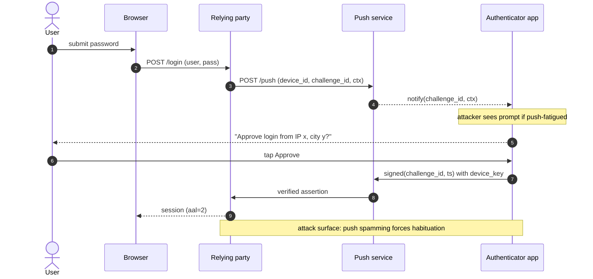

# 73. MFA and Step-Up Authentication

> MFA is not a checkbox on the login form, it is a claim about which authenticator produced the current session and how recently it was exercised. Every MFA failure at scale, push fatigue at Uber in 2022, SIM swap of high-value accounts, TOTP secrets leaked from a QR-code screenshot, "trust this device for 30 days" cookies stolen from an unlocked laptop, comes from confusing enrolment security with runtime challenge security, or from letting a first-factor password session inherit a step-up assertion forever. The root cause is almost always the same: the server records "user has MFA enabled" as a boolean instead of tracking the Authenticator Assurance Level (AAL), the timestamp of the last successful challenge, and the authenticator id that produced it. A correct implementation binds every sensitive operation to a fresh proof-of-possession by a specific authenticator with rate limits, constant-time verification, and a cryptographic upgrade path from AAL1 to AAL2 or AAL3 that the client cannot forge. This doc treats TOTP, push, SMS, backup codes, and step-up as one system: an authenticator ledger, a per-session AAL value, and a policy engine that raises AAL on demand.

## Quick reference

Wire-level example: a TOTP verification request, followed by a step-up id_token showing the resulting AMR/ACR claims.

```
POST /account/wire-transfer HTTP/1.1
Host: bank.example
Cookie: sid=8b0f...; aal=1; sid_exp=1755500000
Content-Type: application/json

{"to":"acct_9931","amount":50000}

HTTP/1.1 401 Unauthorized
WWW-Authenticate: Bearer error="insufficient_user_authentication",
                  acr_values="urn:mace:incommon:iap:silver",
                  max_age="120"

--- client redirects to /oauth/authorize?acr_values=urn:mace:incommon:iap:silver&max_age=120 ---

POST /mfa/totp/verify HTTP/1.1
Host: bank.example
Content-Type: application/x-www-form-urlencoded

challenge_id=c_7f21&otp=284615

--- server computes RFC 6238 TOTP over 30s windows [-1,0,+1] with HMAC-SHA1(secret, T) ---
--- constant-time compare, single-use nonce per (user, T), increments failure counter ---

HTTP/1.1 200 OK
{
  "id_token": "eyJhbGciOi...",
  "amr": ["pwd","otp"],
  "acr": "urn:mace:incommon:iap:silver",
  "auth_time": 1755512340
}
```

| Invariant | Where enforced | How violated | Source |
| --- | --- | --- | --- |
| TOTP = HOTP(K, T) where T = floor((unix - T0) / X), X default 30s | Authenticator + verifier | Skew allowed beyond ±1 step, fixed-string compare leaks byte position | RFC 6238 §4.2, §5.2 |
| HOTP counter is monotonic; verifier advances only on success within look-ahead window | Verifier | Counter reused, resync window too wide (>10) enables brute-force | RFC 4226 §5.4, §7.4 |
| otpauth:// secret is a base32 string bound to a single (issuer, account) tuple | Enrolment endpoint | QR reused, no rebinding on re-enrol, secret logged | Google Authenticator KeyUriFormat |
| Restricted authenticators (SMS/PSTN) MAY be used at AAL2 only with additional risk mitigations | Federation server | SMS treated as AAL2 without SIM-binding checks | NIST SP 800-63B rev4 §5.1.3.3 |
| Step-up presents amr and acr in the id_token, and auth_time reflects the latest interactive challenge | OIDC OP | Reused id_token from earlier session, auth_time not refreshed | OIDC Core 1.0 §2, §3.1.2.1 |
| MFA endpoint enforces per-user and per-IP rate limits and locks on N failures | Verifier | Missing lockout enables 10^6 codespace enumeration in minutes | OWASP ASVS v4.0.3 §2.2.1 |
| Session AAL is server-side, not derived from a client cookie | Session store | "aal=2" cookie trusted, remember-device token forgeable | NIST SP 800-63B rev4 §7.1 |

## How it works

### The three factor families and what each proves

Authentication factors are grouped as knowledge (password), possession (a device holding a key or seed), and inherence (biometric). MFA is any combination that spans at least two families. The value of MFA comes from the assumption that compromising one family is uncorrelated with compromising another. That assumption fails when a possession factor is delivered over a knowledge channel (SMS to a recovery email), or when two possession factors live on the same device (push app plus SMS both to the same phone).

NIST SP 800-63B rev4 formalises the assumption with Authenticator Assurance Levels<sup>[[1]](#ref1)</sup>. AAL1 is single-factor (password alone). AAL2 requires two factors including a cryptographic authenticator (TOTP, push with proof-of-possession, WebAuthn platform authenticator). AAL3 requires a hardware cryptographic authenticator with verifier impersonation resistance (WebAuthn roaming security key, smart card). A session carries an AAL value on the server; a request that a policy tags as high-value compares required AAL against session AAL and, on gap, triggers step-up.

### TOTP: RFC 6238 in one page

TOTP is HOTP with time as the counter. The server and authenticator share a secret K (recommend 20+ random bytes, base32-encoded in the provisioning URI). The moving factor is T = floor((current_unix - T0) / X) where T0 is usually 0 and X is usually 30 seconds. The one-time password is HOTP(K, T), which is truncated to D digits, usually 6.

```
HOTP(K, C):
  HS = HMAC-SHA1(K, C)          // K is the secret, C is the 8-byte counter
  offset = HS[19] & 0x0f
  P = (HS[offset..offset+4] & 0x7fffffff)
  return P mod 10^D
```

RFC 6238<sup>[[2]](#ref2)</sup> permits HMAC-SHA256 and HMAC-SHA512 variants; SHA1 remains the default because authenticator apps default to it. The verifier is expected to accept the current window plus a small drift, typically ±1 step. Wider drift shrinks the effective codespace: with ±3 steps you have accepted 7 valid codes at any instant, so brute-force cost drops from 10^6 to ~143k tries per user for a 6-digit code.

### HOTP: RFC 4226 counter mechanics

HOTP<sup>[[3]](#ref3)</sup> replaces T with a monotonically increasing counter C that the authenticator increments after each generation and the verifier advances on each successful validation. The look-ahead parameter s lets the verifier check up to s future codes to handle counter drift (authenticator button pressed but code not entered). RFC 4226 §7.4 warns that s must be tight; each unit of look-ahead multiplies the effective codespace divisor. HOTP is now rare outside hardware tokens (YubiKey OATH-HOTP mode).

### Provisioning URI and QR enrolment

The de facto standard for authenticator enrolment is Google's Key Uri Format<sup>[[4]](#ref4)</sup>:

```
otpauth://totp/Example:alice@example.com
  ?secret=JBSWY3DPEHPK3PXP
  &issuer=Example
  &algorithm=SHA1
  &digits=6
  &period=30
```

The server generates a random secret, stores it encrypted, encodes the URI as a QR, and displays it once. Enrolment is the attack surface: if the QR is captured (screenshot in a support ticket, MDM screen recording, a user shows it to a colleague), the secret is compromised permanently until re-enrolment. Any support flow that lets a helpdesk agent view or re-issue the secret without invalidating the old one is a policy failure. Correct servers rotate the secret on any re-issuance and force re-enrolment on all authenticators registered to that user.

### Push MFA

Push (Duo Push, Okta Verify Push, Microsoft Authenticator) works by the RP asking the push-notification service to prompt a pre-registered device; the device signs a challenge with a private key that never leaves the device. The wire looks like:



Push is stronger than TOTP against phishing sites because the RP originates the prompt, but only if the user reads the context. Push fatigue attacks succeed because the context is either absent or ignored. Numeric matching (user must type a 2-digit code shown in the browser into the phone) closes most of that gap and is now the default in Microsoft Authenticator and Duo.

### SMS/voice and why NIST restricts it

SMS and voice-OTP are restricted authenticators in NIST SP 800-63B rev4<sup>[[1]](#ref1)</sup>: acceptable at AAL2 only with additional risk mitigations. The threats are SS7 route hijack, SIM swap at the mobile carrier, and RCS/SMS interception via a compromised device. Regulators track the risk (FCC final rule on SIM-swap and port-out fraud, 2023<sup>[[5]](#ref5)</sup>).

### Step-up in OIDC

OIDC<sup>[[6]](#ref6)</sup> defines two claims that transport authenticator context:

- `amr`: Authentication Methods References, an array of tokens naming the methods used (values registered in RFC 8176, e.g., `pwd`, `otp`, `hwk`, `sms`, `mfa`).
- `acr`: Authentication Context Class Reference, a single string naming the overall assurance level.

An RP that needs step-up returns 401 with `WWW-Authenticate: Bearer error="insufficient_user_authentication"` per RFC 9470<sup>[[7]](#ref7)</sup>, or redirects to the OP with `acr_values` and `max_age` parameters. `max_age` bounds how old `auth_time` can be, forcing a fresh interaction if the last challenge is stale.

### Session AAL bookkeeping

A correct session table stores at minimum:

```
sid | user_id | aal | auth_time | authenticator_id | ip | ua | risk_score
```

Every authorisation check that requires MFA compares the required AAL to `session.aal` and the required freshness to `now - session.auth_time`. Both values live on the server. A "trust this device" token is a separate long-lived cookie signed server-side, bound to a device fingerprint, and revocable per-device from the account panel.

## Attack techniques

### 1. MFA-bombing (push fatigue)

Push fatigue works when the RP fires a push notification on every login attempt without rate-limiting the prompt rate per user and without numeric matching. The attacker holds valid first-factor credentials, from a stealer log or a re-used password, and repeatedly triggers login. The victim's phone buzzes at 3 a.m. for the tenth time and they tap Approve to make it stop. The 2022 Uber incident used exactly this pattern against a contractor whose credentials were bought from a broker; the attacker escalated inside the network once the push was approved<sup>[[8]](#ref8)</sup>.

The payload is trivial, a loop over the login endpoint with the stolen password, optionally with a WhatsApp or Slack message from the attacker impersonating IT and asking the user to approve. Black-box confirmation is a login-endpoint that returns the same latency regardless of whether it fired a push, and a lack of 429 responses when repeating a login within seconds. Blind confirmation without cooperating with the victim is to watch for a session token appearing after N repeated failures on a canary account, or to check push-service logs for repeated prompts with no verifier response for X seconds.

Escalation follows the same runbook as any credential-based takeover: harvest session cookies and SSO tokens, pivot to VPN and internal chat where MFA might be silently trusted, register a new WebAuthn credential to lock the victim out, exfiltrate. In the Uber case the attacker reached the internal PAM vault by moving laterally from the initial compromise.

### 2. QR-code replay at enrolment

The provisioning URI carries the raw shared secret. Any surface that displays or logs the QR is a full compromise of the second factor. Common failure modes: screenshots in Zendesk tickets, MDM screen-recording of a phone during enrolment, users showing the QR to a co-worker to prove they enrolled, a shared enrolment portal that keeps the QR renderable for 24 hours after the user has scanned. If the RP does not invalidate the secret on the second render or on any admin view, both parties can generate valid TOTPs forever.

Payload is passive: obtain the secret string (`?secret=JBSWY3DPEHPK3PXP`), plug into any TOTP app, generate codes in parallel with the legitimate authenticator. Black-box confirmation is to enrol a canary account, note the QR, generate a code from a second device an hour later, and verify it authenticates. Blind detection at scale is to correlate `auth_time` events for the same user coming from geographically distant IPs within one 30s TOTP window.

Escalation is silent takeover; the legitimate user still sees their authenticator work and never notices. Mitigation is to make enrolment atomic (single view, single scan, rotate on any re-render), to bar helpdesk from ever seeing the secret, and to force re-enrolment when the account changes password or MFA policy.

### 3. TOTP brute-force via missing rate limits

A 6-digit TOTP has 10^6 values. With a ±1 window (3 valid codes per instant) and no lockout, an attacker who submits 30 codes per second reaches 50% success against a random user in ~500 minutes. With a wider drift window (some deployments allow ±3 or ±5 to "help users") the time drops proportionally. Missing per-user and per-IP limits, or per-user limits with no global rate limit so an attacker can distribute across IPs, both leave this open.

Payload is a for-loop against `/mfa/verify` with an incrementing code. Black-box confirmation is to check the response for differential timing (a common tell: `bcrypt.compare` on the code takes ms, an integer compare takes ns), 429 absence, and whether repeated failures against a canary account eventually lock. Blind confirmation is to submit N codes and check whether the (N+1)th valid guess is accepted, indicating no lockout counter.

Escalation is takeover on any account for which the attacker has the password. A related bug class is brute-force of backup codes, which are 8 to 10 digits but often stored as a static list of ~10 codes per user; the codespace is functionally 10^7 to 10^8 across 10 codes, but a missing lockout still exposes it in hours. Correct implementations rate-limit per user regardless of code type, lock after 5 to 10 failures, and force re-enrolment on lock.

### 4. Constant-time compare miss

Verifiers that compare the submitted OTP to the expected value with `==` or `strcmp` leak timing. On a 6-digit numeric string the leak is small, but on backup codes rendered as alphanumeric strings (e.g., `A2K7-9FQR-8T3M`), a naive compare over a slow interpreter can leak per-character with tens of microseconds of resolution over LAN. The devise-two-factor timing advisory<sup>[[9]](#ref9)</sup> was a real occurrence in a widely-deployed library.

Payload is to submit codes and measure server response time to microsecond resolution over many trials, extracting a prefix per position. Black-box confirmation is easy in a lab: measure the 99th-percentile response time for `AAAA...` vs the correct-first-char prefix. Blind confirmation is harder over the internet due to jitter, but a botnet can average enough samples on the same request path.

Escalation is code recovery character-by-character, followed by silent authentication. The fix is `hmac.compare_digest` (Python), `crypto.timingSafeEqual` (Node), `subtle.ConstantTimeCompare` (Go). The wrong fix is to sleep a random duration on failure; that hides some jitter but leaves the mean shifted.

### 5. "Trust this device" cookie forgery or theft

Remember-device cookies exist because pure MFA-every-login is friction. Common wrong implementations sign a JWT with `{user_id, device_id, exp}` and treat presentation as equivalent to a fresh MFA. Attacks: forge the JWT if the signing key leaks (an S3 bucket, a debug log, a decompiled mobile app), or steal it from a compromised laptop and replay from the attacker's IP. Even without forgery, if the cookie is bound only to `device_id` and not to a device-side proof-of-possession, exfiltrating the cookie is enough.

Payload is a straight cookie-theft chain: infostealer malware, session hijack via XSS on a same-site subdomain, or a stolen backup. Black-box confirmation is to grep the login response for any long-lived MFA-bypass token and check whether presenting it from a different IP still bypasses MFA. Blind detection at the server is to log the count of MFA-bypass presentations per unique fingerprint and alert on drift.

Escalation is a permanent bypass until the user manually revokes the device or the cookie expires (many deployments set 30 or 90 days). Correct implementations bind the remember-device credential to a WebAuthn assertion on the device, not to a cookie; see [70-webauthn-passkeys.md](./70-webauthn-passkeys.md).

### 6. SIM swap and SS7

SMS-based MFA is defeated at the carrier layer: an attacker socially engineers or bribes a carrier employee to port the victim's number to a SIM under attacker control, then triggers password reset and MFA to that number. SS7 vulnerabilities allow interception of SMS in transit without a port (rare, requires SS7 access, mostly nation-state or brokered SS7 access). The FCC's 2023 rule<sup>[[5]](#ref5)</sup> required carriers to implement customer authentication before SIM change or port; residual risk remains high.

Payload is out-of-band, at the carrier. Black-box confirmation is a canary account with SMS MFA; monitor whether OTPs arrive at an alternate number after a port. Escalation is full account takeover; SMS often gates password reset flows in addition to MFA, so once the number is captured the entire account tree falls.

### 7. Session inheritance of a stale AAL

An account with MFA enabled logs in with password + TOTP at 09:00 (AAL2, auth_time=09:00). At 15:00 the user requests a wire transfer or a permission change. If the server does not re-check auth_time against the sensitive-operation policy, the six-hour-old MFA satisfies the check. If the attacker stole the session in the interim, the entire step-up story is fiction. The variant that "MFA once and cookie forever" is common in legacy apps that added MFA as a login-time gate without adding step-up.

Payload is a stolen session cookie from any avenue (XSS, malware, network capture on a bad TLS deployment). Black-box confirmation is to authenticate at t=0, sleep an hour, request a privileged operation, and observe no re-challenge. Escalation is that the attacker inherits AAL2 without ever proving possession. Correct implementations enforce a `max_age` on the acr value for the operation and refresh auth_time on each step-up.

### 8. Backup-code enumeration

Backup codes are static one-time codes issued at enrolment (typically 8 to 12 codes per user). Attacks: the enumeration surface is large (10 codes × 8 digits = ~10^9 codespace across all users), but if the server does not rate-limit or lock on failure, a single account is enumerable at 10 codes × 10^8 codespace with a targeted attack. Worse, some servers store backup codes as plaintext or as unsalted hashes, so a database leak yields all codes.

Payload is either brute-force against `/mfa/backup/verify` or offline crack of the code hashes after a DB compromise. Black-box confirmation is a canary account with known backup codes: submit random codes, watch for lockout. Blind detection at scale is a spike in `/mfa/backup/verify` failures.

Escalation is bypass of both password and MFA in a single flow because backup codes typically satisfy MFA even without the password on some "forgot my second factor" flows. Correct implementations hash backup codes with a memory-hard KDF (argon2id) or a slow HMAC with a per-user key, invalidate all codes after any use, and force regeneration on password change.

## Defense

### Real fix

1. **Track AAL and auth_time in server-side session state, not in a client cookie.** The session record stores `{aal, auth_time, authenticator_id, methods_used[]}`. Every policy check on a sensitive operation reads these from the session store and compares against a policy that says "operation X requires AAL≥2 within 5 minutes". This is the primary control; every other defense in this list assumes this control exists. Common wrong implementation: an `aal=2` bit in a signed JWT with a 30-day expiry, which is really "MFA once, forever". Source: NIST SP 800-63B rev4 §4.2.1<sup>[[1]](#ref1)</sup>.

2. **Adopt OIDC step-up (RFC 9470) as the pattern for elevation.** The RP returns 401 with `insufficient_user_authentication` and the required `acr_values` / `max_age`. The OP prompts the user for the missing factor and returns an id_token with fresh `auth_time`, `amr`, and `acr`. The RP validates all three server-side before permitting the operation. This works because it forces a fresh interactive challenge and produces a signed, tamper-proof record of what factor was exercised. Common wrong implementation: RP treats the presence of an id_token as sufficient without checking `auth_time` against `max_age`, so a replayed hour-old id_token satisfies the check. Source: RFC 9470<sup>[[7]](#ref7)</sup>, OIDC Core §3.1.2.1<sup>[[6]](#ref6)</sup>.

3. **Use WebAuthn / passkeys as the primary AAL2/AAL3 authenticator, not TOTP.** WebAuthn is phishing-resistant by protocol construction (the RP ID is bound in the assertion signature), so it defeats real-time phishing that catches TOTP and push. See [70-webauthn-passkeys.md](./70-webauthn-passkeys.md) for full mechanics. Common wrong implementation: offering WebAuthn as one option next to SMS, so the attacker picks the weakest available and downgrades. The fix is per-account policy: if a user has any hardware authenticator registered, disable weaker factors on their account, and offer an admin-forced upgrade path. Source: W3C WebAuthn Level 3<sup>[[10]](#ref10)</sup>.

4. **Numeric matching on push, always.** The RP displays a 2 or 3 digit code in the browser, the user types it into the authenticator app. This defeats the push-fatigue attack because the attacker needs to see the browser to know the number to prompt the user with. Common wrong implementation: leaving numeric matching optional per-user; users disable it for convenience. Enforce at policy level. Source: Microsoft Learn documentation on number matching<sup>[[11]](#ref11)</sup>, CISA MFA guidance<sup>[[12]](#ref12)</sup>.

5. **Constant-time compare on every OTP path.** Use `hmac.compare_digest` (Python), `crypto.timingSafeEqual` (Node), `subtle.ConstantTimeCompare` (Go), or the language equivalent. Applies to TOTP, HOTP, backup codes, magic-link tokens, password-reset tokens. Common wrong implementation: `if submitted == expected`, or a "safer" version that adds a random sleep on failure. Random sleeps do not defend against averaged timing attacks. Source: OWASP ASVS v4.0.3 §2.8<sup>[[13]](#ref13)</sup>.

### Defense in depth

1. **Rate limit and lockout on every MFA verification endpoint.** Per-user, per-IP, and global. A safe default is 5 to 10 failures per user per 15 minutes, escalating to account lock. Use exponential backoff between accepted attempts. This applies to TOTP, backup codes, SMS OTP, and even push (rate limit the push prompt-generation to defeat push fatigue). Common wrong implementation: rate limit on the /login endpoint but not on /mfa/verify, because they are separate handlers. Source: OWASP ASVS v4.0.3 §2.2.1<sup>[[13]](#ref13)</sup>.

2. **Restrict enrolment surface for TOTP secrets.** The QR is rendered once, cannot be recovered by helpdesk, and any admin action to reset MFA rotates the secret and forces re-enrolment. If the user must re-scan, treat it as a new enrolment. Log every secret-view or secret-print event and alert on any operation that touches the encrypted secret at rest outside the enrolment or verification code paths. Common wrong implementation: an admin "impersonate user" flow that re-renders the QR from stored secret. Source: RFC 6238 §5 and Google KeyUriFormat<sup>[[2]](#ref2)</sup><sup>[[4]](#ref4)</sup>.

3. **Retire SMS and voice OTP for high-value accounts.** Treat SMS as AAL1+ recovery only, and require a stronger factor for actual authentication. If SMS must remain, add carrier-side SIM-binding checks where available (US carriers expose SIM-swap detection APIs via aggregators). Alert on SIM-swap indicators (recent number-port event, new-SIM activation date within N days) and force re-enrolment. Source: NIST SP 800-63B rev4 §5.1.3.3<sup>[[1]](#ref1)</sup>, FCC 47 CFR Part 64 SIM/port rule<sup>[[5]](#ref5)</sup>.

4. **Bind "remember device" to a WebAuthn credential, not a bearer cookie.** The remember-device credential is a client-side private key stored in secure enclave, and every time the user returns the browser signs a challenge with it. Stealing the cookie no longer suffices; the attacker would need the private key, which does not leave the device. Fallback for older browsers is a server-signed device token bound to a TLS client-cert or a device-side attestation. Common wrong implementation: JWT with 30-day expiry and no rotation on IP or geo change. Source: WebAuthn Level 3 §6<sup>[[10]](#ref10)</sup>.

5. **Store backup codes hashed with a memory-hard KDF, invalidate on use, regenerate on any factor change.** Argon2id with parameters tuned for ~100 ms of hashing time is the current default. On any single successful backup-code use, invalidate all remaining codes and require regeneration. On password change or new authenticator registration, invalidate the whole batch and force regeneration. Source: NIST SP 800-63B rev4 §5.1.2 (look-up secrets)<sup>[[1]](#ref1)</sup>, OWASP ASVS §2.5<sup>[[13]](#ref13)</sup>.

6. **Reject reused TOTP codes within their validity window.** Store the last-used counter (T value) per user in the session store and reject a subsequent submission of the same code even if it is still time-valid. This defeats window-race attacks where an attacker who observed a code (over a compromised proxy or on-path) replays it within the same 30s window. RFC 6238 §5.2 explicitly requires this: "the verifier MUST NOT accept the second attempt of the OTP after the successful validation has been issued for the first OTP"<sup>[[2]](#ref2)</sup>.

7. **Signal AMR and ACR downstream, and enforce them at the resource server.** OAuth resource servers should require an id_token or introspected access token whose `amr` includes `mfa` or a specific method for privileged endpoints, per RFC 8176<sup>[[14]](#ref14)</sup>. The resource server never trusts the client to have enforced MFA; the assertion is cryptographic. Cross-link [14-oauth-oidc.md](./14-oauth-oidc.md) and [77-oidc-deep.md](./77-oidc-deep.md).

8. **Rate limit push-prompt generation.** Not just the verify endpoint but the endpoint that triggers a push. A safe default is 3 pushes per user per 5 minutes with a hard cap and a user-facing "recent MFA attempts" surface in the account panel. Combined with numeric matching this closes the fatigue attack.

## Detection and telemetry

Log every MFA event with `{user_id, timestamp, method, outcome, ip, ua, authenticator_id, challenge_id, session_id, geo, risk_score}`. The outcome vocabulary should distinguish `initiated`, `succeeded`, `failed_wrong_code`, `failed_expired`, `failed_locked`, `denied_by_user` (for push), `timed_out`. Alerts worth wiring:

- Push-fatigue signature: N ≥ 5 push challenges to the same authenticator within 10 minutes with a mix of `denied_by_user` and `timed_out` followed by a `succeeded`. This is Uber-2022 in one query.
- Enrolment anomaly: a new authenticator registered within N minutes of a successful step-up. Attackers register their own factor post-takeover to lock the victim out; treat as high-priority alert with an out-of-band notification.
- Geo drift on TOTP success: two successful TOTP submissions for the same user within the same 30s window from geographically distant IPs. Almost impossible for a legitimate user; indicates secret compromise via QR replay.
- Backup-code failure spike: any account with more than 3 failed backup-code submissions within an hour. Backup codes should be rare, so a burst is suspicious.
- SIM-swap indicator on SMS: check carrier metadata API on every SMS OTP send; if the number was ported within the last 7 days, flag the account and require an out-of-band re-enrolment path.
- Session AAL downgrade: any request that reaches a privileged endpoint with session AAL below the policy requirement. Should be zero at steady state; a non-zero rate indicates policy drift.

Canary shape: create a set of internal accounts with contrived TOTP secrets, backup codes, and phone numbers. Alert loudly on any authentication attempt against them; canary triggers usually mean either an internal enumeration bug or a real attacker with a data leak from the account provisioning pipeline.

## Interviewer probes

**Q1. Why is TOTP considered "phishable" and WebAuthn is not?**

Mid: TOTP codes travel over the same channel as the password, so a phishing site captures both and forwards them. WebAuthn signs the RP ID into the assertion, so the credential produced for evil.com does not validate on bank.com.

Principal: TOTP is a shared-secret bearer credential proved by knowledge of a rotating derivative. The user has no protocol-level way to know whether they are typing that derivative into the real RP or a proxy. Real-time proxy toolkits (Evilginx, Muraena, EvilProxy) automate the forward-in-real-time attack against any bearer factor including push. WebAuthn defends because the browser (not the user) computes an assertion over the RP ID it observes in the URL bar; if the origin is evil.com the RP ID hash in the signed message is evil.com's, and the RP for bank.com rejects it. The property is called verifier-impersonation resistance and NIST 800-63B rev4 requires it at AAL3. The lesson is that phishing resistance is a protocol property, not a UX one; user-visible warnings do not fix it.

**Q2. Walk through an OIDC step-up with acr_values and max_age.**

Mid: The RP returns 401 with `WWW-Authenticate: Bearer error="insufficient_user_authentication"` including required acr_values and max_age. The client redirects to the OP, which prompts for the additional factor and returns an id_token with fresh auth_time, amr, and acr. The RP validates all three.

Principal: The RP evaluates the operation against a policy that names the required acr. If the current session's id_token has a lower acr or an auth_time older than max_age, the RP encodes those constraints in the 401 per RFC 9470. The client re-enters the OP's authorize endpoint with those parameters; the OP either raises the AAL by prompting for the missing factor or, if the user already exceeded it in the intervening session, reuses a fresh assertion. The critical validation on return is not just signature and issuer, but that acr matches the required class, amr contains the expected methods (e.g., `otp` or `hwk`), and auth_time is within now - max_age. A subtle mistake is accepting an id_token with the right acr but stale auth_time; the OP is supposed to enforce max_age but the RP must verify. The elevation lives on the session record, not on the client.

**Q3. A "trust this device for 30 days" cookie: what should its structure be?**

Mid: A random opaque token stored server-side, bound to a specific browser fingerprint, revocable per-device. Not a long-lived JWT.

Principal: The correct primitive is a WebAuthn credential on the device, discoverable and non-migratable if platform-bound. When the user checks "trust this device" during step-up, register a new WebAuthn credential and store its ID and public key against the user. On subsequent logins, silently present that credential as the second factor (equivalent to a passkey login). If WebAuthn is not available, fall back to a 128-bit opaque token stored server-side with a device fingerprint (UA + IP subnet + a rotating cookie), invalidated on any factor change or password reset, expiring at ~14 days, revocable from the account panel. The mistake I see most is signing a JWT with 30 days of validity and no revocation path; that turns any XSS or malware infection into a permanent MFA bypass.

**Q4. The MFA verification endpoint accepts a 6-digit TOTP with a ±3 window and no per-user rate limit. Quantify the exposure.**

Mid: 10^6 codespace, ±3 window means 7 valid codes at any instant, so effective 143k tries per code hit. At 30 requests per second, expected time to hit is ~40 minutes.

Principal: The pure math is right, and the fix is smaller drift window plus rate limit plus lockout, but the deeper story is that the ±3 window was added because a customer complained about NTP drift. That is the class of decision to escalate: the "helpfulness" of a wide window shrinks the effective codespace, and support tickets from clock drift should be solved by adjusting `T0` per-authenticator based on observed drift on first successful use, not by widening the acceptance window for everyone. In addition to the ±window compression, the code should never be accepted twice within the same T value (RFC 6238 §5.2 rejects reuse), the compare should be constant-time, and failures should exponentially back off. A ±1 window with N=5 failure lockout brings expected time to compromise from 40 minutes to years.

**Q5. Backup codes: how should they be generated, stored, presented, and consumed?**

Mid: 10 random codes per user, hashed with argon2id or a slow HMAC, shown once at generation, invalidated on use, regenerated on password or factor change.

Principal: The generation is a CSPRNG output truncated to ~80 bits of entropy per code (e.g., 10 alphanumeric characters, or four 4-digit groups). Storage is hashed with a memory-hard KDF; salt per user with a per-user secret so an offline crack of the auth DB does not yield code hashes independently searchable. Presentation is once, in a downloadable and printable format, with a "regenerate" affordance that invalidates the old batch. Consumption invalidates the specific code and, on the last-code use, forces regeneration. Backup codes should also enforce the same rate-limit and lockout as TOTP; the codespace is larger per user but the failure mode is identical. Finally, backup-code use should raise a high-priority signal to fraud (a legitimate user rarely uses them; an attacker who lost the primary factor uses them daily) and trigger a step-up-out-of-band notification.

**Q6. Uber 2022: what specifically failed and what would you change?**

Mid: The attacker had valid credentials from a broker, spammed push, and a contractor eventually approved. The company's push implementation lacked numeric matching and rate limiting.

Principal: Three layers failed in series. First, credential hygiene: the contractor's password was reusable and exposed on a stealer log. Second, push MFA without numeric matching or rate limits: any actor with a valid password could produce a phone-buzz DoS. Third, network-layer segmentation: once the contractor session was live, the attacker reached a PAM script on an internal share and pivoted to admin credentials for critical systems. The corrections I would deploy in order of blast-radius reduction: enforce phishing-resistant WebAuthn for all employees and contractors on privileged tenants (kills the whole class); if push must remain as a fallback, enable numeric matching and cap push-prompt rate at 3 per 10 minutes per user; add a "recent authentication attempts" panel and require a step-up before any change to MFA settings; segment the network so no session inherits access to PAM without a second, separate acr. This is a defense-in-depth problem, not a single-control problem, and the incident makes the case for phishing-resistant authenticators being the default rather than one of several options<sup>[[8]](#ref8)</sup>.

**Q7. Where does step-up interact with SPA architecture and long-lived access tokens?**

Mid: An SPA holding an access token that predates step-up cannot magically become AAL2. The SPA needs to re-authenticate at the OP and receive a new token with the required amr/acr.

Principal: The SPA case is where step-up implementations most often break. The frontend has a 60-minute access token stashed in memory; the user hits a privileged endpoint that requires AAL2. The resource server returns 401 with the RFC 9470 challenge and the SPA needs to run a fresh OIDC authorize flow with `acr_values` and `max_age` set. On return, the SPA either replaces the current session's access token entirely with the new higher-AAL one, or the OP mints a scoped step-up token for the privileged operation. Do not extend the existing token's acr in place; the token is signed and immutable, so you would end up with two conflicting acr claims across the session. The subtle bug is caching the pre-step-up access token elsewhere in the client (a service worker, a Redux store) and continuing to send it to non-step-up endpoints while the step-up token guards only the specific operation, which is fine if scopes are correctly partitioned but creates confusion during incident response. Prefer to rotate the whole session token on any step-up, and communicate the acr change to the frontend via the id_token so the UI can reflect it.

**Q8. What does AAL3 actually require beyond AAL2?**

Mid: Hardware cryptographic authenticator, verifier impersonation resistance, and no restricted authenticator (no SMS).

Principal: 800-63B rev4 AAL3 requires that the authenticator provides both proof of possession and control of a hardware-based cryptographic key, and that the authenticator plus verifier together resist verifier impersonation, replay, and MITM. Practically that means a WebAuthn roaming key with attestation, a smart card, or a FIDO2 platform authenticator with a hardware TPM and attestation. It also requires that the entire authentication ceremony happen at AAL3, so if the user first authenticated with a password + SMS to bootstrap a session and now wants AAL3, they must re-authenticate with the hardware factor plus a second factor from a different family (typically PIN or biometric on the same key satisfies "something you know or are" at AAL3 because the PIN unlocks the hardware key, so the two factors are enforced by the authenticator itself). Federation at AAL3 has additional requirements on the assertion: RP and IdP must have a bilateral trust relationship, assertions must be encrypted, and holder-of-key semantics apply. High-assurance systems that claim AAL3 without deploying holder-of-key or without hardware attestation are usually claiming AAL2 in practice.

## War story

Uber's September 2022 incident is the canonical push-fatigue case. The attacker (later self-identified as a Lapsus$-affiliated individual) purchased contractor credentials from a marketplace, ran the Uber Duo push endpoint in a loop, and messaged the contractor over WhatsApp posing as Uber IT to press for approval. After more than an hour of prompts the contractor accepted one push. The attacker inherited a corporate SSO session, then discovered a network share containing PowerShell scripts referring to a Thycotic (PAM) admin credential. From there the attacker reached AWS, GCP, HackerOne (with access to private vulnerability reports), Slack, and internal financial dashboards. Uber's post-incident write-up<sup>[[8]](#ref8)</sup> emphasises three concrete changes: enforce phishing-resistant authenticators for privileged access, remove hard-coded credentials from scripts, and reduce standing privilege in secret-management. The bug that made push fatigue possible was structural (Duo push without numeric matching or rate-limiting), and Duo shipped Verified Push (numeric matching) as a default response<sup>[[15]](#ref15)</sup>.

## Sources

<a id="ref1"></a>[1] NIST Special Publication 800-63B-4. Digital Identity Guidelines: Authentication and Authenticator Management. Second Public Draft. NIST. August 2024. https://pages.nist.gov/800-63-4/sp800-63b.html

<a id="ref2"></a>[2] RFC 6238. TOTP: Time-Based One-Time Password Algorithm. IETF. May 2011. https://www.rfc-editor.org/rfc/rfc6238

<a id="ref3"></a>[3] RFC 4226. HOTP: An HMAC-Based One-Time Password Algorithm. IETF. December 2005. https://www.rfc-editor.org/rfc/rfc4226

<a id="ref4"></a>[4] Key Uri Format. Google Authenticator project. https://github.com/google/google-authenticator/wiki/Key-Uri-Format

<a id="ref5"></a>[5] FCC 47 CFR Part 64. Protecting Consumers from SIM Swap and Port-Out Fraud. Federal Communications Commission. Effective 2023-2024. https://www.fcc.gov/document/fcc-adopts-new-rules-protect-consumers-cell-phone-scams

<a id="ref6"></a>[6] OpenID Connect Core 1.0. OpenID Foundation. November 2014, incorporating errata set 2 (December 2023). https://openid.net/specs/openid-connect-core-1_0.html

<a id="ref7"></a>[7] RFC 9470. OAuth 2.0 Step Up Authentication Challenge Protocol. IETF. September 2023. https://www.rfc-editor.org/rfc/rfc9470

<a id="ref8"></a>[8] Uber Newsroom. Security Update on September 2022 incident. Uber Technologies. September 2022. https://www.uber.com/newsroom/security-update/

<a id="ref9"></a>[9] GHSA-fj27-w69g-jr87. Timing attack in devise-two-factor gem. GitHub Advisory Database. 2021. https://github.com/advisories/GHSA-fj27-w69g-jr87

<a id="ref10"></a>[10] Web Authentication: An API for accessing Public Key Credentials, Level 3. W3C. 2024. https://www.w3.org/TR/webauthn-3/

<a id="ref11"></a>[11] How number matching works in multifactor authentication push notifications for Authenticator. Microsoft Learn documentation. https://learn.microsoft.com/en-us/entra/identity/authentication/how-to-mfa-number-match

<a id="ref12"></a>[12] Implementing Phishing-Resistant MFA. CISA (Cybersecurity and Infrastructure Security Agency). October 2022. https://www.cisa.gov/sites/default/files/publications/fact-sheet-implementing-phishing-resistant-mfa-508c.pdf

<a id="ref13"></a>[13] OWASP Application Security Verification Standard v4.0.3. OWASP Foundation. October 2021. https://owasp.org/www-project-application-security-verification-standard/

<a id="ref14"></a>[14] RFC 8176. Authentication Method Reference Values. IETF. June 2017. https://www.rfc-editor.org/rfc/rfc8176

<a id="ref15"></a>[15] Duo Verified Push (number matching). Cisco Duo documentation. https://duo.com/docs/duo-verified-push
