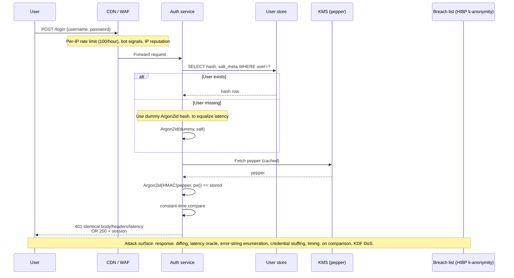

# Password Authentication in 2026

> Passwords survive the passkey migration because half the world's login surface is still browsers hitting legacy IdPs, mobile apps without WebAuthn UX, and machine accounts. The root failure mode is unchanged since 2012: users pick weak strings, reuse them across sites, and servers store them with algorithms that GPUs eat in microseconds. Modern password auth is three interlocking invariants held constant under adversarial pressure: (1) the stored verifier is a memory-hard KDF output (Argon2id at OWASP 2024 params) with per-user salt and server-side pepper, (2) the login endpoint returns identical response bytes and identical wall-clock latency for every failure class so username enumeration and timing oracles die at the door, and (3) online guessing is throttled by per-IP and per-account rate limits plus breach-list rejection at set-time so credential stuffing against a multi-billion-credential corpus has nowhere to land. If any one of those breaks, the other two do not save you.

## Quick reference

```
# PHC string format (RFC 9106 §4) as stored in users.password_hash column
$argon2id$v=19$m=47104,t=2,p=1$c29tZXNhbHRzYWx0$JBnCPMU8jK1H2fW+Yy7bQ...

# Breakdown:
#   argon2id       variant (data-independent + data-dependent hybrid)
#   v=19           Argon2 version 0x13
#   m=47104        memory cost in KiB (46 MiB, OWASP 2024 minimum)
#   t=2            time cost (iterations)
#   p=1            parallelism (lanes)
#   c29tZXNhbHRz…  16-byte salt, base64 (no padding)
#   JBnCPMU8jK1H…  32-byte tag, base64 (no padding)

# At verify time server prepends the pepper (HMAC-SHA256 with global key)
# before running Argon2id, so DB-only compromise cannot mount offline attack.

# Login response contract (POST /login) — MUST be byte-identical for all failures:
HTTP/1.1 401 Unauthorized
Content-Type: application/json
Content-Length: 47

{"error":"invalid_credentials","retry_after":null}
```

| Invariant | Where enforced | How violated | Source |
|---|---|---|---|
| Stored verifier is memory-hard KDF, per-user salt, server-side pepper | Password storage layer at set and verify | Raw SHA-256, unsalted MD5, bcrypt without pepper against SQLi | OWASP Password Storage Cheat Sheet 2024 [1]; RFC 9106 Argon2 [2] |
| Argon2id params meet or exceed m=46 MiB, t=1, p=1 (or m=19 MiB, t=2) | KDF configuration constant | Copied 2015-era params (m=4 MiB) that a $2 GPU cracks | OWASP Password Storage Cheat Sheet 2024 [1] |
| Login endpoint returns identical body, headers, and latency for wrong-user vs wrong-pass | Auth controller and rate limiter | 200ms shortcut on unknown user, different error string | OWASP ASVS v5 §6.2.2 [3]; NIST SP 800-63B rev4 §5.1.1.2 [4] |
| New passwords rejected if present in breach corpus | Set-password path, before hash | Skip check on password-reset flow only | NIST SP 800-63B rev4 §3.1.1.2 [4]; HIBP Pwned Passwords [5] |
| Reset token is 128-bit CSPRNG, single-use, ≤ 1 hour TTL, bound to user_id | Password reset service | Sequential token, no expiry, reusable, sent in URL and logged | OWASP Forgot Password Cheat Sheet 2024 [6] |
| Rate limit per-IP AND per-account; per-account lockout is soft (delay, not deny) | Edge + auth service | Hard 30-minute per-account lockout enables attacker DoS of victim | NIST SP 800-63B rev4 §5.2.2 [4]; OWASP Credential Stuffing Prevention [12] |
| No forced periodic rotation absent breach evidence | Password policy engine | 90-day mandatory rotation forcing incremental patterns (P@ss1, P@ss2) | NIST SP 800-63B rev4 §3.1.1.2 [4] |
| Minimum length ≥ 15 chars for user-chosen, no composition rules, paste allowed | Registration UI + API | maxlength=16, ban paste, require 1 upper + 1 digit + 1 symbol | NIST SP 800-63B rev4 §3.1.1.2 [4]; OWASP ASVS v5 §6.1 [3] |

## How it works

Password authentication is a three-phase protocol. Registration converts a user-chosen secret to a verifier the server can store safely. Login converts a fresh user-submitted secret to the same verifier and compares in constant time. Recovery re-establishes proof of possession through an out-of-band channel when the user forgets the secret.

### Storage: the KDF stack

The stored verifier must resist offline attack after full DB exfiltration. A modern verifier has four layers:

1. **Pepper.** Server-side global secret (32 bytes from a KMS or HSM). Applied as `HMAC-SHA256(pepper, password)` before the KDF, or as `KDF(password || pepper)`. The pepper lives outside the database in AWS KMS, HashiCorp Vault, or an HSM. SQL injection that dumps `users` does not give the attacker the pepper, so the stolen hashes are unusable offline.
2. **Salt.** Per-user random 16 bytes from `/dev/urandom` or `CSPRNG`. Prevents rainbow tables and shared-hash detection. Stored inline in the PHC string next to the hash.
3. **Memory-hard KDF.** Argon2id at OWASP 2024 minimums: `m=46 MiB, t=1, p=1` or `m=19 MiB, t=2, p=1` [1]. Memory-hardness raises the GPU/ASIC dollar cost per guess by two to three orders of magnitude versus bcrypt.
4. **PHC string encoding.** RFC 9106 recommends the PHC modular crypt format: `$argon2id$v=19$m=…$t=…$p=…$salt$tag`. Encodes the algorithm identifier and parameters inline so the verifier can be upgraded transparently.

Legacy stacks: bcrypt with cost 12 (OWASP 2024) is still acceptable, with the caveat that bcrypt truncates the input to 72 bytes. The workaround is to pre-hash with SHA-256 or HMAC-SHA-256 (using the pepper) then base64-encode into bcrypt's 72-byte window. Naive `bcrypt(password)` on a 100-char passphrase silently discards bytes 73+, so `A×72 + "attacker"` collides with `A×72 + "victim"`. scrypt at `N=2^17, r=8, p=1` (128 MiB) is acceptable where Argon2 libraries are unavailable. PBKDF2-SHA256 at 600,000 iterations is the fallback for FIPS-constrained environments, but it is not memory-hard and offers materially weaker offline resistance [1].

### Login flow



### Breach-list check at set-time

When a user submits a new password (registration, password change, or reset), the server checks it against the HIBP Pwned Passwords corpus (~1B unique SHA-1 hashes as of 2025) before hashing. The k-anonymity API keeps the plaintext private: client SHA-1s the password, sends the first 5 hex chars of the digest to `api.pwnedpasswords.com/range/{prefix}`, receives ~800 suffixes with occurrence counts, and checks locally [5]. High-traffic sites mirror the full 40 GB corpus into a local Bloom filter (tunable false-positive rate; 0.1% FPR at 60 GB) to avoid the outbound call and its latency variance.

### Reset flow

Password reset is the credential-recovery back door and historically the biggest source of account takeover. The invariants: reset token is 128 bits from `CSPRNG`, single-use, expires in ≤ 60 minutes, bound to the user_id server-side (not derived from user_id), delivered out-of-band (email link), and the initiating endpoint returns the identical response whether the email exists or not. See [12-authentication-session.md](./12-authentication-session.md) for the session lifecycle after login and [17-cryptographic-failures.md](./17-cryptographic-failures.md) for the KDF crypto guarantees.

## Attack techniques

### 1. Offline cracking of exfiltrated hashes

The dominant offline attack class since 2012. An SQL injection, backup exposure, or insider dump lands the entire `users` table on hashcat-friendly infrastructure. The economics are set by the KDF: unsalted SHA-1 at 100 GH/s on a single RTX 4090 breaks 90% of an 8-character corpus in a weekend; bcrypt cost 10 is 15 kH/s on the same hardware; Argon2id at OWASP 2024 params drops to ~200 H/s per GPU because the memory bandwidth (not compute) becomes the bottleneck.

Payload: attacker runs `hashcat -m 22300 -a 0 hashes.txt rockyou.txt` (Argon2id) or `hashcat -m 3200` (bcrypt). Wordlists blend RockYou (14M passwords from 2009), HIBP corpus (~1B unique), and target-specific mangling rules ($company2024!, $company2025!).

Black-box confirmation: you cannot detect offline attack from the target directly. Confirm via canary accounts (register a canary email at the target with a unique password appearing nowhere else, monitor for login attempts elsewhere) or via public paste-site scrapers picking up the dump. Post-breach forensics compare the hash algorithm ID in the dump against the current codebase to distinguish stale hashes from live ones.

Escalation: cracked passwords fuel credential stuffing across every site the user touched. LinkedIn 2012 seeded stuffing attacks that still work in 2026 because ~15% of the world reused those passwords and never changed them<sup>[[7]](#ref7)</sup>.

### 2. Username enumeration via response diffing

The auth endpoint tells the attacker "this account exists, keep guessing" through any observable difference between wrong-username and wrong-password. Common leaks: different error strings ("User not found" vs "Invalid password"), different HTTP status codes, different response bodies (extra `retry_after` field only on real accounts), different Set-Cookie behavior, different response sizes.

Payload: attacker submits `POST /login` with a candidate email and a garbage password 20 times, correlates responses. If real emails return `{"error":"invalid_password","attempts_left":4}` and fake emails return `{"error":"invalid_credentials"}`, enumeration is trivial. Registration endpoints leak worse: `POST /register` with an existing email returns 409 versus 200-then-verify-email for a fresh one.

Black-box confirmation: send two requests, one with a plausible username and one with `random-nonexistent-{uuid}@example.com`. Diff response bytes, headers, status, and Set-Cookie. Repeat 10 times and check latency percentiles; if p50 for known users is 45ms and unknown users is 12ms, the codepath skipped the KDF and enumeration works via timing even if the bytes match<sup>[[3]](#ref3)</sup>.

Escalation: enumerated usernames feed targeted password spraying (top 10 passwords against 100k confirmed real accounts) and phishing campaigns. The 2019 Facebook enumeration class via the "reset password" flow leaked account existence for millions of contact identifiers before it was patched<sup>[[8]](#ref8)</sup>.

### 3. Credential stuffing

Attackers replay username/password pairs from prior breaches against a target site, betting on password reuse. The economics are lopsided: with a 3-billion-credential HIBP corpus and a 0.5% reuse hit rate, an attacker gets 15 million valid logins per successful campaign against a large consumer site.

Payload: distributed bot network (Bright Data, IPRoyal, or a residential proxy pool) hits `POST /login` at 1-2 requests per IP per minute across 100k IPs, rotating User-Agent and TLS fingerprint. Modern stuffing toolkits (Sentry MBA descendant, OpenBullet 2) support CAPTCHA-solving services and TLS-fingerprint spoofing to defeat JA3/JA4-based detection.

Black-box confirmation: from a defender seat, watch for the login endpoint's success rate collapsing (from 92% typical to 0.4% during a stuffing wave), sudden geographic diversity in IP origins hitting the same accounts, and Accept-Language / TLS-fingerprint / User-Agent trigrams that cluster tightly. Confirm out-of-band by seeding tripwire credentials into leaked-credential monitors (SpyCloud, Enzoic) and watching for login attempts using those exact strings.

Escalation: successful stuffing yields fresh valid sessions used for financial fraud, gift-card cashout, loyalty-point drain, or lateral movement into higher-value SSO tenants. The Disney+ 2019 launch-day stuffing attack netted thousands of hijacked accounts sold on the dark web within 24 hours<sup>[[9]](#ref9)</sup>.

### 4. Timing oracle on hash comparison

If the server compares the freshly computed hash against the stored hash using non-constant-time comparison (e.g., Python `==` on bytes, or Java `String.equals`), an attacker measures byte-by-byte matches. This is largely theoretical over the internet because network jitter dwarfs the nanosecond timing difference, but on co-tenant infrastructure or over a stable LAN it is exploitable.

Payload: attacker sends `POST /login` 10,000 times per candidate hash prefix, measures response latency at nanosecond resolution using shared-CPU cache side channels or Kocher-style statistical timing. Practical against MACs and HMACs; against KDF outputs the KDF compute variance usually swamps the comparison.

Black-box confirmation: statistical timing analysis with n>10^6 samples per hypothesis. Detectable in code review far more cheaply: grep for `==` or `equals()` in the hash-comparison path. Out-of-band confirmation: correlate observed response-time distributions with internal DB or KMS latency histograms exported to Prometheus; a bimodal login-latency histogram at fixed sub-microsecond granularity that does not track KMS jitter is a strong signal the comparison branches on match length.

Escalation: leaks the stored hash, converting an online problem into offline cracking. Bypassed by using `hmac.compare_digest` (Python), `MessageDigest.isEqual` (Java 6+), or `crypto_verify_32` (libsodium).

### 5. Per-account lockout DoS

A well-intentioned "lock the account after 5 failed attempts for 30 minutes" policy is a denial-of-service primitive. An attacker submits 5 wrong passwords to every account they care about (competitors, executives, journalists) and locks them out at will.

Payload: script that iterates a target list, sends 6 failed logins per account, and repeats every 30 minutes. Costs the attacker nothing, denies service to the victim indefinitely.

Black-box confirmation: register a canary account, ask a friend on a different IP to submit wrong passwords, observe whether your legitimate login is denied. If yes, the site has hard per-account lockout. Out-of-band confirmation from a defender seat: help-desk-ticket clustering around "cannot log in, account locked" spiking without a matching authentication-error spike from the users themselves, plus correlated HIBP canary-username hits arriving from unrelated IPs, indicates a lockout-abuse campaign rather than user error.

Escalation: the DoS itself is the harm in adversarial contexts (activism, journalism, competitive business); alternatively, the lockout screen may reveal enumeration data (username exists) or steer users toward the reset flow where a weaker attack lives. NIST 800-63B rev4 §5.2.2 mandates rate-limiting instead of hard lockout, and OWASP recommends per-IP + per-account soft-throttle with exponential backoff<sup>[[4]](#ref4)</sup>.

### 6. Password reset token attacks

The reset flow is the classic AuthZ back door. Attacks land on token entropy, TTL, single-use enforcement, and account binding. Weak variants: `token = md5(email + timestamp)` predictable from an attacker who knows the email and can guess the timestamp within a minute; tokens delivered as `GET /reset?email=alice@x.com&token=abc123` where the token proves nothing because it is not bound to alice; reset endpoint that returns different responses for known vs unknown emails.

Payload: attacker submits `POST /forgot-password {"email":"alice@target.com"}`, receives generic "if that email exists, we sent a link", then intercepts the reset link via a compromised email inbox, referrer leakage (link in `` in a downstream page), or a token predictable from timestamp. Alternative: host-header injection changes the reset link's origin so it points to the attacker's site, and the victim clicks; the attacker then replays the token<sup>[[10]](#ref10)</sup>.

Black-box confirmation: request reset for a known email, capture the URL, inspect the token. Length ≥ 32 hex chars? Reused if you request twice? Still valid after 24 hours? All three failure modes are common in legacy apps. For host-header injection, set `Host: attacker.com` in the reset request and check if the outbound email link uses `attacker.com`.

Escalation: full account takeover. The reset flow is a repeated finding in bug-bounty programs because the initiating endpoint returns different responses for known vs unknown emails and the token is often tied to low-entropy input; OWASP's Forgot Password Cheat Sheet documents the invariants because these classes recur across the industry<sup>[[6]](#ref6)</sup>.

### 7. Login KDF DoS

Argon2id at m=46 MiB, t=1 costs ~50-100ms of CPU and 46 MiB of RAM per attempt. An unauthenticated attacker submits 10k concurrent `POST /login` requests, exhausts server memory or CPU, and the site falls over. This is the most common reason engineers under-parametrize their KDF, which is the wrong fix.

Payload: `wrk -t 100 -c 5000 -d 60s POST https://target/login` with garbage credentials.

Black-box confirmation: monitor server memory and p99 login latency during a synthetic load test. If p99 climbs above 5 seconds at 100 rps, KDF DoS is trivial. Out-of-band confirmation: provider status pages showing 503-rate spikes on the auth service, plus internal memory-utilization dashboards climbing without a matching signed-in-user increase, distinguish KDF exhaustion from a legitimate traffic surge.

Escalation: full service outage. The correct fix is edge rate-limiting (10 req/IP/min to /login), a CAPTCHA gate after 3 failures per IP, and horizontally scaling the auth tier; not weakening the KDF.

## Defense

### Real fix

1. **Argon2id with OWASP 2024 params, pepper from KMS, per-user 16-byte salt.** Configure `m=46 MiB, t=1, p=1` for interactive login (or `m=19 MiB, t=2, p=1` on memory-constrained tiers), apply `HMAC-SHA256(pepper, password)` before Argon2id, store the PHC string plus a `pepper_version` column so pepper rotation works. Invariant enforced: offline-cracking cost per guess is O(memory-bandwidth), not O(SHA-256). Why it works: memory-hardness closes the ASIC/GPU cost asymmetry that bcrypt still leaks. Common wrong implementation: copy-pasting 2015 params (m=4 MiB) that a modern GPU cracks 100× faster; storing the pepper next to the hash in the same DB; forgetting to version the pepper for rotation<sup>[[1]](#ref1)</sup><sup>[[2]](#ref2)</sup>.

2. **Byte-identical login response and constant wall-clock latency for every failure class.** The auth controller runs Argon2id on a dummy salt+hash even when the user does not exist, then returns exactly `HTTP 401` with body `{"error":"invalid_credentials"}` and no `retry_after`, `attempts_left`, or `account_locked` field visible to unauthenticated callers. Invariant enforced: an unauthenticated attacker cannot distinguish "user does not exist" from "wrong password" from "account locked". Why it works: response diffing and latency oracles both die because the codepath is identical. Common wrong implementation: `if user is None: return 401 quickly` skips the KDF and leaks 45ms of latency delta per attempt<sup>[[3]](#ref3)</sup><sup>[[4]](#ref4)</sup>.

3. **Breach-list rejection at set-password time.** On registration, change, and reset, SHA-1 the candidate password, hit HIBP Pwned Passwords k-anonymity API with the first 5 hex chars, reject any candidate with occurrence count ≥ 1 (or ≥ 10 for a softer bar). High-throughput sites mirror the corpus locally as a Bloom filter to eliminate the outbound dependency. Invariant enforced: no password in the current breach corpus is accepted. Why it works: 90% of the value of a password policy is not "3 char classes and 12 chars", it is "not `Password123!`". Common wrong implementation: only checking on registration and skipping the reset flow; using SHA-256 instead of SHA-1 (HIBP publishes SHA-1)<sup>[[4]](#ref4)</sup><sup>[[5]](#ref5)</sup>.

4. **Per-IP and per-account rate limits, soft-throttle not hard-lock.** Edge rate limits at 100 login attempts per IP per hour (via Cloudflare, Envoy, or nginx `limit_req`), plus per-account exponential backoff (1s after 3 fails, 2s after 4, 4s after 5, capped at 30s) that recovers on any successful login from a trusted device. Invariant enforced: an attacker running 10k credentials per second gets throttled without letting the attacker DoS legitimate users by locking their accounts. Why it works: softens the tradeoff between guessing rate and DoS. Common wrong implementation: 5-strikes-and-you-are-out-for-30-min per account, which is a free DoS primitive; rate limits keyed only on session cookie (attacker rotates)<sup>[[4]](#ref4)</sup><sup>[[12]](#ref12)</sup>.

5. **Password reset tokens: 128 bits CSPRNG, single-use, ≤ 1 hour TTL, DB-bound to user_id.** Generate with `secrets.token_urlsafe(32)` or equivalent, store SHA-256(token) in the `password_resets` table with `user_id`, `expires_at`, `used_at`. Delete on use, delete on expiry. The endpoint that receives the token looks it up in the DB, checks expiry and null `used_at`, then invalidates it atomically before serving the reset form. Invariant enforced: token is unforgeable, unreplayable, non-enumerable. Why it works: entropy + binding + expiry closes every known reset-flow attack. Common wrong implementation: `token = base64(user_id + timestamp)` guessable from public data; token delivered in URL that gets logged in Referer, CDN access logs, and browser history<sup>[[6]](#ref6)</sup>.

6. **Identical response on `POST /forgot-password` regardless of email existence.** Always return `HTTP 200` with `{"message":"If an account exists for that email, we sent a reset link."}` after a constant delay ≥ 500ms. Enqueue the actual email send asynchronously so the sync response latency is decoupled from whether the account exists. Invariant enforced: the reset endpoint is not an enumeration oracle. Why it works: closes the enumeration path that dozens of consumer sites have leaked through. Common wrong implementation: returning `HTTP 404` for unknown emails, or sending the email synchronously so real-account responses take 200ms longer than unknown-account responses, or including `"user_id":123` in the success body only when the user exists<sup>[[6]](#ref6)</sup>.

### Defense in depth

7. **NIST 800-63B rev4 password policy: ≥ 15 chars for user-chosen, no composition rules, no forced rotation absent breach.** Allow all printable ASCII plus Unicode, allow paste, allow password managers, allow spaces. Rationale: composition rules (1 upper, 1 digit, 1 symbol) push users to `Password1!` variants that hashcat rules crack in seconds; forced 90-day rotation pushes users to `Password1! → Password2! → Password3!`. Common wrong implementation: `maxlength=16` in the HTML input blocking passphrases; `autocomplete=off` breaking password managers<sup>[[4]](#ref4)</sup>.

8. **CAPTCHA gate after N failures per IP, not on the first attempt.** Trigger hCaptcha or Cloudflare Turnstile challenge after 3 failed logins per IP in 15 minutes, or on any login where device fingerprint is unknown. First-attempt CAPTCHA trains users to click through it reflexively and adds friction that pushes users to weaker channels. Common wrong implementation: reCAPTCHA v2 on every request (bot-solved for $2 per 1000)<sup>[[12]](#ref12)</sup>.

9. **Device-fingerprint and behavioral signals gate risky logins to a second factor.** Signals: TLS/JA4 fingerprint, screen resolution, timezone, prior-successful-device cookie (long-lived, HttpOnly, SameSite=Lax). A login from a known device with a valid password proceeds; a login from a novel device requires a second factor (TOTP, WebAuthn, or email link). See [12-authentication-session.md](./12-authentication-session.md) for session state and rotation<sup>[[12]](#ref12)</sup>.

10. **Constant-time hash comparison in the KDF library, not user code.** Use the KDF library's built-in `verify()` (`argon2.PasswordHasher.verify`, `bcrypt.checkpw`) which handles constant-time comparison internally. Never write `if computed_hash == stored_hash:` in application code. Common wrong implementation: Java `String.equals` on the base64-encoded hash string leaks byte-by-byte match timing<sup>[[3]](#ref3)</sup>.

11. **Rotate pepper on schedule, and on any suspected KMS compromise.** Version the pepper (`pepper_v1`, `pepper_v2`), store `pepper_version` per user, verify with the historical pepper matching the row, opportunistically rehash on successful login with the current pepper. See [17-cryptographic-failures.md](./17-cryptographic-failures.md) for key-rotation patterns<sup>[[13]](#ref13)</sup>.

12. **Monitor for stuffing waves: success-rate drop, IP-fingerprint entropy spike, geographic dispersion.** Alert when login success rate drops below 70% of the 24-hour baseline, or when the top 100 IPs hitting `/login` in a 5-minute window have JA4 fingerprint entropy above a threshold indicative of automation<sup>[[12]](#ref12)</sup>.

## Detection and telemetry

Structured log fields on every login attempt: `user_id_hash` (SHA-256 of user_id, never username), `ip`, `user_agent`, `ja4_fingerprint`, `device_cookie_seen` (bool), `result` (`success`, `bad_password`, `bad_username`, `throttled`, `mfa_required`), `latency_ms`, `pepper_version`, `kdf_variant`. Never log the password, the hash, or the pepper. `user_id_hash` prevents log-exposure enumeration if logs leak.

Login-success-rate is the top-line stuffing signal: alert when the 5-minute success rate for `/login` drops below 70% of the 7-day baseline. Cross-reference with IP-diversity: a stuffing wave has thousands of distinct IPs each contributing 2-5 attempts, whereas a broken-client bug has one IP hammering.

Password-reset-flow telemetry: alert on any single user_id receiving > 3 reset emails in 24 hours (account-targeting attack), alert on any single IP triggering resets for > 10 distinct users in an hour (enumeration or takeover campaign), alert on reset-token TTL exhaustion rate spiking (users clicking stale links may indicate phishing lookalikes competing for their attention).

Canary passwords: seed 100 tripwire credentials into HIBP mirrors and SpyCloud watchlists, alert if any of those exact strings ever hit `/login`. Since the canary passwords were never registered anywhere, a hit means an attacker got them from a breach mirror and is stuffing your site.

KDF-parameter drift: emit a metric on every login recording the `pepper_version` and `kdf_params` on the stored row. Alert when the p99 of stored `kdf_params` falls behind the current-config value, indicating rehash-on-login is not converging and a param upgrade never propagated.

## Interviewer probes

**Q: Why Argon2id and not Argon2i or Argon2d?**

Mid: Argon2id is the hybrid variant recommended by RFC 9106 for password hashing because it resists both side-channel attacks (Argon2i strength) and GPU cracking (Argon2d strength).

Principal: Argon2i uses data-independent memory access, so its memory access pattern does not depend on the password, defending against cache-timing side channels; Argon2d uses data-dependent access, which is faster and harder to accelerate on GPUs but leaks through cache timing on shared infrastructure. Argon2id runs the first half-pass as Argon2i (locks in the side-channel defense while the state is small) then switches to Argon2d for the remaining passes (gets the GPU-resistance benefit). RFC 9106 §4 recommends Argon2id as the default for password storage and Argon2i only when side-channel resistance is the dominant threat and GPU cost matters less. Public Argon2 side-channel analyses (the tromp/tradeoff attacks discussed in the Password Hashing Competition post-mortem) are what forced the hybrid design in the first place [2].

**Q: A junior asks why you cannot just use SHA-256 with a salt. What is the two-sentence answer?**

Mid: SHA-256 is a general-purpose hash designed for speed, so a $2000 GPU rig computes ~50 GH/s of SHA-256, meaning it can try 50 billion passwords per second per GPU.

Principal: A password hash must be intentionally slow and memory-hard. SHA-256 fits in a few kilobytes of on-chip state so it parallelizes to thousands of ASIC cores at negligible unit cost; Argon2id at 46 MiB per attempt requires 46 MiB of DDR per parallel guess, which is priced in dollars per lane rather than cents per thousand lanes. LinkedIn 2012 was unsalted SHA-1 (functionally the same problem), and 90%+ of the 117M hashes were cracked publicly within days<sup>[[7]](#ref7)</sup>. Two orders of magnitude in dollar-cost-per-guess is the entire security margin against offline cracking of an exfiltrated DB.

**Q: bcrypt has a 72-byte input limit. Do you care?**

Mid: Yes, if I let users pick passphrases over 72 bytes, bcrypt silently truncates and two long passphrases with the same 72-byte prefix collide. The fix is to pre-hash with SHA-256 or HMAC before bcrypt.

Principal: The 72-byte limit comes from bcrypt's Blowfish key schedule, which uses at most 576 bits of input material. Two failure modes: (1) collision (`A*72 + "attacker"` and `A*72 + "victim"` produce the same hash), (2) truncation waste (a 100-char passphrase provides no more entropy than its first 72 chars). The standard workaround is `bcrypt(base64(HMAC-SHA256(pepper, password)))`, which produces a fixed 44-byte input under the 72-byte cap and folds in the pepper. Ashley Madison 2015 shipped both bcrypt cost-12 and a legacy MD5 loginkey column in parallel, and the MD5 column made 99% of the 36M passwords crackable regardless of the bcrypt column, which is a reminder that "we use bcrypt" is not a defense if a weaker column shares the row [1]. Modern deployments should prefer Argon2id, which has no input length limit and is memory-hard; bcrypt-with-pre-hash is the compatibility path for existing bcrypt columns, not the target design.

**Q: Walk me through the exact response bytes for a wrong-username login versus a wrong-password login. What are you trying to guarantee?**

Mid: Both return `HTTP 401` with body `{"error":"invalid_credentials"}` and no other differences. The goal is that an unauthenticated attacker cannot enumerate valid usernames.

Principal: Byte-identical status, headers, and body, plus wall-clock latency within one standard deviation of each other. The implementation trick is that on unknown-user, the auth handler still runs Argon2id against a dummy hash so the CPU time is identical, and it still fetches the pepper so the KMS latency is identical. Anything less leaks: a shortcut `if user is None: return 401` immediately shaves 50ms off unknown-user responses; a subtle `Set-Cookie: session_scaffold=` only on real users leaks through header diff; a `retry_after` field only present when the account is locked leaks locked-account state. NIST 800-63B rev4 §5.1.1.2 and OWASP ASVS v5 §6.2.2 both require identical response for these failure classes [3][4].

**Q: Why should you not force periodic password rotation?**

Mid: NIST 800-63B rev4 §3.1.1.2 explicitly says not to require rotation absent evidence of compromise, because forced rotation pushes users to predictable variants (`Password1 → Password2`) that are strictly worse than a stable strong password.

Principal: The original 90-day rotation policy dates to a 1980s NIST document that assumed passwords were the only auth factor and the primary threat was long-term offline crack of a hash file. In 2026 the threat model flipped: the dominant attack is credential stuffing against reused breach corpus passwords, and forced rotation lowers user entropy by pushing them into predictable patterns while creating no security benefit. NIST SP 800-63B (from rev 3 in 2017 onward) formally withdrew the periodic-rotation requirement, and Microsoft removed the Windows 10 baseline rotation policy in 2019 citing the same evidence base. The correct policy is rotation on breach (HIBP hit, internal detection, session anomaly) and no rotation otherwise. NIST 800-63B rev4 §3.1.1.2 codifies this; OWASP ASVS v5 §6.1 aligns [3][4].

**Q: You are designing a password reset flow. What are the six invariants?**

Mid: 128-bit CSPRNG token, single-use, short TTL, bound to user_id server-side, delivered out-of-band, identical response whether the email exists or not.

Principal: (1) Token entropy ≥ 128 bits from a CSPRNG, not a timestamp or user_id hash. (2) Single-use enforced atomically at the DB level: `UPDATE resets SET used_at = NOW() WHERE token_hash = ? AND used_at IS NULL RETURNING user_id`. (3) TTL ≤ 60 minutes, ideally 15 minutes for high-value accounts. (4) Token is bound to user_id in the `password_resets` table, not derived from user_id in a way the attacker can reproduce. (5) Delivered via email or SMS with the token in the URL, and the URL points to your canonical origin (guard against host-header injection: never build the reset URL from the incoming `Host` header). (6) The initiating endpoint returns identical response bytes and identical latency regardless of email existence, and the actual email send happens asynchronously so the sync response is decoupled from the DB lookup [6][10].

**Q: When would you accept PBKDF2 as a KDF choice in 2026?**

Mid: Only in FIPS 140-3 constrained environments where Argon2 is not on the approved algorithm list, at 600,000 SHA-256 iterations minimum.

Principal: PBKDF2-HMAC-SHA256 is the FIPS-approved password KDF under NIST SP 800-132, and US federal systems operating in FIPS 140-3 validated modules must use it (or a validated equivalent). NIST has not yet published a dedicated Argon2 SP, so Argon2id is not on the FIPS list. PBKDF2 is not memory-hard, so a GPU rig cracks it 100-1000× faster than Argon2id at equivalent CPU time. Outside FIPS constraints, choosing PBKDF2 is a mistake. The mitigation stack for PBKDF2 deployments is heavier on the peripheral defenses: aggressive rate limiting, breach-list rejection, and rapid detection of stuffing waves, because the KDF itself does less work per guess. Federal systems that ship FIPS-validated modules (AWS KMS, HashiCorp Vault Enterprise, RHEL FIPS mode) all default to PBKDF2 or scrypt today for exactly this reason [1].

**Q: What is the difference between a salt and a pepper, and why do you need both?**

Mid: Salt is per-user, random, stored inline with the hash, prevents rainbow tables. Pepper is server-side global, kept outside the database, prevents offline attack after a DB-only compromise.

Principal: Salt is a defense against precomputation and shared-hash detection: without a salt, an attacker who cracks `hash("password123")` once knows every user with that password in the dump; with a per-user salt, each user's hash is unique even for identical passwords. Salt does not need to be secret, only unique. Pepper is a defense against DB-only compromise: applied as `HMAC(pepper, password)` before the KDF, or as `KDF(password || pepper)`, so an attacker who dumps the `users` table via SQL injection but does not compromise the KMS holds hashes they cannot brute-force. Adobe 2013 shipped 3DES-ECB with a shared key and no salt plus a plaintext password-hint field, and the hint field made most of the 150M hashes trivially recoverable regardless of the encryption; that incident is the textbook illustration of why per-user salt is non-negotiable and why any side-channel that reveals plaintext hints defeats the entire storage layer<sup>[[1]](#ref1)</sup>. The pepper must be secret, and must be versioned so rotation is possible without invalidating every user's password.

## Sources

<a id="ref1"></a>[1] Password Storage Cheat Sheet. OWASP. 2024. https://cheatsheetseries.owasp.org/cheatsheets/Password_Storage_Cheat_Sheet.html

<a id="ref2"></a>[2] RFC 9106: Argon2 Memory-Hard Function for Password Hashing and Proof-of-Work Applications. IETF. September 2021. https://datatracker.ietf.org/doc/html/rfc9106

<a id="ref3"></a>[3] OWASP Application Security Verification Standard (ASVS) v5.0.0. OWASP. 2025. https://owasp.org/www-project-application-security-verification-standard/

<a id="ref4"></a>[4] NIST Special Publication 800-63B rev 4: Digital Identity Guidelines, Authentication and Lifecycle Management. NIST. 2024. https://pages.nist.gov/800-63-4/sp800-63b.html

<a id="ref5"></a>[5] Pwned Passwords, k-anonymity API v3. Have I Been Pwned. https://haveibeenpwned.com/API/v3#PwnedPasswords

<a id="ref6"></a>[6] Forgot Password Cheat Sheet. OWASP. 2024. https://cheatsheetseries.owasp.org/cheatsheets/Forgot_Password_Cheat_Sheet.html

<a id="ref7"></a>[7] LinkedIn 2012 password breach entry. Have I Been Pwned Pwned Websites. https://haveibeenpwned.com/PwnedWebsites#LinkedIn

<a id="ref8"></a>[8] Facebook account-enumeration class via password-reset endpoint. PortSwigger Daily Swig, coverage of 2019 disclosure. https://portswigger.net/daily-swig

<a id="ref9"></a>[9] Disney+ launch-day credential stuffing incident. ZDNet. November 2019. https://www.zdnet.com/article/thousands-of-hacked-disney-accounts-are-already-for-sale-on-hacking-forums/

<a id="ref10"></a>[10] Practical HTTP Host Header Attacks, including password-reset poisoning. PortSwigger Research. https://portswigger.net/research/practical-http-host-header-attacks

<a id="ref11"></a>[11] Credential Stuffing Prevention Cheat Sheet. OWASP. 2024. https://cheatsheetseries.owasp.org/cheatsheets/Credential_Stuffing_Prevention_Cheat_Sheet.html

<a id="ref12"></a>[12] Credential Stuffing Prevention Cheat Sheet (detection thresholds, device signals). OWASP. 2024. https://cheatsheetseries.owasp.org/cheatsheets/Credential_Stuffing_Prevention_Cheat_Sheet.html

<a id="ref13"></a>[13] NIST Special Publication 800-131A rev 2: Transitioning the Use of Cryptographic Algorithms and Key Lengths. NIST. 2019. https://csrc.nist.gov/pubs/sp/800/131/a/r2/final
