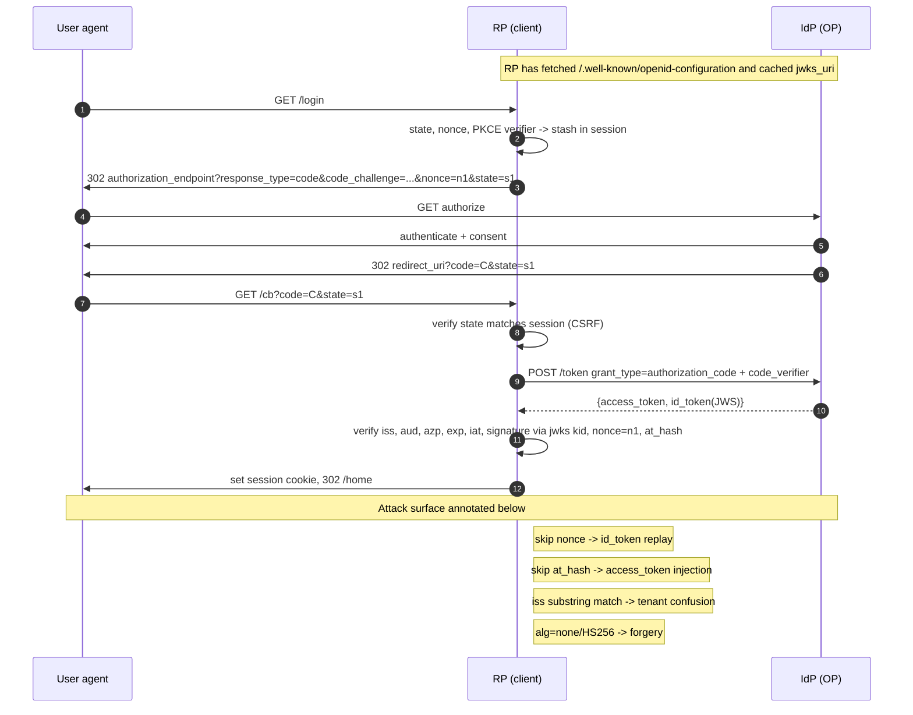

# OpenID Connect Deep Dive

> OIDC is an identity layer bolted on top of OAuth 2.0 that adds one artifact and one contract: the `id_token`, a signed JWT the IdP issues to the RP asserting who authenticated and against which client, and the rule that the RP validates that assertion before treating the user as logged in. The whole spec is a chain of hashes and nonces designed to bind an id_token to one browser session, one code, one access token, and one client, so an id_token stolen from another flow cannot be spliced in. Every real-world OIDC break traces back to breaking one link of that chain: skipping signature verification, dropping the `aud` check, ignoring `nonce`, allowing algorithm downgrade to `none` or HS256, or accepting an id_token from a co-tenant issuer. The umbrella flow, PKCE, and state live in [14-oauth-oidc.md](./14-oauth-oidc.md); JWT signature and header attacks in [13-jwt-token-security.md](./13-jwt-token-security.md); this file is the identity-layer surface, discovery, hashes, logout, and JAR/PAR/CIBA/FAPI hardening.

**Interview frequency:** Situational

## Quick reference

```
POST /token HTTP/1.1
Host: login.example.com
Content-Type: application/x-www-form-urlencoded

grant_type=authorization_code
&code=SplxlOBeZQQYbYS6WxSbIA
&redirect_uri=https%3A%2F%2Frp.example%2Fcb
&client_id=s6BhdRkqt3
&code_verifier=dBjftJeZ4CVP-mB92K27uhbUJU1p1r_wW1gFWFOEjXk

HTTP/1.1 200 OK
Content-Type: application/json
{
  "access_token":  "SlAV32hkKG",
  "token_type":    "Bearer",
  "expires_in":    3600,
  "refresh_token": "8xLOxBtZp8",
  "id_token":      "eyJhbGciOiJSUzI1NiIsImtpZCI6IjEifQ.
                    eyJpc3MiOiJodHRwczovL2xvZ2luLmV4YW1wbGUuY29tIiwKICAgICJzdWIiOiIyNDgyODk3NjEwMDEiLAogICAgImF1ZCI6InM2QmhkUmtxdDMiLAogICAgIm5vbmNlIjoibi0wUzZfV3pBMk1qIiwKICAgICJleHAiOjE1MTYyMzkyMjIsCiAgICAiaWF0IjoxNTE2MjM5MDIyLAogICAgImF0X2hhc2giOiI3N1FtVVB0alBmelduT01fVmVXQVdndyIsCiAgICAiY19oYXNoIjoiTERrdEtkb1FhazNQazBjblh4Q2x0QSJ9.
                    <signature>"
}
```

| Invariant | Where enforced | How violated | Source |
|---|---|---|---|
| `id_token.iss` equals discovery `issuer` (exact string, no trimming) | RP token validation | Trust multi-tenant `common` issuer, `wstrust.microsoft.com` mismatch, tenant confusion | OpenID Connect Core 1.0 §3.1.3.7 [1] |
| `id_token.aud` contains the RP `client_id`, and `azp` equals `client_id` when multi-audience | RP token validation | Accept any audience, skip `azp` check | OpenID Connect Core 1.0 §3.1.3.7 [1] |
| Signature verified with key from `jwks_uri` matching `kid`, `alg` in RP-configured allowlist | RP token validation | `alg=none` accepted, HS256 accepted with RSA public key as HMAC secret | OpenID Connect Core 1.0 §3.1.3.7 / RFC 7519 [1][2] |
| `nonce` in id_token equals the nonce the RP put in the authorize request for this browser | RP session state | Nonce not sent or not checked, letting stolen id_token replay | OpenID Connect Core 1.0 §3.1.2.1 / §15.5.2 [1] |
| `at_hash` present and equal to `left128(SHA-256(access_token))` when access_token returned alongside id_token | RP token validation | Hybrid flow with `token id_token` accepts injected access_token from another session | OpenID Connect Core 1.0 §3.1.3.6 / §3.2.2.9 [1] |
| `c_hash` present and equal to `left128(SHA-256(code))` in hybrid response types containing `code id_token` | RP frontchannel processing | Attacker swaps authorization code, id_token still validates | OpenID Connect Core 1.0 §3.3.2.11 [1] |
| `logout_token` from back-channel logout is a signed JWT with `events` claim `http://schemas.openid.net/event/backchannel-logout` and no `nonce` | RP logout endpoint | Accept unsigned token, allow `nonce` (indicates access-style token misuse) | OpenID Connect Back-Channel Logout 1.0 §2.4 [3] |
| Discovery `jwks_uri` cache respects `Cache-Control`, rotates on unknown `kid` with rate limit | RP JWKS client | Pin one key forever, or unbounded refetch enabling JWKS DoS pivot | OpenID Connect Discovery 1.0 §10 [4] |

## How it works

OIDC layers three things on OAuth 2.0: an id_token returned alongside (or in place of) the access_token, a `userinfo` endpoint that returns claims for a bearer access_token, and a discovery document at `/.well-known/openid-configuration` that publishes every URL and capability the RP needs. The access_token remains an opaque or JWT credential for calling APIs; the id_token is not an API credential, it is proof of authentication delivered to the RP and no one else.

### The id_token

An id_token is a signed JWT. Required claims: `iss` (the IdP's issuer URL, exact-match), `sub` (the stable pseudonymous user id within that issuer), `aud` (the RP's `client_id`), `exp`, `iat`. When more than one audience is present, `azp` must equal the client_id that requested the token. When the RP sent `nonce` in the authorize request, the IdP MUST echo it in the id_token, and the RP MUST verify it equals the value it stashed in its own session before making the request. Nonce is what binds an id_token to a specific browser interaction so an id_token phished or leaked from a different flow does not authenticate a session at the target RP.

Hybrid response types (`code id_token`, `code token id_token`, `id_token token`) deliver an id_token through the front channel (URL fragment). To keep the front-channel artifact bound to the back-channel artifacts, OIDC adds two hash claims:

- `c_hash` = base64url(left-most 128 bits of SHA-256(authorization_code)). Required whenever the response type includes `code` and `id_token`.
- `at_hash` = base64url(left-most 128 bits of SHA-256(access_token)). Required whenever `token` and `id_token` are returned together (implicit and some hybrid flows).

Without those hashes, an attacker with a stolen code or access_token can present it alongside a validly-signed id_token from a different session; the RP validates the id_token, believes the user is authenticated, and consumes the injected code or token.

### Discovery and JWKS

Discovery returns a JSON metadata document with `issuer`, `authorization_endpoint`, `token_endpoint`, `userinfo_endpoint`, `jwks_uri`, `id_token_signing_alg_values_supported`, `subject_types_supported`, `response_types_supported`, `end_session_endpoint`, plus PAR and CIBA endpoints when supported. The RP fetches this once and caches it. `jwks_uri` returns the current signing keys as a JWK Set; each key carries a `kid` the id_token header references. Rotation contract: the IdP publishes the new key before signing with it, so an RP that hits an unknown `kid` refetches JWKS, finds the key, and validates. RP libraries should rate-limit that refetch so a flood of tokens with random `kid`s does not DoS the RP or the JWKS endpoint.



### Response types and OAuth 2.1

OIDC Core defined `code`, `id_token`, `token`, and hybrid combinations. Implicit (`token`, `id_token token`) leaks tokens through browser history, referers, and web logs. OAuth 2.1 removes implicit and requires PKCE for all public clients [5]. The surviving surface for browser flows is `response_type=code` with PKCE; the id_token comes back from the token endpoint over the back channel. Hybrid (`code id_token`) is still used by FAPI 1.0 Advanced because the id_token carries `c_hash` binding the code, but FAPI 2.0 drops hybrid in favor of PAR+code+PKCE with DPoP or mTLS [6].

### Logout: three shapes

RP-initiated logout: RP redirects the browser to the IdP's `end_session_endpoint` with `id_token_hint=<original id_token>` and `post_logout_redirect_uri=<registered URL>` [7]. `id_token_hint` proves the RP knew which user was logged in, so the IdP can terminate the correct session without a login CSRF prompt.

Front-channel logout: IdP renders hidden iframes to each RP's `frontchannel_logout_uri` when a global logout happens. RP clears its cookie for that browser. Fragile because it requires third-party cookies and the browser being open [8].

Back-channel logout: IdP sends a signed `logout_token` JWT server-to-server to each RP's `backchannel_logout_uri`. The logout_token has `iss`, `aud`, `iat`, `jti`, `sub` and/or `sid`, and `events` = `{"http://schemas.openid.net/event/backchannel-logout": {}}`. It MUST NOT contain `nonce` (that would suggest it was misused as an id_token) [3]. The RP invalidates the server-side session for that `sub`/`sid`.

### JAR (RFC 9101) and PAR (RFC 9126)

A plain authorize request puts `scope`, `redirect_uri`, `state`, `nonce`, `claims`, and increasingly rich JSON parameters into a query string that traverses the user agent. Two problems: parameters leak into browser history and web logs, and any of them can be tampered with before the IdP sees the request.

JAR wraps the authorize parameters in a signed (and optionally encrypted) JWT called a request object, delivered either by value in the `request` parameter or by reference through `request_uri` [9]. The IdP verifies the signature with the client's registered key and treats the JWT's claims as authoritative, ignoring any query parameters that conflict.

PAR moves the whole thing back-channel [10]. The RP POSTs the authorization parameters (or a JAR object) to `pushed_authorization_request_endpoint` with client authentication, gets back an opaque `request_uri` valid for a short window, then redirects the browser to `authorize?client_id=...&request_uri=urn:ietf:params:oauth:request_uri:...`. Sensitive params never touch the browser. PAR is mandatory in FAPI 2.0 [6].

### CIBA

Client-Initiated Backchannel Authentication [11] separates the consumption device from the authentication device. The RP calls `/bc-authorize` with a `login_hint` identifying the user; the IdP pushes a prompt to the user's phone; the RP polls (`poll` mode) or receives a push (`ping`/`push` mode) with the tokens. Used in call-centers, ATM-style flows, and payment initiation where the browser is not the right auth surface.

### FAPI

FAPI (Financial-grade API) profiles OAuth+OIDC for high-value flows. FAPI 1.0 Baseline hardens the standard flow (PKCE, exact redirect_uri match, strong client authentication). FAPI 1.0 Advanced requires JARM, hybrid `code id_token` with `s_hash`/`c_hash`, and sender-constrained tokens via mTLS or DPoP. FAPI 2.0 Security Profile replaces hybrid with PAR + `response_type=code` + PKCE + DPoP/mTLS and drops response-mode signing in favor of PAR's integrity guarantee [6].

## Attack techniques

### 1. Signature verification skipped or downgraded

Some RP libraries treat the id_token as a JSON payload, base64-decode the middle segment, read `sub`, and log the user in. Others verify with the algorithm named in the token header, letting an attacker pick `alg=none` and strip the signature, or pick `alg=HS256` and sign with the RSA public key the RP fetched from jwks_uri (that public key becomes the HMAC secret). Both classes recur every few years. Detailed dissection in [13-jwt-token-security.md](./13-jwt-token-security.md).

Payload: mint an id_token with `iss`, `aud`, `sub=<victim>`, `exp` in the future, header `{"alg":"none"}`; if the RP accepts, hand it to the RP's callback or session-restore endpoint. Black-box confirmation: capture a legitimate id_token, flip a signature bit, replay; if the RP still authenticates the session, signature is not verified. Blind confirmation via a canary `sub` value that maps to a synthetic user; watch for that user showing up in downstream logs.

Escalation: full account takeover of any `sub` the attacker can name. In multi-tenant IdPs the same forgery works against every RP that shares the flaw.

### 2. Missing `aud` or `azp` check

An id_token issued to client A can be replayed at client B if client B never verifies that `aud` contains its own client_id. Most common in shared code paths across sibling apps registered with the same IdP tenant. The Salesforce Community login gap and multiple SaaS SSO wrappers have shipped this.

Payload: authenticate at the attacker's client A on the same IdP, capture the id_token, POST it to the victim RP B's login-with-id_token endpoint (some RPs expose one for mobile). Confirm black-box by registering a throwaway app on the same IdP, doing OIDC login there, then feeding its id_token to the target. Blind confirmation: pick an `aud` claim value the attacker controls and see whether the victim's session shows the attacker's sub or the attacker's app's registered display name in later API calls.

Escalation: cross-app takeover within a tenant. When combined with a broken `azp` check on multi-audience tokens, the attacker upgrades from co-tenant client to victim-tenant RP.

### 3. Nonce not sent or not verified (id_token replay)

The RP omits `nonce` in the authorize request, or stashes it and never checks the returned value. Any id_token with the right `aud` becomes a valid login artifact until it expires. This defeats the binding between the RP's browser session and the IdP's response and turns id_tokens into bearer session tickets.

Payload: obtain a legitimate id_token for the victim from any pathway the attacker can trigger (a phishing IdP login, a leaked front-channel fragment, log exposure) and replay it against the RP's callback. Black-box: run the flow, look at the RP's session state; if the `nonce` field is absent or if flipping it in the id_token does not break login, nonce is not bound. Blind/OOB: emit a Burp Collaborator hostname as `redirect_uri` variations while probing whether id_tokens issued for other flows are honored.

Escalation: session hijack of any user whose id_token the attacker can capture. Combines with front-channel logging or hybrid-flow fragment leaks for a full ATO chain.

### 4. Missing `at_hash` or `c_hash` in hybrid flows

Hybrid `code id_token` returns `code` and an id_token in the fragment. If the RP accepts them without checking that `c_hash` equals `left128(SHA-256(code))`, an attacker can substitute a code they obtained through a code-injection primitive elsewhere. Same story for `at_hash` with access_token in `id_token token` responses.

Payload: run two flows in parallel, attacker's own auth flow (yielding attacker's code) and the victim's auth flow (yielding victim's id_token via a leak). Replace the victim's code with the attacker's code in the callback URL; RP redeems the attacker's code, associates it with the victim's id_token session, subsequent API calls run as attacker but from within victim's session. Black-box confirmation: alter the returned code to any random string and observe whether id_token validation still succeeds; a compliant RP fails at c_hash. OOB: canary code with an out-of-band collaborator URL as `redirect_uri` on the attacker's client.

Escalation: RP now has an access_token bound to a different identity than the id_token said. Attacker actions run under one account, look like another to audit logs.

### 5. Issuer variance and multi-tenant confusion (Azure AD `common`)

Azure AD's multi-tenant endpoints allow `iss` to be `https://login.microsoftonline.com/{tenantid}/v2.0`. Apps that register with the `common` endpoint may accept any tenant, and RPs that string-match `iss` too loosely (substring, or ignoring the tenant path) accept tokens from a co-tenant IdP. The 2021 Microsoft advisory and multiple downstream CVEs (nOAuth family in 2023) trace to accepting the `email` claim as a login identifier without verifying tenant<sup>[[12]](#ref12)</sup><sup>[[13]](#ref13)</sup>.

Payload: attacker registers an Azure AD tenant, sets the target user's email as a mutable profile property, signs in against the multi-tenant app; the id_token's `email` claim is attacker-controlled, `iss` points at attacker's tenant. RP authenticates by email. Black-box: check whether the RP allows login from any tenant when only registered against `common`. Blind confirmation: watch for tenant IDs other than the app's registered tenant showing up in RP audit logs.

Escalation: full ATO across every user of the target RP whose email is knowable. Real-world impact was extensive on SaaS admin panels wired to Entra ID.

### 6. Front-channel id_token / access_token leak via referer or logs

Implicit and hybrid flows deliver tokens in URL fragments. Fragments do not travel with `Referer`, but JavaScript on the callback page can copy them into cookies, LocalStorage, tracking pixels, or query parameters that then leak. Browser history, browser-sync, CDN and WAF query logs, and third-party analytics all capture tokens that live in URL segments.

Payload: XSS on the callback page or a permissive third-party script running on it exfiltrates `window.location.hash`. Confirm by injecting `` on the callback route and watching the attacker's log. Blind via Collaborator URLs pinned as post-login redirect targets.

Escalation: token replay against the RP if nonce and audience checks are also weak; where those are enforced, the leak still bypasses `at_hash` binding if the attacker can pair the leaked access_token with a self-issued id_token they can forge via technique 1.

### 7. JWKS pinning, DoS, and key confusion

RPs that pin a single JWK forever break silently when the IdP rotates and start rejecting all tokens; RPs that unconditionally refetch JWKS on every unknown `kid` can be pivoted into a JWKS-endpoint DoS by an attacker who mints tokens with random `kid`s. A subtler bug: the RP fetches `jwks_uri` over an unauthenticated HTTP proxy or DNS-poisonable resolver, letting an attacker swap the JWK set entirely and issue forged tokens signed with an attacker key.

Payload: mass token flood with random `kid` header values; measure RP JWKS refetch behavior with a Collaborator-instrumented JWKS URL. Confirm blind by mismatching `kid` and watching for JWKS fetch storms. Escalation: full forgery if the attacker can replace `jwks_uri` content (via HTTP MITM, SSRF into IdP-adjacent infra, DNS rebind on the JWKS host).

### 8. Back-channel logout token confusion

RPs implementing back-channel logout sometimes route the `logout_token` through the same validator as `id_token`. A `logout_token` with `nonce` present, or missing the `events` claim, or containing a session-like `sub` claim, can be reinterpreted as an id_token and used to log a session in rather than out<sup>[[3]](#ref3)</sup>. Some RPs also accept `logout_token`s from any known IdP kid without confirming the token type at all.

Payload: the IdP (or an attacker who compromised one signing key) mints a JWT with `iss`, `aud`, `sub=<victim>`, no `events` claim, replayed to the RP's `/oidc/callback` instead of the logout URL. Black-box: submit a well-formed logout_token to the login callback and watch for a session cookie response. OOB: instrument distinct `jti` values and see whether they surface as logged-in sessions.

Escalation: cross-endpoint reuse of one signed token becomes ATO. Fix is strict `typ` check (`logout+jwt`) and `events` claim assertion.

### 9. RP-initiated logout without `id_token_hint`

The `end_session_endpoint` accepts `post_logout_redirect_uri`. Without `id_token_hint`, an attacker can craft a link that logs the victim out at the IdP and redirects them to an attacker-controlled URL that mimics the RP login page. Combined with a suggestion to "sign in again," it's a credible phishing vector.

Payload: `https://idp.example.com/logout?post_logout_redirect_uri=https://attacker.example/fake-login`. Confirm by loading that link, checking that the IdP redirects without confirmation, watching whether the attacker URL is in the registered allowlist. Escalation: credential capture on the fake login page, then normal authenticated attack.

## Defense

### Real fix

1. Validate id_token per OIDC Core §3.1.3.7 in this exact order: parse header, check `alg` in the RP's allowlist (RS256/PS256/ES256 typical, never `none`, never HS* with public-key IdPs), look up key by `kid` from the cached jwks_uri, verify signature, then check `iss` (exact string equality against the discovery `issuer`), `aud` (contains client_id), `azp` (equals client_id if present or if `aud` is multi-valued), `exp`/`iat` with clock skew under 60 seconds, `nonce` equal to session-stashed value, and `at_hash`/`c_hash` when the response type dictates. Invariant enforced: every claim that can influence session state is authenticated by the IdP's signature and bound to this flow. Why it works: attackers cannot forge signatures they lack the key for, and cannot replay valid tokens because nonce and hash claims tie them to one browser and one code. Common wrong implementation: using a JWT library's default "decode" that skips verification, or splitting the checks across layers so `aud` runs in one middleware and signature in another and either can be bypassed by unusual header sets. Source: OIDC Core 1.0 §3.1.3.7<sup>[[1]](#ref1)</sup>.

2. Use `response_type=code` with PKCE and prefer PAR; drop implicit and hybrid unless a FAPI 1.0 Advanced profile requires them. Invariant enforced: sensitive artifacts never traverse the user agent as URL parameters. Why it works: without a front-channel token or code, techniques 4 and 6 have no artifact to steal or splice. Common wrong implementation: keeping a legacy `response_type=id_token token` endpoint alive for backward compatibility with a single mobile client that could have moved to code+PKCE. Source: OAuth 2.1<sup>[[5]](#ref5)</sup>, PAR RFC 9126<sup>[[10]](#ref10)</sup>.

3. Verify issuer with exact-string equality after resolving the discovery document. For multi-tenant IdPs, either register the specific tenant issuer, or during RP session bootstrap look up the expected tenant issuer from the account record and match against that. Invariant enforced: only tokens from the pre-approved issuer instance authenticate this account. Why it works: nOAuth-style attacks depend on the RP treating `email` as a global identifier across tenants; strict issuer + tenant-scoped account lookup makes attacker-tenant tokens irrelevant. Common wrong implementation: accepting any `iss` matching `startswith("https://login.microsoftonline.com/")` and identifying users by `email` claim. Source: Microsoft nOAuth guidance<sup>[[12]](#ref12)</sup>, Descope nOAuth advisory<sup>[[13]](#ref13)</sup>.

4. Cache `jwks_uri` results with the response's `Cache-Control`, rotate on unknown `kid` with a per-issuer rate limit (for example, one refetch per 60 seconds), fetch over HTTPS with certificate pinning to the IdP's known CA chain, and cap the number of keys and their sizes. Invariant enforced: signing-key rotation is deterministic and cannot be triggered as a resource-exhaustion or key-confusion primitive. Why it works: pinning defeats DNS or MITM key swaps; rate-limited rotation defeats the JWKS-flood DoS pivot from technique 7. Common wrong implementation: refetching JWKS on every token, or hard-coding one JWK and never rotating. Source: OIDC Discovery 1.0<sup>[[4]](#ref4)</sup>.

5. Distinguish token types by header `typ` and by claim shape. `id_token` has `typ` empty or `JWT` and carries `nonce` and audience-bound claims; `logout_token` has `typ=logout+jwt` and carries the `events` claim without `nonce`. Route each to its own validator on its own endpoint and reject cross-shape tokens. Invariant enforced: no signed JWT can be repurposed across OIDC endpoints. Why it works: technique 8 breaks the moment `events` is required at the logout endpoint and forbidden at the login endpoint. Common wrong implementation: one generic "validate JWT from IdP" helper that returns true if signature and `aud` are fine. Source: OIDC Back-Channel Logout 1.0 §2.4<sup>[[3]](#ref3)</sup>.

### Defense in depth

1. Require `id_token_hint` at the `end_session_endpoint`. The IdP refuses logout redirects to `post_logout_redirect_uri` unless the hint is a currently-known id_token for the session. Source: OIDC RP-Initiated Logout 1.0<sup>[[7]](#ref7)</sup>.

2. Restrict `post_logout_redirect_uri` to a registered exact-match allowlist per client, same discipline as `redirect_uri`. Blocks the redirect-to-phish leg of technique 9.

3. Prefer back-channel logout over front-channel. Server-to-server logout_token delivery survives third-party cookie blocking and does not rely on the browser being open. Source: OIDC Back-Channel Logout 1.0<sup>[[3]](#ref3)</sup>, OIDC Front-Channel Logout 1.0<sup>[[8]](#ref8)</sup>.

4. Adopt PAR for high-value flows; require it for FAPI 2.0. Sensitive parameters (`claims`, `login_hint`, custom acr requests) never enter the browser. Source: RFC 9126<sup>[[10]](#ref10)</sup>, FAPI 2.0 Security Profile<sup>[[6]](#ref6)</sup>.

5. Adopt JAR (signed request objects) when clients need integrity on authorize params without moving the whole request server-to-server. Source: RFC 9101<sup>[[9]](#ref9)</sup>.

6. Sender-constrain access_tokens with DPoP or mTLS. An access_token that leaks (via technique 6 or elsewhere) is worthless without the private key. Cross-link [78-token-exchange.md](./78-token-exchange.md) for downstream service exchange, and [14-oauth-oidc.md](./14-oauth-oidc.md) for DPoP mechanics.

7. Use CIBA for out-of-band consumption devices (call centers, TV apps, payments) rather than smuggling credentials or copying browser sessions. Source: OpenID Connect CIBA<sup>[[11]](#ref11)</sup>.

8. Include `iss` in authorization response (RFC 9207) so RPs can detect mix-up attacks in which one IdP's response is fed to a client expecting another IdP. Source: RFC 9207<sup>[[14]](#ref14)</sup>.

9. Log and rate-limit id_token replays by `jti` where present, and by (`iss`,`sub`,`nonce`) tuples otherwise. Bind server session cookies to the id_token's `sid` when the IdP issues one, so back-channel logout can target exact sessions.

## Detection and telemetry

Log at the RP's token-validation boundary: `iss`, `aud`, `azp`, `kid`, `alg`, presence and match of `nonce`, presence and match of `at_hash`/`c_hash`, JWKS-cache hit/miss, and the reason for any rejection. A validation failure spike bucketed by reason distinguishes buggy client rollouts from active attack.

Alerts worth wiring: `alg=none` or unexpected `alg` seen at the validator (should be zero); `kid` unknown after JWKS refetch (attacker probing or rotation glitch); `iss` outside the registered tenant list; `aud` for a different client_id on the RP's ingress; nonce mismatch rate above baseline; `at_hash` or `c_hash` mismatch (should be zero outside library upgrades); logout_token missing `events` or with `nonce` present (technique 8); JWKS refetch rate exceeding the configured rate limit.

Canaries: mint a synthetic id_token with `sub` reserved for tripwire and see whether it authenticates anywhere; register a "canary" tenant on the multi-tenant IdP and confirm the RP rejects its tokens; run a scheduled `end_session_endpoint` probe with a bogus `post_logout_redirect_uri` and expect a hard reject. Cross-reference with [14-oauth-oidc.md](./14-oauth-oidc.md) for state and PKCE detection.

## Interviewer probes

**Q1. Why is `nonce` mandatory in OIDC when OAuth's `state` already handles CSRF?**

Mid: `state` binds the redirect to the RP's browser session; `nonce` binds the id_token itself to that session.

Principal: `state` lives on the redirect step. It defeats CSRF against the callback, and it does nothing to prove the id_token you got back was minted for this specific interaction. `nonce` is stashed by the RP in the session, sent into the authorize request, echoed by the IdP inside the signed id_token, and rechecked by the RP. That binding means an id_token stolen or leaked from any other flow cannot authenticate this one. Implicit and hybrid especially depend on `nonce` because the id_token traverses the front channel; even in pure code flow, keeping `nonce` on gives the RP a cheap replay defense that survives log leaks.

**Q2. When is `at_hash` required, and what breaks if you skip it?**

Mid: whenever an access_token is returned alongside an id_token. Skipping it lets an attacker splice a different access_token into the flow.

Principal: OIDC Core §3.2.2.9 requires `at_hash` in implicit `id_token token` responses, and §3.3.2.11 requires it in hybrid responses that include both. It is the left-most 128 bits of SHA-256 over the access_token octets, base64url-encoded. The purpose is to defeat a code-injection-like attack against the front-channel access_token: without the hash, an attacker can present a valid id_token from one session and an access_token from another, and the RP proceeds. `c_hash` plays the same role for the authorization code in hybrid `code id_token`. If your RP is on pure code+PKCE it never sees these hash claims, and that is the point of moving off hybrid.

**Q3. Explain the Azure AD `common` endpoint issuer trap.**

Mid: multi-tenant apps that trust `email` or a substring `iss` can be logged into from any attacker-controlled tenant.

Principal: Entra ID lets an app be registered as multi-tenant with issuer `https://login.microsoftonline.com/{tid}/v2.0`. If the RP checks `iss` with a `startswith` on the shared prefix and then looks up the local account by `email`, an attacker registers their own tenant, sets a user's `mail` attribute to the victim's email at the target RP (Microsoft lets you set this without proving ownership on some object shapes), signs in against the RP, and the id_token authenticates the victim's local account. The nOAuth advisories in 2023 showed dozens of SaaS apps in this trap. Fix: verify `iss` exactly, tie local accounts to `(iss, sub)` not `email`, and honor Microsoft's "xms_edov" email-verified claim; require it before treating email as trustworthy.

**Q4. What does PAR give you that JAR does not?**

Mid: PAR moves the whole authorize request off the browser; JAR keeps the request in the browser but signs it.

Principal: JAR (RFC 9101) wraps authorize params in a signed JWT so the IdP can trust them even though they arrive via the user agent. That defeats parameter tampering but does not stop the params from being logged by browser history, WAFs, or third-party scripts, and `request_uri` if used lets JAR objects live on the RP side. PAR (RFC 9126) requires the RP to POST the params to the IdP over an authenticated back channel first, get an opaque `request_uri`, then redirect the browser only with `client_id` and that URI. Sensitive fields (`claims`, `login_hint`, custom acr) never touch the user agent, and the IdP knows before authorize begins exactly what request is happening. FAPI 2.0 makes PAR mandatory.

**Q5. Back-channel vs front-channel logout, why does spec ban `nonce` in `logout_token`?**

Mid: to make sure the logout_token cannot be reused as an id_token.

Principal: back-channel logout tokens carry `iss`, `aud`, `iat`, `jti`, `events`, and `sub`/`sid`. The spec forbids `nonce` because a JWT with `nonce` and the right shape can be replayed against the RP's login callback if the RP has a generic "trust any JWT signed by IdP with matching aud" validator. That token-confusion attack is the reason OIDC Back-Channel Logout §2.4 lists `nonce` as prohibited and mandates `events` as required and `typ=logout+jwt` in the header. Front-channel logout is fragile because it renders iframes back to each RP; third-party cookie blocking now kills it in most browsers, so serious deployments have moved to back-channel.

**Q6. If `alg=none` is universally known-bad, why do RPs still ship it?**

Mid: JWT libraries default to header-driven algorithm selection, and RPs use "decode" helpers that skip verification.

Principal: The pattern is that a developer needs to read a claim before validating (say, look up the `kid` or the `iss` to know which JWKS to fetch), reaches for the library's `decode()` method, and never calls `verify()` afterward. That is functionally the same as accepting `alg=none`. The other class is header-driven `alg`: the library uses whatever the token says, and if the RP fetches a public key JWK for RS256, but the token declares HS256, the library treats the public key bytes as the HMAC secret and the signature validates. Fix is an explicit algorithm allowlist enforced at library level, not at header level, plus type discipline that never lets an "unverified" token escape the parser. Cross-link [13-jwt-token-security.md](./13-jwt-token-security.md) for the full JWT surface.

**Q7. How do you cache `jwks_uri` correctly?**

Mid: honor Cache-Control, refetch on unknown `kid`, rate-limit refetch.

Principal: The RP fetches JWKS once at boot, caches with the response's `Cache-Control: max-age`, and refetches when a valid token references a `kid` not in the cache. That refetch has to be rate-limited per issuer (say, one per 60 seconds) so an attacker minting random-kid tokens does not cause a fetch storm against the IdP or force JWKS-endpoint congestion at the RP. The fetch itself uses HTTPS with the IdP's expected certificate chain (or explicit pinning where policy demands it) so an attacker cannot swap the JWK set via DNS or MITM. Rotation contract: IdPs publish the new key before signing with it, giving RPs a window to pick up the key without a rejection blip.

**Q8. FAPI 1.0 Advanced still uses hybrid; FAPI 2.0 drops it. Why the reversal?**

Mid: PAR gives the same integrity property as `c_hash` without needing a front-channel id_token.

Principal: FAPI 1.0 Advanced was written when PAR did not exist, so the response type `code id_token` served two purposes: return an id_token quickly, and bind the code to it via `c_hash` so a code-injection attack was impossible. It also introduced JARM to sign the whole response. PAR (RFC 9126) accomplishes the request-side integrity guarantee before the redirect happens; combined with PKCE binding the code to a device secret and mTLS/DPoP binding the access_token to a client key, FAPI 2.0 no longer needs hybrid to reach the same security bar. The result is a simpler flow (pure `code`) with fewer artifacts to leak.

## Sources

<a id="ref1"></a>[1] OpenID Connect Core 1.0 incorporating errata set 2. OpenID Foundation. 2023. https://openid.net/specs/openid-connect-core-1_0.html

<a id="ref2"></a>[2] RFC 7519 JSON Web Token (JWT). IETF. 2015. https://datatracker.ietf.org/doc/html/rfc7519

<a id="ref3"></a>[3] OpenID Connect Back-Channel Logout 1.0. OpenID Foundation. 2022. https://openid.net/specs/openid-connect-backchannel-1_0.html

<a id="ref4"></a>[4] OpenID Connect Discovery 1.0 incorporating errata set 1. OpenID Foundation. 2014. https://openid.net/specs/openid-connect-discovery-1_0.html

<a id="ref5"></a>[5] The OAuth 2.1 Authorization Framework (draft-ietf-oauth-v2-1). IETF. 2024. https://datatracker.ietf.org/doc/draft-ietf-oauth-v2-1/

<a id="ref6"></a>[6] FAPI 2.0 Security Profile. OpenID Foundation. 2024. https://openid.net/specs/fapi-2_0-security-profile.html

<a id="ref7"></a>[7] OpenID Connect RP-Initiated Logout 1.0. OpenID Foundation. 2022. https://openid.net/specs/openid-connect-rpinitiated-1_0.html

<a id="ref8"></a>[8] OpenID Connect Front-Channel Logout 1.0. OpenID Foundation. 2022. https://openid.net/specs/openid-connect-frontchannel-1_0.html

<a id="ref9"></a>[9] RFC 9101 The OAuth 2.0 Authorization Framework: JWT-Secured Authorization Request (JAR). IETF. 2021. https://datatracker.ietf.org/doc/html/rfc9101

<a id="ref10"></a>[10] RFC 9126 OAuth 2.0 Pushed Authorization Requests (PAR). IETF. 2021. https://datatracker.ietf.org/doc/html/rfc9126

<a id="ref11"></a>[11] OpenID Connect Client-Initiated Backchannel Authentication (CIBA) Flow Core 1.0. OpenID Foundation. 2021. https://openid.net/specs/openid-client-initiated-backchannel-authentication-core-1_0.html

<a id="ref12"></a>[12] Microsoft Entra ID: Guidance for multi-tenant applications on using claims to identify users (nOAuth mitigations). Microsoft Learn. 2023. https://learn.microsoft.com/entra/identity-platform/claims-validation

<a id="ref13"></a>[13] nOAuth: How Microsoft OAuth misconfiguration can lead to full account takeover. Descope. 2023. https://www.descope.com/blog/post/noauth

<a id="ref14"></a>[14] RFC 9207 OAuth 2.0 Authorization Server Issuer Identification. IETF. 2022. https://datatracker.ietf.org/doc/html/rfc9207
