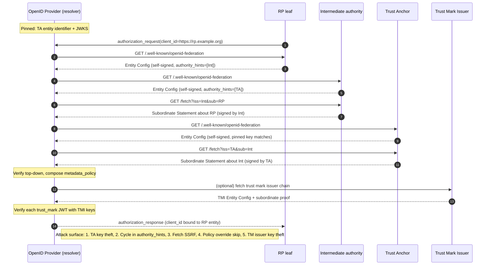

# OpenID Federation

> A federation replaces per-pair OAuth or SAML registration with a signed graph rooted at a trust anchor. Every entity (RP, OP, intermediate authority, trust-mark issuer) publishes an Entity Configuration, a self-signed JWT at `/.well-known/openid-federation` that declares its keys, metadata, and one or more `authority_hints` pointing at superiors. To decide whether to trust a leaf, a resolver walks up those hints, fetching Subordinate Statements from each intermediate, until it reaches a preconfigured trust anchor whose public key it already pins. The chain carries a top-down `metadata_policy` that superiors may impose on subordinates, and the effective metadata seen by the OP or RP is the policy-composed view, not the raw self-declaration. Compromise the trust anchor key and every entity under it is spoofable; misimplement `max_path_length` or accept an unsigned link and you get a DoS or a full identity spoof.

## Quick reference

```
GET /.well-known/openid-federation HTTP/1.1
Host: rp.example.org
Accept: application/entity-statement+jwt

HTTP/1.1 200 OK
Content-Type: application/entity-statement+jwt

eyJhbGciOiJFUzI1NiIsImtpZCI6InJwLXNpZy0yMDI2LTAxIiwidHlwIjoiZW50aXR5LXN0YXRlbWVudCtqd3QifQ.
{
  "iss": "https://rp.example.org",
  "sub": "https://rp.example.org",
  "iat": 1754620800,
  "exp": 1754707200,
  "jwks": {
    "keys": [
      {"kty":"EC","crv":"P-256","kid":"rp-sig-2026-01","x":"...","y":"..."}
    ]
  },
  "authority_hints": [
    "https://intermediate.edu.example",
    "https://intermediate.gov.example"
  ],
  "metadata": {
    "openid_relying_party": {
      "client_name": "Example Wallet",
      "redirect_uris": ["https://rp.example.org/cb"],
      "grant_types": ["authorization_code"],
      "token_endpoint_auth_method": "private_key_jwt",
      "jwks_uri": "https://rp.example.org/jwks.json"
    }
  },
  "trust_marks": [
    {"id":"https://tm.example/audit-2026","trust_mark":"eyJhbGciOi..."}
  ]
}
.SIGNATURE
```

| Invariant | Where enforced | How violated | Source |
|---|---|---|---|
| Trust anchor key is out-of-band pinned, never fetched | Resolver config | Bootstrapping the anchor via HTTPS TOFU or DNS | OpenID Federation 1.0 s.3, s.9 |
| Entity Configuration is self-signed with `iss == sub` | JWS verify at each hop | Accepting a config signed by a different key without matching `jwks` | OpenID Federation 1.0 s.5 |
| Subordinate Statement is signed by the superior's federation key, not the subordinate's | JWS verify with superior JWKS | Verifying with the subject's own key (collapses to self-signed) | OpenID Federation 1.0 s.3.2 |
| Chain length bounded by resolver `max_path_length` | Resolver loop | No cap, follow `authority_hints` recursively | OpenID Federation 1.0 s.10 |
| Effective metadata is policy-composed top-down, subordinate cannot override superior `value` policy | Policy engine | Merging bottom-up, or ignoring `add`/`value`/`one_of` operators | OpenID Federation 1.0 s.6 |
| Trust mark JWT signature checked against the mark issuer entity in the same or a peer chain | Trust mark verifier | Accepting a mark by `id` alone without verifying issuer key + accreditation | OpenID Federation 1.0 s.7 |
| Entity type must be declared in `metadata` before it can act (RP, OP, resolver, TM issuer) | Federation resolver | Treating a leaf without `openid_relying_party` as an RP | OpenID Federation 1.0 s.4 |
| Automatic registration derives client_id from RP entity identifier (URL), not from a random string | OP registration path | Assigning fresh opaque IDs and losing binding to the trust chain | OpenID Federation 1.0 s.12 |

## How it works

### Entity Statement

An Entity Statement is a JWS with `typ: entity-statement+jwt`. Two shapes matter. When `iss == sub`, it is an Entity Configuration, self-signed, fetched from `/.well-known/openid-federation` on the entity's host. When `iss != sub`, it is a Subordinate Statement, issued by an intermediate authority about one of its subordinates, fetched from the superior's `federation_fetch_endpoint` with `?iss=<superior>&sub=<subordinate>`. Both carry the subject's federation `jwks` (used to sign the subject's own next-hop statement), optional `metadata`, optional `metadata_policy`, optional `trust_marks`, `constraints`, and `authority_hints`.

The federation JWKS is deliberately separate from an RP's OAuth client keys or an OP's signing keys. Rotating the federation key does not force redeploying every ID Token signer, and stealing an OP's ID Token key does not by itself let an attacker forge federation statements<sup>[[1]](#ref1)</sup>.

### Trust chain resolution

A resolver starts at the leaf's Entity Configuration, reads `authority_hints`, and for each hint fetches the intermediate's Entity Configuration and then the Subordinate Statement about the leaf from that intermediate's fetch endpoint. It recurses upward until it reaches an intermediate whose entity identifier matches a preconfigured trust anchor. The chain is the ordered list of Entity Statements from leaf to anchor. Verification runs top-down: verify the anchor's Entity Configuration with the pinned key, then use the anchor's `jwks` to verify the Subordinate Statement it issued about the next intermediate, use that statement's `jwks` to verify the next Subordinate Statement, and so on to the leaf<sup>[[1]](#ref1)</sup>.



### Metadata policy

Each Subordinate Statement may include `metadata_policy` scoped by entity type. Policy operators are `value` (force this exact value), `default` (use if subordinate did not set), `add` (union into a list), `one_of` (subordinate value must be in this list), `subset_of` and `superset_of` (list constraints), and `essential` (must be present). Composition rule: a superior's policy is applied to the merged result of policies below it, and a subordinate cannot weaken a superior's constraint. Implementations that merge bottom-up, or that let a subordinate `add` past a superior's `subset_of`, silently downgrade the federation's guarantees<sup>[[1]](#ref1)</sup>.

Real example: a national trust anchor pins `id_token_signed_response_alg: one_of ["ES256","EdDSA"]` on all RPs under it, blocking `none` and `HS256` regardless of what a downstream RP advertises. Cross-link [17-cryptographic-failures.md](./17-cryptographic-failures.md) for why algorithm allow-listing belongs at the top of the chain.

### Trust marks

A Trust Mark is a separate JWT issued by a Trust Mark Issuer that asserts a subject entity has some capability or accreditation, for example "passed our annual security audit" or "may issue verifiable credentials over age 18". The mark carries `iss` (the TMI), `sub` (the accredited entity), `id` (the mark's URI identifier), `iat`, optional `exp`, and issuer-defined claims<sup>[[1]](#ref1)</sup>. Verifiers must (a) verify the mark JWT signature against the TMI's federation JWKS, (b) confirm the TMI itself has a valid trust chain to a trust anchor the verifier accepts, and (c) apply local policy that says which mark IDs from which issuers grant which capabilities.

The `trust_marks` array in an Entity Configuration is self-attested. It is a hint to resolvers, not a proof. The proof is verifying each mark individually.

### Automatic client registration

Instead of RFC 7591 dynamic client registration (see [79-dynamic-client-registration.md](./79-dynamic-client-registration.md) when present, and contrast with [14-oauth-oidc.md](./14-oauth-oidc.md) for the classic OAuth registration model), an OP receiving an authorization request with `client_id` set to an RP's entity identifier URL performs a federation resolution live. If a valid trust chain to an accepted anchor exists and the policy-composed metadata is acceptable, the OP treats the RP as a registered client for the duration of the request or caches it for a policy-driven TTL<sup>[[1]](#ref1)</sup>. The RP never pre-shares a client_id or secret with each OP. This is what lets eIDAS 2.0's EU Digital Identity Wallet ecosystem scale across 27 member states without pairwise onboarding<sup>[[2]](#ref2)</sup>.

Compare SAML federation (see [68-saml.md](./68-saml.md)): SAML aggregates all entity metadata into one large signed XML file (SAML metadata aggregate), published by a federation operator, and every participant downloads and validates that file on a schedule<sup>[[6]](#ref6)</sup>. OpenID Federation is pull-per-request with local caching, so revocation propagates faster and the resolver only fetches what it needs.

## Attack techniques

### 1. Trust anchor key compromise

The trust anchor's federation signing key is the root of the graph. Anyone holding it can mint Subordinate Statements about arbitrary intermediates, spin up a fake intermediate, and then mint statements about attacker-controlled leaf RPs or OPs. Every resolver that pins that anchor accepts those leaves. Blast radius is the entire federation subtree.

The technical mechanism is unremarkable: the attacker signs an Entity Statement with the stolen key, publishes it or serves it from a compromised host that impersonates the intermediate, and waits for a resolver to walk up. If the anchor uses one key for both signing statements and TLS, key theft during a TLS breach gives federation control. If keys are HSM-backed and the operator has a poor audit trail, silent minting is possible.

Black-box confirmation of a compromise is hard from outside, since a stolen key produces cryptographically valid statements. Signal from telemetry: unexpected `iat` on anchor-issued statements, statement IDs (JWS `kid` or JWT `jti`) not present in the anchor's transparency log, or a subordinate suddenly appearing whose entity identifier does not match a known registration record. Trust anchors that operate a signed transparency log let external parties detect out-of-band mints<sup>[[1]](#ref1)</sup>.

Escalation is total. An attacker mints an OP for a real bank's domain, publishes an Entity Configuration on a lookalike host, and any wallet that trusts the anchor will present it to users as a legitimate provider. For eIDAS-scale deployments this maps to nation-state-grade risk<sup>[[2]](#ref2)</sup>.

### 2. Unbounded chain or authority_hints cycle

`authority_hints` is an array of URLs. If a resolver recurses without a depth cap and without cycle detection, an attacker who controls two intermediates can make them point at each other, or a single intermediate can list itself as its own authority. The resolver spins fetching statements indefinitely or until it exhausts memory tracking a growing chain.

Simplest payload is a Configuration that sets `authority_hints: ["https://a.example", "https://b.example"]` where A and B are attacker-controlled and each points back at the other. Second variant: a legitimate intermediate that adds a stray hint pointing at a very slow endpoint, forcing every resolver to time out on that path before falling back.

Confirmation is straightforward with a controlled test harness: point a resolver at a synthetic Configuration with a self-referential hint and watch. If the resolver has no `max_path_length` and no visited-set, it will loop. Blind confirmation against a production resolver: publish a Configuration whose hints resolve to slow endpoints on your own infra, submit a resolution request, and time it. Response times growing linearly in hint count without a hard ceiling suggests no cap.

Escalation is a DoS. A federation-wide resolver at an OP is a shared resource; making one resolution take 30 seconds and 200 outbound fetches degrades the whole authorization flow. The spec's `max_path_length` constraint exists precisely to bound this<sup>[[1]](#ref1)</sup>.

### 3. Intermediate substitution via authority_hints injection

The chain's integrity rests on the invariant that a Subordinate Statement must be signed by the superior's key, not the subordinate's. A naive resolver that fetches an Entity Configuration and then uses its self-declared `jwks` to verify a claimed Subordinate Statement above it has collapsed the chain into a series of self-signed statements, and any attacker who gets one leaf into the graph can chain up through fake intermediates they also control.

Payload: attacker registers `bad.example` as an RP under a legitimate intermediate `real.edu`. Attacker then publishes on `bad.example`'s Configuration an `authority_hints: ["https://attacker.example"]` where `attacker.example` self-signs an Entity Configuration claiming to be a peer of `real.edu` under the trust anchor. If the resolver verifies the "Subordinate Statement about attacker.example from the trust anchor" using attacker.example's own key instead of the trust anchor's, the chain validates.

Black-box test: submit an RP with two hints, one legitimate, one attacker-controlled. Return a synthetic Subordinate Statement from the attacker-controlled path signed by the wrong key. If the OP accepts the RP, the resolver is broken. Blind variant: register a leaf that only lists the attacker path and monitor whether resolvers accept it.

Escalation to full RP spoofing. Combined with a permissive `redirect_uris` policy, the attacker gets a working authorization code flow at any OP in the federation.

### 4. Trust mark forgery from a stolen TMI key

Trust marks are attractive targets because they gate policy decisions. A wallet that decides "only show over-18 sites verified by TMI-Gov" checks a mark of `id = https://tmi.gov/adult-verified`. Steal TMI-Gov's federation signing key and forge a mark for `bad.example`.

The forgery is a plain JWS operation. Attacker signs `{"iss":"https://tmi.gov","sub":"https://bad.example","id":"https://tmi.gov/adult-verified","iat":...,"exp":...}` with the stolen key. Attacker then publishes their Entity Configuration with `trust_marks: [{"id":"...","trust_mark":"<forged jwt>"}]`. Any verifier that only checks the mark's JWT signature and the fact that TMI-Gov is a known TMI accepts the forgery.

Black-box confirmation is impossible without the key; detection is post-hoc via TMI-side transparency logs of issued marks. Verifiers should ideally query the TMI's `federation_trust_mark_status_endpoint` to confirm the mark is still valid<sup>[[1]](#ref1)</sup>.

Escalation depends on what the mark unlocks. In eIDAS 2.0, a mark can be the difference between a wallet showing a "verified" chrome badge and a warning, and can be the gate for higher-assurance credential releases<sup>[[2]](#ref2)</sup>.

### 5. Cross-federation trust mark confusion

An entity may present trust marks from multiple issuers, some from federations the verifier trusts and some it does not. If the verifier only checks that at least one mark validates, and not that the validating mark comes from an accredited issuer for the intended purpose, it can be fooled.

Concrete case: RP presents mark `id = https://tmi.example/audited` signed by `tmi.example` (unknown to verifier) plus a legitimate mark from `tmi.gov` for `https://tmi.gov/registered` (which only means "we know this entity exists"). A verifier that treats "any mark from a known issuer" as "audited" grants trust the second mark did not intend.

Confirmation: check whether the verifier's authorization decisions change when only the low-assurance mark is present.

Escalation depends on how the mark is used in downstream policy. Sloppy verifiers combine this with automatic registration to onboard RPs that should have been rejected.

### 6. Metadata policy override bypass

Metadata policy composition is order-sensitive: the trust anchor's policy applies to intermediates, and each intermediate's policy composes down. A verifier that applies policies in the wrong order, or that lets a subordinate's raw `metadata` win over a superior's `value` operator, downgrades security.

Payload: trust anchor policy sets `token_endpoint_auth_method: value = "private_key_jwt"`. Malicious intermediate publishes a Subordinate Statement for a leaf RP with `metadata.openid_relying_party.token_endpoint_auth_method: "client_secret_basic"` and no policy of its own. A resolver that merges bottom-up (leaf metadata overrides anchor policy) will register the RP with symmetric auth.

Confirmation: submit an RP whose leaf metadata contradicts the anchor's `value` policy on a benign field (`application_type`, `contacts`) and check the OP's resulting registration. If the OP accepts the leaf value, the composer is inverted<sup>[[1]](#ref1)</sup>.

Escalation: force weak client auth, downgrade signing algorithms (cross-link [17-cryptographic-failures.md](./17-cryptographic-failures.md)), or add attacker-controlled redirect URIs.

### 7. SSRF via federation fetch endpoint

An intermediate's `federation_fetch_endpoint` accepts `iss` and `sub` parameters and typically fetches or looks up the subject's Configuration. Some implementations resolve `sub` by making an outbound HTTP call to `<sub>/.well-known/openid-federation`. If the endpoint does not validate that `sub` is a well-formed HTTPS URL to a public host, an attacker can direct fetches at internal metadata services or localhost.

Payload: `GET /fetch?iss=https://intermediate.example&sub=http://169.254.169.254/latest/meta-data/`. If the intermediate blindly issues an outbound GET to `sub` and reflects response bytes into an error, the attacker sees cloud metadata. Even without reflection, timing signals whether the address responded.

Confirmation is the classic SSRF probe (see [30-ssrf.md](./30-ssrf.md) for full technique). Blind confirmation via Burp Collaborator-style OOB DNS.

Escalation: cloud credential theft from IMDSv1, internal admin endpoint access, or lateral movement inside the trust anchor's operator VPC.

## Defense

### Real fix

1. **Pin trust anchor keys out of band**. The whole model depends on the resolver knowing the anchor's public key before it starts. Ship anchor JWKS with the resolver binary or via a signed configuration bundle from an operational channel independent of DNS and TLS. Common wrong implementation: fetching the anchor Entity Configuration over HTTPS on first boot and pinning whatever key is returned. Trust On First Use over a hijacked network gives the attacker the anchor role<sup>[[1]](#ref1)</sup>.

2. **Verify each Subordinate Statement with the superior's key, top-down from the anchor**. Never use the subject's own `jwks` to verify a Subordinate Statement about that subject. Iterate from anchor to leaf, and at each step use the previous statement's `jwks` (which is the superior's key material as attested by an already-verified statement) to check the next<sup>[[1]](#ref1)</sup>. Common wrong implementation: verifying self-signed configurations independently and hoping the chain of URLs implies chain of trust.

3. **Enforce `max_path_length` and detect cycles with a visited set**. Set an absolute cap (spec allows anchors to declare, and resolvers should independently cap at, for example, 5 hops). Track visited entity identifiers per resolution and abort if one repeats<sup>[[1]](#ref1)</sup>. Common wrong implementation: recursion without bookkeeping, or using only the anchor-declared max without a local ceiling.

4. **Compose `metadata_policy` top-down and treat superior `value` operators as final**. Apply the anchor's policy first to the intermediate's metadata, then the intermediate's policy to its subordinate, and so on. Reject a Subordinate Statement whose raw metadata contradicts a `value` policy set by a superior<sup>[[1]](#ref1)</sup>. Common wrong implementation: shallow object merge where deeper always wins.

5. **Verify trust marks by resolving the TMI's own chain and checking the mark's signature against the TMI's federation JWKS**. Do not trust the `id` field alone; do not trust the TMI's Entity Configuration if it lacks a valid chain to an accepted anchor. Query the TMI's status endpoint before granting mark-gated capabilities if the mark's semantics are revocable<sup>[[1]](#ref1)</sup>. Common wrong implementation: checking mark signature only against a hardcoded TMI key list, so revocation and rotation are invisible.

6. **Bind trust mark decisions to (issuer, mark_id, purpose) triples in local policy**. A mark from a known TMI does not mean any mark from that TMI grants any capability. Store an explicit table of which mark identifiers gate which authorization decisions. Common wrong implementation: accepting any valid mark as evidence of accreditation.

7. **Validate `sub` on the federation fetch endpoint as an HTTPS URL matching an allow-listed pattern, and route outbound fetches through an SSRF-safe HTTP client** with a DNS resolver that rejects link-local, loopback, and private address ranges<sup>[[1]](#ref1)</sup>. See [30-ssrf.md](./30-ssrf.md). Common wrong implementation: passing `sub` directly into `http.Get`.

### Defense in depth

1. **Operate the trust anchor's federation key in an HSM with dual-control signing ceremonies**, and publish a signed transparency log of every Subordinate Statement issued. Independent observers can then detect out-of-band signing<sup>[[1]](#ref1)</sup>. Cross-link [17-cryptographic-failures.md](./17-cryptographic-failures.md) for key-storage requirements.

2. **Rotate federation keys on a fixed schedule, with overlap** and publish rotations via the Entity Configuration `jwks` array. Resolvers cache the JWKS with a TTL bounded by the Configuration's `exp` claim, so short `exp` (hours, not weeks) accelerates rotation propagation.

3. **Cache resolved trust chains with a policy-set TTL** and re-resolve on any authentication decision that grants elevated capability (higher assurance level, admin scope). Do not rely on caches for revocation.

4. **Constrain the graph with `constraints` claims** at anchors and intermediates: `max_path_length`, `naming_constraints` (restrict subordinate entity identifiers to a domain suffix), and `allowed_leaf_entity_types`<sup>[[1]](#ref1)</sup>. These block a subordinate from smuggling in an OP where the parent only intended to accredit RPs.

5. **Require `private_key_jwt` or asymmetric client authentication in anchor policy**, killing the class of attacks that assume a shared secret. Combine with `token_endpoint_auth_signing_alg` constraints to lock signing algorithms federation-wide.

6. **Rate-limit federation fetch endpoints and cap concurrent resolutions per (client_ip, anchor)** so that a chain-length DoS cannot starve the OP.

7. **Reject Entity Statements older than a small skew** even when `exp` has not passed. The invariant is freshness; a very old `iat` with a future `exp` implies stale or replayed statements.

## Detection and telemetry

Every federation-aware component logs the resolved chain per authorization: leaf entity identifier, each intermediate, the anchor, chain length, cache hit or miss, wall time, number of outbound fetches, and each trust mark checked (issuer, id, verdict). Alert when chain length exceeds a threshold below `max_path_length`, or when the same leaf resolves through different intermediates from one hour to the next without an operational change (a warning that hint-injection is in flight).

Log federation JWKS versions actually used to verify statements. When a resolver observes a Subordinate Statement signed by a key that is not in the superior's current `jwks`, alert immediately: either rotation is mid-flight or an attacker is minting off a stolen key. Trust anchor operators should emit a signed transparency log entry for every Subordinate Statement they issue, with append-only guarantees, and reconcile daily against issuance records. Public read of that log lets any federation participant detect out-of-band mints.

For SSRF, log the resolved IP address of every outbound fetch from the federation client and alert on RFC1918, link-local, or loopback destinations. For trust mark verification, count denials by mark issuer and mark id; a sudden spike in denials for one TMI often signals a mistaken rotation on the TMI side rather than an attack, but the same signal shape covers both.

Canary shape: publish a leaf whose entity identifier resolves through a hidden intermediate under operator control. If any real OP registers the canary, its resolver either accepts unpinned anchors or is misapplying policy.

## Interviewer probes

### Why does OpenID Federation exist when RFC 7591 dynamic client registration already lets an RP register with an OP on the fly?

Mid: Dynamic registration is per-pair and unauthenticated; there is no way for an OP to know whether an RP is trustworthy. Federation adds a signed chain to a common anchor.

Principal: RFC 7591 solves the mechanics of programmatic registration but leaves policy at the OP's discretion, so every OP-RP pair is an isolated decision. Federation moves policy into a shared graph. The OP evaluates the RP against a preconfigured trust anchor, applies top-down `metadata_policy` from the anchor and intermediates, and derives the effective client metadata deterministically. That means one operator (an eIDAS trust anchor, a national education federation) can enforce a floor across thousands of OPs and RPs without any pairwise onboarding, and revocation propagates through short-lived Entity Statements rather than through per-pair credential rotation<sup>[[1]](#ref1)</sup><sup>[[2]](#ref2)</sup>. Cross-link [79-dynamic-client-registration.md](./79-dynamic-client-registration.md) for the delta.

### How is this different from SAML metadata aggregates?

Mid: SAML publishes one big signed XML file for the whole federation. OpenID Federation publishes per-entity signed JWTs and resolves on demand.

Principal: The SAML model is signed-aggregate: federation operator collects entity metadata, signs one XML document (often hundreds of megabytes for large ones like eduGAIN), and every participant downloads and validates it on a schedule<sup>[[6]](#ref6)</sup>. Two consequences. First, revocation lag is the aggregate publication cadence, which can be days. Second, the aggregate is a monolithic root of trust; corruption of the aggregate signing key silently taints everything until the next refresh. OpenID Federation resolves per-request over signed JWTs with short `exp`, so revocation is minute-scale, and the trust graph is explicit (`authority_hints` up, `metadata_policy` down) rather than flat<sup>[[1]](#ref1)</sup>. See [68-saml.md](./68-saml.md).

### What breaks if you forget to enforce `max_path_length`?

Mid: A resolver can be forced into unbounded recursion by cyclic `authority_hints`, taking down the OP.

Principal: Two failure classes. First, a DoS: attacker publishes a Configuration whose hints form a cycle or a very deep tree, and every resolver that starts walking spends memory and outbound fetches until it times out. If the OP shares a resolver process across authorizations, one bad RP degrades every unrelated login. Second, a policy failure: a very long chain can mask an unexpected intermediate that quietly weakens `metadata_policy` in the middle, and if the resolver is fatigued or lazy about revalidating each hop it may fast-path past the policy composition. The spec allows anchors to publish a max, and resolvers must also cap independently to defend against a compromised anchor lifting its own limit<sup>[[1]](#ref1)</sup>.

### The trust anchor's federation key is stolen. What's the blast radius, and how do you recover?

Mid: Everything under the anchor is spoofable until you rotate the key and get resolvers to pick up the new one.

Principal: Blast radius is the entire subtree. The attacker can mint statements about arbitrary intermediates, spin fake ones, and mint leaves that will be accepted by every resolver pinning that anchor. Recovery is hard because pinning is by design out-of-band, so pushing a new key requires the same operational channel used to seed the old one (signed release, package repo with a separate signing chain, hardware token). Immediate steps: revoke the old key by publishing an anchor Entity Configuration with a fresh JWKS whose `exp` is short; broadcast the rotation to all known resolvers via operational channels; issue a transparency-log entry marking the compromise; drive downstream intermediates to reissue Subordinate Statements under the new key<sup>[[1]](#ref1)</sup>. If the anchor operator did not run a transparency log, you cannot even enumerate the fraudulent statements the attacker minted. That is why HSM plus dual-control plus transparency logs are the operating baseline for a federation anchor.

### Where do trust marks fit compared to the chain?

Mid: The chain proves an entity exists in the federation. Trust marks assert specific properties like accreditation or audit passage.

Principal: They are orthogonal. The chain establishes identity and derives effective metadata; the mark carries a scoped assertion by a named authority (which might not be a superior in the chain). A mark can only be trusted if (a) its JWT signature verifies against the TMI's federation JWKS, (b) the TMI itself resolves through a valid chain to an accepted anchor, and (c) local policy links this specific `(issuer, mark_id)` to the capability being granted<sup>[[1]](#ref1)</sup>. Real deployments in eIDAS 2.0 use marks to gate credential-issuance capabilities, so mark forgery via TMI key theft is a distinct P0 alongside anchor key theft<sup>[[2]](#ref2)</sup>.

### What's the correct way to compose `metadata_policy`?

Mid: Apply the trust anchor's policy first, then intermediates in order, and finally overlay the subordinate's declared metadata subject to constraints.

Principal: More precisely, the resolver produces a per-entity-type policy by combining Subordinate Statements top-down using the operator rules the spec defines (`value` wins absolutely, `default` fills gaps, `add` unions subject to superior `subset_of`, `one_of` restricts, `essential` forces presence)<sup>[[1]](#ref1)</sup>. The subordinate's own declared `metadata` is then filtered by the composed policy, and any conflict with a superior `value` is a rejection, not an override. Common bug: implementers use a generic deep-merge library where deeper keys always overwrite shallower, and the whole federation policy collapses into "leaf declares whatever it wants". The fix is a dedicated composer that treats each operator as a check plus a transformation, not a merge.

### How does the OP decide which trust anchors to pin?

Mid: Operator configures them explicitly at deploy time.

Principal: The OP operator picks based on regulatory and business context. In eIDAS 2.0 an OP is likely pinned to its national anchor plus the EU-level anchor; in a research federation, the anchor is the operator of the federation (e.g., SUNET operates the anchor for Sweden's education federation<sup>[[5]](#ref5)</sup>). The pinning list is a governance artifact, not a technical one. Change control on that list is a security decision. Adding an anchor expands the set of RPs an OP will serve, and every anchor in the list is a P0 asset from that OP's perspective. Anchors should be added only via signed operator releases, never fetched from a directory.

### How does automatic registration actually bind a session to the trust chain?

Mid: The OP uses the RP's entity identifier URL as the client_id and derives client metadata from the resolved chain.

Principal: The `client_id` in the authorization request is the RP's federation entity identifier (an HTTPS URL). When the OP resolves the chain, it produces an effective `client_metadata` view scoped to `openid_relying_party`, and stores that view keyed by (entity_id, chain_hash) for the request lifetime<sup>[[1]](#ref1)</sup>. The chain hash matters: if any intermediate rotates keys or revokes, the next resolution produces a new hash and the OP knows the old cached metadata is stale. Subsequent token requests bind to the same chain via `private_key_jwt` client authentication where the RP signs with the key declared in its federation-attested metadata, closing the loop between the authorization decision and the actual credential. Getting this wrong (accepting a stale cache after chain rotation, or letting a request's `client_id` outrun its chain re-resolution) is how automatic registration degrades to unauthenticated dynamic registration.

## Sources

<a id="ref1"></a>[1] OpenID Federation 1.0. OpenID Foundation working group draft. https://openid.net/specs/openid-federation-1_0.html

<a id="ref2"></a>[2] Regulation (EU) 2024/1183 of the European Parliament and of the Council amending Regulation (EU) No 910/2014 as regards establishing the European Digital Identity Framework (eIDAS 2.0). Official Journal of the European Union. 2024. https://eur-lex.europa.eu/eli/reg/2024/1183/oj

<a id="ref3"></a>[3] OpenID Connect for Identity Assurance 1.0. OpenID Foundation. https://openid.net/specs/openid-connect-4-identity-assurance-1_0.html

<a id="ref4"></a>[4] GAIN (Global Assured Identity Network) Proof of Concept Community Group. OpenID Foundation. https://openid.net/cg/gain-poc/

<a id="ref5"></a>[5] SUNET SWAMID Federation. Sunet. https://www.sunet.se/services/identifiering-och-inloggning/swamid

<a id="ref6"></a>[6] Metadata for the OASIS Security Assertion Markup Language (SAML) V2.0. OASIS Standard. 2005. https://docs.oasis-open.org/security/saml/v2.0/saml-metadata-2.0-os.pdf

<a id="ref7"></a>[7] RFC 7591 OAuth 2.0 Dynamic Client Registration Protocol. IETF. 2015. https://datatracker.ietf.org/doc/html/rfc7591

<a id="ref8"></a>[8] RFC 7515 JSON Web Signature (JWS). IETF. 2015. https://datatracker.ietf.org/doc/html/rfc7515

<a id="ref9"></a>[9] RFC 8725 JSON Web Token Best Current Practices. IETF. 2020. https://datatracker.ietf.org/doc/html/rfc8725

<a id="ref10"></a>[10] International Government Assurance Profile (iGov) for OpenID Connect 1.0. OpenID Foundation. https://openid.net/specs/openid-igov-openid-connect-1_0.html
