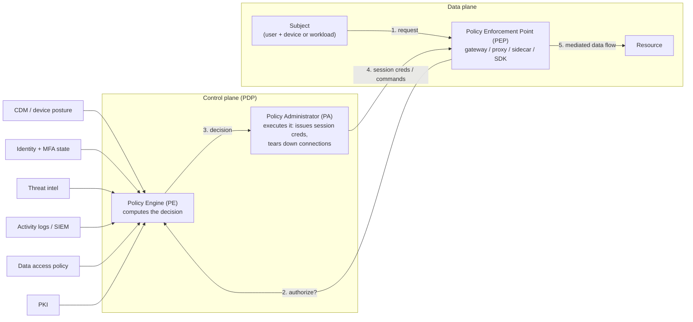
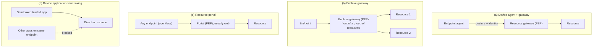

# Zero Trust Architecture

> Zero trust is the abandonment of network-location as a proxy for trust. Every request to a resource is treated as if it originated on a hostile network, and the decision to allow it depends on an evaluation done at request time using identity, device posture, and behavioral signals rather than which subnet the packet arrived on. NIST SP 800-207 formalized this in 2020 as seven tenets and a logical split between a Policy Decision Point that reasons about a request and a Policy Enforcement Point that mediates the data flow. NIST SP 800-207A extended the model in 2023 for cloud-native and multi-cloud deployments where the primary segmentation unit is workload identity rather than IP. NIST SP 1800-35 (June 2025) is the practical implementation companion built with 24 vendor stacks. CISA's Zero Trust Maturity Model v2.0 gives enterprises a five-pillar planning ladder. The interview trap is treating zero trust as a product or as "just add MFA and a VPN replacement"; the mechanism is per-session, per-resource, dynamic authorization enforced by a component the caller cannot bypass.

## Quick reference

A request to a protected resource under a zero trust architecture flows through three logical roles. The Policy Enforcement Point is the only path to the resource. The Policy Decision Point (PE + PA in NIST terminology) computes the answer using the current state of identity, device, and environmental signals.

```
Subject (user + device + workload)
    │
    │  1. request with identity assertion
    ▼
┌─────────────────────────────────────────┐
│           PEP (gateway / proxy /         │
│            sidecar / SDK)                │
└──────────────┬──────────────────────────┘
               │ 2. authorize?  {subject, resource, context}
               ▼
┌─────────────────────────────────────────┐
│  PDP  =  PE (decides)  +  PA (executes) │
│                                          │
│  inputs:                                 │
│    - identity store (user, workload)     │
│    - device posture (CDM/EDR)            │
│    - threat intel                        │
│    - activity logs / SIEM                │
│    - data access policy                  │
│    - PKI / cert state                    │
│    - compliance / industry system        │
└──────────────┬──────────────────────────┘
               │ 3. allow (session cred) / deny / revoke
               ▼
      Resource  (data source, service, API, workload)
```

| Invariant | Where enforced | How violated | Source |
|---|---|---|---|
| Every access is per-session, decided at request time | PDP evaluates each new session, PEP terminates on revoke | Long-lived tokens with no revocation check; PEP that caches the decision forever; authenticate at ingress but never re-authenticate at internal service hops | NIST SP 800-207 §2.1 tenets 3, 6<sup>[[1]](#ref1)</sup> |
| All communication is authenticated and encrypted regardless of network | PEP mandates mTLS or authenticated transport; workload identity issued by SPIFFE-style infrastructure | Cleartext east-west traffic on the "trusted" internal network | NIST SP 800-207 §2.1 tenet 2; NIST SP 800-207A<sup>[[1]](#ref1)</sup><sup>[[2]](#ref2)</sup> |
| Decision uses dynamic policy, not just static role membership | PE ingests device posture, MFA freshness, session risk, behavioral signals | Static ACL that never re-evaluates once granted | NIST SP 800-207 §2.1 tenet 4; §3.3 trust algorithm<sup>[[1]](#ref1)</sup> |
| Segmentation is identity-based, not IP-based, for cloud-native | Sidecar/API gateway checks SPIFFE ID or equivalent workload identity | Reachability granted because "it's in the same VPC"; wildcard match on caller identity where one specific caller was intended; missing audience binding on outbound tokens so a token issued for service A is accepted by service B | NIST SP 800-207A §core paradigm<sup>[[2]](#ref2)</sup> |
| The enterprise collects continuous state and improves posture from it | CDM feeds into PE; SIEM into detection; posture into re-evaluation | Access decisions made once at login and never revisited | NIST SP 800-207 §2.1 tenet 7<sup>[[1]](#ref1)</sup> |
| Phishing-resistant MFA at the Identity pillar for Advanced maturity | WebAuthn / passkeys enforced at IdP | SMS OTP or push-to-approve as sole factor | CISA ZTMM v2.0 Identity pillar<sup>[[3]](#ref3)</sup> |

## How it works

### The seven tenets (NIST SP 800-207)

NIST SP 800-207 §2.1 enumerates seven tenets that any deployment must satisfy to claim the label. Paraphrased: (1) all data sources and services are resources, (2) all communication is secured regardless of network location, (3) access is granted per-session, (4) access is determined by dynamic policy including identity, application, requesting asset, and behavioral or environmental attributes, (5) the enterprise measures the integrity and security posture of assets, (6) authentication and authorization are dynamic and strictly enforced before access, and (7) the enterprise collects as much state as possible and uses it to improve its posture.<sup>[[1]](#ref1)</sup>

Two of these are the mechanism, and the rest support them. Tenet 6 (dynamic, strictly enforced auth before access) plus tenet 3 (per-session grant) is what makes the model different from "network + role RBAC once at login." Tenets 4, 5, and 7 exist to make tenet 6 possible: you cannot make a dynamic decision without collecting signal. Tenets 1 and 2 remove the network from the trust boundary.

### Logical components: PE, PA, PEP

The core control plane is a three-role split, described in NIST SP 800-207 §3.<sup>[[1]](#ref1)</sup>



PE is the reasoner. PA is the effector. PEP is the gate the traffic actually passes through. The PE and PA together are the PDP, but the distinction between them matters operationally: PA is the component that can revoke a session mid-flight when a signal changes, which is what CAE (continuous access evaluation) implementations rely on. See [session management](72-session-management.md) for the session-revocation mechanics and [OIDC deep](77-oidc-deep.md) for how the ID token / access token split affects what PA can revoke.

The supporting data sources listed in §3 are CDM (continuous diagnostics and mitigation), industry or regulatory compliance system, threat intelligence, activity logs, data access policy, PKI, identity management, and SIEM.<sup>[[1]](#ref1)</sup> Absence of a working feed does not fail-safe: it usually silently downgrades the trust algorithm to whatever inputs remain, which is why the "who is watching the sensor?" question matters as much as the sensor itself.

### Deployment variants

NIST SP 800-207 §3.1 lists four deployment variants for the PEP. Each is a different answer to "where does the enforcement point actually sit relative to the endpoint and the resource?"<sup>[[1]](#ref1)</sup>



The tradeoffs are covered in the Defense section. The short version is that (a) gives the most granular telemetry but requires managed endpoints, (b) is what most enterprises use for legacy on-prem apps and weakens the per-resource property, (c) is the resource portal that BeyondCorp popularized and is agentless but loses endpoint visibility, and (d) is niche.

### The cloud-native extension (NIST SP 800-207A)

NIST SP 800-207A (September 2023) is the extension that most modern deployments actually need. It reframes segmentation from "which subnet or VPC is this in" to "which workload identity is calling which workload identity."<sup>[[2]](#ref2)</sup>

Its core changes:

- Application and service identities become first-class. The example named in the document is SPIFFE with SPIRE as the identity infrastructure. See [SPIFFE and SPIRE](81-spiffe-spire.md) for the mechanics of SVIDs, workload attestation, and rotation.
- Enforcement patterns are named: API gateway for north-south traffic, sidecar proxy for east-west traffic in a service mesh, transit/egress/ingress gateways, and service mesh as an aggregate pattern.
- Two policy tiers coexist: identity-tier policy (the primary control) and network-tier policy (defense in depth, still there but no longer the trust boundary).
- Authentication and authorization must consider workload identity in addition to user identity. A user token alone is not sufficient authorization for an internal service to reach another internal service; the calling workload's own identity is part of the input.

This is the mandate that couples zero trust to [mTLS](69-mtls.md), to [SPIFFE/SPIRE](81-spiffe-spire.md) for issuance, and to [token exchange (RFC 8693) with audience binding (RFC 8707)](78-token-exchange.md) for downstream calls that need to carry user context.

### The CISA maturity model

CISA Zero Trust Maturity Model v2.0 (April 2023) is what most enterprises use for planning because it turns the tenets into a five-pillar checklist with four maturity stages.<sup>[[3]](#ref3)</sup>

The five pillars: Identity, Devices, Networks, Applications and Workloads, Data. Cross-cutting capabilities: Visibility and Analytics, Automation and Orchestration, Governance. The four stages are Traditional (perimeter-based, manual), Initial (some automation, still perimeter-centric), Advanced (dynamic policy, cross-pillar integration), and Optimal (fully automated, continuous, cross-pillar policy synthesis).<sup>[[3]](#ref3)</sup>

The stages become concrete when you pick one representative control per pillar and walk it across the ladder:

| Pillar | Traditional | Initial | Advanced | Optimal |
|---|---|---|---|---|
| Identity (authenticator) | Password only | Password + push/OTP MFA | Phishing-resistant MFA (WebAuthn) enforced everywhere | Continuous risk-based auth, session risk drives step-up dynamically |
| Devices (posture) | No inventory or trust tier | Basic inventory, compliance checked at enrollment | Real-time posture feed (EDR + patch + firmware) into PE | Continuous posture, automatic isolation on drift |
| Networks (segmentation) | Perimeter firewall, flat internal network | Some internal VLANs, VPN for remote | Micro-segmentation, mTLS east-west, encrypted internal traffic | Identity-based micro-segmentation with dynamic policy |
| Applications and Workloads (access) | Network reachability grants access | App-level auth, static roles | Workload identity + per-request authorization at PEP | Continuous authorization, workload identity, delegated user context |
| Data (protection) | Perimeter-based, some at-rest encryption | Classification, DLP at egress | Encryption in transit and at rest, access tied to data tag | Attribute-based access with continuous evaluation, DRM-style controls |

Cross-linking: phishing-resistant MFA is covered in [WebAuthn and passkeys](70-webauthn-passkeys.md), workload identity in [SPIFFE and SPIRE](81-spiffe-spire.md), micro-segmentation and mTLS in [mTLS](69-mtls.md), encryption in transit in [cryptographic failures](17-cryptographic-failures.md), continuous validation in [session management](72-session-management.md) and [MFA and step-up](73-mfa-step-up.md).

DoD's Zero Trust Reference Architecture v2.0 (July 2022) is the DoD-specific version with seven pillars (Automation and Orchestration and Visibility and Analytics are pillars rather than cross-cutting).<sup>[[4]](#ref4)</sup> Executive Order 14028 (May 2021) and OMB Memo M-22-09 (January 2022) are the federal mandate that drove the framework into mainstream adoption timelines.<sup>[[5]](#ref5)</sup>

### The industry origin: BeyondCorp

Google's BeyondCorp is the reference implementation of the resource portal deployment variant, running internally since around 2011 and documented in a series of papers from 2014 to 2018.<sup>[[6]](#ref6)</sup> The productized version, BeyondCorp Enterprise, launched in 2021. BeyondCorp is worth naming in interviews because it is the answer to "did anyone actually do this at scale," and because its device inventory + trust tier design pre-dates and shaped the NIST document.

### Practical implementation: NIST SP 1800-35

NIST SP 1800-35 (final published 10 June 2025) is the NCCoE companion to 800-207/207A.<sup>[[7]](#ref7)</sup> It describes 19 end-to-end reference architecture implementations built with 24 vendors, across multiple volumes covering executive summary, approach, how-to, functional demonstrations, and risk/compliance. This is the document to cite if an interviewer asks "what does a real deployment look like today," because it is the closest to state-of-the-art vendor-neutral guidance.

## Attack techniques

Threats *to* a zero trust deployment, not to organizations that lack one. The mechanism-level failure modes cluster around the PDP, the PEP, and the signals feeding both. For each technique below the same rubric applies: how a black-box assessor confirms the technique from the outside, what the blind or out-of-band variant looks like when direct responses are suppressed, and the escalation path from initial finding to broader architecture compromise.

### 1. PDP or PA compromise

The Policy Decision Point is the trust root of the architecture. If an attacker can influence the PE (change policy, poison signals) or take over the PA (issue arbitrary session credentials, refuse to revoke), every downstream enforcement is decided on their terms.<sup>[[1]](#ref1)</sup> The concrete path most commonly seen is not "break into the PDP binary" but "compromise the admin account that edits policy," which is why the PDP admin plane must itself be behind phishing-resistant MFA (see [WebAuthn and passkeys](70-webauthn-passkeys.md)), aggressive session limits, and separation-of-duty on policy changes. Related: the identity store (IdP) is a de facto extension of the PDP; compromise of the IdP compromises the architecture.

Black-box confirmation: identify the IdP and the ZTNA vendor from the login-flow redirect chain and the identity-aware-proxy response headers, then probe the admin console (usually a subdomain like `admin.` or a vendor-hosted portal) for MFA type and session length. Blind variant: when the admin console does not reveal its posture directly, correlate DNS to the vendor tenant name and use vendor-published tenant enumeration to confirm existence. Escalation path: one phished admin credential becomes arbitrary policy edit becomes silent creation of a bypass rule for the attacker's identity, and the audit trail is written by the same PDP the attacker now controls.

### 2. PEP bypass via legacy paths

A PEP only enforces the traffic that passes through it. In practice, most zero trust deployments coexist with legacy paths: direct database connectivity for reporting, jump hosts that bypass the identity-aware proxy, break-glass VPNs, service-to-service TCP flows on "internal" networks that never got a sidecar.<sup>[[1]](#ref1)</sup><sup>[[2]](#ref2)</sup> These are the practical exploitation targets. The attacker routes around the PEP rather than defeating the PDP. NIST SP 800-207A's insistence that segmentation be identity-based rather than network-based is a response to this: as long as network reachability substitutes for authorization anywhere, the substitute is what gets exploited.

Black-box confirmation: from a foothold inside any segment, run a full internal port scan and DNS enumeration for management ports (SSH 22, RDP 3389, database 3306/5432/1433, Kubernetes API 6443) that respond without going through the identity-aware proxy. Any TCP response on a non-portal port confirms a bypass path. Blind variant: when direct connect is dropped, use DNS or time-based side channels (`nslookup <internal-name>` from the compromised segment) to enumerate the internal name space, then infer reachability from DNS-only signals. Escalation path: one legacy database endpoint reachable from a compromised web tier becomes read of the identity store, becomes offline credential cracking, becomes IdP compromise per technique 1.

### 3. Over-trusted trust algorithm

The trust algorithm variants in NIST SP 800-207 §3.3 are criteria-based vs score-based and singular vs contextual.<sup>[[1]](#ref1)</sup> A score-based algorithm that aggregates weighted signals looks sophisticated but has two failure modes worth naming. First, signal-weight tuning drifts toward accepting the most common legitimate patterns, so "unusual but benign" and "unusual and malicious" both trigger step-up and users are trained to power through it. Second, one high-weight signal can dominate: "device is compliant" alone is enough to grant access in some deployments, and device compliance is a boolean set by the endpoint agent, which is a target. Criteria-based algorithms are more auditable but tend to accumulate exceptions until the ruleset itself is the vulnerability.

Black-box confirmation: probe from combinations of source characteristics (different geos via VPN, different device fingerprints, different times of day) with a valid credential and observe which combinations trigger step-up. The response matrix reveals which signals are weighted. Blind variant: when step-up prompts are suppressed for the attacker's session (silently denied), correlate authentication latency and rate-limit responses to infer which signals are being evaluated. Escalation path: one signal identified as dominant (e.g., "compliant device" boolean) becomes the target for endpoint compromise, and once flipped, the trust algorithm returns a high score for any request the attacker makes from that endpoint.

### 4. Workload identity forgery or theft

Under NIST SP 800-207A the workload identity is the primary segmentation key.<sup>[[2]](#ref2)</sup> If an attacker can obtain a workload's SPIFFE SVID (or equivalent), they inherit that workload's authorization envelope. Concrete paths: a container breakout that reads the workload's identity material off the node, a misconfigured SPIRE workload attestation that identifies workloads by weakly-verifiable selectors (only namespace label, no image hash), a build pipeline that hands identity to CI jobs that then run untrusted PR code. See [SPIFFE and SPIRE](81-spiffe-spire.md) for the attestation and rotation model and how "who can request this SVID" is the actual authorization decision.

Black-box confirmation: from any container foothold, probe the workload API socket (SPIRE agent socket, cloud metadata endpoint) and request an SVID for the attesting selector set. If the response is a valid credential the selector set is under-specified. Blind variant: when the workload API refuses direct requests from the attacker's container, deploy a co-located workload matching the target's selectors (label spoof) and confirm identity issuance by using the received SVID against a downstream service and observing the authorization result. Escalation path: one over-broad SVID lets the attacker's workload call any service that trusts that identity, and if a queried service returns tokens or data belonging to other tenants, the compromise is cross-workload.

### 5. Session persistence past posture change (CAE bypass)

Tenets 3 and 6 require per-session enforcement. In practice most implementations enforce at token issuance and then let the token live until expiry, which is often an hour or longer. If posture changes mid-session (device becomes non-compliant, user role revoked, threat intel flags the endpoint), the still-valid token continues to grant access.<sup>[[1]](#ref1)</sup>

There are three revocation channels available and they have different semantics. First, short lifetimes: the access token expires quickly and the resource server implicitly enforces revocation on renewal. This bounds blast radius but is not true revocation because there is no channel to kill an active session. Second, push from PA to PEP: continuous access evaluation implementations (Microsoft Entra CAE, Google BeyondCorp continuous access) send claim challenges or session-kill events to the resource server, which then rejects the still-unexpired token.<sup>[[8]](#ref8)</sup> Third, for mTLS-fronted service-to-service, CRL or OCSP-stapling on the workload certificate. OIDC id tokens are typically not revocable at all, which is why "log out" often does not log the user out of downstream applications that rely on the id token as proof of authentication. Deployments that never wired the push channel satisfy the per-session tenet in name only.

Black-box confirmation: obtain a valid session, trigger a posture change (uninstall the endpoint agent, change the compliance state), and continue using the same access token. If access continues past the moment posture changed, CAE is not wired. Blind variant: when the attacker cannot directly change posture, wait until credentials are legitimately rotated (password change, MFA reset) and confirm that the pre-rotation session is still valid; if so, revocation is by expiry only. Escalation path: a session obtained via phishing before the victim reports the phish continues to work for the token lifetime; combined with a long lifetime this is enough to complete data exfiltration before revocation matters.

### 6. Phishing-resistant MFA that isn't

CISA ZTMM v2.0 names phishing-resistant MFA as an Advanced-stage Identity requirement.<sup>[[3]](#ref3)</sup> Deployments frequently misclassify their MFA method as phishing-resistant when it is not. Push-to-approve is push-fatigue-vulnerable rather than phishing-resistant. SMS and voice OTP are not phishing-resistant. TOTP is not. Only WebAuthn / FIDO2 / passkeys with an authenticator bound to the origin are.<sup>[[9]](#ref9)</sup> If the trust algorithm assumes "MFA present = high assurance" but the MFA method is push, then the assurance level is overstated by the input and every downstream decision inherits the error. See [WebAuthn and passkeys](70-webauthn-passkeys.md) and [MFA and step-up](73-mfa-step-up.md).

Black-box confirmation: initiate a login and observe the MFA challenge type in the flow (push notification, OTP field, WebAuthn ceremony). If the challenge is push or OTP, phishing-resistance is claimed but not delivered. Blind variant: when the challenge type is obscured, correlate the timing between credential submission and access grant to infer whether the ceremony was origin-bound (WebAuthn is single-round with a fixed latency floor); a variable multi-second delay suggests push. Escalation path: a phished credential plus a push-fatigue campaign against the same target yields session capture; MFA-in-the-middle proxy against SMS or TOTP achieves the same result silently.

### 7. Misconfigured identity-based segmentation

Identity-based policy is a large ruleset. Common misconfigurations: overly broad service accounts that grant one workload identity access to unrelated resources; wildcard match on the caller identity (`*.namespace.svc`) where the intent was one specific caller; audience binding missing on outbound tokens so a token issued for service A is accepted by service B (see [token exchange](78-token-exchange.md) and RFC 8707); network-tier policy left permissive because "identity-tier will catch it" but a PEP path was missed.<sup>[[2]](#ref2)</sup> The 800-207A two-tier model exists so network tier remains defense in depth; treating it as vestigial is the misconfiguration.

Black-box confirmation: from any workload foothold, enumerate the outbound calls the identity is allowed to make by requesting a token for every downstream audience and observing which are granted. Cross-service token acceptance (a token minted for A accepted by B) confirms missing audience binding. Blind variant: when direct token acceptance cannot be tested (mTLS-only mesh), inject a request from the compromised workload to unrelated services and observe authorization outcomes; a permitted call to a service outside the workload's expected fan-out indicates over-broad selectors. Escalation path: one over-broad identity policy grants lateral access across the mesh, and if the identity has any privileged downstream (data warehouse, secret manager), the initial workload compromise becomes cross-service data access.

### 8. Signal poisoning of the PE

Tenet 7 states that the enterprise collects as much state as possible and uses it to improve posture.<sup>[[1]](#ref1)</sup> An attacker who understands the trust algorithm can feed it. A common example is endpoint compliance status: if the agent-reported posture is not cross-validated by an independent signal, an attacker with local admin on the endpoint can tell the agent it is compliant. Threat intelligence feeds can be poisoned by influencing the source or the attribution logic. Behavioral baselines can be gradually shifted by low-and-slow activity until the malicious pattern is inside the baseline.

Black-box confirmation: from a compromised endpoint, modify one agent-reported field at a time (compliance boolean, disk-encryption flag, patch level) and observe whether access decisions shift. Blind variant: when the PE response is not directly visible, correlate step-up frequency before and after signal manipulation; a drop in step-up prompts confirms the signal was consumed and weighted. Escalation path: sustained low-and-slow baseline shift moves the attacker's activity pattern inside the "normal" cluster, so future high-value actions do not trigger anomaly-based step-up.

### 9. Break-glass and admin exception abuse

Every zero trust deployment has emergency access paths for when the PDP is down, the identity provider is down, or a legitimate but unforeseen access is needed. These paths often lack the enforcement of the primary paths (a shared admin credential in a vault, a legacy bastion, a physical console). They are documented, they are used, and they are attractive.<sup>[[1]](#ref1)</sup> The strength of the architecture is bounded by the security of the weakest still-reachable path.

Black-box confirmation: enumerate password vaults, runbook repositories, and internal wikis for break-glass procedures (search terms: "break glass," "emergency," "bastion," "root recovery"). Documented procedures reveal both the credential storage location and the invocation path. Blind variant: when documentation is not directly accessible, correlate off-hours authentication spikes in exposed telemetry (billing dashboards, uptime monitors) with named admin accounts to infer break-glass usage patterns. Escalation path: one break-glass credential is by design over-privileged relative to normal accounts, so its use lifts the attacker from a foothold to full administrative access without going through the primary controls.

### 10. AI agent identity confusion

Autonomous agents making tool calls do not fit cleanly into the user-or-workload dichotomy. An agent acting on behalf of a user may need the user's authorization envelope, or may need its own narrower envelope, or both. Deployments that treat the agent as "the user" grant it excessive agency, and prompt injection then reaches downstream resources with human privilege (see [excessive agency](39-excessive-agency.md), [credential passthrough](50-credential-passthrough.md), [HITL bypass](47-hitl-bypass.md), and [agentic AI threats](32-agentic-ai-threats.md)). The zero trust answer is that the agent has its own workload identity, and the user's authorization is carried as a delegated context token bound to a specific audience and scope, not as raw credential passthrough.

Black-box confirmation: probe the agent with a prompt-injection payload that instructs it to call a downstream tool the attacker does not legitimately have access to as a user; if the tool responds, the agent is using the user's credential rather than its own bounded workload identity. Blind variant: when the response is suppressed, use timing side-channels or out-of-band callbacks (SSRF-style, force the tool to hit an attacker-controlled URL) to confirm the tool call executed at user privilege. Escalation path: one successfully-injected tool call at user privilege becomes cross-tool data exfiltration, and if the user has admin privileges anywhere, the injection escalates into administrative action performed with an audit trail attributed to the human.

## Defense

### Real fix

The real fixes change what an attacker can reach even if they compromise a component.

1. Make the PEP unbypassable for every path to a resource. This is the single largest security improvement zero trust offers over VPN-plus-role-based-access. It requires inventorying every path to every resource and either routing it through a PEP or decommissioning the path. Legacy direct-database, break-glass VPNs, and unproxied service-to-service TCP are the top three sources of bypass in real deployments. NIST SP 1800-35 volumes B and C document how the 19 reference implementations handled the enumeration and enforcement problem.<sup>[[7]](#ref7)</sup>

2. Identity-based segmentation is the primary control; network segmentation remains as defense in depth. NIST SP 800-207A's paradigm shift is not a rhetorical preference: as long as network reachability grants authorization anywhere, that path is the exploit path.<sup>[[2]](#ref2)</sup> Issue workload identities via SPIFFE/SPIRE or equivalent, require mTLS for all east-west traffic (see [mTLS](69-mtls.md)), and write authorization policy against the SPIFFE ID, not the source IP.

3. Use phishing-resistant MFA at the Identity pillar, everywhere including admin paths. CISA ZTMM v2.0 places this at Advanced maturity.<sup>[[3]](#ref3)</sup> This means WebAuthn / passkeys ([see WebAuthn](70-webauthn-passkeys.md)) with an authenticator bound to the origin, not push-approve. The PDP administrative console is the highest-value target and must not be exempted.

4. Wire continuous access evaluation so PA can actually revoke to PEP. The per-session tenet requires that when a signal changes (device becomes non-compliant, role revoked, threat detected), the still-valid session terminates.<sup>[[1]](#ref1)</sup><sup>[[8]](#ref8)</sup> Implementations that never wired the revocation channel satisfy the tenet on paper only. See [session management](72-session-management.md) for the revocation mechanics.

5. Tokens should be audience-bound and short-lived, with delegation done via token exchange. Tokens name the specific audience they are valid for (RFC 8707 resource indicator), and downstream calls exchange the incoming token for a new token scoped to the next audience (RFC 8693) rather than forwarding the original.<sup>[[2]](#ref2)</sup><sup>[[10]](#ref10)</sup> This prevents the confused-deputy pattern that identity-based segmentation is meant to eliminate. See [token exchange](78-token-exchange.md).

6. Cross-validate posture signals from independent sources rather than relying on endpoint-agent self-report. Compare endpoint compliance against server-side signals (last-seen check-in, network position, behavioral consistency). NIST SP 800-207 §3 lists CDM, SIEM, threat intel, and activity logs as independent data sources for exactly this reason.<sup>[[1]](#ref1)</sup> Trust algorithms that depend on a single signal from a component the attacker can compromise inherit that component's trust boundary.

### Choosing the deployment variant

The four variants in NIST SP 800-207 §3.1 are matched to context rather than ranked. The choice is a load-bearing security decision.<sup>[[1]](#ref1)</sup>

Variant (a), device agent plus resource gateway, puts an endpoint agent on every access-granted device and pairs it with a resource-fronted gateway PEP. It is best when the fleet is managed and endpoint visibility is the priority. It gives the most granular posture signal (agent reports firmware, patch state, EDR verdict, disk encryption). Costs: requires managed endpoints, the agent itself is a target and a support burden, and it breaks BYOD unless combined with a portal path. Choose this when the compliance regime demands posture attestation and the fleet is corporate-managed.

Variant (b), enclave gateway, uses a single gateway PEP to protect a group of related resources treated as an enclave. It is best when the resources are legacy on-premises applications that cannot be modified to support per-resource enforcement. Costs: weakens tenet 1 (each resource treated as a resource) because everything inside the enclave shares the boundary. Once past the gateway, the internal network is again a trust substrate. Choose this when you have a portfolio of legacy apps and cannot rewrite them, and pair it with strict internal segmentation and audit.

**Variant (c), resource portal**, uses a single portal, usually web, as the PEP for all resources. It is agentless from the endpoint's perspective, so it suits BYOD, contractor, and any-device access. Google's BeyondCorp is the canonical implementation.<sup>[[6]](#ref6)</sup> Costs: limited endpoint visibility (portal sees the browser, not the device internals), works well for HTTP-shaped resources and poorly for arbitrary TCP, forces protocol tunneling for anything non-web. Choose this when access breadth (any user, any device) matters more than posture granularity.

Variant (d), device application sandboxing, runs trusted applications on the endpoint in a compartment that is the only path allowed to reach a resource directly. It is niche, complex to operate, and tends to be deployed only where the endpoint is high-assurance (dedicated devices) or where a specific vendor stack (mobile MDM containers) makes it natural. Choose this when the threat model is "the rest of the endpoint is untrusted, but this app compartment is trusted."

Most real deployments are a hybrid: (a) for managed employee endpoints reaching internal apps, (c) for contractors and BYOD, (b) reluctantly for the legacy portfolio, with a plan to migrate off. NIST SP 1800-35's 19 reference implementations demonstrate how vendor stacks combine these in practice.<sup>[[7]](#ref7)</sup>

### Defense in depth

- Encrypt in transit for every flow including "internal" ones. Tenet 2 requires it and it eliminates the passive-attacker path if any segmentation control fails. See [cryptographic failures](17-cryptographic-failures.md).
- Preserve network-tier segmentation as a defense-in-depth layer even after identity-tier segmentation is primary. NIST SP 800-207A's two-tier model exists for this reason.<sup>[[2]](#ref2)</sup>
- Rate-limit and anomaly-alert on the PDP admin plane. A ten-per-second policy-change rate is a signal, not a feature.
- Use short-lived certificates and tokens throughout so the blast radius of a stolen credential is bounded by rotation.
- Log every allow decision, not just deny. "What did the PDP say yes to yesterday" is a hunting query that catches over-permissive policy.
- Test break-glass paths on a schedule and audit their usage. If they never fire, they are still there; if they fire often, the primary paths have a gap.
- Apply the same discipline to AI agent authorization: the agent has its own workload identity, user context is carried via delegation with audience binding, and tool calls are subject to the same PDP evaluation as any other request (see [agentic AI threats](32-agentic-ai-threats.md), [excessive agency](39-excessive-agency.md), [HITL bypass](47-hitl-bypass.md), [credential passthrough](50-credential-passthrough.md)).

## Detection and telemetry

The PDP itself is the highest-signal telemetry source in the architecture. Every allow, every deny, every step-up, every revoke is a structured event that names subject, resource, and the policy rule that fired. The queries that catch real problems include: allows against resources that no user has previously accessed (new-lateral-movement pattern), denies that immediately become allows within the same session (attacker probing which condition to change), step-up rates by user (a user hitting step-up ten times an hour is either compromised or being trained to click through), and policy changes by admin that were not followed by a change-management ticket.

PEP logs should record the identity that presented at the gate, not just the network origin. This is the single log field difference between "someone from that IP" and "this SPIFFE ID from this pod on this node." For east-west traffic under a service mesh, sidecar logs give per-call authorization outcomes; correlation across sidecars is how a lateral-movement chain becomes visible.

Signals worth alerting on: workload identity requests from unexpected selectors (a new label combination requesting an SVID), sudden increase in break-glass credential usage, PDP admin actions outside business hours, endpoint compliance boolean flipping to compliant without the corresponding EDR event that would justify it, CAE revocation events that fail to propagate (revocation issued, session still active on downstream PEP).

Canary shapes: a fake but plausible resource behind the PEP that no real workflow uses; any allow against it is by definition suspicious. A break-glass credential that alerts on any use.

## Interviewer probes

**Q1: What is the difference between zero trust and "just replace the VPN with an identity-aware proxy"?**
Mid: An identity-aware proxy is a PEP, one of three logical roles in the model. Zero trust is the architecture around it: per-session evaluation, dynamic policy from multiple signal sources, all paths to resources going through some PEP, and identity-based segmentation instead of network-based.
Principal: The proxy replacement is the tactical win, and it is often the first real deliverable, but calling it zero trust is the mistake. The seven tenets in NIST SP 800-207 §2.1 are the definition, and tenets 3, 4, 6, and 7 are what make the model different. The proxy alone gives you tenet 2 (encrypted regardless of network) and maybe tenet 6 (dynamic auth at the gate). If the decision is static and the policy is not fed by device posture or threat intel or session risk, you have a modern VPN, not zero trust. The interview flag is candidates who cannot name what would have to be true beyond the proxy. Incident grounding: Capital One 2019 is the reference case for network-flat-plus-role-based-auth being called modern security; the SSRF that reached instance metadata succeeded because network reachability was authorization, which is exactly what zero trust removes.

**Q2: How does NIST SP 800-207A differ from the original 800-207, and why does it matter?**
Mid: 800-207A extends the model for cloud-native and multi-cloud. The main change is that segmentation is identity-based (workload identity like SPIFFE) instead of network-based, and that workload identity is a first-class input to the PDP alongside user identity.
Principal: 800-207 is a 2020 document written when the mental model was still "user with device accessing a resource." 800-207A is 2023 and reflects that in cloud-native the caller is often a workload, not a user, and that VPCs and subnets are administrative units, not trust boundaries. It introduces the two-tier policy model (identity-tier primary, network-tier defense in depth), names service mesh and API gateway and sidecar proxy as PEP patterns, and mandates workload identity. In practice this is the document to cite when arguing that "same VPC" cannot be a reachability rationale. Incident grounding: cross-tenant SaaS breaches in multi-tenant Kubernetes environments where a compromised pod could reach another tenant's namespace over the flat internal network are the class 800-207A is written against.

**Q3: What is the trust algorithm and how do the variants differ?**
Mid: Section 3.3 of NIST SP 800-207 describes the trust algorithm variants as criteria-based versus score-based, and singular versus contextual. Criteria-based checks fixed attributes, score-based aggregates weighted signals into a risk score. Singular evaluates only the current request, contextual factors in history.
Principal: The choice of variant is a security decision with operational consequences. Criteria-based is more auditable but tends to accumulate exceptions until the ruleset itself is the vulnerability. Score-based looks sophisticated but has two failure modes: signal weights drift toward accepting the most common legitimate pattern until unusual-but-benign and unusual-and-malicious both trigger step-up and users are trained to power through, and one high-weight signal (usually device compliance boolean) tends to dominate. Contextual is stronger than singular but requires that the signal store not be poisoned by low-and-slow baseline shifting. There is no default right answer; the answer depends on which failure mode is more expensive in the environment. Incident grounding: signal poisoning is the abstract form of what happened with signed-update trust in the SolarWinds compromise, where a single high-weight signal ("this binary is signed by the vendor") dominated downstream trust decisions and no independent verification caught the compromise.

**Q4: A team says they have zero trust because they enforce MFA everywhere. Is that zero trust?**
Mid: No. MFA covers part of the Identity pillar in CISA ZTMM v2.0, but zero trust also requires per-session dynamic authorization at a PEP, identity-based segmentation, continuous evaluation, and device or workload posture as inputs. MFA at login is not per-session.
Principal: This is the most common category error in the interview. MFA is a factor in the trust algorithm, not the algorithm. If the token issued after MFA is valid for eight hours and the PEP never re-checks against a revocation channel, the tenets on per-session grant and dynamic strict enforcement are unsatisfied. If the MFA method is push-approve and the trust algorithm treats "MFA present" as "high assurance," then the input classification is wrong and every downstream decision inherits the error. Phishing-resistant MFA (WebAuthn) is a specific requirement at CISA Advanced maturity, not a synonym for MFA. The correct response is to ask which of the seven tenets is enforced by mechanism, and which is claimed by policy but not verified. Incident grounding: the 2022 Uber and Okta cases both featured push-fatigue MFA bombing as the entry, and the "we have MFA" defense collapses under a threat model where the MFA method itself is not phishing-resistant.

**Q5: How do you actually revoke access when a device becomes non-compliant mid-session?**
Mid: Continuous Access Evaluation. The PA (Policy Administrator) receives the posture-change event, pushes a revocation to the PEP, and the PEP terminates the session. The specific implementations vary: Entra CAE pushes claim challenges to relying parties, BeyondCorp re-checks on every request, service meshes re-evaluate on cert rotation.
Principal: The tenet requires it, most deployments have not implemented it, and that gap is where a large fraction of real incidents land. The mechanics matter: for OAuth-shaped tokens, the access token is a bearer credential that the resource server validates locally, so revocation requires either short lifetimes (bounded blast radius, no true revocation) or a callback channel from PA to PEP (true revocation). For OIDC, the id token is typically not revocable at all, which is why "log out" often does not log the user out of downstream apps that rely on the id token alone. For mTLS-fronted service-to-service, revocation is CRL or OCSP-stapling on the certificate. Ask which channel the deployment uses and what happens when that channel is down: if the answer is "the session continues," the tenet is nominal. Incident grounding: the 2024 Snowflake customer credential-stuffing incidents are the current reference case, where valid credentials without device-binding or continuous posture check let unauthorized sessions persist even after the customers rotated the passwords in adjacent systems.

**Q6: When would you choose the resource-portal deployment variant over device-agent-plus-gateway?**
Mid: Resource portal (variant c) is agentless and works for any device, which suits BYOD and contractors. Device-agent (variant a) requires managed endpoints but gives much better posture visibility. The choice depends on whether device visibility or access breadth is more important.
Principal: The tradeoff is between posture granularity and access breadth. Portal gives you the browser's view of the endpoint, which is minimal: user agent, some fingerprinting, TLS characteristics, whatever the JavaScript environment can attest to. Agent gives you firmware, patch state, EDR verdict, disk encryption, running-process list. Portal works well for HTTP-shaped resources and poorly for arbitrary TCP, forcing protocol tunneling for anything non-web. Agent adds a support burden and can only cover managed devices. Most real deployments are a hybrid: agent for employee-managed devices reaching internal apps, portal for contractors and BYOD, enclave gateway reluctantly for the legacy portfolio. The interview signal is candidates who understand it is a hybrid, not a purity contest. Incident grounding: third-party-contractor compromise campaigns (the Target 2013 HVAC-vendor pattern in modern form) target contractors precisely because they typically ride the portal path with the weakest posture visibility, so the portal must compensate with narrower resource scope and stricter step-up.

**Q7: How does zero trust apply to AI agents making tool calls?**
Mid: The agent should have its own workload identity (like any other service), not use the user's credential directly. The user's authorization is carried as a delegated token with a specific audience and scope. Each tool call is a separate access decision at a PEP.
Principal: This is where credential passthrough, excessive agency, and HITL bypass become zero-trust failures. If the agent authenticates as the user (holding a user access token and using it to call downstream services), then prompt injection has just phished the user's session. The zero-trust answer is that the agent is a workload with its own identity, and the user context flows as a delegated context token via RFC 8693 token exchange with RFC 8707 audience binding. Each downstream call is authorized against both the agent identity and the delegated user context, and the audience prevents the confused-deputy pattern. NIST SP 800-207A already handles this because it makes workload identity a first-class input; the extension to autonomous agents is naming which workload identity the agent actually gets, and how tightly the delegated user context is scoped. Deployments that treat the agent as the user amount to user-impersonation with extra steps rather than zero trust for agents. Incident grounding: the emerging class of prompt-injection-to-tool-call incidents (indirect prompt injection through document content causing an assistant to invoke tools with the user's privilege) is the archetype; a properly delegated model requires the injected instruction to somehow forge a new audience-bound token, which the token exchange model prevents.

**Q8: What is the relationship between NIST SP 800-207, NIST SP 800-207A, NIST SP 1800-35, and CISA ZTMM v2.0?**
Mid: 800-207 (2020) is the foundational framework with the seven tenets and the PE/PA/PEP model. 800-207A (2023) extends it for cloud-native. 1800-35 (final June 2025) is the NCCoE practical implementation guide. CISA ZTMM v2.0 (2023) is the enterprise maturity model with five pillars and four stages.
Principal: They are complementary and cited together in real work. 800-207 is the definition. 800-207A is the definition applied to modern architecture. 1800-35 is what a real deployment looks like across 19 vendor-stack reference implementations. CISA ZTMM v2.0 is what your program manager needs when they ask "what is Advanced maturity in the Identity pillar" and you need to answer with a specific requirement rather than a philosophy. Executive Order 14028 and OMB M-22-09 are the federal drivers that made this the operating framework. DoD ZTRA v2.0 is the DoD-specific version with a slightly different pillar taxonomy. Naming them accurately (versions and years) in an interview signals that the candidate has actually read them, not just heard the phrase "zero trust." Incident grounding: federal-agency incidents that motivated EO 14028 (SolarWinds, Colonial Pipeline, Microsoft Exchange on-prem chain) are the cases the framework was written to prevent recurrence of, and citing them locates the framework in an actual threat history rather than a compliance checklist.

## Sources

<a id="ref1"></a>[1] NIST Special Publication 800-207, "Zero Trust Architecture," final published 11 August 2020. Landing page: <https://csrc.nist.gov/pubs/sp/800/207/final>. PDF: <https://nvlpubs.nist.gov/nistpubs/SpecialPublications/NIST.SP.800-207.pdf>. Cited for the seven tenets (§2.1), the PE/PA/PEP logical component model (§3), the deployment variants (§3.1), and the trust algorithm variants (§3.3).

<a id="ref2"></a>[2] NIST Special Publication 800-207A, "A Zero Trust Architecture Model for Access Control in Cloud-Native Applications in Multi-Location Environments," final published 13 September 2023. Landing page: <https://csrc.nist.gov/pubs/sp/800/207/a/final>. Cited for the identity-based segmentation paradigm shift, workload identity as first-class (SPIFFE/SPIRE as named example), the API gateway / sidecar / service mesh enforcement patterns, and the two-tier identity-plus-network policy model.

<a id="ref3"></a>[3] Cybersecurity and Infrastructure Security Agency, "Zero Trust Maturity Model," version 2.0, April 2023. Landing page: <https://www.cisa.gov/zero-trust-maturity-model>. PDF: <https://www.cisa.gov/sites/default/files/2023-04/CISA_Zero_Trust_Maturity_Model_Version_2_508c.pdf>. Cited for the five pillars (Identity, Devices, Networks, Applications and Workloads, Data), the three cross-cutting capabilities (Visibility and Analytics, Automation and Orchestration, Governance), the four maturity stages (Traditional, Initial, Advanced, Optimal), and the phishing-resistant MFA requirement at Advanced/Optimal.

<a id="ref4"></a>[4] Department of Defense, "DoD Zero Trust Reference Architecture," version 2.0, July 2022. PDF: <https://dodcio.defense.gov/Portals/0/Documents/Library/(U)ZT_RA_v2.0(U)_Sep22.pdf>. Cited for the seven-pillar DoD-specific variant.

<a id="ref5"></a>[5] Executive Order 14028, "Improving the Nation's Cybersecurity," May 2021, and Office of Management and Budget Memorandum M-22-09, "Moving the U.S. Government Toward Zero Trust Cybersecurity Principles," 26 January 2022. M-22-09 PDF: <https://www.whitehouse.gov/wp-content/uploads/2022/01/M-22-09.pdf>. Cited for the federal mandate and implementation timelines that drove mainstream adoption.

<a id="ref6"></a>[6] Google BeyondCorp papers, published in ;login: magazine from 2014 to 2018. "BeyondCorp: A New Approach to Enterprise Security," 2014: <https://research.google/pubs/pub43231/>. "BeyondCorp: Design to Deployment at Google," 2016: <https://research.google/pubs/pub45728/>. Cited as the industry reference implementation of the resource-portal deployment variant.

<a id="ref7"></a>[7] NIST Special Publication 1800-35, "Implementing a Zero Trust Architecture," final published 10 June 2025. Landing page: <https://csrc.nist.gov/pubs/sp/1800/35/ipd>. Cited for the 19 end-to-end reference architecture implementations built with 24 vendors, and the multi-volume structure (executive summary, approach, how-to implementations, functional demonstrations, risk and compliance).

<a id="ref8"></a>[8] For continuous access evaluation implementations, see the vendor documentation on the mechanism (Microsoft Entra CAE, Google BeyondCorp continuous access), which are the two production implementations most commonly cited when the tenet-3 per-session requirement is discussed. Behavior differs across implementations; the tenet is the requirement, the mechanism is vendor-specific.

<a id="ref9"></a>[9] For phishing-resistant MFA definition, see W3C Web Authentication (WebAuthn) Level 3 and FIDO2 CTAP specifications, referenced from the WebAuthn document in this repository ([70-webauthn-passkeys.md](70-webauthn-passkeys.md)). The origin-binding property is what makes the authenticator phishing-resistant; other MFA methods (SMS OTP, TOTP, push-to-approve) lack this property.

<a id="ref10"></a>[10] RFC 8693, "OAuth 2.0 Token Exchange," January 2020 (<https://datatracker.ietf.org/doc/html/rfc8693>), and RFC 8707, "Resource Indicators for OAuth 2.0," February 2020 (<https://datatracker.ietf.org/doc/html/rfc8707>). Cited for delegated-token exchange with audience binding as the mechanism that carries user context to downstream workload calls without credential passthrough. See [token exchange](78-token-exchange.md) for the full treatment.
