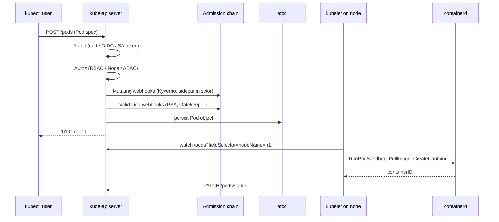

# Kubernetes Security

> Kubernetes is a distributed control plane that reconciles declared state (YAML manifests) into running containers across a fleet of nodes. From an appsec view it is three trust boundaries stacked on top of each other: the API server that mediates all state changes, the kubelet on each node that turns Pod specs into running containers, and the pod-to-pod network that is flat and permissive by default. Every attack path either abuses an over-broad RBAC grant to talk to the API server, steals a service account token to impersonate a workload, or exploits a Pod spec field (hostPath, privileged, hostNetwork) that the admission layer failed to block. The 4 Cs model (Cloud, Cluster, Container, Code) exists because a hardened pod inside a soft cluster inside an over-permissive cloud IAM role still yields cluster takeover; the layers compose multiplicatively. Pod Security Policy is gone (removed in v1.25); Pod Security Admission is built in but coarse, so most production clusters run Kyverno or Gatekeeper for real policy. The interview bar is not "name the components" but "trace a stolen pod token through RBAC, kubelet, and network policy to explain why it did or did not become cluster-admin."

## How it works

### Control plane and node components

The **API server** (`kube-apiserver`) is the only component that talks to etcd and the only front door for kubectl, controllers, and kubelets. Every request goes through authentication, authorization (RBAC by default), and admission control (mutating then validating) before the object is persisted. **etcd** stores all cluster state including secrets; if etcd leaks, the cluster leaks. The **controller manager** runs reconciliation loops (Deployment, ReplicaSet, ServiceAccount token controller, etc.). The **scheduler** picks nodes for pods based on resource requests, taints, and affinities.

On each node the **kubelet** watches the API server for Pods assigned to its node and instructs the **container runtime** (containerd or CRI-O; Docker shim was removed in v1.24) via CRI to pull images and start containers. **kube-proxy** programs iptables or IPVS to implement Service load balancing. The **CNI plugin** (Calico, Cilium, AWS VPC CNI, etc.) provisions pod networking and, if the plugin supports it, enforces NetworkPolicy.



### Authentication modes

The API server has no user database. It accepts identities from multiple authenticators tried in order:

- **X.509 client certificates** signed by the cluster CA. `CN` becomes the username, `O` becomes the group. Certificates cannot be revoked without rotating the CA, so cert-based user auth is discouraged for humans.
- **Service account tokens**: JWTs signed by the API server, mounted into pods at `/var/run/secrets/kubernetes.io/serviceaccount/token`. Since v1.22 these are projected, short-lived, and audience-bound (the "BoundServiceAccountTokenVolume" feature is GA and default).
- **OIDC**: the API server verifies an ID token from an external IdP (Okta, Google, Dex). Username and groups come from configured claims.
- **Webhook token auth**: the API server POSTs the bearer token to an external service for verification. Used by managed clusters (EKS uses `aws-iam-authenticator` or the newer `aws-auth` mapping).
- **Bootstrap tokens** for kubeadm node join, and **static token files** which are legacy and should not exist in production.

### RBAC model

Four kinds: `Role` and `RoleBinding` are namespace-scoped; `ClusterRole` and `ClusterRoleBinding` are cluster-scoped. A `ClusterRole` can be granted in a namespace via a `RoleBinding` (this is the standard way to give a service account read access to only its own namespace). Verbs are `get, list, watch, create, update, patch, delete, deletecollection` plus resource-specific ones like `impersonate`, `bind`, and `escalate`. The `escalate` verb on `roles`/`clusterroles` lets a subject grant privileges they do not themselves have, which turns a "role editor" into cluster-admin. The `bind` verb similarly lets a subject create bindings for privileges they do not have. Default `system:*` roles are baked into the API server and cannot be safely removed.

### Pod Security Admission

Since v1.25 the API server ships with a built-in admission plugin implementing three Pod Security Standards<sup>[[1]](#ref1)</sup>:

- **Privileged**: no restrictions. Suitable for infrastructure workloads (CNI agents, storage drivers) that need host access.
- **Baseline**: blocks the obviously dangerous fields (`privileged: true`, `hostNetwork`, `hostPID`, `hostIPC`, most `hostPath` volumes, adding capabilities beyond a small allow-list).
- **Restricted**: baseline plus non-root, seccomp `RuntimeDefault`, drop `ALL` capabilities, no privilege escalation, read-only root filesystem is recommended but not required.

Each namespace can carry three labels: `pod-security.kubernetes.io/enforce=<level>` (rejects violating pods), `.../audit=<level>` (logs), `.../warn=<level>` (kubectl warning). The `enforce` policy applies only at pod creation; existing pods are not re-evaluated when the label changes. PSA does not cover CRD workloads, image provenance, or network policy; for those you need Kyverno<sup>[[2]](#ref2)</sup>, Gatekeeper<sup>[[3]](#ref3)</sup>, or Kubewarden.

### NetworkPolicy

`NetworkPolicy` is a namespaced resource with pod selectors and ingress/egress rules. The default posture in a bare cluster is "all pods can reach all pods and all external endpoints", including cross-namespace. A `NetworkPolicy` that selects a pod switches that pod to default-deny for the direction (ingress or egress) that has rules. To get true default-deny across a namespace you create an empty-selector policy allowing nothing, then layer explicit allows. Enforcement depends on the CNI: flannel does not enforce policies at all, Calico and Cilium do. This is a common footgun: the manifest applies successfully but has zero effect because the CNI is a no-op.

### Secrets and etcd

`Secret` objects are stored in etcd as base64-encoded plaintext by default. Encryption at rest requires configuring `EncryptionConfiguration` on the API server with a KMS provider (AWS KMS, GCP KMS, HashiCorp Vault); the recommended provider is `kms v2` (GA in v1.29). Without KMS, anyone who reads etcd (backup files, disk snapshots, an etcd-role compromise) reads every secret in the cluster. Secret volumes are mounted into pods as tmpfs, so they are not written to node disk, but the API server serves them to any subject with `get secrets` in the namespace.

### Workload identity

Long-lived service account tokens are a footgun. The modern pattern is **workload identity federation**: the pod's projected service account token is exchanged for a cloud IAM credential via OIDC federation. On EKS this is IAM Roles for Service Accounts (IRSA) or Pod Identity; on GKE it is Workload Identity; on AKS it is Azure AD Workload Identity. The API server publishes an OIDC discovery document, the cloud IAM provider trusts that issuer, and pods get short-lived cloud credentials tied to `system:serviceaccount:<ns>:<name>`. See [81-spiffe-spire.md](81-spiffe-spire.md) for the generalized SPIFFE model this is a special case of.

## Quick reference

```yaml
# Wire: attacker compromises app pod, dumps projected SA token, hits API server
$ TOKEN=$(cat /var/run/secrets/kubernetes.io/serviceaccount/token)
$ CACERT=/var/run/secrets/kubernetes.io/serviceaccount/ca.crt
$ NS=$(cat /var/run/secrets/kubernetes.io/serviceaccount/namespace)
$ curl -sk --cacert $CACERT -H "Authorization: Bearer $TOKEN" \
    https://kubernetes.default.svc/api/v1/namespaces/$NS/secrets
# If this returns 200, the pod's SA has `get secrets` in its namespace.
# If it also works against /api/v1/secrets (cluster-wide), the SA is
# bound cluster-wide and every secret in the cluster is now readable.
```

| Invariant | Where enforced | How violated | Source |
|---|---|---|---|
| Every API request authenticated and authorized | kube-apiserver authn + authz chain | Anonymous auth left enabled (`--anonymous-auth=true`) with `system:unauthenticated` bound to a role | <sup>[[4]](#ref4)</sup> |
| Pods cannot mount host root or run privileged unless namespace opts in | Pod Security Admission at `enforce=restricted` | Namespace labeled `enforce=privileged` or PSA not labeled at all (defaults to no enforcement) | <sup>[[1]](#ref1)</sup> |
| Service account tokens are short-lived and audience-bound | BoundServiceAccountTokenVolume (GA v1.22) | `automountServiceAccountToken: true` on default SA plus legacy long-lived Secret-type token | <sup>[[5]](#ref5)</sup> |
| etcd contents encrypted at rest | `EncryptionConfiguration` with KMS provider on API server | Default install stores secrets as base64 in etcd; snapshot leak = full secret leak | <sup>[[6]](#ref6)</sup> |
| Pod-to-pod traffic default-deny | NetworkPolicy + CNI that enforces it (Calico, Cilium) | No NetworkPolicy present or CNI (flannel) does not enforce | <sup>[[7]](#ref7)</sup> |
| Kubelet API requires client cert authn and RBAC authz | `--authentication-token-webhook=true`, `--authorization-mode=Webhook` on kubelet | Kubelet on 10250 with `--anonymous-auth=true` and `--authorization-mode=AlwaysAllow` | <sup>[[4]](#ref4)</sup> |
| Admission webhooks fail closed for security policies | `failurePolicy: Fail` on ValidatingWebhookConfiguration | `failurePolicy: Ignore` means an attacker who DoSes the webhook bypasses policy | <sup>[[8]](#ref8)</sup> |

## Attack techniques

### 1. RBAC over-permissioning and cluster-admin sprawl

The most common cluster compromise is not a CVE; it is a service account that was granted `cluster-admin` because a Helm chart's default values had `rbac.create: true` and `serviceAccount.clusterAdmin: true`, or because an operator installer bound its controller service account to the built-in `cluster-admin` ClusterRole "temporarily" during setup and no one ever narrowed it. Once an attacker gets code execution in any pod with such a service account, the pod's projected token is a bearer credential to the API server; `curl` with that token creates a new privileged pod on any node, mounts the host filesystem, and reads every node's credentials.

The escalation surface is wider than "get secrets". The verbs `impersonate`, `escalate`, and `bind` are transitive privilege operators. `impersonate users` on the empty resource lets a subject send requests as any user including `system:admin`. `escalate roles` on `rbac.authorization.k8s.io` lets a subject create a Role or ClusterRole containing verbs they themselves do not have. `bind rolebindings` lets a subject bind an existing high-privilege ClusterRole to themselves. Kubernetes-goat and the "path to cluster-admin" community write-ups enumerate dozens of these one-step-away RBAC misconfigurations<sup>[[9]](#ref9)</sup>.

Black-box confirmation runs from inside a pod: `kubectl auth can-i --list` prints every verb/resource pair the current subject can perform, and `kubectl auth can-i create pods --as=system:serviceaccount:default:default` (from an admin context) tests specific paths. For a compromised pod, `curl` the API server with the mounted token against `/apis/authorization.k8s.io/v1/selfsubjectrulesreviews` to get the same output without kubectl installed.

### 2. Service account token theft from pod filesystem

Any code executing inside a pod can read `/var/run/secrets/kubernetes.io/serviceaccount/token`. This is the entire authentication story for in-cluster workloads; there is no additional secret. An SSRF or RCE that lets an attacker read files on the pod filesystem is an API server credential leak. Modern projected tokens are short-lived (typically 1 hour, refreshed by kubelet) and audience-bound (default audience is the API server itself), which narrows the window but does not close it: an attacker who exfiltrates the token gets ~1 hour of API access, or persistent access if they can re-read the file on rotation.

The mitigation many teams reach for is `automountServiceAccountToken: false` on the pod spec, which is correct but only for pods that do not need to talk to the API server. For pods that do need API access, the improvement is to bind to a specific narrow ServiceAccount instead of `default` and to enforce that via admission policy. The old (v1.21 and earlier) pattern of long-lived, non-audience-bound tokens stored in a Secret still exists as `kubernetes.io/service-account-token` and if any of those linger they never expire; a stolen legacy token is a permanent credential.

### 3. Dangerous Pod spec fields (privileged, hostPath, hostNetwork, hostPID)

Kubernetes exposes the Linux security model as Pod spec fields, and each dangerous field is a direct path to node compromise. `privileged: true` gives the container all capabilities and disables seccomp/AppArmor, so the container is functionally root on the node. `hostPath: /` mounts the node root filesystem into the pod, so an attacker copies `/etc/kubernetes/pki/*` (control-plane certs on master nodes) or `/var/lib/kubelet/pods/*/volumes/kubernetes.io~secret/*` (every other pod's secrets on that node). `hostNetwork: true` puts the pod on the node's network namespace, so it can talk to `localhost` services on the node including the kubelet's read-only port and, on some cloud providers, the cloud metadata service without the pod network's egress restrictions. `hostPID: true` lets the pod see and signal every process on the node, including the kubelet.

An attacker with `create pods` in any namespace can craft a pod with these fields and schedule it onto a target node using a `nodeSelector` or `nodeName`; from that pod, escaping to the node is one `nsenter` away (see [86-container-escape.md](86-container-escape.md)). This is the reason PSA `restricted` exists and the reason "just give the CI pipeline `create pods`" is a cluster-admin grant in disguise.

### 4. kubelet API and etcd exposure

Every node runs a kubelet with a TLS API on port 10250. If it is configured with `--anonymous-auth=true` and `--authorization-mode=AlwaysAllow` (the historic default; still seen on hand-rolled clusters), any network peer can hit `/pods` to list pods on that node, `/exec/<ns>/<pod>/<container>` to run a command, and `/run/<ns>/<pod>/<container>` to open a shell. This is a direct-to-shell primitive that bypasses the API server, RBAC, and audit logging entirely.

etcd itself listens on port 2379 (client) and 2380 (peer). If the client port is reachable without mutual TLS and etcd was configured with `--client-cert-auth=false`, an attacker with network access reads every object including secrets. Managed clusters (EKS, GKE, AKS) fence these ports off from the pod network by default; hand-rolled kubeadm clusters historically did not. The 2018 Tesla incident<sup>[[10]](#ref10)</sup> and the recurring "exposed Kubernetes dashboard" incidents (dashboard v1 defaulted to skip login on some builds) are variants of the same "control plane on the internet" pattern.

### 5. Admission webhook bypass via fail-open

Kyverno and Gatekeeper install as ValidatingWebhookConfigurations. Each webhook has a `failurePolicy` that controls what the API server does when the webhook is unreachable: `Ignore` admits the request (fail-open), `Fail` rejects it (fail-closed). A common misconfiguration is `failurePolicy: Ignore` on a policy webhook, sometimes chosen because the operator worried about the webhook taking the cluster down. The attack: the compromised subject deletes the policy pod (if they have `delete pods` in the policy namespace) or DoSes the webhook service, then submits the previously-blocked manifest during the outage. If any subject can `update validatingwebhookconfigurations`, they can flip `failurePolicy` themselves or narrow the `namespaceSelector` to exclude their target namespace<sup>[[8]](#ref8)</sup>.

The confirmation is direct: `kubectl get validatingwebhookconfigurations -o yaml | grep -E 'failurePolicy|namespaceSelector'` shows the enforcement posture. Bind this to admission-time policy: Kyverno itself can enforce that new webhooks must be `failurePolicy: Fail`.

### 6. Supply-chain: mutating webhooks and image tag mutability

Mutating admission webhooks run before validating ones and can rewrite any field of any object. The Istio and Linkerd sidecar injectors work this way; so do many "policy as code" tools. If an attacker installs a mutating webhook (requires `create mutatingwebhookconfigurations`, which is a cluster-admin verb by default but sometimes granted to platform operators), they can silently inject an extra container into every pod created in the cluster: a sidecar that reads the shared volume, exfiltrates the service account token, or opens a reverse shell. This is Kubernetes-native persistence; a red-team implant that survives node reboots and namespace deletions.

Image tag mutability is the other supply-chain surface. `image: myapp:latest` resolves to whatever the registry currently points `latest` at. An attacker who compromises the registry pushes a new `latest` and every pod that restarts pulls the malicious image. Even `image: myapp:v1.2.3` is mutable at the tag level (tags are not immutable in OCI unless the registry enforces it). Pinning to a digest (`myapp@sha256:...`) is the only cryptographic pin. Cosign/sigstore adds a signature layer verified at admission time via Kyverno's `verifyImages` or Sigstore's policy-controller<sup>[[11]](#ref11)</sup>.

### 7. Notable CVEs and CVE classes

**CVE-2018-1002105** (API server proxy)<sup>[[12]](#ref12)</sup>: the API server proxied user connections to backend services (aggregated API servers, kubelets, exec/attach). The proxy kept the backend connection open after the initial request completed and allowed the client to send arbitrary follow-up requests as the API server's own identity. Any user with `exec` permission on any pod became cluster-admin. Fixed by closing the proxied connection after the initial response. This is the archetypal "proxy state confusion" bug in Kubernetes and shows up in the CVSS 9.8 hall of fame.

**CVE-2020-8558** (kube-proxy iptables masquerade)<sup>[[13]](#ref13)</sup>: kube-proxy on some versions inserted an iptables rule that let containers reach services bound to the node's loopback interface (127.0.0.1) via the node IP. Local-only services (etcd on master nodes, cloud metadata proxies) that assumed 127.0.0.1 was safe were exposed to any pod. Fixed by adding a rule to drop `-d 127.0.0.0/8` on non-loopback interfaces.

**CVE-2022-0811 (cr8escape)** in CRI-O<sup>[[14]](#ref14)</sup>: the container runtime passed unsanitized sysctl values from Pod spec to the kernel. `kernel.core_pattern=|/proc/self/exe ...` set the core-dump handler to an attacker-controlled binary running on the host. Any subject with `create pods` and a namespace not enforced by PSA `restricted` (which blocks unsafe sysctls) could take the node.

**CVE-2025-1974 (IngressNightmare)** in ingress-nginx<sup>[[15]](#ref15)</sup>: a chain of bugs in the ingress-nginx admission webhook and template rendering allowed unauthenticated attackers who could reach the admission webhook (which was cluster-internal by default but sometimes exposed) to inject Nginx config directives, achieving RCE in the ingress controller pod. The ingress controller typically has a service account with `get secrets` cluster-wide to read TLS material, so RCE in ingress-nginx frequently escalates to reading every Secret in the cluster.

## Defense

### Real fix

1. **Enforce PSA `restricted` at every application namespace and PSA `baseline` at every infrastructure namespace.** Set the label at namespace creation time via admission policy so a new namespace cannot exist without it. Reserve `privileged` for a short allow-list of infrastructure namespaces (CNI, CSI, monitoring). Verify with `kubectl get ns -L pod-security.kubernetes.io/enforce`<sup>[[1]](#ref1)</sup>.

2. **RBAC least-privilege with no `cluster-admin` bindings outside break-glass.** Every ServiceAccount gets a namespace-scoped Role bound via RoleBinding; workloads that need cross-namespace read get a ClusterRole granted via RoleBinding in each target namespace, never a ClusterRoleBinding. Audit periodically: `kubectl get clusterrolebindings -o json | jq '.items[] | select(.roleRef.name=="cluster-admin")'` should return the empty set except for `system:masters` group binding. Deny `impersonate`, `escalate`, `bind`, and `create clusterrolebindings` verbs to anyone outside the platform team.

3. **NetworkPolicy default-deny on every namespace, on a CNI that enforces it.** Ship a default policy as part of namespace bootstrap: `podSelector: {}` with empty `ingress` and `egress` arrays, then layer explicit allows. Confirm the CNI enforces (`kubectl exec` into a pod and `curl` a pod that should be blocked; expect timeout, not RST)<sup>[[7]](#ref7)</sup>.

4. **Encrypt etcd at rest with a KMS provider (`kms v2`).** The `EncryptionConfiguration` should list `kms` first for `secrets` and `configmaps` (and any custom resources holding sensitive data), with `identity` as the fallback for decryption during rotation. Rotate the KMS key on a schedule and re-encrypt existing objects with `kubectl get secrets -A -o json | kubectl replace -f -`<sup>[[6]](#ref6)</sup>.

5. **Workload identity federation instead of long-lived tokens.** On EKS use IRSA or Pod Identity; on GKE use Workload Identity; on AKS use Azure AD Workload Identity. Pods exchange the projected SA token for a cloud IAM credential scoped to `system:serviceaccount:<ns>:<name>`, so the SA name is the cloud IAM principal. Delete legacy `kubernetes.io/service-account-token` Secrets, they are non-expiring<sup>[[5]](#ref5)</sup>.

6. **Admission policy blocking known-dangerous fields.** Kyverno<sup>[[2]](#ref2)</sup> or Gatekeeper<sup>[[3]](#ref3)</sup> policies that deny `privileged`, `hostPath` outside a small allow-list, `hostNetwork`, `hostPID`, `hostIPC`, adding capabilities beyond a small set, mutable image tags, and pods without a `securityContext.runAsNonRoot: true`. `failurePolicy: Fail` on all such webhooks with liveness probes so the API server never talks to a dead webhook.

7. **Image signing verified at admission.** Cosign-signed images with a policy-controller (Sigstore's `policy-controller` or Kyverno's `verifyImages`) that rejects unsigned or wrong-signer images at pod creation. Combined with digest pinning this closes the mutable-tag path<sup>[[11]](#ref11)</sup>.

### Defense in depth

1. **Private cluster endpoint.** The API server bound to a VPC/VNet endpoint with no public IP, accessible only via bastion, VPN, or cloud-private connectivity. Managed clusters expose this as `endpointPrivateAccess: true`; disable public access unless you have a specific reason.

2. **Node-authorization mode.** With `--authorization-mode=Node,RBAC` the Node authorizer restricts what a kubelet can do to only pods bound to its own node. Combined with the NodeRestriction admission plugin, this prevents a compromised kubelet from reading secrets for pods on other nodes.

3. **CIS Kubernetes Benchmark scan.** kube-bench (or the vendor equivalent) runs the CIS controls against control-plane and worker configs. The interview-relevant controls are the API server flags (`--anonymous-auth=false`, `--authorization-mode=Node,RBAC`, `--audit-log-path` set), kubelet flags, and etcd flags. Alert on drift.

4. **Runtime detection with Falco or Tetragon.** Rules for "shell in container", "cat /var/run/secrets", "outbound to Kubernetes API from unexpected pod", "process wrote to /etc/kubernetes on a node", "sensitive syscall from container". Runtime detection catches the post-exploitation half that admission policy cannot see.

5. **Audit log to an external sink with alerting.** `--audit-log-path` and an audit policy that captures `RequestResponse` for `secrets`, `serviceaccounts/token`, `rolebindings`, and `mutatingwebhookconfigurations`. Alert on `create clusterrolebindings` where `roleRef.name=cluster-admin`.

6. **Automount off by default.** Set `automountServiceAccountToken: false` at the ServiceAccount level for `default` in every namespace; pods that need API access opt in with a specific ServiceAccount.

7. **Read-only root filesystem and drop ALL capabilities** on application pods (`securityContext.readOnlyRootFilesystem: true`, `capabilities.drop: [ALL]`). Not a real fix on its own, but it removes the ergonomic tooling an attacker relies on post-RCE.

## Detection and telemetry

Key audit-log signals from the API server:

- `verb=create resource=pods` where the resulting pod has `spec.hostNetwork=true`, `spec.hostPID=true`, or a `spec.containers[].securityContext.privileged=true`. Log the user and namespace; alert on any non-infrastructure namespace.
- `verb=create resource=clusterrolebindings` where `roleRef.name` is `cluster-admin`, `admin`, or contains `edit`. Alert always.
- `verb=create resource=serviceaccounts/token` at high volume from one user or one IP. Legitimate workloads do this on rotation, but a scan-and-list from a compromised subject spikes this signal.
- `verb=exec resource=pods/exec` from a non-human user. Automation should not exec into pods; if it does, log and require a change ticket ID in an annotation.
- `verb=update resource=validatingwebhookconfigurations` or `mutatingwebhookconfigurations`. Alert on any change to `failurePolicy` or `namespaceSelector`.
- Anonymous requests to any resource (`user.username=system:anonymous`) that return anything other than 401/403. If this fires at all outside the health endpoints, `--anonymous-auth=true` is enabled and needs to be turned off.

Node-level signals (Falco/Tetragon):

- Process `nsenter`, `unshare`, or `docker` executed inside a container.
- `/proc/self/root/..` or `/proc/1/root/..` path traversal from a container.
- Container process opening `/var/run/docker.sock`, `/var/run/containerd/containerd.sock`, or `/var/lib/kubelet/pods/`.
- Shell (`bash`, `sh`, `zsh`) exec'd inside a container with an image label indicating a scratch or distroless base (should not have a shell to begin with).

Canary shape: a dedicated namespace with a "honey secret" (Secret object with a plausible-looking database password) and an audit rule that alerts on any `get secret/<name>` from any subject. Read attempts indicate an attacker enumerating secrets cluster-wide.

## Interviewer probes

**Q: A pod is compromised via RCE in the app. Walk me through the blast radius.**
Mid: The attacker reads the projected service account token from `/var/run/secrets/kubernetes.io/serviceaccount/token`, hits the API server, and can do whatever that ServiceAccount is authorized for.
Principal: Blast radius decomposes into three layers. First the SA's RBAC: run `curl` against `/apis/authorization.k8s.io/v1/selfsubjectrulesreviews` to enumerate. If the SA has `create pods` in any namespace, that is cluster-admin-equivalent (schedule a privileged pod, mount hostPath, escape). If it has only `get secrets` in one namespace, blast is contained to that namespace. Second the pod's network reach: with default-deny NetworkPolicy the pod cannot reach other pods or the cloud metadata service (169.254.169.254), so cloud IAM escalation via IMDSv1 is blocked. Third the node: if the pod is not `privileged` and PSA `restricted` is enforced, the pod cannot escape to the node via well-known primitives; the attacker is stuck at pod scope until a container-runtime CVE lands. The mitigation triage is: rotate the SA token, apply a NetworkPolicy quarantining the pod's labels, snapshot the pod for forensics, then delete.

**Q: Why is `automountServiceAccountToken: true` on the `default` ServiceAccount a problem?**
Mid: Because every pod that does not specify a ServiceAccount gets a token mounted, even if it does not need to talk to the API server; RCE in that pod leaks a credential.
Principal: The larger problem is the coupling: developers rarely audit ServiceAccount bindings on `default`, so a well-meaning platform engineer who binds a ClusterRole to `system:serviceaccounts:my-ns` (all SAs in the namespace) grants those privileges to every pod in the namespace, not just the ones explicitly opted in. Fix by defaulting `automountServiceAccountToken: false` on the `default` SA in every namespace, requiring workloads to declare a specific SA, and enforcing via admission policy that pods do not use `default`.

**Q: PSA vs Kyverno vs Gatekeeper. When would you use which?**
Mid: PSA is built in and covers the three standard levels; Kyverno and Gatekeeper are external and more flexible.
Principal: PSA is baseline coverage for pod-spec dangerous fields, and every cluster should have it on. It does not cover CRD resources, image provenance, resource limits, label requirements, or cross-resource invariants (e.g., "every Deployment must have a corresponding PodDisruptionBudget"). Kyverno uses native Kubernetes YAML which platform teams prefer for maintainability and diffing. Gatekeeper uses Rego which is more expressive for complex policies (multi-resource joins) but has a steeper learning curve. Kubewarden compiles policies to WebAssembly for portability and performance. In practice I would run PSA plus one of the three, with Kyverno being the default choice for a team without existing Rego expertise.

**Q: Explain the difference between an X.509 cert-based user and a ServiceAccount from the API server's view.**
Mid: X.509 certs are for humans, ServiceAccounts are for pods; both authenticate to the API server.
Principal: From the API server's view they are just two different authenticators feeding into the same authorization chain. A cert with `CN=alice, O=devs` becomes user `alice` in group `devs`, and RBAC applies. A ServiceAccount token JWT becomes user `system:serviceaccount:<ns>:<name>` in groups `system:serviceaccounts` and `system:serviceaccounts:<ns>`. The security-relevant difference is lifecycle: certs cannot be revoked without rotating the CA (the API server does not check a CRL by default), so cert-based user auth is discouraged. ServiceAccount tokens post-v1.22 are short-lived and audience-bound. For humans, OIDC federation with an external IdP is the right answer; the IdP owns revocation and MFA.

**Q: An engineer wants `hostPath` to mount the node's `/var/log` into a log-shipping pod. Is that OK?**
Mid: hostPath is dangerous; prefer a PersistentVolume or a sidecar log agent.
Principal: `hostPath: /var/log` is one of the least-bad hostPath uses because logs are non-secret and read-only, but two things need to be true. First, the pod runs on the node's logging DaemonSet identity, not a general-purpose ServiceAccount, so a compromise of it does not grant broad API access. Second, the mount is `readOnly: true`; otherwise a compromised container can plant a symlink from `/var/log/pwned` to `/etc/shadow` and read it via the read-only mount, or write to `/var/log` which some node components read and act on. The general rule is that hostPath is a namespace-level opt-in via PSA `baseline` allowing specific host paths, not a per-pod free-for-all. If the log-shipping is Fluent Bit or Vector, they have well-defined DaemonSet manifests that show up in the small allow-list.

**Q: How does IRSA/Workload Identity actually work end-to-end?**
Mid: The pod gets a short-lived cloud credential based on its ServiceAccount instead of using node IAM.
Principal: The API server publishes an OIDC discovery document at `/.well-known/openid-configuration` with the cluster's public keys. On EKS, that discovery document is exposed to AWS IAM via a public S3 URL registered as an OIDC identity provider in the AWS account. Pods get a projected ServiceAccount token with audience `sts.amazonaws.com` (configured via annotations on the SA). The pod's process calls STS `AssumeRoleWithWebIdentity` with that token; STS verifies the signature against the OIDC provider's public keys and, if the role's trust policy trusts `system:serviceaccount:<ns>:<name>`, issues temporary credentials. The SDKs handle this automatically via the `AWS_WEB_IDENTITY_TOKEN_FILE` and `AWS_ROLE_ARN` env vars that the EKS admission webhook injects. The security property is that the cloud IAM principal is scoped per-SA per-cluster, not per-node, so a compromised pod on a node with other tenants cannot steal the node's IAM role.

**Q: What is the point of `failurePolicy: Fail` on an admission webhook and when would you set `Ignore`?**
Mid: `Fail` rejects the request if the webhook is unreachable; `Ignore` admits it. Security policies should be `Fail`.
Principal: The tradeoff is availability vs security. A sidecar injector webhook that is down and set to `Fail` breaks every pod creation in the cluster including the webhook's own restart, which is a bootstrap deadlock. A security policy webhook set to `Ignore` is a bypass primitive: an attacker who can DoS the webhook (kill the pod, exhaust its resource quota, or overwhelm it with junk requests) then submits the previously-blocked manifest during the outage. The right posture is `Fail` for security policies plus a `namespaceSelector` that excludes `kube-system` and the webhook's own namespace (so the webhook can restart itself), plus HA replicas and a PodDisruptionBudget so a rolling update does not create an outage. For non-security webhooks (mutating injectors that are convenience features), `Ignore` can be reasonable if the injected behavior is not security-critical.

## War story

A platform team ran a Kyverno policy that denied `privileged: true` in every namespace except `kube-system`. A red-team exercise found that the ingress-nginx controller pod had `get secrets` cluster-wide (for TLS material) and shipped with an image whose tag was `v1.9.6`. The tag was still mutable on the internal registry mirror because tag immutability was set on the upstream registry but not the mirror. The red team pushed a modified image to `v1.9.6` on the mirror, then triggered a rolling restart of the ingress controller via a legitimate config-map change. The new pods pulled the malicious image, the exfil sidecar read the projected SA token, listed every Secret in every namespace via the API server (allowed by RBAC), and posted them to an external URL. Kyverno never fired because no pod had `privileged: true`; PSA `baseline` was in force but the ingress controller pod's spec was already compliant. The fix was three-part: switch the ingress controller image to a digest pin (`@sha256:...`), enable tag immutability on the mirror, and narrow the ingress controller's `get secrets` from cluster-wide to a named list of TLS-holding namespaces. The audit-log signal that would have caught this in the first place was `create serviceaccounts/token` at unusual volume plus `list secrets` cluster-wide from an unexpected user-agent; both were logged but not alerted.

## Sources

<a id="ref1"></a>[1] Pod Security Standards. Kubernetes Documentation. Retrieved 2026-08. https://kubernetes.io/docs/concepts/security/pod-security-standards/

<a id="ref2"></a>[2] Kyverno Policy Engine Documentation. Retrieved 2026-08. https://kyverno.io/docs/

<a id="ref3"></a>[3] OPA Gatekeeper Documentation. Retrieved 2026-08. https://open-policy-agent.github.io/gatekeeper/website/docs/

<a id="ref4"></a>[4] Controlling Access to the Kubernetes API. Kubernetes Documentation. Retrieved 2026-08. https://kubernetes.io/docs/concepts/security/controlling-access/

<a id="ref5"></a>[5] Configure Service Accounts for Pods, Bound Service Account Tokens. Kubernetes Documentation. Retrieved 2026-08. https://kubernetes.io/docs/tasks/configure-pod-container/configure-service-account/

<a id="ref6"></a>[6] Encrypting Confidential Data at Rest. Kubernetes Documentation. Retrieved 2026-08. https://kubernetes.io/docs/tasks/administer-cluster/encrypt-data/

<a id="ref7"></a>[7] Network Policies. Kubernetes Documentation. Retrieved 2026-08. https://kubernetes.io/docs/concepts/services-networking/network-policies/

<a id="ref8"></a>[8] Dynamic Admission Control. Kubernetes Documentation. Retrieved 2026-08. https://kubernetes.io/docs/reference/access-authn-authz/extensible-admission-controllers/

<a id="ref9"></a>[9] Kubernetes-goat: Interactive Kubernetes Security Learning. Retrieved 2026-08. https://madhuakula.com/kubernetes-goat/

<a id="ref10"></a>[10] Tesla's Kubernetes Console Not Password-Protected, Hackers Mined Cryptocurrency. Ars Technica. 2018-02. https://arstechnica.com/information-technology/2018/02/tesla-cloud-resources-are-hacked-to-run-cryptocurrency-mining-malware/

<a id="ref11"></a>[11] Sigstore Cosign Documentation. Retrieved 2026-08. https://docs.sigstore.dev/cosign/overview/

<a id="ref12"></a>[12] CVE-2018-1002105: Kubernetes API Server Privilege Escalation. Kubernetes Security Advisory. 2018-12. https://github.com/kubernetes/kubernetes/issues/71411

<a id="ref13"></a>[13] CVE-2020-8558: Node setting allows for neighboring hosts to bypass localhost boundary. Kubernetes Security Advisory. 2020-07. https://github.com/kubernetes/kubernetes/issues/92315

<a id="ref14"></a>[14] CVE-2022-0811 (cr8escape): CRI-O Container Escape via kernel.core_pattern. CrowdStrike Research. 2022-03. https://www.crowdstrike.com/blog/cr8escape-new-vulnerability-discovered-in-cri-o-container-engine-cve-2022-0811/

<a id="ref15"></a>[15] CVE-2025-1974 (IngressNightmare): ingress-nginx Remote Code Execution. Wiz Research. 2025-03. https://www.wiz.io/blog/ingress-nginx-kubernetes-vulnerabilities
