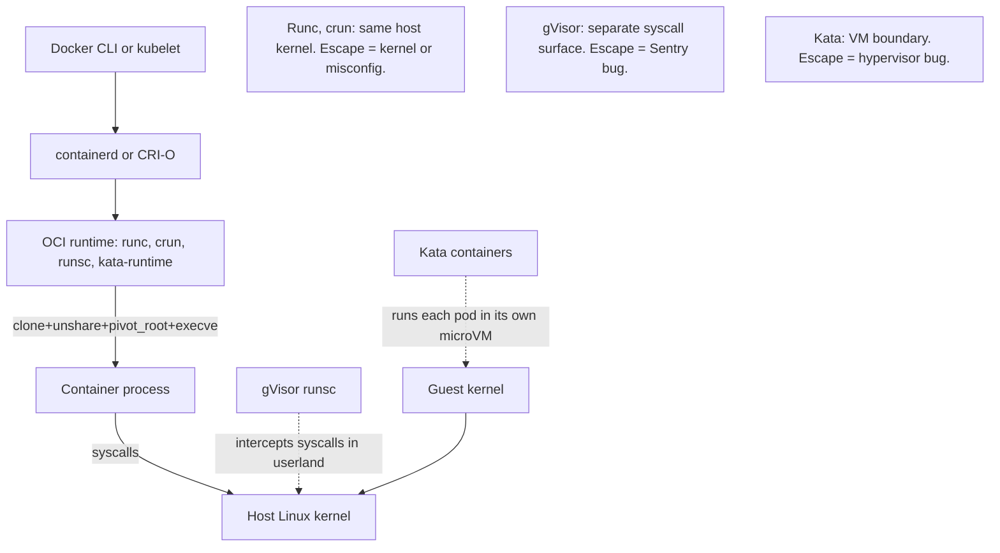

# Container Escape

> A container is not a security boundary in the way a VM is. It is a Linux process (or a set of processes sharing a PID namespace) whose view of the world has been narrowed by namespaces, whose resource use is capped by cgroups, whose kernel-facing surface is filtered by seccomp, and whose privilege set is trimmed by capability bits and an LSM (AppArmor or SELinux). The kernel is still shared. That means a single misconfiguration (privileged flag, host mount, dangerous capability, mounted docker socket) or a single kernel bug can put the attacker on the host as root, and from there onto every other container on that node. Escape is the move from that constrained process view to arbitrary code execution in the host's root mount namespace, and it is the most consequential lateral step in a modern cloud attack chain because it turns tenant-scoped RCE into node-scoped RCE.

**Interview frequency:** Situational

## How it works

### What a container actually is

There is no "container" object in the Linux kernel. The runtime (runc, crun, gVisor's runsc, kata's kata-runtime) calls `clone(2)` and `unshare(2)` with a set of `CLONE_NEW*` flags to create new namespaces, then applies cgroup limits, sets capabilities, loads a seccomp filter, applies an AppArmor or SELinux profile, does `pivot_root` into the image's rootfs, and finally `execve`s the entrypoint. When that entrypoint runs, the kernel it talks to is the same kernel the host is running. There is no hypervisor between them.

Namespaces provide the isolation illusion. Each namespace type virtualizes one kernel resource. The `mnt` namespace gives an independent mount table, so `/etc/passwd` inside the container is not `/etc/passwd` on the host. The `pid` namespace makes the container's init run as PID 1, unable to see host processes. The `net` namespace supplies its own interfaces, routes, iptables, and sockets. The `ipc`, `uts`, `cgroup`, and `time` namespaces virtualize SysV IPC, hostname, cgroup view, and clock offset respectively. The `user` namespace maps container UIDs to a range of host UIDs, so container root (uid 0) can be host uid 100000, the strongest isolation primitive Linux offers to a container.

Cgroups (v1 or v2) constrain resource use (CPU shares, memory ceiling, PID count, device access via `devices` controller in v1). Capabilities are the 40-ish privilege bits that split what used to be "root" (`CAP_NET_ADMIN`, `CAP_SYS_ADMIN`, `CAP_DAC_OVERRIDE`, `CAP_SYS_MODULE`, and so on). Seccomp is a BPF-filtered syscall allowlist (Docker's default profile blocks about 44 syscalls including `keyctl`, `mount`, `unshare` with new user ns for non-root, `bpf` for non-root, `perf_event_open`, etc.). AppArmor or SELinux adds a mandatory-access-control layer on top.

### Runtime layer diagram



With runc/crun, arbitrary syscalls from inside the container hit the host kernel directly, filtered only by seccomp. Any kernel LPE (local privilege escalation) becomes a container escape if the syscall isn't blocked by the seccomp profile.

### The Docker daemon and its socket

Classic Docker runs a root daemon (`dockerd`) that owns `/var/run/docker.sock`. Any process that can talk to that socket can create a new container with `--privileged` or with `-v /:/host`, which is a trivial one-line escape. This is why mounting `docker.sock` into a container is functionally equivalent to giving that container root on the host. Rootless Docker and Podman avoid the root daemon; Podman is daemonless and typically runs as a normal user with a user namespace mapping.

### Kubernetes pod-spec surface that maps to escape

Pod specs expose most of the primitives above as fields: `securityContext.privileged`, `hostPID`, `hostNetwork`, `hostIPC`, `hostPath` volumes, `securityContext.capabilities.add`, `securityContext.allowPrivilegeEscalation`, `securityContext.runAsUser`. Each of these is a knob that can turn a benign workload into a host takeover primitive. See [85-kubernetes.md](./85-kubernetes.md) for the admission-time controls.

## Quick reference

```bash
# Wire-level: the "am I in a container and how weak is it" recon sequence
# an attacker runs after landing RCE inside a container.

# 1. Confirm we're in a container.
cat /proc/1/cgroup                # cgroup path with 'docker' or 'kubepods' = containerized
ls -la /.dockerenv 2>/dev/null    # legacy Docker marker file
cat /proc/self/status | grep CapEff   # effective capability bitmap

# 2. Enumerate the escape surface.
capsh --decode=$(grep CapEff /proc/self/status | awk '{print $2}')
mount | grep -E '(docker\.sock|/host|/var/run)'
ls -la /dev                       # /dev/sda* visible = hostPath / privileged
cat /proc/self/status | grep Seccomp   # 0 = disabled, 2 = filter loaded

# 3. If privileged or CAP_SYS_ADMIN + mount is unfiltered: mount the host disk.
mkdir /tmp/host && mount /dev/sda1 /tmp/host && chroot /tmp/host

# 4. If docker.sock is mounted: spawn a privileged sibling with the host mounted.
curl --unix-socket /var/run/docker.sock \
  -H 'Content-Type: application/json' \
  -d '{"Image":"alpine","Cmd":["chroot","/host","sh"],"HostConfig":{"Privileged":true,"Binds":["/:/host"]}}' \
  http://localhost/containers/create
```

| Invariant | Where enforced | How violated | Source |
|---|---|---|---|
| Container process runs without `CAP_SYS_ADMIN` | Runtime capability set at `execve` | `privileged: true`, `capAdd: [SYS_ADMIN]`, or default caps not stripped | <sup>[[1]](#ref1)</sup><sup>[[2]](#ref2)</sup> |
| Host filesystem is not visible in container mount namespace | `pivot_root` at container start | `hostPath` volume, `-v /:/host`, or `/var/run/docker.sock` mounted | <sup>[[3]](#ref3)</sup><sup>[[4]](#ref4)</sup> |
| Seccomp filter blocks kernel-attack syscalls (keyctl, unshare, bpf for non-root, mount) | Kernel seccomp BPF at `execve` | `--security-opt seccomp=unconfined`, `privileged: true`, or PSA Privileged profile | <sup>[[1]](#ref1)</sup><sup>[[5]](#ref5)</sup> |
| Container uid 0 is not host uid 0 | User namespace UID map | User namespaces disabled or not configured (default for most K8s deployments as of 2026) | <sup>[[6]](#ref6)</sup> |
| Runtime binary (`runc`) cannot be re-opened as writable from inside container | Runtime memfd + symlink logic at exec | Pre-fix runc allowed `/proc/self/exe` overwrite (CVE-2019-5736), fd leak (CVE-2024-21626) | <sup>[[7]](#ref7)</sup><sup>[[8]](#ref8)</sup> |
| Host kernel is patched against known LPE families | Node OS patch cadence | Unpatched Dirty Pipe (CVE-2022-0847), cgroup v1 release_agent (CVE-2022-0492), OverlayFS bugs | <sup>[[9]](#ref9)</sup><sup>[[10]](#ref10)</sup> |
| AppArmor or SELinux profile is loaded and enforcing | LSM hook at process creation | `--security-opt apparmor=unconfined`, missing profile on the node, permissive SELinux | <sup>[[1]](#ref1)</sup> |

## Attack techniques

### 1. Privileged container escape

The `--privileged` flag (or `securityContext.privileged: true` in a K8s pod) is not a single toggle. It disables the AppArmor/SELinux profile, disables the default seccomp filter, grants all capabilities including `CAP_SYS_ADMIN` and `CAP_SYS_MODULE`, and exposes every host device under `/dev` to the container<sup>[[1]](#ref1)</sup>. The container can `mount` any block device, load kernel modules, and read host memory via `/dev/mem` on systems where that device is not restricted.

The canonical exploit takes three commands. The attacker lists `/dev` to find the host root disk (usually `/dev/sda1`, `/dev/nvme0n1p1`, or a mapped volume), creates a mount point, mounts the disk read-write into the container mount namespace, and either `chroot`s in or reads `/etc/shadow` and drops an SSH key into `/root/.ssh/authorized_keys`. The same primitive lets the attacker overwrite `/etc/cron.d/*` on the host for delayed execution, or drop a payload into a kubelet-watched manifest path (`/etc/kubernetes/manifests/`) to launch a new privileged pod on the node.

Black-box confirmation from inside is trivial: `grep CapEff /proc/self/status` returns `000001ffffffffff` (or similar all-ones bitmap) on privileged containers, and `ls /dev/sda1` succeeds when it shouldn't<sup>[[2]](#ref2)</sup>. On Kubernetes, `kubectl auth can-i create pods --as=system:serviceaccount:default:default` combined with a permissive PSA namespace often reveals that any workload can request `privileged: true`.

### 2. hostPath and docker.sock mount escape

Every container runtime honors bind mounts from the host. If the pod spec sets a `hostPath` volume pointing at `/` or at a sensitive path, or if `/var/run/docker.sock` is mounted (very common in CI runners, monitoring agents, and "sidecar that talks to Docker" designs), the container has host filesystem access without any capability or seccomp bypass required<sup>[[3]](#ref3)</sup>. The permission model is entirely mount-based; the kernel does not know or care that the file happened to be exposed by the runtime.

With `docker.sock` mounted, the attacker doesn't need to escape the current container at all. They issue an HTTP request over the UNIX socket to the Docker API to create and start a new container with `Privileged: true` and `Binds: ["/:/host"]`, then `docker exec` into it. That new container is a sibling on the host with full root; from there, they read the kubelet client cert, they read etcd data if this node runs etcd, they enumerate every other pod's secrets from `/var/lib/kubelet/pods/*/volumes/kubernetes.io~secret/`<sup>[[4]](#ref4)</sup>.

Blind confirmation without shell RCE: send a request to any endpoint an attacker suspects proxies to `docker.sock` (some CI systems expose a webhook that runs `docker` commands). If a container image reference in the payload triggers a pull that shows up in `docker ps` on a shared runner, the escape surface is live. Escalation is instant on hit.

### 3. CAP_SYS_ADMIN abuse

Even without `privileged: true`, adding `CAP_SYS_ADMIN` to the capability set (some workloads request it for FUSE mounts, for `setns`, or because the developer copied a Stack Overflow answer) gives roughly the same escape surface. `CAP_SYS_ADMIN` grants the ability to call `mount`, `pivot_root`, `unshare` with new namespaces, `keyctl`, `setns` into other namespaces, and to write to `/proc/sys` entries.

The classic cgroup v1 `release_agent` escape uses `CAP_SYS_ADMIN` plus an unfiltered cgroup mount<sup>[[11]](#ref11)</sup>. The attacker creates a new cgroup, writes a script path into `release_agent`, sets `notify_on_release` on a child cgroup, and when the last task in that child exits, the kernel runs the release_agent binary as root on the host. The trick is that the release_agent path is resolved in the host's mount namespace, so writing `/tmp/x` inside the container and having `notify_on_release` fire executes the host's `/tmp/x`. Because the container's rootfs is layered under a well-known path on the host (`/var/lib/docker/overlay2/*/merged`), the attacker writes the script into a container-visible file whose host-side path they compute and reference in `release_agent`.

Black-box confirmation: `capsh --decode` shows `cap_sys_admin` in the effective set, and `mount -t cgroup -o rdma cgroup /tmp/x` succeeds (an unusual controller that is likely unmounted, giving the attacker a clean cgroup hierarchy to abuse). Blind/OOB variant: when the attacker has no shell but has a command-injection primitive that runs one line, they set `release_agent` to a script that curls an attacker-controlled DNS or HTTP endpoint carrying `hostname -f` output; the DNS beacon arrives from the host's network namespace with the host's hostname, confirming the escape without needing return output. Cgroup v2 removed `release_agent` (there is no equivalent notification mechanism callable from inside), so this technique dies on modern cgroup-v2-only hosts. However, cgroup v1 is still the default in many long-lived clusters, and hybrid v1+v2 hosts remain common in 2026.

### 4. CAP_DAC_READ_SEARCH file-read escape

`CAP_DAC_READ_SEARCH` lets a process bypass DAC read checks. Alone it does not grant write, but it enables `open_by_handle_at(2)`, a syscall that opens a file by an opaque handle rather than a path. Because file handles reference the underlying inode not the mount namespace's path, an attacker with this capability can walk from the container's rootfs to the host's rootfs by brute-forcing handle values (there are relatively few valid inodes for `/etc/shadow`, `/root/.ssh/id_rsa`, and kubelet client cert files)<sup>[[12]](#ref12)</sup>.

Black-box confirmation: `capsh --decode` lists `cap_dac_read_search` in `CapEff`, and a small PoC that iterates handle values (root inode is typically 2 on ext4) returns readable bytes for `/etc/shadow` even though the container has its own separate shadow file. Blind/OOB variant: exfiltrate the read kubelet client key by base64-encoding it into a series of DNS subdomain lookups back to an attacker DNS zone; the reads themselves generate no host-visible file activity, only network egress.

The technique, sometimes called "shocker" after the original Docker escape PoC, is a pure read primitive, but reading kubelet client certificates or the kubelet's service-account token is enough to pivot to node-level API server access, from which many clusters permit privileged pod creation on that node. Combined with a permissive `nodes/proxy` or `pods/exec` RBAC binding, read is escalated to write within one hop.

### 5. Runtime bugs: runc /proc/self/exe overwrite and file-descriptor leaks

Two runc vulnerabilities anchor this class. CVE-2019-5736 exploited runc's behavior of re-executing itself via `/proc/self/exe` when joining an existing container<sup>[[7]](#ref7)</sup>. The attacker, running as root inside a container, replaced `/proc/self/exe` (which pointed to the host's `runc` binary) with a payload. When the next `docker exec` or `kubectl exec` fired, the host ran the attacker's binary as root. The fix was for runc to copy itself into a memfd at startup and re-exec from that memfd instead.

CVE-2024-21626 was a file-descriptor leak in runc<sup>[[8]](#ref8)</sup>. Before the fix, runc leaked an internal file descriptor to the container process; that fd referenced a directory in the host filesystem. The container process could `fchdir` to that fd and be inside the host's root, then `chroot(".")` or open arbitrary host paths. This one was particularly nasty because it required no special capability or configuration inside the container, only a container image whose entrypoint exploited the leaked fd. The advisory recommended immediate patching to runc 1.1.12 or later.

Black-box confirmation for the fd-leak class: iterate `/proc/self/fd/*` at container start and `readlink` each entry; any fd pointing outside the container's rootfs (e.g., `/run/containerd/...`) is the leak. Blind/OOB variant: a malicious image's entrypoint uses the leaked fd to read `/etc/hostname` from the host and encode it into an outbound HTTPS request or a DNS lookup, giving the attacker proof of escape even when the container has no interactive TTY. Detection in both cases is retrospective: look for `runc` binary hashes changing on nodes, or for process trees where a container's `execve` produces a child running host binaries with the container's cgroup but the host's mount namespace.

### 6. Kernel LPE as escape

Every serious Linux kernel LPE of the last few years has been usable as a container escape when the required syscalls were not blocked by seccomp. Dirty Pipe (CVE-2022-0847) let a process write to arbitrary files it could read, including SUID binaries the container might have mounted from the host<sup>[[9]](#ref9)</sup>. Dirty COW (CVE-2016-5195) predated the seccomp default profile and was universally exploitable from inside containers. StackRot (CVE-2023-3269), the netfilter bugs of 2023-2024, and the io_uring family (still occasionally producing bugs in 2025) all fall in this bucket.

CVE-2022-0492 was cgroup-v1-specific: the kernel's `cgroup_release_agent_write` did not check whether the writer had `CAP_SYS_ADMIN` in the initial user namespace<sup>[[10]](#ref10)</sup>. An unprivileged container (no `CAP_SYS_ADMIN`, no `privileged: true`) could, if it could remount cgroup v1 with new mount options (a chain that requires user namespaces enabled and the cgroup fs to be mountable), abuse `release_agent` as in technique 3 above. The mitigation was a kernel patch; the durable defense is cgroup v2 or a seccomp policy that blocks `mount`.

Black-box confirmation: read `uname -r` and compare against the vendor's fixed-version table for the CVE in question; also read `/proc/self/status` for the Seccomp value (0 = no filter, meaning any known LPE with an unblocked syscall trigger will fly). Blind/OOB variant: LPE PoCs typically write a marker file into the host rootfs; the attacker instead has the payload beacon out via DNS from a spawned host-uid-0 process, confirming escape without interactive access. Seccomp default matters more than most operators realize. Docker's default profile and Kubernetes' `RuntimeDefault` block `keyctl`, `unshare` with new user namespace for non-root, `bpf` for non-root, `mount`, `perf_event_open`, and a few dozen others. A workload running with `seccomp: unconfined` (still the K8s default unless a `securityContext.seccompProfile` is set) hands the attacker every kernel bug the host has not patched.

### 7. DIND and CI-runner variants

Docker-in-Docker (DIND) is a common CI pattern: the CI job runs in a container, and to build container images, it either mounts `/var/run/docker.sock` from the host or runs a nested Docker daemon. Both paths are escape-equivalent by design. Mounting the socket is technique 2 above. The nested daemon requires `--privileged` because the daemon needs to create namespaces and mount, which lands in technique 1.

Black-box confirmation on a landed CI job: `ls -l /var/run/docker.sock` returns a real socket, `docker ps` from inside the job returns host-level containers (not just the job's own), and `docker info` reports a `Docker Root Dir` that lives on the host filesystem. Blind/OOB variant: a PR-submitted workflow that never returns stdout can still be confirmed as escape-capable by having its build step pull an attacker-controlled image; the pull is observable on the attacker's registry logs and proves the socket is reachable. Real-world CI attacks in 2023-2025 leaned heavily on this. An attacker with the ability to submit a pull request whose CI workflow ran on a self-hosted runner (a shared runner without job-level isolation) got RCE inside the runner container, and from `docker.sock` reached the host, and from there reached the runner's cached credentials for pushing to production container registries<sup>[[13]](#ref13)</sup>. This is where container escape intersects with the CI/CD attack surface covered in build-supply-chain reviews.

## Defense

### Real fix

1. **Never run `privileged: true`, and enforce this at admission.** In Kubernetes, use Pod Security Admission's `Restricted` profile at the namespace level (the label `pod-security.kubernetes.io/enforce=restricted`) which forbids privileged, `hostPath`, host namespaces, adding capabilities, and running as root<sup>[[6]](#ref6)</sup>. Where PSA is not expressive enough (e.g., allowing `NET_ADMIN` for one specific workload), use a policy engine like Kyverno or Gatekeeper to write explicit allowlists. In Docker deployments, wrap `docker run` in a launcher that refuses the `--privileged` flag.

2. Drop ALL capabilities and add back only what the workload proves it needs. Start from `securityContext.capabilities.drop: ["ALL"]` and add specific caps (`NET_BIND_SERVICE` for port 80/443, and almost nothing else for typical HTTP services). Refuse `SYS_ADMIN` categorically; if a workload claims it needs it (usually for FUSE, sometimes for `nsenter`), the correct fix is to run that workload under a different isolation model (gVisor or a dedicated VM), not to grant the capability<sup>[[1]](#ref1)</sup>.

3. Set `securityContext.seccompProfile.type: RuntimeDefault` (Kubernetes) or leave Docker's default seccomp profile on. Do not use `unconfined` unless you have written a workload-specific profile that is strictly narrower. Docker's default blocks the syscalls that most kernel-LPE exploits need; K8s's `RuntimeDefault` maps to the container runtime's default (containerd, CRI-O both ship a strong profile). Recent Kubernetes releases added a `SeccompDefault` kubelet feature gate that can make `RuntimeDefault` the cluster-wide default; consult the current release notes for its stability status<sup>[[5]](#ref5)</sup>.

4. Enable user namespaces so that container uid 0 maps to a high, unprivileged host uid. User namespaces for pods have been progressing through alpha/beta over recent Kubernetes releases behind the `UserNamespacesSupport` feature gate and the `hostUsers: false` pod spec field; check the current Kubernetes release notes and the tracking KEP for GA status before relying on it in production<sup>[[15]](#ref15)</sup>. Where available, this turns most in-container root exploits into "attacker is unprivileged host user under `/var/lib/kubelet/pods/$POD/...`," which is a dramatically smaller blast radius. Adoption is still catching up because it interacts with volume permissions and some CSI drivers; test carefully.

5. Do not mount `docker.sock`, and do not mount `hostPath` at `/` or at any sensitive path<sup>[[3]](#ref3)</sup>. For CI systems that need to build images, use rootless BuildKit, Kaniko, or Buildah with subuid mapping instead of DIND. For monitoring agents that legitimately need host visibility, use a DaemonSet with narrowly scoped hostPath (`/var/log` read-only for a log shipper) rather than root-fs mount.

6. Patch the host kernel promptly. Container escape via kernel LPE is a patch-management problem, not a container-security problem. Node OS images should be rebuilt regularly, and clusters should have a mechanism for node drain-and-replace on emergency CVEs (Dirty Pipe was fixed within a week by most managed K8s vendors; self-managed clusters were vulnerable for months). The CIS Kubernetes Benchmark's node-hardening controls capture the operational baseline<sup>[[16]](#ref16)</sup>.

### Defense in depth

1. Run untrusted workloads under gVisor or Kata. gVisor (`runsc`) implements a userspace Linux kernel (the Sentry) that intercepts syscalls from the container process and services them in user mode, sharply reducing the host kernel attack surface. It is not free (some syscalls are slow, some are unsupported), but for multi-tenant SaaS running customer code it is the right default<sup>[[14]](#ref14)</sup>. Kata Containers puts each pod in a lightweight VM (Firecracker, Cloud Hypervisor, or QEMU), giving a hypervisor boundary. Kata's cost is higher but its isolation is closer to a true VM. Selection heuristic: choose gVisor when you need moderate isolation for many small tenants and can tolerate its syscall limitations (typical web workloads, script execution sandboxes); choose Kata when the tenant is actively adversarial or when the workload needs full Linux syscall coverage that gVisor does not implement well (e.g., some ptrace, io_uring, or kernel-module patterns).

2. Read-only root filesystem plus tmpfs for `/tmp`. `securityContext.readOnlyRootFilesystem: true` blocks the "write payload to /tmp and execute it" step of most escape chains. Combine with `allowPrivilegeEscalation: false` to disable `setuid` binaries entirely.

3. AppArmor or SELinux profile on every container. Docker ships a default AppArmor profile (`docker-default`) that blocks writes to `/proc/*` and other sensitive kernel interfaces. Kubernetes supports AppArmor via pod-spec fields; check the current release notes for the exact field names and stability<sup>[[1]](#ref1)</sup>.

4. Runtime patch cadence for the container runtime itself. Track runc, containerd, and CRI-O CVEs. The 2024 runc fd leak (CVE-2024-21626) required a runtime restart, not a node reboot, so the operational cost is low but the security value is high<sup>[[8]](#ref8)</sup>.

5. Network policy at the pod level. An escaped container that cannot reach the API server on the node port cannot easily pivot to cluster-wide compromise. See [85-kubernetes.md](./85-kubernetes.md) for `NetworkPolicy` patterns; combine with a cloud-provider firewall on the node egress path.

6. Detection on the node: eBPF-based runtime security tools (Falco, Tetragon, Cilium Tetragon) can flag suspicious syscall patterns from inside containers, including `mount` calls, unexpected `execve` of shell binaries, and writes to `/etc/kubernetes/manifests` from container processes. Alerting is not prevention but shortens dwell time when the primary controls fail.

## Detection and telemetry

Escape attempts are noisy at the syscall level once you know what to look for. Log or alert on:

- Any process inside a pod's cgroup calling `mount(2)`, `pivot_root(2)`, `unshare(2)` with `CLONE_NEWNS`, `keyctl(2)`, or `bpf(2)` for a non-root uid. Falco has canonical rules for each; Tetragon can enforce (kill) rather than just alert.
- `open_by_handle_at(2)` from any process inside a container is essentially never benign. Alert always.
- Writes to `/proc/*/root` or `/proc/*/ns/*` from container processes.
- Any process whose cgroup is `/kubepods/*` but whose mount namespace is `/proc/1/ns/mnt` (the host's). This is the definitive signal that an escape has already occurred.
- Kubelet audit logs showing `exec` requests to a pod immediately followed by `runc` binary hash changes on the node (CVE-2019-5736 signature).
- Container image layers containing `/proc/self/exe`-writing binaries, `nsenter`, or `capsh` (recon tools). A strong prior for scanning, though not proof of malicious intent.
- Node process trees where a container's PID escapes its expected namespace boundary. `pstree` on the host with namespace annotations (via `nsenter -t $pid -m ...`) can reveal this.

Canary shape: deploy a "honeypod" in each namespace that intentionally exposes a fake credential in an environment variable and a fake path in `/etc`. Any access to those resources from another pod indicates an escape has happened and lateral movement is underway. This works because escaped attackers enumerate `/var/lib/kubelet/pods/*` looking for tokens and hit the honeypod within seconds.

## Interviewer probes

**Q: What does `privileged: true` actually do, at the syscall and LSM level?**
Mid: It grants all capabilities and disables seccomp and AppArmor. Principal: It sets the effective and permitted capability bitmap to all-ones (all 40+ caps), skips loading the default seccomp profile so all syscalls reach the kernel, disables the AppArmor profile so the LSM hook is a no-op, and binds every device under `/dev` into the container's devtmpfs. Practically, from inside the container, `CapEff` reads `000001ffffffffff`, `Seccomp` is 0, `/dev/sda1` is a real block device, and `mount` works. Escape is a three-command exercise.

**Q: If I have only `CAP_SYS_ADMIN` (no other privilege), how do I escape?**
Mid: You can mount things, so you mount the host disk. Principal: Cgroup v1 `release_agent` if the host still runs cgroup v1, because `SYS_ADMIN` lets you mount the cgroup fs with new options. Alternatively, `unshare` into a new mount namespace and `pivot_root` to a controlled rootfs, then use `mount` with `MS_MOVE` to relocate the host's rootfs into view. If seccomp isn't blocking `keyctl`, the keyring becomes an escalation surface too. On cgroup v2 only hosts, `release_agent` is gone, but `SYS_ADMIN` still lets you mount arbitrary filesystems if the necessary block devices are visible or if FUSE is available.

**Q: The developer says the workload needs `docker.sock` to trigger builds from a webhook. What do you do?**
Mid: Refuse and suggest a build API. Principal: Explain that mounting `docker.sock` is equivalent to running the workload as host root, because the Docker API accepts `Privileged: true, Binds: ["/:/host"]` from any client. Replace with one of: rootless BuildKit as a sidecar (does not need the host daemon), a dedicated build service the webhook calls over authenticated HTTPS with per-repo scoping, or Kaniko for daemonless builds. If the answer is "we don't have time," at minimum wrap the socket in a proxy (docker-socket-proxy) that whitelists specific endpoints, and understand that this is a stopgap, not a fix.

**Q: Walk me through CVE-2024-21626.**
Mid: A file descriptor leak in runc let containers access the host filesystem. Principal: runc had internal file descriptors it kept open across the fork/exec into the container process. One of these fds referenced a directory inside the host filesystem (not the container's rootfs). The container process could `fchdir` to the leaked fd number, at which point its current working directory was on the host, and then `openat` with a relative path resolved against the host rootfs. The fix in runc 1.1.12 was to explicitly close-on-exec all internal fds before executing the container entrypoint. The advisory rated it high severity because it required only a malicious image (no privileged flag, no capability grant), so a compromised image on any node was sufficient.

**Q: How does gVisor prevent kernel-LPE escapes?**
Mid: It runs a userspace kernel so exploits target that instead of the real kernel. Principal: gVisor intercepts syscalls via `ptrace` or KVM (depending on platform) and services them in the Sentry, a userspace implementation of Linux syscall semantics. Only a small allowlist of syscalls (roughly 50-70, versus the 400+ in a normal Linux kernel) actually reach the host kernel, and those are further filtered. Dirty Pipe, StackRot, and other page-cache or memory-management bugs don't apply because gVisor doesn't use the host kernel for those operations. The escape surface reduces to bugs in the Sentry itself and to bugs in the platform code that talks to KVM. Real Sentry escapes have been found (a handful over the project's lifetime) but the base rate is orders of magnitude lower than host-kernel LPE.

**Q: Your cluster runs 200 tenants, each with untrusted code. What's the isolation model?**
Mid: gVisor or Kata plus Restricted PSA. Principal: Node-per-tenant is the strongest and most operationally expensive option, and it is what actually gets used for high-value tenants (financial workloads, healthcare). One tier down: dedicated node pools per trust tier, with taints and tolerations enforcing that untrusted workloads only run on nodes running Kata or gVisor. Combine with per-tenant network policy, per-tenant IAM roles via workload identity (so an escape reveals only that tenant's cloud credentials), and per-tenant secret scoping. An escape on a Kata-VM boundary is rare; combined with a matching cloud IAM escalation, rarer still. The goal is to make the joint probability low enough for the SLA.

**Q: How do you detect a container escape you didn't prevent?**
Mid: Falco rules for `mount`, `unshare`, host filesystem access. Principal: Instrument at three layers. At the syscall layer, Falco or Tetragon on every node with rules for the syscalls that container escape requires (`mount`, `pivot_root`, `keyctl`, `open_by_handle_at`, `bpf` for non-root). At the process layer, correlate cgroup identity with mount namespace identity; any process whose cgroup says "container" but whose mount namespace is the host's is by definition escaped. At the artifact layer, honeypods and canary secrets in every namespace, with high-fidelity alerts when they are read. The critical property is that at least one layer catches each known technique, and that the alerting SLA is minutes not hours because lateral movement from a node compromise to cluster compromise is fast.

**Q: What changed with PodSecurityPolicy being removed in K8s 1.25?**
Mid: PSA replaced it, with three built-in profiles. Principal: PSP was an admission controller with a CRD-like API for policy, and it had well-known problems (RBAC coupling was confusing, ordering of policies was ambiguous, and it was implemented as a plugin the API server had to be built with). PSA (Pod Security Admission) replaced it in stable form in 1.25 and is built into the API server, applied via namespace labels (`enforce`, `audit`, `warn` at `privileged`, `baseline`, or `restricted`). PSA is deliberately less expressive than PSP was, because for anything beyond the three standard profiles the recommended path is Kyverno or Gatekeeper (or Kubewarden). Policy engines are now the default for anything workload-specific; PSA is just the floor.

## War story

A team ran a self-hosted GitHub Actions runner for their monorepo. The runner was containerized. To build container images, the pod mounted `/var/run/docker.sock` from the host. Runner jobs from any PR (including forks, because they used the default trigger config that allowed workflow runs on `pull_request` from forks) executed inside this container. An external contributor opened a PR that modified the workflow to run a shell script from the PR branch. The script hit the mounted docker socket, launched a privileged sibling container with `-v /:/host`, wrote an SSH authorized_keys file into `/host/root/.ssh/`, and exfiltrated the runner's cached GHCR push credential. The credential had write access to production images. Detection came from the container registry's audit log flagging an image push from an IP not on the CI network's allowlist, roughly 40 minutes after the initial compromise. Recovery included rotating the GHCR token, rebuilding every image pushed in the previous 24 hours from source, and moving to an ephemeral runner architecture with the socket removed. The socket mount had been added a year earlier by someone whose commit message was "make build work"; nobody had reviewed it as a security boundary because it never presented as one until a fork PR ran on it.

## Sources

<a id="ref1"></a>[1] Docker Security Documentation: Runtime Privilege and Linux Capabilities. Docker Inc. Accessed 2026. https://docs.docker.com/engine/security/

<a id="ref2"></a>[2] Kubernetes Documentation: Security Context. Kubernetes Project. Accessed 2026. https://kubernetes.io/docs/tasks/configure-pod-container/security-context/

<a id="ref3"></a>[3] Kubernetes Documentation: Volumes hostPath. Kubernetes Project. Accessed 2026. https://kubernetes.io/docs/concepts/storage/volumes/#hostpath

<a id="ref4"></a>[4] Trail of Bits: Understanding Docker container escapes. Blog post. 2019-07-19. https://blog.trailofbits.com/2019/07/19/understanding-docker-container-escapes/

<a id="ref5"></a>[5] Kubernetes Documentation: Restrict a Container's Syscalls with seccomp. Kubernetes Project. Accessed 2026. https://kubernetes.io/docs/tutorials/security/seccomp/

<a id="ref6"></a>[6] Kubernetes Documentation: Pod Security Standards and Pod Security Admission. Kubernetes Project. Accessed 2026. https://kubernetes.io/docs/concepts/security/pod-security-standards/

<a id="ref7"></a>[7] CVE-2019-5736: runc container breakout via /proc/self/exe. National Vulnerability Database. 2019-02-11. https://nvd.nist.gov/vuln/detail/CVE-2019-5736

<a id="ref8"></a>[8] CVE-2024-21626: runc file descriptor leak (Leaky Vessels). Snyk advisory and NVD entry. 2024-01-31. https://nvd.nist.gov/vuln/detail/CVE-2024-21626

<a id="ref9"></a>[9] CVE-2022-0847: Linux kernel Dirty Pipe. National Vulnerability Database. 2022-03-07. https://nvd.nist.gov/vuln/detail/CVE-2022-0847

<a id="ref10"></a>[10] CVE-2022-0492: cgroup v1 release_agent unprivileged escape. National Vulnerability Database. 2022-03-03. https://nvd.nist.gov/vuln/detail/CVE-2022-0492

<a id="ref11"></a>[11] Sysdig Threat Research: Container escape via cgroup release_agent. Sysdig blog. 2022. https://sysdig.com/blog/detecting-mitigating-cve-2022-0492-sysdig/

<a id="ref12"></a>[12] Shocker exploit: Docker breakout via open_by_handle_at and CAP_DAC_READ_SEARCH. Original PoC. 2014. https://stealth.openwall.net/xSports/shocker.c

<a id="ref13"></a>[13] GitHub Docs: Security hardening for GitHub Actions self-hosted runners. GitHub Inc. Accessed 2026. https://docs.github.com/en/actions/security-guides/security-hardening-for-github-actions

<a id="ref14"></a>[14] gVisor: The Container Security Platform. Google. Accessed 2026. https://gvisor.dev/docs/

<a id="ref15"></a>[15] Kubernetes Documentation: User Namespaces (KEP-127 tracking). Kubernetes Project. Accessed 2026. https://kubernetes.io/docs/concepts/workloads/pods/user-namespaces/

<a id="ref16"></a>[16] CIS Kubernetes Benchmark. Center for Internet Security. Accessed 2026. https://www.cisecurity.org/benchmark/kubernetes
