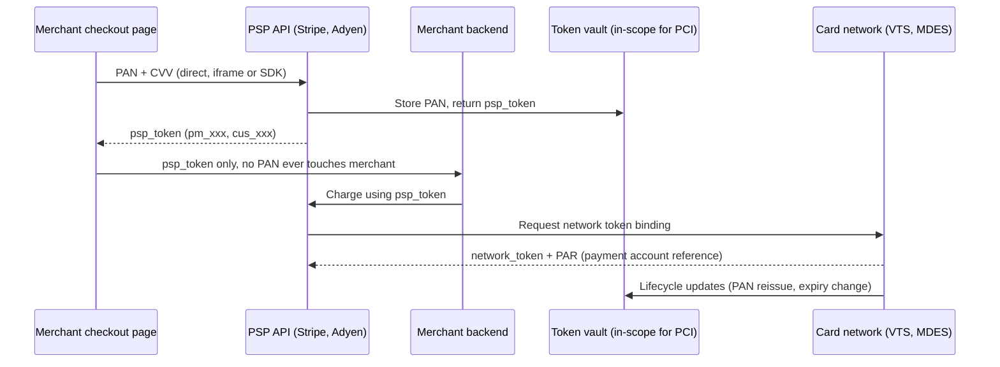

# Payment and PII Tokenization

> Tokenization swaps a sensitive value (PAN, SSN, bank account number) for a surrogate string that carries no exploitable information on its own, and stores the mapping inside a small vault that is the only system in the environment allowed to reverse the substitution. The design goal is not confidentiality per se (encryption already provides that) but scope reduction: shrink the population of systems that touch raw cardholder data down to the vault, so PCI DSS audit, key management, and blast radius all collapse to one place. Payment tokenization has three distinct flavors with very different security properties: PSP or merchant tokens (portable inside one PSP), network tokens issued by Visa VTS, Mastercard MDES, Amex, or Discover (portable across merchants, lifecycle-managed by the network), and device tokens on Apple Pay or Google Pay (bound to a secure element with a per-transaction cryptogram). Getting the flavor right matters more than any single vault control: a stolen PSP token is replayable within that PSP, a stolen device DPAN without the cryptogram is inert. The attacks that matter target the de-tokenization surface (oracle APIs, SSRF into the vault, per-caller scoping bugs), the tokenization moment itself (pre-tokenization logging of raw PAN), and the token generator (predictable format-preserving output under FF1 or FF3 attacks).

**Interview frequency:** Situational

## How it works

### Vault architecture

A tokenization vault has three logical surfaces: an ingress that accepts a raw sensitive value and returns a token, a de-tokenize surface that accepts a token and returns the original value under strict authorization, and a lookup surface that answers boolean or bucketed queries (does this token match a given last-four, is this token valid) without ever returning the raw value. The vault owns a mapping table (token to ciphertext of PAN, keyed with a KEK managed by an HSM or KMS) plus per-caller scoping metadata so that de-tokenization requests are checked against the caller identity that originally tokenized the value.



The critical property is that after the initial capture, the merchant backend, the merchant analytics warehouse, the customer-support tools, and the finance reporting pipeline all handle only tokens. PCI DSS scope in those systems drops to whatever residual metadata they hold (last four, BIN, cardholder name). The vault plus the capture path (iframe, SDK, terminal) remain fully in scope for PCI DSS 4.0.1<sup>[[1]](#ref1)</sup>.

### Three flavors of payment tokens

PSP or merchant tokens are opaque identifiers issued by the acquirer or PSP (Stripe's `pm_...` and `cus_...`, Adyen's recurring detail references). They live inside that PSP's vault. If leaked, they are replayable by anyone who can authenticate to that PSP as the merchant, but they carry no value outside that trust boundary. They do not survive a PSP migration: moving from Stripe to Adyen requires re-tokenizing or a network-level PAN transfer.

Network tokens are issued by Visa Token Service (VTS)<sup>[[2]](#ref2)</sup>, Mastercard MDES<sup>[[8]](#ref8)</sup>, Amex Token Service, or Discover DPAN. They are bound to a merchant plus PSP pair (or a domain, for e-commerce) and carry a Payment Account Reference (PAR) that lets multiple tokens for the same underlying PAN be correlated without ever exposing the PAN. The network manages the lifecycle: when the issuing bank re-issues a card (fraud, expiry, replacement), the network updates the token so card-on-file merchants continue to charge without a customer re-entry step. From a security standpoint this narrows the reversal surface (only the network can map token to PAN) and shortens the value window of a stolen token (network can revoke).

Device tokens on Apple Pay and Google Pay are issued by the network but provisioned into a device secure element (SE) or trusted execution environment (TEE). Each transaction uses a Device Primary Account Number (DPAN) plus a dynamic cryptogram derived from an SE-held key. A captured DPAN without a fresh cryptogram is inert, so intercepting the wire data in a card-present flow does not yield a replayable credential. This is why NFC contactless is materially safer than magnetic-stripe capture.

### PII tokenization

The same vault pattern extends to non-payment PII: social security numbers, driver license numbers, bank account and routing numbers, government IDs. There is no external network authority equivalent to VTS for these, so the organization operates its own vault with the same disciplines (per-caller scoping, audit, rate limits, HSM-backed KEK, format-preserving output where legacy systems require the shape of an SSN). PCI-style scope reduction is the analog for GLBA, HIPAA, and state privacy laws where the sensitive field defines audit scope.

### Format-preserving encryption

FPE (NIST SP 800-38G FF1 and FF3, with FF3 revised to FF3-1 after cryptanalysis<sup>[[7]](#ref7)</sup>) is a special case: an encryption scheme that outputs ciphertext of the same format and length as the plaintext, so legacy databases and pipelines that validate "16 digits, Luhn-valid" accept the ciphertext without schema change. FPE is not the same as tokenization: the mapping is deterministic under a key, so there is no lookup vault, and if the key leaks every historical value is recoverable. FF3 was shown vulnerable to message-recovery attacks under chosen-plaintext access in 2016<sup>[[3]](#ref3)</sup>, prompting the NIST revision to FF3-1<sup>[[7]](#ref7)</sup>, and a 2017 CRYPTO result broke FF3 outright over small domains<sup>[[4]](#ref4)</sup>. Modern practice: FPE only where format preservation is mandatory (mainframe fields) and only over domains large enough to avoid the small-domain attacks.

### Vault vs encryption vs hashing

Encryption and tokenization are not substitutes. Encryption is reversible with a key and shifts the audit boundary from data to key management; the ciphertext is still cardholder data under PCI DSS and does not de-scope downstream systems. Hashing is irreversible, cannot support charge reversal or customer support workflows, and under PCI DSS 4.0.1 Requirement 3.5.1 must be keyed (HMAC with a secret) to prevent brute-force recovery of PANs from a 16-digit search space<sup>[[1]](#ref1)</sup>. Tokenization is the only pattern that both allows reversal (for the vault) and de-scopes downstream systems (because they cannot reverse).

## Quick reference

```http
POST /v1/tokens HTTP/1.1
Host: vault.example.com
Authorization: Bearer <caller-scoped-token>
Idempotency-Key: 8f3e2c1a-...
Content-Type: application/json

{
  "value": "4111111111111111",
  "type": "pan",
  "caller_scope": "checkout-service-prod",
  "retention": "indefinite"
}

HTTP/1.1 201 Created
Content-Type: application/json

{
  "token": "tok_01H8Z7...QF2",
  "last_four": "1111",
  "bin": "411111",
  "created_at": "2026-08-01T12:00:00Z",
  "scope": "checkout-service-prod"
}
```

De-tokenization is the inverse call, authorized only for callers whose scope matches the token's `scope` field, rate-limited, and audit-logged with caller identity, request ID, and business justification.

| Invariant | Where enforced | How violated | Source |
|---|---|---|---|
| Only the vault stores the raw PAN | Vault ingress, network egress rules, DLP | Merchant backend logs raw PAN at capture time before the tokenization call | <sup>[[1]](#ref1)</sup> |
| De-tokenization is per-caller scoped | Vault authorization layer | Any authenticated app can de-tokenize any token in the vault | <sup>[[1]](#ref1)</sup> |
| Every de-tokenize call is audited | Vault audit log with tamper protection | De-tokenize succeeds without a log entry, or logs are writable by callers | <sup>[[1]](#ref1)</sup> |
| Stored PAN hashes are keyed (HMAC) | Vault storage layer | SHA-256(PAN) stored, brute-forceable over the 10^16 PAN space | <sup>[[1]](#ref1)</sup> |
| Network tokens carry PAR for correlation without PAN exposure | Card network token service | Merchant joins tokens across sessions by re-de-tokenizing PAN | <sup>[[2]](#ref2)</sup><sup>[[8]](#ref8)</sup> |
| Device token transactions require a fresh cryptogram | Secure element on device, network authorization | Merchant accepts a DPAN captured off the wire without validating cryptogram | <sup>[[2]](#ref2)</sup> |
| FPE not used for small domains without wide tweak | FPE library selection, threat model | FF3 or FF3-1 used over sub-million domains without domain expansion | <sup>[[3]](#ref3)</sup><sup>[[4]](#ref4)</sup><sup>[[7]](#ref7)</sup> |
| Vault access requires phishing-resistant MFA | Identity provider, vault admin surface | SMS OTP used for CDE admin login | <sup>[[1]](#ref1)</sup> |

## Attack techniques

### 1. Token vault compromise as single point of failure

The vault is the one place where every token can be reversed to PAN, so a compromise there yields the entire cardholder database in cleartext, encryption at rest notwithstanding, because the vault has to hold the KEK online to serve de-tokenization requests. The attack path is usually not "break the crypto" but "get code execution on the vault service" via a dependency vulnerability, an SSRF in a peripheral vault admin surface, or a supply-chain compromise in the vault vendor. Once inside, the attacker calls the internal de-tokenize endpoint in a loop, or dumps the mapping table and the online KEK from process memory.

Black-box confirmation is impossible from outside; blind detection depends on the vault's own audit stream showing an anomalous burst of de-tokenize calls or an out-of-hours read of the mapping table. Escalation is direct: raw PANs to sell, or to run card-not-present fraud against the specific issuers. The 2019 Capital One breach demonstrated the class (SSRF into the EC2 metadata service, then S3 access to encrypted card data, then keys from IAM)<sup>[[5]](#ref5)</sup>; the tokenization-vault-specific version would compress that path.

### 2. De-tokenization oracle exposure

More common than a vault compromise is a peripheral service that has legitimate de-tokenize permissions and exposes them to an attacker via injection, SSRF, or missing authorization. The customer-service dashboard, the fraud-review console, and the reporting pipeline all often hold vault credentials broad enough to reverse any token in the merchant's namespace. If the customer-support app has an IDOR that lets a support agent (or an attacker who breached one support account) pull a customer profile including "reveal full PAN," the vault will serve that request and log it, but the log is only useful post-facto.

Attackers confirm this class by looking for endpoints that emit anything derived from the raw PAN (masked-but-not-tokenized last-four in an error string, an "export to CSV" that quietly de-tokenizes, an internal admin route that returns full card details). Blind confirmation uses timing: a de-tokenize call typically shows a distinctive latency signature (network hop to vault plus HSM operation) that differs from a same-service memory lookup. Escalation is proportional to the oracle's scope: a support tool with organization-wide scope is a full-vault compromise.

### 3. Missing per-caller scoping

The vault correctly authenticates the caller but does not enforce that the caller can only de-tokenize tokens it originally created. A compromised checkout service that only ever tokenizes new cards has no legitimate need to de-tokenize any token, and no need to see tokens created by the recurring-billing service. When the scoping check is missing, an attacker who lands in the least-privileged service can pivot to the most sensitive data in the vault. This mistake is common because vault SDKs default to "authenticated caller can call any endpoint" and the per-token ACL requires deliberate schema and IAM policy design.

Confirmation from a test caller: tokenize a value as service A, then attempt to de-tokenize it as service B; a permissive vault returns the value, a correctly scoped vault returns 403. Blind confirmation when direct response inspection is suppressed uses side channels: time the de-tokenize call and compare to a known-scope call (the HSM round-trip is typically an order of magnitude slower than a bare 403), or induce a downstream side effect that only fires on successful de-tokenize (a subsequent charge attempt with the retrieved PAN triggers a network authorization webhook that the attacker observes OOB). Escalation: once a foothold in any tokenizing service exists, the attacker has the entire vault by proxy.

### 4. Predictable or format-preserving token generation

If the vault issues tokens by encrypting the PAN under a static key (FPE with FF1) rather than issuing a random surrogate mapped to the PAN in a lookup table, the security of every historical token reduces to the security of that key and the underlying cipher. A chosen-plaintext attack published in 2016 reduced FF3 security substantially below the claimed level for realistic domain sizes<sup>[[3]](#ref3)</sup>, and a 2017 CRYPTO paper broke FF3 outright over small domains<sup>[[4]](#ref4)</sup>. Both attacks require chosen-plaintext access, so a service that will "tokenize any PAN you send" and returns the token is the enabling surface.

Confirmation is analytical: identify the tokenization algorithm (documented, or leaked in an SDK), evaluate the domain size (16-digit PAN with fixed BIN is a small domain), estimate chosen-plaintext queries needed. Escalation is offline: once the key is recovered by cryptanalysis, all historical tokens become PANs, and no vault log entry is generated by the attacker's math.

### 5. Pre-tokenization capture leaks

The tokenization API is called correctly, but the raw PAN passes through logging, an APM tracer, a request-body dump on an error handler, or an audit tap upstream of the tokenization call. This is the most common real-world leak because it happens outside the vault's control surface: the vault sees a clean tokenize request and returns a clean token, but application logs, load balancer access logs, or WAF request captures contain the plaintext PAN.

Internal confirmation is a grep: search log stores for regex matches on 13-19 digit sequences that pass Luhn; any hit is a PCI DSS 3.4.x finding<sup>[[1]](#ref1)</sup>. Blind or OOB confirmation from an external attacker without log access uses the client-observable telemetry surface: intentionally malformed card entries that reliably trigger error-handler serialization, then look for the payload landing in a third-party APM whose DSN is client-visible (Sentry, Datadog RUM, LogRocket) via the same DSN the attacker can read. A crafted "unsupported card type" input that fires the error handler before the tokenization call is the canonical probe. Escalation depends on log retention and access control: a 90-day log store with 10 million requests holds a lot of PANs.

### 6. Network token replay without cryptogram check

A merchant that accepts network tokens must validate the accompanying transaction cryptogram before authorizing. A merchant integration that treats the network token as functionally equivalent to a PSP token (opaque identifier, no cryptogram check) has weakened the network-token security model to the level of a PSP token. If the DPAN leaks from any source (a compromised in-app SDK, an intercepted API response), the attacker can replay it against the same merchant.

Confirmation for a merchant integration: send a valid DPAN with an obviously wrong or missing cryptogram; if the merchant's authorization pipeline accepts the transaction and forwards to the network (which will decline, but the merchant should decline first), the integration is missing the check. Blind OOB confirmation without direct authorization-response access uses the downstream signal: the network-side decline arrives as a webhook or reconciliation entry that only fires when the merchant forwarded the bad cryptogram, so the presence of a decline entry (versus a synchronous merchant rejection) confirms the missing check. Escalation is proportional to the merchant's transaction limits and to whether 3-D Secure or step-up is bypassed by the token path: a stolen DPAN plus a missing-cryptogram integration is card-not-present fraud at the merchant's full per-transaction ceiling, replayable until the network revokes the token.

### 7. Device wallet SDK vulnerabilities

Apple Pay and Google Pay push the trust boundary into the secure element, but the SDK path between the merchant app and the SE is application code. Research into Apple Pay's Express Transit mode showed that a crafted VISA-mode signal from a Proxmark could authorize an unlocked transaction from a locked iPhone<sup>[[6]](#ref6)</sup>. Google Wallet has had similar SDK-level bugs. These do not compromise the DPAN itself but let an attacker authorize transactions on a target device.

Confirmation is hardware-in-the-loop; blind confirmation follows the relay-with-OOB-signaling model documented in the same research, where the attacker's card-side reader and terminal-side emulator communicate over an out-of-band channel so the actual victim device and terminal never observe each other directly. Escalation is per-device fraud within the transit or contactless limit, aggregated across as many victim devices as the attacker can reach in a crowd.

### 8. Vault SSRF and admin surface

Vaults expose more than the tokenize/de-tokenize API: health endpoints, admin dashboards for key rotation, metrics scrapers. An SSRF in a peripheral service that can reach the vault's admin surface without going through the front-door authentication (VPC-internal, "trusted network") is a full compromise. This is the Capital One pattern applied to a tokenization vault<sup>[[5]](#ref5)</sup>. Confirmation is the same as any SSRF: enumerate internal DNS names for the vault, probe the admin port. When the admin surface returns nothing directly (blind SSRF), the attacker confirms reachability with OOB DNS or HTTP callback exfiltration to an attacker-controlled domain, either by crafting a payload that induces the vault to fetch an attacker URL or by using an in-band error message that echoes internal hostnames. Escalation is total: the admin surface holds key-rotation and mapping-export functionality, either of which yields the full token-to-PAN mapping.

## Defense

### Real fix

1. Put the vault behind strict network segmentation and expose only the tokenize, de-tokenize, and lookup endpoints; block all other traffic to the vault CIDR, including admin surfaces, from anywhere outside a bastion network<sup>[[1]](#ref1)</sup>.
2. Enforce per-caller scoping on every de-tokenize call: the vault records the caller identity at tokenize time, and de-tokenize requires the same identity (or an explicitly delegated one). Vaults that do not support this natively (some legacy commercial products) get a scoping proxy in front.
3. Move card-on-file storage to network tokens where the PSP supports it<sup>[[2]](#ref2)</sup><sup>[[8]](#ref8)</sup>. Network tokens narrow the reversal surface to the card network, get lifecycle-updated for free when the underlying card is re-issued, and carry a PAR for cross-token correlation without PAN exposure.
4. For card-present flows, prefer device tokens (Apple Pay, Google Pay) over stored PAN or PSP tokens; the per-transaction cryptogram eliminates replay of a captured DPAN.
5. When hashing rather than tokenizing (comparison-only workflows, no reversal needed), use HMAC with a per-tenant key stored in the same HSM that protects the vault KEK, satisfying PCI DSS 4.0.1 Requirement 3.5.1<sup>[[1]](#ref1)</sup>.
6. Do not use FPE unless a legacy format constraint forces it. When forced, use FF1 with adequate domain size per NIST SP 800-38G<sup>[[7]](#ref7)</sup>, treat every FPE deployment as a candidate for the small-domain attacks<sup>[[3]](#ref3)</sup><sup>[[4]](#ref4)</sup>, and layer authorization checks so that "tokenize any PAN" is not a public oracle.

### Defense in depth

1. Rate-limit de-tokenize calls per caller, with alerting on any per-caller rate anomaly. Legitimate de-tokenization traffic follows business patterns (charge attempts, support lookups); a de-tokenize burst is either a batch job that should be pre-approved or an attack.
2. Log every de-tokenize call with caller identity, business justification (a ticket ID for support use, a transaction ID for charge use), token ID, and result, into a tamper-evident store that the callers cannot write to.
3. Require phishing-resistant MFA (WebAuthn, FIDO2 security keys) for any human access to the vault admin surface and for CDE access generally, per PCI DSS 4.0.1 Requirement 8.4/8.5<sup>[[1]](#ref1)</sup>.
4. Pre-tokenize at the earliest possible boundary: use the PSP's hosted-fields or iframe (Stripe Elements, Adyen Drop-in) so the PAN never touches your servers. This eliminates most of the pre-tokenization leak surface at the price of losing some UX control.
5. DLP scanning on log stores, error trackers, and analytics pipelines for PAN-shaped strings (Luhn-valid 13-19 digit sequences). Any hit is an incident.
6. Rotate token vault KEKs on a scheduled cadence and after any suspected compromise; the vault re-wraps mappings without re-issuing tokens. Callers see no change; the blast radius of an old KEK compromise is bounded.
7. For PII tokenization, apply the same discipline: per-caller scoping, audit, rate limit. Do not colocate PII and PAN in the same vault unless the operational model justifies it, because a compromise then straddles two regulatory regimes (PCI DSS and GLBA or HIPAA).

## Detection and telemetry

Vault-side log fields that must be captured: `caller_id`, `caller_service`, `request_id`, `token_id`, `operation` (tokenize / de-tokenize / lookup), `business_context` (ticket or txn ID), `result`, `latency_ms`, `source_ip`, `mfa_method` (for human access), `key_id` (which KEK version served the request). Vault-side alerts: any single caller exceeding baseline de-tokenize rate by more than a configured factor; any de-tokenize call whose `caller_id` does not match the `scope` of the token; any success on the admin surface from an IP outside the bastion CIDR; any KEK access outside a scheduled rotation.

Application-side detection: log-store DLP for Luhn-valid digit runs, with alert-on-first-hit routing to the incident channel. Canary values: seed synthetic PANs into the tokenization flow and alert on any appearance outside the vault. Network-side detection: egress rules that drop 16-digit numeric payloads to non-vault, non-PSP destinations; a burst of blocked packets is either a bug or an exfiltration attempt.

Business-metric detection: sudden drop in the ratio of tokenize calls to de-tokenize calls (attackers de-tokenize but do not tokenize), sudden spike in de-tokenize by a service that historically only tokenizes, cross-service de-tokenize where the caller scope and token scope disagree (should be zero in a correctly scoped vault).

## Interviewer probes

Q1. Why is tokenization not the same as encryption from a PCI DSS scope perspective?

Mid: encryption keeps the data reversible, tokenization uses a surrogate; downstream systems with tokens are out of scope, downstream systems with ciphertext are still in scope because ciphertext of PAN is still cardholder data.

Principal: PCI DSS scope is defined by "stores, processes, or transmits cardholder data" and encrypted PAN still meets that bar, so encryption at rest does not by itself de-scope a system. Tokenization de-scopes only if the token cannot be reversed to PAN in the downstream system, which is why per-caller scoping matters: a system that holds tokens but has vault credentials to de-tokenize them is still in scope. The design goal is not to reduce cryptographic risk but to reduce the audit and control footprint from thousands of systems to one vault.

Q2. When would you choose network tokens over PSP tokens?

Mid: for card-on-file scenarios where the customer might switch cards over time or you might switch PSPs.

Principal: three drivers. First, network tokens are lifecycle-managed by the network so card re-issuance updates the token automatically, which reduces involuntary churn on subscription businesses by measurable percentages<sup>[[2]](#ref2)</sup>. Second, the reversal surface is the card network rather than the PSP, so a PSP breach of the token vault does not yield PANs. Third, PAR (Payment Account Reference) lets you correlate multiple tokens for the same underlying PAN across contexts without ever storing PAN. The tradeoff is integration complexity and the fact that network token support is per-PSP and per-region.

Q3. What is the FF3 attack and when does it matter?

Mid: FF3 is a format-preserving encryption scheme that had a cryptanalytic attack published; it is weaker than expected for small domains.

Principal: a 2016 CCS paper published a chosen-plaintext attack that reduced FF3 security substantially below the claimed level<sup>[[3]](#ref3)</sup>, prompting NIST to revise the standard to FF3-1<sup>[[7]](#ref7)</sup>. A 2017 CRYPTO paper then broke FF3 outright over small domains<sup>[[4]](#ref4)</sup>. It matters when the domain is small (BIN-constrained PANs are effectively a 10^10 domain) and when the tokenization service accepts chosen input, which is the normal operating mode. Prefer random-surrogate tokenization over FPE; if legacy schema pressure forces FPE, use FF1 with adequate domain size and gate the tokenize endpoint heavily so it is not a public chosen-plaintext oracle.

Q4. Walk through the design of per-caller scoping on de-tokenization.

Mid: the vault records who tokenized a value, and only that caller can de-tokenize; other callers get 403.

Principal: identity is the caller service's IAM principal (workload identity, not a long-lived credential). At tokenize time the vault stores `owner_scope` on the token row. De-tokenize checks that the requesting principal's scope matches, or is an explicit delegation. Delegations are auditable and time-bound. For workflows where multiple services legitimately need the same token (checkout tokenizes, billing charges), scopes are group-based rather than service-based, and the group is the smallest set that shares business justification. Break-glass is a separate flow with human approval and short-lived elevated tokens, audited to a separate stream.

Q5. Where does tokenization break down for compliance de-scoping?

Mid: if the downstream system can call the vault to de-tokenize, it is still in scope.

Principal: PCI DSS 4.0.1 explicitly notes that systems with the ability to reverse tokenization are in scope<sup>[[1]](#ref1)</sup>. So the de-scoping test is not "does this system hold tokens" but "can this system, or an attacker who compromises this system, reverse tokens to PAN." That includes systems with vault API credentials, systems with vault-reachable network paths that could be exploited by SSRF, and systems that share a trust boundary with a system that can de-tokenize. The correct answer for most enterprises is "de-scoping applies to the analytics warehouse, the fraud rules engine that only sees BIN and last-four, and the customer support view that shows masked data with an explicit reveal-flow behind MFA; it does not apply to the ops jumphost with vault credentials or the reporting pipeline that pulls full details for reconciliation."

Q6. What is the correct hashing approach for PAN comparison?

Mid: HMAC-SHA256 with a secret key, not plain SHA-256.

Principal: PCI DSS 4.0.1 Requirement 3.5.1 requires keyed cryptographic hashing<sup>[[1]](#ref1)</sup>. The reason is that plain SHA-256 of a PAN is trivially brute-forceable: the PAN space is 10^13 to 10^16 depending on BIN constraints and Luhn, and modern hardware runs SHA-256 at hundreds of billions per second. HMAC with a secret key (stored in the HSM) turns the brute force into a keyed problem where the attacker needs the key first. Per-tenant keys prevent cross-tenant correlation attacks. Do not use PBKDF2 or Argon2 for this because the comparison workflow needs to be fast and deterministic; the security comes from the key, not from work factor.

Q7. How do device tokens (Apple Pay, Google Pay) differ from network tokens in threat model?

Mid: device tokens live on the phone and use a cryptogram per transaction; network tokens are stored server-side.

Principal: both are network-issued (a Google Pay DPAN is a network token in the VTS or MDES sense), but device tokens add a per-transaction dynamic cryptogram derived from a key held in the phone's secure element or TEE. A captured DPAN off the wire is inert without a fresh cryptogram, which is why NFC contactless captured with a Proxmark cannot be replayed at the same terminal ten minutes later. The attacks that matter shift to the SDK layer (the Apple Pay Express Transit VISA-mode bug<sup>[[6]](#ref6)</sup>) and to device-loss scenarios where the device is present and unlocked. Server-side network tokens do not have the cryptogram property, so a stolen network token is replayable within its merchant plus PSP binding, which is why they still need vault-grade protection at the PSP level.

Q8. If you had one budget item for a company that has just moved to tokenization, where would you spend it?

Mid: audit logging on de-tokenization.

Principal: pre-tokenization data leak controls. In every real incident review I have seen, the vault was fine and the attacker never touched it; the raw PAN leaked from an APM tracer, a request-body log, or an error handler that dumped the payload. The tokenization architecture is only as strong as the point at which PAN enters the environment. Spend on hosted-fields adoption (Stripe Elements, Adyen Drop-in) so the PAN never hits your servers in the first place, plus DLP on log stores and error trackers, plus a canary-value seed program to alert on any leak of test PANs. Vault-side controls are important but they are the second-order problem.

## War story

A mid-market SaaS platform migrated to tokenization in 2022 with the goal of PCI SAQ A-EP scope reduction. They put a commercial vault in place, moved all card storage into it, and passed the QSA audit. Six months later a routine log review flagged Luhn-valid strings in the Datadog error-tracker payloads. Root cause: the payment form's client-side validation threw an exception on certain card types, and the exception handler serialized the entire form state, including the raw PAN, into Sentry. The vault had never seen these cards because the exception fired before the tokenization call. The remediation was to move to Stripe Elements (PAN never leaves the iframe boundary) and to add a DLP rule on Sentry payloads that quarantined any Luhn-valid 13-19 digit string. The audit implication was more painful than the technical fix: the QSA required a scope re-assessment of the error tracker, the alerting pipeline that read from it, and the on-call rotation whose members could see error payloads. A tokenization vault does nothing for you if raw PAN enters through a side door.

## Sources

<a id="ref1"></a>[1] PCI Security Standards Council. PCI DSS v4.0.1. June 2024. https://www.pcisecuritystandards.org/document_library/

<a id="ref2"></a>[2] Visa. Visa Token Service (VTS) technical overview and network token program documentation. https://developer.visa.com/capabilities/vts

<a id="ref3"></a>[3] Message-recovery attacks on Feistel-based Format Preserving Encryption. ACM CCS 2016. https://eprint.iacr.org/2016/794

<a id="ref4"></a>[4] Breaking the FF3 Format-Preserving Encryption Standard over Small Domains. CRYPTO 2017. https://eprint.iacr.org/2017/521

<a id="ref5"></a>[5] Seattle tech worker arrested for data theft involving large financial services company (Capital One breach). US Department of Justice press release. 2019. https://www.justice.gov/usao-wdwa/pr/seattle-tech-worker-arrested-data-theft-involving-large-financial-services-company

<a id="ref6"></a>[6] Practical EMV Relay Protection: Apple Pay with VISA. Radboud University and University of Birmingham. 2021. https://practical-emv.github.io/

<a id="ref7"></a>[7] NIST SP 800-38G. Recommendation for Block Cipher Modes of Operation: Methods for Format-Preserving Encryption. https://csrc.nist.gov/publications/detail/sp/800-38g/final

<a id="ref8"></a>[8] Mastercard. Mastercard Digital Enablement Service (MDES) technical documentation. https://developer.mastercard.com/product/mdes-token-connect
