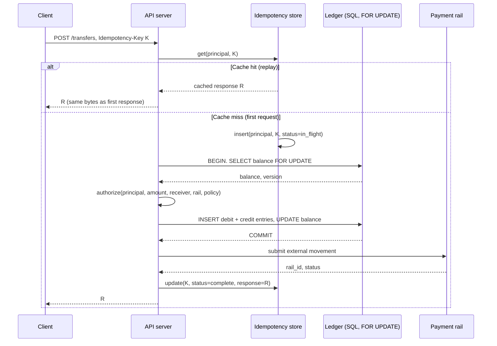
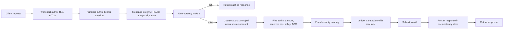

# Money-Movement Authorization and Idempotency

> A money-movement endpoint must enforce two invariants at once: the caller is authorized to move this specific money to this specific receiver for this specific amount, and the same logical request produces exactly one movement even under retry, concurrency, or partial failure. Authorization that only checks principal-owns-account leaks funds through amount tampering, receiver substitution, and currency confusion. Idempotency that only lives in the client leaks funds through double-charges when the network drops the response. Both invariants live server-side, both bind to the request semantics, and both must hold under adversarial retry patterns. The rest of the surface is defense in depth around these two facts.

**Interview frequency:** Situational

## How it works

A payment or transfer API sits on top of a ledger. The ledger has accounts with balances, and every movement is a pair of entries (debit source, credit destination) that must commit atomically. The API layer accepts a request, decides whether to allow it, and translates it into a ledger transaction. Between "accepts" and "commits" sit the two attack surfaces this doc covers.

### The two invariants

Authorization must bind to the full request semantics. A check that only asks "does principal P own account A?" is insufficient. The check must be "is principal P allowed to move `amount` in `currency` from account A to receiver R via rail X right now, given policy state S?" Every parameter that affects money flow is part of the authorization decision. Omitting `amount` turns an attacker authorized to move $1 into one authorized to move $1,000,000; omitting `receiver` lets a marketplace attacker redirect a legitimate payout (omitting `currency` produces the same class of failure, where `500 JPY` becomes `500 USD` on a locale mixup).

Idempotency must bind to the request such that a replay produces the cached response, not a new movement. The industry-standard mechanism is a client-generated key sent as `Idempotency-Key: <key>` (Stripe, Adyen, Square)<sup>[[1]](#ref1)</sup>. The server persists the tuple `(principal, key) -> response` in a durable store with a TTL (Stripe holds keys 24 hours; longer for high-value flows). On any replay with the same key, the server returns the stored response byte-for-byte and does not re-enter the ledger transaction. The key is scoped to principal so that one tenant cannot poison another tenant's key space.

### Anatomy of a well-formed money-movement request

```
POST /v1/transfers HTTP/1.1
Host: api.example.com
Authorization: Bearer <token>
Idempotency-Key: 01HK3Q7X8P9M2N4R5T6V7W8Y9Z
Content-Type: application/json
X-Signature: v1=<hmac-sha256(secret, timestamp.body)>
X-Timestamp: 1739558400

{
  "source_account_id": "acct_2N4R5T",
  "receiver": {
    "type": "external_bank",
    "routing": "021000021",
    "account_last4": "1234",
    "receiver_id": "rcv_9Z8Y7W"
  },
  "amount": {
    "value": 12500,
    "currency": "USD"
  },
  "rail": "ACH_SAME_DAY",
  "purpose": "invoice_2026_0142"
}
```

Every element carries load. The bearer token identifies the principal. The idempotency key is a ULID (time-ordered, high-entropy) so weak clients cannot collide by picking the same short string. The signature covers timestamp plus body so an intermediary that captures the request cannot replay it with mutated amount or receiver. The amount is a minor-unit integer (12500 cents) with an explicit currency; there is no ambiguity between `125.00 USD` and `125.00 JPY`. The receiver is a stable identifier from a prior allowlisting step, not a free-form routing/account pair supplied per-request.

### Idempotency store and ledger interaction



Two properties are load-bearing here. The idempotency insert happens before the ledger transaction, so a second request racing with the first sees `status=in_flight` and waits or errors deterministically rather than entering a parallel debit. The balance read uses `SELECT ... FOR UPDATE` in the same transaction as the debit, so two concurrent debits serialize on the row lock rather than both reading the same starting balance and both deducting. Optimistic concurrency (a `version` column with a conditional update) is equivalent in outcome; the anti-pattern is TOCTOU where the balance check happens in one transaction and the debit in another.

### Step-up authorization and dynamic linking

For high-value or unusual transactions the base authentication (a bearer token minted at login) is insufficient. Step-up auth requires a fresh authenticator interaction: SMS OTP, TOTP, WebAuthn touch, or a push challenge. In OIDC (see 77) this is expressed in the `acr` (authentication context class reference) and `amr` (authentication methods references) claims. A token minted from password alone might carry `acr=urn:mace:incommon:iap:silver`; a token minted after WebAuthn carries `acr=urn:mace:incommon:iap:gold` or a vendor-specific string. The money-movement endpoint policy is "require `acr` in {gold} for amounts above X or receivers not on the allowlist."

Under PSD2 SCA in the EEA the requirement is sharper<sup>[[2]](#ref2)</sup>. Strong customer authentication requires two of three factors (knowledge, possession, inherence). Dynamic linking requires the challenge shown to the user to include the amount and payee so a phished user cannot approve an attacker's payment. If the app shows "confirm payment of EUR 50 to alice@example.com" but the actual API request executes "EUR 5000 to bob@example.com," the challenge is not dynamically linked and the transaction is not compliant. Exemptions (low-value under EUR 30, TRA based on the firm's fraud rate, trusted-beneficiary allowlist) narrow this obligation but do not eliminate it.

### Where money-movement authz sits in the request lifecycle



## Quick reference

```
POST /v1/transfers HTTP/1.1
Idempotency-Key: 01HK3Q7X8P9M2N4R5T6V7W8Y9Z
X-Signature: v1=<hmac_sha256(secret, ts + "." + body)>
X-Timestamp: 1739558400

{
  "source_account_id": "acct_2N4R5T",
  "receiver_id": "rcv_9Z8Y7W",
  "amount": {"value": 12500, "currency": "USD"},
  "rail": "ACH_SAME_DAY"
}
```

| Invariant | Where enforced | How violated | Source |
| --- | --- | --- | --- |
| Same idempotency key returns identical response, no new movement | Server-side idempotency store keyed by (principal, key) with durable TTL | Client-only idempotency, no store persistence, per-request execution regardless of key | Stripe idempotency-keys<sup>[[1]](#ref1)</sup> |
| Authorization binds to (principal, source, amount, currency, receiver, rail) | Fine-grained policy check after coarse ownership check | Authz checks only "principal owns account," omits amount or receiver | OWASP API Security Top 10 2023 API3, API5<sup>[[3]](#ref3)</sup> |
| Balance check and balance debit are atomic under concurrency | `SELECT ... FOR UPDATE` or optimistic version in one transaction | Read balance in tx A, decide, debit in tx B: TOCTOU race | Postgres row-level locking docs<sup>[[4]](#ref4)</sup> |
| Dynamic linking: user challenge includes amount and payee | SCA flow presents amount + payee in the authenticator prompt | Challenge shows "approve login" or omits amount, allowing phishing pivot | PSD2 RTS Article 5<sup>[[2]](#ref2)</sup> |
| Request cannot be replayed with mutated parameters | Signature covers timestamp plus full body; server rejects stale timestamps and mismatched signatures | Bearer token alone, no per-message signing, replay window unbounded | Stripe webhook signing spec<sup>[[5]](#ref5)</sup> |
| Refund destination equals original payment source | Refund handler pins destination to the ledger entry it reverses | Refund endpoint accepts arbitrary destination instrument | PCI DSS 4.0.1 Req 3, 8<sup>[[6]](#ref6)</sup> |
| Currency is explicit and validated against the account's currency | Request schema requires ISO 4217 code; ledger rejects mismatched currency | Default currency assumed from locale or account, unchecked | ISO 4217<sup>[[7]](#ref7)</sup> |

## Attack techniques

### 1. Balance-debit race condition

The pattern is a two-transaction split. Transaction A reads the balance (`SELECT balance FROM accounts WHERE id = ?`), the application evaluates `balance >= amount`, and transaction B performs the debit (`UPDATE accounts SET balance = balance - ? WHERE id = ?`). Two concurrent requests both read `balance = 100`, both decide `100 >= 60`, and both debit 60, leaving the account at -20. Robinhood's March 2020 "infinite money" glitch was a variant where margin borrow and covered-call selling interacted such that the same collateral was counted twice; the underlying failure mode is the same: two policy decisions made on overlapping state.

Confirming this black-box is a race harness. Send N concurrent identical requests (different idempotency keys so idempotency does not save you) to the transfer endpoint from an account with just enough balance for one. If more than one succeeds, or if the account ends up negative, the race is real. Blind confirmation works by watching the ledger for negative balances or for two ledger entries whose combined debit exceeds the pre-request balance. Escalation is direct financial impact: attacker drains attacker's own account for more than it contained, or in a shared-balance scenario (marketplace escrow, family accounts) drains someone else's funds.

The fix is atomicity, not retry limits. Retry limits reduce the attack window but do not close the race; a determined attacker with a fast enough client will still slip two requests through. `SELECT ... FOR UPDATE` acquires a row-level lock that serializes concurrent readers<sup>[[4]](#ref4)</sup>; optimistic concurrency with a `version` column achieves the same outcome by having the second `UPDATE ... WHERE version = ?` fail and retry.

### 2. Idempotency-key replay and collision

Two failure modes here. First, missing server-side idempotency: the client's `Idempotency-Key` header is accepted but not persisted, so a network-triggered client retry (the response never arrived, client retries) creates a second movement. Stripe's engineering blog and Shopify's postmortems both document real duplicate-charge incidents traced to this pattern<sup>[[1]](#ref1)</sup>. Second, weak client keys: if the client uses a short random string or a monotonic integer, two independent clients (or one client after a restart) can collide, and a request from principal B replays as the cached response of principal A. Scoping the idempotency store by `(principal, key)` prevents the cross-tenant case; requiring UUIDv7/ULID prevents the intra-tenant case.

Confirmation is straightforward. Send request with idempotency key K, then send a different request (different amount, different receiver) with the same key K. If the server executes the second request as a new movement, idempotency is not enforced. If the server returns the cached response of the first but the ledger shows both, the store and the ledger have drifted. Blind confirmation surfaces in daily reconciliation as ledger entries with no matching acquirer entry (or vice versa) and as customer support tickets clustered around duplicate-charge complaints. Escalation depends on the direction: an attacker who can force a duplicate refund pockets the duplicate; an attacker who can steal a victim's idempotency response reads sensitive payload data.

### 3. Amount and currency tampering

Authorization that binds only to `(principal, action, resource)` and not to `(amount, currency, receiver)` is vulnerable to parameter mutation. The classic form is IDOR-adjacent (see 15): the app checks "principal owns `source_account_id`" in middleware and hands off to the handler, which trusts the request body. An attacker changes `amount` from 100 to 100000 or changes `currency` from JPY to USD. The dangerous direction is a request meant as 500 JPY (~$3.33) executing as 500 USD, a ~150x overpayment when the currency field is dropped and the ledger defaults to the account's primary currency; the symmetric direction (USD misinterpreted as JPY) hurts the receiver rather than the firm and is caught faster by the customer.

Black-box confirmation is a Burp intercept where the amount or currency in the request body is mutated while other parameters (session, idempotency key generated after mutation, receiver) are held. If the mutated request executes and the movement matches the mutated value, the authorization check does not bind amount. Blind confirmation works via a small canary: submit a $1 request, mutate to $2, observe reconciliation. Escalation is direct: the attack scales linearly with how much the attacker can push through fraud/velocity limits.

### 4. Receiver substitution in marketplace or split-payment flows

A marketplace routes a customer payment to a merchant's payout account. The API takes `merchant_id` or `payout_account_id` from the request. If the handler validates that the merchant exists but does not validate that the payment being credited is one this merchant should receive, an attacker who is a merchant can redirect other merchants' payouts by manipulating the reference<sup>[[3]](#ref3)</sup>. Split-payment (Stripe Connect, Adyen MarketPay) exacerbates this because a single customer charge splits across multiple destinations; if any destination is attacker-controlled, the split value flows to the attacker.

Confirmation is API3-style broken object-level authorization: enumerate `payout_account_id` values you do not own and see whether the endpoint accepts them as destinations for movements you initiate. Blind confirmation shows up as dispute-rate spikes from legitimate merchants whose payouts vanished and as out-of-band complaints on the merchant support channel. Escalation runs through the receiver allowlist: if there is no allowlist and no notify-and-delay on first-time receivers, the attacker pockets the substituted amount. Add a receiver-account allowlist per principal with a cool-down window and out-of-band notification for new receivers.

### 5. Refund-to-different-instrument abuse

Original payment was on card ending 4242. Refund is issued to card ending 9999 under attacker control. This works when the refund handler accepts a destination in the request rather than pinning it to the ledger entry it reverses. Card networks generally enforce refund-to-original-instrument for card refunds, but the enforcement is at the network side; a merchant who processes the refund as a fresh credit (a "push to card" flow via Visa Direct or Mastercard Send) can circumvent this if the merchant's own controls do not pin the destination.

The active confirmation is a support-flow attack: the attacker calls or messages support, requests a refund, and provides a different instrument. If the merchant support tool accepts an arbitrary destination without cross-checking the original charge, the abuse succeeds. Blind confirmation is daily reconciliation drift, where refund ledger entries systematically point to instruments distinct from the original charge, and increased chargebacks on the "original" instrument when the real cardholder disputes the unrefunded charge weeks later. Coinbase's February 2023 SMS-phishing incident against employees<sup>[[8]](#ref8)</sup> is not a refund case but is the same class: privileged support tools that can move money on behalf of users, targeted by social engineering. Defense is code enforcement: the refund handler pulls destination from the ledger entry, not from the request. Support tools that must override this need dual-control approval.

### 6. Authorization-hold-then-capture split abuse

Card auth creates a hold ("authorization") that reserves funds; capture converts the hold into an actual charge. Networks and issuers vary in how strictly they enforce that the capture amount matches the auth amount. Historically some issuers or merchant integrations allowed captures well above the original auth in misconfigurations; scheme rules today generally cap capture at auth plus a documented scheme- and MCC-specific margin (restaurants and hospitality MCCs carry higher allowances for tip adjustment, other MCCs are tighter), and networks decline captures outside those bounds. An attacker who obtains a small auth on a compromised card and finds a merchant that does not enforce the cap can capture a much larger amount.

Confirmation is a merchant-side test: create a $1 auth, attempt a $100 capture, observe whether the acquirer accepts. Blind confirmation shows up in merchant-refund-audit triggers and reconciliation reports where captured amounts systematically exceed authorizations, and in acquirer risk-review flags when the capture-to-auth ratio drifts. Defense is server-side enforcement of "capture amount <= auth amount plus documented margin" independent of network behavior, plus alerting on any capture that exceeds the auth by more than the margin.

### 7. 3DS challenge fallback and step-up bypass

3D Secure (3DS2) is the card-network challenge for card-not-present transactions. When the issuer requires a challenge, the customer authenticates via the issuer's flow (typically an app push or SMS OTP). The merchant liability shifts to the issuer on 3DS-authenticated transactions. Attackers push the flow to a lower assurance state: request "frictionless" (no challenge) when possible, force fallback to non-3DS if the issuer opts out, or exploit merchant configurations that treat "3DS attempted but not completed" as equivalent to "3DS succeeded."

Black-box the merchant's 3DS logic by initiating transactions from a card BIN known to enforce 3DS and observing whether the merchant proceeds when the challenge is not completed. Blind confirmation is a chargeback-rate spike on transactions marked "3DS attempted" but not "3DS authenticated," because liability sits with the merchant, and acquirer risk-review flags on the merchant's authenticated-vs-attempted ratio. Escalation depends on whether the merchant absorbs chargebacks (no 3DS means merchant liability). The defense is a policy that pins high-value or high-risk transactions to require 3DS success, not attempt, and denies the transaction if the issuer opt-out is used.

### 8. Nacha ACH web-debit account validation bypass

Nacha rules (2021, enforced) require account validation for web debits<sup>[[9]](#ref9)</sup>. Merchants must verify that the account being debited is valid and, in practice, that the account holder authorized the debit. Merchants who implement this as a check on the routing number alone (which is a public bank-lookup) pass the letter of the rule but not the spirit; attackers who obtain a valid routing/account pair from a data leak can initiate debits against accounts they do not own until the account holder disputes.

Confirmation is fraud-team pattern-detection: dispute-rate spikes on web-debit-originated ACH, or a mismatch between the customer's stated identity and the ACH account's holder name once the merchant enrolls name/account verification. The attacker holds debited funds through the dispute window (60 days under Regulation E for consumer accounts), and merchants exceeding Nacha return-rate thresholds face ODFI-level enforcement including forced remediation or termination of the ACH origination relationship. Defense is a real validation service (Plaid, Finicity, Nacha's account-validation service, or the direct network name/account match) tied to the identity of the customer initiating the debit.

### 9. Signed-request replay under bearer-token transport auth

Transport auth is a bearer token; there is no per-message signature. An attacker who obtains a request (via a compromised proxy, an SSRF that exfiltrates one Authorization header, a browser-cached request in a shared machine) can replay it verbatim. Idempotency does not save you here because the attacker can generate a new idempotency key and the bearer token still authenticates. The fix is per-message signing (HMAC-SHA256 over timestamp plus body, verified server-side against a stored secret) and a short timestamp window that rejects stale replays.

Confirmation is a passive capture-and-replay in a test environment: capture a request, wait, replay with a new idempotency key, observe whether it executes. Blind confirmation shows up as T+24h settlement-status mismatches between the ledger and the rail, and as identical-body transactions from geographically distant IPs on the same principal within seconds. Escalation is any number of successful replays. Stripe's webhook signing spec<sup>[[5]](#ref5)</sup> illustrates the pattern for the reverse direction; the same design applies to inbound money-movement APIs where the client is another server.

## Defense

### Real fix

1. **Bind authorization to the full request semantics.** The authz check must include `(principal, source_account_id, amount, currency, receiver_id, rail)`. Coarse ownership is the entry gate; the fine-grained policy runs after and considers every parameter that affects money flow<sup>[[3]](#ref3)</sup>. Encode this in code as a single `authorize_transfer(ctx, req) -> Decision` function that takes the full request, so a future developer cannot forget one parameter by adding it to the request schema and not to the check.

2. **Server-side idempotency with a durable store.** Persist `(principal, idempotency_key) -> {status, response, created_at}` in a database (Postgres, DynamoDB) with a TTL of at least 24 hours. On any request with an idempotency key, look up the tuple. Cache hit returns the stored response byte-for-byte and does not enter the ledger transaction. Cache miss inserts `status=in_flight` before starting the ledger transaction so a concurrent duplicate request sees the in-flight marker. On ledger commit, update the tuple to `status=complete` with the full response. Stripe's implementation<sup>[[1]](#ref1)</sup> is the reference design.

3. Balance check and debit must be atomic. In SQL, `SELECT balance FROM accounts WHERE id = ? FOR UPDATE` acquires a row-level lock, and the subsequent `UPDATE accounts SET balance = balance - ? WHERE id = ?` runs in the same transaction<sup>[[4]](#ref4)</sup>. Two concurrent transfers serialize on the lock. Alternative: optimistic concurrency with `UPDATE accounts SET balance = balance - ?, version = version + 1 WHERE id = ? AND version = ? AND balance >= ?`; if `rows_affected != 1`, retry with fresh read. Prefer `SELECT ... FOR UPDATE` when the same account sees frequent concurrent writers (the row lock serializes them cleanly) and prefer optimistic concurrency when writers are typically uncontended and the retry cost is bounded, because row locks add latency and hold-time risk under contention. Do not read balance in one transaction and debit in another.

4. Step-up authentication with ACR/AMR pinning. Policy: transactions above threshold X or to receivers not on the allowlist require an OIDC ID token with `acr` in the set of gold-tier ACRs and `amr` including a possession or inherence factor<sup>[[6]](#ref6)</sup>. This binds high-value flows to a fresh authenticator interaction rather than a long-lived session token. Cross-link 73 for the MFA/step-up machinery.

5. Dynamic linking for SCA where in scope. For EEA-scope transactions the authenticator challenge must display amount and payee so the user sees what they approve<sup>[[2]](#ref2)</sup>. This is a UX plus protocol requirement: the app-side authenticator (bank push, hardware token screen, WebAuthn extension) receives the amount and payee from the server as part of the challenge, and the server verifies the response includes a proof over those specific values.

6. Refund destination is pinned to the original ledger entry. The refund endpoint accepts a reference to the payment being refunded and derives the destination from the stored ledger entry, not from the request<sup>[[6]](#ref6)</sup>. Overrides for legitimate cases (customer closed the original card, chargeback resolution) require dual-control approval and are logged separately.

### Defense in depth

1. **Per-message signing.** In addition to transport auth, sign each request body with an HMAC-SHA256 over timestamp plus body, using a shared secret rotated on schedule<sup>[[5]](#ref5)</sup>. The server rejects requests where the timestamp is more than 5 minutes stale and where the signature does not verify. This closes the replay-with-mutated-parameters gap even if a bearer token leaks.

2. First-time receivers enter an allowlist with cool-down and notification. For any principal a first-time receiver triggers a 24-hour cool-down during which large-value movements are held. The principal is notified out-of-band (email plus SMS or app push) when a new receiver is added. This turns the receiver-substitution attack into a race the defender wins as long as one out-of-band channel is trustworthy.

3. Velocity limits per principal. Count and amount caps per hour, per day, per month. These do not stop a single high-value theft but they cap the blast radius when a session or token is compromised. Tune limits to the principal's history plus a segment average, not a global constant.

4. Explicit currency, no defaults. Every request specifies the ISO 4217 currency code<sup>[[7]](#ref7)</sup>, and the ledger rejects any request where the currency does not match the source account's declared currency (or the ledger performs an explicit FX conversion with a booked rate). Defaulting currency from locale or from the account's primary currency is the root of currency-confusion attacks.

5. Fraud scoring is a downstream signal. Sift, Kount, network risk scores, and internal models score each transaction. High scores route to manual review or step-up rather than auto-deny; auto-deny at the fraud-model layer creates support pain and adversarial pressure to learn the model. Fraud scoring supplements authz, does not replace it.

6. **Daily reconciliation with the rail.** Compare the ledger against the acquirer/PSP report daily. Mismatches (a ledger entry with no rail entry, or vice versa) are surfaced as alerts within 24 hours. This catches classes of drift that idempotency alone does not, including retries that failed on the rail but succeeded in the ledger.

7. Structured audit log for every movement. Every ledger transaction writes an audit entry with `(principal, source, receiver, amount, currency, rail, idempotency_key, request_id, decision_reason, acr, amr, client_ip, user_agent, fraud_score)`. Retention aligned to PCI DSS 4.0.1 Requirement 10 (minimum 1 year, 3 months immediately available)<sup>[[6]](#ref6)</sup>.

## Detection and telemetry

Log fields that carry investigative weight: `idempotency_key_hit` (cache hit vs miss), `authz_decision_reason` (short enum: `ok`, `insufficient_funds`, `receiver_not_allowlisted`, `amount_over_step_up_threshold`, `currency_mismatch`), `acr_at_auth_time` and `amr_at_auth_time`, `signature_verified` (yes/no), `ledger_lock_wait_ms`, `fraud_score`, `rail_response_code`, and `settlement_status_at_T+24h`.

Alerts that catch the classes above: two ledger entries against the same `source_account_id` within 500ms with combined debit exceeding the pre-transaction balance (race condition indicator); idempotency-key inserts where the key does not match a UUIDv7/ULID pattern (weak-key indicator); refund transactions where the destination instrument differs from the original charge's source instrument (refund-abuse indicator); captures where amount exceeds auth by more than the documented margin; and 3DS-attempted-but-not-succeeded transactions above threshold.

Canary shapes: a scripted test tenant runs a low-value transfer every 15 minutes and asserts idempotency (retries with the same key produce identical response), asserts race-safety (five concurrent requests with different keys but insufficient balance yield exactly one success), and asserts amount-binding (a request with a mutated amount fails signature verification). Canaries page on regression rather than waiting for a real incident.

## Interviewer probes

1. **Q:** Walk me through what happens when a client retries a payment request because the response never arrived.

   Mid: The client sends the same request with the same `Idempotency-Key`. The server looks up the key, finds the cached response, and returns it without re-executing the ledger transaction. This prevents duplicate charges.

   Principal: There are three cases. First, the original request completed and the response is cached: return the cached response. Second, the original request is still in flight (server-side status is `in_flight` from the pre-transaction insert): return a 409 with a "retry after" hint, or block on the lock briefly. Third, the original request failed before persisting anything: the key is not in the store, so the retry executes as a fresh request. The `in_flight` marker is the load-bearing detail people miss; without it, two concurrent retries both miss the cache and both execute.

2. **Q:** How do you prevent a race where two concurrent requests each read the same balance and both debit?

   Mid: Use `SELECT ... FOR UPDATE` on the balance row before deciding, and do the debit in the same transaction. The second request blocks on the lock.

   Principal: Row-level locking works, and optimistic concurrency with a version column works. The anti-pattern is a read-modify-write across two transactions or across service boundaries. Watch for cases where the balance check happens in the API service and the debit happens in the ledger service over gRPC; unless both wrap in the same distributed transaction (rare) or the ledger service does its own atomic check on write, you have the TOCTOU. The right shape is "call ledger.debit(source, amount) and let ledger enforce sufficiency atomically" not "API reads, decides, then tells ledger to debit." Pick pessimistic locks when concurrent writers on the same account are common; pick optimistic when contention is rare and retries are cheap.

3. **Q:** What is dynamic linking under PSD2 SCA and why does it matter?

   Mid: The user's authentication challenge has to include the amount and payee, so they see what they are approving.

   Principal: PSD2 RTS Article 5 requires the authentication code to be dynamically linked to a specific amount and specific payee, and if either changes, the code is invalidated<sup>[[2]](#ref2)</sup>. The threat model is phishing plus SCA bypass: without dynamic linking, an attacker phishes the user into approving an OTP challenge that reads "approve payment" without amount or payee, and the user approves the attacker's transaction. Implementation detail: the authenticator screen (bank app push, hardware token display) must render amount and payee, and the cryptographic proof returned must be over those specific values, not over a session-level challenge.

4. **Q:** A team wants to skip server-side idempotency because "clients will send unique keys." What is your response?

   Mid: The server has to persist idempotency state; the client cannot enforce it. If the client crashes mid-retry or if the response is lost, the server needs the cached response.

   Principal: The client-only argument fails on three fronts. First, network retries: if the response never arrives, the client will retry with the same key, and without server persistence the second attempt executes. Second, key collisions: weak clients pick short keys, and cross-tenant collisions between different customers of the same API become a data-leak vector. Third, race conditions: two concurrent retries with the same key both miss the (absent) cache and both execute. The persistent store is not a nice-to-have; it is the mechanism.

5. **Q:** How do you handle refunds so that an attacker cannot redirect them to a different instrument?

   Mid: The refund endpoint should send the money back to the original payment instrument, not to whatever the request specifies.

   Principal: The refund handler takes a reference to the original ledger entry and derives destination from that entry, not from the request. Any override (customer closed the original card, chargeback resolution, network mandated refund-to-alt) is a separate flow with dual-control approval, out-of-band customer confirmation, and enhanced logging. On the network side, card refunds are already pinned by scheme rules for card refunds; the risk lives in push-to-card flows (Visa Direct, Mastercard Send) where the merchant credits an arbitrary card, and in support tools that expose "send credit to any account" primitives. Coinbase's February 2023 employee SMS-phishing incident<sup>[[8]](#ref8)</sup> is the reference case for privileged support tools as an attack surface, though the failure mode there was social engineering of employees rather than refund abuse specifically.

6. **Q:** What is the difference between step-up authentication and per-message signing, and when do you use each?

   Mid: Step-up asks the user for a fresh factor for high-value actions. Per-message signing proves the request came from an authorized caller and was not tampered with.

   Principal: They defend different threats. Step-up defends against session compromise and phishing of persistent tokens; the attacker who steals a bearer token still cannot approve a payment because they cannot pass a fresh WebAuthn touch. Per-message signing defends against replay and parameter tampering on the wire; the attacker who captures a signed request cannot mutate the amount and resign because they do not have the HMAC key. In practice both are needed for high-value money movement. Step-up is user-facing, signing is machine-facing.

7. **Q:** What data do you log to support incident investigation for a suspected fraudulent transfer?

   Mid: Principal, source account, destination, amount, timestamp, IP address, and the outcome.

   Principal: Beyond the obvious fields, log `idempotency_key` (to reconstruct retry chains), `acr` and `amr` at the time the auth token was minted (to know whether step-up was invoked), `authz_decision_reason` (to distinguish "user was allowed but chose to do this" from "policy did not check X"), `fraud_score` at decision time, `ledger_lock_wait_ms` (to detect races), and `rail_response_code` plus `settlement_status_at_T+24h` (to reconcile against the acquirer). Retain per PCI DSS 4.0.1 Requirement 10<sup>[[6]](#ref6)</sup>: at least 1 year with 3 months immediately available.

8. **Q:** Why is UUIDv7 or ULID preferred over UUIDv4 for idempotency keys?

   Mid: They are time-ordered, so they cluster nicely in an index and are easier to expire.

   Principal: Two reasons. Index locality: time-ordered keys write to a hot page in a B-tree index rather than scattering, which matters at high throughput. Debuggability: a ULID embeds a timestamp, so you can eyeball the key and see when the client generated it, which helps in reconciling client-side vs server-side timelines. UUIDv4 works functionally but the index cost is real at scale. Do not use monotonic integers or short random strings; both invite collision.

## War story

A fintech engineering team ran a payment API that used `SELECT balance` then `UPDATE balance = balance - amount` across two transactions with a check in the application layer. Load tests looked fine because the natural spacing of retries kept requests from truly overlapping. Production traffic from a specific customer's automated payout system hit the same account with several near-simultaneous debit requests. All of them read the same starting balance, all of them decided the balance was sufficient, all of them committed the debit, and the account settled negative. The team caught this in daily reconciliation and refunded the affected merchants within days.

The fix landed in three stages. First, `SELECT ... FOR UPDATE` in the debit transaction, which closed the race within a week. Second, a canary that fires several concurrent debit requests every 15 minutes against a test account and asserts exactly one succeeds; this became a permanent regression guard. Third, a ledger-level invariant enforced by a database trigger: any `UPDATE` on `accounts.balance` that would result in a negative value raises an exception, which serves as a defense-in-depth backstop for future application-layer bugs. The lesson the team internalized was that load tests do not exercise concurrency the way adversarial or bursty traffic does; the race harness is a separate test class and belongs in CI.

## Sources

<a id="ref1"></a>[1] Stripe. Idempotent requests. Stripe API reference. Accessed 2026. https://stripe.com/docs/api/idempotent_requests

<a id="ref2"></a>[2] European Banking Authority. Regulatory Technical Standards on strong customer authentication and common and secure open standards of communication (Commission Delegated Regulation 2018/389). 2018. Article 5 covers dynamic linking. https://eur-lex.europa.eu/eli/reg_del/2018/389/oj

<a id="ref3"></a>[3] OWASP. API Security Top 10. 2023 edition. API3:2023 Broken Object Property Level Authorization and API5:2023 Broken Function Level Authorization. https://owasp.org/API-Security/editions/2023/en/0x11-t10/

<a id="ref4"></a>[4] PostgreSQL Global Development Group. Explicit Locking (SELECT FOR UPDATE). PostgreSQL documentation. https://www.postgresql.org/docs/current/explicit-locking.html

<a id="ref5"></a>[5] Stripe. Verify webhook signatures. Stripe API reference. https://stripe.com/docs/webhooks/signatures

<a id="ref6"></a>[6] PCI Security Standards Council. PCI DSS v4.0.1. June 2024. Requirement 3 (protect stored account data), Requirement 8 (authentication), Requirement 10 (log and monitor). https://www.pcisecuritystandards.org/document_library/

<a id="ref7"></a>[7] International Organization for Standardization. ISO 4217 Currency codes. https://www.iso.org/iso-4217-currency-codes.html

<a id="ref8"></a>[8] Coinbase. Social Engineering: A Coordinated Attack Against Coinbase. Coinbase security blog. February 2023. https://www.coinbase.com/blog/social-engineering-a-coordinated-attack-against-coinbase

<a id="ref9"></a>[9] Nacha. Supplementing Fraud Detection Standards for WEB Debits. Nacha Operating Rules, effective March 2021. https://www.nacha.org/rules
