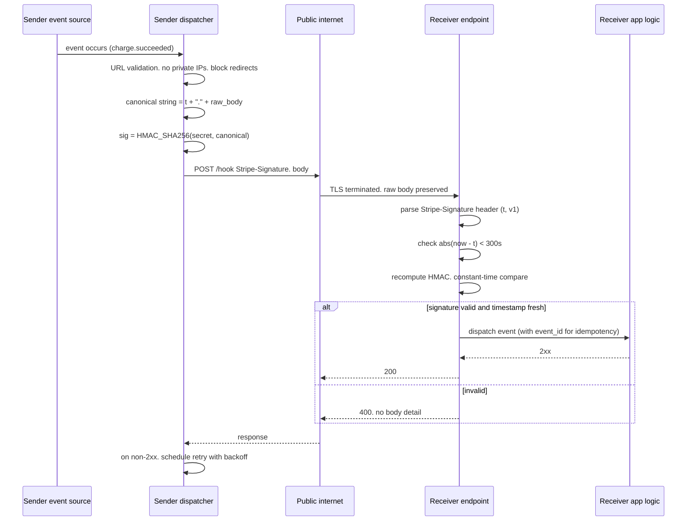

# Webhooks Security

> A webhook is an outbound HTTP callback from a sender service to a URL the receiver registered, delivered when an event happens. The receiver has no way to independently verify that the caller is the sender and that the event actually occurred, so trust must be established cryptographically at the request layer. Three patterns dominate in production: HMAC over a canonical string with a shared per-tenant secret, JWT-signed payloads over asymmetric keys published via JWKS, and mTLS for private inter-service delivery. The load-bearing invariants are that the signature covers the full body plus a timestamp, verification runs in constant time before any body parsing, and the timestamp is checked against a narrow window. Every real webhook incident traces back to one of those three invariants being violated, plus a fourth invariant on the sender side: never dispatch to a URL you have not validated against SSRF and redirect rules.

## How it works

A webhook flow has two independent trust boundaries and both can fail. The **sender** dispatches an HTTP POST to a URL the receiver configured, carrying an event payload (JSON, typically) and one or more signing headers. The **receiver** exposes a public HTTP endpoint (there is no other way for the sender to reach it from the internet) and must decide whether to act on the request. The receiver cannot rely on network-layer identity because the request arrived over TLS from whatever egress IP the sender's outbound fleet happens to use today, and IP allocations drift.

### Signing patterns in production

Three schemes cover almost every real deployment.

**HMAC-SHA256 with a shared secret** is the dominant pattern. Stripe uses a header `Stripe-Signature: t=<unix>,v1=<hex>` where `v1` is `HMAC_SHA256(secret, "<t>.<raw_body>")`. GitHub uses `X-Hub-Signature-256: sha256=<hex>` where the basis is the raw body only (no timestamp binding at the signature layer; GitHub relies on the delivery ID header for replay differentiation). Slack uses `X-Slack-Signature: v0=<hex>` with `v0=HMAC(secret, "v0:" + X-Slack-Request-Timestamp + ":" + raw_body)` and a separate `X-Slack-Request-Timestamp` header. Twilio signs the destination URL plus sorted POST parameters, which means the receiver must reconstruct the exact URL Twilio dialed, and any proxy that rewrites the host or path breaks verification.

**Asymmetric JWT-signed payloads** avoid the shared-secret problem for multi-consumer webhooks. The sender signs an envelope with a private key and the receiver verifies with the public key it fetched from a JWKS endpoint. This is the pattern for Auth0 log-streaming webhooks and some enterprise SaaS. The webhook body becomes a JWT and the receiver's verification is the standard `iss` + `aud` + `exp` + signature check (cross-link [13-jwt-token-security.md](./13-jwt-token-security.md)).

**mTLS** covers private inter-service webhooks where both sides own the cert store, typically for high-value flows like payment processor to acquirer, or intra-VPC service mesh callbacks. The signature check collapses into standard cert-chain validation with SAN pinning (cross-link [69-mtls.md](./69-mtls.md)).

### Delivery semantics that shape defense

Webhooks are at-least-once. The sender retries on non-2xx and on network errors, sometimes for hours or days with exponential backoff. That means the receiver sees replays of legitimate deliveries under normal operation, and cannot use "we have seen this signature before" as an attack signal. It must accept idempotent replay of good deliveries (via an event ID or delivery ID the sender provides) while rejecting replay after a short time window. This tension is where most timestamp-window bugs live.

### Trust boundaries diagram



## Quick reference

```http
POST /webhooks/stripe HTTP/1.1
Host: api.example.com
Content-Type: application/json
Stripe-Signature: t=1731542400,v1=5257a869e7ecebeda32affa62cdca3fa51cad7e77a0e56ff536d0ce8e108d8bd

{"id":"evt_1O...","type":"charge.succeeded","data":{"object":{...}}}
```

Receiver verification (Python-flavored pseudocode):

```python
def verify(headers, raw_body, secret, max_age=300):
    sig_header = headers["Stripe-Signature"]
    parts = dict(kv.split("=", 1) for kv in sig_header.split(","))
    t = int(parts["t"])
    if abs(time.time() - t) > max_age:
        raise Reject("stale")
    basis = f"{t}.".encode() + raw_body  # raw body, not re-serialized
    expected = hmac.new(secret, basis, hashlib.sha256).hexdigest()
    if not hmac.compare_digest(expected, parts["v1"]):
        raise Reject("bad_sig")
    return json.loads(raw_body)  # only after verify
```

| Invariant | Where enforced | How violated | Source |
|---|---|---|---|
| Signature covers body AND timestamp | Sender canonical-string construction | Sender signs only body, receiver has no way to detect stale replay | <sup>[[1]](#ref1)</sup> |
| Verification is constant-time | Receiver compare function | Using `==` on hex strings leaks per-byte timing | <sup>[[2]](#ref2)</sup> |
| Timestamp window narrow (5 min typical) | Receiver clock check | Wide window (hours) turns any captured payload into a replay grenade | <sup>[[1]](#ref1)</sup> |
| Verify against RAW body | Receiver framework config | Re-serializing JSON before HMAC changes bytes, breaks legitimate verifies and pushes teams to disable verification | <sup>[[1]](#ref1)</sup><sup>[[3]](#ref3)</sup> |
| Per-tenant secret rotation | Sender key management | Global shared secret leaks once, all tenants exposed forever | <sup>[[1]](#ref1)</sup> |
| Sender-side URL validation | Dispatcher pre-flight | Dispatcher follows redirects into internal metadata service | <sup>[[4]](#ref4)</sup><sup>[[5]](#ref5)</sup> |
| Idempotency on event ID | Receiver dedupe store | Retries double-charge, double-provision, or double-notify | <sup>[[1]](#ref1)</sup> |
| Reject before parsing body | Receiver request pipeline | Parsing untrusted JSON before verify exposes parser bugs and DoS | <sup>[[6]](#ref6)</sup> |

## Attack techniques

### 1. No signature verification at all

The most common webhook vulnerability is the receiver forgetting to verify the signature. The endpoint is publicly reachable, accepts any POST with the right shape, and executes downstream side effects: mark an invoice as paid, provision a resource, credit an account, fire an internal event. Any HTTP client on the internet can call it. This shows up because a developer sets up a webhook receiver against a sandbox sender that does not sign, ships the code, later switches to production which does sign, and never adds the verification path.

Black-box confirmation is direct: capture one legitimate webhook body from your own account, POST it to the receiver endpoint from an unrelated network, alter a field (change an amount, change a customer ID), and see if the receiver still acts on it. Blind confirmation lands on side effect observation: register a webhook for a `payment.succeeded` event in a test account, replay the body with an inflated amount, watch for the accounting entry. Escalation depends on the event catalog: `invoice.paid` in a billing stack turns into free service, `user.created` in an identity provider can turn into unauthorized account provisioning, `charge.refunded` in a marketplace can drain merchant balances.

### 2. Signature check present but timing-unsafe

The receiver computes the expected HMAC and compares against the header using `==` on hex strings, or `strcmp`, or a naive loop that exits early on the first mismatch. The comparison is fast when bytes differ near the start and slow when they match through most of the prefix. Over enough samples the timing difference is measurable, and an attacker can brute the signature byte-by-byte, roughly `16 * length` requests instead of `16^length`<sup>[[2]](#ref2)</sup>.

Confirmation is statistical. Send N requests per candidate byte, measure round-trip time, keep the byte with the highest mean, move to the next position. Real deployments rarely fail cleanly because network jitter dominates, but automated tools (`racepwn`-style but timing-oriented) surface this when the receiver runs on a low-latency path (same region, same VPC, or on-prem). The realistic attack window is where the attacker sits close enough to the receiver to get microsecond-stable timing, which increasingly means "a coworker on the same cloud region." Escalation is full signature forgery, which unlocks every event type the shared secret covers.

### 3. Signature verified, timestamp not

The receiver verifies HMAC correctly but never checks the timestamp embedded in the signature basis, or checks it against a window measured in hours. An attacker who captures one legitimate signed payload (via a leaked log, an intercepted webhook to a staging endpoint the attacker controls, a former employee's exfiltrated request dump) can replay that exact payload against the production receiver indefinitely and the receiver will treat each replay as a fresh event.

Confirmation: capture a signed webhook to any endpoint you legitimately control (your own webhook.site listener during development, your own staging environment), then POST byte-for-byte to the production endpoint days later. If the receiver processes it, the timestamp check is missing or too wide. Blind confirmation via side effects (a duplicate email fires, a duplicate credit posts). Escalation depends on whether the receiver deduplicates on event ID; if it does, single-event replay is blocked and the attacker looks for events with time-varying value (a small refund captured today, replayed as many small refunds tomorrow) or events where the sender's own idempotency guarantees are weaker.

### 4. Wide accepted window turns benign replay into an attack

A common defense-in-depth misconfiguration is accepting a very wide timestamp window "to be safe" against clock skew. Stripe recommends five minutes; teams set it to 24 hours to avoid pager pages during clock drift. That converts any signed payload captured anywhere in the last day into a valid replay. This is the same failure mode as (3) but with the check present and defanged. It is worth calling out separately because reviewers see the check code and mark the box as complete, missing that the window value defeats the check.

Auditing this cleanly means grepping the receiver code for the window constant and comparing to the sender's replay-attack guidance. Stripe documents 5 minutes<sup>[[1]](#ref1)</sup>; Slack documents 5 minutes<sup>[[3]](#ref3)</sup>; GitHub does not embed a timestamp so receivers must dedupe by `X-GitHub-Delivery`<sup>[[7]](#ref7)</sup>.

### 5. Signature covers only headers or metadata, not the body

The signature basis in the sender includes some fields but not the body, or includes the body's hash but the hash is over a re-serialized form. An attacker who intercepts a request in flight (or a former employee who dumped legitimate requests) modifies the body while keeping the signed portion intact, and the receiver verifies successfully. This bites custom in-house webhook designs more than commercial SaaS, and it also bites teams that migrate between JSON serializers on the receiver side and end up hashing a canonicalized form that differs from the sender's bytes.

Confirmation is straightforward if you can get one signed payload: alter the body, keep the header, submit, observe processing. The "hash re-serialized JSON" variant is subtler because the attacker cannot easily bypass it, but the receiver's own maintenance often does: a middleware that reformats JSON before the HMAC check causes every legitimate request to fail, and the team's fix is often to disable the check rather than restore the raw body path. That is where the exploit lands.

### 6. SSRF via sender-side webhook dispatch

The sender is a webhook target from the attacker's viewpoint: the attacker registers a webhook URL with the sender service, points it at `http://169.254.169.254/latest/meta-data/iam/security-credentials/` or an internal service, and waits for the sender's dispatcher to fetch it. If the dispatcher blindly follows redirects or doesn't validate the URL against a private-IP block list, the sender-side infrastructure makes internal requests on the attacker's behalf and can leak responses back if the sender surfaces the receiver's response body in delivery logs<sup>[[4]](#ref4)</sup>.

This class of bug shows up repeatedly in bug-bounty programs against SaaS platforms that let tenants register arbitrary URLs (Shopify, Slack, and many CRM/marketing platforms have historical public disclosures in this space)<sup>[[5]](#ref5)</sup>. Confirmation is standard SSRF (cross-link [04-ssrf.md](./04-ssrf.md)): use collaborator URLs, redirect chains through open redirects, DNS names that resolve to private IPs on second lookup (DNS rebinding). Escalation depends on what the sender's outbound network can reach: cloud metadata services, internal admin APIs, service-mesh sidecars. Modern senders validate URLs at registration and re-validate DNS at dispatch time and refuse to follow cross-origin redirects.

### 7. Environment cross-replay

The sender issues one secret per webhook endpoint but the receiver's staging and production share webhook code and the developer copied the wrong secret into staging (or logged a real webhook body during a staging debug session, complete with signature). An attacker who accesses staging (weaker auth, exposed to more people) captures signed payloads that are valid against the staging secret, but if the same secret was used across environments they also verify against production. Even without shared secrets, if the receiver code accepts a list of valid secrets during rotation and a stale secret was never removed, the same replay path works.

Confirmation: check `git log` and `.env` history for webhook secrets that appear in multiple environments; check whether the receiver library accepts multiple secrets and whether the retirement path actually removes old ones. The fix is per-environment secrets, forced rotation on any log-leakage incident, and receiver code that fails closed when only stale secrets validate.

### 8. IP allowlist substituted for signature verification

The receiver decides that because the sender publishes egress IP ranges (Stripe, GitHub, and many others do), IP allowlisting is sufficient and skips signature verification entirely. Two failures follow. First, the sender's IP ranges drift; new ranges appear, old ranges retire, and the receiver either falls behind (blocking legitimate deliveries) or is generous with wildcards (weakening the check). Second, cloud providers reuse IPs across tenants, so an attacker who provisions instances in the same cloud region can eventually land on an IP the sender previously used, or share an outbound NAT pool with the sender. IP allowlist is layered defense, not verification.

### 9. Receiver-side DoS via signed-but-expensive payloads

An attacker with a leaked webhook secret (or on the sender side of a compromised third-party integration) sends signed payloads that pass verification but trigger expensive receiver-side work: large batch imports, database-heavy analytical queries, PDF renders. Signature verification alone does not gate resource cost. Defense is per-tenant rate limiting on webhook receipt and cost-aware queueing (park expensive events, bound concurrency).

## Defense

### Real fix

1. **Verify HMAC-SHA256 over the raw body plus a timestamp** on every inbound webhook, before parsing the body. Use the sender's documented canonical string (do not invent your own). For Stripe, the basis is `t + "." + raw_body`; for Slack it is `v0:` + timestamp + `:` + raw_body; for GitHub the basis is raw body only and you dedupe on `X-GitHub-Delivery`<sup>[[7]](#ref7)</sup>. Store the raw bytes before any middleware parses or reformats them<sup>[[1]](#ref1)</sup><sup>[[3]](#ref3)</sup>.
2. **Compare in constant time.** Every mainstream language has this: Python `hmac.compare_digest`, Node `crypto.timingSafeEqual`, Go `hmac.Equal`, Java `MessageDigest.isEqual`. Ban `==` and `strcmp` on signatures in code review<sup>[[2]](#ref2)</sup>.
3. **Bind timestamp to signature and enforce a narrow window.** Five minutes is the industry default and works with reasonable clock skew (NTP-synced hosts drift under 100ms). Widen only with a documented reason and shorten as soon as the reason passes<sup>[[1]](#ref1)</sup>.
4. **Per-tenant, per-endpoint secrets** with rotation. Store secrets in the receiver's secret manager, not in `.env` files that get logged. On any suspected leak (staging log, contractor offboarding, GitHub secret-scanning alert), rotate immediately, and design your receiver so it can hold two active secrets during rotation windows and drop the old one on schedule.
5. **Sender-side URL validation before dispatch.** When your service accepts webhook URLs from customers, validate them: reject non-HTTPS, resolve DNS at registration and re-resolve at dispatch, block private IP ranges (RFC 1918, link-local 169.254.0.0/16, loopback, IPv6 equivalents including fc00::/7 and ::1), do not follow redirects during dispatch, and treat DNS rebinding as a live threat (cross-link [04-ssrf.md](./04-ssrf.md))<sup>[[4]](#ref4)</sup>.
6. **Idempotency on event ID.** The sender provides an event ID (`evt_...`, `X-GitHub-Delivery`, `x-slack-request-id`). The receiver records processed IDs in a dedupe store keyed by event ID with a TTL longer than the sender's maximum retry window. Second delivery of the same event is a no-op that returns 2xx to acknowledge, not a replay<sup>[[7]](#ref7)</sup>.

### Defense in depth

1. **Dedicated public-only endpoint** for webhooks, isolated from admin and user-facing paths, with its own rate limits and logging. This narrows blast radius when a receiver-side bug lets a bad request through.
2. **IP allowlist as a coarse pre-filter** on top of signature verification, never in place of it. Update the allowlist from the sender's published IP list on a schedule and alert when the published list changes.
3. **Return generic error bodies.** A verification failure returns 400 with no detail. Never leak "signature mismatch" versus "timestamp expired" versus "unknown event" to the caller: those messages help an attacker triangulate the misconfiguration.
4. **Log the raw body and signature for a bounded window** to enable incident replay, with access controls that treat those logs as sensitive (they contain live signatures against your secret, so they are a replay tool if leaked, see attack technique 7).
5. **Sender-side outbound firewall** on the dispatcher: block egress to RFC 1918, metadata IPs, and known service ports (SSH, RDP, database) even if URL validation is bypassed. This is the belt-and-suspenders for SSRF.
6. **Response-body suppression** in delivery logs. If your webhook system surfaces receiver responses to the sender's tenants (for debugging), truncate and sanitize; that channel is how SSRF via webhook dispatch leaks its payload.
7. **Circuit breakers on retry.** Do not let one broken receiver consume unbounded dispatcher capacity; back off aggressively on consecutive failures.

## Detection and telemetry

Log per webhook receipt: sender identity (which tenant secret verified), event type, event ID, signature verification result (pass/fail/timing-fail/timestamp-fail), timestamp delta from now, dedupe hit (yes/first-see), receiver processing outcome (2xx, 4xx, 5xx). Alert on:

- Verification failure rate spikes on a single endpoint (attacker probing or sender rotation you missed).
- Timestamp-window rejections concentrated in a narrow band (clock drift, or someone replaying with a stale capture).
- Dedupe hits with mismatched bodies for the same event ID (impossible under correct sender behavior, indicates body tampering by an intermediary or a sender-side bug).
- Signature verifications passing from unexpected source IPs (IP-allowlist pre-filter would catch, but log if only signature check is present).
- Dispatcher-side: outbound webhook POSTs whose resolved IP falls in private ranges (sender-side SSRF probe).

Canary shapes: register a webhook endpoint that always returns 400 and route a small percentage of a specific event type there; you can use it as a live check that signatures verify correctly without any downstream side effect. On the sender side, register a canary webhook target under your own control that measures signature freshness, body integrity, and dispatch latency continuously.

## Interviewer probes

**Q: Why does the signature basis need to include a timestamp if the receiver already dedupes on event ID?**
Mid: Because dedupe on event ID only blocks second processing of the same event, not modified replays. If the attacker replays with a new event ID (or the dedupe store expires), the same signature is still valid.
Principal: Because dedupe on event ID has a finite retention window and the sender's retry policy plus network reality mean dedupe stores are TTL'd (typically days). A signature without a bound timestamp is valid forever, so a payload captured today is replayable after the dedupe TTL. Binding timestamp to signature turns "forever valid" into "valid for the accepted window," which is the smallest guarantee that composes cleanly with a bounded dedupe store. The two defenses are not redundant; they cover complementary time regions.

**Q: Stripe uses HMAC-SHA256 with a shared secret. Why not asymmetric?**
Mid: Shared secret is simpler and lower-latency, and HMAC-SHA256 is fast to verify.
Principal: For a single-tenant-to-single-receiver channel, shared secret is fine and the operational cost of key rotation is cheaper than distributing public keys. Asymmetric becomes worth it when one sender broadcasts to many receivers who cannot be trusted to keep the shared secret out of their logs (log-streaming products, marketplaces), or when the receiver needs to verify without holding any sender secret (compliance environments where the receiver's threat model includes their own operators). Auth0's log webhooks use JWTs for exactly that reason. mTLS is the third point on the spectrum, appropriate when both sides own the trust store and the network segment is private.

**Q: How would you exploit a receiver that verifies signatures with `==` on hex strings?**
Mid: Timing attack. The comparison exits early on the first mismatched byte, so you can brute the signature one byte at a time.
Principal: In theory yes, in practice it depends on where you are on the network relative to the receiver. From the public internet across geographies, jitter dominates the per-byte timing signal and you would need enormous sample sizes. From the same cloud region or same VPC, sub-microsecond stability is achievable and the attack becomes practical for small signature lengths. The realistic attack path today is a compromised coworker or a shared-tenancy neighbor; the defense (constant-time compare) costs nothing so there is no reason not to enforce it.

**Q: A tenant of your webhook service asks to use HTTP not HTTPS on their receiver. What do you say?**
Mid: Refuse. HTTP means the body and signature transit in cleartext.
Principal: Refuse, but the interesting part is why. Cleartext exposes the signature to any on-path adversary who can then replay it (within the timestamp window if there is one), and it exposes any PII in the event body. The tenant's request usually means they cannot terminate TLS at their edge; the answer is a TLS-terminating proxy in front, not weakening the sender. If the tenant's regulatory framework requires TLS 1.2+ (PCI DSS 4.0.1 for card data), HTTP is a non-starter regardless.

**Q: You are the sender. A tenant registered `http://internal.attacker.example/hook` as their webhook URL. Later they registered `http://short.ly/abc`. Both point where?**
Mid: The first is direct; the second involves a redirect the sender might follow.
Principal: Both are attacks if URL validation is done at registration only. The first can be direct-resolved to a private IP via DNS rebinding: attacker.example resolves to a public IP at registration and to 169.254.169.254 at dispatch. The second wraps a redirect chain that ends at an internal address; if the dispatcher follows redirects it lands on internal infrastructure. Defense is validate at dispatch time not just at registration, resolve DNS at dispatch and reject if the IP is private, disable redirect following on the HTTP client, and prefer allowlisted domains for high-value integrations.

**Q: When would you use IP allowlisting instead of signature verification?**
Mid: You would not; use both.
Principal: You never use it *instead of* signature verification. IP allowlisting is useful as a coarse pre-filter to reduce receiver-side load from random internet scanning and to bound replay-attack surface (an attacker with a captured signature cannot replay from arbitrary IPs), but it has three known failure modes: sender IP ranges drift and receivers fall behind, cloud IPs are recycled across tenants so a former sender IP can end up hosting an attacker VM, and any sender-side compromise puts the attacker inside the allowlist. Use it as one layer, treat signature verification as the load-bearing check.

**Q: A webhook body is JSON. Your framework parses it into a dict before your controller runs. Then you compute HMAC over the serialized dict. What is wrong?**
Mid: Re-serialization changes the bytes (key order, whitespace, number formatting) so the HMAC will not match the sender's.
Principal: Correct, and the second-order problem is worse. When the HMAC does not match, the team's fix is often to disable verification because the alternative (route raw bytes through the framework) is a significant refactor. The right pattern is to preserve the raw body from the request pipeline before any parser touches it. In Express you use `express.raw()` on the webhook route, in Django you read `request.body` before any DRF parser runs, in Flask you use `request.get_data()`. The whole raw-body plumbing is the largest single source of "we tried to verify but had to turn it off."

## War story

A billing team migrated their webhook receiver from a monolithic Rails app to a serverless function fronted by API Gateway. The signature verification code moved cleanly, tests passed, verification worked in staging against synthetic events. Production started rejecting real webhooks the day of cutover. The API Gateway integration was configured to pass the request body as a parsed JSON object, and the Lambda re-serialized it before hashing. Every real signature was valid against the original bytes, and the receiver was computing HMAC over a re-serialized form with different whitespace. The on-call fix that shipped in the first hour was to disable verification and rely on IP allowlist. The IP allowlist accepted every current Stripe egress range, and none of them contained an attacker at that moment, so no exploitation occurred. The permanent fix (routing the raw body through as a base64 string in the API Gateway request template) shipped four days later. Two lessons stuck: staging environments must use production sender secrets and production sender bodies (via replay of captured events), not synthetic ones; and any code path that touches the request body between TLS termination and HMAC verification is a landmine.

## Sources

<a id="ref1"></a>[1] Stripe. Webhook signatures. Stripe API Documentation. 2024. https://stripe.com/docs/webhooks/signatures

<a id="ref2"></a>[2] Coda Hale. A Lesson In Timing Attacks. codahale.com. 2009. https://codahale.com/a-lesson-in-timing-attacks/

<a id="ref3"></a>[3] Slack. Verifying requests from Slack. Slack API Documentation. 2024. https://api.slack.com/authentication/verifying-requests-from-slack

<a id="ref4"></a>[4] OWASP. Server Side Request Forgery Prevention Cheat Sheet. OWASP Cheat Sheet Series. 2024. https://cheatsheetseries.owasp.org/cheatsheets/Server_Side_Request_Forgery_Prevention_Cheat_Sheet.html

<a id="ref5"></a>[5] HackerOne. Hacktivity feed (public disclosures, filter by "webhook" and "SSRF" for representative reports across programs including Shopify, Slack, and others). HackerOne. https://hackerone.com/hacktivity

<a id="ref6"></a>[6] OWASP. REST Security Cheat Sheet. OWASP Cheat Sheet Series. 2024. https://cheatsheetseries.owasp.org/cheatsheets/REST_Security_Cheat_Sheet.html

<a id="ref7"></a>[7] GitHub. Securing your webhooks. GitHub Docs. 2024. https://docs.github.com/en/webhooks/using-webhooks/validating-webhook-deliveries
