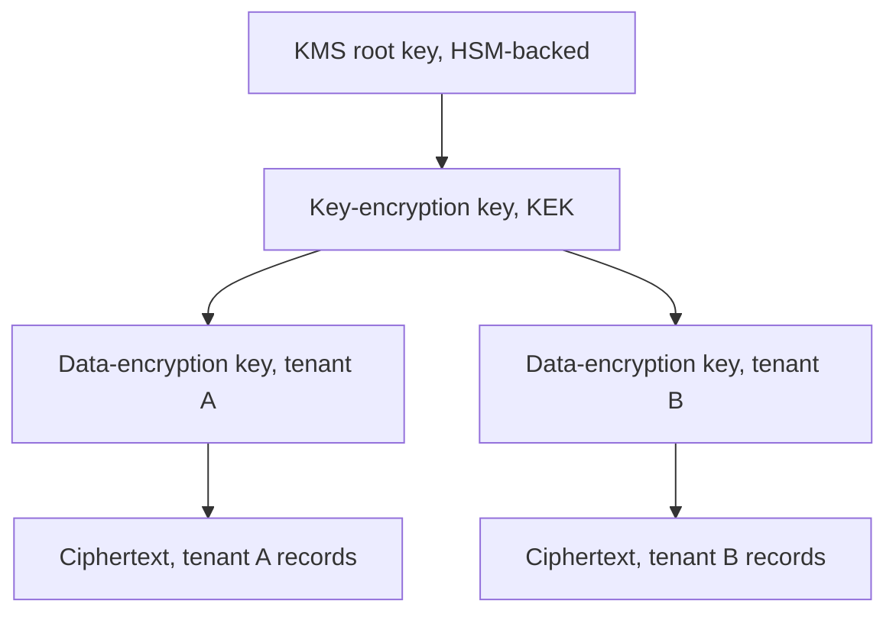

# Secrets, Keys, and Data Protection

> Every credential-shaped decision reduces to one question: does the verifier need to see the material to check it? A bearer credential crosses the wire and the verifier reads it directly; a proof-of-possession credential lets you prove you hold it without revealing it. A symmetric verifier holds a working copy of the secret, so breaching their store yields a usable credential, while an asymmetric one holds only a public key, so breaching them yields nothing; material can also be extractable, readable from memory or disk, or non-extractable, usable only from inside hardware that never releases it. The everyday config-versus-secrets-versus-keys split is a rough proxy for these axes that breaks at the edges: an API key is called a key but behaves like a bearer symmetric secret, and a KMS data-encryption key is also called a key yet gets retrieved in plaintext by design, because envelope encryption exists so you don't stream terabytes through KMS itself. This doc covers what happens once something lands in one of these buckets, where it lives, who can reach it, and how long it stays valid, and that forks hard by custody boundary because a cloud server, a CI pipeline with no persistent identity, and a mobile app on user-controlled hardware face genuinely different realistic mechanisms. The single biggest thing a Principal reviewer checks is whether a credential's lifetime and storage location match its blast radius.

**Interview frequency:** Core

## Where this decision forks

The decomposition axis is custody boundary and consumer, meaning who holds the credential and what identity primitives that environment already hands them for free. A server or cloud workload sits inside a cloud account or cluster that can issue it identity without a secret at all: an IAM role, IRSA, a SPIFFE SVID. A CI pipeline has no persistent identity between runs, so its answer is short-lived federation rather than a vault it would have to bootstrap into on every job. A mobile app runs on hardware the user, not the org, controls, so the vault becomes whatever the OS keychain and secure hardware expose rather than a server-side service the app calls into. Data-at-rest and data-protection architecture gets a fourth context of its own, because it is less about who holds a live credential and more about how the stored data itself is structured so that holding valid credentials doesn't automatically mean holding the plaintext.

If a credential's protocol is bearer, plaintext at the point of use is unavoidable, and the real levers are lifetime, scope, audience binding, rotation, and audit of use, not where it's stored. If the protocol is proof-of-possession, the material can stay behind a boundary (HSM, KMS, Secure Enclave) instead, which is when a hardware root of trust actually buys something. The senior move is often changing which category a credential is in, not just finding a better place to store the same bearer secret:

| Weak default | Stronger move | Why |
| --- | --- | --- |
| Static API key | OAuth client credentials with `private_key_jwt`[[14]](#ref14) or mTLS client authentication[[15]](#ref15) | Moves from a shared bearer secret to an asymmetric proof of possession |
| Bearer access token | DPoP-bound[[16]](#ref16) or mTLS-bound token | A stolen token alone is no longer usable without the key it's bound to |
| Password | WebAuthn / passkey | One step from bearer-symmetric-extractable to proof-of-possession-asymmetric-non-extractable |
| Long-lived cloud access key | Assumed-role credentials today, OIDC federation to remove the standing credential entirely | No static credential exists for a leak to expose |
| Shared HMAC webhook secret | Asymmetric signature verification | The receiver holds only a public key; breaching them yields nothing usable elsewhere |
| Service-to-service shared secret | Workload identity (IRSA, SPIFFE SVID) | Eliminates the secret category outright |

"Where do we store the secret" is the question worth answering only after this move has failed. [Token Exchange and Delegation](78-token-exchange.md) and [SPIFFE and SPIRE](81-spiffe-spire.md) are both existing examples of this same category shift already in the repo.

### Server and cloud workloads

This is the context with the deepest ladder, because cloud platforms have spent a decade building intermediate rungs between hardcoding and doing nothing at all. Workload identity applies more often than teams assume once they stop reaching for a vault by default: a proof of who is asking, issued and revoked by the platform, replaces the credential outright. When a real secret is unavoidable, the design question becomes how short its lifetime and how narrow its blast radius, which is what the ladder below tracks.

| Option | Best for | Avoid when | Status (2026) | Deep dive |
| --- | --- | --- | --- | --- |
| Hardcoded in source | Nothing; this is the scanner finding, not a design | Always | Legacy | [Cryptographic Failures](17-cryptographic-failures.md) |
| Env var / config file | Local dev, single-tenant ephemeral containers | Any shared host or anything landing in crash dumps and process listings | Still common | — |
| Parameter Store SecureString[[4]](#ref4) | Low-churn config secrets for teams without Vault operational budget | Fine-grained rotation or per-secret audit is required | Still common | — |
| Secrets Manager[[3]](#ref3) | App credentials needing scheduled rotation and an audit trail | Secret volume needs sub-minute, per-request TTLs | Preferred | — |
| Vault dynamic secrets[[5]](#ref5) | Database and cloud creds issued on demand, TTL in minutes | Team lacks the operational maturity to run and patch Vault itself | Preferred | — |
| No secret at all (IAM role, IRSA[[6]](#ref6), workload identity, SPIFFE SVID) | Any workload running inside the cloud account or cluster boundary | A third-party SaaS that only accepts a static credential it stores itself | Preferred | [SPIFFE and SPIRE](81-spiffe-spire.md), [mTLS](69-mtls.md) |
| KMS | Encrypting data, wrapping DEKs, signing without the key material ever leaving the service | Regulatory need for single-tenant physical key custody | Preferred | [Cryptographic Failures](17-cryptographic-failures.md) |
| CloudHSM / dedicated HSM | FIPS 140-3 Level 3 requirement, single-tenant key custody[[7]](#ref7) | Cost and operational burden isn't justified by the actual threat model | Niche-but-required | [Cryptographic Failures](17-cryptographic-failures.md) |
| Confidential computing (Nitro Enclaves, AMD SEV-SNP, Intel TDX) | Protecting data in use from the cloud operator or a co-tenant, multi-party computation | General workloads with no data-in-use threat in scope | Emerging | — |

The Vault dynamic-secrets rung is the one teams most often skip past, and it's worth pausing on why it exists between Secrets Manager and workload identity. A Secrets Manager secret is long-lived and shared across every consumer that fetches it; a Vault dynamic secret is minted per lease, tied to one consumer, and expires in minutes whether or not anyone revokes it by hand. That difference matters most for database credentials, where a leaked Secrets Manager value is valid until someone notices and rotates it, while a leaked Vault lease is often already expired by the time anyone would act on it. Confidential computing sits at the far end for a different reason: Nitro Enclaves and SEV-SNP protect memory contents from the hypervisor and co-tenants while code runs, which matters for multi-party computation and regulated workloads processing data the cloud operator itself shouldn't see, but it requires re-architecting the workload to run inside the enclave boundary rather than flipping a setting on an existing VM.

| Consideration | Why it matters | Design guidance | Deep dive |
| --- | --- | --- | --- |
| Secret zero | Every credential-fetching workload still needs to authenticate before it can fetch its first credential | Use cloud IAM instance-role auth, Kubernetes ServiceAccount token review, or SPIFFE/SPIRE node and workload attestation, never a bootstrap password | [SPIFFE and SPIRE](81-spiffe-spire.md) |
| Rotation without downtime | A rotated secret breaks any connection or cached client still holding the old value | Run dual-version overlap: issue the new value alongside the old, cut consumers over, revoke the old value only after the overlap window closes | [JWT and Token Security](13-jwt-token-security.md) |
| KMS encryption context as a cross-tenant control | Free, cheap isolation: ciphertext encrypted under one tenant's context won't decrypt under another's[[12]](#ref12) | Set encryption context to the tenant ID on every encrypt call; a mismatched decrypt fails and lands in the audit trail automatically | [Cryptographic Failures](17-cryptographic-failures.md) |
| Key access as a detective control | Every KMS decrypt is an auditable event most teams never actually look at | Alert on decrypt-volume anomalies per principal, not just on failed decrypts | [Cryptographic Failures](17-cryptographic-failures.md) |
| Kubernetes Secret objects | Base64 is encoding, not encryption, and the default etcd store is plaintext-equivalent on disk | Enable etcd encryption at rest and prefer an external secrets store or CSI driver over native Secret objects for anything sensitive | [Kubernetes Security](85-kubernetes.md) |

Also worth a look: over-broad IAM grants on `secrets:GetSecretValue` (least-privilege scoping, not just storage), secret sprawl across dev/staging/prod (credential reuse across boundaries), and non-human identity lifecycle (who owns decommissioning a service account), covered further in [Authentication](96-authentication.md).

### CI/CD pipelines

A CI job has no identity before it starts and none after it ends, so the workload-identity trick from the previous context needs a bridge. OIDC federation lets the CI platform vouch for a specific run, repo, branch, sometimes environment, directly to cloud IAM, and the cloud issues a short-lived role session scoped to just that run. The legacy alternative, a static access key sitting in repo or org secrets, is the CI equivalent of hardcoding: valid indefinitely, readable by anyone with secrets-admin on the repo, and impossible to scope to a single run.

| Option | Best for | Avoid when | Status (2026) | Deep dive |
| --- | --- | --- | --- | --- |
| Long-lived static access keys in repo/org secrets | Legacy pipelines, CI providers without OIDC federation support | Any provider that already supports OIDC federation | Legacy | [Cryptographic Failures](17-cryptographic-failures.md) |
| OIDC federation to cloud IAM[[13]](#ref13) | Any pipeline on a provider with a workload-identity federation option | A self-hosted or on-prem runner with no reachable OIDC issuer | Preferred | [SPIFFE and SPIRE](81-spiffe-spire.md) |
| Vault/Secrets Manager fetch at pipeline start, short TTL | Third-party API keys a cloud role assumption can't cover | The credential could instead be replaced by a role assumption | Still common | — |

| Consideration | Why it matters | Design guidance | Deep dive |
| --- | --- | --- | --- |
| OIDC trust policy scoping | A trust policy accepting any repo or branch lets any pipeline in the org assume the role | Scope the `sub` claim to the exact repo, branch, and environment, never a wildcard | [JWT and Token Security](13-jwt-token-security.md) |
| Static key long tail | Keys copied into forks, local `.env` files, or a laptop outlive the official rotation schedule | Treat any static CI key as compromised the moment a fork with repo access is discovered, rotate immediately rather than on schedule | [Cryptographic Failures](17-cryptographic-failures.md) |
| Secret exposure in build logs and artifacts | Secrets echoed to stdout or baked into a cached image layer persist long after the job ends | Mask known secret values in log output and scan build artifacts before they publish | — |
| Self-hosted runner bootstrap identity | A self-hosted runner still needs its own secret zero, because the OIDC issuer belongs to the CI platform, not the runner host | Give the runner host workload identity of its own (IRSA, SPIFFE) instead of a static key baked into the AMI | [SPIFFE and SPIRE](81-spiffe-spire.md) |
| Federated token audience and claims validation | Accepting an OIDC token without checking `aud`/`sub` behaves like a JWT verifier with no audience check | Validate issuer, audience, and subject claims on the cloud IAM side, don't trust presence of the token alone | [JWT and Token Security](13-jwt-token-security.md) |

Also worth a look: workflow-file tampering as a path to token theft, third-party Action/plugin supply-chain trust, and matrix-build secret duplication across parallel jobs, all covered as CI/runner hardening concerns in [Kubernetes Security](85-kubernetes.md) where the same identity-and-isolation questions apply to self-hosted build infrastructure.

### Mobile devices

A mobile app is a public client per RFC 8252[[1]](#ref1). It ships to a device the org doesn't control, so anything embedded in the binary or app sandbox is extractable given enough effort, and the honest design stance is that the app holds no long-term secret at all. What it does hold is OAuth tokens and app-level keys, and the design question becomes which OS-provided hardware boundary those live behind and how tightly key use is bound to the user actually being present.

| Option | Best for | Avoid when | Status (2026) | Deep dive |
| --- | --- | --- | --- | --- |
| No secret at all, OAuth code + PKCE via system browser | Any user-facing login flow | An embedded WebView is used instead of the system browser or a Custom Tab | Preferred | [Authentication](96-authentication.md) |
| OS Keychain (iOS) / Android Keystore[[9]](#ref9)[[10]](#ref10) | Storing tokens or app-level secrets after authentication | The value needs to sync across the user's devices | Preferred | [Authentication](96-authentication.md) |
| Hardware-backed Keystore/StrongBox, biometric-gated key access, App Attest / Android Key Attestation | High-value keys (payment, device attestation) needing unwrap tied to biometric presence | Device hardware predates StrongBox or a Secure Enclave equivalent | Preferred | [mTLS](69-mtls.md) |
| Confidential computing / TEE backend paired with mobile attestation | Server-side verification of high-assurance client attestation payloads sent from the device | General mobile apps with no hardware-attestation requirement | Niche-but-required | — |

TPM 2.0 sealing, measured boot, and remote attestation[[11]](#ref11) belong to a related but distinct hardware root of trust: they're the PC and server platform module story, not the mobile one, and a candidate who describes an iOS app as relying on TPM sealing would get corrected in a real interview. The mobile equivalents are Secure Enclave on iOS and StrongBox on Android, exposed through App Attest and Android Key Attestation respectively, both already covered by the Keystore row above. Confidential computing on the mobile side usually means the backend, not the phone: a TEE-backed service verifies an attestation payload the device produced, so the "protects data in use" property lives server-side even though the trigger is a mobile client.

| Consideration | Why it matters | Design guidance | Deep dive |
| --- | --- | --- | --- |
| Biometric-gated key unwrap vs a boolean check | An app-code boolean from `LAContext` or `BiometricPrompt` is bypassable by hooking or patching the binary | Bind the key itself to biometric auth at the Keychain/Keystore layer so it will not unwrap without it, never branch on a returned boolean | [Authentication](96-authentication.md) |
| Keychain sync default | iCloud Keychain syncs to every device signed into the account unless explicitly opted out | Set the item's accessibility to `ThisDeviceOnly` (or Android's non-exportable key flag) for anything meant to stay device-bound | — |
| Certificate pinning's outage risk | Pinning defends against interception but a missed rotation locks out every pinned client at once | Pin to a CA or intermediate with a real rotation lead time, and ship a remote kill-switch to disable pinning if it goes wrong | [mTLS](69-mtls.md) |
| Attestation defends extraction, not credential abuse | TPM/Secure Enclave stop key theft off the device but do nothing once an attacker holds a legitimately issued credential | Pair attestation with server-side anomaly detection on token use; don't treat attestation as sufficient authorization on its own | [Cryptographic Failures](17-cryptographic-failures.md) |
| Embedded WebView vs system browser | An app-controlled WebView can read the password field and intercept the OAuth redirect | RFC 8252 requires the system browser or an in-app Custom Tab/SFSafariViewController, never a WKWebView login form | [Authentication](96-authentication.md) |

Also worth a look: jailbreak/root detection's inherent unreliability (a signal, not a control), App Transport Security exception configs that quietly re-open plaintext HTTP, and Secure Enclave's non-exportability guarantee not extending to app-level misuse once a valid session token exists, all adjacent client-hardening questions covered in [mTLS](69-mtls.md) alongside pinning and device-identity.

### Data at rest and data-protection architecture

Encryption at rest as most teams deploy it defends against one thing: someone walking off with a disk or a snapshot. The application server holds valid decrypt permission and decrypts on every request, so an attacker who compromises the application, not the disk, gets the plaintext for free. The controls that actually change that picture are authorization, minimization, and genuinely separating who can read ciphertext from who can request a decrypt, which is what the rest of this context is about.

Rotating the KEK re-wraps each tenant's data-encryption key in place, and every record encrypted under that key stays untouched. That's the answer to "how do you rotate keys without re-encrypting everything": the rotation cost is proportional to the number of DEKs, not the number of records.

| Option | Best for | Avoid when | Status (2026) | Deep dive |
| --- | --- | --- | --- | --- |
| Full-disk / volume encryption (EBS, LUKS, BitLocker) | Baseline compliance checkbox, physical media theft | Threat model includes application-level compromise or insider access | Still common | [Cryptographic Failures](17-cryptographic-failures.md) |
| Application-level envelope encryption (KEK/DEK) | Any system needing key rotation without re-encrypting the dataset[[2]](#ref2) | Data volume is small enough a single-key scheme is genuinely simpler | Preferred | [Cryptographic Failures](17-cryptographic-failures.md) |
| Per-tenant / per-record DEKs | Multi-tenant SaaS needing blast-radius containment per customer | Single-tenant systems where the added key management buys nothing | Preferred | [Tokenization](87-tokenization.md) |
| Field-level encryption, separated key access | The specific fields that must survive an application compromise (SSNs, health records) | Applied to every field in the schema, breaking queries and indexes wholesale | Preferred | [Cryptographic Failures](17-cryptographic-failures.md) |
| Tokenization[[8]](#ref8) | Payment data (PAN) and PII that should fall out of audit scope entirely | The application needs to recover the real value routinely | Preferred | [Tokenization](87-tokenization.md) |
| Crypto-shredding | Deletion and right-to-be-forgotten requirements at record or tenant granularity | The org needs provable forensic unrecoverability, not just key destruction | Preferred | [Tokenization](87-tokenization.md) |

| Consideration | Why it matters | Design guidance | Deep dive |
| --- | --- | --- | --- |
| Envelope encryption key hierarchy | Rotating a key that encrypted the data directly means re-encrypting everything | Rotate the KEK and re-wrap only the DEKs; ciphertext never moves | [Cryptographic Failures](17-cryptographic-failures.md) |
| Crypto-shredding as deletion | "Delete" often really means "retain for compliance but make unrecoverable" | Destroy the DEK, not the ciphertext, and log the destruction event as the audit trail of the deletion itself | [Tokenization](87-tokenization.md) |
| Tokenization as scope reduction | Systems that never hold the real value fall out of audit scope entirely[[8]](#ref8) | Route the real value through a token vault once; store only the token everywhere else | [Tokenization](87-tokenization.md) |
| Searchable-encryption tradeoff | Any structured search over encrypted data leaks something: equality, frequency, or order | Avoid encrypting fields that must be searched; where search is required, use a blind index (HMAC of the normalized plaintext under a separate index key) instead of deterministic encryption directly, and never use order-revealing schemes for sensitive fields | [Cryptographic Failures](17-cryptographic-failures.md) |
| BYOK/HYOK/External Key Store | Customer-managed keys satisfy procurement but make the customer's HSM a hard dependency | Offer BYOK as an option, not a default, and design for the customer revoking key access as an expected failure mode | [Cryptographic Failures](17-cryptographic-failures.md) |
| Pepper storage for password hashes | A pepper stored beside the hash it protects defeats the point of having one | Store the pepper in KMS/HSM, in a storage boundary separate from the password hash itself | [Password Authentication in 2026](75-password-authentication.md) |
| Field encryption without genuinely separated key access | If the app that reads the field also holds the key, field encryption changes nothing about the real threat model | Route decrypt calls through a service boundary the application can't bypass, so a stolen app credential alone isn't enough | [Cryptographic Failures](17-cryptographic-failures.md) |

Also worth a look: IV/nonce reuse across records (deterministic-mode failure), backup and snapshot encryption scope drifting from the primary store's, and padding-oracle mechanics in block-cipher modes, all covered in [Cryptographic Failures](17-cryptographic-failures.md).

## Recommended defaults by context

| Context | Recommended default | Why |
| --- | --- | --- |
| Server / cloud workloads | Workload identity (IAM role, IRSA, SPIFFE SVID) for anything inside the cloud or cluster boundary; Secrets Manager for what can't use identity | Removes the secret rather than storing it better |
| CI/CD pipelines | OIDC federation to cloud IAM, scoped trust policy per repo/branch | No long-lived key sits in repo settings for an attacker to find |
| Mobile devices | OS Keychain/Keystore with biometric-gated key access, OAuth code+PKCE via the system browser | The device has no server-side vault; OS-backed hardware is the vault |
| Data at rest | Envelope encryption (KEK/DEK) with per-tenant DEKs, plus field-level encryption and separated key access for the fields that matter | Rotates without re-encrypting everything, and changes what a stolen app credential alone can reach |

## Migration path

- **Server and cloud workloads.** Move off hardcoded secrets first; they're the scanner-visible finding and the easiest sell to stakeholders. The harder sell is retiring env-var secrets on workloads that could use identity instead, because an IAM trust policy feels more abstract to an operations team than a value sitting visibly in a `.env` file, and the migration surfaces every script that assumed a synchronous, always-present secret rather than an assumed role with a session that expires and needs refreshing. Stage it hardcoded to env var to Secrets Manager as an intermediate step for anything that genuinely can't drop the secret. Move the highest-blast-radius workloads (anything touching production data or payment flows) to identity-based access first rather than waiting for full fleet coverage, and expect the on-call rotation to push back once the first token-refresh bug surfaces in an edge case nobody load-tested.
- **CI/CD pipelines.** The break is usually silent until a static key gets rotated or expires and a forgotten pipeline goes red weeks later. Inventory every static key in repo/org secrets before removing any of them, because a key nobody remembers is still a key an attacker can find. Migrate the highest-privilege pipelines (deploy, infra) to OIDC first, since they carry the most blast radius, and expect pushback from teams stuck on unsupported CI runners, self-hosted or older on-prem systems that can't originate an OIDC token without an upgrade of their own. Plan for a deprecation window rather than a hard cutover: teams discover forked repos and long-forgotten scheduled jobs still using the old key well after the "migration" was declared complete.
- **Mobile devices.** Migrating an embedded WebView login to system-browser PKCE is mostly a UX conversation, not an engineering one: product pushes back because the system browser breaks the seamless in-app feel, and the fix is investing in Custom Tab/SFSafariViewController styling rather than reverting to the WebView. Migrating a boolean biometric check to a hardware-gated key unwrap is bigger surgery. It usually means re-issuing keys for existing users on next launch, handling the re-auth prompt gracefully, and accepting that devices without a StrongBox or Secure Enclave equivalent fall back to a weaker, software-only story that still needs its own risk sign-off.
- **Data at rest.** Moving from one application-wide key to a KEK/DEK hierarchy with per-tenant DEKs is a one-time re-encryption of live data, which is the expensive part; every rotation after that only re-wraps DEKs. The harder migration is retrofitting genuinely separated key access onto field-level encryption that was built with the app holding both ciphertext and key, because that means carving out a decrypt-as-a-service boundary the application can't route around. Engineering will push back on the added latency and operational surface, and the honest answer is that the latency cost is the point: it's what makes a stolen app credential alone insufficient.

## Interviewer probes

**Q: How does a workload authenticate to fetch its own first credential, before it has any secret at all?**

Mid: It uses whatever identity the platform already gives it for free, an IAM instance role, a Kubernetes ServiceAccount token, or a SPIFFE-issued SVID, rather than a bootstrap password stored somewhere.

Principal: The three answers attest to genuinely different things and mixing them up is a common interview tell. A cloud instance-identity document proves the workload is running on a specific instance the cloud control plane provisioned, which is strong within one cloud but doesn't travel to a different platform. Kubernetes TokenReview validates a ServiceAccount JWT against the API server, which proves cluster membership but trusts whatever admitted the pod in the first place. SPIRE node and workload attestation goes a layer deeper, verifying the node itself (via a cloud-specific or TPM-backed plugin) before it will issue an SVID to anything running on it, which is why SPIFFE is the answer for heterogeneous, multi-platform fleets where a single cloud's instance-identity story doesn't cover everything.

**Q: What's the strongest answer to "where do we store this workload's database password," and when does it not apply?**

Mid: The strongest answer is often no password at all, using IAM database authentication or a workload identity that gets a short-lived token instead of a stored credential.

Principal: It doesn't apply when the database engine or a third-party managed service has no support for token-based or role-based auth, which is common with older self-managed engines and most SaaS databases. In that case the fallback is Vault dynamic secrets that mint a scoped, short-TTL database user per lease rather than a shared long-lived password, and the real engineering cost is teaching the app to reconnect on lease expiry instead of holding a connection open past it.

**Q: How do you rotate a KMS key that encrypts a decade of stored data without a multi-day re-encryption job?**

Mid: You don't rotate the key that touches the data directly; you rotate the key that wraps the data key, so only the wrapped key changes.

Principal: This is the KEK/DEK hierarchy. The data-encryption key never leaves its wrapped form except in memory at decrypt time, so rotating the key-encryption key means re-wrapping every DEK, which is small and fast, not re-encrypting every record. The failure mode that actually shows up in interviews is a team that implemented per-record encryption with the master key directly, discovers a rotation requirement two years later, and now faces exactly the multi-day job the hierarchy exists to avoid.

**Q: A payment system wants "tokenization," but the fields still need to be decrypted for the fraud model. Is tokenization the right call?**

Mid: If the value needs to be recovered routinely by the application, tokenization is the wrong tool; that's what encryption is for.

Principal: Tokenization's value is scope reduction under PCI DSS[[8]](#ref8): systems that hold only the token, not the real PAN, fall out of scope for that data path entirely. A fraud model that needs the real value routinely has to sit inside the vault boundary or call a detokenization API gated by its own authorization, which puts it back in scope, just narrower scope than the rest of the platform. The design question isn't tokenization versus encryption in the abstract, it's which systems genuinely never need the real value, because those are the ones that benefit.

**Q: Why is a boolean biometric check in app code weaker than binding a key to biometric auth at the OS layer?**

Mid: The boolean is just a return value the app checks before proceeding, and an attacker who can hook or patch the binary flips it.

Principal: Once the key itself is wrapped so the Keystore or Secure Enclave refuses to unwrap it without a fresh biometric assertion, there's no code path in the app that can bypass it, because the app never held the key to begin with. A `LAContext.evaluatePolicy` boolean, by contrast, is one branch in application logic on a jailbroken or Frida-instrumented device, and a well-documented bypass technique is forcing that branch to return true without a real fingerprint or face match ever happening.

**Q: Your org still uses static AWS access keys in GitHub Actions secrets. What's the actual risk, and what does moving to OIDC change?**

Mid: A static key is valid indefinitely and readable by anyone with repo secrets access, so it's a standing target; OIDC issues a token scoped to one specific run that expires when the job ends.

Principal: The risk compounds because static keys get copied into forks, local `.env` files during debugging, and CI logs when someone adds a careless `echo`, and none of those copies get revoked when the original rotates. This is exactly the shape of the CircleCI incident from January 2023, where a compromised engineer's laptop led every customer secret stored on the platform to be treated as potentially exposed, forcing a mass rotation across thousands of customers who had no static-key alternative to fall back on. OIDC removes the persistent secret entirely; there's only a trust policy on the cloud side deciding which `sub` claims (repo, branch, sometimes environment) get a session, so a compromised laptop or a stale fork can't reuse anything because there was never a durable value to steal.

**Q: A customer wants to bring their own encryption key (BYOK) for their tenant's data. What do you tell them about the tradeoff?**

Mid: BYOK satisfies their procurement requirement, but it makes their HSM or key vault a hard dependency for your service's availability.

Principal: The moment the customer revokes access to their key, rotates it incorrectly, or has an outage on their own KMS, every operation on their data that needs that key fails, and the org now owns an incident it can't fully remediate without the customer's cooperation. The right design treats that revocation as an expected failure mode with its own error path and customer-facing messaging, not an edge case, and offers BYOK as an opt-in tier rather than the platform default, because most customers don't actually want the operational burden that comes with it.

**Q: Is encrypting a database column enough to say sensitive data is protected?**

Mid: Not by itself; if the application that reads the column also holds the decryption key, a compromised application gets the plaintext exactly as easily as if the column weren't encrypted.

Principal: Encryption at rest as normally deployed protects against physical media theft, not against an application with valid credentials being abused, which is the far more common real breach path. The 2022 LastPass breach is the canonical example: the vault backups were encrypted, but the attacker reached a developer's valid credentials and, through a second intrusion, the decryption capability that credential set had access to, so correctly-deployed encryption at rest turned out to be irrelevant to the actual outcome. The version that changes the threat model routes decrypt calls through a service boundary the compromised application can't bypass on its own, pairs that with KMS encryption context so a wrong-tenant decrypt fails loudly, and treats every decrypt as an auditable, alertable event rather than a background operation nobody looks at.

## Sources

[1] RFC 8252: OAuth 2.0 for Native Apps. IETF. 2017. https://www.rfc-editor.org/rfc/rfc8252

[2] NIST Special Publication 800-57 Part 1 Revision 5: Recommendation for Key Management. NIST. 2020. https://csrc.nist.gov/pubs/sp/800/57/pt1/r5/final

[3] AWS Secrets Manager User Guide. Amazon Web Services. 2025. https://docs.aws.amazon.com/secretsmanager/latest/userguide/intro.html

[4] AWS Systems Manager Parameter Store User Guide. Amazon Web Services. 2025. https://docs.aws.amazon.com/systems-manager/latest/userguide/systems-manager-parameter-store.html

[5] Vault Documentation: Dynamic Secrets. HashiCorp. 2025. https://developer.hashicorp.com/vault/docs/secrets

[6] Amazon EKS: IAM Roles for Service Accounts. Amazon Web Services. 2025. https://docs.aws.amazon.com/eks/latest/userguide/iam-roles-for-service-accounts.html

[7] FIPS 140-3: Security Requirements for Cryptographic Modules. NIST. 2019. https://csrc.nist.gov/pubs/fips/140-3/final

[8] Information Supplement: PCI DSS Tokenization Guidelines. PCI Security Standards Council. 2011. https://www.pcisecuritystandards.org/documents/Tokenization_Guidelines_Info_Supplement.pdf

[9] Keychain Services. Apple Developer Documentation. 2025. https://developer.apple.com/documentation/security/keychain-services

[10] Android Keystore System. Android Developers. 2025. https://developer.android.com/privacy-and-security/keystore

[11] Trusted Platform Module Library Specification, Family 2.0. Trusted Computing Group. 2019. https://trustedcomputinggroup.org/resource/tpm-library-specification/

[12] AWS Key Management Service Developer Guide: Encryption Context. Amazon Web Services. 2025. https://docs.aws.amazon.com/kms/latest/developerguide/concepts.html#encrypt_context

[13] About Security Hardening with OpenID Connect. GitHub Docs. 2025. https://docs.github.com/en/actions/deployment/security-hardening-your-deployments/about-security-hardening-with-openid-connect

[14] RFC 7523: JSON Web Token (JWT) Profile for OAuth 2.0 Client Authentication and Authorization Grants. IETF. May 2015. https://www.rfc-editor.org/rfc/rfc7523

[15] RFC 8705: OAuth 2.0 Mutual-TLS Client Authentication and Certificate-Bound Access Tokens. IETF. February 2020. https://www.rfc-editor.org/rfc/rfc8705

[16] RFC 9449: OAuth 2.0 Demonstrating Proof of Possession (DPoP). IETF. September 2025. https://www.rfc-editor.org/rfc/rfc9449
